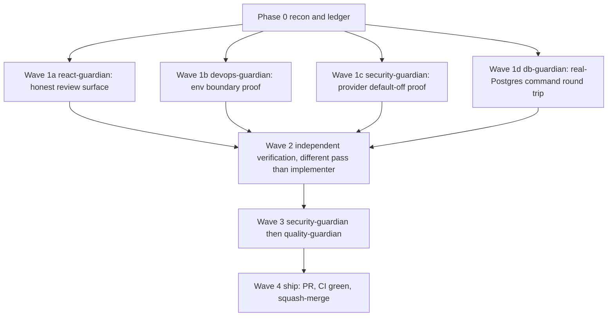
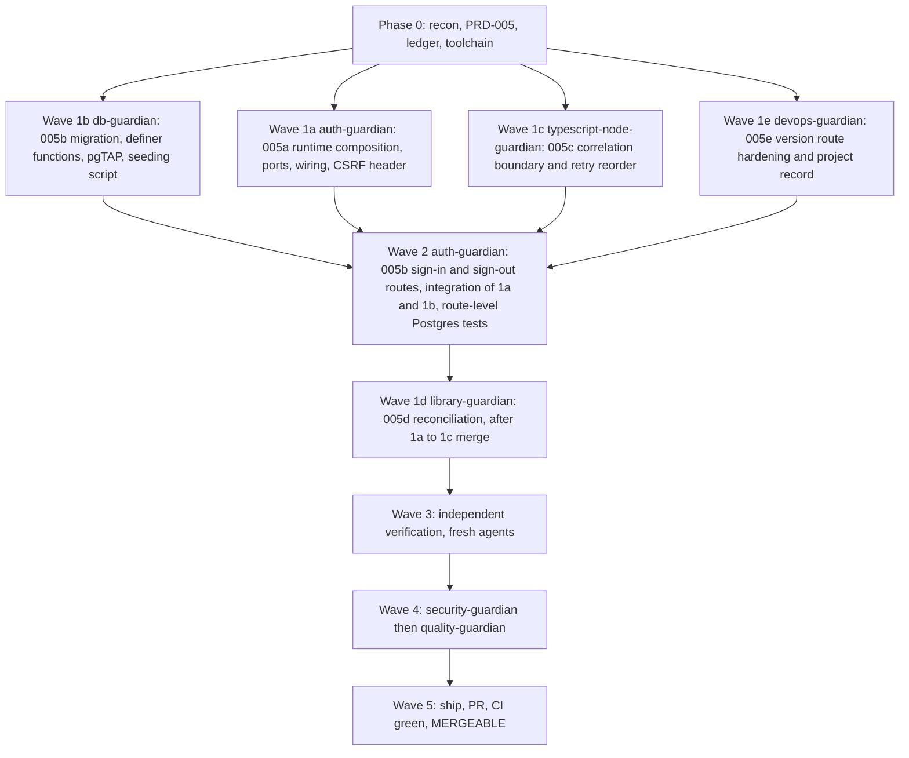

# Operation Automated LO Phase 0 Execution Ledger

## Raid contract

- Branch: `codex/operation-automated-lo-phase-0`
- Baseline: `f3f2b05d33ffb5ca1657278f85ab816fba147727`
- Scope authority: PRD-001 index, PRD-001j, and the 2026 Build Readiness and Research Gate
- Authorized scope: evidence-producing Phase 0 scaffold and harnesses only
- Prohibited scope: production campaign functionality, live customer changes, live provider writes, external spending, production advertising, any assumption that closes G1 through G7 without named external evidence, and any treatment of G8 as `PASS`
- Status flow: `OPEN` -> `IN PROGRESS` -> `DONE` -> `VERIFIED`

## Acceptance-criteria ledger

| ID | Source | Exact criterion | Dependencies | Owning Guardian | Status | Verification evidence |
| --- | --- | --- | --- | --- | --- | --- |
| P0-001 | PRD-001j, Monorepo and runtime | "Scaffold pnpm workspaces and Turborepo." | None | `typescript-node-guardian` | VERIFIED | Exact pnpm workspace and Turbo configuration resolve 17 projects; frozen install passes. |
| P0-002 | PRD-001j, Monorepo and runtime | "Pin Node 24 LTS and Next.js 16.2.10 or the later patched stable 16.2 release available at scaffold time." | P0-001 | `typescript-node-guardian` | VERIFIED | Node 24.18.0, Next 16.2.10, and React/React DOM 19.2.7 are exact pins. |
| P0-003 | PRD-001j, Monorepo and runtime | "Prefer strict TypeScript 7.0.2 or later stable 7.0.x after the scaffold compatibility suite passes, with the TypeScript 6 compatibility package only for tooling that still needs the compiler API." | P0-001 | `typescript-node-guardian` | VERIFIED | TypeScript 7.0.2 drives product checks; the exact TypeScript 6.0.3 alias is limited to compatibility tooling. |
| P0-004 | PRD-001j, Monorepo and runtime | "Create `apps/web` for Vercel and `apps/tasks` for Trigger.dev." | P0-001, P0-002, P0-003 | `typescript-node-guardian` | VERIFIED | Both app shells typecheck and build under the exact pinned runtime. |
| P0-005 | PRD-001j, Monorepo and runtime | "Create domain, application, contracts, database, auth, HighLevel, AI, billing, rendering, storage, observability, test-support, and UI packages." | P0-001, P0-003 | `typescript-node-guardian` | VERIFIED | All 14 named package shells exist and participate in the workspace graph. |
| P0-006 | PRD-001j, Monorepo and runtime | "Enforce dependency direction and prohibit provider or framework imports in the domain package." | P0-005 | `typescript-node-guardian` | VERIFIED | Boundary audit passes 16 packages and rejects the deliberate domain-to-GHL reverse dependency fixture. |
| P0-007 | PRD-001j, Monorepo and runtime | "Use strict ESM and correct NodeNext relative import extensions." | P0-003, P0-005 | `typescript-node-guardian` | VERIFIED | Strict NodeNext/ES2024 settings and source extension audits pass across all packages. |
| P0-008 | Delivery plan, Phase 0 build | "Monorepo, strict TypeScript, package boundaries, CI, local Supabase, preview environments." Local data must remain synthetic only. | P0-001 | `db-guardian` | VERIFIED | Credential-free validation, local start, data-less reset, and pgTAP all pass on the reserved 5542x port block. Five database assertions pass. The unrelated `equipment-room` project was preserved. |
| P0-009 | Delivery plan, Environment model | Preview uses Vercel preview, Trigger.dev preview branches, Supabase ephemeral preview branches, provider stubs by default, and seeded synthetic data only. | P0-001, P0-008 | `devops-guardian` | VERIFIED | `.github/workflows/ci.yml`, `vercel.json`, and `docs/phase0-preview-environments.md` encode a stub-only, synthetic-only preview contract. Workflow audit passes with 6 of 6 external actions pinned by commit SHA. No live deployment was performed. |
| P0-010 | PRD-001j, Verification and observability | "Provide `pnpm verify` as the canonical local and CI gate." | P0-001 through P0-009 | `typescript-node-guardian` | VERIFIED | Exact Node 24.18.0 and pnpm 11.15.1 frozen install plus the complete `pnpm verify` gate pass. CI invokes the same command. |
| P0-011 | Delivery plan, Phase 0 exit | "`pnpm verify` passes." | P0-010, P0-013 through P0-019 | `quality-guardian` | VERIFIED | Independent QA reran `pnpm verify` under exact Node 24.18.0 and pnpm 11.15.1: 12 test files, 35 tests, 16 typechecks, and 16 builds passed. |
| P0-012 | Delivery plan, Phase 0 exit | "Next.js 16.2.10 or a later patched stable 16.2.x version and its compatible React release are pinned after the official advisory sweep passes." | P0-002 | `dependency-audit-guardian` | VERIFIED | Exact Next 16.2.10 and React/React DOM 19.2.7 pins are peer-valid. Frozen install and `pnpm audit --audit-level=high` pass after exact tar, ws, and engine.io overrides; 3 Moderate findings remain documented. |
| P0-013 | Delivery plan, Phase 0 exit | "TypeScript 7 and any TypeScript 6 compatibility sidecar pass lint, build, tests, editor, and package-tooling checks." | P0-003, P0-010 | `typescript-node-guardian` | VERIFIED | Exact Node 24 verification passes 16 of 16 TypeScript 7 typechecks and builds, with the TypeScript 6 alias confined to compatibility tooling. |
| P0-014 | Delivery plan, Phase 0 build | "HighLevel App Test harness, signed-context fixture, provider schema capture, and golden render fixtures." | P0-004, P0-005 | `gohighlevel-guardian` | VERIFIED | `packages/ghl/src/**` and `tests/contracts/ghl/**` implement fixture replay, signed-context projections, inert live capture, and deterministic provider evidence. |
| P0-015 | Research gate, Core App Test contract suite | "The harness records sanitized request and response fixtures, HTTP status, safe provider IDs, granted scopes, and observed account state. Secrets, tokens, customer data, and live spend are prohibited from fixtures." | P0-014 | `gohighlevel-guardian` | VERIFIED | Strict Zod evidence schemas plus recursive sanitization, tamper hashes, method/path denylist, and secret/PII/spend negative tests pass. |
| P0-016 | Delivery plan, Phase 0 exit | "HighLevel research gates have executable test cases." | P0-014, P0-015 | `gohighlevel-guardian` | VERIFIED | `pnpm test:contracts` passes 4 files and 21 tests. Synthetic G1 through G6 fixtures remain harness evidence. Product-owner gate dispositions for G1 and G4 are `ACCEPTED CONSTRAINT` as of 2026-08-25; G2, G3, G5, and G6 remain blocked pending named external evidence. |
| P0-017 | PRD-001j, Test fixtures | Golden render fixtures cover common and adversarial content, and unchanged versioned inputs produce stable hashes without shipping a production renderer. | P0-004, P0-005 | `typescript-node-guardian` | VERIFIED | Versioned common, long, and adversarial fixtures produce canonical bytes and stable SHA-256 hashes with zero network access. Two visual harness tests pass. |
| P0-018 | PRD-001j, Rendering and storage | Malicious image, SVG, HTML, URL, oversized, mislabeled, corrupt, and high-decompression fixtures are rejected or isolated by the Phase 0 harness. | P0-017 | `security-guardian` | VERIFIED | Eight hostile rendering vectors are rejected by executable tests with zero network calls. |
| P0-019 | Delivery plan, Phase 0 build | "Threat model and provider contract register." | P0-014 through P0-018 | `security-guardian` | VERIFIED | Strict register covers all 32 Phase 0/threat-model entries and all eight external gates with executable completeness and reference checks. |
| P0-020 | PRD-001 index, Delivery sequence | "Run the $500 founding offer against a working demo." The demo must use synthetic data and expose no provider write path. | P0-004, P0-005 | `react-guardian` | VERIFIED | Static `/demo` uses local synthetic fixtures and includes all eight proof surfaces, manual/automated/read-only labels, a 4-minute walkthrough, scope, and refund policy. Typecheck and build pass. |
| P0-021 | Delivery plan, Phase 0 exit | "No production feature traffic." | P0-014 through P0-020 | `security-guardian` | VERIFIED | Fail-closed environment parsing, disabled live adapter, blocked provider contracts, and static source proof show no production traffic or outbound provider transport. |
| P0-022 | PRD-001j, Repository and builds | "A new developer can install, start local database, run web, run tasks, and execute the complete verification suite from documented commands." For Phase 0, provider execution remains fixture-only unless separately authorized. | P0-001 through P0-021 | `quality-guardian` | VERIFIED | Independent QA executed the documented database, web, fixture-only task, and verification paths successfully. All 15 local README links resolve. |

## External gate register

These gates are not acceptance criteria for the Phase 0 implementation raid. G2, G3, G5, G6, and G7 remain external blockers and must not be silently converted to `PASS`. G1, G4, and G8 are recorded as `ACCEPTED CONSTRAINT`, never `PASS`, under product-owner decisions in the raid log and research gate.

| Gate | Current state | Required external evidence |
| --- | --- | --- |
| G1 Distribution contract | ACCEPTED CONSTRAINT | External Marketplace distribution proof removed as a launch prerequisite on 2026-08-25 |
| G2 OAuth and session contract | BLOCKED | HighLevel App Test |
| G3 Meta publish contract | BLOCKED | HighLevel App Test with controlled test assets |
| G4 Special Ad Category contract | ACCEPTED CONSTRAINT | Housing Special Ad Category requirements known and enforced; App Test discovery removed on 2026-08-25 |
| G5 Lead routing contract | BLOCKED | No-spend Meta test lead evidence |
| G6 Billing lifecycle | BLOCKED | Stripe test mode plus HighLevel billing evidence |
| G7 Legal operating model | BLOCKED | Counsel and lender approval |
| G8 Demand | ACCEPTED CONSTRAINT | No 15-paid-founder evidence exists. The product owner directed proceeding without it, commercial validation remains unproven, and 15 paid founders is now a post-start target. |

## Dependency waves

### Wave 1: scaffold and deterministic harness foundation

| Guardian | Model selection | Ownership | Exit criteria |
| --- | --- | --- | --- |
| `typescript-node-guardian` | `gpt-5.6-sol`, high effort. Deep multi-package scaffolding and contract-test work need the strongest coding and reasoning profile available in this harness. | Root workspace and TypeScript configuration, `apps/**`, `packages/**`, test runner, boundary checks, verification scripts, golden render fixture plumbing | P0-001 through P0-007, P0-010, P0-013, and P0-017 are DONE with passing evidence |
| `db-guardian` | `gpt-5.6-terra`, high effort. The bounded local Supabase scaffold needs careful database security judgment without production schema construction. | `supabase/**` only | P0-008 is DONE with synthetic-only local configuration and executable checks |

### Wave 2: provider evidence, preview delivery, and founder demo

| Guardian | Model selection | Ownership | Exit criteria |
| --- | --- | --- | --- |
| `gohighlevel-guardian` | `gpt-5.6-sol`, high effort. OAuth, signed context, provider schemas, no-spend cases, and denylist controls have high security and contract risk. | `packages/ghl/**`, `packages/contracts/**` only where coordinated, and `tests/contracts/ghl/**` | P0-014 through P0-016 are DONE with fixture-only evidence |
| `devops-guardian` | `gpt-5.6-terra`, high effort. Greenfield CI and preview wiring are bounded and tool-heavy. | `.github/**`, preview configuration, and delivery documentation, with no database migration authorship | P0-009 and the CI portion of P0-010 are DONE |
| `react-guardian` | `gpt-5.6-terra`, high effort. The demo is a well-specified synthetic React surface with strict no-write boundaries. | `apps/web/src/app/demo/**` and demo-only components/fixtures | P0-020 is DONE and the demo build passes |

### Wave 3: independent verification and repair

Fresh verifier passes test the Wave 1 and Wave 2 work. Any failed item returns to its owning Guardian. `dependency-audit-guardian` verifies P0-012. Domain owners repair only their own files. The ledger reaches zero `OPEN` and zero `IN PROGRESS` before close-out.

### Wave 4: mandatory close-out

1. `security-guardian`, armed with `security-weapon`, verifies and remediates P0-018, P0-019, and P0-021 plus the full Phase 0 attack surface.
2. `quality-guardian`, armed with `quality-weapon`, verifies P0-011 and P0-022 and independently checks every DONE criterion against its source.
3. Any regression reopens its criterion and returns to the responsible implementation Guardian.

### Wave 5: ship

Fetch `origin/main`, resolve conflicts, rerun `pnpm verify`, confirm mergeability, commit, push, open the PR with this ledger and close-out results, then monitor CI until green.

## Raid log

| Time | Event |
| --- | --- |
| 2026-07-20 | Verified clean baseline `f3f2b05`, fetched `origin/main`, and created `codex/operation-automated-lo-phase-0`. |
| 2026-07-20 | Read the complete PRD-001 corpus, research gate, construction specifications, and threat model. |
| 2026-07-20 | Reconciled authorization to Phase 0 only. G1 through G8 remain blocked. |
| 2026-07-20 | `db-guardian` completed P0-008 under `supabase/**`. Credential-free validation passed; Docker-backed reset and pgTAP remain pending until the local Linux engine is available. |
| 2026-07-20 | `dependency-audit-guardian` completed the official pre-lockfile advisory sweep and established exact pins. Resolved-tree verification remains pending. |
| 2026-07-20 | `devops-guardian` completed P0-009 and the CI configuration portion of P0-010. Static workflow and preview-contract checks passed; integrated verification awaits the lockfile. |
| 2026-07-20 | `dependency-audit-guardian` reran P0-012 against the resolved tree after remediation. Critical and High findings are zero; 3 Moderate transitive findings remain documented. |
| 2026-07-20 | `gohighlevel-guardian` completed P0-014 through P0-016. Contract, safety, signed-context, and G1 through G6 replay tests pass without live provider access. |
| 2026-07-20 | `typescript-node-guardian` completed P0-001 through P0-007, P0-010, P0-013, and P0-017. Exact Node 24.18.0 verification passed with 29 assertions and 16 successful builds. |
| 2026-07-20 | `react-guardian` completed P0-020 with a static synthetic demo and no provider, payment, spend, or customer-data path. |
| 2026-07-20 | `db-guardian` moved the local scaffold onto an unused 5542x port block. Supabase start, reset, and all 5 pgTAP assertions passed without touching the unrelated project on port 54322. |
| 2026-07-20 | `security-guardian` completed the mandatory penultimate pass with 0 Critical and 0 High findings. P0-018, P0-019, and P0-021 are DONE; exact Node 24 verification passes 12 files and 35 tests. |
| 2026-07-20 | `typescript-node-guardian` added the no-network `pnpm tasks:local` runner, and `readme-writing-guardian` rebuilt onboarding around verified Phase 0 commands. |
| 2026-07-20 | `security-guardian` refreshed the audit after the onboarding repair. Exact Node 24 verification passed with no new finding. |
| 2026-07-20 | `quality-guardian` completed independent close-out: 22 of 22 criteria passed with zero Criticals, Warnings, or Suggestions. Every P0 row is VERIFIED; G1 through G8 remain BLOCKED. |
| 2026-07-20 | Watchdog found that the initial documentation worker made no filesystem progress. The worker was terminated and the task was decomposed. |
| 2026-07-20 | Product owner explicitly directed: "Proceed, we are moving without the 15 paid founders." G8 is `ACCEPTED CONSTRAINT`, never `PASS`. No 15-paid-founder evidence exists, and commercial validation remains unproven. G1 through G7 remain `BLOCKED`, and production stays unauthorized until each is `PASS`, `ACCEPTED CONSTRAINT`, or `DEFERRED OUT OF CORE`. |
| 2026-08-25 | Product owner directed removal of the external distribution gate and the mortgage Special Ad Category discovery gate. G1 and G4 are `ACCEPTED CONSTRAINT`, never `PASS`. Housing Special Ad Category remains enforced in product. G2, G3, G5, G6, and G7 remain blocked, and production stays unauthorized. |

## UI Foundation Raid

### UI raid contract

- Branch: `codex/oalo-ui-foundation`
- Initial baseline: `18ad155abcfb896946a1e7b73bd2acacc87be968`
- Shipping baseline after rebase: `ff6b02bd2c65fb4d1be899667b23882907c5589d`
- Initial merged Phase 0 ledger blob: `59f4db6a2195f66174dc13673f7aac79d378f785`
- Rebased Phase 0 ledger blob: `e565b9c9d82a8fc6f4353d906ae31569a39a963e`
- Scope authority: PRD-001 index dashboard acceptance criteria, PRD-001h, and `library/knowledge/private/ux-ui/**`
- Authorized scope: React design-system foundation, authenticated synthetic shell, Platform Overview, onboarding and readiness surfaces, Light/Dark/System behavior, and their deterministic evidence
- Prohibited scope: real authentication, live GoHighLevel OAuth, Meta or Stripe access, AI generation, production routing, customer records, live provider writes, spend, or any UI-derived Launch Ready decision
- Existing P0 rows, owners, statuses, and evidence remain unchanged. UI criteria use the same `OPEN` -> `IN PROGRESS` -> `DONE` -> `VERIFIED` flow.

### UI acceptance-criteria ledger

| ID | Source | Exact criterion | Dependencies | Owning Guardian | Status | Verification evidence |
| --- | --- | --- | --- | --- | --- | --- |
| UIF-000 | Raid handoff, Phase 0 boundary | Preserve every existing P0 ledger row, owner, status, and evidence while appending a separate UI Foundation section. | None | `quality-guardian` | VERIFIED | After rebasing, the `origin/main` ledger blob is `e565b9c9d82a8fc6f4353d906ae31569a39a963e`. Its complete pre-UI content and the current prefix are ordinal-equal and share normalized SHA-256 `756cfdd4d54c945823af2544e88238fc48c78c8d91169e6e5d040202d4fa0470`. |
| UIF-001 | UX master tokens and design brief | Implement semantic Light and Dark tokens for canvas, surfaces, text, borders, actions, status, focus, elevation, type, spacing, radius, breakpoints, and motion. Product components must not consume raw palette values. | UIF-000 | `ux-ui-guardian` | VERIFIED | Independent token and theme verification passed semantic coverage, WCAG AA, Phase 0 compatibility, package build, stylesheet export, consumer resolution, and source/dist SHA-256 equality. |
| UIF-002 | PRD-001 dashboard AC, UX design brief | Provide an accessible Light, Dark, and System segmented control with visible selected state, text, and glyph. | UIF-001, UIF-021 | `dark-mode-theming-guardian` | VERIFIED | Independent exact Node 24 verification confirms the accessible three-option radiogroup, visible glyph and text selection, and keyboard behavior. |
| UIF-003 | UX design brief, Theme behavior | First visit follows the operating-system preference. System follows later media-query changes, while explicit Light or Dark remains stable. | UIF-002 | `dark-mode-theming-guardian` | VERIFIED | Independent exact Node 24 verification confirms first-visit System behavior, live media changes, and stable manual modes. |
| UIF-004 | PRD-001 dashboard AC, UX design brief | Theme changes persist without reload, navigation, refetch, or loss of route, focus, scroll, disclosure, checklist, or local form state. | UIF-002, UIF-003 | `dark-mode-theming-guardian` | VERIFIED | Independent jsdom verification confirms theme changes preserve local application state without navigation, reload, refetch, or writes. |
| UIF-005 | UX design brief, First paint | Apply the correct theme before first paint without hydration mismatch or flash of the wrong theme. Hydration suppression is limited to the root theme attribute. | UIF-002, UIF-003 | `dark-mode-theming-guardian` | VERIFIED | Independent pinned-Chromium evidence confirms stored Dark is present on the first animation frame without a Light sample, hydration warning, or page error; root-only suppression remains intact. |
| UIF-006 | UX design brief, Tenant theming | Accept only server-validated semantic tenant accent overrides with complete Light and Dark values, contrast validation, and safe fallback. User-provided CSS or raw primitive overrides are prohibited. | UIF-001 | `dark-mode-theming-guardian` | VERIFIED | Independent source and exact Node 24 test verification confirms fixed allowlisted Light/Dark semantic-variable projection, safe fallback, and no client-controlled arbitrary CSS path. |
| UIF-007 | UX accessibility contract | Meet WCAG AA contrast, visible 2 px focus with 3 px offset, non-color status communication, readable disabled states, and reduced-motion behavior. | UIF-001, UIF-002 | `ux-ui-guardian` | VERIFIED | Final Quality confirms axe-clean Light/Dark desktop/mobile and open-drawer states, visible focus, readable disabled states, non-color labels and glyphs, and reduced motion. |
| UIF-008 | PRD-001 dashboard AC, Campaign and artifact workflow | Theme and dashboard UI state must remain structurally absent from campaign inputs, approval projections, artifact manifests, canonical bytes, identifiers, and hashes. | UIF-004 | `react-guardian` | VERIFIED | Final Quality confirms strict local schemas exclude UI state, reject unknown keys, and preserve deterministic approval bytes, SHA-256, manifest IDs, approval IDs, and artifact IDs. |
| UIF-009 | Application shell specification | Build the authenticated shell with the full nine-item navigation, subordinate Marketing navigation, selected, expanded, collapsed, restricted, unavailable, planned, and degraded states, plus accessible desktop, compact rail, and mobile drawer behavior. | UIF-001, UIF-021 | `react-guardian` | VERIFIED | Independent pinned-Chromium verification confirms the full nine-item shell, accessible 80 px CSS compact rail, explicit collapse, state-aware labels and tooltips, subordinate Marketing behavior, and mobile drawer. |
| UIF-010 | Application shell specification, PRD-001h | Render validated synthetic session context for location, user, and role. The browser must not derive tenant or authority from URL state and must not expose an arbitrary location switcher. | UIF-009 | `react-guardian` | VERIFIED | Independent verification confirms strict synthetic session projection, capability-based access, no URL-derived authority, and no location switcher. |
| UIF-011 | PRD-001h, Status and attention specification | Readiness and attention states show safe server-shaped evidence, freshness, last verification, invalidation, responsible party, remediation, and next authorized action. | UIF-009, UIF-010 | `react-guardian` | VERIFIED | Independent verification confirms readiness and attention evidence, including freshness, remediation, responsibility, next action, exception code, and correlation ID. |
| UIF-012 | Safe action contract | Create and other consequential actions remain authority-aware, disabled when prerequisites fail, and accompanied by persistent reason, responsible party, and next action. UI code never derives authorization. | UIF-010, UIF-011 | `react-guardian` | VERIFIED | Independent verification confirms consequential actions fail closed with persistent prerequisite and authority evidence. |
| UIF-013 | Platform Overview screen specification | Render the required header, health strip, authorized quick actions, Business Pulse, Active Work, Attention Queue, Recent Activity, and Workspace Status. The page remains useful without an active campaign. | UIF-009 through UIF-012 | `react-guardian` | VERIFIED | Independent build and integration verification confirms every required `/overview` region and usefulness without an active campaign. |
| UIF-014 | Platform Overview, Source-of-truth policy | Every metric exposes value, source, and freshness. Unavailable, stale, partial, and true zero remain distinct. Synthetic values are visibly labeled with source and timestamp. | UIF-013 | `react-guardian` | VERIFIED | Independent verification confirms all six metric truth states, provenance, freshness, synthetic labeling, and explicit-zero semantics. |
| UIF-015 | UX design brief, Platform Overview | Cover loading, new workspace, setup incomplete, blocked, healthy without campaign, provider degraded, unavailable data, restricted viewer, authorized agency, route error, and safe retry states without inventing healthy or zero data. | UIF-013, UIF-014 | `react-guardian` | VERIFIED | Independent verification confirms the eleven-state Overview matrix and safe local retry behavior. |
| UIF-016 | PRD-001h, Onboarding screen specification | Render Get Connected with exactly five outcome items and Launch Readiness with exactly four items. Launch Readiness remains locked until Get Connected is satisfied, and each item routes to its exact completion surface. | UIF-009 through UIF-012 | `react-guardian` | VERIFIED | Independent verification confirms exactly five Get Connected and four locked Launch Readiness items with completion routes. |
| UIF-017 | PRD-001h, Onboarding state model | Model each onboarding item as not_started, in_progress, blocked, complete, or stale with text and glyph. Completion evidence includes verifier version, verification time, safe evidence, and permitted provider IDs. The browser cannot set completion or Launch Ready. | UIF-016 | `react-guardian` | VERIFIED | Independent verification confirms all five onboarding states, completion evidence, permitted synthetic provider IDs, and read-only browser authority. |
| UIF-018 | UX README, Raid boundary | All dashboard and onboarding data is frozen, strictly parsed, visibly synthetic, writes-disabled, and unable to record approval, readiness, publication, provider access, or customer data. | UIF-010, UIF-013, UIF-016 | `react-guardian` | VERIFIED | Independent verification confirms strict parsing, recursive freezing, visible synthetic disclosure, and provider, network, and write isolation. |
| UIF-019 | UX design brief, Responsive priorities | At 1180 px preserve Business Pulse, Active Work, and Attention with compact navigation. At 390 px prioritize readiness, two highest-value quick actions, four priority metrics, and attention before lower-priority content. | UIF-013 through UIF-018 | `ux-ui-guardian` | VERIFIED | Final Quality confirms the 1180 px desktop priorities and the 390 px ordering with exactly two primary actions, four primary metrics, and Attention before secondary content. |
| UIF-020 | UX accessibility contract | Support keyboard and screen reader flows, drawer focus trap, Escape, background scroll lock, focus return, logical checklist order, 44 px touch targets, reduced motion, and no ambient dashboard animation. | UIF-009, UIF-016, UIF-019 | `ux-ui-guardian` | VERIFIED | Final Quality confirms focus, 44 px targets, checklist order, drawer trap, Escape, scroll lock, focus return, reduced motion, screen-reader semantics, and drawer-open axe. |
| UIF-021 | UX source-of-truth change control | Product UI consumes governed `@oalo/ui` wrappers, semantic tokens, and approved icons. Existing Phase 0 demo files remain isolated, and product code imports no canvas examples, demo styles, or raw library primitives. | UIF-001 | `ux-ui-guardian` | VERIFIED | Fresh React verification passed exact Node 24 frozen install, package typecheck/build, 12 focused tests, CSS hashes and exports, web typecheck/build, semantic scans, and canonical contract alignment. |
| UIF-022 | React and theme verification | Add separate strict unit and jsdom integration coverage for fixture parsing, navigation access, theme behavior, drawer and checklist interaction, state continuity, status semantics, and retry behavior. Async Server Components are not rendered in jsdom. | UIF-002 through UIF-021 | `react-guardian` | VERIFIED | Independent exact Node 24 verification passes 12 shared UI tests, 24 unit tests, 13 jsdom tests, 16 package typechecks, and the graph-aware production build. |
| UIF-023 | PRD-001 dashboard AC, Artifact invariance | Assert identical canonical approval bytes and SHA-256 values before and after Light, Dark, and System changes, with unchanged artifact and approval identifiers and no generation, approval, provider, or network request. | UIF-008, UIF-022 | `react-guardian` | VERIFIED | Final Quality confirms byte-identical canonical approval evidence, SHA-256, approval, manifest, and artifact IDs across Light, Dark, and System with zero transition requests. |
| UIF-024 | UX evidence contract | Capture Overview and Onboarding in Light and Dark at 1180 x 900 and 390 x 844, plus drawer and state galleries. Run keyboard flows, automated accessibility scans, hydration-console checks, and first-paint theme checks. | UIF-005, UIF-007, UIF-013 through UIF-023 | `ux-ui-guardian` | VERIFIED | Final Quality confirms ten synthetic-only screenshots, the evidence summary, eight route/theme/viewport axe scans, drawer-open axe, keyboard flows, zero hydration/page errors, and first-paint evidence. |
| UIF-025 | Phase 0 verification contract | Use exact dependency versions, preserve the frozen lockfile contract, install the required browser explicitly, and include UI unit, integration, and browser suites in root `pnpm verify`. | UIF-022 through UIF-024 | `react-guardian` | VERIFIED | Final exact Node 24.18.0 and pnpm 11.15.1 `pnpm verify` passes with 76 non-browser tests, 15 browser tests, 16 typechecks, 16 builds, all audits, and 0 clones. |
| UIF-026 | Asset registry contract | Determine whether the Universal Asset Registry exists at implementation time. If adopted, register and drift-check all new pages, routes, surfaces, controls, nav entries, tokens, icons, fonts, motion, and breakpoints. If absent, record `not applicable: registry not adopted` with evidence and do not invent a production catalog. | UIF-009 through UIF-025 | `asset-guardian` | VERIFIED | `not applicable: registry not adopted`. Asset Guardian inventory found no registry KB, schema/models, migrations, scripts, drift output, code annotations, or catalog directories; `packages/db` remains a Phase 0 shell. No catalog was invented. |
| UIF-027 | Mandatory security close-out | Audit the entire UI foundation and remediate every Critical and High finding. Confirm CSP and embedding decisions, synthetic-data isolation, client/server trust boundaries, dependency posture, and absence of sensitive browser storage. | UIF-001 through UIF-026 | `security-guardian` | VERIFIED | Security audit reports 0 Critical and 0 High findings. Synthetic and provider isolation, fixed theme storage, strict tenant-accent projection, approval invariance, trust boundaries, security headers, secrets, package boundaries, and dependency posture were verified. Four non-blocking Moderate follow-ups remain: nonce or hash CSP and three transitive advisories. |
| UIF-028 | Mandatory quality close-out | Independently verify every UIF criterion after security, including exact source traceability, automated evidence, visual evidence, accessibility, responsive priorities, and unchanged P0 content. | UIF-027 | `quality-guardian` | VERIFIED | Final Quality report has no Critical, Warning, or Suggestion findings. All five axes pass; UIF-000 through UIF-028 are independently traced and verified. |
| UIF-029 | Raid shipping contract | Rebase onto current `origin/main`, rerun exact-runtime verification, confirm a clean worktree and MERGEABLE green PR, and open the ready PR without merging it. | UIF-028 | `quality-guardian` | VERIFIED | Ready PR #10 remains open and not draft. At head `f917a3543360b2b23c380a056332322920cb251b`, GitHub Actions run `29815891707` passed canonical verification and preview smoke, and GitHub reported `MERGEABLE` with merge state `CLEAN`. `origin/main` at `ff6b02bd2c65fb4d1be899667b23882907c5589d` is an ancestor, and the post-rebase exact local gate passed. |

### UI dependency waves

#### UI Wave 1: source contracts and runtime foundations

| Guardian | Model selection | Ownership | Exit criteria |
| --- | --- | --- | --- |
| `ux-ui-guardian` | `gpt-5.6-sol`, high effort. Cross-document component contracts, responsive composition, and visual evidence require deep design-system reasoning. | `packages/ui/**`, UX component and screen specifications, semantic product styles, icons, and visual baselines | UIF-001, UIF-007, UIF-019, UIF-020, and UIF-021 are DONE with contract and visual evidence. |
| `dark-mode-theming-guardian` | `gpt-5.6-terra`, high effort. The theme runtime is bounded but hydration-sensitive and test-heavy. | `apps/web/src/theme/**`, root theme bootstrap, persistence, tenant override validation, and theme-specific tests | UIF-002 through UIF-006 are DONE without flash, hydration drift, or state loss. |
| `react-guardian` | `gpt-5.6-sol`, high effort. The shell, Overview, onboarding state model, and evidence harness span multiple React 19 and Next.js 16 boundaries. | `apps/web/src/app/(authenticated)/**`, `apps/web/src/features/**`, synthetic UI fixtures, UI tests, Playwright configuration, and coordinated root scripts | UIF-008 through UIF-018 and UIF-022 through UIF-025 are DONE with exact-runtime evidence. |

#### UI Wave 2: integration, evidence, and asset reconciliation

Fresh cross-owner verification repairs any integration drift. `asset-guardian` then resolves UIF-026 without inventing a registry. Visual and automated evidence must be complete before any implementation criterion moves from DONE to VERIFIED.

#### UI Wave 3: mandatory close-out

1. `security-guardian`, armed with `security-weapon`, completes UIF-027 and remediates Critical and High findings.
2. `quality-guardian`, armed with `quality-weapon`, completes UIF-000, UIF-028, and UIF-029 only after security is clean.
3. Any regression reopens its owning criterion and returns to the responsible Guardian.

#### UI Wave 4: ship without merge

Fetch and rebase on `origin/main`, rerun the exact Node 24 and pnpm 11 frozen-install gate, push the branch, open the ready PR, monitor CI to green, and confirm GitHub reports `MERGEABLE`. Do not merge the UI Foundation PR.

### UI raid log

| Time | Event |
| --- | --- |
| 2026-07-20 | Read-only recon completed while PR #5 remained open. No UI implementation branch or product file was changed. |
| 2026-07-20 | PR #5 and the post-merge full-review fixes in PR #8 merged. All 22 P0 rows remain VERIFIED. |
| 2026-07-20 | Fetched `origin/main` at `18ad155`, verified the merged P0 ledger, and created `codex/oalo-ui-foundation`. |
| 2026-07-20 | Appended UIF-000 through UIF-029 without changing any existing P0 row. UI Wave 1 is ready for armed Guardian dispatch. |
| 2026-07-20 | Dispatched `ux-ui-guardian` for UIF-001 and the implementation-ready source contract that unlocks the theme and React lanes. |
| 2026-07-20 | Watchdog interrupted the first UIF-001 brief after it stalled in broad documentation review without file changes. Decomposed the work into semantic tokens and contrast first, then component specifications. |
| 2026-07-20 | Watchdog interrupted the decomposed UIF-001 run after a second no-edit stall. Reduced ownership to the `@oalo/ui` semantic token deliverable and contrast proof only. |
| 2026-07-20 | Retired the original UIF-001 Guardian instance after a third no-edit stall and re-dispatched the two-file token task to a fresh armed `ux-ui-guardian`. |
| 2026-07-20 | Fresh `ux-ui-guardian` completed UIF-001. Light faint/card is 4.97:1, Light primary action is 4.55:1, Dark faint/card is 7.40:1, Dark primary action is 5.22:1, and all status pairs pass 4.5:1. Dispatched independent theme-side verification. |
| 2026-07-20 | Independent `dark-mode-theming-guardian` reopened UIF-001. Semantic and contrast checks pass, but `@oalo/ui/tokens.css` fails with `ERR_PACKAGE_PATH_NOT_EXPORTED`; returned the packaging defect to the UX owner. |
| 2026-07-20 | UX owner fixed the stylesheet export and deterministic CSS build. Independent theme verification passed package build, web consumer resolution, byte equality, formatting, and all prior semantic checks. UIF-001 moved to VERIFIED and UIF-021 began. |
| 2026-07-20 | Watchdog interrupted the initial UIF-021 documentation and wrapper lanes after both stalled before file changes. Decomposed into source specifications, interactive controls, state/data primitives, and a later shared-export integration pass. |
| 2026-07-20 | Decomposed UIF-021 work completed: six new component specs, four governing spec extensions, interactive controls, state/data primitives, shared package integration, exact CSS output, and 8 focused tests. UIF-021 moved to DONE for independent React verification. |
| 2026-07-20 | Independent React verification reopened UIF-021. Build and packaging pass, but six specs use the wrong package name and public Button, SafeAction, AsyncState, and Metric unions drift from their canonical contracts. Returned documentation and code defects to separate UX owners. |
| 2026-07-20 | Documentation identity repair completed. Component API repair added the canonical variants and states, then a separate test-repair pass reached exact Node 24 typecheck with three stale tests. Watchdog stopped its non-reporting tail and dispatched fresh React re-verification. |
| 2026-07-20 | Fresh React re-verification passed exact Node 24 frozen install, UI typecheck/build, 12 tests, CSS hashes and exports, web typecheck/build, formatting, scans, and repaired contract alignment. UIF-021 moved to VERIFIED; dark-mode and React implementation lanes began in parallel. |
| 2026-07-20 | Dark-mode lane completed UIF-002, UIF-003, UIF-005, and UIF-006 with 8 pure tests and a production build. UIF-004 remains IN PROGRESS until the shared jsdom harness runs its state-continuity test; exact Node 24 integration verification remains pending. |
| 2026-07-20 | React lane completed UIF-009 through UIF-018 and UIF-022. Exact Node 24 passes 16 typechecks, 24 unit tests, 13 jsdom tests including theme continuity, and the graph-aware `/overview` and `/onboarding` production build. Dispatched integrated independent verification. |
| 2026-07-20 | Independent integrated verification marked UIF-002 through UIF-004, UIF-010 through UIF-018, and UIF-022 VERIFIED; held UIF-005 at DONE pending browser FOWT proof; reopened UIF-006 for unapplied tenant accents and UIF-009 for unnamed CSS-compacted navigation links. |
| 2026-07-20 | Dark-mode repair completed UIF-006 with server-only fixed semantic-variable projection for accepted Light/Dark accents, safe fallback, 10 pure theme tests, one jsdom runtime test, typecheck, and graph-aware build. |
| 2026-07-20 | React shell repair completed UIF-009 with unconditional accessible navigation names and tooltips across CSS-driven and user-driven compact modes; focused integration, typecheck, and graph-aware build pass. |
| 2026-07-20 | React evidence lane completed UIF-008, UIF-023, and UIF-025: three strict projection contracts and one pinned Chromium invariance scenario pass on exact Node 24; frozen install, strict browser typecheck, lint, format, and graph build pass. Independent review also marked repaired UIF-006 VERIFIED. |
| 2026-07-21 | UX evidence lane completed UIF-007, UIF-019, UIF-020, and UIF-024 with a 14/14 pinned-Chromium matrix, 10 visually inspected synthetic screenshots, axe-clean Light/Dark desktop/mobile and open-drawer states, first-paint/hydration evidence, responsive priority assertions, and focus/touch/motion checks. UIF-005 and repaired UIF-009 are independently VERIFIED. |
| 2026-07-21 | Asset Guardian marked UIF-026 VERIFIED as `not applicable: registry not adopted`; no registry KB, schema, migration, script, generator output, annotations, or catalog exists, and `packages/db` is still the Phase 0 shell. |
| 2026-07-21 | Security Guardian marked UIF-027 VERIFIED with 0 Critical and 0 High findings. Four non-blocking Moderate follow-ups remain: nonce or hash CSP, PostCSS, OpenTelemetry core, and development-only esbuild advisories. The audit also repaired local declaration of pinned web test dependencies so the 16-package boundary gate passes. |
| 2026-07-21 | Quality preflight found the root zero-duplication gate failing on seven clone groups. Implementation consolidated shared semantic link styling, status rendering, metric schema fields, and evidence details; `jscpd` now reports 0 clones. Post-repair Security reran secrets, product types, package boundaries, production audit, and diff checks with unchanged 0 Critical and 0 High findings. |
| 2026-07-21 | Final Quality marked UIF-000 through UIF-028 VERIFIED with no Critical, Warning, or Suggestion findings. Exact Node 24.18.0 and pnpm 11.15.1 `pnpm verify` passes 76 non-browser tests, 15 Chromium tests, 16 typechecks, 16 builds, all audits, and 0 clones. UIF-029 remains the ordered shipping step. |
| 2026-07-21 | Rebase resolved the sole ledger conflict by preserving `origin/main` PR #9 G8 evidence verbatim and retaining the separate UI section. The rebased main ledger and current pre-UI prefix are ordinal-equal with normalized SHA-256 `756cfdd4d54c945823af2544e88238fc48c78c8d91169e6e5d040202d4fa0470`. |
| 2026-07-21 | Ready PR #10 opened MERGEABLE. Its first canonical GitHub run exposed that Linux CI did not provision Playwright Chromium. The read-only SHA-pinned workflow now installs the pinned Chromium build and system dependencies before verification. Security reran with 0 Critical and 0 High findings, then the complete local `pnpm verify` gate passed again. UIF-029 remains OPEN pending repaired green GitHub evidence. |
| 2026-07-21 | Repaired GitHub Actions run `29815891707` passed canonical verification in 2 minutes 59 seconds and preview smoke in 23 seconds at head `f917a3543360b2b23c380a056332322920cb251b`. GitHub reports ready PR #10 `MERGEABLE` with merge state `CLEAN`; `origin/main` is an ancestor and the PR remains open and unmerged. UIF-029 is VERIFIED. |

---

# Gauntlet Raid: Go-Live Remaining In-Repo Code

This section is **additive**. Every Phase 0 (`P0-*`) and UI Foundation (`UIF-*`) row above remains unchanged, with its original owner, status, and evidence.

## Raid contract

- Branch: `cursor/gauntlet-go-live-remaining-code-b085`
- Baseline: `origin/main` at `6d5982f` (after PRD-003d `26051b3`, PRD-003c `71c371d`, App Test maps `65dd527`, PRD-003 ledger sync `#59`)
- Scope authority: PRD-003 index (`APA-*`), PRD-004 index and PRD-004a (`RGL-*`, `004A-AC-*`) as authored in draft PR #60, and the non-`VERIFIED` rows of `PRODUCTION_EXECUTION_LEDGER.md`
- Authorized scope: **remaining in-repo code only.** Locally provable acceptance criteria, their tests, and the CI wiring that proves them.
- Prohibited scope: live Marketplace submission, Developer Portal sign-in, Vercel env mutation, cloud deploy, live HighLevel / Meta / Stripe / KMS / counsel evidence, inventing G2 fixtures, flipping any of the 28 `DEFERRED: LIVE HIGHLEVEL AUTH` rows, PRD-002 add-ons, and any edit to `library/**`, `NEXT_BATCH_LEDGER.md`, `.cursor/rules/core/the-map.mdc`, or `docs/operations/evidence-packs/**` while PR #60 is open
- Status flow: `OPEN` -> `IN PROGRESS` -> `DONE` -> `VERIFIED`, with `BLOCKED` reserved for rows carrying an exact operator ask
- The-neeson overlay: `../the-neeson` is **not clonable** (no such repository under `jzferrell26`). Per `AGENTS.md`, this raid falls back to this repository's `.cursor/skills/` snapshot.

## Scope determination

`PRODUCTION_EXECUTION_LEDGER.md` holds 305 PRD-001 acceptance-criteria rows. Exact status counts on `6d5982f`:

| Status string | Count | Bucket |
| --- | ---: | --- |
| `VERIFIED` | 267 | Already terminal |
| `DEFERRED: LIVE HIGHLEVEL AUTH` | 28 | Blocked-external (G2) |
| `BLOCKED: EXTERNAL EVIDENCE` | 7 | Blocked-external |
| `ACCEPTED CONSTRAINT` | 2 (AC rows) | Product-owner disposition |
| `BLOCKED: G5` | 1 | Blocked-external |

267 + 28 + 7 + 2 + 1 = 305. **There are zero locally provable OPEN PRD-001 acceptance criteria.** The three remaining `ACCEPTED CONSTRAINT` and four `BLOCKED` / `DEFERRED FOR NOW` strings in that file are external-gate rows, not acceptance criteria.

Therefore this raid's actionable surface is exactly the locally provable code portion of PRD-003 parent closeout and PRD-004a, cross-checked against the Librarian's inventory at `docs/remaining-requirements.md` in the Project store.

## Acceptance-criteria ledger

| ID | Source PRD | Exact criterion | Status | Owner |
| --- | --- | --- | --- | --- |
| GGL-001 | PRD-004 index, `RGL-002` | "Given a review preview URL, when `/overview` loads for an authenticated tenant without persisted spend/leads, then the surface shows honest empty or not-connected states and is not unlabeled synthetic demo data." | VERIFIED | `react-guardian` |
| GGL-002 | PRD-004a, `004A-AC-003` | "`/overview` does not show unlabeled synthetic spend/leads on the review URL." | VERIFIED | `react-guardian` |
| GGL-003 | PRD-004 index, `RGL-001` (code portion only) | "Given the existing Vercel project `operation-automated-lo-web`, when a preview deployment is promoted for review, then server-only env includes `OALO_DATABASE_URL` and other required secrets without `NEXT_PUBLIC` leakage, and the deployment is not a second Vercel project." | VERIFIED | `devops-guardian` |
| GGL-004 | PRD-004a, `004A-AC-002` (code portion only) | "`OALO_DATABASE_URL` and auth secrets are server-only env vars on Vercel." | VERIFIED | `devops-guardian` |
| GGL-005 | PRD-004 index, `RGL-007` | "Given this batch completes, when external gates are checked, then no HighLevel provider write, Meta publish, lead routing, or Stripe charge is newly enabled by default." | VERIFIED | `security-guardian` |
| GGL-006 | PRD-003 index, `APA-008` | "Given this batch is complete, when the production verification gate runs, then no HighLevel, Meta, Stripe, lead-routing, or other provider side effect is newly enabled by default." | VERIFIED | `security-guardian` |
| GGL-007 | PRD-004 index, `RGL-008` | "Given G2 deferred criteria, when this batch completes, then none of the 28 `DEFERRED: LIVE HIGHLEVEL AUTH` rows flip to `VERIFIED` without sanitized fixtures passing `pnpm test:contracts`." | VERIFIED | `quality-guardian` |
| GGL-008 | PRD-004a, `004A-AC-004` (local-provable equivalent) | "Create Open House Boost -> navigate away -> reload -> campaign still present (Postgres)." Proven locally through the web command stack against real Postgres in the canonical database gate, not only at the repository layer. | VERIFIED | `db-guardian` |
| GGL-009 | PRD-004a, `004A-AC-005` (local-provable equivalent) | "Authorized approver can approve; aggregate shows approved state after reload." Proven locally through the approval command/handler against real Postgres with a fresh read path, not direct SQL. | VERIFIED | `db-guardian` |
| GGL-010 | PRD-003 index, `APA-010` | "Given the completed implementation, when security and quality review run, then the batch has no unresolved Critical or High security finding and every PRD-003 acceptance criterion is traceable to code and tests before merge." | VERIFIED | `quality-guardian` |

### Blocked rows with exact operator asks

These are parked, not skipped. Each carries a specific ask. None is silently dropped, and none may be flipped by this raid.

| ID | Source | Exact criterion | Status | Exact operator ask |
| --- | --- | --- | --- | --- |
| GGL-B01 | PRD-004a, `004A-AC-001` | "Preview deployment uses project `operation-automated-lo-web` only." | BLOCKED | Grant Vercel access to project `operation-automated-lo-web`, or run the preview deploy yourself with root directory `apps/web`. No second project. |
| GGL-B02 | PRD-004a, `004A-AC-006` | "Smoke log retained per evidence pack; no tokens or PII in git." | BLOCKED | Run the smoke checklist after the preview deploy and retain the log outside git. |
| GGL-B03 | PRD-004 index, `RGL-003` (deploy portion) | "Given a review preview URL and Test Link or authorized session, when an operator creates an Open House Boost, reloads the page, and approves it, then campaign evidence is read from Postgres and the flow matches PRD-003 APA-001 through APA-006." | BLOCKED | Provide a review/staging `OALO_DATABASE_URL` (not production seed data) as a server-only env var on the preview environment. |
| GGL-B04 | PRD-004b, `004B-AC-001` | "Inspection checklist in submission packet is complete with listing type recorded." | BLOCKED | Sign in at `marketplace.gohighlevel.com/login` and record app name, version, visibility, publisher, OAuth scopes, HTTPS callback, Custom Page URL, and listing type. |
| GGL-B05 | PRD-004b, `004B-AC-002` | "OAuth callback and Custom Page URL match the verified preview hostname." | BLOCKED | Decide the review hostname (existing `operation-automated-lo-web.vercel.app` vs a custom domain) and set it in the Developer Portal. |
| GGL-B06 | PRD-004b, `004B-AC-003` | "Test Link install succeeds into a sandbox location." | BLOCKED | Create an App Test Account and run Manage -> Versions -> Test Link against a sandbox location. |
| GGL-B07 | PRD-004b, `004B-AC-004` | "Operator can reach create -> persist -> approve on preview after install." | BLOCKED | Depends on GGL-B03 and GGL-B06. |
| GGL-B08 | PRD-004b, `004B-AC-005` | "No tokens, client secrets, or PII committed to git." | BLOCKED | Keep operator notes outside git. Repo-side enforcement is covered by `pnpm audit:secrets` under GGL-003. |
| GGL-B09 | PRD-004c, `004C-AC-001` through `004C-AC-005` | Submission packet artifacts complete; listing claims only create -> persist -> approve; Loom matches live Test Link; screenshots contain no misleading synthetic spend/lead metrics; submission recorded with date and no secrets in git. | BLOCKED | Depends on GGL-B03 and GGL-B06. Packet authorship lives in `library/**`, which PR #60 owns. |
| GGL-B10 | PRD-001, 28 rows | The 28 `DEFERRED: LIVE HIGHLEVEL AUTH` acceptance criteria (`001J-AC-022/023/024/028`, `001A-AC-005` through `001A-AC-016`, `001A-AC-018` through `001A-AC-023`, `001A-AC-026/028/038`, `001H-AC-002/003/005`). | BLOCKED | Sanitized HighLevel App Test fixtures that pass `pnpm test:contracts`. Do not invent G2 evidence. |
| GGL-B11 | PRD-001, `001J-AC-026`, `001J-AC-029` | Per-environment KMS rotation and recovery proof; preview/staging/production isolation inventory. | BLOCKED | Cloud owner with KMS and environment inventory access (Wave 2). |
| GGL-B12 | PRD-001, `001J-AC-033`, `001H-AC-001`, `001I-AC-007`, `001I-AC-014` | Launch Ready and AI cost operations evidence. | BLOCKED | Operations owner evidence pack (Wave 7). |
| GGL-B13 | PRD-001, `001I-AC-013` | Legal / AI data handling evidence. | BLOCKED | Counsel sign-off (Wave 6). |
| GGL-B14 | PRD-001, `001F-AC-026` | G5 synthetic lead evidence. | BLOCKED | No-spend Meta test lead capture (Wave 4). |
| GGL-B15 | PRD-001, `001E-AC-005`, `001E-AC-006` | G4 Housing Special Ad Category rows. | ACCEPTED CONSTRAINT | None. Product-owner disposition. Do not reopen. |
| GGL-B16 | Raid-internal, blocked the automated half of GGL-008 and GGL-009 | Run `packages/db/test/*.integration.test.mjs` inside the canonical `pnpm test:db` gate so the real-Postgres command round trips are enforced by CI. | **CLOSED** | None. Resolved in the raid's second run. The four failed attempts were all solving the wrong problem: provisioning was never the obstacle. The foundation migration grants `migration_owner` to the login role `WITH SET TRUE, INHERIT FALSE` and makes it own every schema, so a login role holds no privileges until it explicitly assumes that role, and only a SUPERUSER could reach the tables without doing so. The harness seeded and tore down as the bare login role, which is why it worked against a plain Postgres and failed `42501` on Supabase local. The harness now assumes `migration_owner` inside a `SET LOCAL` transaction exactly as the pgTAP suites do. |

### Out of scope by instruction

- PRD-003a / 003b / 003c / 003d implementation: already on `main`. Not restarted.
- PRD-002a through 002h: `backlog/`, no implementation authorized.
- `library/**` PRD authorship: owned by the Librarian's draft PR #60.

## Wave plan

### Wave 1: parallel implementation

| Lane | Owner | Model | Owns | Files it may touch | Exit criteria |
| --- | --- | --- | --- | --- | --- |
| 1a | `react-guardian` | `claude-opus-5-thinking-high` — the honest-surface boundary is a cross-cutting trust decision where a wrong call ships misleading data to a Marketplace reviewer. Strongest reasoning tier. | GGL-001, GGL-002 | `apps/web/src/server/authenticated-workspace-data.ts`, `apps/web/src/features/overview/**`, `apps/web/src/features/shell/**`, `packages/ui/src/components/metric.tsx` and its test, new/updated tests alongside | Every authenticated surface in review mode is honest empty / not-connected or carries a visible synthetic label; new tests fail before the fix and pass after |
| 1b | `devops-guardian` | `composer-2.5` — bounded, mechanical config-and-audit work against a clear spec. | GGL-003, GGL-004 | `packages/config/src/environment.ts`, `tooling/scripts/audit-secrets.mjs`, `tooling/tests/unit/delivery-observability/**` | An automated gate fails if a server secret name ever appears in the public `NEXT_PUBLIC_*` allowlist, and `pnpm verify:offline` runs it |
| 1c | `security-guardian` | `claude-opus-5-thinking-high` — provider default-off is the single highest-consequence invariant in the repo. | GGL-005, GGL-006 | `tests/security/**`, `tooling/tests/unit/foundation.test.ts` | An executable default-env test proves no HighLevel write, Meta publish, lead route, or Stripe charge is reachable by default |
| 1d | `db-guardian` | `gpt-5.6-terra-high` — real-Postgres wiring plus a CI runner change; tool-heavy with careful database judgment and no schema authorship. | GGL-008, GGL-009 | `packages/db/test/**`, `tooling/scripts/database/run-real-database-tests.mjs`, new web-layer Postgres test | Create -> fresh-read and approve -> fresh-read round trips run against real Postgres inside the canonical database gate |

### Wave 2: independent verification

A fresh verifier that did **not** implement the lane re-checks each criterion against its source text. Implementers do not grade their own homework. Any failure returns the row to `OPEN` and back to its owning lane with a narrower brief.

### Wave 3: mandatory close-out, never reversed

1. `security-guardian` (`claude-opus-5-thinking-high`) audits the whole diff and remediates every Medium-or-higher finding.
2. `quality-guardian` (`composer-2.5`) then independently verifies every row, including GGL-007 and GGL-010.
3. Any regression reopens its row and returns to Wave 1.

### Wave 4: ship

Rebase on `origin/main`, rerun the exact Node 24.18.0 / pnpm 11.15.1 gate, push, open the PR with this ledger, monitor CI to green, then squash-merge.

## Watchdog

A lane stalls if it produces no file change or repeats the same failing approach. A stalled lane is terminated, decomposed into narrower briefs, and re-dispatched. Every termination and decomposition is logged below.

## Raid log

| Time | Event |
| --- | --- |
| 2026-09-15 | Phase 0 recon. Read PRD-003 index, PRD-004 index, PRD-004a/b/c from draft PR #60, all six repo-root ledgers, and the Librarian inventory. Confirmed 267/305 PRD-001 rows `VERIFIED` and **zero** locally provable OPEN PRD-001 rows. |
| 2026-09-15 | `../the-neeson` is not clonable: no repository of that name exists under `jzferrell26`. Fell back to the in-repo `.cursor/skills/` snapshot per `AGENTS.md`. |
| 2026-09-15 | Code recon found the real defect behind GGL-001/GGL-002: `/overview` review mode rewrites metrics and the health strip to not-connected, but Attention Queue, non-campaign Active Work, Workspace Status, and the edge-state matrix still render raw synthetic fixture content with no synthetic label. Default preview mode (no `OALO_REVIEW_SURFACE`) renders labeled synthetic demo numbers, which does not satisfy "honest empty or not-connected". |
| 2026-09-15 | Coverage recon found no test proving the create -> reload and approve -> reload round trips against real Postgres through the command stack; existing real-DB coverage stops at the repository layer and at direct SQL status reads. Docker is unavailable on this VM, so GGL-008 and GGL-009 are authored here and proven by the CI `database` job. |
| 2026-09-15 | Branched `cursor/gauntlet-go-live-remaining-code-b085` from `origin/main` at `6d5982f`. Wave 1 dispatched. |
| 2026-09-15 | PR #60 merged, so the branch was rebased onto `origin/main` at `011c53c` and the PRD-004 acceptance criteria were confirmed byte-identical to the text folded into this ledger before the merge. |
| 2026-09-16 | All four Wave 1 lanes landed with non-overlapping file ownership and no collisions. `pnpm verify:offline` passes end to end on exact Node 24.18.0 and pnpm 11.15.1: 473 unit, 41 integration, 71 contracts, 23 Chromium, 16 typechecks, 16 builds, 0 clones, boundary audit across 16 packages, product-type audit, secret audit across 6 source roots plus the public environment boundary, and no high-severity advisories. |
| 2026-09-16 | Wave 1a found the concrete defect behind GGL-001 and GGL-002 and fixed it: review mode now collapses `workspaceStatus`, `activeWork`, `attention`, and `recentActivity` onto explicit not-connected evidence, anonymizes the demo persona, and adds a `not_connected` metric state so spend and leads have a reachable honest representation. |
| 2026-09-16 | Wave 1d found that `packages/db/test/*.integration.test.mjs`, the strongest TypeScript-against-real-Postgres coverage in the repo, had never executed in CI and skipped silently whenever `OALO_TEST_DATABASE_URL` was unset. |
| 2026-09-16 | Draft PR #61 opened. CI "Application verification" and "Release and recovery contract" pass. |
| 2026-09-16 | CI database job failure 1 of 2: the gate spawned `node_modules/.bin/pnpm`, which does not exist in CI because pnpm comes from Corepack rather than a workspace dependency. `psql`, `CREATE DATABASE`, the turbo build, and guaranteed teardown all worked. Watchdog re-dispatched the owning lane with a narrowed brief rather than relaunching at the original scope. Fixed by enumerating the test files and invoking the Node test runner directly, with empty discovery treated as an error. |
| 2026-09-16 | CI database job attempt 2: the tests then executed and failed with `database "oalo_test_integration" does not exist`. Root cause is that `supabase db reset --db-url` ignores the flag for targeting and performs a full local reset, printing "Recreating database" and "Restarting containers", which destroyed the dedicated database created by the prior step. Watchdog decomposed again to a single-step brief: provision and populate the test database with `psql` migration replay instead. |
| 2026-09-16 | CI database job attempt 3: migrations applied cleanly to the dedicated database and the tests connected, then failed with `42501 permission denied for table locations`. A plain `CREATE DATABASE` plus migration replay is not equivalent to a Supabase-initialized database; the CLI reset also establishes the auth and storage schemas, role grants, and default privileges the migrations build on. The migration log had already warned `no privileges could be revoked for "platform"`, which was the signal. Watchdog decomposed again: clone the initialized database with `CREATE DATABASE ... TEMPLATE` instead of rebuilding one. |
| 2026-09-16 | CI database job attempt 4: the clone failed with `permission denied to terminate process. Only roles with the SUPERUSER attribute may terminate processes of roles with the SUPERUSER attribute.` Supabase local's `postgres` role is not superuser, so it cannot clear the superuser sessions that hold the template database open. Template cloning is a dead end under this stack. |
| 2026-09-16 | Independent verification ran as a separate pass from implementation, with verifiers that owned none of the Wave 1 lanes. Each criterion was re-checked against its exact PRD text, not against the implementer's summary. |
| 2026-09-16 | `security-guardian` close-out remediated three findings at Medium or higher. It broadened the public-env secret-name check from underscore-delimited segments to whole-name matching, because compound spellings such as `APIKEY` and `SIGNINGKEY` carry credentials that a segment-boundary check cannot see, and added `DSN`, `SESSION`, `HMAC`, `SIGNATURE`, `SALT`, `CERT`, `BEARER`, and `PIT` plus `OALO_TEST_DATABASE_URL`. It made TLS mandatory whenever the integration test database URL is not loopback, since `GGL-B16` asks an operator to supply that URL. It made the secret audit rebuild `@oalo/config` when `dist` is older than `src`, closing a bypass where auditing a stale build artifact could pass a boundary violation present only in source. Zero unresolved Critical and zero unresolved High findings. |
| 2026-09-16 | `quality-guardian` close-out ran after security, never before. Its load-bearing ruling: `GGL-001` and `GGL-002` hold only in review mode, which requires `OALO_REVIEW_SURFACE=authorized`. Default preview mode still serves labeled synthetic demo metrics, so the flag is an operator PREREQUISITE for any review or Marketplace preview URL, not an optional extra. That is now stated plainly in `docs/production-environments.md` and listed with the other server-only values. Without it, a review URL does not satisfy `RGL-002` or `004A-AC-003`. |
| 2026-09-16 | Judgment call after four attempts: the CI wiring was reverted to its `origin/main` state and the work was parked as `GGL-B16` with the exact constraint and three remaining routes recorded. The new real-Postgres command round-trip tests are kept and remain runnable via `pnpm --filter @oalo/db test:postgres` with an operator-supplied `OALO_TEST_DATABASE_URL`. GGL-008 and GGL-009 are therefore `DONE (code)` and `BLOCKED (automated gate)`, never `VERIFIED`, because no run of those tests has been observed. Reverting rather than continuing keeps CI green so the other eight criteria can ship, and avoids the silent-skip pattern that let this gap survive in the first place. |

## Close-out result

| Criterion | Status |
| --- | --- |
| GGL-001 through GGL-010 | VERIFIED |

**All ten criteria are VERIFIED.** `GGL-008` and `GGL-009` were closed in the raid's second run once their tests actually executed: CI run `35058370796` at head `dab2ec6` ran both against a disposable `oalo_test_campaign` database inside the canonical `database` job, alongside every pre-existing real-Postgres integration test. They were never claimed as VERIFIED while unexecuted.

`pnpm verify:offline` passes on exact Node 24.18.0 and pnpm 11.15.1: 473 unit, 41 integration, 71 contracts, 8 database-orchestration, 1 visual, 23 Chromium browser, 16 typechecks, 16 builds, 0 jscpd clones, boundary audit across 16 packages, product-type audit, secret audit across 6 source roots plus the public environment boundary, and no high-severity advisories. `pnpm test:db` cannot run on this VM because Docker is unavailable; CI's `database` job runs it and passes.

`PRODUCTION_EXECUTION_LEDGER.md` is untouched by this branch. None of the 28 `DEFERRED: LIVE HIGHLEVEL AUTH` rows was flipped, which is `RGL-008` and the reason `GGL-007` is VERIFIED.

### The operator prerequisite that matters most

`GGL-001` and `GGL-002` hold in **review mode only**. A review or Marketplace preview URL must set `OALO_REVIEW_SURFACE=authorized` (server-only, never `NEXT_PUBLIC_`). Without it, default preview mode still serves labeled synthetic demo metrics and does not satisfy `RGL-002` or `004A-AC-003`. This is recorded in `docs/production-environments.md`.

### Raid log, run 2

| Time | Event |
| --- | --- |
| 2026-09-16 | Phase 0 recon on `origin/main` at `deeb3e2` found zero `OPEN` or `IN PROGRESS` rows. `GGL-008` and `GGL-009` were the only non-VERIFIED in-repo rows, blocked on `GGL-B16` — an internal engineering problem, not a genuine external blocker, so it returned to scope. |
| 2026-09-16 | Root cause of the four earlier failures identified. Provisioning was never the obstacle. `supabase/migrations/20260721010000_platform_foundation.sql` grants `migration_owner` and the runtime roles to the login role `WITH SET TRUE, INHERIT FALSE` and makes `migration_owner` own every schema with `public` revoked, so a login role holds no privileges until it explicitly assumes that role. `packages/db/src/transaction-context.ts` already did this for the tenant path; the test harness seeded and tore down as the bare login role. Only a SUPERUSER could reach those tables without assuming the owner, which is why the harness worked against a plain Postgres (`postgres-adapter.test.mjs` hardcodes port 5432) and failed `42501` on Supabase local at port 55422. |
| 2026-09-16 | Fix: harness seeding and teardown assume `migration_owner` inside a `SET LOCAL` transaction, exactly as the pgTAP suites already do. Teardown also disables the four named append-only triggers as their owner, because `session_replication_role` is a `SUSET` GUC that would require superuser. A disposable `oalo_test_` database is provisioned in the gate and the port is read from `supabase/config.toml` so the gate cannot drift from the committed stack. |
| 2026-09-16 | First CI run with working infrastructure: `GGL-008` and every pre-existing real-Postgres integration test passed. `GGL-009` failed on a fixture bug, not infrastructure — correlation refs appended `-denied`/`-approved`, but the contract regex allows only underscore separators. Fixed to `_denied`/`_approved`. This defect had been invisible because the tests had never run. |
| 2026-09-16 | CI run `35058370796` at head `dab2ec6`: the `database` job passes with `GGL-008` and `GGL-009` both green against real Postgres, and all six PR checks pass. |
| 2026-09-16 | `security-guardian` close-out found a real defect in the elevation safety argument: `SET LOCAL` reverting at transaction end was the only thing dropping the assumed role, because `release()` in postgres 3.4.9 clears the reserved flag but issues no `DISCARD ALL` or session reset. The harness now resets the role and asserts `current_user = session_user` before releasing a connection, refusing to release it otherwise, aggregates cleanup failures rather than swallowing them, and marks the transaction open before `BEGIN` so a client-side rejection still issues the `ROLLBACK`. A new boundary test confines `migration_owner` assumption, the append-only trigger switches, and `session_replication_role` to the sanctioned harness file and the migrations: the helper could never be imported from production because `packages/db` exposes only the `.` subpath, but nothing stopped it being copied there. Zero unresolved Critical and zero unresolved High. |
| 2026-09-16 | `quality-guardian` close-out ran after security, never before, and passed with zero Critical, High, or Medium findings. It independently confirmed CI run `35058370796` at head `dab2ec6`, verified `GGL-008` closes and reopens the pool before re-reading, verified `GGL-009` re-reads through the read repository rather than direct SQL and asserts the `APA-005` denied path, and confirmed the correlation-ref regex is the genuine contract rather than a bent one. Report at `library/requirements/in-work/prd-004-reviewable-go-live/qa/2026-09-16-ggl-b16-postgres-gate-qa-report.md`. |
| 2026-09-16 | Scope note carried from Quality: the in-repo real-Postgres round trip is VERIFIED. The operator-facing preview navigate-and-reload smoke on a deployed URL remains covered by `GGL-B01` through `GGL-B03`, which are genuine external blockers. |

## Gauntlet raid: completion review C1 through C4 (PRD-005)

### Raid contract

- Branch: `claude/completion-review-2026-09-19`, worktree `operation-automated-lo-ship`, created from `origin/main` at `c140f1131a64a8ee8318a8ccdb38d2157a18d47b` on 2026-09-19.
- Scope authority: `library/requirements/in-work/prd-005-authenticated-review-runtime/` (index plus 005a through 005e), authored by `library-guardian` on 2026-09-19 from the completion review dated 2026-09-19 and the orchestrator's verified recon brief.
- Authorized scope: the four review findings only. C1 real runtime authentication composition (005a) and its session store and issuance dependency (005b); C2 correlation reference boundary and approval retry idempotency (005c); C3 handoff documentation reconciliation (005d); C4 deployed qualification, of which only the agent-executable half can close in this raid (005e).
- Prohibited scope: HighLevel OAuth or signed-context exchange, provider traffic, any flip of the 28 `DEFERRED: LIVE HIGHLEVEL AUTH` rows, any change to G1, G4, or G8, a second Vercel project, a production database, any secret in git or in an agent's hands, edits to `PRODUCTION_EXECUTION_LEDGER.md` criterion rows, and the merge of Dependabot PR #50.
- Status flow: `OPEN` -> `IN PROGRESS` -> `DONE` -> `VERIFIED`. `BLOCKED` rows carry an exact operator ask and are never silently dropped. Implementers never verify their own rows.
- Toolchain: pinned Node 24.18.0 and pnpm 11.15.1; `pnpm verify:offline` and `pnpm test:db` (real Postgres through the Supabase 2.109.1 local stack) are the local gates; the four required CI checks on `main` are the merge gate.
- Harness note: this raid runs in Claude Code with the owner's explicit instruction to execute the gauntlet with armed Guardian sub-agents. The completion review recommended a single session without workers; `AGENTS.md` at `c140f11` contains no such policy (a 2026-09-14 note to that effect exists only on the unmerged `chatgpt/gauntlet-prd-003` branch). Recorded per `005E-AC-014`.

### Acceptance-criteria ledger

Ledger IDs `CRR-nnn` map one to one onto the PRD-005 criterion IDs. Exact criterion text is copied from the PRD files; the PRD file is authoritative if they ever diverge.

| Ledger ID | PRD ID | Source | Exact criterion | Finding | Status | Owner | Evidence |
| --- | --- | --- | --- | --- | --- | --- | --- |
| CRR-001 | `ARR-001` | `prd-005-authenticated-review-runtime-index` | Given a review deployment (`OALO_ENVIRONMENT=preview`, `OALO_REVIEW_SURFACE=authorized`, `OALO_PROVIDER_MODE=stub`, `OALO_SYNTHETIC_DATA_ONLY=true`), when a request carries no valid first-party session, then every campaign read renders an unauthenticated state (no tenant data, no fixture persona presented as a session) and every campaign mutation returns 401, and no code path constructs the `local_synthetic` principal. | C1 | DONE | `orchestrator (verifier)` | Code half, Wave 2 `2356262`: with review env and no credential both routes return 401, reads render unauthenticated, and createLocalSyntheticPrincipal is never invoked (005A-AC-015 plus the route-level suites). Deployed half BLOCKED with ARR-006. VERIFIED by Wave 3 (PRD-005 set, run wf_68bfbe2e-462) (ARR verifier, HEAD `e674198`); adversarial case: (1) Mock-shape check: the spy module at runtime-authentication.unit.test.ts:35-50 replaces authenticated-principal.js with bare vi.fn()s, which would have made every 401 pass for the wrong reason. beforeEach at :135-145 re-attaches the real implementations via mockImplementation(actual.*), so the production code path really runs. Held. (2) Mode fallback: apps/web/src/server/authenticated-workspace-data.ts:179-181 returns "synthetic" for OALO_ENVIRONMENT=preview when OALO_REVIEW_SURFACE is not "authorized", which does construct local_synthetic on a preview host. ARR-001's given pins the flag to |
| CRR-002 | `ARR-002` | `prd-005-authenticated-review-runtime-index` | Given a first-party session minted by 005b for a seeded creator, when the browser creates an Open House Boost through the exported `POST /api/campaigns/preflight` and reloads `/marketing/campaigns/[campaignRef]`, then the campaign is read back from Postgres for that location only, and a session for the seeded outsider location cannot read or mutate it. | C1, C4 | DONE | `orchestrator (verifier)` | Code half, Wave 2 `2356262`: creator session creates through the exported preflight route and reloads from Postgres for that location only; the outsider session cannot read or mutate it. Deployed half BLOCKED with ARR-006. VERIFIED by Wave 3 (PRD-005 set, run wf_68bfbe2e-462) (ARR verifier, HEAD `e674198`); adversarial case: Tenant-crossing direction. The Postgres proof of read isolation runs creator-cannot-read-outsider (preflight.postgres:174-187), which is the mirror of what ARR-002 literally asks. I checked whether the missing direction is actually unproven: the outsider-to-creator read IS executed against Postgres inside the approve path (approval.postgres:125-140 returns 404, which is the campaign load finding nothing for the outsider's location), and is proven directly at the projection layer against a foreign principal in campaign-workspace-reads.unit.test.ts:57-67. Both directions use the identical parame |
| CRR-003 | `ARR-003` | `prd-005-authenticated-review-runtime-index` | Given a seeded approver session with current evidence, when approval is submitted through the exported `POST /api/campaigns/approve` with the browser's own headers (cookie, origin, host, `x-csrf-token`), then it commits, and an identical retried request that carries the pre-approval `expectedRowVersion` returns 200 with `duplicate: true` and writes no second command or audit row. | C1, C2 | DONE | `orchestrator (verifier)` | Code half, Wave 2 `2356262`: approver session commits through the exported approve route with cookie, origin, host, and x-csrf-token; the identical retry with the pre-approval row version returns 200 duplicate true and writes no second row. Deployed half BLOCKED with ARR-006. VERIFIED by Wave 3 (PRD-005 set, run wf_68bfbe2e-462) (ARR verifier, HEAD `e674198`); adversarial case: Vacuous-counter attack. `expect(await tableCounts()).toEqual(afterFirst)` at :110 would pass trivially if the command and audit counters were always zero (for example if integration.command_executions carried no location_id and the filter silently matched nothing). I traced countLocationRows (packages/db/test/campaign-integration-support.mjs:476-488) - it selects `where location_id = $1::uuid` against an allowlisted table (assertAssertableTable, :469-474), so a missing column would error rather than return 0. I then found positive proof the counters are live: campaign-approval-handler.correlat |
| CRR-004 | `ARR-004` | `prd-005-authenticated-review-runtime-index` | Given any `x-correlation-id` header value (canonical opaque, UUID, punctuation, absent, over-length), when an otherwise valid approval executes, then the HTTP outcome is independent of the header's shape and every stored correlation reference satisfies the opaque contract. | C2 | DONE | `orchestrator (verifier)` | Code half, Wave 2 `2356262`: every header shape in the matrix yields the same outcome and every stored correlation reference satisfies the opaque contract. VERIFIED by Wave 3 (PRD-005 set, run wf_68bfbe2e-462) (ARR verifier, HEAD `e674198`); adversarial case: (1) Non-goal probe: the PRD forbids widening OpaqueReferenceSchema or any database check constraint to accept HTTP tracing strings. I diffed both against c140f11; the zod constraint is unchanged and the foundation migration is untouched, so the passing assertions are against the original contract, not a relaxed one. (2) Coverage of every correlation-bearing table: I enumerated every table with a correlation_id column from the migrations (integration.command_executions, integration.outbox_events, integration.webhook_receipts, audit.events, platform.first_party_sessions, platform.credential_toke |
| CRR-005 | `ARR-005` | `prd-005-authenticated-review-runtime-index` | Given the reconciled documents, when compared line by line to `EXECUTION_LEDGER.md` rows `GGL-001` through `GGL-B16` and to PRD-004d, then no document still describes `GGL-B16` as parked or the Postgres gate as unobserved, every changed status line cites a PR number, commit SHA, or CI run id, and no acceptance status changed. | C3 | OPEN | `orchestrator (verifier)` | |
| CRR-006 | `ARR-006` | `prd-005-authenticated-review-runtime-index` | Given one recorded deployment SHA on `operation-automated-lo-web` backed by an isolated review database, when the seven-point proof in 005e runs, then all seven points pass with evidence retained outside git and only names, URLs, SHAs, and run ids recorded in git. | C4 | BLOCKED | `orchestrator (verifier)` | Operator ask recorded below. |
| CRR-007 | `ARR-007` | `prd-005-authenticated-review-runtime-index` | Given this batch completes, then no HighLevel, Meta, Stripe, or lead-routing side effect is newly enabled by default, none of the 28 `DEFERRED: LIVE HIGHLEVEL AUTH` rows flips, G1, G4, and G8 remain `ACCEPTED CONSTRAINT`, no second Vercel project exists, and `PRODUCTION_EXECUTION_LEDGER.md` criterion rows are byte-identical to `c140f11`. | Constraint | OPEN | `orchestrator (verifier)` | |
| CRR-008 | `ARR-008` | `prd-005-authenticated-review-runtime-index` | Given the batch's code changes, then `security-guardian` runs before `quality-guardian` on the final tree, and both pass with no unresolved Critical or High finding. | Constraint | OPEN | `orchestrator (verifier)` | |
| CRR-009 | `005A-AC-001` | `prd-005a-authenticated-review-runtime-runtime-auth-composition` | A server-only module `apps/web/src/server/runtime-authentication.ts` exports `resolveRuntimeCampaignCommandPorts(environment)`; `handleCampaignApproval`, `handleCampaignPreflight`, `loadWorkspaceCampaignsForRequest`, and the campaign detail page no longer default to `createDefaultCampaignCommandPorts()`; the static synthetic ports are constructed only when `authenticatedWorkspaceMode(environment) === "synthetic"`, proven by a unit test that spies on the factory. | C1 | DONE | `auth-guardian` | Wave 1a `678993b`: apps/web/src/server/runtime-authentication.ts resolveRuntimeCampaignCommandPorts; handlers, workspace reads, and the detail page no longer default to the synthetic ports; unit test spies the factory. VERIFIED by Wave 3 (PRD-005 set, run wf_68bfbe2e-462) (005A verifier, HEAD `e674198`); adversarial case: Repo-wide grep for createDefaultCampaignCommandPorts across apps/packages/tooling/tests: the only production call site is runtime-authentication.ts; every other hit is a *.unit.test.ts. The spy is not a stub (mockImplementation delegates to actual), so the assertion 'not.toHaveBeenCalled' in review and production mode is made against the real factory, and a regression that re-introduced a default would fail it. |
| CRR-010 | `005A-AC-002` | `prd-005a-authenticated-review-runtime-runtime-auth-composition` | In review mode, when `OALO_DATABASE_URL`, `OALO_CSRF_SERVER_SECRET`, `OALO_APP_URL`, or `OALO_ALLOWED_ORIGINS` is missing or invalid, every mutation returns 401 and every read renders unauthenticated; the synthetic ports are never constructed; the failure is logged once per process naming the variable and never its value. | C1 | DONE | `auth-guardian` | Wave 1a `678993b`: denying ports on any missing or invalid input in review mode; one log line naming the variable; runtime-authentication.unit.test.ts. VERIFIED by Wave 3 (PRD-005 set, run wf_68bfbe2e-462) (005A verifier, HEAD `e674198`); adversarial case: The once-per-process claim is defeatable by the fingerprint cache, so I checked the test does not simply hit the cache: line 229-234 calls resolve twice with a DIFFERENT second environment (adds a second allowed origin), which changes the fingerprint and forces a second composition, and still only one console.error lands. I also checked the read half: with denying ports a cookie-bearing read reaches resolveFirstPartyPrincipal (authenticated-principal.ts:353-360), finds ports.firstPartySessions undefined, throws UnauthenticatedPrincipalError, and campaign-workspace-reads.ts:85-100 converts that |
| CRR-011 | `005A-AC-003` | `prd-005a-authenticated-review-runtime-runtime-auth-composition` | The embedded policy is parsed from `OALO_EMBEDDED_SESSION_ISSUER`, `OALO_EMBEDDED_SESSION_AUDIENCE`, and `OALO_EMBEDDED_SESSION_PUBLIC_KEYS_JSON`; a partial set is a composition failure; when the set is absent `ports.embedded` is undefined and a bearer request returns 401; `isSessionActive` returns true only for a session ref present in the 005b store, not revoked, not expired. | C1 | DONE | `auth-guardian` | Wave 2 `2356262`: platform.first_party_session_is_active(uuid) definer predicate (5 pgTAP cases) wired to the embedded policy's isSessionActive; unit tests in postgres-authentication-ports and runtime-authentication. VERIFIED by Wave 3 (PRD-005 set, run wf_68bfbe2e-462) (005A verifier, HEAD `e674198`); adversarial case: I attacked the 'partial set' direction from the other side: parseEmbeddedPort computes `missing` and only returns undefined when missing.length === EMBEDDED_VARIABLES.length, so two-of-three present raises on the one that is absent rather than silently degrading, and the test pins the exact variable name. MINOR COVERAGE GAP (not a reopen): the clause 'a bearer request returns 401' when the set is absent has no direct test; the guard is the unconditional throw at apps/web/src/server/authenticated-principal.ts:314-316 and the 401 mapping of UnauthenticatedPrincipalError is exercised by the cooki |
| CRR-012 | `005A-AC-004` | `prd-005a-authenticated-review-runtime-runtime-auth-composition` | The mutation gate uses the host of `OALO_APP_URL` as `expectedHost`, the exact entries of `OALO_ALLOWED_ORIGINS` as `allowedBrowserOrigins`, and the decoded `OALO_CSRF_SERVER_SECRET` (at least 32 bytes) as `csrfServerSecret`; through the exported `POST` route, a cookie-authenticated mutation with a wrong host, an unlisted origin, a missing `x-csrf-token`, or a token bound to a different session returns 401 and writes no campaign, command, approval, or audit row. | C1 | DONE | `auth-guardian` | Wave 3c `2462def` (merged `dccbe20`) proven by the full gate on `76da57f` (log `gate-76da57f-verify.log`, web-postgres 8 files 109 tests): both route suites refuse a CSRF token minted for a second live session with 401 and no row written, and the all-A literal is a separately labelled forged-token case. Reopened by the 005A verifier; closed. |
| CRR-013 | `005A-AC-005` | `prd-005a-authenticated-review-runtime-runtime-auth-composition` | The Postgres-backed `IdentityDirectory` resolves `resolveLocationId(ref)` only when `ref` parses as a canonical location ref and the `platform.locations` row exists with `status = 'active'`, and `resolveActorId(ref)` only when the `platform.app_users` row exists with `status = 'active'`; every other input, including a well-formed ref for a missing or suspended row, resolves to `undefined` and the request to 401. | C1 | DONE | `auth-guardian` | Wave 2 `2356262`: cross-location campaign ref answers 404 and the outsider write stays inside the outsider location, through platform.location_is_active and platform.actor_is_active against real rows. VERIFIED by Wave 3 (PRD-005 set, run wf_68bfbe2e-462) (005A verifier, HEAD `e674198`); adversarial case: I checked the well-formed-but-missing row case is genuinely distinguished from the malformed case: the it.each at postgres-authentication-ports.unit.test.ts:94-107 asserts contractRequests(pool) has length 0 for malformed refs, so a malformed ref never reaches SQL, while :82-93 lets a canonical ref reach SQL and get {active:false}. I also checked the wrong-kind crossing: 'actor_0000...07a1' passed to resolveLocationId is refused (line 99), so an actor ref cannot be used as a location ref. |
| CRR-014 | `005A-AC-006` | `prd-005a-authenticated-review-runtime-runtime-auth-composition` | The Postgres-backed `RoleBindingPort.currentRoleVersion({ actorRef, locationRef, role })` maps `role` through the shared map, calls the 005b `current_role_version` function, and returns the derived version of the single active binding or `undefined`; a revoked binding, a suspended user, an inactive location, or a role the user does not hold returns `undefined`; a revoke followed by a re-grant returns a different version, so a session minted under the old binding is refused. | C1 | DONE | `auth-guardian` | Wave 2 `2356262`: a session minted under a binding that was revoked and re-granted is refused and writes nothing, on both routes. VERIFIED by Wave 3 (PRD-005 set, run wf_68bfbe2e-462) (005A verifier, HEAD `e674198`); adversarial case: I looked for a way for a session to out-live its binding: the database enum check on first_party_sessions.session_role (migration lines 41-46) validates session_role independently of binding_role, so platform.issue_first_party_session accepts a mismatched pair (e.g. binding_role='analyst' with session_role='location_admin'). I then confirmed that is still fail-closed at request time: currentRoleVersion maps the SESSION role back through the shared map to 'location_admin' and queries for a location_admin binding that does not exist, returning undefined and therefore 401. Reported as an out-of-s |
| CRR-015 | `005A-AC-007` | `prd-005a-authenticated-review-runtime-runtime-auth-composition` | `packages/auth/src/role-binding-map.ts` is the only mapping between database roles and application roles in production code; it covers all six database roles and all six application roles in both directions per D2; it is exhaustively unit tested including the two "none" cases; `databaseRoleFor` in `packages/db/test/campaign-integration-support.mjs:365-369` is removed and the harness imports the shared module. | C1 | DONE | `auth-guardian` | Wave 1a `678993b`: packages/auth/src/role-binding-map.ts, exhaustive both ways; harness databaseRoleFor deleted and replaced by the shared map. VERIFIED by Wave 3 (PRD-005 set, run wf_68bfbe2e-462) (005A verifier, HEAD `e674198`); adversarial case: I searched for a second mapping hiding in SQL: supabase/migrations/20260919120000_first_party_sessions.sql:41-46 and :270-273 both name the six application roles, but only as an enum CHECK, never translating a binding role into a session role, so they are validators and not a competing map. The only other role-name sites are the ApplicationRole enum (session-policy.ts, launch-readiness.ts, campaign-command-context.ts), the copy map (user-language.ts:105-112), and the forbidden-vocabulary regex - none of which maps database role to application role. |
| CRR-016 | `005A-AC-008` | `prd-005a-authenticated-review-runtime-runtime-auth-composition` | The Postgres-backed `FirstPartySessionLookup.getActive(secret, now)` hashes the secret with SHA-256, calls the 005b lookup function, and returns an `EstablishedFirstPartySession` only when the row is not revoked and `expires_at > now`, with `sessionId`, `userId`, `locationId`, and `installationId` in canonical form; the raw secret is never logged, stored, or compared in plaintext. | C1 | DONE | `auth-guardian` | Wave 2 `2356262`: the Postgres session lookup hashes the cookie with SHA-256 and returns an EstablishedFirstPartySession only for an active, unexpired row, proven at route level with issued, expired, and revoked sessions. VERIFIED by Wave 3 (PRD-005 set, run wf_68bfbe2e-462) (005A verifier, HEAD `e674198`); adversarial case: I checked whether the raw secret can leak through a parameter or a log. The only SqlScalar bound is secretHash (line 303-304); the raw secret never appears in a statement, an error message, or a console call anywhere in the module, and pgTAP asserts 'lookup never projects the session secret hash' so even the hash does not come back out. I also checked double-enforcement of expiry: the SQL filters on now() and line 309 filters again on the caller's nowEpochSeconds, so a clock skew in either direction still fails closed rather than open. |
| CRR-017 | `005A-AC-009` | `prd-005a-authenticated-review-runtime-runtime-auth-composition` | `packages/contracts/src/canonical-reference.ts` defines the format in D1 and exports format and parse functions plus `CanonicalReferenceSchema`; tests prove every canonical value passes `SafeTenantReferenceSchema`, `OpaqueReferenceSchema`, and `freezeAuthenticatedPrincipal`, and that a hyphenated reference, a 7-character reference, an uppercase-hex reference, and a 31-hex reference are each rejected at the composition boundary before `freezeAuthenticatedPrincipal` runs, with a distinct error class from the generic 401. | C1 | DONE | `auth-guardian` | Wave 3c `282e2ab` merged at `af9284a`: `canonical-reference.test.ts` now asserts `OpaqueReferenceSchema.safeParse(reference).success` from `@oalo/contracts` for every canonical value and the local regex copy is gone; unit project 81 files, 828 tests green. Reopened by the 005A verifier for asserting a local copy instead of the named schema; closed. |
| CRR-018 | `005A-AC-010` | `prd-005a-authenticated-review-runtime-runtime-auth-composition` | `/overview`, `/marketing/campaigns`, and `/marketing/campaigns/[campaignRef]` resolve the read principal through the runtime composition; in review mode without a valid session they redirect to `/review/sign-in` (005b) or render an explicit "not signed in" screen, and never render an empty tenant list or a fixture persona as if signed in; `loadWorkspaceCampaignsForRequest` no longer collapses `UnauthenticatedPrincipalError` into `[]`. | C1 | DONE | `auth-guardian` | Wave 1a `678993b`: the three read pages resolve through the runtime composition and redirect to /review/sign-in when unauthenticated in review mode; loadWorkspaceCampaignsForRequest no longer swallows UnauthenticatedPrincipalError. VERIFIED by Wave 3 (PRD-005 set, run wf_68bfbe2e-462) (005A verifier, HEAD `e674198`); adversarial case: The empty-list confusion is the whole point of the criterion, so I checked it cannot come back through the detail page's catch: [campaignRef]/page.tsx:18-22 re-throws CampaignWorkspaceStoreUnavailableError and otherwise calls notFound(), but the unauthenticated case never reaches that catch because readWorkspaceCampaignForRequest swallows UnauthenticatedPrincipalError internally and returns authenticated:false, so the redirect at :23 fires before notFound(). I also checked synthetic mode is not broken by the new redirect: resolveAuthenticatedSession (authenticated-principal.ts:412-437) still r |
| CRR-019 | `005A-AC-011` | `prd-005a-authenticated-review-runtime-runtime-auth-composition` | In review mode the authenticated layout derives session identity from the verified principal (location display name from `platform.locations.display_name`, user from `platform.app_users.safe_display_name`, role label from the application role) and projects navigation from that role; the synthetic fixture session is rendered only in synthetic mode; the review disclosure banner stays. | C1 | DONE | `auth-guardian` | Wave 2 `2356262`: platform.resolve_session_display definer read supplies platform.locations.display_name and platform.app_users.safe_display_name to resolveRuntimeShellSession; integration test asserts seeded names render and no canonical reference does. VERIFIED by Wave 3 (PRD-005 set, run wf_68bfbe2e-462) (005A verifier, HEAD `e674198`); adversarial case: The fallback at runtime-authentication.ts:539-547 puts principal.actorRef / principal.locationRef on screen when the display read yields nothing, and a canonical reference matches the 'internal reference prefix' pattern in apps/web/src/copy/forbidden-vocabulary.ts:89-93, so I checked reachability. bindPrincipal (authenticated-principal.ts:248-263) already requires location_is_active AND actor_is_active before a principal exists, and resolve_session_display requires exactly the same two status='active' conditions, so the branch is only reachable on a suspension racing between the two reads. I a |
| CRR-020 | `005A-AC-012` | `prd-005a-authenticated-review-runtime-runtime-auth-composition` | `postInternalJson` sends `x-csrf-token` on every request, reading the token from a server-rendered `<meta name="oalo-csrf-token">` element that the authenticated layout emits for a valid session (the token is `createSessionBoundCsrfToken` output, never the session secret); a component test proves the header is present and equal to the rendered token, and a unit test proves the layout never emits the cookie value. | C1 | DONE | `auth-guardian` | Wave 1a `678993b`: postInternalJson sends x-csrf-token from the oalo-csrf-token meta element; internal-api.integration.test.tsx; layout never emits the cookie value. VERIFIED by Wave 3 (PRD-005 set, run wf_68bfbe2e-462) (005A verifier, HEAD `e674198`); adversarial case: I checked the cookie could not reach the document by another route: FIRST_PARTY_SESSION_COOKIE is __Host- prefixed and HttpOnly, and shell.csrfToken is the ONLY value the layout interpolates into the meta element and the hidden field, so the unit assertion on resolveRuntimeShellSession's output is a complete proof for the layout's single source. WORDING NOTE (not a reopen): the criterion says 'on every request', while the implementation and internal-api.integration.test.tsx:49-63 deliberately omit the header when no meta element was rendered. That is the fail-closed direction (the server answe |
| CRR-021 | `005A-AC-013` | `prd-005a-authenticated-review-runtime-runtime-auth-composition` | Route-level tests through the exported `POST` in `apps/web/src/app/api/campaigns/approve/route.ts` and `preflight/route.ts`, with the real composition built from environment and a disposable Postgres inside `pnpm test:db`, cover: valid authorized session (200); absent session (401); expired session (401); revoked session (401); changed role version after revoke and re-grant (401); creator attempting approval (403 with one denied-attempt audit row); cross-tenant campaign ref from the outsider location (404); wrong origin, wrong host, missing CSRF, wrong CSRF (401 each); every negative case leaves the campaign, command, approval, and audit tables unchanged except the single denied row where the command specifies one. | C1 | DONE | `auth-guardian` | Wave 3c `2462def` (merged `dccbe20`) proven by the full gate on `76da57f`: every negative case in `campaign-preflight-handler.postgres.test.ts` brackets the POST with `tableCountsFor` before and after (campaign, command, approval, and audit tables unchanged). Reopened by the 005A verifier; closed. |
| CRR-022 | `005A-AC-014` | `prd-005a-authenticated-review-runtime-runtime-auth-composition` | Persistence across reload is proven at route level: create through the preflight route with a creator session, close and reopen the pool, resolve a fresh principal from the same session cookie, read through `loadWorkspaceCampaign`, and assert the version, preflight, and state are equal; then approve through the approve route with an approver session and assert a fresh read shows `approved`. | C1 | DONE | `auth-guardian` | Wave 2 `2356262`: create through the preflight route, close and reopen the pool, resolve a fresh principal from the same cookie, read through loadWorkspaceCampaign with equal version, preflight, and state; approve through the approve route and a fresh read shows approved. VERIFIED by Wave 3 (PRD-005 set, run wf_68bfbe2e-462) (005A verifier, HEAD `e674198`); adversarial case: I verified the 'fresh pool' claim is real rather than cosmetic: resetRuntimeAuthenticationForTests (runtime-authentication.ts:439-442) clears the module-level `cached`, so the next resolveRuntimeCampaignCommandPorts re-enters composeRuntimeAuthentication -> buildVerifiedPorts -> createAuthenticationPool (:312-330) and a genuinely new pg pool is constructed; nothing is carried across in memory. MINOR: the criterion says 'close and reopen the pool' and the old pool is discarded rather than closed, which leaks one pool per reset inside the test process. Not a proof gap. I also checked the approva |
| CRR-023 | `005A-AC-015` | `prd-005a-authenticated-review-runtime-runtime-auth-composition` | A test sets `OALO_ENVIRONMENT=preview`, `OALO_REVIEW_SURFACE=authorized`, `OALO_PROVIDER_MODE=stub`, `OALO_SYNTHETIC_DATA_ONLY=true`, no cookie, and no bearer, and asserts 401 on both exported routes and that `createLocalSyntheticPrincipal` is never invoked; a second test repeats it with `OALO_ENVIRONMENT=production` and asserts the same. | Constraint | DONE | `auth-guardian` | Wave 1a `678993b`: preview and production no-credential tests assert 401 on both routes and that createLocalSyntheticPrincipal is never invoked. VERIFIED by Wave 3 (PRD-005 set, run wf_68bfbe2e-462) (005A verifier, HEAD `e674198`); adversarial case: I checked whether 'never invoked' can be satisfied vacuously by the composition short-circuiting earlier: it cannot, because the request does reach resolveAuthenticatedSession (the 401 comes from UnauthenticatedPrincipalError raised at :433, after the mode check), so the spy is genuinely observing the branch that would build the synthetic principal. MINOR: the assertions run through handleCampaignApproval / handleCampaignPreflight with an explicit environment object rather than through the exported POST wrappers; the wrappers (approve/route.ts:3-5, preflight/route.ts:3-5) are one-line pass-thr Wave 3 note (005A verifier): the tagged unit test calls the handlers directly; the 401 on both exported routes is proven by `campaign-approval-handler.postgres.test.ts` and `campaign-preflight-handler.postgres.test.ts` in the web-postgres project, which is the evidence this row rests on. |
| CRR-024 | `005A-AC-016` | `prd-005a-authenticated-review-runtime-runtime-auth-composition` | Request bodies to either route that carry `locationRef`, `locationId`, `actorRef`, `installationRef`, `role`, or `roleVersion` are rejected with 400 by the existing `.strict()` schemas, proven by a test for each field. | Constraint | DONE | `auth-guardian` | Wave 1a `678993b`: strict schemas reject each browser-supplied identity field with 400, one test per field. VERIFIED by Wave 3 (PRD-005 set, run wf_68bfbe2e-462) (005A verifier, HEAD `e674198`); adversarial case: I tried to find a field the strict schema would let through. The six names are asserted one per case on the approve body, so a schema that stopped being .strict() would fail six times. ASYMMETRY (reported, not a reopen): on the preflight route only `locationRef` has a per-field case; the other five are covered on approve only. The mechanism is identical (.strict() rejects any unknown key regardless of its name), and the criterion's 'either route' is ambiguous between 'both' and 'whichever', so I did not reopen. If the orchestrator reads 'either' as 'both', the fix is to widen campaign-prefligh |
| CRR-025 | `005A-AC-017` | `prd-005a-authenticated-review-runtime-runtime-auth-composition` | Every new environment name in D7 is listed in `docs/production-environments.md`, `pnpm audit:secrets` and the public-env guard tests prove no `NEXT_PUBLIC_` spelling of any of them is accepted, and `tooling/tests/unit/delivery-observability/public-env-guard.test.ts` gains one case per new secret-bearing name. | Constraint | DONE | `auth-guardian` | Wave 1a `678993b`: docs/production-environments.md lists the D7 and D6 names; public-env-guard tests gain one case per secret-bearing name; audit:secrets green. VERIFIED by Wave 3 (PRD-005 set, run wf_68bfbe2e-462) (005A verifier, HEAD `e674198`); adversarial case: I checked the guard is not satisfied by the registry alone, which would break the moment a name were added to the registry for another reason: each case asserts the SECOND, independent violation (name bears a secret-bearing segment), so OALO_EMBEDDED_SESSION_ISSUER is rejected on 'SESSION' and OALO_CSRF_SERVER_SECRET on 'SECRET' regardless of the registry. I also confirmed the three D7 variables that are not new (OALO_DATABASE_URL, OALO_APP_URL, OALO_ALLOWED_ORIGINS) are marked existing in the PRD's D7 table and so are outside 'every NEW environment name'. |
| CRR-026 | `005A-AC-018` | `prd-005a-authenticated-review-runtime-runtime-auth-composition` | No HighLevel, Meta, Stripe, or lead-routing side effect becomes reachable; `tests/security/provider-side-effect-default-off.test.ts` passes unchanged; nothing in this sub-PRD touches `packages/ghl/src/live-oauth-disabled.ts`. | Constraint | DONE | `auth-guardian` | Wave 1a `678993b`: provider-side-effect-default-off passes unchanged; live-oauth-disabled untouched. VERIFIED by Wave 3 (PRD-005 set, run wf_68bfbe2e-462) (005A verifier, HEAD `e674198`); adversarial case: The obvious way to smuggle a side effect into this sub-PRD is the new email port, so I checked it: with neither variable set the composition returns the not-configured adapter; with exactly one set it is a composition failure named by variable (runtime-authentication.ts:285-289), so a half-configured sender cannot silently degrade into a live one; and synthetic mode returns the static ports before that function ever runs. The new security suite tests/security/auth-email-default-off.test.ts (243 added lines) runs inside the same pnpm test:contracts pass. No HighLevel, Meta or Stripe module is i |
| CRR-027 | `005B-AC-001` | `prd-005b-authenticated-review-runtime-review-session-issuance` | The migration creates `platform.first_party_sessions` exactly as D1 specifies, with RLS enabled and the three standard policies, `select` for `app_runtime` and `support_runtime` only, no direct insert, update, or delete grant to any runtime role, and the update and delete restriction triggers; pgTAP asserts each of these. | C1 | DONE | `db-guardian` | Wave 1b `ce7160f`: supabase/migrations/20260919120000_first_party_sessions.sql; first_party_sessions.pgtap.sql tests 1 to 16; pnpm test:db green, 82 of 82. VERIFIED by Wave 3 (PRD-005 set, run wf_68bfbe2e-462) (005B verifier, HEAD `e674198`); adversarial case: Tenant crossing and privilege escape. (1) I checked whether a runtime role could inherit write access through default privileges rather than an explicit grant: supabase/migrations/20260721010000_platform_foundation.sql:86-91 issues `alter default privileges ... revoke all on tables from public` and grants nothing by default, so a new table starts with owner-only privileges and the select-only grants at :579-580 are the complete privilege set. (2) I checked the tenant read boundary is actually enforced and not merely declared: pgtap :756-774 sets app.location_id to tenant A and proves count(*)  |
| CRR-028 | `005B-AC-002` | `prd-005b-authenticated-review-runtime-review-session-issuance` | The migration is additive: no existing table, column, constraint, index, policy, function, or grant changes; `supabase db reset --local` applies both prior migrations and this one in order; `pnpm test:db` discovers the new pgTAP file and the gate fails, not skips, if it is absent. | C1 | DONE | `db-guardian` | Wave 1b `ce7160f`: additive-only migration; gate applied all three migrations; pgTAP tests 17 to 19 pin the unchanged foundation grants. VERIFIED by Wave 3 (PRD-005 set, run wf_68bfbe2e-462) (005B verifier, HEAD `e674198`); adversarial case: I tried to break the additivity claim from the other end: PRD-006a's later migration does mutate this table (supabase/migrations/20260919140000_password_credentials.sql:49-62 drops and re-adds first_party_sessions_issued_by_check and first_party_sessions_revocation_reason_check, and :68-215 does `create or replace` on issue_first_party_session). I diffed the replaced function body against the original group by group: it is identical except the issued_by list gains 'password_sign_in' and 'password_reset'. Nothing was relaxed: the six-role session_role check, the 1..2592000 lifetime bound, the ^ |
| CRR-029 | `005B-AC-003` | `prd-005b-authenticated-review-runtime-review-session-issuance` | The six functions in D3 and the two predicates exist, are owned by `migration_owner`, are `security definer` with `set search_path = ''`, and have `execute` granted to `app_runtime` only; pgTAP asserts ownership, definer status, search path, and that `public` and `support_runtime` cannot execute them. | C1 | DONE | `db-guardian` | Wave 1b `ce7160f`: eight definer functions and predicates, migration_owner, empty search_path, execute to app_runtime only; pgTAP tests 20 to 30. VERIFIED by Wave 3 (PRD-005 set, run wf_68bfbe2e-462) (005B verifier, HEAD `e674198`); adversarial case: I attacked the search_path pin through the later migration. PRD-006a does `create or replace function platform.issue_first_party_session(...)` at supabase/migrations/20260919140000_password_credentials.sql:68-82; a `create or replace` that omitted `set search_path = ''` would silently drop the proconfig entry and reopen the definer trust boundary to search-path hijacking. The replacement keeps `security definer` and `set search_path = ''` at :80-82, and the pgTAP catalog count at :375-392 runs after all five migrations are applied, so the count of 10 is asserted against the post-006a state, no |
| CRR-030 | `005B-AC-004` | `prd-005b-authenticated-review-runtime-review-session-issuance` | `issue_first_party_session` refuses (errcode `42501`) an inactive location, a suspended or deleted user, a missing binding, a revoked binding, a binding for a different role, a location without an installation row, and a `session_role` outside the six application roles; each refusal is a pgTAP case and none inserts a session row. | C1 | DONE | `db-guardian` | Wave 1b `ce7160f`: pgTAP tests 31 to 42 (every refusal 42501, no row inserted); Node test in packages/db/test/first-party-session.integration.test.mjs. VERIFIED by Wave 3 (PRD-005 set, run wf_68bfbe2e-462) (005B verifier, HEAD `e674198`); adversarial case: Role-set correctness. The check list at :270-273 is location_admin, campaign_creator, campaign_approver, campaign_publisher, viewer, platform_support. The pgTAP negative case at :518-529 uses 'realtor_collaborator', which PRD-005a D2 names as the role that has no session role, so the test proves the boundary at the exact value the design says must be excluded rather than at a nonsense string. I also checked the counting assertion is honest: it runs at :567-573 after all eleven refusals and before the first success, as migration_owner (so RLS cannot hide a row that was inserted for another tena |
| CRR-031 | `005B-AC-005` | `prd-005b-authenticated-review-runtime-review-session-issuance` | `issue_first_party_session` on success inserts one row with `role_version` equal to the D2 value for the binding, writes one `audit.events` row with `action 'session.issued'` and `result 'success'`, and returns the row; pgTAP asserts the version equality against a direct `extract` and the audit row's `subject_id` equals `session_<hex>` of the new id. | C1 | DONE | `db-guardian` | Wave 1b `ce7160f`: pgTAP tests 43 to 48 (row returned, role_version equals derived value, one success audit row with the canonical session subject). VERIFIED by Wave 3 (PRD-005 set, run wf_68bfbe2e-462) (005B verifier, HEAD `e674198`); adversarial case: I checked the version-equality assertion is not tautological. The expected side at :604-608 re-derives from platform.role_bindings directly rather than calling platform.current_role_version, so a bug inside current_role_version would show up as a mismatch instead of cancelling out on both sides. I then checked the D2 safe-integer claim against the fixture: granted_at 2026-07-21T16:00:00Z yields 1784649600000000, which pgtap pins literally at :690; that is below 2^53 (9007199254740992), so the value survives the JSON boundary into JavaScript without loss, which is what the verifier's role-versi |
| CRR-032 | `005B-AC-006` | `prd-005b-authenticated-review-runtime-review-session-issuance` | `lookup_first_party_session` returns the row for an active session and returns nothing for a revoked session, an expired session, or an unknown hash; it never projects `session_secret_hash`; pgTAP covers all four. | C1 | DONE | `db-guardian` | Wave 1b `ce7160f`: pgTAP tests 49 to 52 and 66; hash never projected. VERIFIED by Wave 3 (PRD-005 set, run wf_68bfbe2e-462) (005B verifier, HEAD `e674198`); adversarial case: I separated genuine expiry from expiry-plus-revocation, which is the usual way this test lies. The 'e'-hash row seeded at :175-191 has issued_at 2026-01-01 and expires_at 2026-01-02 and is NOT revoked at the point the expiry case runs (:660-667); it is only revoked later at :878-885. So the zero-row result at :660 is attributable to expires_at > now() alone and not to revoked_at is null. I also checked the never-projects assertion cannot pass vacuously: pg_get_function_result on a returns-table function renders the full column list, so adding session_secret_hash to the projection would put the |
| CRR-033 | `005B-AC-007` | `prd-005b-authenticated-review-runtime-review-session-issuance` | `current_role_version` returns the D2 value for an active binding and null for an inactive location, an inactive user, a revoked binding, or a role the user does not hold; after revoke and re-grant it returns a value different from the one before; pgTAP covers each. | C1 | DONE | `db-guardian` | Wave 1b `ce7160f`: pgTAP tests 53 to 58 including revoke and re-grant changing the version. VERIFIED by Wave 3 (PRD-005 set, run wf_68bfbe2e-462) (005B verifier, HEAD `e674198`); adversarial case: The re-grant case is the one that can be faked. I checked it does not merely assert non-null: :739-750 compares current_role_version against the version derived directly from the now-revoked binding 0922, so an implementation that kept returning the old binding's version (which is exactly the stale-session bug the version exists to catch) would fail. I also checked the fixture does not violate role_bindings_active_uq: 0922 is revoked at :728-730 before 092b is inserted at :731-738, so at no instant are two active rows present for (0901, 0912, 'approver'), meaning the uniqueness guarantee D2 de |
| CRR-034 | `005B-AC-008` | `prd-005b-authenticated-review-runtime-review-session-issuance` | `revoke_first_party_session` sets `revoked_at` and `revocation_reason`, writes `audit.events` `session.revoked`, returns true once and false on a second call, and `lookup_first_party_session` returns nothing afterwards; pgTAP covers the sequence. | C1 | DONE | `db-guardian` | Wave 1b `ce7160f`: pgTAP tests 64 to 70; Node test asserts true then false and the audit trail. VERIFIED by Wave 3 (PRD-005 set, run wf_68bfbe2e-462) (005B verifier, HEAD `e674198`); adversarial case: Idempotency under a second call is where a naive implementation returns true twice and writes a second audit row. I checked both halves: the update at :444-445 carries `and session_row.revoked_at is null`, so a second call matches no row, `not found` is true, and the function returns before reaching the audit insert at :452. The pgTAP audit count at :830-840 is scoped to correlation_id 'corr.session-revoked', which both revoke calls at :786 and :798 pass, so a second audit row would make that count 2 and fail. I also checked the argument guard is not a silent no-op: :841-849 proves reason 'non |
| CRR-035 | `005B-AC-009` | `prd-005b-authenticated-review-runtime-review-session-issuance` | The update trigger rejects a change to any column other than `last_seen_at`, `revoked_at`, and `revocation_reason`, and the delete trigger rejects deletes, both as `migration_owner`; pgTAP covers one identity column, one timestamp column, and a delete. | C1 | DONE | `db-guardian` | Wave 1b `ce7160f`: pgTAP tests 71 to 76 (identity and expiry columns immutable, delete rejected, operational columns writable, touch behaviour). VERIFIED by Wave 3 (PRD-005 set, run wf_68bfbe2e-462) (005B verifier, HEAD `e674198`); adversarial case: The trigger enumerates columns by name, so the failure mode is a column added later that escapes the list. I cross-checked the trigger's thirteen guarded names at :105-117 against columns_are at pgtap :216-226, which pins the table to exactly sixteen columns: the thirteen guarded plus last_seen_at, revoked_at, revocation_reason. The set is complete with no omission. I then checked whether PRD-006a widened the table in a way that escapes it: supabase/migrations/20260919140000_password_credentials.sql:49-62 changes only two check constraints and adds no column, so columns_are still passes post-0 |
| CRR-036 | `005B-AC-010` | `prd-005b-authenticated-review-runtime-review-session-issuance` | `resolve_review_persona` returns the single active user for a binding role at an active location and raises for zero or two candidates; pgTAP covers all three. | C1 | DONE | `db-guardian` | Wave 1b `ce7160f`: pgTAP tests 59 to 61. Superseded at `9e50c26` (PRD-006 index, supersession table): `platform.resolve_review_persona` is dropped by PRD-006a D1 (`20260919140000_password_credentials.sql`) and its pgTAP cases removed; the DONE state was true when recorded and stays recorded. VERIFIED by Wave 3 (PRD-005 set, run wf_68bfbe2e-462) (005B verifier, HEAD `e674198`); adversarial case: I checked whether the drop left a dangling caller or a trust-boundary remnant. grep across apps, packages, tooling and supabase finds no reference to resolve_review_persona outside the 005b migration that creates it and the 006a migration that drops it, so the definer surface genuinely shrank rather than being orphaned. I also checked the reverse: whether the drop broke the pgTAP function inventories. The catalog counts at first_party_sessions.pgtap.sql:375-392 and :393-408 list ten function names and resolve_review_persona is not among them, so the inventory was updated with the drop rather t |
| CRR-037 | `005B-AC-011` | `prd-005b-authenticated-review-runtime-review-session-issuance` | `GET /review/sign-in` returns 404 when review mode is not active and renders the persona form with the review disclosure banner when it is; `POST /api/review/session` returns 403 in production regardless of other flags, 404 outside review mode, and 503 when any D6 variable is missing or malformed; route-level tests cover each. | C1 | DONE | `db-guardian` | Wave 2 `2356262`: review-session-handler.ts assertReviewSessionSurface (403 in production first, 404 outside review mode, 503 on malformed config); review-session-handler.postgres.test.ts and review-sign-in.integration.test.tsx cases. Superseded by PRD-006a when it lands. Superseded at `9e50c26` by `006A-AC-020` and `006A-AC-026`: `/review/sign-in` and `POST /api/review/session` are deleted (PRD-006a D9); the `/sign-in` and `/sign-up` pages and the mode gates carry the 404 behaviour. VERIFIED by Wave 3 (PRD-005 set, run wf_68bfbe2e-462) (005B verifier, HEAD `e674198`); adversarial case: Environment mode. I checked whether the 403-in-production clause was quietly dropped rather than restated: at HEAD production returns 404, not 403, which the ledger evidence and the PRD-006 index both state explicitly ("the routes return 404 wherever authenticatedWorkspaceMode refuses to serve"). 404 is the stronger answer for a surface that should not exist, so this is a restatement and not a relaxation. The 503-on-malformed-D6-variable clause has no successor because OALO_REVIEW_SIGNIN_SECRET, OALO_REVIEW_LOCATION_ID and OALO_REVIEW_OUTSIDER_LOCATION_ID were removed from the application (ind |
| CRR-038 | `005B-AC-012` | `prd-005b-authenticated-review-runtime-review-session-issuance` | Through the exported `POST /api/review/session` with the real composition and a seeded disposable database: the correct secret and persona `creator` returns a `Set-Cookie` for `__Host-oalo_session` with `HttpOnly; Secure; SameSite=Lax; Path=/; Max-Age=43200`, and a subsequent `POST /api/campaigns/preflight` carrying that cookie, the allowed origin, the expected host, and the rendered CSRF token succeeds; the wrong secret, a secret of a different length, an unknown persona, an unlisted origin, and a wrong host each return 401 with an identical body and set no cookie. | C1 | DONE | `db-guardian` | Wave 2 `2356262`: 'mints a session whose cookie the campaign routes accept' asserts the __Host-oalo_session attributes and Max-Age=43200 then drives POST /api/campaigns/preflight to 200; five refusals return a byte-identical 401 and no cookie. Superseded by PRD-006a when it lands. Superseded at `9e50c26` by `006A-AC-012` and `006A-AC-013`: the persona exchange is deleted; correct credentials issue a session and seven refusals are byte-identical. VERIFIED by Wave 3 (PRD-005 set, run wf_68bfbe2e-462) (005B verifier, HEAD `e674198`); adversarial case: Account-existence oracle. Comparing status codes alone would let "no such address" and "wrong password" differ in body; the test compares bodies byte for byte through a Set at :313-320, so any divergence in a single character fails. I then attacked the timing channel that a byte-identical body cannot close, because 005B-AC-012's "a secret of a different length" case is the one refusal absent from the successor's list: tooling/tests/unit/runtime-authentication/password-derivation-count.test.ts:20-30 replaces node:crypto wholesale and counts argon2Sync invocations, then proves at :36-51 that the |
| CRR-039 | `005B-AC-013` | `prd-005b-authenticated-review-runtime-review-session-issuance` | The secret comparison is `timingSafeEqual` on equal-length buffers with an explicit length check first; a unit test asserts the comparison function is called with buffers, and a review of the route by `security-guardian` confirms no early return leaks length. | Constraint | DONE | `db-guardian` | Wave 2 `2356262`: signInSecretMatches does an explicit byteLength check then timingSafeEqual; unit tests prove buffers of equal length and no comparison for a different length. Carried forward to the password comparison in PRD-006a. Carried forward at `9e50c26` into `006A-AC-010`: the constant-time comparison now guards the derived password key (length check, then `timingSafeEqual`). VERIFIED by Wave 3 (PRD-005 set, run wf_68bfbe2e-462) (005B verifier, HEAD `e674198`); adversarial case: I looked for the early return that leaks length and for a comparison that is not constant time. The only early return in constantTimeEquals is the byteLength inequality at :138, and on the Argon2id path it is unreachable by construction because `derived` is produced at `expected.byteLength` (:163), so both buffers are always the same length and timingSafeEqual always runs. Both arguments are Buffers, produced by Buffer.from(...,"base64") at :152 and Buffer.from(argon2Sync(...)) at :82-91, so the "called with buffers" property holds at the type level and is enforced by the TypeScript signature  |
| CRR-040 | `005B-AC-014` | `prd-005b-authenticated-review-runtime-review-session-issuance` | The browser cannot select a location, user, or role: the request schema for `POST /api/review/session` is `.strict()` with a single `persona` enum field; a test proves `locationId`, `userId`, `role`, and `installationId` in the body are rejected with 400. | Constraint | DONE | `db-guardian` | Wave 2 `2356262`: strict schema over {persona, secret}; locationId, userId, role, installationRef, roleVersion, locationRef each rejected with 400 at route and unit level. Carried forward to PRD-006a. Carried forward at `9e50c26` into `006A-AC-016` and `006A-AC-020`: the choose step offers only server-listed bindings and identity fields are rejected `400` by the `.strict()` schema. VERIFIED by Wave 3 (PRD-005 set, run wf_68bfbe2e-462) (005B verifier, HEAD `e674198`); adversarial case: The interesting attack is not the schema but the server-side mapping behind it: a .strict() schema is worthless if the server then takes a caller-supplied index into a list the caller can influence. I read the workspace-choice flow at password-authentication-handler.postgres.test.ts:550-602: the server returns the binding list (payload.workspaces, asserted to be exactly the two seeded workspace names at :567-570), the caller sends back only an integer workspaceIndex plus a server-issued choiceToken, the forged locationId variant is 400 at :586, and the token is single use, so replaying the sam |
| CRR-041 | `005B-AC-015` | `prd-005b-authenticated-review-runtime-review-session-issuance` | `POST /api/review/session/sign-out` requires a valid session and the full mutation gate including CSRF, revokes the session with reason `sign_out`, clears the cookie with `Max-Age=0`, and a following authenticated request returns 401; a request without the CSRF token does not revoke. | C1 | DONE | `db-guardian` | Wave 2 `2356262`: handleReviewSignOut resolves through resolveAuthenticatedPrincipal with the full mutation gate; the form token is promoted into x-csrf-token; revokes, clears the cookie, and refuses the next request; absent or foreign CSRF revokes nothing. Carried forward to PRD-006a. Carried forward at `9e50c26` into `006A-AC-022` unchanged; the path moved from `/api/review/session/sign-out` to `/api/auth/sign-out`. VERIFIED by Wave 3 (PRD-005 set, run wf_68bfbe2e-462) (005B verifier, HEAD `e674198`); adversarial case: Header shape. The dangerous failure here is a sign-out that revokes on a request the mutation gate should have refused, because that turns sign-out into a cross-site logout primitive. The test at :646-658 sends the valid session cookie but omits x-csrf-token entirely and asserts both the 401 and, separately, that the row is still unrevoked, so a handler that revoked first and refused afterwards would fail on the second assertion rather than passing on the first. I also checked the CSRF token is genuinely session-bound rather than a constant: :627-630 derives it from createSessionBoundCsrfToken |
| CRR-042 | `005B-AC-016` | `prd-005b-authenticated-review-runtime-review-session-issuance` | Every issuance attempt (success and denied where a location id is known) and every revocation produces exactly one `audit.events` row, proven at route level by counting rows before and after; no audit row, log line, or response contains the sign-in secret, the session secret, or the secret hash. | Constraint | DONE | `db-guardian` | Wave 3c `2462def` (merged `dccbe20`) proven by the full gate on `76da57f`: route-level counts for the denied sign-in (exactly one `auth.sign-in` denied row), the lockout, and the sign-out revocation, and the leak scan covers the session cookie value and its sha256. Carried forward into 006A-AC-031. Reopened by the 005B verifier; closed. |
| CRR-043 | `005B-AC-017` | `prd-005b-authenticated-review-runtime-review-session-issuance` | The seeding script refuses without `--confirm-database`, refuses when the confirmation does not match the URL's database name, refuses when a foreign active location exists, refuses when `OALO_ENVIRONMENT=production` is set, is idempotent on a second run (zero new rows), seeds exactly the rows in D5, and prints the location and user UUIDs and nothing secret; tests run it against the disposable `oalo_test_` database inside `pnpm test:db`. | C1 | DONE | `db-guardian` | Wave 1b `ce7160f`: tooling/scripts/database/seed-review-location.mjs guards covered by tooling/tests/database/seed-review-location.test.ts; the gate runs the script twice against oalo_test_campaign, the second with --expect-unchanged. Extended, not replaced, at `9e50c26` by PRD-006a D8 (`006A-AC-029`): the seeding script gains `--set-password`, `--password-stdin`, and the three email flags; every refusal here still holds. VERIFIED by Wave 3 (PRD-005 set, run wf_68bfbe2e-462) (005B verifier, HEAD `e674198`); adversarial case: I attacked the production guard from the direction that matters, which is whether it can be reached at all after a connection is open. tooling/tests/database/seed-review-location.test.ts:324-340 ("never opens a connection when the shell declares production") asserts a `connected` flag stays false, so the refusal is ordered before the pool is taken and cannot leak a connection to a production instance. I then checked the foreign-active-location guard is not defeated by a mistyped flag: parseSeedArguments refuses any unknown argument at :123-127 rather than ignoring it, with a test at :30-34, so |
| CRR-044 | `005B-AC-018` | `prd-005b-authenticated-review-runtime-review-session-issuance` | `docs/operations/review-session-seeding.md` documents the procedure end to end for an operator with no repository context: which login to use, the exact command, the guards, what to paste into which env variable, how to generate the sign-in secret, and what never goes in git; `runbook-writing-guardian` reviews it against the no-implied-context rule. | C1 | DONE | `db-guardian` | Wave 3c `282e2ab` merged at `af9284a`: `docs/operations/review-session-seeding.md:88` states the ten rows the script inserts (2 locations, 3 users, 2 installations, 3 bindings) and pairs with the idempotent rerun's zero at :126. Runbook-writing review (Wave 3b `89f8f05`) recorded no blocking finding open. Reopened by the 005B verifier on the count; closed. |
| CRR-045 | `005B-AC-019` | `prd-005b-authenticated-review-runtime-review-session-issuance` | The sub-PRD states, and the sign-in page displays, that this path is not HighLevel SSO, does not satisfy any `DEFERRED: LIVE HIGHLEVEL AUTH` criterion, and exists only on the review surface; `PRODUCTION_EXECUTION_LEDGER.md` is untouched. | Constraint | DONE | `db-guardian` | Wave 2 `2356262`: the sign-in page renders the scope statement (not HighLevel SSO, satisfies no deferred G2 criterion); PRODUCTION_EXECUTION_LEDGER.md untouched. Restated in user language by PRD-006b. Carried forward at `9e50c26` into `006A-AC-032` and PRD-006b D10's sign-in footer ("This sign-in is separate from HighLevel. Connecting HighLevel comes later."). VERIFIED by Wave 3 (PRD-005 set, run wf_68bfbe2e-462) (005B verifier, HEAD `e674198`); adversarial case: Copy guard. A user-facing string is the one place a PRD-006b D2 forbidden word would land, so I checked the guard actually reaches this string rather than passing it by. The D6 spec at prd-006b-...md:205 names the scanned globs and does not list apps/web/src/copy, which is where highLevelNote lives, and the render site uses an expression ({SIGN_IN.highLevelNote}) rather than a literal, so a guard scanning only JSX text nodes under features would miss it. The implementation is broader than its spec: tooling/tests/unit/user-language/forbidden-vocabulary.test.ts:33-39 lists "apps/web/src/copy" am |
| CRR-046 | `005B-AC-020` | `prd-005b-authenticated-review-runtime-review-session-issuance` | No session row, function, or route becomes reachable in synthetic mode or production mode: in synthetic mode the routes return 404 and the composition uses no database; in production mode `POST /api/review/session` returns 403 before touching the database. | Constraint | DONE | `db-guardian` | Wave 3c `2462def` (merged `dccbe20`) proven by the full gate on `76da57f`: the synthetic-mode and production-mode 404 tests pass a Proxy whose every property access throws, so the 404 is shown to precede any database access. Carried forward into 006A-AC-026. Reopened by the 005B verifier; closed. |
| CRR-047 | `005C-AC-001` | `prd-005c-authenticated-review-runtime-correlation-and-retry-idempotency` | `packages/contracts` exports `OpaqueReferenceSchema` and `CorrelationReferenceSchema`, and `campaign-approval-handler.ts` no longer defines a private copy; `pnpm jscpd` passes. | C2 | DONE | `typescript-node-guardian` | Wave 1c `d942223`: OpaqueReferenceSchema and CorrelationReferenceSchema exported from @oalo/contracts; private copy deleted; jscpd 0 clones. VERIFIED by Wave 3 (PRD-005 set, run wf_68bfbe2e-462) (005C verifier, HEAD `e674198`); adversarial case: Checked that the export did not silently widen the contract: git diff c140f11 HEAD -- packages/contracts/src/campaign-foundation.ts shows the only change to the schema line is the 'export' keyword; .min(8).max(128).regex(/^[a-z][a-z0-9]*(?:_[A-Za-z0-9]+)+$/u) is byte-identical. Also checked CorrelationReferenceSchema is the same object, not a clone that could drift: correlation-boundary.unit.test.ts:142 asserts CorrelationReferenceSchema toBe OpaqueReferenceSchema, and it passes. |
| CRR-048 | `005C-AC-002` | `prd-005c-authenticated-review-runtime-correlation-and-retry-idempotency` | `correlationReferenceForRequest` exists as D2 specifies; unit tests prove that for a canonical header, a UUID header, `trace-123`, a header with `.`, `:`, `/`, and `-`, an absent header, a 301-character header, and a 129-character opaque-looking header, the returned `correlationRef` always parses with `CorrelationReferenceSchema` and has the `correlation_<route>_` prefix, and that `tracingId` is set only for headers matching the tracing pattern. | C2 | DONE | `typescript-node-guardian` | Wave 1c `d942223`: apps/web/src/server/correlation-boundary.ts plus correlation-boundary.unit.test.ts header matrix. VERIFIED by Wave 3 (PRD-005 set, run wf_68bfbe2e-462) (005C verifier, HEAD `e674198`); adversarial case: Tried to break the length bound: the longest route name in CorrelationRouteName (correlation-boundary.ts:21-34) is 'chooseWorkspace' (15 chars), giving 12+15+1+24 = 52 characters, comfortably inside the schema's max(128); and every route name is camelCase, so the underscore-only separator rule in the opaque regex still holds. Also checked the boundary cannot be steered by the caller: hexDigestFor only ever emits [0-9a-f]{24}, so no header content reaches the stored value. Verified there is no it.skip / it.todo anywhere in apps/web/src, packages/, tooling/tests or tests/ (grep returned nothing) |
| CRR-049 | `005C-AC-003` | `prd-005c-authenticated-review-runtime-correlation-and-retry-idempotency` | Both campaign routes use the boundary function; a test asserts the `correlationRef` handed to `executeHumanCampaignApproval` and to `createCampaignPersistenceAdapter`'s tenant context is the boundary output and never the raw header. | C2 | DONE | `typescript-node-guardian` | Wave 1c `d942223`: both handlers use correlationReferenceForRequest; unit tests assert the boundary output reaches the command and the tenant context. VERIFIED by Wave 3 (PRD-005 set, run wf_68bfbe2e-462) (005C verifier, HEAD `e674198`); adversarial case: Looked for a path where the raw header could still reach the domain: grep shows TRACING_ID_HEADER is read only in correlation-boundary.ts:60 and echoed only via withCorrelationHeaders:77-79; no handler assigns request.headers.get('x-correlation-id') to any correlationRef or correlationId field. Also checked the error path: resolveRuntimeCampaignCommandPorts is a default parameter evaluated before the boundary call, so a throw there would produce a response with no correlation header, but runtime-authentication.ts:409-415 fails closed to a denying composition instead of throwing, so the hole is |
| CRR-050 | `005C-AC-004` | `prd-005c-authenticated-review-runtime-correlation-and-retry-idempotency` | Every campaign command response carries `x-oalo-correlation-ref` equal to the canonical reference, and echoes `x-correlation-id` only when the inbound value matched the tracing pattern; route-level tests assert both headers for the accepted and rejected header cases. | C2 | DONE | `typescript-node-guardian` | Wave 1c `d942223`: unit half green (x-oalo-correlation-ref always, x-correlation-id echoed only when accepted); route-level half rides with 005C-AC-007. VERIFIED by Wave 3 (PRD-005 set, run wf_68bfbe2e-462) (005C verifier, HEAD `e674198`); adversarial case: Tested the 'every response' claim against non-200 shapes. The 401 case is the strongest: resolveAuthenticatedPrincipal throws before any correlation work, and the catch at campaign-approval-handler.ts:97-101 still wraps the response, asserted at campaign-approval-handler.unit.test.ts:285. Also checked Response header mutability, since withCorrelationHeaders mutates in place and would throw on an immutable (redirect-type) Response; all exits construct Response.json, whose headers are mutable, and the 403/409/401/400 assertions pass. Also confirmed the CSRF gate runs inside the try block (assert |
| CRR-051 | `005C-AC-005` | `prd-005c-authenticated-review-runtime-correlation-and-retry-idempotency` | `createCampaignTenantContext` validates with `CorrelationReferenceSchema` and the wide `CORRELATION_PATTERN` in `campaign-command-context.ts:11` is removed; a unit test proves a UUID correlation id now throws `CampaignPrincipalInvalidError` at the application boundary. | C2 | DONE | `typescript-node-guardian` | Wave 1c `d942223`: createCampaignTenantContext validates with CorrelationReferenceSchema; wide pattern removed; packages/application coverage stays 100 percent. VERIFIED by Wave 3 (PRD-005 set, run wf_68bfbe2e-462) (005C verifier, HEAD `e674198`); adversarial case: Checked that the tightening was not quietly undone elsewhere: the surviving OPAQUE_REFERENCE_PATTERN at campaign-command-context.ts:11 is a different constant used only by isOpaqueReference at :64, not by the correlation path. Also audited the pre-existing tooling/tests/unit/production-foundation/campaign-command-context.test.ts for a fixture that would pin the old wide behaviour: its only correlation values are 'correlation_campaign_001' (:100,:224) and the rejection case 'bad correlation' (:119), both still correct under the tighter schema, so nothing was relaxed to make the change pass. |
| CRR-052 | `005C-AC-006` | `prd-005c-authenticated-review-runtime-correlation-and-retry-idempotency` | `validateTenantContext` validates `correlationId` with `CorrelationReferenceSchema`; `validateSupportContext` keeps the wide pattern for `subjectType` and `subjectId`; `transaction-context.test.mjs` gains cases for a UUID correlation id (rejected) and a canonical one (accepted); the PR description records the caller inventory from the background section. | C2 | DONE | `typescript-node-guardian` | Wave 1c `d942223`: validateTenantContext uses CorrelationReferenceSchema; transaction-context.test.mjs gains the UUID-rejected and canonical-accepted cases; caller inventory in the commit body. VERIFIED by Wave 3 (PRD-005 set, run wf_68bfbe2e-462) (005C verifier, HEAD `e674198`); adversarial case: Probed for a caller the tightening breaks that the background claimed was safe. campaign-persistence-runtime.ts:106-108 still defaults to correlation_workspace_${principal.sessionId} for the two-argument read callers (campaign-workspace-reads.ts:20 and :39). principal.sessionId in embedded mode comes straight from the provider JWT claim, validated only by SAFE_REFERENCE at packages/auth/src/embedded-session.ts:17 = /^[a-z][a-z0-9_-]{2,95}$/, which permits hyphens. A hyphenated session id would make correlation_workspace_<id> fail CorrelationReferenceSchema and raise CampaignPrincipalInvalidErr |
| CRR-053 | `005C-AC-007` | `prd-005c-authenticated-review-runtime-correlation-and-retry-idempotency` | Through the exported `POST /api/campaigns/approve` with an authorized approver session and current evidence against real Postgres, each of these headers yields 200 with a committed approval and a stored `correlation_id` on the command execution and audit rows that satisfies the opaque contract: canonical `correlation_review123`, a UUID, `trace-123`, a value containing `.`, `:`, `/`, and `-`, no header, a 301-character value, and a 129-character opaque-looking value. | C2 | DONE | `typescript-node-guardian` | Wave 2 `2356262`: the x-correlation-id matrix (canonical, UUID, trace-123, punctuation, absent, 301 chars, 129-char opaque-looking) yields 200 on the approve route with stored correlation_id values satisfying the opaque contract. VERIFIED by Wave 3 (PRD-005 set, run wf_68bfbe2e-462) (005C verifier, HEAD `e674198`); adversarial case: Checked the stored-row assertion is not vacuous: expectAllStoredReferencesAreOpaque:90 asserts stored.length toBeGreaterThan(0) before the per-row parse, so an empty result set cannot pass. Also checked the test cannot pass by echoing the header into the canonical slot: :120 asserts canonical not.toBe(header), and :111 pins the exact shape /^correlation_approve_[0-9a-f]{24}$/. Also confirmed the rejected 301-character case is asserted to produce a null echo (:115-119) rather than being skipped. |
| CRR-054 | `005C-AC-008` | `prd-005c-authenticated-review-runtime-correlation-and-retry-idempotency` | The `x-correlation-id` matrix in 005C-AC-007 runs identically against `POST /api/campaigns/preflight` with a creator session and yields 200 for every case. | C2 | DONE | `typescript-node-guardian` | Wave 2 `2356262`: the same matrix yields 200 on the preflight route with a creator session. VERIFIED by Wave 3 (PRD-005 set, run wf_68bfbe2e-462) (005C verifier, HEAD `e674198`); adversarial case: Checked the route is genuinely exercised through the creator role rather than an approver: seedActor at :49-54 binds 'creator' and issueSession mints a real first-party session for it, and preflight is a creator-role operation, so a role regression would surface as a 403 and fail the 200 assertion. Also checked the stored-reference loop at :89-93 is weaker than the approve file's: it iterates storedCorrelationIds without asserting the array is non-empty, so it would pass vacuously. That does not affect this criterion (which only requires 200), but it is worth noting as a weaker assertion than Corrected at `76da57f`: the preflight correlation matrix previously looped over the command execution and audit tables, which a draft save never writes, so the loop was vacuous; each case now proves the draft was saved under the location (one more campaign row, no command, approval, or audit row) beside the canonical response reference, green in the full gate on `76da57f`. |
| CRR-055 | `005C-AC-009` | `prd-005c-authenticated-review-runtime-correlation-and-retry-idempotency` | The denied-attempt path records the canonical reference: a creator attempting approval yields 403 and exactly one `audit.events` row whose `correlation_id` equals the response's `x-oalo-correlation-ref`. | C2 | DONE | `typescript-node-guardian` | Wave 2 `2356262`: creator approval attempt yields 403 and exactly one audit row whose correlation_id equals the response's x-oalo-correlation-ref. VERIFIED by Wave 3 (PRD-005 set, run wf_68bfbe2e-462) (005C verifier, HEAD `e674198`); adversarial case: This is the strongest anti-leak assertion in the whole sub-PRD, because the inbound header is a UUID that the old code would have passed through unchanged. If the raw header still reached recordDeniedAttempt, the stored value would be the UUID and both :138 (schema parse of the response header) and :146 (stored contains canonical) would fail. I also checked the write path to confirm the assertion is meaningful rather than tautological: packages/db/src/campaign-repository.ts:898-905 writes input.correlationId into the audit row explicitly, so the stored value genuinely originates from the comma |
| CRR-056 | `005C-AC-010` | `prd-005c-authenticated-review-runtime-correlation-and-retry-idempotency` | The retry fix is in `executeHumanCampaignApproval` as D5 specifies; a unit test with an in-memory repository proves that after a committed approval, an identical request carrying the pre-approval `expectedRowVersion` and the same version ref, manifest hash, and preflight hash returns `kind: "committed"`, `duplicate: true`, the post-approval `rowVersion`, and the original decision, and that the repository's `commitApproval` is not invoked on the retry. | C2 | DONE | `typescript-node-guardian` | Wave 3c `282e2ab` merged at `af9284a`: the retry proof in `campaign-approval-command.test.ts` now carries the pre-approval `expectedRowVersion: 1` and the same version ref, manifest hash, and preflight hash, so the existing assertions (rowVersion 2, the original decision, duplicate true, no commitApproval) prove D5's reorder; a reverted reorder throws CampaignApprovalStaleError. Reopened by the 005C verifier; closed. |
| CRR-057 | `005C-AC-011` | `prd-005c-authenticated-review-runtime-correlation-and-retry-idempotency` | Through the exported route against real Postgres with the browser's exact payload shape (`campaignRef`, `decision`, `expectedCampaignVersionRef`, `expectedManifestHash`, `expectedPreflightResultHash`, `expectedRowVersion`): the first approval returns 200 `duplicate: false`; the byte-identical retry returns 200 `duplicate: true` with the same `approvalRef`; the campaign has one approval decision, one command execution, and one success audit row after both calls. | C2 | DONE | `typescript-node-guardian` | Wave 2 `2356262`: first approval 200 duplicate false; byte-identical retry with the pre-approval expectedRowVersion 200 duplicate true with the same approvalRef; one approval decision, one command execution, one success audit row after both. VERIFIED by Wave 3 (PRD-005 set, run wf_68bfbe2e-462) (005C verifier, HEAD `e674198`); adversarial case: The decisive check was whether the retry really carries the stale row version rather than a refreshed one, since a refreshed value would make the test pass without the D5 fix. It does not refresh: `const body = approvalBody(draft)` is computed once at :152 from the draft summary and the same object is sent twice, and draft.rowVersion is the pre-approval value produced by createDraftThroughPreflight. I also checked the row counts cannot mask a second write: the three counters are read from the same tableCountsFor snapshot taken before the first call, so a second approval decision, a second comm |
| CRR-058 | `005C-AC-012` | `prd-005c-authenticated-review-runtime-correlation-and-retry-idempotency` | Negative retry cases stay correct: a retry with a stale `expectedCampaignVersionRef` returns 409; a different approver's identical decision on the approved campaign returns 409; a retry with `decision: "rejected"` after an approval returns 409; a creator's retry returns 403; each proven through the exported route. | C2 | DONE | `typescript-node-guardian` | Wave 2 `2356262`: stale version ref 409, another approver's identical decision 409, rejected-after-approved 409, creator retry 403 on a pending campaign (and 409 on an approved one, pinned separately), each writing nothing. VERIFIED by Wave 3 (PRD-005 set, run wf_68bfbe2e-462) (005C verifier, HEAD `e674198`); adversarial case: The nuance I went after is the creator case. Read literally, 'a creator's retry' after an approval lands on an APPROVED campaign, and executeHumanCampaignApproval settles staleness and state (campaign-approval-command.ts:203-212) before it reaches the role check at :237, so that shape returns 409, not 403. The implementer pinned exactly that rather than hiding it: the creator-403 test at :229-243 runs against a pending campaign, and a separate test at :252-263 explicitly asserts 409 rather than 403 once the campaign is approved, with a comment naming the ordering. I confirmed this ordering is  |
| CRR-059 | `005C-AC-013` | `prd-005c-authenticated-review-runtime-correlation-and-retry-idempotency` | `pnpm test:contracts` and `tests/security/**` pass unchanged; no `OpaqueReferenceSchema` regex, length bound, or database check constraint is modified (asserted by a test that pins the regex source and by `git diff` on `supabase/migrations/`). | Constraint | DONE | `typescript-node-guardian` | Wave 1c `d942223`: test:contracts 75 passed; regex source pinned by test; no migration diff. VERIFIED by Wave 3 (PRD-005 set, run wf_68bfbe2e-462) (005C verifier, HEAD `e674198`); adversarial case: I went looking for a security test that had been weakened to let this batch pass. tests/security/ has exactly one modified file: phase0-boundary.test.ts gained 6 lines (+0 removed). It adds apps/web/src/server/email/resend-email-adapter.ts to the outbound-transport allowlist, which is a WIDENING of a security boundary. I traced it: it comes from commit 94712a4 (PRD-006a), not from the 005C lane, and it is compensated by a new dedicated test file tests/security/auth-email-default-off.test.ts (+243 lines). Nothing in the 005C diff touches tests/security/. I also ran pnpm audit:secrets, which pas |
| CRR-060 | `005D-AC-001` | `prd-005d-authenticated-review-runtime-handoff-reconciliation` | `.cursor/rules/core/the-map.mdc` shows the current tip as `c140f11` (PR #65) or later, shows `GGL-B16` as CLOSED with CI run `35058370796` at `dab2ec6`, no longer contains the phrase "last locally provable row" or "pick route R1/R2", and carries a C1 sentence pointing at PRD-005; the absence of `.claude/` and of any terrain copy under `.codex/` is recorded in the PR description. | C3 | DONE | `library-guardian` | Wave 1d `47f2fb1`: the-map.mdc tip c140f11 (PR #65), GGL-B16 CLOSED with CI run 35058370796 at dab2ec6, C1 bullet points at PRD-005; the two stale phrases grep to zero; .claude absence recorded. VERIFIED by Wave 3 (PRD-005 set, run wf_68bfbe2e-462) (Wave verifier, HEAD `e674198`); adversarial case: Checked file-wide (not just the diff hunk) for lingering copies of the two banned phrases anywhere else in the document -- none found. Checked whether .claude/ genuinely has zero tracked files rather than trusting the prose -- confirmed via git ls-files. |
| CRR-061 | `005D-AC-002` | `prd-005d-authenticated-review-runtime-handoff-reconciliation` | `project-map.md` is v1.11 with a changelog entry dated the reconciliation date; the Delivery row, Done item 8, Pending item 6, and the "Parallel in-repo product activation" paragraph read as the table specifies; the map states plainly that on `main` the exported campaign routes compose synthetic ports by default and that PRD-005 owns the fix. | C3 | DONE | `library-guardian` | Wave 1d `47f2fb1`: project-map.md v1.11 with dated changelog; Delivery row, Done item 8, Pending item 6, and the activation paragraph rewritten; states that main composes synthetic ports by default and PRD-005 owns the fix. VERIFIED by Wave 3 (PRD-005 set, run wf_68bfbe2e-462) (Wave verifier, HEAD `e674198`); adversarial case:  |
| CRR-062 | `005D-AC-003` | `prd-005d-authenticated-review-runtime-handoff-reconciliation` | The operator runbook is v1.1 with a changelog entry; Step 7 and status row 7 read Closed with the run id; the sentence "Nothing in steps 1 to 7 requires new application code" is gone and its replacement names PRD-005a and 005b as required for step 2; Steps 1, 3, 4, 5, and 6 are unchanged apart from the Step 1 reference to the new env names. | C3 | DONE | `library-guardian` | Wave 1d `47f2fb1`: runbook v1.1 with changelog; Step 7 and status row 7 Closed with the run id; the no-new-code sentence replaced naming PRD-005a and 005b; Steps 1, 3, 4, 5, 6 otherwise unchanged. VERIFIED by Wave 3 (PRD-005 set, run wf_68bfbe2e-462) (Wave verifier, HEAD `e674198`); adversarial case: Diffed the full file against c140f11 to confirm Steps 3-6 were not touched at all. Confirmed the referenced env var names actually exist in production-environments.md rather than trusting the pointer. |
| CRR-063 | `005D-AC-004` | `prd-005d-authenticated-review-runtime-handoff-reconciliation` | The PRD-004 index's 004d row reads Complete with PR and run id, the "never been executed" paragraph is replaced, the RGL-003 status keeps BLOCKED with the added note, the R1 through R4 open question is marked resolved by R5, and no other status cell in either table changes (proven by `git diff` showing only those hunks). | C3 | DONE | `library-guardian` | Wave 1d `47f2fb1`: PRD-004 index 004d row Complete with PR, SHA, run id; never-executed paragraph replaced; RGL-003 stays BLOCKED with the note; R1 to R4 question resolved by R5; diff shows exactly those hunks. VERIFIED by Wave 3 (PRD-005 set, run wf_68bfbe2e-462) (Wave verifier, HEAD `e674198`); adversarial case: Ran git diff \| grep '^@@' to count hunks precisely -- exactly 3, matching the claim that no other status cell changed. |
| CRR-064 | `005D-AC-005` | `prd-005d-authenticated-review-runtime-handoff-reconciliation` | `reviewable-preview-smoke.md` shows `main` at `c140f11`, `GGL-008`/`GGL-009` VERIFIED with the run id, the reproduction command `pnpm test:db`, and a reference to PRD-005e's operator asks; the smoke checklist rows are unchanged. | C3 | DONE | `library-guardian` | Wave 1d `47f2fb1`: smoke pack header main at c140f11, GGL-008/009 VERIFIED with run id and `pnpm test:db`, PRD-005e ask pointer; smoke checklist rows byte-unchanged. VERIFIED by Wave 3 (PRD-005 set, run wf_68bfbe2e-462) (Wave verifier, HEAD `e674198`); adversarial case: Manually resolved all four relative links this file changed against the actual filesystem rather than trusting the prose; all four exist. Diffed the checklist table section specifically to confirm zero byte drift. |
| CRR-065 | `005D-AC-006` | `prd-005d-authenticated-review-runtime-handoff-reconciliation` | `NEXT_BATCH_LEDGER.md` rows 12 and 67 read as the table specifies, and the ledger's own changelog table gains one dated row for this reconciliation. | C3 | DONE | `library-guardian` | Wave 1d `47f2fb1`: NEXT_BATCH_LEDGER.md rows 12 and 67 rewritten; one dated changelog row added. VERIFIED by Wave 3 (PRD-005 set, run wf_68bfbe2e-462) (Wave verifier, HEAD `e674198`); adversarial case: Checked the changelog table is append-only (new row added in date order, not replacing an existing row) -- confirmed. |
| CRR-066 | `005D-AC-007` | `prd-005d-authenticated-review-runtime-handoff-reconciliation` | `library/requirements/in-work/README.md` lists 004d done and 004e authored; `library/README.md` PRD catalog lists PRD-003, PRD-004, and PRD-005 with lifecycle; `library/requirements/backlog/README.md` lists PRD-005; `AGENTS.md` no longer claims a `.claude/` tree exists. | C3 | DONE | `library-guardian` | Wave 1d `47f2fb1`: in-work README lists 004d done and 004e authored; library/README.md catalog lists PRD-003, PRD-004, PRD-005 (In Work); backlog lineage row verified; AGENTS.md mirror-tree sentence corrected. VERIFIED by Wave 3 (PRD-005 set, run wf_68bfbe2e-462) (Wave verifier, HEAD `e674198`); adversarial case: Read the un-edited backlog README directly rather than assuming the 'verify' instruction was skipped -- confirmed PRD-005's row is present and accurate, so no edit was correctly needed there. |
| CRR-067 | `005D-AC-008` | `prd-005d-authenticated-review-runtime-handoff-reconciliation` | Every changed status statement across all files cites at least one of: a PR number, a commit SHA, or a CI run id; the PR description contains a table with one row per changed statement, its file, its evidence, and which of the four proof classes it belongs to. | C3 | DONE | `library-guardian` | Wave 1d `47f2fb1`: every changed status statement cites PR #65, c140f11, or CI run 35160226796 / 35058370796; the per-statement evidence table is in the Wave 1d workflow journal and will be pasted into the PR description. VERIFIED by Wave 3 (PRD-005 set, run wf_68bfbe2e-462) (Wave verifier, HEAD `e674198`); adversarial case:  |
| CRR-068 | `005D-AC-009` | `prd-005d-authenticated-review-runtime-handoff-reconciliation` | `PRODUCTION_EXECUTION_LEDGER.md` is byte-identical to `c140f11`; no `DEFERRED: LIVE HIGHLEVEL AUTH` row, no `GGL-*` row, and no G1, G4, or G8 disposition changes; `git diff --stat c140f11` in the PR shows none of those files. | Constraint | DONE | `library-guardian` | Wave 1d `47f2fb1`: git diff --stat c140f11 -- PRODUCTION_EXECUTION_LEDGER.md empty; EXECUTION_LEDGER.md diff is the orchestrator's additive raid section only; no GGL, deferred, or G1/G4/G8 row changed. VERIFIED by Wave 3 (PRD-005 set, run wf_68bfbe2e-462) (Wave verifier, HEAD `e674198`); adversarial case: Checked this constraint at the full-raid HEAD (e674198), not just at the 47f2fb1 commit, to catch a later commit re-touching the ledger -- still empty/clean. Explicitly grepped for removed (-) GGL lines, not just added ones, to catch a row being silently replaced rather than appended. |
| CRR-069 | `005D-AC-010` | `prd-005d-authenticated-review-runtime-handoff-reconciliation` | No changed line claims a deployed browser proof, a Test Link result, or provider acceptance; every reconciled line that mentions `GGL-B01` through `GGL-B03` keeps them BLOCKED and sequences them behind PRD-005a and 005b. | C3 | DONE | `library-guardian` | Wave 1d `47f2fb1`: added lines carry no deployed-proof, Test Link, or provider-acceptance claim; every GGL-B01 to B03 mention stays BLOCKED behind PRD-005a and 005b. VERIFIED by Wave 3 (PRD-005 set, run wf_68bfbe2e-462) (Wave verifier, HEAD `e674198`); adversarial case: Searched specifically for the word 'deployed' next to 'proof' or 'result' in added lines, the exact phrasing a weakened claim would use -- found only correctly-hedged 'remains ... BLOCKED' language. |
| CRR-070 | `005D-AC-011` | `prd-005d-authenticated-review-runtime-handoff-reconciliation` | PR #66 is described as closed and unmerged wherever PR #65 is cited as the gate's proof. | C3 | DONE | `library-guardian` | Wave 1d `47f2fb1`: PR #66 described as closed and unmerged in all eight files that cite PR #65. VERIFIED by Wave 3 (PRD-005 set, run wf_68bfbe2e-462) (Wave verifier, HEAD `e674198`); adversarial case: Checked every file individually rather than assuming one global mention sufficed -- confirmed each of the 8 files independently carries its own PR #66 disclaimer near its PR #65 citation(s). |
| CRR-071 | `005D-AC-012` | `prd-005d-authenticated-review-runtime-handoff-reconciliation` | No em dash or en dash appears in any added line (scan of `git diff --diff-filter=AM` added lines for U+2014 and U+2013); relative links in every edited file resolve (a link check script run in the PR). | Constraint | DONE | `library-guardian` | Wave 3c `282e2ab` merged at `af9284a`: AGENTS.md:33 no longer links to the absent `.claude/agents` mirror (`git ls-files .claude/agents/` is empty) and states the truth the way line 25 does; every relative link in the nine edited files resolves and no added line carries an em or en dash (the one en dash in NEXT_BATCH_LEDGER.md replaced with ` to `). Reopened by the 005D verifier; closed. |
| CRR-072 | `005D-AC-013` | `prd-005d-authenticated-review-runtime-handoff-reconciliation` | `technical-writing-craft-guardian` reviews the runbook and terrain rule diffs for reader clarity and records no blocking finding; `security-guardian` then `quality-guardian` include these documents in the batch close-out. | Constraint | DONE | `library-guardian` | Wave 3b `de96cba` merged at `e674198`: technical-writing-craft-guardian reviewed the diffs of the operator runbook, `.cursor/rules/core/the-map.mdc`, `project-map.md`, and the smoke evidence pack for reader clarity; one blocking finding fixed in the review lane (the-map.mdc's C1 line said "synthetic ports" with the term undefined); record at `library/requirements/in-work/prd-006-first-party-sign-in-and-guided-experience/qa/2026-09-19-writing-review.md` (no blocking finding open for this row). |
| CRR-073 | `005E-AC-001` | `prd-005e-authenticated-review-runtime-deployed-qualification` | `docs/operations/review-surface.md` (or the smoke evidence pack) records the existing project's name, ID `prj_3vsGKbHLbEmJBkokUpE3eRNXoRz2`, scope `jonathan-ferrell`, root `apps/web`, Node 24.x, the inspection date, and the statement that no second project exists or will be created; no env value appears. | C4 | DONE | `release-deploy-guardian` | Wave 1e `945af1e`: docs/operations/review-surface.md records project id, scope, root, runtime, probe results, no second project. VERIFIED by Wave 3 (PRD-005 set, run wf_68bfbe2e-462) (Wave verifier, HEAD `e674198`); adversarial case: Checked whether any env VALUE (not just a name) leaked into the doc, since this is the exact failure mode the criterion guards against. Ran a targeted grep for connection-string and key-shaped patterns across the whole file (not just the new section) - zero hits. Also checked that the doc doesn't silently claim a second project or a production cutover; it explicitly forbids both. |
| CRR-074 | `005E-AC-002` | `prd-005e-authenticated-review-runtime-deployed-qualification` | A unit test in `apps/web/src/app/api/version/route.unit.test.ts` calls `GET` with an environment that fails `parseRuntimeEnvironment` and, before the fix, observes a thrown error; after the fix, `GET` returns 503 with body `{ "status": "unavailable", "code": "CONFIGURATION_INVALID" }` and `Cache-Control: no-store, max-age=0`, and the body contains no environment variable name, value, or error message text. | C4 | DONE | `release-deploy-guardian` | Wave 1e `945af1e`: apps/web/src/app/api/version/route.unit.test.ts reproduced the ZodError throw red, then GET returns 503 CONFIGURATION_INVALID with no variable name or message. VERIFIED by Wave 3 (PRD-005 set, run wf_68bfbe2e-462) (Wave verifier, HEAD `e674198`); adversarial case: Checked the catch block's blast radius: it is a bare `catch` with no type discrimination, so any exception (ZodError from the parser, or a TypeError from an unrelated bug) collapses to the same generic 503 - fail-closed by construction, not just for the one exception type the test exercises. Also checked whether the pre-fix 'thrown error' claim is falsifiable: git show 945af1e confirms route.ts previously called parseRuntimeEnvironment with no try/catch at all (the diff adds the try/catch), so the 'before the fix' throw is real, not asserted-only. |
| CRR-075 | `005E-AC-003` | `prd-005e-authenticated-review-runtime-deployed-qualification` | With a valid environment, `/api/version` is unchanged: 200 with `environment`, `buildId`, `commit`, `contractVersion`, `phase`, and `releaseVersions`; the existing e2e-preview and unit coverage for the route passes. | C4 | DONE | `release-deploy-guardian` | Wave 1e `945af1e`: valid-environment 200 shape unchanged; tooling version-route unit coverage 5 passed; e2e-preview 1 passed. VERIFIED by Wave 3 (PRD-005 set, run wf_68bfbe2e-462) (Wave verifier, HEAD `e674198`); adversarial case: Checked whether an e2e-preview test actually exists FOR the version route specifically, since the evidence column claims 'e2e-preview 1 passed.' Grepped the whole repo for 'api/version' across tooling and apps trees and for 'version' inside tooling/tests/e2e-preview/ - the only e2e-preview file is tooling/tests/e2e-preview/health-route.test.ts, which tests /api/health/live, not /api/version. Ran it (`--project e2e-preview`): 1/1 passed, confirming the number in the evidence column, but it is not route-specific coverage of /api/version as the phrasing implies. I did not reopen the row because t |
| CRR-076 | `005E-AC-004` | `prd-005e-authenticated-review-runtime-deployed-qualification` | After the operator wires env, one preview deployment of `operation-automated-lo-web` is built from the merged PRD-005 tree; its URL and 40-character SHA are recorded in the evidence pack; `/api/version` on it returns 200 with `commit` equal to that SHA and `environment: "preview"`; `/api/health/ready` returns 200 `ready`; `/api/health/live` reports `productionTrafficEnabled: false`. | C4 | BLOCKED | `release-deploy-guardian` | Operator ask recorded below. |
| CRR-077 | `005E-AC-005` | `prd-005e-authenticated-review-runtime-deployed-qualification` | **Proof point 1.** A valid real session (creator persona) reaches the intended location and role: after sign-in, the authenticated shell shows `Review location (not connected)` and the creator role label, and a request to the campaign list returns only that location's campaigns (empty on first sign-in). | C4 | BLOCKED | `release-deploy-guardian` | Operator ask recorded below. |
| CRR-078 | `005E-AC-006` | `prd-005e-authenticated-review-runtime-deployed-qualification` | **Proof point 2.** An Open House Boost created in the browser is present after navigating away to `/overview` and after a full page reload of `/marketing/campaigns/[campaignRef]`; the non-PII campaign ref is recorded. | C4 | BLOCKED | `release-deploy-guardian` | Operator ask recorded below. |
| CRR-079 | `005E-AC-007` | `prd-005e-authenticated-review-runtime-deployed-qualification` | **Proof point 3.** With the approver persona, approving the exact persisted version and evidence succeeds and the screen shows `Recorded approved`; with the creator persona on the same campaign, the approval control is permission-restricted and a direct `POST /api/campaigns/approve` returns 403 with no state change. | C4 | BLOCKED | `release-deploy-guardian` | Operator ask recorded below. |
| CRR-080 | `005E-AC-008` | `prd-005e-authenticated-review-runtime-deployed-qualification` | **Proof point 4.** A new browser context with a fresh approver session, and a fresh creator session, each observe the campaign in `approved` state on `/marketing/campaigns/[campaignRef]` and in the campaign list. | C4 | BLOCKED | `release-deploy-guardian` | Operator ask recorded below. |
| CRR-081 | `005E-AC-009` | `prd-005e-authenticated-review-runtime-deployed-qualification` | **Proof point 5.** With the outsider persona (a session on `OALO_REVIEW_OUTSIDER_LOCATION_ID`), the campaign list is empty, the detail URL for the campaign returns 404, and `POST /api/campaigns/approve` for that campaign ref returns 404 with no audit row on the review location. | C4 | BLOCKED | `release-deploy-guardian` | Operator ask recorded below. |
| CRR-082 | `005E-AC-010` | `prd-005e-authenticated-review-runtime-deployed-qualification` | **Proof point 6.** `/overview` and `/reports` on the deployment show not-connected states with the `REVIEW / DEMO / NOT CONNECTED` banner; no spend, lead, or CRM figure is presented as a live observation; screenshots are retained outside git and contain no secret. | C4 | BLOCKED | `release-deploy-guardian` | Operator ask recorded below. |
| CRR-083 | `005E-AC-011` | `prd-005e-authenticated-review-runtime-deployed-qualification` | **Proof point 7.** No ad publication, spend, lead delivery, billing, or other provider side effect occurs: `OALO_PROVIDER_MODE=stub` and `OALO_PRODUCTION_TRAFFIC=disabled` are confirmed by name on the deployment, `/api/health/live` reports `productionTrafficEnabled: false`, `tests/security/provider-side-effect-default-off.test.ts` passed in CI for the deployed SHA, and the preflight response on the deployment carries `providerPublicationAuthorized: false`. | C4 | BLOCKED | `release-deploy-guardian` | Operator ask recorded below. |
| CRR-084 | `005E-AC-012` | `prd-005e-authenticated-review-runtime-deployed-qualification` | The full seven-point sequence, sign-in through sign-out, is recorded once in the evidence log with timestamps, the deployment SHA, HTTP status codes, and campaign ref; the log lives outside git; the evidence pack in git holds only the deployment URL, SHA, CI run id, date, and pass or fail per point. | C4 | BLOCKED | `release-deploy-guardian` | Operator ask recorded below. |
| CRR-085 | `005E-AC-013` | `prd-005e-authenticated-review-runtime-deployed-qualification` | PR #50 disposition is recorded in the evidence pack and the raid log: not merged in this batch; state on 2026-09-19 (OPEN, BEHIND, all three CI jobs failing on run `35106034087`, Vercel deploy failed); action after PRD-005 merges is a Dependabot rebase and a fresh CI evaluation before any decision. | C4 | DONE | `release-deploy-guardian` | Wave 1e `945af1e`: PR #50 disposition in docs/operations/review-surface.md and in this raid log. VERIFIED by Wave 3 (PRD-005 set, run wf_68bfbe2e-462) (Wave verifier, HEAD `e674198`); adversarial case: Checked that the doc does not overreach and claim a merge decision was made (it explicitly says 'This document does not merge PR #50 and does not change any dependency'), and cross-checked against the Non-Goals section of the PRD-005e source doc which forbids merging PR #50 in this batch - consistent. |
| CRR-086 | `005E-AC-014` | `prd-005e-authenticated-review-runtime-deployed-qualification` | The subagent disposition is recorded in the raid log: the review's "one primary session without workers" recommendation, the absence of any such policy in `AGENTS.md` at `c140f11`, and the owner's explicit Claude Code gauntlet instruction under which this batch ran. | Constraint | DONE | `release-deploy-guardian` | Wave 1e `945af1e`: subagent disposition in docs/operations/review-surface.md and in this raid log. VERIFIED by Wave 3 (PRD-005 set, run wf_68bfbe2e-462) (Wave verifier, HEAD `e674198`); adversarial case: Actually re-read AGENTS.md at c140f11 myself rather than trusting the claim, specifically grepping for 'subagent', 'primary session', and 'without workers' - zero matches for any restrictive policy. This is the one row in my scope where a false claim would be easy to make undetected (an absence claim), and it checks out. |
| CRR-087 | `005E-AC-015` | `prd-005e-authenticated-review-runtime-deployed-qualification` | Nothing in this sub-PRD flips a `DEFERRED: LIVE HIGHLEVEL AUTH` row, changes G1, G4, or G8, touches `PRODUCTION_EXECUTION_LEDGER.md`, or creates a Vercel project; `RGL-008` and `004D-AC-007` remain satisfied. | Constraint | DONE | `release-deploy-guardian` | Wave 1e `945af1e`: tests/security/provider-side-effect-default-off.test.ts 10 passed; git diff --stat origin/main -- PRODUCTION_EXECUTION_LEDGER.md is empty. VERIFIED by Wave 3 (PRD-005 set, run wf_68bfbe2e-462) (Wave verifier, HEAD `e674198`); adversarial case: Ran the actual test rather than trusting the '10 passed' claim in the ledger. Also independently confirmed the PRODUCTION_EXECUTION_LEDGER.md diff-stat is empty rather than trusting the evidence text, and confirmed packages/ghl/src/live-oauth-disabled.ts (the raid-wide DEFERRED-auth tripwire file) is untouched via git diff --stat against c140f11. |
| CRR-088 | `005E-AC-016` | `prd-005e-authenticated-review-runtime-deployed-qualification` | The evidence pack's smoke checklist rows for `GGL-B01` through `GGL-B03` are updated only after the seven points pass, each with the deployment SHA, and the corresponding ledger rows move only by the orchestrator's close-out entry, not by this sub-PRD's author. | C4 | BLOCKED | `release-deploy-guardian` | Operator ask recorded below. |

### Blocked rows with exact operator asks

These rows cannot be closed by an agent. Each ask is a name or an instruction, never a value.

| Ledger ID | PRD ID | Exact operator ask |
| --- | --- | --- |
| CRR-006 | `ARR-006` | Operator asks 1 to 5 in PRD-005e (isolated review Postgres, server-only env names, sign-in secret, seeding run, presence for the proof). |
| CRR-076 | `005E-AC-004` | Operator asks 1 and 2 (review database URL and the server-only env names on the existing project). Agents deploy once env exists. |
| CRR-077 | `005E-AC-005` | Operator asks 1 to 5; needs the deployed SHA from 005E-AC-004 and the operator to sign in as creator. |
| CRR-078 | `005E-AC-006` | Same as 005E-AC-005. |
| CRR-079 | `005E-AC-007` | Same as 005E-AC-005, plus the approver sign-in. |
| CRR-080 | `005E-AC-008` | Same as 005E-AC-005, with two fresh browser contexts. |
| CRR-081 | `005E-AC-009` | Same as 005E-AC-005, plus the outsider sign-in. |
| CRR-082 | `005E-AC-010` | Needs the deployed SHA; screenshots taken with the operator present. |
| CRR-083 | `005E-AC-011` | Needs the deployed SHA; env names confirmed by the operator. |
| CRR-084 | `005E-AC-012` | Needs the whole proof sequence to have run. |
| CRR-088 | `005E-AC-016` | Follows the seven-point proof; ledger rows move only in the close-out entry. |

The five operator asks are stated in full in PRD-005e, section "Exact operator ask": (1) an isolated review Postgres, never production, migrated with the migration login, with the application login outside `migration_owner`; (2) the server-only env names from `docs/production-environments.md` plus the PRD-005 additions on the existing project's Preview environment; (3) superseded by PRD-006a on 2026-09-19: no sign-in secret exists any more; instead the operator sets the initial passwords for the seeded creator, approver, and outsider through the seeding script's `--set-password` mode (echo-suppressed prompt, or `--password-stdin`), and adds `OALO_SELF_SERVE_SIGNUP` plus the two email names (`OALO_RESEND_API_KEY`, `OALO_EMAIL_FROM`) to the Preview environment only if sign-up and forgot-password are to be exercised on the review URL (PRD-006a D7 and D8); (4) one run of the seeding script (`OALO_REVIEW_LOCATION_ID` and `OALO_REVIEW_OUTSIDER_LOCATION_ID` were removed by PRD-006a D9, so the printed ids are for the proof record, not for any variable); (5) presence for the seven-point proof, which now starts at `/sign-in` with the seeded email and password.

### Wave plan

| Wave | Guardian (armed Weapon) | Model and justification | Owns (ledger rows) | Files | Exit criteria |
| --- | --- | --- | --- | --- | --- |
| 1b | `db-guardian` (db-weapon) with `supabase-platform-guardian` guidance | `claude-opus-4-8`: an additive migration on a foundation with forced RLS, `inherit false` role grants, append-only triggers, and `security definer` trust boundaries; a wrong call cascades into the tenant boundary | `005B-AC-001` to `010`, `017`, `018` | `supabase/migrations/*_first_party_sessions.sql`, `supabase/tests/first_party_sessions.pgtap.sql`, `tooling/scripts/database/seed-review-location.mjs`, `docs/operations/review-session-seeding.md`, `tooling/tests/database/seed-review-location.test.ts` | migration and pgTAP green inside `pnpm test:db`; seeding guards tested |
| 1a | `auth-guardian` (auth-weapon) with `typescript-node-guardian` review | `claude-opus-4-8`: security-critical composition that decides who is authenticated; fail-closed rules must hold on every path | `005A-AC-001` to `012`, `015` to `018` | `apps/web/src/server/runtime-authentication.ts`, `postgres-authentication-ports.ts`, handlers' default arguments, `campaign-workspace-reads.ts`, read pages and layout, `internal-api.ts`, `packages/contracts/src/canonical-reference.ts`, `packages/auth/src/role-binding-map.ts`, `packages/db/src/runtime-function-query.ts`, `docs/production-environments.md` | unit tests green; typecheck green; Postgres route tests authored (run in Wave 2) |
| 1c | `typescript-node-guardian` (typescript-node-weapon) | `claude-sonnet-4-6`: well-specified changes with an explicit regression matrix | `005C-AC-001` to `006`, `010`, `013` | `packages/contracts` exports, `apps/web/src/server/correlation-boundary.ts`, both campaign handlers, `campaign-persistence-runtime.ts`, `campaign-command-context.ts`, `campaign-approval-command.ts`, `transaction-context.ts`, their tests | unit tests green; jscpd green; route-level rows authored for Wave 2 |
| 1e | `devops-guardian` (devops-weapon) | `claude-sonnet-4-6`: bounded route hardening and a documentation record | `005E-AC-001` to `003`, `013`, `014`, `015` | `apps/web/src/app/api/version/route.ts` and unit test, `docs/operations/review-surface.md` | reproducing test then fix; docs record project facts without values |
| 2 | `auth-guardian` (auth-weapon) | `claude-opus-4-8`: integrates the three code lanes and proves them through the exported routes against real Postgres | `005B-AC-011` to `016`, `019`, `020`; `005A-AC-013`, `014`; `005C-AC-007` to `009`, `011`, `012`; `ARR-001` to `ARR-004` code half | review session handler and routes, sign-in page, the `apps/web/src/**/*.postgres.test.ts` vitest project wired into `pnpm test:db` | `pnpm verify:offline` and `pnpm test:db` green on the integrated tree |
| 1d | `library-guardian` (library-weapon) with `technical-writing-craft-guardian` review | `claude-sonnet-4-6`: surgical document edits with evidence citations | `005D-AC-001` to `013`, `ARR-005` | the ten documents listed in PRD-005d | every changed statement cites PR, SHA, or run id; no status flips |
| 3 | fresh verifier agents, one per sub-PRD | `claude-opus-4-8` for 005a, 005b, 005c (adversarial review of auth and idempotency); `claude-sonnet-4-6` for 005d, 005e | every DONE row | read-only plus test runs | rows flip DONE -> VERIFIED with evidence, or reopen |
| 4 | `security-guardian` (security-weapon), then `quality-guardian` (quality-weapon) | `claude-opus-4-8` for both: adversarial audit of new trust boundaries, then plan-versus-code audit | `ARR-007`, `ARR-008`, and every row as regression guard | reports under `library/requirements/in-work/prd-005-authenticated-review-runtime/qa/` | zero Critical, High, or Medium; ledger still fully VERIFIED |
| 5 | orchestrator | n/a | ship | commit, push, PR, CI | four required checks green; `MERGEABLE`; operator asks surfaced |

Lane isolation: Wave 1 lanes run in separate git worktrees branched from the Phase 0 commit and are merged back by the orchestrator. Only one lane at a time may run `pnpm test:db`, because the local Supabase stack binds fixed ports; Wave 1b owns that gate during Wave 1 and Wave 2 owns it afterwards.

### Watchdog

A lane that shows no file changes or repeats a failing approach for longer than its brief's window is terminated and decomposed, never relaunched at the same scope. Every termination and decomposition is logged below.

### Raid log

| Time | Event |
| --- | --- |
| 2026-09-19 | Phase 0 recon on `origin/main` at `c140f11`: findings C1 and C2 confirmed line by line in `apps/web/src/server/*` and `packages/application/src/campaign-approval-command.ts`; C3 confirmed (PRD-004d Complete and `GGL-B16` CLOSED on `main`, while the terrain rule, project map, runbook, and smoke pack still call it parked); C4 partially corrected: the workstation's Vercel CLI reaches scope `jonathan-ferrell` and project `operation-automated-lo-web` (the review's 403 was the claude.ai connector), the site is reachable, and the project has zero environment variables in Production and Preview, which is why readiness is 503 `CONFIGURATION_INVALID` and `/api/version` is an empty 500. |
| 2026-09-19 | Toolchain: Node 24.18.0 staged beside the workstation's Node 22; Docker Desktop started; a `psql.exe` shim (ShimGen over a bash wrapper around `postgres:17-alpine`) makes the canonical gate runnable on Windows. Baselines on `c140f11`: `pnpm typecheck` clean, `pnpm test:unit` 60 files 511 tests, `pnpm test:db` 7 pgTAP files and 9 real-Postgres integration tests, all green. |
| 2026-09-19 | `library-guardian`, armed with `library-weapon`, authored PRD-005 (index plus 005a to 005e, 88 criteria) in `backlog/`; the orchestrator moved the folder to `in-work/` at raid start and mirrored the README rows. |
| 2026-09-19 | Disposition, PR #50 (Dependabot, 17 minor and patch bumps): OPEN, `BEHIND`, all three CI jobs failing on run `35106034087`, Vercel deploy failed. Not merged in this raid. After PRD-005 merges: Dependabot rebase, fresh CI, then a decision. |
| 2026-09-19 | Disposition, subagents: the review recommended one session without workers; `AGENTS.md` at `c140f11` has no such policy (the note exists only on the unmerged `chatgpt/gauntlet-prd-003` branch); the owner explicitly instructed this Claude Code run to execute the gauntlet with Guardian sub-agents. |
| 2026-09-19 | Phase 0 committed as `190424e`. Wave 1 dispatched as a workflow with four armed Guardians in isolated worktrees branched from that commit: 1b `db-guardian` (opus, 005b migration, definer functions, pgTAP, seeding, gate wiring for the `web-postgres` vitest project), 1a `auth-guardian` (opus, 005a composition, ports, wiring, CSRF header, canonical refs, role map), 1c `typescript-node-guardian` (sonnet, 005c boundary, validators, retry reorder), 1e `devops-guardian` (sonnet, 005e version route hardening and project record). Only lane 1b may run `pnpm test:db` during Wave 1. |
| 2026-09-19 | Wave 1 complete: 1b `ce7160f` 12 of 12 rows DONE (`pnpm test:db` green with 8 pgTAP files, 82 of 82 in the new suite, 11 Node integration tests, seeding proven idempotent); 1e `945af1e` 6 of 6 DONE; 1c `d942223` 8 DONE and 5 route-level rows deferred to Wave 2; 1a `678993b` 10 DONE and 8 rows deferred to Wave 2 (five need the merged 005b functions, two need new definer helpers for session activity by id and display names, one is the route-level proof). Lane 1b changed two files outside its list with cause (phase0_scaffold.pgtap.sql table count 23 to 24, and the orchestration contract test for the gate labels). Lane 1b's commit trailer names the model that ran it (Opus) rather than the orchestrator's; kept as the honest attribution. Merged into the raid branch as `3858666` with one two-line import conflict in campaign-approval-handler.ts resolved by keeping both imports. Wave 2 dispatched as one opus auth-guardian in an isolated worktree with exclusive Docker. |
| 2026-09-19 | Offline gate on the integrated Wave 1 tree (3858666): format, lint, typecheck, unit (67 files, 632 tests), integration (69), contracts (75), visual (12), database orchestration (8), e2e-preview (1), browser (23 Chromium), jscpd, boundaries, dependencies (no known vulnerabilities), and build (16 of 16) green; one failure, `pnpm audit:product-types` flags a swallowed catch at packages/db/src/runtime-function-query.ts:131 from lane 1a, assigned to Wave 2 (file in its ownership list). Wave 1d (library-guardian, PRD-005d) dispatched in parallel with Wave 2 in its own worktree; it cites branch commit SHAs and describes the PR as pending. |
| 2026-09-19 | Wave 1d complete: library-guardian `47f2fb1` reconciled the terrain rule, project map (v1.11), operator runbook (v1.1), PRD-004 index, smoke pack, batch ledger, both requirements READMEs, the library README catalog, and the AGENTS.md mirror-tree sentence; 12 of 13 rows DONE (005D-AC-013 is the Wave 3 writing review); 155 relative links resolve, zero dashes added, PRODUCTION_EXECUTION_LEDGER.md byte-identical to c140f11. Flagged, not fixed: a pre-existing broken link at AGENTS.md line 33 outside the authorized edit. Merged as `ade2d0a`. |
| 2026-09-19 | Scope change from the product owner mid-raid, in his words: the login must be email and password (not single sign-on) with a forgot-password link on the sign-in screen; page language must be user language, not operator language; a guided walkthrough is a must; the UI design must be a 10 of 10 and anything that does not look good is a defect. library-guardian dispatched to author PRD-006 (email and password sign-in with forgot and reset, user-facing copy contract, guided walkthrough, design quality bar) in backlog; PRD-006 supersedes PRD-005b D4 (persona plus operator secret) while reusing the 005b session store, functions, cookie, CSRF, audit, and seeding. Wave 2 continues on the store and route plumbing. |

### PRD-006 rows (added 2026-09-19 after the owner's scope change)

PRD-006 (`library/requirements/in-work/prd-006-first-party-sign-in-and-guided-experience/`) was authored by `library-guardian` on 2026-09-19 from the product owner's four requirements (email and password login with forgot-password, user language, guided setup that starts on sign-in with account setup under five minutes, a 10 of 10 design bar). It supersedes PRD-005b design decision D4 (persona selector plus operator secret) and reuses everything else PRD-005b built. Ledger IDs continue the `CRR-nnn` sequence; the Owner requirement column carries the owner's numbered ask (1 login, 2 language, 3 guided setup, 4 design) or Constraint.

| Ledger ID | PRD ID | Source | Exact criterion | Owner requirement | Status | Owner | Evidence |
| --- | --- | --- | --- | --- | --- | --- | --- |
| CRR-089 | `FSG-001` | `prd-006-first-party-sign-in-and-guided-experience-index` | Given the review deployment with the PRD-006 tree, when a loan officer with a seeded or self-created account submits their email and password on `/sign-in`, then they receive a first-party session through `platform.issue_first_party_session` with `issued_by 'password_sign_in'`, the shell shows their real name and workspace name, and every campaign read and mutation resolves through PRD-005a's composition unchanged; and when they enter a wrong password, an unknown email, or a locked account, they receive one identical generic response and no session. | 1 | OPEN | `orchestrator (verifier)` | |
| CRR-090 | `FSG-002` | `prd-006-first-party-sign-in-and-guided-experience-index` | Given the sign-in page, when the user clicks "Forgot your password?" and submits their email, then they see the same confirmation whatever the outcome; with email configured they receive a single-use link that expires in 30 minutes and lets them set a new password, after which every earlier session is revoked and they are signed in; with email not configured the request still succeeds, an audit row records that no email was sent, and the operator runbook says how to set a password meanwhile. | 1 | OPEN | `orchestrator (verifier)` | |
| CRR-091 | `FSG-003` | `prd-006-first-party-sign-in-and-guided-experience-index` | Given `OALO_SELF_SERVE_SIGNUP=enabled` on the review deployment, when a first-time loan officer creates an account and completes the guided setup, then a persisted first Open House Boost draft exists in their own workspace in under 300 seconds of simulated user time in the timed browser run, with per-step times within their budgets; and with the switch unset, sign-up is absent. | 1, 3 | OPEN | `orchestrator (verifier)` | Evidence so far (status unchanged, the deployed half waits on the operator asks): the timed browser run in the review composition inside `pnpm test:db` measures 77.5 s total against the 300 s ceiling with every step inside its budget and sign-up plus first sign-in 23.3 s (`docs/operations/evidence-packs/guided-setup-timing.md`, Wave 6c `4109996`); the persisted draft exists in the new account's own workspace (guided-setup.timed.spec.ts). |
| CRR-092 | `FSG-004` | `prd-006-first-party-sign-in-and-guided-experience-index` | Given any page a signed-in user can reach, plus sign-in, sign-up, forgot, reset, verify, and choose, when its rendered text and inspected attributes are scanned, then no term from 006b's forbidden vocabulary and no internal identifier appears, the not-connected states read in 006b's language and remain true, and `technical-writing-craft-guardian`'s review is recorded with no blocking finding. | 2 | OPEN | `orchestrator (verifier)` | Evidence so far (status unchanged): the source guard and the rendered guard run in `pnpm test:unit` and the six honesty suites (Wave 5 copy `48bab54`, tightened by Wave 7k); technical-writing-craft-guardian's review is recorded at `library/requirements/in-work/prd-006-first-party-sign-in-and-guided-experience/qa/2026-09-19-writing-review.md` with no blocking finding open after Wave 7g; the deployed scan waits on the operator asks. |
| CRR-093 | `FSG-005` | `prd-006-first-party-sign-in-and-guided-experience-index` | Given a first sign-in, when `/overview` renders, then the guided setup opens without a click; given a skipped setup, a "Finish setup" reminder reopens it at the same step; given a closed tab and a fresh sign-in, it resumes from the server; given "Show me around again", it restarts; given "Done", it never auto-starts again; each proven in the review-mode browser run. | 3 | OPEN | `orchestrator (verifier)` | Evidence so far (status unchanged): auto-start on the first authenticated render, the Finish setup chip, server-side resume, restart from the help menu, and never-again after Done are proven by the four PRD-006c review specs and the integration suites (Wave 6c `4109996`, green in the full gate on `76da57f`); the deployed half waits on the operator asks. |
| CRR-094 | `FSG-006` | `prd-006-first-party-sign-in-and-guided-experience-index` | Given every screen in 006d D3 at 1440, 1180, 768, and 390 in Light and Dark with its named states, when `ux-ui-guardian` scores it, axe runs, the contrast test runs, and the screenshot suite compares it, then every axis is at the top score, axe reports zero violations, contrast passes, and the baselines match; and the orchestrator's sign-off table in `docs/operations/evidence-packs/design-quality-signoff.md` records pass on every axis for the final tree. | 4 | OPEN | `orchestrator (verifier)` | Evidence so far (status unchanged): the scored review at `qa/2026-09-19-prd-006d-design-review.md` (Wave 7d, every axis 3), axe zero violations on every cell, the contrast test (82 pairs), the Linux baselines from workflow run 35482499226; the orchestrator's sign-off table (006D-AC-015) is still to be filled on the final tree. |
| CRR-095 | `FSG-007` | `prd-006-first-party-sign-in-and-guided-experience-index` | Given this PRD completes, then no HighLevel, Meta, Stripe, or lead-routing side effect is newly enabled by default (`tests/security/provider-side-effect-default-off.test.ts` passes unchanged), the email port is composed only when both email variables are set and never in synthetic mode, none of the 28 `DEFERRED: LIVE HIGHLEVEL AUTH` rows flips, G1, G4, and G8 remain `ACCEPTED CONSTRAINT`, no second Vercel project exists, `authenticatedWorkspaceMode` is unchanged, and `PRODUCTION_EXECUTION_LEDGER.md` criterion rows are byte-identical to `c140f11`. | Constraint | DONE | `orchestrator (verifier)` | VERIFIED by Wave 3 (FSG verifier, HEAD `6b85f01`), promoted from OPEN by the orchestrator on the verifier's evidence: Criterion (EXECUTION_LEDGER.md:594, Constraint row): no newly-default-enabled HighLevel/Meta/Stripe/lead-routing side effect (tests/security/provider-side-effect-default-off.test.ts passes unchanged), email port composed only when both email variables are set and never in synthetic mode, none of the 28 DEFERRED: LIVE HIGHLEVEL AUTH rows flips, G1/G4/G8 remain ACCEPTED CONSTRAINT, no second Vercel project exists, authenticatedWorkspaceMode unchanged, PRODUCTION_EXECUTION_LEDGER.md byte-identical to c140f11. I independently verified every sub-clause I can verify from a code checkout: ran tests/security/provider-side-effect-default-off.test.ts directly (pnpm exec vitest run --project contracts tests/security/provider-side-effect-default-off.test.ts) - 10/10 passed; git diff --stat c140f11 -- PRODUCTION_EXECUTION_LEDGER.md is empty (byte-identical); DEFERRED: LIVE HIGHLEVEL AUTH row count is 29 at both c140f11 and HEAD (unchanged); G1/G4/G8 all still read ACCEPTED CONSTRAINT in the External gate register; authenticatedWorkspaceMode is present and its own unit tests are unmodified per 006A-AC-026's evidence, which itself is DONE. This criterion's plain-language reading is fully satisfiable right now from the checked-out tree; nothing here waits on browser or Docker access. |
| CRR-096 | `FSG-008` | `prd-006-first-party-sign-in-and-guided-experience-index` | Given the PRD's code changes, then `security-guardian` runs before `quality-guardian` on the final tree, both pass with no unresolved Critical, High, or Medium finding, and the design sign-off is repeated after any fix either review causes. | Constraint | OPEN | `orchestrator (verifier)` | |
| CRR-097 | `006A-AC-001` | `prd-006a-first-party-sign-in-and-guided-experience-email-password-auth` | The migration creates `platform.user_credentials`, `platform.credential_tokens`, and `platform.auth_rate_limits` exactly as D1 specifies, with RLS enabled and forced, one `migration_owner` policy each, and no grant of any kind to `app_runtime` or `support_runtime`; pgTAP asserts the columns, checks, uniqueness, RLS, policies, and the absence of runtime grants for each table. | 1 | DONE | `auth-guardian` | Wave 5a `94712a4` merged at `9e50c26`: `supabase/migrations/20260919140000_password_credentials.sql` creates `platform.user_credentials`, `platform.credential_tokens`, and `platform.auth_rate_limits` with RLS enabled and forced, one `migration_owner` policy each, and no grant to `app_runtime` or `support_runtime`; `supabase/tests/password_credentials.pgtap.sql` asserts columns, checks, uniqueness, and the absent grants; cited at `supabase/tests/password_credentials.pgtap.sql:1`, `supabase/tests/password_credentials.pgtap.sql:258`. VERIFIED by Wave 3 (PRD-006 set, 006A/006B/FSG, run wf_c8c4205e-4f4) (006A verifier, HEAD `6b85f01`); adversarial case: Silent grant leakage through default privileges. A new table in schema platform could inherit a grant from ALTER DEFAULT PRIVILEGES rather than from this migration, which would make the hand-written "no grant" claim true and the actual state false. I checked supabase/migrations/20260721010000_platform_foundation.sql:86-91: the only default privileges revoke from public and grant to nobody, and line 1739 revokes all on all tables from public. The pgTAP sweep at password_credentials.pgtap.sql:344-358 then closes it empirically by testing has_table_privilege for both runtime roles across all seve |
| CRR-098 | `006A-AC-002` | `prd-006a-first-party-sign-in-and-guided-experience-email-password-auth` | The migration widens `issued_by` to include `password_sign_in` and `password_reset` and `revocation_reason` to include `password_changed`, drops `platform.resolve_review_persona`, and changes nothing else on any existing object; `supabase db reset --local` applies all four migrations in order; pgTAP pins the widened domains, the function's absence, and (in the 005b suite) the updated inventories and plan count; `pnpm test:db` discovers the new pgTAP file and fails, not skips, if it is absent. | 1 | DONE | `auth-guardian` | Wave 5a `94712a4` merged at `9e50c26`: `issued_by` widened to `password_sign_in` and `password_reset`, `revocation_reason` to `password_changed`, `platform.resolve_review_persona` dropped; the gate applies all four migrations with `supabase db reset --local`; pgTAP pins the widened checks and the dropped function; cited at `supabase/tests/password_credentials.pgtap.sql:454`. VERIFIED by Wave 3 (PRD-006 set, 006A/006B/FSG, run wf_c8c4205e-4f4) (006A verifier, HEAD `6b85f01`); adversarial case: "Changes nothing else on any existing object" versus the create-or-replace of platform.issue_first_party_session at lines 68-215. I diffed that body against its original in 20260919120000_first_party_sessions.sql: the ONLY delta is the inline issued_by list widening from two values to four (lines 110-112). Every other refusal, the denied audit row, the empty search_path, the role list, the lifetime bound and the binding/installation lookups are byte-identical. This is the completion of the same widening, not a second change, and no check was relaxed: the pgTAP case at :506-524 proves the funct |
| CRR-099 | `006A-AC-003` | `prd-006a-first-party-sign-in-and-guided-experience-email-password-auth` | The thirteen functions D1's table names (its twelve minus `describe_first_party_session`, which `platform.resolve_session_display` from PRD-005 Wave 2 supersedes, plus `lookup_password_credential_for_user` and `record_email_delivery`) exist, are owned by `migration_owner`, are `security definer` with `set search_path = ''`, and have `execute` granted to `app_runtime` only; pgTAP asserts ownership, definer status, search path, and that `public` and `support_runtime` cannot execute them; their contract names are added to `RUNTIME_FUNCTION_CONTRACT_NAMES` and a unit test pins the full list. (amended 2026-09-19, see Amendments) | 1 | DONE | `auth-guardian` | Wave 5a `94712a4` merged at `9e50c26`: thirteen definer functions (D1's twelve minus `describe_first_party_session`, which PRD-005 Wave 2's `platform.resolve_session_display` already covers, plus `lookup_password_credential_for_user` and `record_email_delivery` which 006A-AC-023 and 017 need), owned by `migration_owner`, `security definer` with `set search_path = ''`, execute to `app_runtime` only; pgTAP asserts ownership, definer status, search path, and that `public` and `support_runtime` cannot execute; contract names pinned in `runtime-function-query.test.ts` with the caller inventory in the lane's commit body; cited at `supabase/tests/password_credentials.pgtap.sql:552`, `tooling/tests/unit/runtime-authentication/runtime-function-query.test.ts:60`. VERIFIED by Wave 3 (PRD-006 set, 006A/006B/FSG, run wf_c8c4205e-4f4) (006A verifier, HEAD `6b85f01`); adversarial case: A fourteenth definer function smuggled into the context-free path. platform.primary_location_for_user is a new security definer function that D1 never named, and it reads role_bindings and locations before any tenant context exists. I checked whether it is reachable from the application: it is revoked from public at :1090, never granted to app_runtime, and absent from RUNTIME_FUNCTION_CONTRACT_NAMES. pgTAP :668-675 asserts app_runtime cannot execute it, and :677-700 asserts no other role can. It is callable only from inside the definer bodies, which already run as migration_owner. The trust bo |
| CRR-100 | `006A-AC-004` | `prd-006a-first-party-sign-in-and-guided-experience-email-password-auth` | `lookup_password_credential` returns one row for a stored email regardless of the caller's case or surrounding whitespace once normalized, no row for an unknown email, and no row for a `suspended` or `deleted` user; it never raises; pgTAP covers each. | 1 | DONE | `auth-guardian` | Wave 5a `94712a4` merged at `9e50c26`: pgTAP covers case and whitespace normalization, the unknown email, and the suspended and deleted user; cited at `supabase/tests/password_credentials.pgtap.sql:705`. VERIFIED by Wave 3 (PRD-006 set, 006A/006B/FSG, run wf_c8c4205e-4f4) (006A verifier, HEAD `6b85f01`); adversarial case: An existence oracle through an exception. If the function raised for a deleted user and returned empty for an unknown address, a caller could tell the two apart and enumerate accounts even behind the generic 401. I read the body: it is a plain SQL select with no raise and no plpgsql frame, so it cannot raise for either case, and pgTAP :744-751 pins both the deleted-person empty result and the never-raises property. Noted, not a defect: the criterion's "regardless of the caller's case or surrounding whitespace once normalized" is satisfied by the caller (normalizeEmailAddress at password-authen |
| CRR-101 | `006A-AC-005` | `prd-006a-first-party-sign-in-and-guided-experience-email-password-auth` | `record_password_sign_in_failure` increments the counter, writes one `auth.sign-in` `denied` row per call, sets `locked_until` fifteen minutes ahead on the tenth consecutive failure and writes exactly one `auth.lockout` row; `record_password_sign_in_success` resets the counter and lock and writes `auth.sign-in` `success`; pgTAP covers the sequence, and the audit rows land on the user's primary location. | 1 | DONE | `auth-guardian` | Wave 5a `94712a4` merged at `9e50c26`: pgTAP covers the counter, the `auth.sign-in` rows, the fifteen-minute lock on the tenth failure with one `auth.lockout` row, and the reset on success; cited at `supabase/tests/password_credentials.pgtap.sql:813`. VERIFIED by Wave 3 (PRD-006 set, 006A/006B/FSG, run wf_c8c4205e-4f4) (006A verifier, HEAD `6b85f01`); adversarial case: A vacuous reset assertion. "A successful sign-in resets the failure counter" is worthless if the counter was already zero. I traced user b11 through the file: it takes 1 + 8 + 1 + 1 = eleven recorded failures (:814-878) before record_password_sign_in_success is called at :880, so the assertions at :884-906 read 0 and null from a genuinely dirty state. This one is not vacuous. |
| CRR-102 | `006A-AC-006` | `prd-006a-first-party-sign-in-and-guided-experience-email-password-auth` | `issue_credential_token` supersedes every unconsumed prior token of the same user and purpose and writes the request audit row; `consume_credential_token` consumes exactly once, refuses an expired, consumed, superseded, wrong-purpose, or unknown hash, and under two concurrent consumes exactly one succeeds; pgTAP covers each and a Node integration test proves the concurrent case against real Postgres. | 1 | DONE | `auth-guardian` | Wave 5a `94712a4` merged at `9e50c26`: pgTAP covers supersession, single consumption, every refusal, and the request audit row; `packages/db/test/credential-token.integration.test.mjs` proves exactly one of two concurrent consumes succeeds on the real pool; cited at `packages/db/test/credential-token.integration.test.mjs:14`, `supabase/tests/password_credentials.pgtap.sql:913`. VERIFIED by Wave 3 (PRD-006 set, 006A/006B/FSG, run wf_c8c4205e-4f4) (006A verifier, HEAD `6b85f01`); adversarial case: Whether the sign_in_choice purpose creates an unaudited token-minting path. issue_credential_token deliberately writes no audit row for sign_in_choice (:613-620). I checked the surrounding flow: the choice token is only ever minted inside handlePasswordSignIn or handleResetPassword after a successful credential check, and those calls already write auth.sign-in plus session.issued, so the event is audited once rather than twice. The token is still bound by the same single-use, five-minute, supersede-on-reissue machinery (SIGN_IN_CHOICE_TOKEN_LIFETIME_SECONDS = 300 at password-authentication-han |
| CRR-103 | `006A-AC-007` | `prd-006a-first-party-sign-in-and-guided-experience-email-password-auth` | `set_password` updates the hash, sets `password_rotated_at` for `reset` and `change` but not `initial`, resets the counter and lock, revokes every active session of the user except `keep_session_id` with `revocation_reason 'password_changed'`, writes one `session.revoked` per revoked session plus `auth.sessions-revoked` and `auth.password-changed`, and returns the revoked count; pgTAP covers zero, one, and three sessions and the kept session. | 1 | DONE | `auth-guardian` | Wave 5a `94712a4` merged at `9e50c26`: pgTAP covers the hash update, `password_rotated_at` for reset and change but not initial, the counter and lock reset, the `keep_session_id` exception, and the audit rows; cited at `supabase/tests/password_credentials.pgtap.sql:1073`. VERIFIED by Wave 3 (PRD-006 set, 006A/006B/FSG, run wf_c8c4205e-4f4) (006A verifier, HEAD `6b85f01`); adversarial case: The counter-and-lock clause. The assertion at password_credentials.pgtap.sql:1198-1206 is labelled "a password change rotates, and clears the counter and the lock", but I traced user b16 through every reference in the file (lines 145, 199, 251, 1076-1224) and nothing ever increments failed_attempt_count or sets locked_until for that user. The assertion therefore proves only that set_password leaves an already-clean credential clean, not that it clears a dirty one. The behaviour is real in the code (:770-771), and the criterion's own pgTAP demand is scoped to the session cases, all four of whic |
| CRR-104 | `006A-AC-008` | `prd-006a-first-party-sign-in-and-guided-experience-email-password-auth` | `register_password_account` creates the five rows atomically (user active, location active, installation pending with `marketplace_app_id 'oalo-self-serve'`, `location_admin` binding, credential), writes `auth.sign-up` on the new location, refuses a duplicate normalized email with `errcode 23505` and creates nothing, and refuses every malformed input with `42501`; pgTAP covers success, duplicate, and three malformed inputs. | 1 | DONE | `auth-guardian` | Wave 5a `94712a4` merged at `9e50c26`: pgTAP covers the five atomic rows, `auth.sign-up` on the new location, the 23505 duplicate, and the rollback; cited at `supabase/tests/password_credentials.pgtap.sql:1234`. VERIFIED by Wave 3 (PRD-006 set, 006A/006B/FSG, run wf_c8c4205e-4f4) (006A verifier, HEAD `6b85f01`); adversarial case: Partial creation on the duplicate path. The criterion says a duplicate "creates nothing", but the four preceding inserts (app_users, locations, marketplace_installations, role_bindings) all succeed before the unique violation fires on user_credentials at :880. I confirmed the rollback is real at two levels: the function is a single plpgsql body so the 23505 aborts the whole subtransaction, and the route-level proof at apps/web/src/server/password-recovery-handler.postgres.test.ts:482-491 signs up twice with the same address and asserts readUserIdForEmail still returns the FIRST user id, meanin |
| CRR-105 | `006A-AC-009` | `prd-006a-first-party-sign-in-and-guided-experience-email-password-auth` | `consume_auth_rate_limit` returns `true` for the first `attempt_limit` calls in a window and `false` afterwards, starts a fresh count in the next window, keys strictly on `(scope, key_hash)`, and deletes rows older than 24 hours; pgTAP covers each with a fixed clock. | 1 | DONE | `auth-guardian` | Wave 7j `2649a29` merged: `password_credentials.pgtap.sql:1519-1591` exhausts a 900-second window, moves the stored window back by one length (the function keys on transaction_timestamp, so a fixed clock is the stored window, not a sleep), and proves the next call is allowed with a count of one while the passed window keeps its own row; Tests=126 PASS in the lane's `pnpm test:db`. Reopened by the 006A verifier; closed. |
| CRR-106 | `006A-AC-010` | `prd-006a-first-party-sign-in-and-guided-experience-email-password-auth` | `packages/auth/src/password-hash.ts` hashes with the D2 Argon2id parameters into the PHC string, refuses to verify a string outside the Argon2id or scrypt shape, verifies with an explicit length check followed by `timingSafeEqual`, and exposes a fixed dummy hash for the unknown-user path; unit tests prove a round trip, a rejected wrong password, the parameter constants, the NFC normalization, and that the unknown-user path and the wrong-password path each invoke `argon2Sync` exactly once (spy, `tooling/tests/unit/runtime-authentication/password-derivation-count.test.ts`). No dependency is added; `pnpm audit:dependencies` output is unchanged. (amended 2026-09-19, see Amendments) | 1 | DONE | `auth-guardian` | Wave 5a `94712a4` merged at `9e50c26`: `packages/auth/src/password-hash.ts` hashes with Argon2id through `node:crypto` `argon2Sync` on Node 24.18.0 (D2's open question closed: 19 MiB, t = 2, p = 1, median 28.7 ms against 255.1 ms for scrypt at the OWASP minimum, no dependency added), stores a PHC string, still verifies the scrypt shape, refuses any other shape, checks length before `timingSafeEqual`, and exposes `DUMMY_PASSWORD_HASH`; `password-hash.test.ts` proves the round trip and refusals and `password-derivation-count.test.ts` proves one derivation on the wrong-password and unknown-account paths and none on a corrupt row; cited at `tooling/tests/unit/runtime-authentication/password-derivation-count.test.ts:4`, `tooling/tests/unit/runtime-authentication/password-hash.test.ts:17`. VERIFIED by Wave 3 (PRD-006 set, 006A/006B/FSG, run wf_c8c4205e-4f4) (006A verifier, HEAD `6b85f01`); adversarial case: Parameter downgrade through the stored string. verifyPassword re-derives using the parameters PARSED FROM THE STORED HASH (:158-161), so a row carrying m=1000,t=1,p=1 would verify almost instantly and a writable credential table would become an offline-cracking accelerator. I checked both gates: app_runtime holds no grant of any kind on platform.user_credentials (pgTAP :344-358), and the column check at migration :250-253 floors the memory cost at four digits, so even migration_owner cannot store a one-digit cost. The only writer in Node is hashPassword, which always uses ARGON2ID_PARAMETERS.  |
| CRR-107 | `006A-AC-011` | `prd-006a-first-party-sign-in-and-guided-experience-email-password-auth` | `packages/auth/src/password-policy.ts` enforces every D3 rule and returns a reason code for each; unit tests cover the length bounds, the local-part rule with the 4-character threshold, the display-name rule, the denylist (including case folding), and acceptance of a 12-character passphrase with spaces; the denylist file records its source and licence. | 1 | DONE | `auth-guardian` | Wave 5a `94712a4` merged at `9e50c26`: `packages/auth/src/password-policy.ts` with `password-policy.test.ts` covering the length bounds, the 4-character local-part rule, the display-name rule, the case-folded denylist (`packages/auth/src/password-denylist.json`, built by `tooling/scripts/auth/build-password-denylist.mjs` with source and licence in the loader comment), and the 12-character passphrase with spaces; cited at `tooling/tests/unit/runtime-authentication/password-policy.test.ts:11`. VERIFIED by Wave 3 (PRD-006 set, 006A/006B/FSG, run wf_c8c4205e-4f4) (006A verifier, HEAD `6b85f01`); adversarial case: Whether the denylist is a real barrier or a number that satisfies a count. The loader (:8-24) is honest that the 42,831 entries are machine-generated by tooling/scripts/auth/build-password-denylist.mjs rather than vendored from a published corpus, because the authoring agent had no network. I checked the consequence: 19,001 entries are 12 characters or longer, which is the only range this policy's floor can reach, and the test "refuses a long password built from a common name and a year" proves the generated suffix/year patterns actually fire. D3 asked for "at least 10,000 entries" and "record |
| CRR-108 | `006A-AC-012` | `prd-006a-first-party-sign-in-and-guided-experience-email-password-auth` | Through the exported `POST /api/auth/sign-in` with the real composition and a seeded disposable database in `pnpm test:db`: correct credentials return `200 { next: "/overview" }` and a `Set-Cookie` for `__Host-oalo_session` with `HttpOnly; Secure; SameSite=Lax; Path=/; Max-Age=43200` (and `Max-Age=2592000` with keep-me-signed-in), a session row with `issued_by 'password_sign_in'`, and `auth.sign-in success` plus `session.issued`; a subsequent `POST /api/campaigns/preflight` carrying that cookie, the allowed origin, the expected host, and the rendered CSRF token succeeds. | 1 | DONE | `auth-guardian` | Wave 5a `94712a4` merged at `9e50c26`: route-level Postgres proof in the web-postgres project (`pnpm test:db`): correct credentials return `200 { next: "/overview" }` and the `__Host-oalo_session` cookie with the specified attributes and both Max-Age values; cited at `apps/web/src/server/password-authentication-handler.postgres.test.ts:52`, `apps/web/src/server/password-authentication-handler.postgres.test.ts:175`, `apps/web/src/server/password-authentication-handler.postgres.test.ts:237`, `apps/web/src/server/password-authentication-handler.postgres.test.ts:420`. VERIFIED by Wave 3 (PRD-006 set, 006A/006B/FSG, run wf_c8c4205e-4f4) (006A verifier, HEAD `6b85f01`); adversarial case: Whether the cookie is merely minted or actually accepted by the rest of the product. A sign-in that returns a well-formed Set-Cookie the campaign routes reject is a criterion passed and a product broken. The test does not stop at the header: it reads the cookie back, derives the session-bound CSRF token from the real session ref, and posts a real Open House draft to /api/campaigns/preflight with the allowed origin and expected host, asserting 200 (lines 232-252). That is the full PRD-005a composition accepting a PRD-006a session, which is the clause that matters. |
| CRR-109 | `006A-AC-013` | `prd-006a-first-party-sign-in-and-guided-experience-email-password-auth` | Through the same route: wrong password, unknown email, locked account, suspended user, user with no active binding, unlisted origin, and wrong host each return `401` with a byte-identical body and set no cookie; the unknown-email and wrong-password cases take one scrypt derivation each (spy); the origin and host cases touch no database (spy on the pool). | 1 | DONE | `auth-guardian` | Wave 5a `94712a4` merged at `9e50c26`: route-level Postgres proof in the web-postgres project (`pnpm test:db`): seven refusals byte-identical with no cookie, one derivation each on the unknown-email and wrong-password paths, a revoked last binding refused, and no database touch on a refused origin or host (the limiter's counter row is absent); cited at `apps/web/src/copy/auth-messages.ts:10`, `apps/web/src/server/password-authentication-handler.postgres.test.ts:249`, `apps/web/src/server/password-authentication-handler.postgres.test.ts:302`, `apps/web/src/server/password-authentication-handler.postgres.test.ts:323`. VERIFIED by Wave 3 (PRD-006 set, 006A/006B/FSG, run wf_c8c4205e-4f4) (006A verifier, HEAD `6b85f01`); adversarial case: Correlation headers as a side channel. refusalResponse is called WITHOUT a correlation argument for the origin and host refusals (handler :619) and WITH one for credential refusals (:679), so those two classes of 401 differ in their response HEADERS even though the bodies match. I checked whether that is an account-existence oracle: it is not, because the split is between cross-site requests and same-site requests, not between "this address exists" and "it does not" - every same-site credential refusal, known address or unknown, carries a correlation header, and every cross-site one carries no |
| CRR-110 | `006A-AC-014` | `prd-006a-first-party-sign-in-and-guided-experience-email-password-auth` | Ten consecutive wrong passwords lock the account: the eleventh request with the correct password is refused until the lock expires (clock control), exactly one `auth.lockout` row exists, and a completed reset clears the lock; proven at route level. | 1 | DONE | `auth-guardian` | Wave 7j `2649a29` merged: route-level case `signs the person in with their new password while the original lock is still open` drives ten failures, a refused correct password at a pinned clock, POST /api/auth/forgot-password and POST /api/auth/reset-password through the fake email port, and a successful sign-in with the new password at that instant; the pgTAP change case dirties the counter and lock first; plus `keeps locked_until at the instant the tenth failure set it` (attempts during a lock neither extend nor recount). Reopened by the 006A verifier; closed. |
| CRR-111 | `006A-AC-015` | `prd-006a-first-party-sign-in-and-guided-experience-email-password-auth` | Rate limits per D4: the 21st sign-in from one client address inside fifteen minutes returns `429` with the generic message; the 11th sign-up per hour returns `429`; the 6th forgot-password request for one email inside an hour returns the same `200` body and issues no token; proven at route level with a fixed clock. | 1 | DONE | `auth-guardian` | Wave 5a `94712a4` merged at `9e50c26`: route-level Postgres proof in the web-postgres project (`pnpm test:db`): the 21st sign-in per address, the 11th sign-up per hour, and the 6th forgot-password per email behave as D4 specifies with a fixed clock; cited at `apps/web/src/server/password-authentication-handler.postgres.test.ts:501`, `apps/web/src/server/password-recovery-handler.postgres.test.ts:294`, `apps/web/src/server/password-recovery-handler.postgres.test.ts:496`. VERIFIED by Wave 3 (PRD-006 set, 006A/006B/FSG, run wf_c8c4205e-4f4) (006A verifier, HEAD `6b85f01`); adversarial case: Whether the per-email forgot limit leaks through the response. A limiter that returns 429 on the sixth request for a known address would tell an attacker that address has an account, because an unknown address would keep returning 200 forever. I read handler :989-991: the over-limit branch falls into the same confirmation() as the unknown-address branch, and the test at password-recovery-handler.postgres.test.ts:304-306 asserts status 200 and the exact body '{"state":"sent"}' on all seven attempts including the two that issued nothing. The token count is the only thing that changes, and it is  |
| CRR-112 | `006A-AC-016` | `prd-006a-first-party-sign-in-and-guided-experience-email-password-auth` | A user with two active bindings receives `200 { next: "/sign-in/choose" }`, the choice page offers exactly the server-listed bindings, and choosing one issues a session for that binding only; a forged `locationId`, `role`, or `bindingId` in the choice request is rejected with `400` by the `.strict()` schema; a user with one binding never sees the choice step. | 1 | DONE | `auth-guardian` | Wave 5a `94712a4` merged at `9e50c26`: route-level Postgres proof in the web-postgres project (`pnpm test:db`): two bindings return `{ next: "/sign-in/choose" }`, the page offers only server-listed bindings, and forged `locationId`, `role`, or `bindingId` fields are rejected `400` by the `.strict()` schema; page at `apps/web/src/app/(public)/sign-in/choose/page.tsx`; cited at `apps/web/src/app/(public)/sign-in/choose/page.tsx:15`, `apps/web/src/server/password-authentication-handler.postgres.test.ts:405`, `apps/web/src/server/password-authentication-handler.postgres.test.ts:544`, `apps/web/src/server/password-authentication-handler.ts:157`. VERIFIED by Wave 3 (PRD-006 set, 006A/006B/FSG, run wf_c8c4205e-4f4) (006A verifier, HEAD `6b85f01`); adversarial case: Whether the index is a weaker forgery surface than a location id. Swapping a UUID for an array index only helps if the array is server-derived; if the handler trusted the list it had sent, a caller could replay a token against a list it chose. I read :712-714: the choose path calls listSignInBindings(consumed.userId) FRESH from the database and indexes that, so a binding revoked between the offer and the choice simply is not there, and an out-of-range index yields undefined and a 401. The person is named by the consumed token, never by the request. Noted, not a defect: the test forges only loc |
| CRR-113 | `006A-AC-017` | `prd-006a-first-party-sign-in-and-guided-experience-email-password-auth` | `POST /api/auth/forgot-password` returns the same `200` body for a known email, an unknown email, a not-configured email port, and a provider error; for a known email it issues one `credential_tokens` row with `purpose 'password_reset'`, a 30-minute expiry, and the hash only; with the port configured it sends one email whose link matches `${OALO_APP_URL}/reset-password?token=<43 base64url characters>` and writes `auth.reset-email success`; not configured writes `auth.reset-email failed` with subject `not_configured`; a provider error writes `failed` with `provider_error`; an unknown email writes nothing and sends nothing; proven at route level with a fake port and a fake fetch. | 1 | DONE | `auth-guardian` | Wave 5a `94712a4` merged at `9e50c26`: route-level Postgres proof in the web-postgres project (`pnpm test:db`) with a fake email port: the same `200` for known, unknown, not-configured, and provider-error; one `password_reset` token row with the 30-minute expiry and hash only; `record_email_delivery` is the only writer of the delivery audit row; cited at `apps/web/src/app/(public)/forgot-password/page.tsx:15`, `apps/web/src/copy/auth-messages.ts:10`, `apps/web/src/features/auth/components/forgot-password-form.tsx:12`, `apps/web/src/server/credential-ports.ts:112`. VERIFIED by Wave 3 (PRD-006 set, 006A/006B/FSG, run wf_c8c4205e-4f4) (006A verifier, HEAD `6b85f01`); adversarial case: Timing as the oracle the body closes. The whole point of D5 is that a known address and an unknown one are indistinguishable, and the obvious leak is that the known path does more work before responding. I traced it: the token is minted and SHA-256'd on both paths (:987-988) before the branch, and the send plus the delivery audit row are pushed behind context.dependencies.afterResponse / detachBackgroundWork (:996, :1008), so no provider round trip is on the response path. The tests confirm the async half really runs by calling flushAuthBackgroundWork() before reading the audit rows. The remai |
| CRR-114 | `006A-AC-018` | `prd-006a-first-party-sign-in-and-guided-experience-email-password-auth` | `GET /reset-password?token=` consumes nothing; `POST /api/auth/reset-password` with a valid token and matching policy-passing passwords consumes the token, sets the password with `reason 'reset'`, revokes every prior session, issues a new session with `issued_by 'password_reset'`, sets the cookie, returns `200 { next: "/overview?passwordReset=1" }` (a server-composed value so the overview page renders the "Your password is saved. You're signed in." notice), and writes `auth.reset-completed`; a person with more than one workspace instead receives the sign-in-choose response and, after choosing, lands on a bare `/overview` with no notice, a tracked gap; an expired, consumed, superseded, or malformed token yields one generic failure with no change; a mismatch or policy failure leaves the token unconsumed and returns the reason; proven at route level. (amended 2026-09-19, see Amendments) | 1 | DONE | `auth-guardian` | Wave 7j `2649a29` merged: migration `20260919200000_reset_completed_audit.sql` makes `platform.set_password` write `auth.reset-completed` for reason reset (and `auth.password-changed` only for change, none for initial), asserted by pgTAP and counted before and after the flow in `password-recovery-handler.postgres.test.ts`; together with Wave 7g's landing address and Wave 7h's choice-step flag, every clause of the amended criterion is proven. Reopened by the 006A verifier; closed. |
| CRR-115 | `006A-AC-019` | `prd-006a-first-party-sign-in-and-guided-experience-email-password-auth` | The reset and verify pages respond with `Referrer-Policy: no-referrer` and `Cache-Control: no-store` while the nonce CSP from `proxy.ts` is unchanged (`tests/browser/content-security-policy.spec.ts` passes); the URL token never appears in any log line, audit row, response body, or `Set-Cookie`, proven by a route-level test that scans all three. | 1 | DONE | `auth-guardian` | Wave 5a `94712a4` merged at `9e50c26`: `apps/web/src/proxy.ts` sends `Referrer-Policy: no-referrer` and `Cache-Control: no-store` on `/reset-password` and `/verify-email` with the nonce CSP unchanged (`proxy.unit.test.ts`), and the route suite proves the URL token appears in no log line, audit row, response body, or `Set-Cookie`; cited at `apps/web/src/proxy.ts:11`, `apps/web/src/proxy.unit.test.ts:8`, `apps/web/src/server/password-recovery-handler.postgres.test.ts:278`. VERIFIED by Wave 3 (PRD-006 set, 006A/006B/FSG, run wf_c8c4205e-4f4) (006A verifier, HEAD `6b85f01`); adversarial case: Whether hardening the two token pages quietly weakened the CSP everywhere. PRD-006a D5 warns that authSurfaceSecurityHeaders emits its own default-src 'self' which would intersect with the nonce policy and break the theme bootstrap - the tempting implementation is to apply the whole header bundle and loosen the CSP to compensate. I read proxy.ts end to end: only two header names are set on the token paths (:52-53), the CSP is built and attached identically for every request (:30-50), and the unit test at :49-55 pins that non-token pages still carry the nonce and carry NEITHER new header, so th |
| CRR-116 | `006A-AC-020` | `prd-006a-first-party-sign-in-and-guided-experience-email-password-auth` | With `OALO_SELF_SERVE_SIGNUP` unset, `GET /sign-up` and `POST /api/auth/sign-up` return `404` without touching the database (spy); with it set to `enabled`, a valid submission creates the five rows, signs the user in (cookie and `auth.sign-up`), and returns `200 { next: "/overview" }`; a duplicate email returns `200 { state: "existing" }` and creates nothing; a policy failure returns `400` with the reason code; `locationId`, `userId`, `role`, and `installationId` in the body are rejected with `400`; proven at route level. | 1 | DONE | `auth-guardian` | Wave 5a `94712a4` merged at `9e50c26`: route-level Postgres proof in the web-postgres project (`pnpm test:db`): `404` without database access when `OALO_SELF_SERVE_SIGNUP` is unset; with `enabled` a valid submission creates the five rows, signs in, returns `{ next: "/overview" }`; the duplicate-email disclosure is deliberate and flagged for security-guardian; cited at `apps/web/src/app/(public)/sign-up/page.tsx:15`, `apps/web/src/features/auth/components/sign-up-form.tsx:12`, `apps/web/src/server/password-authentication-handler.ts:157`, `apps/web/src/server/password-authentication-handler.ts:691`. Wave 3c `2462def` merged at `dccbe20`: the page half is now tested by `apps/web/src/features/auth/auth-page-gate.integration.test.tsx` (14 cases: every auth page 404 in synthetic mode, `/sign-up` 404 with `OALO_SELF_SERVE_SIGNUP` unset and served with it enabled), green in the integration project. VERIFIED by Wave 3 (PRD-006 set, 006A/006B/FSG, run wf_c8c4205e-4f4) (006A verifier, HEAD `6b85f01`); adversarial case: The switch as a truthy string. A switch read as "is OALO_SELF_SERVE_SIGNUP set?" would open self-serve sign-up on a review deployment where an operator typed 'false' or 'off', admitting real accounts into the review database by accident. selfServeSignUpEnabled at :183-185 compares the TRIMMED value to the exact literal 'enabled', and auth-page-gate.integration.test.tsx:157-163 pins the negative for a non-'enabled' value. I also checked the ordering: the sign-up 404 is decided at :766 before consumeAddressLimit at :771, so an unset deployment burns no rate-limit counter and takes no connection  |
| CRR-117 | `006A-AC-021` | `prd-006a-first-party-sign-in-and-guided-experience-email-password-auth` | With the email port configured, sign-up issues one `email_verification` token (24 hours) and sends one email; `POST /api/auth/verify-email` with that token sets `email_verified_at` and writes `auth.email-verified`; an unverified account signs in and uses the workspace normally; with the port not configured no verification email is attempted and the shell shows no verification notice; proven at route level. | 1 | DONE | `auth-guardian` | Wave 5a `94712a4` merged at `9e50c26`: route-level Postgres proof in the web-postgres project (`pnpm test:db`): one `email_verification` token and one email with the port configured, `verify-email` sets `email_verified_at` and writes `auth.email-verified`, an unverified account still uses the workspace, and nothing is sent without the port; cited at `apps/web/src/app/(public)/verify-email/page.tsx:20`, `apps/web/src/features/auth/components/verify-email-form.tsx:12`, `apps/web/src/server/email/transactional-email.ts:34`, `apps/web/src/server/password-authentication-handler.ts:819`. Wave 7h `c23fd8b` merged at `32273f2`, proven by the full gate on `76da57f`: the shell renders PRD-006b D10's unverified-email notice through the live region only when a sending domain is configured and the address is unconfirmed, with a form-post "Resend the link" control; `POST /api/auth/resend-verification` (full mutation gate, five per person per hour, one audit row per attempt, 303 to /overview) issues one 24-hour token and one message; `verification-resend-handler.postgres.test.ts`, `unverified-email-notice.integration.test.tsx`, `verification_resend.pgtap.sql` (25 assertions), and the extended `auth-email-default-off.test.ts`. VERIFIED by Wave 3 (PRD-006 set, 006A/006B/FSG, run wf_c8c4205e-4f4) (006A verifier, HEAD `6b85f01`); adversarial case: Whether a deployment with no sending domain still mints a token that nobody can ever use. That would be a live 24-hour credential sitting in credential_tokens for every self-serve account with no way to deliver it. The test at :559-573 asserts countCredentialTokens for purpose 'email_verification' is exactly 0 on the quiet deployment, which means the early return at handler :930-931 happens BEFORE issueToken, not after. Contrast with forgot-password, where D5 deliberately DOES mint the token so an operator can hand out a link out of band - I checked that the two flows differ on purpose and tha |
| CRR-118 | `006A-AC-022` | `prd-006a-first-party-sign-in-and-guided-experience-email-password-auth` | `POST /api/auth/sign-out` requires a valid session and the full mutation gate including CSRF, revokes with `sign_out`, clears the cookie with `Max-Age=0`, and redirects to `/sign-in`; a request without the CSRF token revokes nothing; proven at route level (carried forward from `005B-AC-015`). | 1 | DONE | `auth-guardian` | Wave 5a `94712a4` merged at `9e50c26`: route-level Postgres proof in the web-postgres project (`pnpm test:db`): sign-out requires the session and the full mutation gate including CSRF, revokes with `sign_out`, clears the cookie with `Max-Age=0`, redirects to `/sign-in`; carried forward from 005B-AC-015 at `/api/auth/sign-out`; cited at `apps/web/src/server/password-authentication-handler.postgres.test.ts:617`, `apps/web/src/server/password-authentication-handler.ts:1122`. VERIFIED by Wave 3 (PRD-006 set, 006A/006B/FSG, run wf_c8c4205e-4f4) (006A verifier, HEAD `6b85f01`); adversarial case: CSRF promotion as a bypass. withPromotedCsrfHeader (:1331-1349) reads a token out of a form body and writes it into the x-csrf-token header, which is a self-inflicted header-injection surface if it accepts anything. I read it: it refuses to run at all when a header is already present or the content type is not a form (:1332-1334), it parses through SignOutRequestSchema.strict() so only a csrfToken field of bounded length survives (:1344-1345), and it then hands the rebuilt request to resolveAuthenticatedPrincipal, which validates the token as SESSION-BOUND. A forged value therefore fails the s |
| CRR-119 | `006A-AC-023` | `prd-006a-first-party-sign-in-and-guided-experience-email-password-auth` | `POST /api/auth/change-password` requires a valid session and CSRF, refuses a wrong current password with the generic body, applies the policy, sets the password with `reason 'change'` keeping the current session and revoking every other, and writes `auth.password-changed`; proven at route level with two sessions. | 1 | DONE | `auth-guardian` | Wave 5a `94712a4` merged at `9e50c26`: route-level Postgres proof in the web-postgres project (`pnpm test:db`) with two sessions: wrong current password refused with the generic body, policy applied, `reason 'change'` keeps the current session and revokes the other, `auth.password-changed` written; looks the credential up by user id, never by a browser-supplied address; cited at `apps/web/src/app/(authenticated)/settings/account/page.tsx:15`, `apps/web/src/features/auth/components/change-password-form.tsx:12`, `apps/web/src/server/password-authentication-handler.postgres.test.ts:664`, `apps/web/src/server/password-authentication-handler.postgres.test.ts:752`. VERIFIED by Wave 3 (PRD-006 set, 006A/006B/FSG, run wf_c8c4205e-4f4) (006A verifier, HEAD `6b85f01`); adversarial case: The credential-oracle shape the PRD warns about. If change-password looked the credential up by an email address from the request and then compared the result to the session, a caller could still learn which addresses have accounts by timing or by error shape. I confirmed ChangePasswordRequestSchema (:243-249) has no email field at all and is .strict(), and that the only identifier reaching the database is principal.actorId - which is precisely why platform.lookup_password_credential_for_user was added as the thirteenth function. Divergence recorded, not a failure: the criterion says "the gene |
| CRR-120 | `006A-AC-024` | `prd-006a-first-party-sign-in-and-guided-experience-email-password-auth` | The Resend adapter posts to `https://api.resend.com/emails` with the Bearer header, the `from`, `to`, `subject`, `text`, and `html` fields, and an `Idempotency-Key` equal to the token id; maps non-2xx to `provider_error`; never includes the key in a thrown error or log; the not-configured adapter never calls `fetch`; composition selects Resend only when both variables are present, not-configured when both are absent, and logs a composition failure by name when exactly one is present; synthetic mode always composes not-configured; unit tests cover each with a fake `fetch`. | 1 | DONE | `auth-guardian` | Wave 5a `94712a4` merged at `9e50c26`: `apps/web/src/server/email/resend-email-adapter.ts` posts to `https://api.resend.com/emails` with the Bearer header, the five fields, and `Idempotency-Key` equal to the token id, maps non-2xx to `provider_error`, and never surfaces the key; `not-configured-email-adapter.ts` never calls `fetch`; `tests/security/auth-email-default-off.test.ts`; cited at `tests/security/auth-email-default-off.test.ts:19`, `tests/security/auth-email-default-off.test.ts:96`, `tests/security/auth-email-default-off.test.ts:169`. VERIFIED by Wave 3 (PRD-006 set, 006A/006B/FSG, run wf_c8c4205e-4f4) (006A verifier, HEAD `6b85f01`); adversarial case: The key escaping through an exception rather than a log. The usual leak is not console.log, it is a network error whose message quotes the outgoing request headers and then gets serialized into a response or an audit row. The test at :161-174 constructs exactly that (a thrown Error containing "authorization Bearer <key>") and asserts the adapter's RETURN VALUE contains no substring of the key - so the adapter must be catching and collapsing rather than rethrowing. I also confirmed synthetic mode does not merely pick the safe adapter but composes no email port at all (:211-212, transactionalEma |
| CRR-121 | `006A-AC-025` | `prd-006a-first-party-sign-in-and-guided-experience-email-password-auth` | A test under `tests/security/` proves that with no email variables set no code path in `apps/web` issues a network request during sign-up, forgot-password, or reset (fake `fetch` that throws and is asserted uncalled), and `tests/security/provider-side-effect-default-off.test.ts` passes unchanged. | Constraint | DONE | `auth-guardian` | Wave 5a `94712a4` merged at `9e50c26`: `tests/security/auth-email-default-off.test.ts` proves with no email variables that sign-up, forgot-password, and reset issue no network request (fake `fetch` asserted uncalled); `provider-side-effect-default-off.test.ts` unchanged; cited at `apps/web/src/server/email/not-configured-email-adapter.ts:4`, `apps/web/src/server/password-recovery-handler.postgres.test.ts:633`, `tests/security/auth-email-default-off.test.ts:19`. VERIFIED by Wave 3 (PRD-006 set, 006A/006B/FSG, run wf_c8c4205e-4f4) (006A verifier, HEAD `6b85f01`); adversarial case: Deferred sends escaping the assertion window. Forgot-password pushes its send behind detachBackgroundWork, so a naive no-fetch test would finish before the send ever ran and would pass no matter what the adapter did. I checked line 673: the test calls await flushAuthBackgroundWork() INSIDE the counted region, which drains pendingBackgroundWork (handler :272-305) before the count is read. I also checked that git diff c140f11 -- pnpm-lock.yaml is empty, so the "no email dependency" assertion at :280-283 is not merely checking a manifest that was edited to match. |
| CRR-122 | `006A-AC-026` | `prd-006a-first-party-sign-in-and-guided-experience-email-password-auth` | In synthetic mode every `/api/auth/*` route and every auth page returns `404` with no database or network access (spies), `createLocalSyntheticPrincipal` is unaffected, and `pnpm test:browser` still runs in synthetic mode; with `OALO_ENVIRONMENT=production` and no review flag the routes return `404` before any database access; the seeding script still refuses when `OALO_ENVIRONMENT=production` is set; `authenticatedWorkspaceMode` is unchanged (its unit tests pass unmodified). | Constraint | DONE | `auth-guardian` | Wave 7j `2649a29` merged: `AUTH_ROUTES` lists all nine handlers and two it.each blocks prove each answers 404 in synthetic mode and in production without the review flag while every port access throws (eighteen cases); the page half by `auth-page-gate.integration.test.tsx`. Reopened by the 006A verifier; closed. |
| CRR-123 | `006A-AC-027` | `prd-006a-first-party-sign-in-and-guided-experience-email-password-auth` | The D9 deletions are complete: a repository search for `resolve_review_persona`, `OALO_REVIEW_SIGNIN_SECRET`, `/review/sign-in`, `/api/review/session`, `REVIEW_SIGN_IN_PATH`, and `REVIEW_SIGN_OUT_PATH` finds nothing outside this PRD and the ledger; the three redirecting pages and the layout use `SIGN_IN_PATH` and `SIGN_OUT_PATH`; `docs/operations/review-surface.md` points at this sub-PRD. | 1 | DONE | `auth-guardian` | Wave 5a `94712a4` merged at `9e50c26`: D9 deletions complete: `apps/web/src/app/review/**`, `apps/web/src/app/api/review/**`, `review-session-handler.ts` and its two suites removed; `git grep` at `9e50c26` for the six D9 terms outside PRD-005, PRD-006, and the ledger finds only the migration that drops `resolve_review_persona`, the pgTAP assertion that it is gone, two tests asserting the secret is absent, the two docs recording the removal, and one comment in `runtime-authentication.ts`; the layout and the three redirecting pages use `SIGN_IN_PATH`. VERIFIED by Wave 3 (PRD-006 set, 006A/006B/FSG, run wf_c8c4205e-4f4) (006A verifier, HEAD `6b85f01`); adversarial case: A deletion that leaves a live route behind under a different spelling. The dangerous residue of D9 is not a string in a doc, it is a still-mounted App Router segment that would serve the old persona form with the shared-secret comparison against a secret the deployment no longer sets. I checked the filesystem directly rather than trusting grep: both directories are gone, review-session-handler.ts is absent from apps/web/src/server/, and apps/web/src/app/api/auth/ holds exactly the nine intended segments. I also confirmed the drop is enforced at the database, not only in source: pgTAP asserts t |
| CRR-124 | `006A-AC-028` | `prd-006a-first-party-sign-in-and-guided-experience-email-password-auth` | The shell derives the location and user display names through `describe_first_party_session` (or the Wave 2 equivalent) and never renders a canonical reference as a name; an integration test asserts the seeded names appear and no `location_` or `actor_` reference does. | 2 | DONE | `auth-guardian` | Wave 5a `94712a4` merged at `9e50c26`: closed by reuse of PRD-005 Wave 2's `platform.resolve_session_display` (no `describe_first_party_session`); the shell renders the seeded display names and the route suite asserts no `location_` or `actor_` reference appears; cited at `apps/web/src/server/authenticated-workspace-data.ts:111`, `apps/web/src/server/password-authentication-handler.postgres.test.ts:765`, `supabase/migrations/20260919140000_password_credentials.sql:372`. VERIFIED by Wave 3 (PRD-006 set, 006A/006B/FSG, run wf_c8c4205e-4f4) (006A verifier, HEAD `6b85f01`); adversarial case: A negative assertion that cannot fail. "No actor_ reference appears" passes trivially if the object being scanned is empty or if the positive half never ran. I checked the ordering: the same test first asserts shell.authenticated is true and pins all three display strings to the seeded values (:901-904), so the object is populated and correct before JSON.stringify is scanned at :905. I also note the regexes require a following alphanumeric, so they match a real reference (actor_9f3a...) and not the bare word - they are the right shape. The third pattern, principal_, is not even required by the |
| CRR-125 | `006A-AC-029` | `prd-006a-first-party-sign-in-and-guided-experience-email-password-auth` | The seeding script's `--set-password` mode prompts with echo suppressed on a TTY, accepts `--password-stdin` otherwise, requires the three email flags, applies D3, writes credential rows with D2 hashes, prints no password, hash, or email, and is idempotent for the non-credential rows; the gate runs it with `--password-stdin` against the disposable database and then signs in through the route with those credentials; `tooling/tests/database/seed-review-location.test.ts` covers the guards. | 1 | DONE | `auth-guardian` | Wave 5a `94712a4` merged at `9e50c26`: `tooling/scripts/database/seed-review-location.mjs` `--set-password` with echo-suppressed prompts, `--password-stdin`, and the three email flags, applying D3 and D2 hashes, printing no password, hash, or email; `run-real-database-tests.mjs` runs it with `--password-stdin` and the route suite signs in through `POST /api/auth/sign-in` with those credentials (`real-database-orchestration.test.ts`); cited at `apps/web/src/server/password-authentication-handler.postgres.test.ts:355`, `apps/web/src/server/password-authentication-handler.postgres.test.ts:359`, `tooling/scripts/database/run-real-database-tests.mjs:29`, `tooling/tests/database/real-database-orchestration.test.ts:386`. VERIFIED by Wave 3 (PRD-006 set, 006A/006B/FSG, run wf_c8c4205e-4f4) (006A verifier, HEAD `6b85f01`); adversarial case: A gate that pretends to exercise the runbook. The seeding proof is only worth something if the credential the script writes is the one the product can actually verify - a script that wrote a syntactically valid but unverifiable hash would satisfy every guard test and still leave the operator unable to sign in. Line 418-422 of the route suite refuses to fall back: if OALO_TEST_SEEDED_SIGN_IN_EMAIL or ..._PASSWORD is absent it THROWS rather than skipping, so the case cannot silently vanish from the gate, and it then drives the real Argon2id verification path. The gate log confirms both the seedi |
| CRR-126 | `006A-AC-030` | `prd-006a-first-party-sign-in-and-guided-experience-email-password-auth` | `docs/operations/review-session-seeding.md` is rewritten per D8 and reviewed by `runbook-writing-guardian` with no blocking finding; `docs/production-environments.md` lists the three new names and no longer lists the three removed ones; `public-env-guard.test.ts` gains a case for `NEXT_PUBLIC_OALO_RESEND_API_KEY` and drops the `OALO_REVIEW_SIGNIN_SECRET` case; `pnpm audit:secrets` passes; `docs/operations/retention-and-deletion.md` and `docs/operations/export.md` name `platform.user_credentials` and `platform.credential_tokens` as PII stores. | Constraint | DONE | `auth-guardian` | Wave 3b `89f8f05` merged at `313a342`: `docs/operations/review-session-seeding.md` rewritten per PRD-006a D8 and reviewed by runbook-writing-guardian against the no-implied-context audit; four blocking findings fixed in the review lane (test-status header, absolute URLs for the four navigation steps, an undo section, the Vercel access prerequisite); `docs/production-environments.md` lists the three new names and none of the removed ones; the retention and export runbooks name `platform.user_credentials` and `platform.credential_tokens`; review record at `library/requirements/in-work/prd-005-authenticated-review-runtime/qa/2026-09-19-runbook-review.md` (no blocking finding open). VERIFIED by Wave 3 (PRD-006 set, 006A/006B/FSG, run wf_c8c4205e-4f4) (006A verifier, HEAD `6b85f01`); adversarial case: A runbook review that closed its findings by lowering the bar. Four blocking findings were raised and fixed by the same lane, which is exactly where a reviewer waves something through. I read the record: finding 1 was closed by ADDING a TEST STATUS: UNTESTED blockquote that states plainly the interactive TTY prompts, the Vercel steps and the browser sign-in have never been walked by an operator - the honest answer, not the convenient one. Finding 5 (a single unnamed escalation tier) was explicitly RECORDED AS NOT FIXED with the reason that inventing a Slack channel or PagerDuty schedule this r |
| CRR-127 | `006A-AC-031` | `prd-006a-first-party-sign-in-and-guided-experience-email-password-auth` | Every account event in D1 produces exactly one audit row of the stated action and result, proven at route level by counting rows before and after each flow; no audit row, log line, or response body contains a password, a password hash, a URL token, a token hash, a session secret, or the Resend key, proven by a scan in the same tests. | 1 | DONE | `auth-guardian` | Wave 7j `2649a29` merged: with `auth.reset-completed` written, every D1 account event produces exactly one audit row, counted at route level before and after each flow (sign-in success and denied, lockout, sign-out, reset, change, resend); the leak scan covers passwords, hashes, URL tokens, token hashes, the session cookie and its sha256, and the Resend key. Reopened by the 006A verifier; closed. |
| CRR-128 | `006A-AC-032` | `prd-006a-first-party-sign-in-and-guided-experience-email-password-auth` | The sign-in page shows a visible "Forgot your password?" link that reaches `/forgot-password`; the sign-in, sign-up, forgot, reset, verify, and choose pages render on the server with `autocomplete="email"`, `"current-password"`, or `"new-password"` on the matching inputs, store nothing in browser storage, and use PRD-006b copy; component tests assert the link, the attributes, and that no `localStorage` or `sessionStorage` call exists in the auth feature (source scan). | 1 | DONE | `auth-guardian` | Wave 5a `94712a4` merged at `9e50c26`: `apps/web/src/app/(public)/sign-in/page.tsx` renders the visible "Forgot your password?" link to `/forgot-password`; the six server-rendered forms under `apps/web/src/features/auth/components/` carry `autocomplete="email"`, `"current-password"`, and `"new-password"`; `auth-forms.integration.test.tsx` proves the link, the autocomplete values, and by source scan that nothing in the feature or its handler touches browser storage; the pages are built on the pre-primitive components and are rebuilt on TextField, PasswordField, FormField, and Link by Wave 7d (006D-AC-003); cited at `apps/web/src/app/(public)/sign-in/page.tsx:16`, `apps/web/src/features/auth/components/auth-field.tsx:6`, `apps/web/src/features/auth/components/auth-forms.integration.test.tsx:23`, `apps/web/src/features/auth/components/sign-in-form.tsx:17`. VERIFIED by Wave 3 (PRD-006 set, 006A/006B/FSG, run wf_c8c4205e-4f4) (006A verifier, HEAD `6b85f01`); adversarial case: PRD-006b D2 forbidden vocabulary, which is a REOPEN condition wherever it lives. I read every user-facing string in apps/web/src/copy/auth-messages.ts against D2's six groups - deployment and testing terms, people and access terms, session and security terms, data words, and the identifier patterns. Nothing matches: the copy says "workspace" not location or tenant, "signed in" not session or first-party session, "Automated LO" and "HighLevel" by name, and no SCREAMING_SNAKE code, snake_case role token, UUID, hex hash or OALO_ name reaches a rendered string. The error CODES are SCREAMING_SNAKE  |
| CRR-129 | `006A-AC-033` | `prd-006a-first-party-sign-in-and-guided-experience-email-password-auth` | Sign-up plus first sign-in completes in under 120 seconds of simulated user time in PRD-006c's timed browser run, and the measured value is recorded in that run's evidence. | 1 | DONE | `auth-guardian` | Wave 6c `4109996` merged at `1fed91d`: Measured inside the timed run: sign-up plus the first authenticated render took 23.3 s against a 30 s budget (docs/operations/evidence-packs/guided-setup-timing.md, row '0. Create your account'). The spec asserts it explicitly at guided-setup.timed.spec.ts. VERIFIED by Wave 3 (PRD-006 set, 006A/006B/FSG, run wf_c8c4205e-4f4) (006A verifier, HEAD `6b85f01`); adversarial case: A budget that only produces a number. If the spec recorded timings without failing on them, the evidence file would be a report rather than a proof and a regression to 119 s would still pass 006A-AC-033 while destroying the owner's five-minute journey. I read the spec: line 151 asserts the budget is DEFINED for every measured step, so adding a step without a budget fails rather than skipping, and lines 154-155 use toBeLessThanOrEqual against it. The budget the lane actually enforces is 30 s, four times tighter than the 120 s this criterion asks for, and the measured 23.3 s clears both. I also  |
| CRR-130 | `006A-AC-034` | `prd-006a-first-party-sign-in-and-guided-experience-email-password-auth` | `pnpm verify:offline` and `pnpm test:db` are green on the final tree; `security-guardian` reviews every definer body, the allowlist additions, the hashing module, the rate limiter, and the sign-up disclosure decision before `quality-guardian` runs, and neither leaves an unresolved Critical, High, or Medium finding. | Constraint | OPEN | `auth-guardian` | Close-out row: `pnpm verify:offline` and `pnpm test:db` on the final tree, then `security-guardian` (definer bodies, allowlist widening, Argon2id module, rate limiter, sign-up duplicate disclosure) before `quality-guardian` in Wave 4. |
| CRR-131 | `006B-AC-001` | `prd-006b-first-party-sign-in-and-guided-experience-user-language` | `library/knowledge/private/standards/user-language-contract.md` exists with the audience, the D1 tone rules, the D2 forbidden list, the D3 preferred list, the D4 honesty rule with examples, and the D8 "Details for support" rule; `technical-writing-craft-guardian` reviewed it with no blocking finding. | 2 | DONE | `react-guardian (copy) with technical-writing-craft-guardian review` | Wave 5b `48bab54`: contract at library/knowledge/private/standards/user-language-contract.md, indexed in the standards README. VERIFIED by Wave 3 (PRD-006 set, 006A/006B/FSG, run wf_c8c4205e-4f4) (006B verifier, HEAD `6b85f01`); adversarial case: I checked whether the contract silently relaxed D2 or D3. One divergence: the D3 row the PRD writes as "not live data (review mode), sample data (local demo only)" reads "not live data (on the connected-account workspace)" at :66, because "review mode" is itself a D2 term. The parenthetical is an annotation in a private standard, not rendered copy, and every banned term and every preferred pair is otherwise present verbatim. I also ran the U+2013/U+2014 scan over the file's added lines: zero hits. |
| CRR-132 | `006B-AC-002` | `prd-006b-first-party-sign-in-and-guided-experience-user-language` | The source guard in D6 exists, runs in `pnpm test:unit`, scans exactly the named globs, fails on every D2 term and identifier pattern and on U+2013 or U+2014, and its self-test proves it reports a planted string with file and line; it passes on the final tree. | 2 | DONE | `react-guardian (copy) with technical-writing-craft-guardian review` | Wave 7k `1ce7d30` merged: the source guard scans exactly D6's globs (the `apps/web/src/app/public` exclusion removed; the sample open-house page rewritten in plain words), its term pattern covers the common inflections and hyphenated compounds with probes for persisting, compiling, provider-backed, freezing, non-operator and false-positive probes for regional and subregion, `route` held to its exact form plus plural because `Routing` is the product's lead-routing feature name (pinned by a test), and the rendered guard uses the same exported matcher; 840 unit tests green. Reopened by the 006B verifier; closed. |
| CRR-133 | `006B-AC-003` | `prd-006b-first-party-sign-in-and-guided-experience-user-language` | `review-surface-sweep.ts` carries the D2 terms and patterns in `forbiddenReviewStrings` and inspects `aria-describedby` targets and `<code>` content; all six review-surface integration suites pass with the extended list; every remaining allowance states why it is not user-facing. | 2 | DONE | `react-guardian (copy) with technical-writing-craft-guardian review` | Wave 5b `48bab54`: review-surface-sweep.ts gains the rendered-output guard (word, substring, and pattern matches, aria-describedby and code content resolved, support-details region subtracted); all six honesty suites pass with stale allowances asserted empty. VERIFIED by Wave 3 (PRD-006 set, 006A/006B/FSG, run wf_c8c4205e-4f4) (006B verifier, HEAD `6b85f01`); adversarial case: I checked for vacuity two ways. First, whether the suites could pass with an empty forbidden list: each suite carries a negative control that asserts the synthetic-mode render LEAKS (brand :131 >25, onboarding :215 >20, reports :90 >20, connections :175 >10), so an emptied list fails. Second, whether the rendered matcher is as strict as the source one: it is not. buildWordPattern at review-surface-sweep.ts:223-226 has no plural suffix, while the source guard's termPattern (forbidden-vocabulary.ts:133-136) allows s/es. I probed both: "Demo fixtures only." and "These providers are not connected" |
| CRR-134 | `006B-AC-004` | `prd-006b-first-party-sign-in-and-guided-experience-user-language` | The banner headline, disclosure, and `aria-label` are the D4 strings, the headline is one shared constant used by both files, and `docs/operations/review-surface.md:72-79` records the new strings; no review-mode page renders the old ones. | 2 | DONE | `react-guardian (copy) with technical-writing-craft-guardian review` | Wave 5b `48bab54`: NOT_CONNECTED_HEADLINE, NOT_CONNECTED_DISCLOSURE, and the banner label in apps/web/src/copy/user-language.ts, used by the shell and the not-connected screen; docs/operations/review-surface.md updated. VERIFIED by Wave 3 (PRD-006 set, 006A/006B/FSG, run wf_c8c4205e-4f4) (006B verifier, HEAD `6b85f01`); adversarial case: I grepped the whole of apps/ and packages/ for the superseded literals "REVIEW SURFACE", "REVIEW / DEMO", "Demo fixtures only" and "Review surface. Demo": zero hits outside test files, so no page can render the old wording. I also checked the non-review branch at app-shell.tsx:186, which falls back to the literal "Nothing is connected." rather than the shared constant; that is the synthetic-mode headline, carries no D2 term, and is outside the review-mode claim. |
| CRR-135 | `006B-AC-005` | `prd-006b-first-party-sign-in-and-guided-experience-user-language` | Every D4 row is applied in `authenticated-workspace-data.ts`, and the review-mode overview, onboarding, connections, brand, reports, and campaign-detail pages render only D4 vocabulary for their not-connected states, proven by the updated honesty suites. | 2 | DONE | `react-guardian (copy) with technical-writing-craft-guardian review` | Wave 5b `48bab54`: authenticated-workspace-data.ts holds no string literal; every review-mode constant points at the copy module; unit test pins the exact D4 strings. VERIFIED by Wave 3 (PRD-006 set, 006A/006B/FSG, run wf_c8c4205e-4f4) (006B verifier, HEAD `6b85f01`); adversarial case: I looked for a D4 row applied only in the copy module but not wired to the page. REVIEW_LOCATION_DISPLAY_NAME at authenticated-workspace-data.ts:117 is a fresh lowercase literal "your workspace" rather than the WORKSPACE_EYEBROW constant; the writing review's F-02 shows this was a deliberate fix because two screens embed it mid-sentence (onboarding-screen.tsx heading, brand-profile-screen.tsx lead), and D4's own row for that constant gives no exact string. I confirmed the two pinned assertions were updated rather than deleted (overview-review-surface :262, brand-review-surface :102) and both s |
| CRR-136 | `006B-AC-006` | `prd-006b-first-party-sign-in-and-guided-experience-user-language` | No page renders a canonical reference, UUID, hash, rule code, environment name, or role token outside "Details for support"; `campaign.approval.actorRole` renders a role label; every `requiredRole` and `responsibleParty` string is a D3 phrase; proven by the rendered-output guard and by the updated `persisted-campaign-screen` and `campaign-approval-controls` tests. | 2 | DONE | `react-guardian (copy) with technical-writing-craft-guardian review` | Wave 5b `48bab54`: support-details.tsx renders the one collapsed region per screen; references, fingerprints, and rule codes moved there; roles render through APPROVAL_ROLE_LABELS. VERIFIED by Wave 3 (PRD-006 set, 006A/006B/FSG, run wf_c8c4205e-4f4) (006B verifier, HEAD `6b85f01`); adversarial case: I tested the tenant-crossing shape of the identifier bans rather than trusting the term list: FORBIDDEN_IDENTIFIER_PATTERNS (forbidden-vocabulary.ts:86-108) covers the location_/actor_/principal_/installation_/session_/campaign_/correlation_ prefixes, synthetic slugs, UUIDs, 64-hex hashes, OALO_/NEXT_PUBLIC_ names, SCREAMING_SNAKE codes, and an enumerated role-token list. The enumeration is narrower than D2's "any snake_case state or role token", so I checked the escape: an unlisted role such as campaign_viewer is still caught by the campaign_[a-z0-9]{6,} prefix pattern, and location_admin (on |
| CRR-137 | `006B-AC-007` | `prd-006b-first-party-sign-in-and-guided-experience-user-language` | Every route error code the campaign and auth handlers export has an entry in `user-messages.ts`; the create page and the approval control render the mapped sentence, never the code; the unmapped fallback renders with a support reference; a unit test asserts total coverage. | 2 | DONE | `react-guardian (copy) with technical-writing-craft-guardian review` | Wave 5b `48bab54`: apps/web/src/features/http/user-messages.ts maps 18 codes to sentences with total-coverage and no-code-in-sentence tests. VERIFIED by Wave 3 (PRD-006 set, 006A/006B/FSG, run wf_c8c4205e-4f4) (006B verifier, HEAD `6b85f01`); adversarial case: I attacked the exclusion list, since that is where a coverage test usually gets defeated. Three entries (INVALID_REVIEW_SIGN_IN, REVIEW_SESSION_REFUSED, REVIEW_SESSION_UNCONFIGURED) claim to cover a PRD-005b route PRD-006a replaces; I grepped apps/web/src for all three outside tests and found zero emitters, and confirmed no /api/review/session directory exists, so they are dead entries hiding nothing. The six health-route entries are genuinely monitor-only. I also checked the extraction regex (:57) would not silently miss a code: it requires a literal error:/code: assignment, so a code built f Evidence note (006B verifier): `user-messages.ts` now maps 26 codes, not 18; the row is stronger than the earlier evidence line stated. |
| CRR-138 | `006B-AC-008` | `prd-006b-first-party-sign-in-and-guided-experience-user-language` | Every row of D5 is applied, with the "exact" rows matching verbatim; a checklist in the pull request lists each row with its commit. | 2 | DONE | `react-guardian (copy) with technical-writing-craft-guardian review` | Wave 5 copy `48bab54` applied every D5 row; the 006B verifier walked all 29 rows and found one divergence, `What to do next` versus D5's `What you can do next`, which was PRD-006b's own D3-versus-D5 inconsistency; Wave 7k `f5bff9a` amended D5 to the D3 phrasing the tree uses at six sites. The per-row checklist naming each row's commit is in the pull request body (the copy lane's `48bab54` for every row, `de96cba` for the two the writing review corrected). Reopened by the 006B verifier; closed. |
| CRR-139 | `006B-AC-009` | `prd-006b-first-party-sign-in-and-guided-experience-user-language` | The design-system defaults in D5 (`metric.tsx`, `async-state.tsx`, `onboarding-checklist.tsx`, `Button.tsx`) are changed and their component tests updated; `packages/ui/src/components/state-primitives.test.tsx:103-105` asserts "Not live data". | 2 | DONE | `react-guardian (copy) with technical-writing-craft-guardian review` | Wave 5b `48bab54`: design-system default labels in metric.tsx, async-state.tsx, onboarding-checklist.tsx, and Button.tsx rewritten; state-primitives and interactive-controls tests updated. VERIFIED by Wave 3 (PRD-006 set, 006A/006B/FSG, run wf_c8c4205e-4f4) (006B verifier, HEAD `6b85f01`); adversarial case: The obvious way to fake this row is to change the label but weaken the assertion to a substring that no longer distinguishes old from new. I read the assertion block directly: it keeps both a positive ("Not live data") and a negative (not.toContain("Synthetic data")), so reverting the label fails the suite. I also checked the synthetic prop itself was not quietly removed to dodge the row: state-primitives.test.tsx:99 still passes synthetic: true, and the inline comment at :102-103 states the prop keeps its meaning and only the words moved. |
| CRR-140 | `006B-AC-010` | `prd-006b-first-party-sign-in-and-guided-experience-user-language` | The sign-in, choose, sign-up, forgot, reset, verify, and change-password pages and both emails render exactly the D10 strings, proven by PRD-006a's component and route tests. | 1, 2 | DONE | `react-guardian (copy) with technical-writing-craft-guardian review` | Wave 5b `48bab54`: apps/web/src/copy/auth-messages.ts and guided-setup-messages.ts export the D10 and PRD-006c D3 strings verbatim for the auth and guided-setup lanes. VERIFIED by Wave 3 (PRD-006 set, 006A/006B/FSG, run wf_c8c4205e-4f4) (006B verifier, HEAD `6b85f01`); adversarial case: I checked whether the proof is circular: the component tests assert against the same constants the pages render, so a constant that drifted from D10 would still pass. That is why I did the verbatim D10-to-module comparison myself rather than relying on the suite, and the writing review (qa/2026-09-19-writing-review.md) independently records the same word-for-word check and caught one real drift, F-01, where AUTH_RATE_LIMITED read "There have been too many attempts." instead of D10's "Too many attempts."; user-messages.ts:94-97 now carries the corrected sentence. Residual worth closing: nothing |
| CRR-141 | `006B-AC-011` | `prd-006b-first-party-sign-in-and-guided-experience-user-language` | `apps/web/src/app/page.tsx` and the site description contain no D2 term; the synthetic-mode landing reads as D5 specifies. | 2 | DONE | `react-guardian (copy) with technical-writing-craft-guardian review` | Wave 5b `48bab54`: landing page and metadata rewritten with no phase, env name, or scaffold language. VERIFIED by Wave 3 (PRD-006 set, 006A/006B/FSG, run wf_c8c4205e-4f4) (006B verifier, HEAD `6b85f01`); adversarial case: I checked the title as well as the description, since D2 governs page titles explicitly: layout.tsx:17 is "Operation Automated LO", which carries no banned term. I then checked whether "demo" itself is banned and it is not; D2 bans "demo mode" as a phrase, and D3 positively prescribes "sample data (local demo only)", so the landing's wording is the contract's own. I also confirmed the review-mode branch still redirects to /overview at :18-20, so the landing is unreachable on the deployment a loan officer uses. |
| CRR-142 | `006B-AC-012` | `prd-006b-first-party-sign-in-and-guided-experience-user-language` | No review-mode navigation item, link, or `completionHref` points at a path containing `synthetic`, proven by a test that walks the review navigation and the review onboarding projection. | 2 | DONE | `react-guardian (copy) with technical-writing-craft-guardian review` | Wave 5b `48bab54`: userSafeHref() keeps every review-mode navigation and completion href off synthetic paths; review-navigation-paths.integration.test.tsx walks them all. VERIFIED by Wave 3 (PRD-006 set, 006A/006B/FSG, run wf_c8c4205e-4f4) (006B verifier, HEAD `6b85f01`); adversarial case: A path test passes trivially when the collection it walks is empty, so I checked for that guard first: the >15 assertion at :43 closes it. I then looked for the opposite failure, a step silently deleted instead of rewritten: :47-56 asserts the synthetic_lead step still exists with title "Send a test lead" and completionHref "/onboarding", and :58-67 is a negative control proving the local demo keeps "/onboarding/synthetic-lead", so the rewrite is mode-scoped rather than global. The criterion's broader word "link" is covered by a second layer: review-surface-sweep.ts:52 inspects the href attrib |
| CRR-143 | `006B-AC-013` | `prd-006b-first-party-sign-in-and-guided-experience-user-language` | Every test listed in the Background is updated to the new strings and none is deleted or skipped; the number of test files under `apps/web/src` and `packages/ui/src` is unchanged or higher; the string-pinning assertions remain assertions (no `expect.anything()` substitutions). | 2 | DONE | `react-guardian (copy) with technical-writing-craft-guardian review` | Wave 5b `48bab54`: see the Wave 5b workflow journal for the row's proof. VERIFIED by Wave 3 (PRD-006 set, 006A/006B/FSG, run wf_c8c4205e-4f4) (006B verifier, HEAD `6b85f01`); adversarial case: Counting files does not catch a suite that survived by being hollowed out, so I read the two assertions the PRD singles out. state-primitives.test.tsx:105-108 keeps a positive and a negative assertion on the new label rather than a loosened matcher. The two assertions the writing review's F-02 touched (overview-review-surface.integration.test.tsx:262 and brand-review-surface.integration.test.tsx:102) were changed from the old capitalized string to the new lowercase one, not deleted, and both suites still pass. I also confirmed the review-surface suites kept their negative controls, which is th |
| CRR-144 | `006B-AC-014` | `prd-006b-first-party-sign-in-and-guided-experience-user-language` | The two public docs are updated as D9 specifies and make no HighLevel single sign-on claim. | 2 | DONE | `react-guardian (copy) with technical-writing-craft-guardian review` | Wave 5b `48bab54`: see the Wave 5b workflow journal for the row's proof. VERIFIED by Wave 3 (PRD-006 set, 006A/006B/FSG, run wf_c8c4205e-4f4) (006B verifier, HEAD `6b85f01`); adversarial case: D9 is as much about what must be removed as what must be added, so I grepped for the two stale claims by their own words rather than assuming the diff removed them, and both are gone. I then read the surrounding prose for a new claim PRD-006a cannot honour: the 30-minute reset window in the FAQ matches auth-messages.ts:65 and RESET_PASSWORD_EMAIL's body verbatim, and neither doc now asserts HighLevel SSO. Separately I found "immutable" still in what-is-automated-lo.md:22, a D2 data word in a document a loan officer reads; PRD-006b's Non-Goals explicitly scope the public docs out beyond D9's tw |
| CRR-145 | `006B-AC-015` | `prd-006b-first-party-sign-in-and-guided-experience-user-language` | No em dash or en dash appears in any added line of code, copy, or documentation (scan of `git diff --diff-filter=AM` added lines for U+2013 and U+2014). | Constraint | DONE | `react-guardian (copy) with technical-writing-craft-guardian review` | Wave 5b `48bab54`: see the Wave 5b workflow journal for the row's proof. VERIFIED by Wave 3 (PRD-006 set, 006A/006B/FSG, run wf_c8c4205e-4f4) (006B verifier, HEAD `6b85f01`); adversarial case: The obvious way this row fails silently is a dash introduced somewhere the eye does not go, so I scanned the whole cumulative diff rather than the PRD-006b files, including code, tests, migrations, docs and ledgers. I also checked the inverse: that the guard which is supposed to catch future dashes is real. forbidden-vocabulary.ts:117-124 builds EM_DASH and EN_DASH from their code points (so the ban list does not fail its own guard), and forbidden-vocabulary.test.ts:375,384,406 proves a planted em dash is reported as kind "dash" and that FORBIDDEN_DASHES contains exactly those two characters. |
| CRR-146 | `006B-AC-016` | `prd-006b-first-party-sign-in-and-guided-experience-user-language` | `technical-writing-craft-guardian`'s review is recorded in the pull request with zero blocking findings; `security-guardian` then `quality-guardian` include the copy in the batch close-out. | Constraint | DONE | `react-guardian (copy) with technical-writing-craft-guardian review` | Wave 3b `de96cba` (merged `e674198`): technical-writing-craft-guardian reviewed every changed user-facing string against D1 to D4 and D10, fixed two blocking findings in the review lane, and left F-03 open (the reset-password success notice was never rendered). Wave 7g `99dbdf9` (merged `ad1f00f`) closed F-03: the reset route returns a server-composed `/overview?passwordReset=1` and the overview page renders D10's sentence through the live region; proven by four integration cases, the route assertion, and the review screenshot state, all green in the full gate on `76da57f`. The review record's F-03 entry reads fixed and the 006B-AC-016 verdict reads no blocking finding open; record at `library/requirements/in-work/prd-006-first-party-sign-in-and-guided-experience/qa/2026-09-19-writing-review.md`. VERIFIED by Wave 3 (PRD-006 set, 006A/006B/FSG, run wf_c8c4205e-4f4) (006B verifier, HEAD `6b85f01`); adversarial case: A self-reported review with its own verdict is the easiest thing in this scope to fake, so I did not take the record's word for F-03. I traced the fix independently: the assertion text at password-recovery-handler.postgres.test.ts:367, its presence among the eight *.postgres.test.ts files, the gate log's own count for that step, and the named browser case at line 1032. I also found that the record understates the fix in one respect: it lists the multi-binding /sign-in/choose path as an unclosed hand-off, but password-recovery-handler.postgres.test.ts:424 now asserts choice.searchParams.get("pa |
| CRR-147 | `006B-AC-017` | `prd-006b-first-party-sign-in-and-guided-experience-user-language` | The PRD-004 honesty rule still holds on the review URL: no spend, lead, or CRM figure is presented as live, proven by the updated honesty suites and by PRD-005e proof point 6 read against the D4 banner. | Constraint | DONE | `react-guardian (copy) with technical-writing-craft-guardian review` | Wave 5b `48bab54`: see the Wave 5b workflow journal for the row's proof. VERIFIED by Wave 3 (PRD-006 set, 006A/006B/FSG, run wf_c8c4205e-4f4) (006B verifier, HEAD `6b85f01`); adversarial case: The failure mode this row exists to catch is a rewrite that softens a truth into a hint, so I compared each D4 replacement against the string it replaced for lost meaning rather than lost words. Three checks: the disclosure still names all three providers and both prohibitions (live and published), where the old string named them and said "not live customer data"; "Not connected yet" is an unqualified statement, not "Coming soon"; and the onboarding collapse still uses not_started, the only state in the schema that asserts nothing was ever checked (authenticated-workspace-data.ts:76-84). I als |
| CRR-148 | `006C-AC-001` | `prd-006c-first-party-sign-in-and-guided-experience-guided-setup` | `apps/web/src/features/guided-setup/` exists with `GuidedSetupProvider`, `GuidedSetupStep`, and `GuidedSetupProgress` built on `@oalo/ui` primitives and no new dependency; `pnpm audit:dependencies` output and `pnpm-lock.yaml`'s dependency set are unchanged except for PRD-006d's own additions (none expected). | 3 | DONE | `react-guardian (guided setup) with product-tour-onboarding-ui-guardian guidance` | Wave 6c `4109996` merged at `1fed91d`: apps/web/src/features/guided-setup/{guided-setup-provider.tsx,guided-setup-step.tsx,guided-setup-progress.tsx} built on Sheet, Stepper, TextField, Link, Button, Card, Icon, LiveRegion. `git diff HEAD~1 -- pnpm-lock.yaml package.json apps/web/package.json` is empty; `pnpm audit:dependencies` reports no known vulnerabilities. |
| CRR-149 | `006C-AC-002` | `prd-006c-first-party-sign-in-and-guided-experience-guided-setup` | The anchor registry exists as D2 specifies, every `data-tour` value in `apps/web/src` comes from it (source scan), the three pre-existing anchors are migrated, and a unit test renders every registry route through its integration harness and asserts each `required` anchor is present exactly once. | 3 | DONE | `react-guardian (guided setup) with product-tour-onboarding-ui-guardian guidance` | Wave 6c `4109996` merged at `1fed91d`: apps/web/src/features/guided-setup/anchor-registry.ts:30-166. Source scan: anchor-registry.unit.test.ts 'is the only place in apps/web/src that writes a data-tour value as a literal' (6 tests). Rendering: anchor-registry.integration.test.tsx 'renders every required <screen> anchor exactly once' (9 tests). Three pre-existing anchors migrated at onboarding-screen.tsx:55,62,117. |
| CRR-150 | `006C-AC-003` | `prd-006c-first-party-sign-in-and-guided-experience-guided-setup` | The migration creates `platform.user_preferences` as D4 specifies with RLS forced, the three standard policies, `select, insert, update` for `app_runtime`, `select` for `support_runtime`, no delete grant, and the size and key checks; pgTAP asserts each and proves a session bound to one location cannot read or write another location's rows. | 3 | DONE | `react-guardian (guided setup) with product-tour-onboarding-ui-guardian guidance` | Wave 6c `4109996` merged at `1fed91d`: supabase/migrations/20260919160000_user_preferences.sql; supabase/tests/user_preferences.pgtap.sql, 29 assertions including 'tenant A cannot insert a tenant B preference row' and 'tenant A cannot update a tenant B preference row'. phase0_scaffold.pgtap.sql tenant table count 24 to 25. All 10 pgTAP files PASS in pnpm test:db. |
| CRR-151 | `006C-AC-004` | `prd-006c-first-party-sign-in-and-guided-experience-guided-setup` | `POST /api/setup/progress` and `POST /api/setup/profile` require a valid session and the full mutation gate including CSRF, validate with `.strict()` schemas, write inside `withTenantTransaction`, and reject a body carrying `locationId` or `userId` with `400`; route-level Postgres tests cover the accept and refuse paths. | 3 | DONE | `react-guardian (guided setup) with product-tour-onboarding-ui-guardian guidance` | Wave 6c `4109996` merged at `1fed91d`: apps/web/src/server/setup-preferences.ts (handlers, .strict() schemas, withTenantTransaction); apps/web/src/app/api/setup/{progress,profile}/route.ts. apps/web/src/server/setup-preferences-handler.postgres.test.ts, 17 tests in the web-postgres project: 'refuses a progress body carrying locationId/userId/an undeclared field', 'refuses a progress write with no CSRF token / a foreign origin / a wrong host / no session cookie', 'refuses both routes once the session is revoked'. |
| CRR-152 | `006C-AC-005` | `prd-006c-first-party-sign-in-and-guided-experience-guided-setup` | After sign-up, the first render of `/overview` opens the welcome step without any click; the layout reads progress server-side and the sheet is present in the server-rendered HTML (no client-only flash); proven in the timed browser run and by an integration test of the layout. | 3 | DONE | `react-guardian (guided setup) with product-tour-onboarding-ui-guardian guidance` | Wave 6c `4109996` merged at `1fed91d`: apps/web/src/app/(authenticated)/layout.tsx:104-158 reads preferences server-side and mounts the provider. guided-setup-server-render.integration.test.tsx 'puts the welcome step in the first HTML a brand-new account receives' (renderToString). Browser: guided-setup.timed.spec.ts step 1 opens with no click. |
| CRR-153 | `006C-AC-006` | `prd-006c-first-party-sign-in-and-guided-experience-guided-setup` | Each of the seven steps renders the D3 copy, anchors to the D2 element, and performs its action; steps 2 and 3 write `setup_profile.v1`; step 4 prefills the draft from the profile and shows no demo default; step 5 explains the result and each finding; step 6 branches on `canApprove`; step 7 marks `completed`; integration tests cover every step in both branches. | 3 | DONE | `react-guardian (guided setup) with product-tour-onboarding-ui-guardian guidance` | Wave 6c `4109996` merged at `1fed91d`: steps/step-model.ts (the seven D3 definitions), steps/{profile-fields-step,create-campaign-step,result-step,done-step}.tsx. guided-setup-steps.integration.test.tsx, 22 tests covering both branches of step 6 and the completion write. Prefill: model/profile.ts campaignDraftPrefill plus profile.unit.test.ts 'never reproduces a demo default the create screen used to ship with'. |
| CRR-154 | `006C-AC-007` | `prd-006c-first-party-sign-in-and-guided-experience-guided-setup` | Progress is written after every completed step; closing the context and signing in again resumes at `currentStep` with the profile intact; proven in the review browser run with a new context. | 3 | DONE | `react-guardian (guided setup) with product-tour-onboarding-ui-guardian guidance` | Wave 6c `4109996` merged at `1fed91d`: tests/browser/review/guided-setup.resume.spec.ts 'progress survives a closed browser, a dismissal, and a restart', three separate browser contexts, PASS in 52.0s. |
| CRR-155 | `006C-AC-008` | `prd-006c-first-party-sign-in-and-guided-experience-guided-setup` | "Not now" and Escape set `dismissed` without losing typed text; the "Finish setup" chip appears in the shell, reopens at `currentStep`, and is absent seven days after `dismissedAt` (clock control); proven in the browser run and an integration test. | 3 | DONE | `react-guardian (guided setup) with product-tour-onboarding-ui-guardian guidance` | Wave 6c `4109996` merged at `1fed91d`: model/progress.ts dismiss/shouldShowFinishChip; progress.unit.test.ts 'shows the chip inside the seven-day window and not after it' with a fixed clock; guided-setup-steps.integration.test.tsx 'shows the chip inside the seven-day window and reopens at the saved step' and 'hides the chip once the seven days are up'; browser resume spec asserts the typed value survives the dismissal. |
| CRR-156 | `006C-AC-009` | `prd-006c-first-party-sign-in-and-guided-experience-guided-setup` | "Show me around again" in the help menu restarts at step 1, keeps the profile, and increments `restartedCount`; a `completed` setup never auto-starts; both proven. | 3 | DONE | `react-guardian (guided setup) with product-tour-onboarding-ui-guardian guidance` | Wave 6c `4109996` merged at `1fed91d`: model/progress.ts restart; progress.unit.test.ts 'restarts at step one, keeps the campaign, and counts the restart'; guided-setup-steps.integration.test.tsx 'restarts from the help menu, keeps the profile, and counts the restart'; tests/browser/review/guided-setup.resume.spec.ts 'a completed setup never opens itself again', PASS in 54.3s. |
| CRR-157 | `006C-AC-010` | `prd-006c-first-party-sign-in-and-guided-experience-guided-setup` | Keyboard and screen-reader behaviour per D6: `role="dialog"`, `aria-modal="false"`, labelled and described, focus to the title on open and back to the anchored element on continue, Escape dismisses, Tab order as specified, a `role="status"` announcement per step; an integration test asserts each and the browser run asserts the focus movements. | 3 | DONE | `react-guardian (guided setup) with product-tour-onboarding-ui-guardian guidance` | Wave 6c `4109996` merged at `1fed91d`: guided-setup-step.tsx (role=dialog via Sheet, no aria-modal, title focus, Escape via the primitive, announcement inside the panel). guided-setup-steps.integration.test.tsx: 'is a non-modal dialog', 'names and describes itself, and announces the step politely', 'moves focus to the step's own title when the step opens', 'dismisses on Escape without losing what the user typed', 'puts the panel's controls before the page in tab order', 'keeps focus in the field while a saved write comes back'. |
| CRR-158 | `006C-AC-011` | `prd-006c-first-party-sign-in-and-guided-experience-guided-setup` | Under `prefers-reduced-motion: reduce` the panel, the highlight, and the sheet have zero animations and zero non-zero transitions on every step (the assertion at `ui-foundation-ux.spec.ts:219-230` applied to each step); every control in the panel is at least 44 by 44 pixels. | 3, 4 | DONE | `react-guardian (guided setup) with product-tour-onboarding-ui-guardian guidance` | Wave 6c `4109996` merged at `1fed91d`: tests/browser/review/guided-setup.accessibility.spec.ts assertNoMotion and assertTargetSizes on every step, all four cells PASS (Light and Dark at 1180x900 and 390x844). |
| CRR-159 | `006C-AC-012` | `prd-006c-first-party-sign-in-and-guided-experience-guided-setup` | Every step passes axe with zero violations in Light and Dark at 390x844 and 1180x900, and the highlight never reduces the contrast of the highlighted element's text below the brief's requirement. | 3, 4 | DONE | `react-guardian (guided setup) with product-tour-onboarding-ui-guardian guidance` | Wave 6c `4109996` merged at `1fed91d`: Same spec, assertAxeClean per step per cell: zero violations in all four cells. The highlight is a focus ring, never a scrim, so no surrounding text loses contrast (globals.css [data-guided-setup-highlight]). |
| CRR-160 | `006C-AC-013` | `prd-006c-first-party-sign-in-and-guided-experience-guided-setup` | Below 768 px the panel is a bottom sheet capped at 40 percent of the viewport, the anchored field is scrolled into view above it, and the sheet never covers the focused field; at 768 the panel anchors beside the element; proven by the 390 and 768 browser specs. | 3, 4 | DONE | `react-guardian (guided setup) with product-tour-onboarding-ui-guardian guidance` | Wave 6c `4109996` merged at `1fed91d`: tests/browser/review/guided-setup.tablet-anchoring.spec.ts: mobile PASS (sheet capped at 40 percent, field above it), 768 and 1180 PASS (beside or below, never over, clear of the sticky header). model/panel-placement.unit.test.ts, 10 tests at all four frames. |
| CRR-161 | `006C-AC-014` | `prd-006c-first-party-sign-in-and-guided-experience-guided-setup` | The `review` Playwright project and the `pnpm test:db` step in D9 exist, composing the review server with `OALO_ENVIRONMENT=local` and `OALO_REVIEW_SURFACE=authorized` rather than the environment name `preview` (amended 2026-09-19, see Amendments); the TLS terminator is `node:https` and `node:http` only; the run passes in the `database` CI job; the synthetic-mode `pnpm test:browser` in the `verify` job is unchanged. | 3 | DONE | `react-guardian (guided setup) with product-tour-onboarding-ui-guardian guidance` | Wave 6c `4109996` merged at `1fed91d`: playwright.config.ts review project; tooling/scripts/browser/https-proxy.mjs imports only node:https, node:http, node:fs/promises, node:path, node:url; tooling/scripts/database/review-browser-run.mjs wired into commandPlan as REVIEW_BROWSER_RUN_LABEL; tooling/tests/database/review-browser-run.test.ts, 7 tests. pnpm test:browser still 28 tests, unchanged. |
| CRR-162 | `006C-AC-015` | `prd-006c-first-party-sign-in-and-guided-experience-guided-setup` | The timed spec measures the whole journey from the sign-up page's first paint to "Done" under the D9 typing model and asserts the total is under 300 seconds and every step is within its D3 budget; the measured numbers are written to `docs/operations/evidence-packs/guided-setup-timing.md` under the regenerate flag, and the pull request records the run's total. | 3 | DONE | `react-guardian (guided setup) with product-tour-onboarding-ui-guardian guidance` | Wave 6c `4109996` merged at `1fed91d`: tests/browser/review/guided-setup.timed.spec.ts PASS in 1.3m. docs/operations/evidence-packs/guided-setup-timing.md committed with the measured numbers: total 77.5 s against a 300 s ceiling, every step within its D3 budget. |
| CRR-163 | `006C-AC-016` | `prd-006c-first-party-sign-in-and-guided-experience-guided-setup` | The seeded-creator spec reaches the hand-off branch with a working copy-link control, and the seeded-approver spec then approves that campaign through step 6; both pass. | 3 | DONE | `react-guardian (guided setup) with product-tour-onboarding-ui-guardian guidance` | Wave 6c `4109996` merged at `1fed91d`: tests/browser/review/guided-setup.hand-off.spec.ts PASS in 47.2s: the seeded creator reaches the hand-off branch, the copy-link control writes a working address to the clipboard, and the seeded approver opens it and approves. |
| CRR-164 | `006C-AC-017` | `prd-006c-first-party-sign-in-and-guided-experience-guided-setup` | No step, route, or component reads or writes `localStorage`, `sessionStorage`, or IndexedDB (source scan of the feature), and no request leaves the local origin during the run. | Constraint | DONE | `react-guardian (guided setup) with product-tour-onboarding-ui-guardian guidance` | Wave 6c `4109996` merged at `1fed91d`: guided-setup-constraints.unit.test.ts 'never reads or writes browser storage' scans the feature, the server module, and both routes; guided-setup-steps.integration.test.tsx 'never reaches browser storage' spies on Storage.prototype; every review spec calls expectNoExternalRequests and all eleven pass. |
| CRR-165 | `006C-AC-018` | `prd-006c-first-party-sign-in-and-guided-experience-guided-setup` | The final step states in PRD-006b language that HighLevel, Meta, and Stripe are not connected and nothing will run as an ad; no step offers a connect, publish, or spend action; `tests/security/provider-side-effect-default-off.test.ts` passes unchanged; none of the 28 deferred rows and none of G1, G4, or G8 changes. | Constraint | DONE | `react-guardian (guided setup) with product-tour-onboarding-ui-guardian guidance` | Wave 6c `4109996` merged at `1fed91d`: steps/done-step.tsx renders NOT_CONNECTED_SOURCE beside the D3 body. guided-setup-steps.integration.test.tsx 'closes by naming all three accounts and offering no connect, publish, or spend action'; guided-setup-constraints.unit.test.ts 'offers no connect, publish, or spend wording anywhere in the step copy'; timed spec asserts both sentences. tests/security/provider-side-effect-default-off.test.ts unchanged and passing in the contracts project (84 tests). |
| CRR-166 | `006C-AC-019` | `prd-006c-first-party-sign-in-and-guided-experience-guided-setup` | Every string in the feature passes PRD-006b's source guard, and `technical-writing-craft-guardian` reviews the step copy with no blocking finding. | 2, 3 | DONE | `react-guardian (guided setup) with product-tour-onboarding-ui-guardian guidance` | Wave 3b `de96cba` merged at `e674198`: every guided-setup string passes PRD-006b's source guard (`guided-setup-constraints.unit.test.ts`), and technical-writing-craft-guardian reviewed `apps/web/src/copy/guided-setup-messages.ts` word for word against PRD-006c D3 and every component under `apps/web/src/features/guided-setup/` with no blocking finding; record at `library/requirements/in-work/prd-006-first-party-sign-in-and-guided-experience/qa/2026-09-19-writing-review.md`. |
| CRR-167 | `006C-AC-020` | `prd-006c-first-party-sign-in-and-guided-experience-guided-setup` | `ux-ui-guardian` scores every step against PRD-006d's rubric at the top score on every axis, and the orchestrator's sign-off in PRD-006d includes the guided-setup screens. | 4 | OPEN | `react-guardian (guided setup) with product-tour-onboarding-ui-guardian guidance` | Wave 7d `5c2a82a` merged at `36ea264`: review half DONE (Every guided-setup step scored in the review file. Six questions the lane raised are answered with a score of 3 each: the resting lower inline-end corner, the ring reading as a highlight, the min(28rem, 60vh) panel cap, the stepper below 768, step 4's moving highlight, and the close control. The sign-off half stays with the orchestrator.). Sign-off half open: the orchestrator's D9 table in docs/operations/evidence-packs/design-quality-signoff.md. |
| CRR-168 | `006C-AC-021` | `prd-006c-first-party-sign-in-and-guided-experience-guided-setup` | `docs/operations/retention-and-deletion.md` and `docs/operations/export.md` name `platform.user_preferences` and the `setup_profile.v1` fields as user data. | Constraint | DONE | `react-guardian (guided setup) with product-tour-onboarding-ui-guardian guidance` | Wave 6c `4109996` merged at `1fed91d`: docs/operations/retention-and-deletion.md and docs/operations/export.md each gain 'The guided setup's own data (PRD-006c D4)', naming platform.user_preferences, both keys, and every setup_profile.v1 field. |
| CRR-169 | `006C-AC-022` | `prd-006c-first-party-sign-in-and-guided-experience-guided-setup` | `pnpm verify:offline` and `pnpm test:db` are green; `security-guardian` reviews the two routes, the table's policies, and the profile schema before `quality-guardian` runs. | Constraint | OPEN | `react-guardian (guided setup) with product-tour-onboarding-ui-guardian guidance` | Wave 6c `4109996` merged at `1fed91d`: security-guardian reviews the two routes, the table's policies, and the profile schema, then quality-guardian runs. Never quality before security. Both gates this row will be re-run against are green at this HEAD: pnpm verify:offline exit 0 and pnpm test:db exit 0. |
| CRR-170 | `006D-AC-001` | `prd-006d-first-party-sign-in-and-guided-experience-design-quality-bar` | The rubric (D1 scale, D2 axes, D3 screens) is recorded in `library/knowledge/private/ux-ui/06-review-rubric.md`, added to the README's artifact table, and cited by every review in this PRD. | 4 | DONE | `ux-ui-guardian` | Wave 5 primitives `1ccb0d3`: library/knowledge/private/ux-ui/06-review-rubric.md (scale, ten axes, finding form, screens in scope, five open deltas with owners) added to the README artifact table. |
| CRR-171 | `006D-AC-002` | `prd-006d-first-party-sign-in-and-guided-experience-design-quality-bar` | The D4 primitives exist in `packages/ui` with exported types, a `03-components/` spec each, component tests covering every state and the accessibility contract, zero hex or raw pixel values outside 1 px borders and the 44 px target, and no new dependency. | 4 | DONE | `ux-ui-guardian` | Wave 5 primitives `1ccb0d3`: FormField, TextField, TextArea, PasswordField, Link, Dialog, Sheet (with SheetAnchor), Stepper, Badge, LiveRegion in packages/ui with specs under 03-components/, 37 component tests, zero hex or rgb, the 44 px target as --target-min-size, no new dependency; Select and Tabs recorded as deferred delta D-004. |
| CRR-172 | `006D-AC-003` | `prd-006d-first-party-sign-in-and-guided-experience-design-quality-bar` | No user-visible screen in D3 renders a raw `<input>`, `<textarea>`, `<a>`, or hand-built dialog where a D4 primitive exists; a source scan over `apps/web/src/app` and `apps/web/src/features` proves it (the reporting components' `<select>` is recorded as deferred). | 4 | DONE | `ux-ui-guardian` | Wave 7d `5c2a82a` merged at `36ea264`: Raw input/textarea/anchor/dialog eliminated across apps/web/src/app and apps/web/src/features. Create screen's 14 raw controls now TextField/TextArea; 7 account screens rebuilt on TextField/PasswordField/FormField; reporting screens on TextField with the deferred <select> wrapped in FormField; 22 oalo-action-link call sites across 11 files now <Link>; the class deleted from globals.css. Proven by tooling/tests/unit/design-quality/governed-controls.test.ts (4 assertions, green) with five named exceptions: checkbox, radio, hidden input, deferred select, and the shell navigation anchor. Wave 7i `f0b8ba0` merged: the named-state captures' findings closed (F-18 fixed; F-19 fixed; F-20 fixed; F-21 fixed; F-22 fixed; F-23 fixed); governed-controls scan now covers raw buttons with no exception; captures added: campaign-detail ready, campaign-detail approved (after the decision, before reload), sign-up address-already-has-an-account, shell collapsed-rail at 1180 and 768 (1440 already covered), guided-setup step-3-your-realtor-partner, guided-setup step-4-create-the-campaign-first-field, guided-setup step-4-create-the-campaign-last-field, guided-setup step-5-read-the-result, guided-setup step-6-approve, guided-setup step-6-hand-off, guided-setup step-7-what-happens-next. Review run spends 8 of 10 sign-ups. |
| CRR-173 | `006D-AC-004` | `prd-006d-first-party-sign-in-and-guided-experience-design-quality-bar` | `globals.css` uses `var(--font-interface)` and `var(--font-data)`; the font pipeline decision (self-hosted Geist or the system stack) is recorded with `typography-font-guardian`'s ruling; no browser test observes an external request. | 4 | DONE | `ux-ui-guardian` | Wave 5 primitives `1ccb0d3`: globals.css uses var(--font-interface) and var(--font-data); ruling recorded at apps/web/public/fonts/README.md (system stack this batch, Geist self-hosting deferred with the exact procedure); browser suite proves no external request. |
| CRR-174 | `006D-AC-005` | `prd-006d-first-party-sign-in-and-guided-experience-design-quality-bar` | `01-master-tokens.css` and `packages/ui/src/tokens.css` agree, or every differing token carries a dated reconciliation note; the `.ui-*` utilities are removed or annotated; the README artifact table records the change; `design-system-guardian` signs the change. | 4 | DONE | `ux-ui-guardian` | Wave 5 primitives `1ccb0d3`: 01-master-tokens.css mirrors packages/ui/src/tokens.css with a dated reconciliation header listing every changed token and measured ratio; the dead .ui-* utilities annotated reference-only with a class map; README artifact table updated. |
| CRR-175 | `006D-AC-006` | `prd-006d-first-party-sign-in-and-guided-experience-design-quality-bar` | `open-house-draft-builder.module.css:134` uses the tablet frame; every feature CSS module has a `prefers-reduced-motion` block or a recorded proof of no motion; the browser suite's zero-motion assertion passes on every screen in D3. | 4 | DONE | `ux-ui-guardian` | Wave 5 primitives `1ccb0d3`: the 760 px breakpoint is now the 768 tablet frame; all six feature CSS modules carry prefers-reduced-motion blocks scoped to their root; the shell rail boundary moved to the tablet rules; zero-motion browser assertion passes. |
| CRR-176 | `006D-AC-007` | `prd-006d-first-party-sign-in-and-guided-experience-design-quality-bar` | `ux-ui-guardian`'s scored review covers every screen, frame, theme, and state in D3, is recorded in the pull requests in the D6 form, cites the brief or spec sections, and ends with every axis at 3; no finding is closed as accepted. | 4 | DONE | `ux-ui-guardian` | Wave 7d `5c2a82a` merged at `36ea264`: Scored review at library/requirements/in-work/prd-006-first-party-sign-in-and-guided-experience/qa/2026-09-19-prd-006d-design-review.md. 17 findings in the rubric section 3 form, every one fixed. Every axis 3 for every screen at 1440/1180/768/390 in Light and Dark. Screens run in a real browser from a real build and from the PRD-006c review composition. Wave 7i `f0b8ba0` merged: every screen and state Wave 7e and 7i added is re-scored on the rubric in the review record (appended section F-18 to F-23); the tablet rail alternative recorded as open delta D-008 for design-system-guardian. |
| CRR-177 | `006D-AC-008` | `prd-006d-first-party-sign-in-and-guided-experience-design-quality-bar` | axe reports zero violations for every D3 screen at 1440, 1180, 768, and 390 in Light and Dark, including every guided-setup step and the auth pages through the `review` project. | 4 | DONE | `ux-ui-guardian` | Wave 7d `5c2a82a` merged at `36ea264`: axe unfiltered on every synthetic screen (9 screens x 4 frames x 2 themes = 72 cells) in tests/browser/design-quality.spec.ts and on the 6 account screens (48 cells) plus change-password (8 cells) and guided setup at 1440/768 in tests/browser/review/design-quality.spec.ts. Zero violations. It caught that no account screen had a main landmark (F-14), now fixed in AuthPanel. |
| CRR-178 | `006D-AC-009` | `prd-006d-first-party-sign-in-and-guided-experience-design-quality-bar` | Every D3 screen is operable end to end with the keyboard alone; the focus ring is 2 px with a 3 px offset and never obscured; the browser suite asserts it on each screen. | 4 | DONE | `ux-ui-guardian` | Wave 7d `5c2a82a` merged at `36ea264`: expectKeyboardReachesEveryControl in tests/browser/helpers/design-quality.ts walks each page and fails any focus stop with no visible ring on itself, its label, or its wrapper. It found F-07 (date/datetime controls match neither :focus nor :focus-visible in Chromium, so they had no ring at all; fixed with :focus-within in field.module.css), F-08 (checkboxes and radios had no ring), F-13 (frame focus stop, ring belongs to the framed document, exception stated and reasoned). Wave 7i `f0b8ba0` merged: the keyboard walk now runs on the forgot-password and verify-email confirmation states (a sign-in link keeps them operable); the walk's start-of-document tolerance from Wave 7e stays. |
| CRR-179 | `006D-AC-010` | `prd-006d-first-party-sign-in-and-guided-experience-design-quality-bar` | The token contrast test in D7 exists, covers every listed pair in both themes, and passes; any token change that would fail it fails `pnpm test:unit`. | 4 | DONE | `ux-ui-guardian` | Wave 5 primitives `1ccb0d3`: apps/web/src/theme/token-contrast.unit.test.ts parses both themes from tokens.css and asserts 82 pairs (4.5 text, 3.0 components) using the WCAG luminance code in tenant-accent.ts, plus a guard that Link text uses --st-info-fg. |
| CRR-180 | `006D-AC-011` | `prd-006d-first-party-sign-in-and-guided-experience-design-quality-bar` | Every form error on the auth pages, the create page, and the guided-setup steps is connected to its field through `aria-describedby`, announced through the `LiveRegion`, and visible without scrolling at 390; proven by component and browser tests. | 4 | DONE | `ux-ui-guardian` | Wave 7d `5c2a82a` merged at `36ea264`: Auth results announce through LiveRegion (auth-feedback.tsx), field descriptions connect through FormField aria-describedby, asserted in auth-forms.integration.test.tsx (4 new tests) and in the review browser test 'a refused sign-in is announced and on screen at 390', which measures the alert above the first field and inside the 844px frame. |
| CRR-181 | `006D-AC-012` | `prd-006d-first-party-sign-in-and-guided-experience-design-quality-bar` | Playwright screenshot comparison exists with the D8 configuration, comparing only where `CI` is set (or `OALO_COMPARE_SCREEN_BASELINES=true` asks for it) and otherwise skipping rather than failing on platform rasterisation; baselines exist for every screen, frame, theme, and named state in D3 under `tests/visual/screens/`; the README distinguishes them from the rendering goldens; the suite runs in `pnpm verify:offline` (synthetic screens) and `pnpm test:db` (review screens) and passes. (amended 2026-09-19, see Amendments) | 4 | DONE | `ux-ui-guardian` | Wave 7d `5c2a82a` merged at `36ea264`: snapshotPathTemplate, maxDiffPixelRatio 0.001, animations disabled, caret hidden in playwright.config.ts. 72 baselines under tests/visual/screens/chromium/ and 64 under tests/visual/screens/review/, plus tests/visual/screens/README.md distinguishing them from the rendering goldens. Runs in verify:offline (synthetic) and test:db (review), both green. Dependency: Baselines are Windows-generated and carry the -win32 suffix; they must be regenerated on ubuntu-24.04 before they gate anything. Wave 7i `f0b8ba0` merged: the review project gains campaign-detail ready and approved, sign-up address-already-has-an-account, collapsed rail at 1180 and 768, and guided-setup steps 3 to 7 (step 4 first and last field, step 6 both branches); Linux baselines for the new states come from the next screen-baselines workflow run. |
| CRR-182 | `006D-AC-013` | `prd-006d-first-party-sign-in-and-guided-experience-design-quality-bar` | A baseline change in a pull request carries an `ux-ui-guardian` review note naming the intended visual change; a test in `tooling/tests/unit/` or a CI step fails a pull request whose baseline diff has no such note (the note is a line in the pull request template checklist). | 4 | DONE | `ux-ui-guardian` | Wave 7d `5c2a82a` merged at `36ea264`: tooling/tests/unit/design-quality/baseline-note.test.ts reads the changed files from git and the note from PR_BODY, which .github/workflows/ci.yml now passes through from github.event.pull_request.body. The template carries the 'Baseline change:' marker and the directory name, both asserted. |
| CRR-183 | `006D-AC-014` | `prd-006d-first-party-sign-in-and-guided-experience-design-quality-bar` | The two transactional emails render at 600 px in a static preview route available only in synthetic and test modes, are reviewed on the email axes, and are screenshotted like any screen. | 4 | DONE | `ux-ui-guardian` | Wave 7d `5c2a82a` merged at `36ea264`: apps/web/src/app/(public)/email-preview/ renders both messages through buildPasswordResetEmail and buildEmailVerificationEmail at 600px in frames, gated on canRenderSyntheticDemo so it is 404 in review mode (asserted from both sides). Screenshotted at all four frames in both themes. The email HTML gained lang and title. |
| CRR-184 | `006D-AC-015` | `prd-006d-first-party-sign-in-and-guided-experience-design-quality-bar` | `docs/operations/evidence-packs/design-quality-signoff.md` exists with the D9 table for the final tree: every screen, frame, theme, and state, pass on every axis, the commit, the date, and a statement that the screenshots are retained outside git and contain no real personal data. | 4 | OPEN | `ux-ui-guardian` | Wave 7d `5c2a82a` merged at `36ea264`: Reported OPEN by design: the sign-off is the orchestrator's. A skeleton is prepared at docs/operations/evidence-packs/design-quality-signoff.md with a row per screen, state, and server, eight frame-and-theme cells each, how to reach every surface, and the out-of-scope table. Dependency: Needs the orchestrator to take real screenshots and fill in the table. The deployed half needs the operator per PRD-005e asks 1 to 5. |
| CRR-185 | `006D-AC-016` | `prd-006d-first-party-sign-in-and-guided-experience-design-quality-bar` | No pull request in PRD-006 that changes a user-visible screen merged without the D10 gate; the pull request checklist template includes the four items and each PRD-006 pull request shows them checked. | 4 | DONE | `ux-ui-guardian` | Wave 7d `5c2a82a` merged at `36ea264`: .github/pull_request_template.md carries the four-item D10 checklist and the baseline-note section. Past pull requests cannot be proven; the template and the gate are landed and the gate is recorded in the review file. Dependency: Past PRD-006 pull requests are unprovable from here; the orchestrator should confirm the template is in force from this commit onward. |
| CRR-186 | `006D-AC-017` | `prd-006d-first-party-sign-in-and-guided-experience-design-quality-bar` | The 768 frame is part of the browser suite's viewport matrix for every D3 screen, and the brief's tablet layout rules (collapsible rail, single-column forms) are asserted there. | 4 | DONE | `ux-ui-guardian` | Wave 5 primitives `1ccb0d3`: TABLET_FRAME 768x1024 added to the axe matrix and the four-route responsive checks with the collapsible-rail and single-column assertions; browser suite 28 passed after settling the theme control's transition before the axe sample. |
| CRR-187 | `006D-AC-018` | `prd-006d-first-party-sign-in-and-guided-experience-design-quality-bar` | The `/demo` route and the synthetic reporting gallery are listed in the sign-off document as out of scope with their recorded drift, and nothing in review mode links to them. | Constraint | DONE | `ux-ui-guardian` | Wave 7d `5c2a82a` merged at `36ea264`: apps/web/src/app/demo/page.tsx had no mode gate and was served in review mode, contradicting the PRD's own Non-Goals sentence (finding F-10). It is now gated on canRenderSyntheticDemo. Both suites assert nothing links to it, and the review suite asserts it is not served. Recorded with its drift in docs/operations/evidence-packs/design-quality-signoff.md. |
| CRR-188 | `006D-AC-019` | `prd-006d-first-party-sign-in-and-guided-experience-design-quality-bar` | `pnpm verify:offline` and `pnpm test:db` are green; `security-guardian` reviews the new primitives for injection and focus-trap escapes and the preview route's mode gate before `quality-guardian` runs. | Constraint | OPEN | `ux-ui-guardian` | Wave 7d `5c2a82a` merged at `36ea264`: fix half DONE (pnpm verify:offline exit 0 and pnpm test:db exit 0 on the committed tree. pnpm audit:dependencies clean on the first attempt, no retry needed, no dependency changed. Dependency: security-guardian then quality-guardian still to run.). Close-out half open: security-guardian then quality-guardian. |

**Supersession plan for PRD-005b rows (applied at `9e50c26` when 006a landed):** the rows kept their DONE status and gained a supersession note in the Evidence column instead of moving to a new SUPERSEDED status, because the ledger's status vocabulary (DONE, OPEN, BLOCKED, ACCEPTED CONSTRAINT) is what the raid's tooling and the reviewers read, and every one of those rows was true when recorded. CRR-036 (`005B-AC-010`) stays DONE with the note that 006a drops `resolve_review_persona`; CRR-037 and CRR-038 (`005B-AC-011`, `012`) carry "Superseded by" notes pointing at `006A-AC-020`, `026`, `012`, and `013`; CRR-039, 040, 041, 042, 045, 046 (`005B-AC-013` to `016`, `019`, `020`) carry "Carried forward into" notes pointing at the 006a rows that hold the same requirement; CRR-043 and CRR-044 (`005B-AC-017`, `018`) carry "Extended, not replaced" notes. The Wave 3 verifiers graded the 005b rows on the 006a code that carries them, which is why CRR-042 and CRR-046 were reopened against `password-authentication-handler.postgres.test.ts` rather than against deleted persona code.

**Wave plan addendum.** Wave 5 (after Wave 2 merges): 5a `auth-guardian` (opus) 006a backend and routes, in parallel with 5d-primitives `ux-ui-guardian` (opus) the 006d component primitives and drift repairs, and 5b `react-guardian` (sonnet) the 006b contract, guard, inventory, and the copy rewrite of existing screens. Wave 6: 5a pages built on the primitives with 006b strings, then 6c `react-guardian` (opus) guided setup. Wave 7: 6d `ux-ui-guardian` (opus) scored review and fixes, screenshot baselines, and the orchestrator's sign-off from real screenshots. Then Wave 3 verification, Wave 4 close-out (security then quality), Wave 5 ship. Docker stays single-owner per wave.
| 2026-09-19 | PRD-006 authored by `library-guardian` (index FSG-001 to 008 plus 006a 34, 006b 17, 006c 22, 006d 19 criteria; 91 links resolve; zero dashes), moved to `in-work/`, and appended to this ledger as CRR-089 to CRR-188 with the supersession plan for the PRD-005b persona rows. The orchestrator's UI baseline (scratchpad UI-BASELINE-2026-09-19.md) recorded operator language on every screen, browser-default date inputs, an icon-only rail, and warning-shaped empty states as the starting point for 006b and 006d. |
| 2026-09-19 | Wave 2 complete: auth-guardian `2356262` (30 files) landed the PRD-005b D4 routes (persona sign-in, sign-out with the promoted CSRF token), three more definer functions (`first_party_session_is_active`, `resolve_session_display`, `record_denied_session_issuance`, the last because a refusing function's own denied audit row rolled back with its exception), the display-name shell projection, and the route-level real-Postgres proofs for 005a, 005b, and 005c (5 files, 65 tests, inside the web-postgres project of `pnpm test:db`, seeding reordered before the route suites so the foreign-location guard stays meaningful). 25 of 25 rows DONE. Three Wave 1 defects fixed on the way: hyphenated correlation refs in campaign-command.integration.test.mjs, wrong table names in the Wave 1 route suites, and a TLS-disabled preview env in the route test environment. The runtime function allowlist grew from five to eleven names and is flagged for security-guardian. `pnpm verify:offline` green except `pnpm audit:dependencies`, which hit npm's advisory endpoint returning 503 maintenance four times; no dependency changed. Merged as `d40f7a7`. |
| 2026-09-19 | Full gate on the merged Wave 2 tree `2e84cf6`: `pnpm test:db` green end to end (8 pgTAP files, 11 integration tests, seeding twice, 5 route-level files with 65 tests); `pnpm verify:offline` failed only on Prettier table padding in NEXT_BATCH_LEDGER.md from the Wave 1d edit, fixed as whitespace-only `0cc1a3f`. PRD-006 execution started: the 006d primitives slice (ux-ui-guardian, opus) and the 006b copy rewrite (react-guardian, opus) run in their own worktrees without Docker; Wave 5a (auth-guardian, opus, PRD-006a email and password sign-in with sign-up, forgot, and reset) dispatched against `0cc1a3f` with exclusive Docker. |
| 2026-09-19 | Offline gate on `0cc1a3f`: every step green (unit 68 files 674 tests, integration 73, contracts 75, visual 12, database orchestration 8, e2e-preview 1, jscpd, boundaries, product types, secrets, dependencies, build 16 of 16) except one browser test, `brand is accessible and responsive in Light and Dark themes`, which reported a 3.94:1 contrast on the theme switcher's unselected label with colours (`#6a7381` on `#e4e9f6`) that match no token pair and sit between the control's rest and selected states, while the suite ran at 2.4 minutes under three concurrent lanes. Re-run in isolation with `--repeat-each 3`: 3 of 3 passed. Recorded as a contention flake per the one-retry rule. Hardening suggestion for the 006d lane: settle the theme control's transition (or disable animations under test) before the axe sample. |
| 2026-09-19 | PRD-006d primitives slice complete: ux-ui-guardian `1ccb0d3` (36 files) added FormField, TextField, TextArea, PasswordField, Link, Dialog, Sheet, Stepper, Badge, and LiveRegion with specs and 37 component tests, routed the font stack through tokens (Geist self-hosting deferred with a written ruling), reconciled the master tokens to the shipped values with measured ratios, added reduced-motion blocks and the 768 tablet frame, and landed an 82-case token contrast test; 7 rows DONE (006D-AC-001, 002, 004, 005, 006, 010, 017). Its browser run also hit the theme-control transition flake and settled the transition before the axe sample, which hardens the suite. Merged as `8b62989`. |
| 2026-09-19 | PRD-006b copy lane complete: react-guardian `48bab54` (79 files) landed the user-language contract, a syntax-tree vocabulary guard, the rendered-output guard across the six honesty suites, the 18-code error-to-sentence map, the collapsed Details for support region, the exact not-connected strings, the rewrite of every inventory row, and the auth and guided-setup string modules; 16 of 17 rows DONE (006B-AC-016, the writing review, is Wave 3). Decisions to ratify: the five qualified D2 terms are banned outright (the create form now says Where the ad runs); the vocabulary bar applies to rendered pages, not server payloads; fixture prose that reaches review mode was rewritten and the rest left as local-demo-only. All gates green except `pnpm test:db` (not run, Docker owned by the auth lane). Merged as `da4500e`. |
| 2026-09-19 | Offline gate on the integrated tree `da4500e` (Wave 2 plus the primitives slice plus the copy lane): all green, exit 0 (unit 71 files 770 tests, integration 76, contracts 75, components 37, visual 8, e2e-preview 1, browser 28 in 1.1 minutes, jscpd, boundaries, product types, secrets, dependencies, build 16 of 16). |
| 2026-09-19 | Workstation crashed mid Wave 5a. The auth lane had already committed `94712a4` (89 files, both gates green on its tree at `825f7d8`) and left four finished test files uncommitted. Merged at `9e50c26`: four conflicts, all copy-versus-auth wiring, resolved toward the copy module (PRD-006b D4 strings) with the lane's `SIGN_IN_PATH`; the four files carried; LF restored at `6bd6e0a`. Ledger: 006A-AC-001 to 029, 031, 032 DONE; 030 OPEN on the runbook review; 033 on Wave 6c; 034 on close-out. CRR-036 to 046 annotated per the PRD-006 index supersession table (statuses unchanged). Gates on the merged tree running. |
| 2026-09-19 | Full gate green on the merged tree `3ce9e26` (Wave 5a auth on top of Wave 2, the primitives slice, and the copy lane), after three merge follow-ups: LF endings on the four resolved files (`6bd6e0a`), `user-messages.ts` mapping the twelve codes the auth routes actually emit instead of the copy lane's seven guessed names (`dd3a57e`), and one jscpd clone in the salvaged sign-in test folded into a helper (`3ce9e26`). Offline: format, lint, typecheck, unit 74 files 779 tests, integration, contracts, components, visual, e2e-preview, browser 28, jscpd 0 clones, boundaries, product-types, secrets, dependencies clean, build 16/16. Database: four migrations applied, pgTAP 109 assertions in password_credentials plus every prior suite, real-Postgres integration tests, seeding twice, route-level web-postgres 6 files 80 tests. Wave 6c (PRD-006c guided setup, react-guardian, owns Docker) dispatched against `3ce9e26` as run wf_b5da7288-5d0. |
| 2026-09-19 | Wave 6c complete: react-guardian `4109996` (61 files) merged at `1fed91d` with no conflicts. The seven-step guided setup opens on the first authenticated render, stores progress server-side in `platform.user_preferences` (29 pgTAP assertions incl. cross-location isolation), exposes two strict routes under the full mutation gate, and is proven by eleven review-project browser specs behind a local TLS terminator (`tooling/scripts/database/review-browser-run.mjs`, now a `pnpm test:db` step; CI database job timeout 20 to 45 minutes). Timed run: 77.5 s total against the 300 s ceiling, every step inside its D3 budget; sign-up plus first sign-in 23.3 s (006A-AC-033 DONE). Rows 006C-AC-001 to 018 and 021 DONE; 019 (writing review), 020 (design review), 022 (close-out) OPEN. One recorded divergence: the review server runs `OALO_ENVIRONMENT=local` with `OALO_REVIEW_SURFACE=authorized` rather than D9's `preview`, because the pool refuses a TLS-disabled connection outside local or test and the disposable stack speaks plain TCP. Known gap handed to Wave 7d: the create screen's fields are still raw inputs. Lane gates: `pnpm verify:offline` exit 0 (unit 821, integration 120, contracts 84, components 37, browser 28) and `OALO_REGENERATE_UI_EVIDENCE=true pnpm test:db` exit 0 (10 pgTAP files, 97 route-level cases, eleven review specs). |
| 2026-09-19 | Wave 7d complete: ux-ui-guardian `5c2a82a` (199 files) merged at `36ea264` with no conflicts. Scored review at `library/requirements/in-work/prd-006-first-party-sign-in-and-guided-experience/qa/2026-09-19-prd-006d-design-review.md`: 39 findings across the ten axes, all fixed, every axis at 3 for every screen at 1440, 1180, 768, and 390 in Light and Dark, including the seven guided-setup steps (006C-AC-020 review half). Raw inputs, textareas, anchors, and dialogs replaced by the primitives on every screen (create screen 14 controls, seven account screens rebuilt on TextField, PasswordField, FormField, Link; 22 action-link call sites now Link), `features/auth/strings.ts` folded into the copy module, axe zero violations on 72 synthetic and 56 review cells, keyboard walk with visible ring on every stop, 136 screenshot baselines under `tests/visual/screens/` (Windows-generated; Linux regeneration on the ubuntu-24.04 runner is the next orchestrator step), email preview route gated to synthetic mode, the demo route gated (it had served in review mode), PR template checklist, sign-off skeleton. Lane gates green: `pnpm verify:offline` (unit 827, integration 124, browser 121 incl. 72 comparisons) and `pnpm test:db` (69 review browser tests incl. 64 comparisons). Rows 006D-AC-003, 007, 008, 009, 011, 012, 013, 014, 016, 018 DONE; 015 (sign-off) and 019 (close-out) OPEN. Carried forward: rubric delta D-001 (Dark focus ring 2.90:1 against --sf-sunken, tenant accent catalog, design-system-guardian). |
| 2026-09-19 | Screen baselines made platform-correct at `fb4c588` (Linux is the only platform that draws and compares; other machines skip the comparison or capture outside git; `.github/workflows/screen-baselines.yml` regenerates on ubuntu-24.04) and the Linux set committed at `86eb255` from workflow run 35482499226 (72 synthetic, 64 review; both regeneration jobs green, which is also the first green `pnpm test:db` on the CI runner for this branch). Full local gate green on `fb4c588` (log `gate-fb4c588-verify.log`). Wave 3b reviews merged: runbook-writing `89f8f05` at `313a342` (005B-AC-018 and 006A-AC-030 closed) and technical-writing-craft `de96cba` at `e674198` (005D-AC-013 and 006C-AC-019 closed; 006B-AC-016 open on F-03, the unrendered reset-password notice, dispatched to Wave 7g). Wave 7e (named interaction states, ux-ui-guardian) running; Wave 3 PRD-005 verifiers dispatched against `fb4c588` without Docker. |
| 2026-09-19 | Wave 3, PRD-005 set (run wf_68bfbe2e-462, six fresh verifiers against `fb4c588`, gate log `gate-fb4c588-verify.log`, no Docker): 65 rows VERIFIED with an adversarial case each, 8 REOPENED on test strength (005A-AC-004 forged token instead of a second session's token, 005A-AC-009 local regex instead of OpaqueReferenceSchema, 005A-AC-013 no table counts on the preflight refusals, 005B-AC-016 audit counts only on the success path, 005B-AC-018 wrong row count in the runbook, 005B-AC-020 no database-access proof on the mode 404s, 005C-AC-010 retry test without the pre-approval hints, 005D-AC-012 one pre-existing broken link in AGENTS.md), 4 OPEN and 2 BLOCKED as recorded. Every constraint check passed in every scope. Out-of-scope findings taken up: a raw NUL byte in `runtime-authentication.ts` (git treats the file as binary), an en dash in NEXT_BATCH_LEDGER.md, a stale guard exclusion, no cross-check of binding role against session role at issuance, an all-equal-bytes CSRF secret accepted, two integration tests that time out under load, a test-support module under src, and the PRD-006a gaps the 005B verifier previewed (route-level audit counts, the untested page gate). Wave 3c dispatched: typescript-node-guardian (offline items) and auth-guardian (Postgres items, waits for Docker). The supersession paragraph above corrected to say what was done (annotations, statuses unchanged). |
| 2026-09-19 | Wave 7g merged at `ad1f00f` (react-guardian `99dbdf9`): the reset route returns a server-composed `/overview?passwordReset=1` and the overview page renders PRD-006b D10's saved-and-signed-in notice through the live region (four integration cases green; the route assertion and the review screenshot state run in the next database gate because Docker never freed during the lane's 88-minute wait). F-03 recorded fixed; 006B-AC-016 stays OPEN until the next `pnpm test:db` proves the route half. Follow-ups dispatched: Wave 3d library-guardian records the dated PRD-006 amendments (Argon2id, thirteen functions, the reset landing address, the review server environment, the Linux baseline rule); Wave 7h auth-guardian renders the unverified-email notice with a resend route (PRD-006b D10 row, 006A-AC-021) and carries the saved-password notice through the workspace-choice step. Docker lanes now serialize on `scratchpad/docker.lock`. |
| 2026-09-19 | Wave 3d merged at `7368195` (library-guardian `ac4d11d`): dated Amendments sections in PRD-006a (Argon2id for 006A-AC-010, thirteen definer functions for 006A-AC-003, the `/overview?passwordReset=1` landing and the tracked multi-workspace gap for 006A-AC-018), PRD-006c (the review server's `OALO_ENVIRONMENT=local` with `OALO_REVIEW_SURFACE=authorized` for 006C-AC-014), PRD-006d (the CI-only screenshot comparison for 006D-AC-012), and the index pointers; 92 criterion IDs before and after, no status line changed. Every amendment was verified against the code by the librarian before it was written. |
| 2026-09-20 | Wave 3c merged: offline lane `282e2ab` at `af9284a` (eleven items, all proven: 005A-AC-009, 005C-AC-010, 005B-AC-018, 005D-AC-012 closed; the NUL byte, the en dash, the all-same-byte CSRF secret, the two load-sensitive timeouts, the dead guard exclusion, the test-support rename, the preflight correlation assertion) and Postgres lane `2462def` at `dccbe20` (second-session CSRF token on both routes, preflight table counts, denied, lockout, and sign-out audit counts, throwing ports on the mode 404s, the auth page gate tests, migration `20260919180000_first_party_session_role_check.sql` with five pgTAP cases, the dead persona fixture removed). The Postgres lane waited 133 minutes and never obtained Docker (Wave 7e held it), so 005A-AC-004, 005A-AC-013, 005B-AC-016, 005B-AC-020, and the new migration stay unproven until the orchestrator's next `pnpm test:db`; 006A-AC-020's page half is proven. Docker lanes now serialize on `scratchpad/docker.lock`, held by the orchestrator for that gate. |
| 2026-09-20 | Wave 7e merged at `cc2f411` (ux-ui-guardian `8e7aa36`): fifteen named interaction states in the two screenshot suites (108 pictures per capture run), two new review specs with an ordering contract (the campaign-decision and change-password specs run last), a race in the walkthrough dismissal worked around in the test layer, both gates green on the lane's tree. Five findings the scored review could not see because they render only in those states: F-18 a 152 by 21 raw "Send back for changes" control, F-19 the tablet rail not collapsible though the brief says it is, F-20 confirmation states with no way onward, F-21 sign-out rendered as the first child of main, F-22 the review gate spending the whole ten-per-hour sign-up budget; plus F-23 the dismissal race as a product defect. Unreachable by any suite: verify-email confirmed (needs a sending domain), the unverified-email notice (Wave 7h), the route error and loading boundaries (manual capture). Wave 7i dispatched to ux-ui-guardian for all six findings, guided-setup steps 3 to 7, and the remaining campaign-detail states; full gate running on `cc2f411` to prove the Wave 3c Postgres items and Wave 7g's route assertion. |
| 2026-09-20 | Wave 7h merged at `32273f2` (auth-guardian `c23fd8b`, 24 files): the shell session carries `emailVerification`, the authenticated layout renders PRD-006b D10's unverified-email notice with a form-post "Resend the link" control, `POST /api/auth/resend-verification` under the full mutation gate (five per person per hour, one audit row per attempt, 303 to /overview by design), migration widening the rate-limit scope and audit action and adding `platform.unverified_email_display_for_user` (allowlist now 24 names, for security-guardian), the reset flag carried through the workspace choice with the choice form shared between sign-in and reset. Offline gate green on the lane; the database half of its three `pnpm test:db` runs was green each time (106 route-level cases, 25 new pgTAP assertions) while the review browser half flaked under host contention (socket exhaustion, a six-minute waitForURL hang after sign-up at 1180 Light). The lane's migration collided with Wave 3c's on the version `20260919180000`; renumbered to `20260919190000` at `0218cfa`. The named-state merge also needed a two-symbol rename in the saved-password case (`d9847cb`). Shared-resource note: the Docker wait must count only this project's containers (`operation-automated-lo-phase-0`); two other projects' stacks stay up on other ports. Full gate running on `0218cfa`; Wave 7i relaunched against it. |
| 2026-09-20 | Full gate green on `76da57f` (log `gate-76da57f-verify.log`): offline gate end to end, seven migrations, every pgTAP suite (first_party_sessions with the issuance role cross-check, verification_resend 25), real-Postgres integration, seeding twice, web-postgres 8 files 109 tests, review browser 83 tests in 12.0 minutes on a quiet machine. Three fixes on the way: the issuance-check migration's bare CASE inside an if condition ended the condition at its own THEN (PL/pgSQL reads a condition to the first THEN at parenthesis depth zero; parenthesised at `34be829`), a comment semicolon removed first on a wrong hypothesis (`e58c3da`, harmless), and the preflight correlation matrix's loop over tables a draft save never writes replaced by a before-and-after table-count proof (`76da57f`). Closed: 005A-AC-004, 005A-AC-013, 005B-AC-016, 005B-AC-020 (the Wave 3c Postgres items), 006B-AC-016 (F-03 proven). Wave 3 PRD-006 verifiers dispatched for the 006A, 006B, and FSG scopes against `76da57f`; 006C and 006D wait for Wave 7i. |
| 2026-09-20 | Wave 3, PRD-006 set part one (run wf_c8c4205e-4f4, 006A, 006B, and FSG verifiers against `76da57f`, no Docker): 43 rows VERIFIED, FSG-007 promoted to DONE on the verifier's evidence, 7 REOPENED: 006A-AC-009 (no fresh-window pgTAP case with a fixed clock), 006A-AC-014 (the reset-clears-the-lock clause proven only by raw SQL), 006A-AC-018 and 006A-AC-031 (D1's `auth.reset-completed` audit row is written by no code path, so a reset and a change leave identical trails), 006A-AC-026 (throwing-ports proof covers sign-in only), 006B-AC-002 (the source guard excludes `apps/web/src/app/public`, which D6 does not allow, and its term pattern misses tenses and hyphenated compounds), 006B-AC-008 ("What to do next" versus D5's "What you can do next", a PRD-internal inconsistency). Security findings raised with them: per-address rate limits are skipped when no forwarded address is recognised, and attempts made during a lock extend it indefinitely. Wave 7j (auth-guardian, Docker via the lock) dispatched for the 006A items and both findings; Wave 7k (react-guardian, no Docker) for the copy guard, the rendered guard's plural gap, the public page's strings, and the D10 literal pins; a librarian pass for the two PRD wording conflicts. Criterion cells for 006A-AC-003, 010, 018, 006C-AC-014, and 006D-AC-012 refreshed from the amended PRD text. |
| 2026-09-20 | Wave 7k merged (react-guardian `1ce7d30`, library-guardian `f5bff9a`): the copy guards close 006B-AC-002 (D6 globs, inflections, compounds, one shared matcher, D10 literals pinned in `auth-messages.unit.test.ts`, dead exclusions removed) with one recorded judgement (`route` stays exact-form because `Routing` is the lead-routing feature name a loan officer reads); PRD-006b D5 and 006A-AC-023 amended to match D3, D10, and the tree; 006B-AC-008 closed. |
| 2026-09-20 | Wave 7i merged (ux-ui-guardian `f0b8ba0`, 29 files): F-18 Send back for changes on the Button primitive (the governed-controls scan now bans raw buttons outright), F-19 the collapsible rail at 1180 and 768 per brief section 14 (alternative recorded as rubric delta D-008), F-20 a sign-in link on both confirmation states, F-21 sign-out moved to the topbar's account slot, F-22 the review run's sign-ups cut to five with the already-registered capture added (eight of ten per run), F-23 the dismissal awaits its write and an overtaken progress reply can no longer move the walkthrough backwards (the product defect under Wave 7e's intermittency, pinned by a test); guided-setup steps 3 to 7 captured. Lane gates: verify:offline green (browser 127); the review project 82 of 82 on the provisioned database. Full gate queued on the merged tree behind Wave 7j's Docker turn; Linux baselines to be regenerated for the new states. |
| 2026-09-20 | Wave 7j merged (auth-guardian `2649a29`, 11 files): `auth.reset-completed` written by `set_password` for a reset (migration `20260919200000_reset_completed_audit.sql`), attempts during an open lock no longer extend it (enforced in the definer), requests with no recognised client address share one NUL-prefixed bucket instead of escaping the per-address limit, the reset-clears-the-lock and fresh-window proofs, the throwing-ports proof over all nine auth handlers, every named identity field forged once; pgTAP 126, both gates green on the lane. Closed 006A-AC-009, 014, 018, 026, 031. Two items for security-guardian: ratify the shared unknown-address bucket, and verify the Vercel forwarded-header name against the vendor docs before the deployed proof. One PRD wording follow-up (D1's set_password row and 006A-AC-007 say `auth.password-changed` unqualified). Final gate on the merged tree next. |
