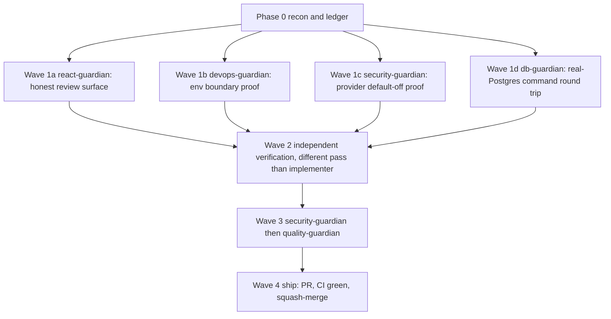
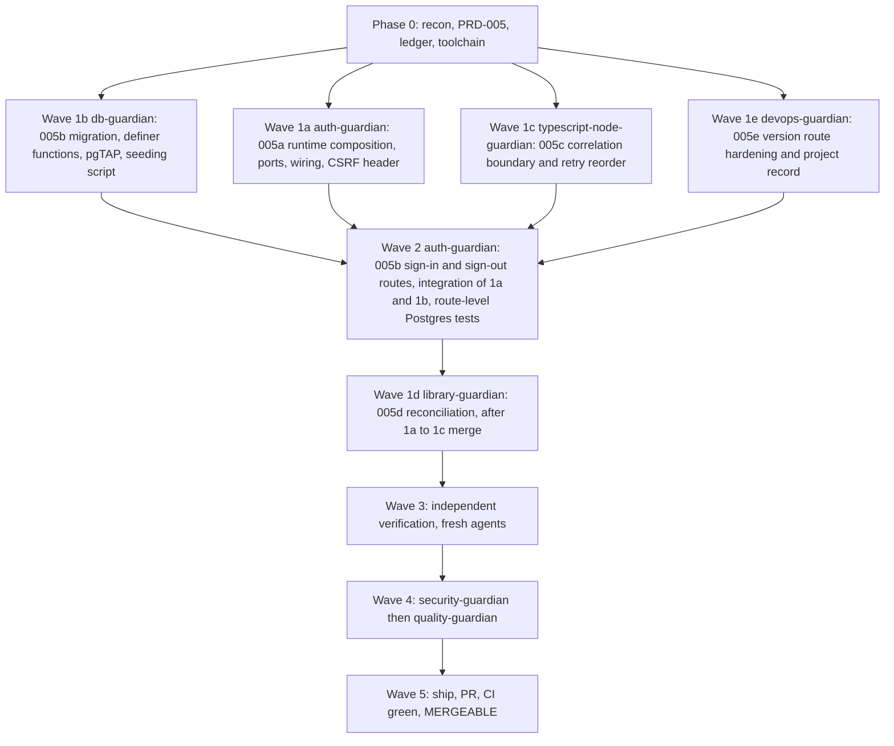

# Operation Automated LO Phase 0 Execution Ledger

## Raid contract

- Branch: `codex/operation-automated-lo-phase-0`
- Baseline: `f3f2b05d33ffb5ca1657278f85ab816fba147727`
- Scope authority: PRD-001 index, PRD-001j, and the 2026 Build Readiness and Research Gate
- Authorized scope: evidence-producing Phase 0 scaffold and harnesses only
- Prohibited scope: production campaign functionality, live customer changes, live provider writes, external spending, production advertising, any assumption that closes G1 through G7 without named external evidence, and any treatment of G8 as `PASS`
- Status flow: `OPEN` -> `IN PROGRESS` -> `DONE` -> `VERIFIED`

## Acceptance-criteria ledger

| ID | Source | Exact criterion | Dependencies | Owning Guardian | Status | Verification evidence |
| --- | --- | --- | --- | --- | --- | --- |
| P0-001 | PRD-001j, Monorepo and runtime | "Scaffold pnpm workspaces and Turborepo." | None | `typescript-node-guardian` | VERIFIED | Exact pnpm workspace and Turbo configuration resolve 17 projects; frozen install passes. |
| P0-002 | PRD-001j, Monorepo and runtime | "Pin Node 24 LTS and Next.js 16.2.10 or the later patched stable 16.2 release available at scaffold time." | P0-001 | `typescript-node-guardian` | VERIFIED | Node 24.18.0, Next 16.2.10, and React/React DOM 19.2.7 are exact pins. |
| P0-003 | PRD-001j, Monorepo and runtime | "Prefer strict TypeScript 7.0.2 or later stable 7.0.x after the scaffold compatibility suite passes, with the TypeScript 6 compatibility package only for tooling that still needs the compiler API." | P0-001 | `typescript-node-guardian` | VERIFIED | TypeScript 7.0.2 drives product checks; the exact TypeScript 6.0.3 alias is limited to compatibility tooling. |
| P0-004 | PRD-001j, Monorepo and runtime | "Create `apps/web` for Vercel and `apps/tasks` for Trigger.dev." | P0-001, P0-002, P0-003 | `typescript-node-guardian` | VERIFIED | Both app shells typecheck and build under the exact pinned runtime. |
| P0-005 | PRD-001j, Monorepo and runtime | "Create domain, application, contracts, database, auth, HighLevel, AI, billing, rendering, storage, observability, test-support, and UI packages." | P0-001, P0-003 | `typescript-node-guardian` | VERIFIED | All 14 named package shells exist and participate in the workspace graph. |
| P0-006 | PRD-001j, Monorepo and runtime | "Enforce dependency direction and prohibit provider or framework imports in the domain package." | P0-005 | `typescript-node-guardian` | VERIFIED | Boundary audit passes 16 packages and rejects the deliberate domain-to-GHL reverse dependency fixture. |
| P0-007 | PRD-001j, Monorepo and runtime | "Use strict ESM and correct NodeNext relative import extensions." | P0-003, P0-005 | `typescript-node-guardian` | VERIFIED | Strict NodeNext/ES2024 settings and source extension audits pass across all packages. |
| P0-008 | Delivery plan, Phase 0 build | "Monorepo, strict TypeScript, package boundaries, CI, local Supabase, preview environments." Local data must remain synthetic only. | P0-001 | `db-guardian` | VERIFIED | Credential-free validation, local start, data-less reset, and pgTAP all pass on the reserved 5542x port block. Five database assertions pass. The unrelated `equipment-room` project was preserved. |
| P0-009 | Delivery plan, Environment model | Preview uses Vercel preview, Trigger.dev preview branches, Supabase ephemeral preview branches, provider stubs by default, and seeded synthetic data only. | P0-001, P0-008 | `devops-guardian` | VERIFIED | `.github/workflows/ci.yml`, `vercel.json`, and `docs/phase0-preview-environments.md` encode a stub-only, synthetic-only preview contract. Workflow audit passes with 6 of 6 external actions pinned by commit SHA. No live deployment was performed. |
| P0-010 | PRD-001j, Verification and observability | "Provide `pnpm verify` as the canonical local and CI gate." | P0-001 through P0-009 | `typescript-node-guardian` | VERIFIED | Exact Node 24.18.0 and pnpm 11.15.1 frozen install plus the complete `pnpm verify` gate pass. CI invokes the same command. |
| P0-011 | Delivery plan, Phase 0 exit | "`pnpm verify` passes." | P0-010, P0-013 through P0-019 | `quality-guardian` | VERIFIED | Independent QA reran `pnpm verify` under exact Node 24.18.0 and pnpm 11.15.1: 12 test files, 35 tests, 16 typechecks, and 16 builds passed. |
| P0-012 | Delivery plan, Phase 0 exit | "Next.js 16.2.10 or a later patched stable 16.2.x version and its compatible React release are pinned after the official advisory sweep passes." | P0-002 | `dependency-audit-guardian` | VERIFIED | Exact Next 16.2.10 and React/React DOM 19.2.7 pins are peer-valid. Frozen install and `pnpm audit --audit-level=high` pass after exact tar, ws, and engine.io overrides; 3 Moderate findings remain documented. |
| P0-013 | Delivery plan, Phase 0 exit | "TypeScript 7 and any TypeScript 6 compatibility sidecar pass lint, build, tests, editor, and package-tooling checks." | P0-003, P0-010 | `typescript-node-guardian` | VERIFIED | Exact Node 24 verification passes 16 of 16 TypeScript 7 typechecks and builds, with the TypeScript 6 alias confined to compatibility tooling. |
| P0-014 | Delivery plan, Phase 0 build | "HighLevel App Test harness, signed-context fixture, provider schema capture, and golden render fixtures." | P0-004, P0-005 | `gohighlevel-guardian` | VERIFIED | `packages/ghl/src/**` and `tests/contracts/ghl/**` implement fixture replay, signed-context projections, inert live capture, and deterministic provider evidence. |
| P0-015 | Research gate, Core App Test contract suite | "The harness records sanitized request and response fixtures, HTTP status, safe provider IDs, granted scopes, and observed account state. Secrets, tokens, customer data, and live spend are prohibited from fixtures." | P0-014 | `gohighlevel-guardian` | VERIFIED | Strict Zod evidence schemas plus recursive sanitization, tamper hashes, method/path denylist, and secret/PII/spend negative tests pass. |
| P0-016 | Delivery plan, Phase 0 exit | "HighLevel research gates have executable test cases." | P0-014, P0-015 | `gohighlevel-guardian` | VERIFIED | `pnpm test:contracts` passes 4 files and 21 tests. Synthetic G1 through G6 fixtures remain harness evidence. Product-owner gate dispositions for G1 and G4 are `ACCEPTED CONSTRAINT` as of 2026-08-25; G2, G3, G5, and G6 remain blocked pending named external evidence. |
| P0-017 | PRD-001j, Test fixtures | Golden render fixtures cover common and adversarial content, and unchanged versioned inputs produce stable hashes without shipping a production renderer. | P0-004, P0-005 | `typescript-node-guardian` | VERIFIED | Versioned common, long, and adversarial fixtures produce canonical bytes and stable SHA-256 hashes with zero network access. Two visual harness tests pass. |
| P0-018 | PRD-001j, Rendering and storage | Malicious image, SVG, HTML, URL, oversized, mislabeled, corrupt, and high-decompression fixtures are rejected or isolated by the Phase 0 harness. | P0-017 | `security-guardian` | VERIFIED | Eight hostile rendering vectors are rejected by executable tests with zero network calls. |
| P0-019 | Delivery plan, Phase 0 build | "Threat model and provider contract register." | P0-014 through P0-018 | `security-guardian` | VERIFIED | Strict register covers all 32 Phase 0/threat-model entries and all eight external gates with executable completeness and reference checks. |
| P0-020 | PRD-001 index, Delivery sequence | "Run the $500 founding offer against a working demo." The demo must use synthetic data and expose no provider write path. | P0-004, P0-005 | `react-guardian` | VERIFIED | Static `/demo` uses local synthetic fixtures and includes all eight proof surfaces, manual/automated/read-only labels, a 4-minute walkthrough, scope, and refund policy. Typecheck and build pass. |
| P0-021 | Delivery plan, Phase 0 exit | "No production feature traffic." | P0-014 through P0-020 | `security-guardian` | VERIFIED | Fail-closed environment parsing, disabled live adapter, blocked provider contracts, and static source proof show no production traffic or outbound provider transport. |
| P0-022 | PRD-001j, Repository and builds | "A new developer can install, start local database, run web, run tasks, and execute the complete verification suite from documented commands." For Phase 0, provider execution remains fixture-only unless separately authorized. | P0-001 through P0-021 | `quality-guardian` | VERIFIED | Independent QA executed the documented database, web, fixture-only task, and verification paths successfully. All 15 local README links resolve. |

## External gate register

These gates are not acceptance criteria for the Phase 0 implementation raid. G2, G3, G5, G6, and G7 remain external blockers and must not be silently converted to `PASS`. G1, G4, and G8 are recorded as `ACCEPTED CONSTRAINT`, never `PASS`, under product-owner decisions in the raid log and research gate.

| Gate | Current state | Required external evidence |
| --- | --- | --- |
| G1 Distribution contract | ACCEPTED CONSTRAINT | External Marketplace distribution proof removed as a launch prerequisite on 2026-08-25 |
| G2 OAuth and session contract | BLOCKED | HighLevel App Test |
| G3 Meta publish contract | BLOCKED | HighLevel App Test with controlled test assets |
| G4 Special Ad Category contract | ACCEPTED CONSTRAINT | Housing Special Ad Category requirements known and enforced; App Test discovery removed on 2026-08-25 |
| G5 Lead routing contract | BLOCKED | No-spend Meta test lead evidence |
| G6 Billing lifecycle | BLOCKED | Stripe test mode plus HighLevel billing evidence |
| G7 Legal operating model | BLOCKED | Counsel and lender approval |
| G8 Demand | ACCEPTED CONSTRAINT | No 15-paid-founder evidence exists. The product owner directed proceeding without it, commercial validation remains unproven, and 15 paid founders is now a post-start target. |

## Dependency waves

### Wave 1: scaffold and deterministic harness foundation

| Guardian | Model selection | Ownership | Exit criteria |
| --- | --- | --- | --- |
| `typescript-node-guardian` | `gpt-5.6-sol`, high effort. Deep multi-package scaffolding and contract-test work need the strongest coding and reasoning profile available in this harness. | Root workspace and TypeScript configuration, `apps/**`, `packages/**`, test runner, boundary checks, verification scripts, golden render fixture plumbing | P0-001 through P0-007, P0-010, P0-013, and P0-017 are DONE with passing evidence |
| `db-guardian` | `gpt-5.6-terra`, high effort. The bounded local Supabase scaffold needs careful database security judgment without production schema construction. | `supabase/**` only | P0-008 is DONE with synthetic-only local configuration and executable checks |

### Wave 2: provider evidence, preview delivery, and founder demo

| Guardian | Model selection | Ownership | Exit criteria |
| --- | --- | --- | --- |
| `gohighlevel-guardian` | `gpt-5.6-sol`, high effort. OAuth, signed context, provider schemas, no-spend cases, and denylist controls have high security and contract risk. | `packages/ghl/**`, `packages/contracts/**` only where coordinated, and `tests/contracts/ghl/**` | P0-014 through P0-016 are DONE with fixture-only evidence |
| `devops-guardian` | `gpt-5.6-terra`, high effort. Greenfield CI and preview wiring are bounded and tool-heavy. | `.github/**`, preview configuration, and delivery documentation, with no database migration authorship | P0-009 and the CI portion of P0-010 are DONE |
| `react-guardian` | `gpt-5.6-terra`, high effort. The demo is a well-specified synthetic React surface with strict no-write boundaries. | `apps/web/src/app/demo/**` and demo-only components/fixtures | P0-020 is DONE and the demo build passes |

### Wave 3: independent verification and repair

Fresh verifier passes test the Wave 1 and Wave 2 work. Any failed item returns to its owning Guardian. `dependency-audit-guardian` verifies P0-012. Domain owners repair only their own files. The ledger reaches zero `OPEN` and zero `IN PROGRESS` before close-out.

### Wave 4: mandatory close-out

1. `security-guardian`, armed with `security-weapon`, verifies and remediates P0-018, P0-019, and P0-021 plus the full Phase 0 attack surface.
2. `quality-guardian`, armed with `quality-weapon`, verifies P0-011 and P0-022 and independently checks every DONE criterion against its source.
3. Any regression reopens its criterion and returns to the responsible implementation Guardian.

### Wave 5: ship

Fetch `origin/main`, resolve conflicts, rerun `pnpm verify`, confirm mergeability, commit, push, open the PR with this ledger and close-out results, then monitor CI until green.

## Raid log

| Time | Event |
| --- | --- |
| 2026-07-20 | Verified clean baseline `f3f2b05`, fetched `origin/main`, and created `codex/operation-automated-lo-phase-0`. |
| 2026-07-20 | Read the complete PRD-001 corpus, research gate, construction specifications, and threat model. |
| 2026-07-20 | Reconciled authorization to Phase 0 only. G1 through G8 remain blocked. |
| 2026-07-20 | `db-guardian` completed P0-008 under `supabase/**`. Credential-free validation passed; Docker-backed reset and pgTAP remain pending until the local Linux engine is available. |
| 2026-07-20 | `dependency-audit-guardian` completed the official pre-lockfile advisory sweep and established exact pins. Resolved-tree verification remains pending. |
| 2026-07-20 | `devops-guardian` completed P0-009 and the CI configuration portion of P0-010. Static workflow and preview-contract checks passed; integrated verification awaits the lockfile. |
| 2026-07-20 | `dependency-audit-guardian` reran P0-012 against the resolved tree after remediation. Critical and High findings are zero; 3 Moderate transitive findings remain documented. |
| 2026-07-20 | `gohighlevel-guardian` completed P0-014 through P0-016. Contract, safety, signed-context, and G1 through G6 replay tests pass without live provider access. |
| 2026-07-20 | `typescript-node-guardian` completed P0-001 through P0-007, P0-010, P0-013, and P0-017. Exact Node 24.18.0 verification passed with 29 assertions and 16 successful builds. |
| 2026-07-20 | `react-guardian` completed P0-020 with a static synthetic demo and no provider, payment, spend, or customer-data path. |
| 2026-07-20 | `db-guardian` moved the local scaffold onto an unused 5542x port block. Supabase start, reset, and all 5 pgTAP assertions passed without touching the unrelated project on port 54322. |
| 2026-07-20 | `security-guardian` completed the mandatory penultimate pass with 0 Critical and 0 High findings. P0-018, P0-019, and P0-021 are DONE; exact Node 24 verification passes 12 files and 35 tests. |
| 2026-07-20 | `typescript-node-guardian` added the no-network `pnpm tasks:local` runner, and `readme-writing-guardian` rebuilt onboarding around verified Phase 0 commands. |
| 2026-07-20 | `security-guardian` refreshed the audit after the onboarding repair. Exact Node 24 verification passed with no new finding. |
| 2026-07-20 | `quality-guardian` completed independent close-out: 22 of 22 criteria passed with zero Criticals, Warnings, or Suggestions. Every P0 row is VERIFIED; G1 through G8 remain BLOCKED. |
| 2026-07-20 | Watchdog found that the initial documentation worker made no filesystem progress. The worker was terminated and the task was decomposed. |
| 2026-07-20 | Product owner explicitly directed: "Proceed, we are moving without the 15 paid founders." G8 is `ACCEPTED CONSTRAINT`, never `PASS`. No 15-paid-founder evidence exists, and commercial validation remains unproven. G1 through G7 remain `BLOCKED`, and production stays unauthorized until each is `PASS`, `ACCEPTED CONSTRAINT`, or `DEFERRED OUT OF CORE`. |
| 2026-08-25 | Product owner directed removal of the external distribution gate and the mortgage Special Ad Category discovery gate. G1 and G4 are `ACCEPTED CONSTRAINT`, never `PASS`. Housing Special Ad Category remains enforced in product. G2, G3, G5, G6, and G7 remain blocked, and production stays unauthorized. |

## UI Foundation Raid

### UI raid contract

- Branch: `codex/oalo-ui-foundation`
- Initial baseline: `18ad155abcfb896946a1e7b73bd2acacc87be968`
- Shipping baseline after rebase: `ff6b02bd2c65fb4d1be899667b23882907c5589d`
- Initial merged Phase 0 ledger blob: `59f4db6a2195f66174dc13673f7aac79d378f785`
- Rebased Phase 0 ledger blob: `e565b9c9d82a8fc6f4353d906ae31569a39a963e`
- Scope authority: PRD-001 index dashboard acceptance criteria, PRD-001h, and `library/knowledge/private/ux-ui/**`
- Authorized scope: React design-system foundation, authenticated synthetic shell, Platform Overview, onboarding and readiness surfaces, Light/Dark/System behavior, and their deterministic evidence
- Prohibited scope: real authentication, live GoHighLevel OAuth, Meta or Stripe access, AI generation, production routing, customer records, live provider writes, spend, or any UI-derived Launch Ready decision
- Existing P0 rows, owners, statuses, and evidence remain unchanged. UI criteria use the same `OPEN` -> `IN PROGRESS` -> `DONE` -> `VERIFIED` flow.

### UI acceptance-criteria ledger

| ID | Source | Exact criterion | Dependencies | Owning Guardian | Status | Verification evidence |
| --- | --- | --- | --- | --- | --- | --- |
| UIF-000 | Raid handoff, Phase 0 boundary | Preserve every existing P0 ledger row, owner, status, and evidence while appending a separate UI Foundation section. | None | `quality-guardian` | VERIFIED | After rebasing, the `origin/main` ledger blob is `e565b9c9d82a8fc6f4353d906ae31569a39a963e`. Its complete pre-UI content and the current prefix are ordinal-equal and share normalized SHA-256 `756cfdd4d54c945823af2544e88238fc48c78c8d91169e6e5d040202d4fa0470`. |
| UIF-001 | UX master tokens and design brief | Implement semantic Light and Dark tokens for canvas, surfaces, text, borders, actions, status, focus, elevation, type, spacing, radius, breakpoints, and motion. Product components must not consume raw palette values. | UIF-000 | `ux-ui-guardian` | VERIFIED | Independent token and theme verification passed semantic coverage, WCAG AA, Phase 0 compatibility, package build, stylesheet export, consumer resolution, and source/dist SHA-256 equality. |
| UIF-002 | PRD-001 dashboard AC, UX design brief | Provide an accessible Light, Dark, and System segmented control with visible selected state, text, and glyph. | UIF-001, UIF-021 | `dark-mode-theming-guardian` | VERIFIED | Independent exact Node 24 verification confirms the accessible three-option radiogroup, visible glyph and text selection, and keyboard behavior. |
| UIF-003 | UX design brief, Theme behavior | First visit follows the operating-system preference. System follows later media-query changes, while explicit Light or Dark remains stable. | UIF-002 | `dark-mode-theming-guardian` | VERIFIED | Independent exact Node 24 verification confirms first-visit System behavior, live media changes, and stable manual modes. |
| UIF-004 | PRD-001 dashboard AC, UX design brief | Theme changes persist without reload, navigation, refetch, or loss of route, focus, scroll, disclosure, checklist, or local form state. | UIF-002, UIF-003 | `dark-mode-theming-guardian` | VERIFIED | Independent jsdom verification confirms theme changes preserve local application state without navigation, reload, refetch, or writes. |
| UIF-005 | UX design brief, First paint | Apply the correct theme before first paint without hydration mismatch or flash of the wrong theme. Hydration suppression is limited to the root theme attribute. | UIF-002, UIF-003 | `dark-mode-theming-guardian` | VERIFIED | Independent pinned-Chromium evidence confirms stored Dark is present on the first animation frame without a Light sample, hydration warning, or page error; root-only suppression remains intact. |
| UIF-006 | UX design brief, Tenant theming | Accept only server-validated semantic tenant accent overrides with complete Light and Dark values, contrast validation, and safe fallback. User-provided CSS or raw primitive overrides are prohibited. | UIF-001 | `dark-mode-theming-guardian` | VERIFIED | Independent source and exact Node 24 test verification confirms fixed allowlisted Light/Dark semantic-variable projection, safe fallback, and no client-controlled arbitrary CSS path. |
| UIF-007 | UX accessibility contract | Meet WCAG AA contrast, visible 2 px focus with 3 px offset, non-color status communication, readable disabled states, and reduced-motion behavior. | UIF-001, UIF-002 | `ux-ui-guardian` | VERIFIED | Final Quality confirms axe-clean Light/Dark desktop/mobile and open-drawer states, visible focus, readable disabled states, non-color labels and glyphs, and reduced motion. |
| UIF-008 | PRD-001 dashboard AC, Campaign and artifact workflow | Theme and dashboard UI state must remain structurally absent from campaign inputs, approval projections, artifact manifests, canonical bytes, identifiers, and hashes. | UIF-004 | `react-guardian` | VERIFIED | Final Quality confirms strict local schemas exclude UI state, reject unknown keys, and preserve deterministic approval bytes, SHA-256, manifest IDs, approval IDs, and artifact IDs. |
| UIF-009 | Application shell specification | Build the authenticated shell with the full nine-item navigation, subordinate Marketing navigation, selected, expanded, collapsed, restricted, unavailable, planned, and degraded states, plus accessible desktop, compact rail, and mobile drawer behavior. | UIF-001, UIF-021 | `react-guardian` | VERIFIED | Independent pinned-Chromium verification confirms the full nine-item shell, accessible 80 px CSS compact rail, explicit collapse, state-aware labels and tooltips, subordinate Marketing behavior, and mobile drawer. |
| UIF-010 | Application shell specification, PRD-001h | Render validated synthetic session context for location, user, and role. The browser must not derive tenant or authority from URL state and must not expose an arbitrary location switcher. | UIF-009 | `react-guardian` | VERIFIED | Independent verification confirms strict synthetic session projection, capability-based access, no URL-derived authority, and no location switcher. |
| UIF-011 | PRD-001h, Status and attention specification | Readiness and attention states show safe server-shaped evidence, freshness, last verification, invalidation, responsible party, remediation, and next authorized action. | UIF-009, UIF-010 | `react-guardian` | VERIFIED | Independent verification confirms readiness and attention evidence, including freshness, remediation, responsibility, next action, exception code, and correlation ID. |
| UIF-012 | Safe action contract | Create and other consequential actions remain authority-aware, disabled when prerequisites fail, and accompanied by persistent reason, responsible party, and next action. UI code never derives authorization. | UIF-010, UIF-011 | `react-guardian` | VERIFIED | Independent verification confirms consequential actions fail closed with persistent prerequisite and authority evidence. |
| UIF-013 | Platform Overview screen specification | Render the required header, health strip, authorized quick actions, Business Pulse, Active Work, Attention Queue, Recent Activity, and Workspace Status. The page remains useful without an active campaign. | UIF-009 through UIF-012 | `react-guardian` | VERIFIED | Independent build and integration verification confirms every required `/overview` region and usefulness without an active campaign. |
| UIF-014 | Platform Overview, Source-of-truth policy | Every metric exposes value, source, and freshness. Unavailable, stale, partial, and true zero remain distinct. Synthetic values are visibly labeled with source and timestamp. | UIF-013 | `react-guardian` | VERIFIED | Independent verification confirms all six metric truth states, provenance, freshness, synthetic labeling, and explicit-zero semantics. |
| UIF-015 | UX design brief, Platform Overview | Cover loading, new workspace, setup incomplete, blocked, healthy without campaign, provider degraded, unavailable data, restricted viewer, authorized agency, route error, and safe retry states without inventing healthy or zero data. | UIF-013, UIF-014 | `react-guardian` | VERIFIED | Independent verification confirms the eleven-state Overview matrix and safe local retry behavior. |
| UIF-016 | PRD-001h, Onboarding screen specification | Render Get Connected with exactly five outcome items and Launch Readiness with exactly four items. Launch Readiness remains locked until Get Connected is satisfied, and each item routes to its exact completion surface. | UIF-009 through UIF-012 | `react-guardian` | VERIFIED | Independent verification confirms exactly five Get Connected and four locked Launch Readiness items with completion routes. |
| UIF-017 | PRD-001h, Onboarding state model | Model each onboarding item as not_started, in_progress, blocked, complete, or stale with text and glyph. Completion evidence includes verifier version, verification time, safe evidence, and permitted provider IDs. The browser cannot set completion or Launch Ready. | UIF-016 | `react-guardian` | VERIFIED | Independent verification confirms all five onboarding states, completion evidence, permitted synthetic provider IDs, and read-only browser authority. |
| UIF-018 | UX README, Raid boundary | All dashboard and onboarding data is frozen, strictly parsed, visibly synthetic, writes-disabled, and unable to record approval, readiness, publication, provider access, or customer data. | UIF-010, UIF-013, UIF-016 | `react-guardian` | VERIFIED | Independent verification confirms strict parsing, recursive freezing, visible synthetic disclosure, and provider, network, and write isolation. |
| UIF-019 | UX design brief, Responsive priorities | At 1180 px preserve Business Pulse, Active Work, and Attention with compact navigation. At 390 px prioritize readiness, two highest-value quick actions, four priority metrics, and attention before lower-priority content. | UIF-013 through UIF-018 | `ux-ui-guardian` | VERIFIED | Final Quality confirms the 1180 px desktop priorities and the 390 px ordering with exactly two primary actions, four primary metrics, and Attention before secondary content. |
| UIF-020 | UX accessibility contract | Support keyboard and screen reader flows, drawer focus trap, Escape, background scroll lock, focus return, logical checklist order, 44 px touch targets, reduced motion, and no ambient dashboard animation. | UIF-009, UIF-016, UIF-019 | `ux-ui-guardian` | VERIFIED | Final Quality confirms focus, 44 px targets, checklist order, drawer trap, Escape, scroll lock, focus return, reduced motion, screen-reader semantics, and drawer-open axe. |
| UIF-021 | UX source-of-truth change control | Product UI consumes governed `@oalo/ui` wrappers, semantic tokens, and approved icons. Existing Phase 0 demo files remain isolated, and product code imports no canvas examples, demo styles, or raw library primitives. | UIF-001 | `ux-ui-guardian` | VERIFIED | Fresh React verification passed exact Node 24 frozen install, package typecheck/build, 12 focused tests, CSS hashes and exports, web typecheck/build, semantic scans, and canonical contract alignment. |
| UIF-022 | React and theme verification | Add separate strict unit and jsdom integration coverage for fixture parsing, navigation access, theme behavior, drawer and checklist interaction, state continuity, status semantics, and retry behavior. Async Server Components are not rendered in jsdom. | UIF-002 through UIF-021 | `react-guardian` | VERIFIED | Independent exact Node 24 verification passes 12 shared UI tests, 24 unit tests, 13 jsdom tests, 16 package typechecks, and the graph-aware production build. |
| UIF-023 | PRD-001 dashboard AC, Artifact invariance | Assert identical canonical approval bytes and SHA-256 values before and after Light, Dark, and System changes, with unchanged artifact and approval identifiers and no generation, approval, provider, or network request. | UIF-008, UIF-022 | `react-guardian` | VERIFIED | Final Quality confirms byte-identical canonical approval evidence, SHA-256, approval, manifest, and artifact IDs across Light, Dark, and System with zero transition requests. |
| UIF-024 | UX evidence contract | Capture Overview and Onboarding in Light and Dark at 1180 x 900 and 390 x 844, plus drawer and state galleries. Run keyboard flows, automated accessibility scans, hydration-console checks, and first-paint theme checks. | UIF-005, UIF-007, UIF-013 through UIF-023 | `ux-ui-guardian` | VERIFIED | Final Quality confirms ten synthetic-only screenshots, the evidence summary, eight route/theme/viewport axe scans, drawer-open axe, keyboard flows, zero hydration/page errors, and first-paint evidence. |
| UIF-025 | Phase 0 verification contract | Use exact dependency versions, preserve the frozen lockfile contract, install the required browser explicitly, and include UI unit, integration, and browser suites in root `pnpm verify`. | UIF-022 through UIF-024 | `react-guardian` | VERIFIED | Final exact Node 24.18.0 and pnpm 11.15.1 `pnpm verify` passes with 76 non-browser tests, 15 browser tests, 16 typechecks, 16 builds, all audits, and 0 clones. |
| UIF-026 | Asset registry contract | Determine whether the Universal Asset Registry exists at implementation time. If adopted, register and drift-check all new pages, routes, surfaces, controls, nav entries, tokens, icons, fonts, motion, and breakpoints. If absent, record `not applicable: registry not adopted` with evidence and do not invent a production catalog. | UIF-009 through UIF-025 | `asset-guardian` | VERIFIED | `not applicable: registry not adopted`. Asset Guardian inventory found no registry KB, schema/models, migrations, scripts, drift output, code annotations, or catalog directories; `packages/db` remains a Phase 0 shell. No catalog was invented. |
| UIF-027 | Mandatory security close-out | Audit the entire UI foundation and remediate every Critical and High finding. Confirm CSP and embedding decisions, synthetic-data isolation, client/server trust boundaries, dependency posture, and absence of sensitive browser storage. | UIF-001 through UIF-026 | `security-guardian` | VERIFIED | Security audit reports 0 Critical and 0 High findings. Synthetic and provider isolation, fixed theme storage, strict tenant-accent projection, approval invariance, trust boundaries, security headers, secrets, package boundaries, and dependency posture were verified. Four non-blocking Moderate follow-ups remain: nonce or hash CSP and three transitive advisories. |
| UIF-028 | Mandatory quality close-out | Independently verify every UIF criterion after security, including exact source traceability, automated evidence, visual evidence, accessibility, responsive priorities, and unchanged P0 content. | UIF-027 | `quality-guardian` | VERIFIED | Final Quality report has no Critical, Warning, or Suggestion findings. All five axes pass; UIF-000 through UIF-028 are independently traced and verified. |
| UIF-029 | Raid shipping contract | Rebase onto current `origin/main`, rerun exact-runtime verification, confirm a clean worktree and MERGEABLE green PR, and open the ready PR without merging it. | UIF-028 | `quality-guardian` | VERIFIED | Ready PR #10 remains open and not draft. At head `f917a3543360b2b23c380a056332322920cb251b`, GitHub Actions run `29815891707` passed canonical verification and preview smoke, and GitHub reported `MERGEABLE` with merge state `CLEAN`. `origin/main` at `ff6b02bd2c65fb4d1be899667b23882907c5589d` is an ancestor, and the post-rebase exact local gate passed. |

### UI dependency waves

#### UI Wave 1: source contracts and runtime foundations

| Guardian | Model selection | Ownership | Exit criteria |
| --- | --- | --- | --- |
| `ux-ui-guardian` | `gpt-5.6-sol`, high effort. Cross-document component contracts, responsive composition, and visual evidence require deep design-system reasoning. | `packages/ui/**`, UX component and screen specifications, semantic product styles, icons, and visual baselines | UIF-001, UIF-007, UIF-019, UIF-020, and UIF-021 are DONE with contract and visual evidence. |
| `dark-mode-theming-guardian` | `gpt-5.6-terra`, high effort. The theme runtime is bounded but hydration-sensitive and test-heavy. | `apps/web/src/theme/**`, root theme bootstrap, persistence, tenant override validation, and theme-specific tests | UIF-002 through UIF-006 are DONE without flash, hydration drift, or state loss. |
| `react-guardian` | `gpt-5.6-sol`, high effort. The shell, Overview, onboarding state model, and evidence harness span multiple React 19 and Next.js 16 boundaries. | `apps/web/src/app/(authenticated)/**`, `apps/web/src/features/**`, synthetic UI fixtures, UI tests, Playwright configuration, and coordinated root scripts | UIF-008 through UIF-018 and UIF-022 through UIF-025 are DONE with exact-runtime evidence. |

#### UI Wave 2: integration, evidence, and asset reconciliation

Fresh cross-owner verification repairs any integration drift. `asset-guardian` then resolves UIF-026 without inventing a registry. Visual and automated evidence must be complete before any implementation criterion moves from DONE to VERIFIED.

#### UI Wave 3: mandatory close-out

1. `security-guardian`, armed with `security-weapon`, completes UIF-027 and remediates Critical and High findings.
2. `quality-guardian`, armed with `quality-weapon`, completes UIF-000, UIF-028, and UIF-029 only after security is clean.
3. Any regression reopens its owning criterion and returns to the responsible Guardian.

#### UI Wave 4: ship without merge

Fetch and rebase on `origin/main`, rerun the exact Node 24 and pnpm 11 frozen-install gate, push the branch, open the ready PR, monitor CI to green, and confirm GitHub reports `MERGEABLE`. Do not merge the UI Foundation PR.

### UI raid log

| Time | Event |
| --- | --- |
| 2026-07-20 | Read-only recon completed while PR #5 remained open. No UI implementation branch or product file was changed. |
| 2026-07-20 | PR #5 and the post-merge full-review fixes in PR #8 merged. All 22 P0 rows remain VERIFIED. |
| 2026-07-20 | Fetched `origin/main` at `18ad155`, verified the merged P0 ledger, and created `codex/oalo-ui-foundation`. |
| 2026-07-20 | Appended UIF-000 through UIF-029 without changing any existing P0 row. UI Wave 1 is ready for armed Guardian dispatch. |
| 2026-07-20 | Dispatched `ux-ui-guardian` for UIF-001 and the implementation-ready source contract that unlocks the theme and React lanes. |
| 2026-07-20 | Watchdog interrupted the first UIF-001 brief after it stalled in broad documentation review without file changes. Decomposed the work into semantic tokens and contrast first, then component specifications. |
| 2026-07-20 | Watchdog interrupted the decomposed UIF-001 run after a second no-edit stall. Reduced ownership to the `@oalo/ui` semantic token deliverable and contrast proof only. |
| 2026-07-20 | Retired the original UIF-001 Guardian instance after a third no-edit stall and re-dispatched the two-file token task to a fresh armed `ux-ui-guardian`. |
| 2026-07-20 | Fresh `ux-ui-guardian` completed UIF-001. Light faint/card is 4.97:1, Light primary action is 4.55:1, Dark faint/card is 7.40:1, Dark primary action is 5.22:1, and all status pairs pass 4.5:1. Dispatched independent theme-side verification. |
| 2026-07-20 | Independent `dark-mode-theming-guardian` reopened UIF-001. Semantic and contrast checks pass, but `@oalo/ui/tokens.css` fails with `ERR_PACKAGE_PATH_NOT_EXPORTED`; returned the packaging defect to the UX owner. |
| 2026-07-20 | UX owner fixed the stylesheet export and deterministic CSS build. Independent theme verification passed package build, web consumer resolution, byte equality, formatting, and all prior semantic checks. UIF-001 moved to VERIFIED and UIF-021 began. |
| 2026-07-20 | Watchdog interrupted the initial UIF-021 documentation and wrapper lanes after both stalled before file changes. Decomposed into source specifications, interactive controls, state/data primitives, and a later shared-export integration pass. |
| 2026-07-20 | Decomposed UIF-021 work completed: six new component specs, four governing spec extensions, interactive controls, state/data primitives, shared package integration, exact CSS output, and 8 focused tests. UIF-021 moved to DONE for independent React verification. |
| 2026-07-20 | Independent React verification reopened UIF-021. Build and packaging pass, but six specs use the wrong package name and public Button, SafeAction, AsyncState, and Metric unions drift from their canonical contracts. Returned documentation and code defects to separate UX owners. |
| 2026-07-20 | Documentation identity repair completed. Component API repair added the canonical variants and states, then a separate test-repair pass reached exact Node 24 typecheck with three stale tests. Watchdog stopped its non-reporting tail and dispatched fresh React re-verification. |
| 2026-07-20 | Fresh React re-verification passed exact Node 24 frozen install, UI typecheck/build, 12 tests, CSS hashes and exports, web typecheck/build, formatting, scans, and repaired contract alignment. UIF-021 moved to VERIFIED; dark-mode and React implementation lanes began in parallel. |
| 2026-07-20 | Dark-mode lane completed UIF-002, UIF-003, UIF-005, and UIF-006 with 8 pure tests and a production build. UIF-004 remains IN PROGRESS until the shared jsdom harness runs its state-continuity test; exact Node 24 integration verification remains pending. |
| 2026-07-20 | React lane completed UIF-009 through UIF-018 and UIF-022. Exact Node 24 passes 16 typechecks, 24 unit tests, 13 jsdom tests including theme continuity, and the graph-aware `/overview` and `/onboarding` production build. Dispatched integrated independent verification. |
| 2026-07-20 | Independent integrated verification marked UIF-002 through UIF-004, UIF-010 through UIF-018, and UIF-022 VERIFIED; held UIF-005 at DONE pending browser FOWT proof; reopened UIF-006 for unapplied tenant accents and UIF-009 for unnamed CSS-compacted navigation links. |
| 2026-07-20 | Dark-mode repair completed UIF-006 with server-only fixed semantic-variable projection for accepted Light/Dark accents, safe fallback, 10 pure theme tests, one jsdom runtime test, typecheck, and graph-aware build. |
| 2026-07-20 | React shell repair completed UIF-009 with unconditional accessible navigation names and tooltips across CSS-driven and user-driven compact modes; focused integration, typecheck, and graph-aware build pass. |
| 2026-07-20 | React evidence lane completed UIF-008, UIF-023, and UIF-025: three strict projection contracts and one pinned Chromium invariance scenario pass on exact Node 24; frozen install, strict browser typecheck, lint, format, and graph build pass. Independent review also marked repaired UIF-006 VERIFIED. |
| 2026-07-21 | UX evidence lane completed UIF-007, UIF-019, UIF-020, and UIF-024 with a 14/14 pinned-Chromium matrix, 10 visually inspected synthetic screenshots, axe-clean Light/Dark desktop/mobile and open-drawer states, first-paint/hydration evidence, responsive priority assertions, and focus/touch/motion checks. UIF-005 and repaired UIF-009 are independently VERIFIED. |
| 2026-07-21 | Asset Guardian marked UIF-026 VERIFIED as `not applicable: registry not adopted`; no registry KB, schema, migration, script, generator output, annotations, or catalog exists, and `packages/db` is still the Phase 0 shell. |
| 2026-07-21 | Security Guardian marked UIF-027 VERIFIED with 0 Critical and 0 High findings. Four non-blocking Moderate follow-ups remain: nonce or hash CSP, PostCSS, OpenTelemetry core, and development-only esbuild advisories. The audit also repaired local declaration of pinned web test dependencies so the 16-package boundary gate passes. |
| 2026-07-21 | Quality preflight found the root zero-duplication gate failing on seven clone groups. Implementation consolidated shared semantic link styling, status rendering, metric schema fields, and evidence details; `jscpd` now reports 0 clones. Post-repair Security reran secrets, product types, package boundaries, production audit, and diff checks with unchanged 0 Critical and 0 High findings. |
| 2026-07-21 | Final Quality marked UIF-000 through UIF-028 VERIFIED with no Critical, Warning, or Suggestion findings. Exact Node 24.18.0 and pnpm 11.15.1 `pnpm verify` passes 76 non-browser tests, 15 Chromium tests, 16 typechecks, 16 builds, all audits, and 0 clones. UIF-029 remains the ordered shipping step. |
| 2026-07-21 | Rebase resolved the sole ledger conflict by preserving `origin/main` PR #9 G8 evidence verbatim and retaining the separate UI section. The rebased main ledger and current pre-UI prefix are ordinal-equal with normalized SHA-256 `756cfdd4d54c945823af2544e88238fc48c78c8d91169e6e5d040202d4fa0470`. |
| 2026-07-21 | Ready PR #10 opened MERGEABLE. Its first canonical GitHub run exposed that Linux CI did not provision Playwright Chromium. The read-only SHA-pinned workflow now installs the pinned Chromium build and system dependencies before verification. Security reran with 0 Critical and 0 High findings, then the complete local `pnpm verify` gate passed again. UIF-029 remains OPEN pending repaired green GitHub evidence. |
| 2026-07-21 | Repaired GitHub Actions run `29815891707` passed canonical verification in 2 minutes 59 seconds and preview smoke in 23 seconds at head `f917a3543360b2b23c380a056332322920cb251b`. GitHub reports ready PR #10 `MERGEABLE` with merge state `CLEAN`; `origin/main` is an ancestor and the PR remains open and unmerged. UIF-029 is VERIFIED. |

---

# Gauntlet Raid: Go-Live Remaining In-Repo Code

This section is **additive**. Every Phase 0 (`P0-*`) and UI Foundation (`UIF-*`) row above remains unchanged, with its original owner, status, and evidence.

## Raid contract

- Branch: `cursor/gauntlet-go-live-remaining-code-b085`
- Baseline: `origin/main` at `6d5982f` (after PRD-003d `26051b3`, PRD-003c `71c371d`, App Test maps `65dd527`, PRD-003 ledger sync `#59`)
- Scope authority: PRD-003 index (`APA-*`), PRD-004 index and PRD-004a (`RGL-*`, `004A-AC-*`) as authored in draft PR #60, and the non-`VERIFIED` rows of `PRODUCTION_EXECUTION_LEDGER.md`
- Authorized scope: **remaining in-repo code only.** Locally provable acceptance criteria, their tests, and the CI wiring that proves them.
- Prohibited scope: live Marketplace submission, Developer Portal sign-in, Vercel env mutation, cloud deploy, live HighLevel / Meta / Stripe / KMS / counsel evidence, inventing G2 fixtures, flipping any of the 28 `DEFERRED: LIVE HIGHLEVEL AUTH` rows, PRD-002 add-ons, and any edit to `library/**`, `NEXT_BATCH_LEDGER.md`, `.cursor/rules/core/the-map.mdc`, or `docs/operations/evidence-packs/**` while PR #60 is open
- Status flow: `OPEN` -> `IN PROGRESS` -> `DONE` -> `VERIFIED`, with `BLOCKED` reserved for rows carrying an exact operator ask
- The-neeson overlay: `../the-neeson` is **not clonable** (no such repository under `jzferrell26`). Per `AGENTS.md`, this raid falls back to this repository's `.cursor/skills/` snapshot.

## Scope determination

`PRODUCTION_EXECUTION_LEDGER.md` holds 305 PRD-001 acceptance-criteria rows. Exact status counts on `6d5982f`:

| Status string | Count | Bucket |
| --- | ---: | --- |
| `VERIFIED` | 267 | Already terminal |
| `DEFERRED: LIVE HIGHLEVEL AUTH` | 28 | Blocked-external (G2) |
| `BLOCKED: EXTERNAL EVIDENCE` | 7 | Blocked-external |
| `ACCEPTED CONSTRAINT` | 2 (AC rows) | Product-owner disposition |
| `BLOCKED: G5` | 1 | Blocked-external |

267 + 28 + 7 + 2 + 1 = 305. **There are zero locally provable OPEN PRD-001 acceptance criteria.** The three remaining `ACCEPTED CONSTRAINT` and four `BLOCKED` / `DEFERRED FOR NOW` strings in that file are external-gate rows, not acceptance criteria.

Therefore this raid's actionable surface is exactly the locally provable code portion of PRD-003 parent closeout and PRD-004a, cross-checked against the Librarian's inventory at `docs/remaining-requirements.md` in the Project store.

## Acceptance-criteria ledger

| ID | Source PRD | Exact criterion | Status | Owner |
| --- | --- | --- | --- | --- |
| GGL-001 | PRD-004 index, `RGL-002` | "Given a review preview URL, when `/overview` loads for an authenticated tenant without persisted spend/leads, then the surface shows honest empty or not-connected states and is not unlabeled synthetic demo data." | VERIFIED | `react-guardian` |
| GGL-002 | PRD-004a, `004A-AC-003` | "`/overview` does not show unlabeled synthetic spend/leads on the review URL." | VERIFIED | `react-guardian` |
| GGL-003 | PRD-004 index, `RGL-001` (code portion only) | "Given the existing Vercel project `operation-automated-lo-web`, when a preview deployment is promoted for review, then server-only env includes `OALO_DATABASE_URL` and other required secrets without `NEXT_PUBLIC` leakage, and the deployment is not a second Vercel project." | VERIFIED | `devops-guardian` |
| GGL-004 | PRD-004a, `004A-AC-002` (code portion only) | "`OALO_DATABASE_URL` and auth secrets are server-only env vars on Vercel." | VERIFIED | `devops-guardian` |
| GGL-005 | PRD-004 index, `RGL-007` | "Given this batch completes, when external gates are checked, then no HighLevel provider write, Meta publish, lead routing, or Stripe charge is newly enabled by default." | VERIFIED | `security-guardian` |
| GGL-006 | PRD-003 index, `APA-008` | "Given this batch is complete, when the production verification gate runs, then no HighLevel, Meta, Stripe, lead-routing, or other provider side effect is newly enabled by default." | VERIFIED | `security-guardian` |
| GGL-007 | PRD-004 index, `RGL-008` | "Given G2 deferred criteria, when this batch completes, then none of the 28 `DEFERRED: LIVE HIGHLEVEL AUTH` rows flip to `VERIFIED` without sanitized fixtures passing `pnpm test:contracts`." | VERIFIED | `quality-guardian` |
| GGL-008 | PRD-004a, `004A-AC-004` (local-provable equivalent) | "Create Open House Boost -> navigate away -> reload -> campaign still present (Postgres)." Proven locally through the web command stack against real Postgres in the canonical database gate, not only at the repository layer. | VERIFIED | `db-guardian` |
| GGL-009 | PRD-004a, `004A-AC-005` (local-provable equivalent) | "Authorized approver can approve; aggregate shows approved state after reload." Proven locally through the approval command/handler against real Postgres with a fresh read path, not direct SQL. | VERIFIED | `db-guardian` |
| GGL-010 | PRD-003 index, `APA-010` | "Given the completed implementation, when security and quality review run, then the batch has no unresolved Critical or High security finding and every PRD-003 acceptance criterion is traceable to code and tests before merge." | VERIFIED | `quality-guardian` |

### Blocked rows with exact operator asks

These are parked, not skipped. Each carries a specific ask. None is silently dropped, and none may be flipped by this raid.

| ID | Source | Exact criterion | Status | Exact operator ask |
| --- | --- | --- | --- | --- |
| GGL-B01 | PRD-004a, `004A-AC-001` | "Preview deployment uses project `operation-automated-lo-web` only." | BLOCKED | Grant Vercel access to project `operation-automated-lo-web`, or run the preview deploy yourself with root directory `apps/web`. No second project. |
| GGL-B02 | PRD-004a, `004A-AC-006` | "Smoke log retained per evidence pack; no tokens or PII in git." | BLOCKED | Run the smoke checklist after the preview deploy and retain the log outside git. |
| GGL-B03 | PRD-004 index, `RGL-003` (deploy portion) | "Given a review preview URL and Test Link or authorized session, when an operator creates an Open House Boost, reloads the page, and approves it, then campaign evidence is read from Postgres and the flow matches PRD-003 APA-001 through APA-006." | BLOCKED | Provide a review/staging `OALO_DATABASE_URL` (not production seed data) as a server-only env var on the preview environment. |
| GGL-B04 | PRD-004b, `004B-AC-001` | "Inspection checklist in submission packet is complete with listing type recorded." | BLOCKED | Sign in at `marketplace.gohighlevel.com/login` and record app name, version, visibility, publisher, OAuth scopes, HTTPS callback, Custom Page URL, and listing type. |
| GGL-B05 | PRD-004b, `004B-AC-002` | "OAuth callback and Custom Page URL match the verified preview hostname." | BLOCKED | Decide the review hostname (existing `operation-automated-lo-web.vercel.app` vs a custom domain) and set it in the Developer Portal. |
| GGL-B06 | PRD-004b, `004B-AC-003` | "Test Link install succeeds into a sandbox location." | BLOCKED | Create an App Test Account and run Manage -> Versions -> Test Link against a sandbox location. |
| GGL-B07 | PRD-004b, `004B-AC-004` | "Operator can reach create -> persist -> approve on preview after install." | BLOCKED | Depends on GGL-B03 and GGL-B06. |
| GGL-B08 | PRD-004b, `004B-AC-005` | "No tokens, client secrets, or PII committed to git." | BLOCKED | Keep operator notes outside git. Repo-side enforcement is covered by `pnpm audit:secrets` under GGL-003. |
| GGL-B09 | PRD-004c, `004C-AC-001` through `004C-AC-005` | Submission packet artifacts complete; listing claims only create -> persist -> approve; Loom matches live Test Link; screenshots contain no misleading synthetic spend/lead metrics; submission recorded with date and no secrets in git. | BLOCKED | Depends on GGL-B03 and GGL-B06. Packet authorship lives in `library/**`, which PR #60 owns. |
| GGL-B10 | PRD-001, 28 rows | The 28 `DEFERRED: LIVE HIGHLEVEL AUTH` acceptance criteria (`001J-AC-022/023/024/028`, `001A-AC-005` through `001A-AC-016`, `001A-AC-018` through `001A-AC-023`, `001A-AC-026/028/038`, `001H-AC-002/003/005`). | BLOCKED | Sanitized HighLevel App Test fixtures that pass `pnpm test:contracts`. Do not invent G2 evidence. |
| GGL-B11 | PRD-001, `001J-AC-026`, `001J-AC-029` | Per-environment KMS rotation and recovery proof; preview/staging/production isolation inventory. | BLOCKED | Cloud owner with KMS and environment inventory access (Wave 2). |
| GGL-B12 | PRD-001, `001J-AC-033`, `001H-AC-001`, `001I-AC-007`, `001I-AC-014` | Launch Ready and AI cost operations evidence. | BLOCKED | Operations owner evidence pack (Wave 7). |
| GGL-B13 | PRD-001, `001I-AC-013` | Legal / AI data handling evidence. | BLOCKED | Counsel sign-off (Wave 6). |
| GGL-B14 | PRD-001, `001F-AC-026` | G5 synthetic lead evidence. | BLOCKED | No-spend Meta test lead capture (Wave 4). |
| GGL-B15 | PRD-001, `001E-AC-005`, `001E-AC-006` | G4 Housing Special Ad Category rows. | ACCEPTED CONSTRAINT | None. Product-owner disposition. Do not reopen. |
| GGL-B16 | Raid-internal, blocked the automated half of GGL-008 and GGL-009 | Run `packages/db/test/*.integration.test.mjs` inside the canonical `pnpm test:db` gate so the real-Postgres command round trips are enforced by CI. | **CLOSED** | None. Resolved in the raid's second run. The four failed attempts were all solving the wrong problem: provisioning was never the obstacle. The foundation migration grants `migration_owner` to the login role `WITH SET TRUE, INHERIT FALSE` and makes it own every schema, so a login role holds no privileges until it explicitly assumes that role, and only a SUPERUSER could reach the tables without doing so. The harness seeded and tore down as the bare login role, which is why it worked against a plain Postgres and failed `42501` on Supabase local. The harness now assumes `migration_owner` inside a `SET LOCAL` transaction exactly as the pgTAP suites do. |

### Out of scope by instruction

- PRD-003a / 003b / 003c / 003d implementation: already on `main`. Not restarted.
- PRD-002a through 002h: `backlog/`, no implementation authorized.
- `library/**` PRD authorship: owned by the Librarian's draft PR #60.

## Wave plan

```mermaid
flowchart TD
  p0[Phase 0 recon and ledger]
  w1a[Wave 1a react-guardian: honest review surface]
  w1b[Wave 1b devops-guardian: env boundary proof]
  w1c[Wave 1c security-guardian: provider default-off proof]
  w1d[Wave 1d db-guardian: real-Postgres command round trip]
  w2[Wave 2 independent verification, different pass than implementer]
  w3[Wave 3 security-guardian then quality-guardian]
  w4[Wave 4 ship: PR, CI green, squash-merge]
  p0 --> w1a
  p0 --> w1b
  p0 --> w1c
  p0 --> w1d
  w1a --> w2
  w1b --> w2
  w1c --> w2
  w1d --> w2
  w2 --> w3 --> w4
```

### Wave 1: parallel implementation

| Lane | Owner | Model | Owns | Files it may touch | Exit criteria |
| --- | --- | --- | --- | --- | --- |
| 1a | `react-guardian` | `claude-opus-5-thinking-high` — the honest-surface boundary is a cross-cutting trust decision where a wrong call ships misleading data to a Marketplace reviewer. Strongest reasoning tier. | GGL-001, GGL-002 | `apps/web/src/server/authenticated-workspace-data.ts`, `apps/web/src/features/overview/**`, `apps/web/src/features/shell/**`, `packages/ui/src/components/metric.tsx` and its test, new/updated tests alongside | Every authenticated surface in review mode is honest empty / not-connected or carries a visible synthetic label; new tests fail before the fix and pass after |
| 1b | `devops-guardian` | `composer-2.5` — bounded, mechanical config-and-audit work against a clear spec. | GGL-003, GGL-004 | `packages/config/src/environment.ts`, `tooling/scripts/audit-secrets.mjs`, `tooling/tests/unit/delivery-observability/**` | An automated gate fails if a server secret name ever appears in the public `NEXT_PUBLIC_*` allowlist, and `pnpm verify:offline` runs it |
| 1c | `security-guardian` | `claude-opus-5-thinking-high` — provider default-off is the single highest-consequence invariant in the repo. | GGL-005, GGL-006 | `tests/security/**`, `tooling/tests/unit/foundation.test.ts` | An executable default-env test proves no HighLevel write, Meta publish, lead route, or Stripe charge is reachable by default |
| 1d | `db-guardian` | `gpt-5.6-terra-high` — real-Postgres wiring plus a CI runner change; tool-heavy with careful database judgment and no schema authorship. | GGL-008, GGL-009 | `packages/db/test/**`, `tooling/scripts/database/run-real-database-tests.mjs`, new web-layer Postgres test | Create -> fresh-read and approve -> fresh-read round trips run against real Postgres inside the canonical database gate |

### Wave 2: independent verification

A fresh verifier that did **not** implement the lane re-checks each criterion against its source text. Implementers do not grade their own homework. Any failure returns the row to `OPEN` and back to its owning lane with a narrower brief.

### Wave 3: mandatory close-out, never reversed

1. `security-guardian` (`claude-opus-5-thinking-high`) audits the whole diff and remediates every Medium-or-higher finding.
2. `quality-guardian` (`composer-2.5`) then independently verifies every row, including GGL-007 and GGL-010.
3. Any regression reopens its row and returns to Wave 1.

### Wave 4: ship

Rebase on `origin/main`, rerun the exact Node 24.18.0 / pnpm 11.15.1 gate, push, open the PR with this ledger, monitor CI to green, then squash-merge.

## Watchdog

A lane stalls if it produces no file change or repeats the same failing approach. A stalled lane is terminated, decomposed into narrower briefs, and re-dispatched. Every termination and decomposition is logged below.

## Raid log

| Time | Event |
| --- | --- |
| 2026-09-15 | Phase 0 recon. Read PRD-003 index, PRD-004 index, PRD-004a/b/c from draft PR #60, all six repo-root ledgers, and the Librarian inventory. Confirmed 267/305 PRD-001 rows `VERIFIED` and **zero** locally provable OPEN PRD-001 rows. |
| 2026-09-15 | `../the-neeson` is not clonable: no repository of that name exists under `jzferrell26`. Fell back to the in-repo `.cursor/skills/` snapshot per `AGENTS.md`. |
| 2026-09-15 | Code recon found the real defect behind GGL-001/GGL-002: `/overview` review mode rewrites metrics and the health strip to not-connected, but Attention Queue, non-campaign Active Work, Workspace Status, and the edge-state matrix still render raw synthetic fixture content with no synthetic label. Default preview mode (no `OALO_REVIEW_SURFACE`) renders labeled synthetic demo numbers, which does not satisfy "honest empty or not-connected". |
| 2026-09-15 | Coverage recon found no test proving the create -> reload and approve -> reload round trips against real Postgres through the command stack; existing real-DB coverage stops at the repository layer and at direct SQL status reads. Docker is unavailable on this VM, so GGL-008 and GGL-009 are authored here and proven by the CI `database` job. |
| 2026-09-15 | Branched `cursor/gauntlet-go-live-remaining-code-b085` from `origin/main` at `6d5982f`. Wave 1 dispatched. |
| 2026-09-15 | PR #60 merged, so the branch was rebased onto `origin/main` at `011c53c` and the PRD-004 acceptance criteria were confirmed byte-identical to the text folded into this ledger before the merge. |
| 2026-09-16 | All four Wave 1 lanes landed with non-overlapping file ownership and no collisions. `pnpm verify:offline` passes end to end on exact Node 24.18.0 and pnpm 11.15.1: 473 unit, 41 integration, 71 contracts, 23 Chromium, 16 typechecks, 16 builds, 0 clones, boundary audit across 16 packages, product-type audit, secret audit across 6 source roots plus the public environment boundary, and no high-severity advisories. |
| 2026-09-16 | Wave 1a found the concrete defect behind GGL-001 and GGL-002 and fixed it: review mode now collapses `workspaceStatus`, `activeWork`, `attention`, and `recentActivity` onto explicit not-connected evidence, anonymizes the demo persona, and adds a `not_connected` metric state so spend and leads have a reachable honest representation. |
| 2026-09-16 | Wave 1d found that `packages/db/test/*.integration.test.mjs`, the strongest TypeScript-against-real-Postgres coverage in the repo, had never executed in CI and skipped silently whenever `OALO_TEST_DATABASE_URL` was unset. |
| 2026-09-16 | Draft PR #61 opened. CI "Application verification" and "Release and recovery contract" pass. |
| 2026-09-16 | CI database job failure 1 of 2: the gate spawned `node_modules/.bin/pnpm`, which does not exist in CI because pnpm comes from Corepack rather than a workspace dependency. `psql`, `CREATE DATABASE`, the turbo build, and guaranteed teardown all worked. Watchdog re-dispatched the owning lane with a narrowed brief rather than relaunching at the original scope. Fixed by enumerating the test files and invoking the Node test runner directly, with empty discovery treated as an error. |
| 2026-09-16 | CI database job attempt 2: the tests then executed and failed with `database "oalo_test_integration" does not exist`. Root cause is that `supabase db reset --db-url` ignores the flag for targeting and performs a full local reset, printing "Recreating database" and "Restarting containers", which destroyed the dedicated database created by the prior step. Watchdog decomposed again to a single-step brief: provision and populate the test database with `psql` migration replay instead. |
| 2026-09-16 | CI database job attempt 3: migrations applied cleanly to the dedicated database and the tests connected, then failed with `42501 permission denied for table locations`. A plain `CREATE DATABASE` plus migration replay is not equivalent to a Supabase-initialized database; the CLI reset also establishes the auth and storage schemas, role grants, and default privileges the migrations build on. The migration log had already warned `no privileges could be revoked for "platform"`, which was the signal. Watchdog decomposed again: clone the initialized database with `CREATE DATABASE ... TEMPLATE` instead of rebuilding one. |
| 2026-09-16 | CI database job attempt 4: the clone failed with `permission denied to terminate process. Only roles with the SUPERUSER attribute may terminate processes of roles with the SUPERUSER attribute.` Supabase local's `postgres` role is not superuser, so it cannot clear the superuser sessions that hold the template database open. Template cloning is a dead end under this stack. |
| 2026-09-16 | Independent verification ran as a separate pass from implementation, with verifiers that owned none of the Wave 1 lanes. Each criterion was re-checked against its exact PRD text, not against the implementer's summary. |
| 2026-09-16 | `security-guardian` close-out remediated three findings at Medium or higher. It broadened the public-env secret-name check from underscore-delimited segments to whole-name matching, because compound spellings such as `APIKEY` and `SIGNINGKEY` carry credentials that a segment-boundary check cannot see, and added `DSN`, `SESSION`, `HMAC`, `SIGNATURE`, `SALT`, `CERT`, `BEARER`, and `PIT` plus `OALO_TEST_DATABASE_URL`. It made TLS mandatory whenever the integration test database URL is not loopback, since `GGL-B16` asks an operator to supply that URL. It made the secret audit rebuild `@oalo/config` when `dist` is older than `src`, closing a bypass where auditing a stale build artifact could pass a boundary violation present only in source. Zero unresolved Critical and zero unresolved High findings. |
| 2026-09-16 | `quality-guardian` close-out ran after security, never before. Its load-bearing ruling: `GGL-001` and `GGL-002` hold only in review mode, which requires `OALO_REVIEW_SURFACE=authorized`. Default preview mode still serves labeled synthetic demo metrics, so the flag is an operator PREREQUISITE for any review or Marketplace preview URL, not an optional extra. That is now stated plainly in `docs/production-environments.md` and listed with the other server-only values. Without it, a review URL does not satisfy `RGL-002` or `004A-AC-003`. |
| 2026-09-16 | Judgment call after four attempts: the CI wiring was reverted to its `origin/main` state and the work was parked as `GGL-B16` with the exact constraint and three remaining routes recorded. The new real-Postgres command round-trip tests are kept and remain runnable via `pnpm --filter @oalo/db test:postgres` with an operator-supplied `OALO_TEST_DATABASE_URL`. GGL-008 and GGL-009 are therefore `DONE (code)` and `BLOCKED (automated gate)`, never `VERIFIED`, because no run of those tests has been observed. Reverting rather than continuing keeps CI green so the other eight criteria can ship, and avoids the silent-skip pattern that let this gap survive in the first place. |

## Close-out result

| Criterion | Status |
| --- | --- |
| GGL-001 through GGL-010 | VERIFIED |

**All ten criteria are VERIFIED.** `GGL-008` and `GGL-009` were closed in the raid's second run once their tests actually executed: CI run `35058370796` at head `dab2ec6` ran both against a disposable `oalo_test_campaign` database inside the canonical `database` job, alongside every pre-existing real-Postgres integration test. They were never claimed as VERIFIED while unexecuted.

`pnpm verify:offline` passes on exact Node 24.18.0 and pnpm 11.15.1: 473 unit, 41 integration, 71 contracts, 8 database-orchestration, 1 visual, 23 Chromium browser, 16 typechecks, 16 builds, 0 jscpd clones, boundary audit across 16 packages, product-type audit, secret audit across 6 source roots plus the public environment boundary, and no high-severity advisories. `pnpm test:db` cannot run on this VM because Docker is unavailable; CI's `database` job runs it and passes.

`PRODUCTION_EXECUTION_LEDGER.md` is untouched by this branch. None of the 28 `DEFERRED: LIVE HIGHLEVEL AUTH` rows was flipped, which is `RGL-008` and the reason `GGL-007` is VERIFIED.

### The operator prerequisite that matters most

`GGL-001` and `GGL-002` hold in **review mode only**. A review or Marketplace preview URL must set `OALO_REVIEW_SURFACE=authorized` (server-only, never `NEXT_PUBLIC_`). Without it, default preview mode still serves labeled synthetic demo metrics and does not satisfy `RGL-002` or `004A-AC-003`. This is recorded in `docs/production-environments.md`.

### Raid log, run 2

| Time | Event |
| --- | --- |
| 2026-09-16 | Phase 0 recon on `origin/main` at `deeb3e2` found zero `OPEN` or `IN PROGRESS` rows. `GGL-008` and `GGL-009` were the only non-VERIFIED in-repo rows, blocked on `GGL-B16` — an internal engineering problem, not a genuine external blocker, so it returned to scope. |
| 2026-09-16 | Root cause of the four earlier failures identified. Provisioning was never the obstacle. `supabase/migrations/20260721010000_platform_foundation.sql` grants `migration_owner` and the runtime roles to the login role `WITH SET TRUE, INHERIT FALSE` and makes `migration_owner` own every schema with `public` revoked, so a login role holds no privileges until it explicitly assumes that role. `packages/db/src/transaction-context.ts` already did this for the tenant path; the test harness seeded and tore down as the bare login role. Only a SUPERUSER could reach those tables without assuming the owner, which is why the harness worked against a plain Postgres (`postgres-adapter.test.mjs` hardcodes port 5432) and failed `42501` on Supabase local at port 55422. |
| 2026-09-16 | Fix: harness seeding and teardown assume `migration_owner` inside a `SET LOCAL` transaction, exactly as the pgTAP suites already do. Teardown also disables the four named append-only triggers as their owner, because `session_replication_role` is a `SUSET` GUC that would require superuser. A disposable `oalo_test_` database is provisioned in the gate and the port is read from `supabase/config.toml` so the gate cannot drift from the committed stack. |
| 2026-09-16 | First CI run with working infrastructure: `GGL-008` and every pre-existing real-Postgres integration test passed. `GGL-009` failed on a fixture bug, not infrastructure — correlation refs appended `-denied`/`-approved`, but the contract regex allows only underscore separators. Fixed to `_denied`/`_approved`. This defect had been invisible because the tests had never run. |
| 2026-09-16 | CI run `35058370796` at head `dab2ec6`: the `database` job passes with `GGL-008` and `GGL-009` both green against real Postgres, and all six PR checks pass. |
| 2026-09-16 | `security-guardian` close-out found a real defect in the elevation safety argument: `SET LOCAL` reverting at transaction end was the only thing dropping the assumed role, because `release()` in postgres 3.4.9 clears the reserved flag but issues no `DISCARD ALL` or session reset. The harness now resets the role and asserts `current_user = session_user` before releasing a connection, refusing to release it otherwise, aggregates cleanup failures rather than swallowing them, and marks the transaction open before `BEGIN` so a client-side rejection still issues the `ROLLBACK`. A new boundary test confines `migration_owner` assumption, the append-only trigger switches, and `session_replication_role` to the sanctioned harness file and the migrations: the helper could never be imported from production because `packages/db` exposes only the `.` subpath, but nothing stopped it being copied there. Zero unresolved Critical and zero unresolved High. |
| 2026-09-16 | `quality-guardian` close-out ran after security, never before, and passed with zero Critical, High, or Medium findings. It independently confirmed CI run `35058370796` at head `dab2ec6`, verified `GGL-008` closes and reopens the pool before re-reading, verified `GGL-009` re-reads through the read repository rather than direct SQL and asserts the `APA-005` denied path, and confirmed the correlation-ref regex is the genuine contract rather than a bent one. Report at `library/requirements/in-work/prd-004-reviewable-go-live/qa/2026-09-16-ggl-b16-postgres-gate-qa-report.md`. |
| 2026-09-16 | Scope note carried from Quality: the in-repo real-Postgres round trip is VERIFIED. The operator-facing preview navigate-and-reload smoke on a deployed URL remains covered by `GGL-B01` through `GGL-B03`, which are genuine external blockers. |

## Gauntlet raid: completion review C1 through C4 (PRD-005)

### Raid contract

- Branch: `claude/completion-review-2026-09-19`, worktree `operation-automated-lo-ship`, created from `origin/main` at `c140f1131a64a8ee8318a8ccdb38d2157a18d47b` on 2026-09-19.
- Scope authority: `library/requirements/in-work/prd-005-authenticated-review-runtime/` (index plus 005a through 005e), authored by `library-guardian` on 2026-09-19 from the completion review dated 2026-09-19 and the orchestrator's verified recon brief.
- Authorized scope: the four review findings only. C1 real runtime authentication composition (005a) and its session store and issuance dependency (005b); C2 correlation reference boundary and approval retry idempotency (005c); C3 handoff documentation reconciliation (005d); C4 deployed qualification, of which only the agent-executable half can close in this raid (005e).
- Prohibited scope: HighLevel OAuth or signed-context exchange, provider traffic, any flip of the 28 `DEFERRED: LIVE HIGHLEVEL AUTH` rows, any change to G1, G4, or G8, a second Vercel project, a production database, any secret in git or in an agent's hands, edits to `PRODUCTION_EXECUTION_LEDGER.md` criterion rows, and the merge of Dependabot PR #50.
- Status flow: `OPEN` -> `IN PROGRESS` -> `DONE` -> `VERIFIED`. `BLOCKED` rows carry an exact operator ask and are never silently dropped. Implementers never verify their own rows.
- Toolchain: pinned Node 24.18.0 and pnpm 11.15.1; `pnpm verify:offline` and `pnpm test:db` (real Postgres through the Supabase 2.109.1 local stack) are the local gates; the four required CI checks on `main` are the merge gate.
- Harness note: this raid runs in Claude Code with the owner's explicit instruction to execute the gauntlet with armed Guardian sub-agents. The completion review recommended a single session without workers; `AGENTS.md` at `c140f11` contains no such policy (a 2026-09-14 note to that effect exists only on `chatgpt/gauntlet-prd-003`, a local branch in a separate checkout on the operator's workstation at 5627c5f, never pushed to origin and never the subject of a pull request; corrected 2026-09-20 after a verifier found no such branch on origin). Recorded per `005E-AC-014`.

### Acceptance-criteria ledger

Ledger IDs `CRR-nnn` map one to one onto the PRD-005 criterion IDs. Exact criterion text is copied from the PRD files; the PRD file is authoritative if they ever diverge.

| Ledger ID | PRD ID | Source | Exact criterion | Finding | Status | Owner | Evidence |
| --- | --- | --- | --- | --- | --- | --- | --- |
| CRR-001 | `ARR-001` | `prd-005-authenticated-review-runtime-index` | Given a review deployment (`OALO_ENVIRONMENT=preview`, `OALO_REVIEW_SURFACE=authorized`, `OALO_PROVIDER_MODE=stub`, `OALO_SYNTHETIC_DATA_ONLY=true`), when a request carries no valid first-party session, then every campaign read renders an unauthenticated state (no tenant data, no fixture persona presented as a session) and every campaign mutation returns 401, and no code path constructs the `local_synthetic` principal. | C1 | VERIFIED | `orchestrator (verifier)` | Code half, Wave 2 `2356262`: with review env and no credential both routes return 401, reads render unauthenticated, and createLocalSyntheticPrincipal is never invoked (005A-AC-015 plus the route-level suites). Deployed half BLOCKED with ARR-006. VERIFIED by Wave 3 (PRD-005 set, run wf_68bfbe2e-462) (ARR verifier, HEAD `e674198`); adversarial case: (1) Mock-shape check: the spy module at runtime-authentication.unit.test.ts:35-50 replaces authenticated-principal.js with bare vi.fn()s, which would have made every 401 pass for the wrong reason. beforeEach at :135-145 re-attaches the real implementations via mockImplementation(actual.*), so the production code path really runs. Held. (2) Mode fallback: apps/web/src/server/authenticated-workspace-data.ts:179-181 returns "synthetic" for OALO_ENVIRONMENT=preview when OALO_REVIEW_SURFACE is not "authorized", which does construct local_synthetic on a preview host. ARR-001's given pins the flag to authorized, and docs/production-environments.md:65 plus docs/operations/cloud-environment-setup.md:262 document the unset default as a labeled synthetic demo, so the criterion is not violated; recorded as an out-of-scope operational risk. (3) Route negative-matrix independence: the "no session" case at campaign-approval-handler.postgres.test.ts:143 flips cookie AND csrfToken together, so on its own it could pass for a CSRF reason. The revoked-session (:163-171), expired-session (:173-181) and revoked-then-re-granted-binding (:183-194) cases each carry a valid cookie AND a valid session-bound CSRF token and still 401, which isolates session validation independently. Held.VERIFIED by Wave 3 rerun on 0bba322 (Wave verifier, HEAD `0bba322`); adversarial case: Three probes. (1) Composition-cache poisoning: resolveRuntimeAuthenticationComposition caches one composition per process (runtime-authentication.ts:404-435), so I checked whether a first call under one environment could serve a stale composition to a later call under ARR-001's env and produce a 401 (or a synthetic principal) for the wrong reason. fingerprintOf at :406-416 keys the cache on OALO_ENVIRONMENT, OALO_PROVIDER_MODE, OALO_SYNTHETIC_DATA_ONLY, OALO_REVIEW_SURFACE, OALO_DATABASE_SSL_MODE and the raw value of every RUNTIME_AUTHENTICATION_VARIABLE, joined with an escaped NUL; a differing env can never hit. Held. (2) Vacuous 401: a 401 produced by a FAILED composition (missing OALO_DATABASE_URL etc.) would prove only the degraded path, not that a correctly configured review deployment refuses a credential-less request. runtime-authentication.unit.test.ts:164-178 asserts that for the same REVIEW_ENV object the composition has failedVariable undefined and supplies firstPartySessions plus a mutation gate, so the 401 at :291-293 is the gate refusing, not a misconfiguration fallback. Held. (3) The mode fallback the previous verifier flagged (authenticated-workspace-data.ts:179-181 returns "synthetic", and therefore does construct local_synthetic, on a preview host whose OALO_REVIEW_SURFACE is not "authorized") is still present at 0bba322. It does not break ARR-001, whose given pins the flag; the residual risk is env drift on the deployed review host, which belongs to the BLOCKED ARR-006. Held. I also re-checked that the redirect target moved from /review/sign-in to /sign-in legitimately: the PRD-006 index's "What this PRD supersedes in PRD-005b" table, line 100, supersedes PRD-005b D4's persona sign-in path, so this is a sanctioned supersession and not a weakening. VERIFIED 2026-10-01 by PRD-008 008E-AC-004 write-back (second-pass sample 25 of 25 confirmed): library/requirements/in-work/prd-005-authenticated-review-runtime/qa/2026-09-19-prd-005-qa-report.md:98 (ARR-001 PASS). |
| CRR-002 | `ARR-002` | `prd-005-authenticated-review-runtime-index` | Given a first-party session minted by 005b for a seeded creator, when the browser creates an Open House Boost through the exported `POST /api/campaigns/preflight` and reloads `/marketing/campaigns/[campaignRef]`, then the campaign is read back from Postgres for that location only, and a session for the seeded outsider location cannot read or mutate it. | C1, C4 | VERIFIED | `orchestrator (verifier)` | Code half, Wave 2 `2356262`: creator session creates through the exported preflight route and reloads from Postgres for that location only; the outsider session cannot read or mutate it. Deployed half BLOCKED with ARR-006. VERIFIED by Wave 3 (PRD-005 set, run wf_68bfbe2e-462) (ARR verifier, HEAD `e674198`); adversarial case: Tenant-crossing direction. The Postgres proof of read isolation runs creator-cannot-read-outsider (preflight.postgres:174-187), which is the mirror of what ARR-002 literally asks. I checked whether the missing direction is actually unproven: the outsider-to-creator read IS executed against Postgres inside the approve path (approval.postgres:125-140 returns 404, which is the campaign load finding nothing for the outsider's location), and is proven directly at the projection layer against a foreign principal in campaign-workspace-reads.unit.test.ts:57-67. Both directions use the identical parameterized `location_id = $1` predicate. Held, but noted below.VERIFIED by Wave 3 rerun on 0bba322 (Wave verifier, HEAD `0bba322`); adversarial case: Two probes. (1) Vacuous isolation. preflight.postgres:217-230 concludes tenant isolation from a read that returns undefined; that passes trivially if the outsider's preflight returned 200 without persisting anything, in which case the creator's read finds nothing because nothing exists. I traced the route: apps/web/src/server/campaign-preflight-handler.ts:46-69 reaches the 200 only after `await adapter.persistDraft(...)` resolves, and the 200 body's campaignRef comes from projecting the persisted record; any persistence failure lands in the catch at :72 and becomes a 4xx. So the outsider row really exists and the undefined is a real refusal. Held. (2) Direction. ARR-002 literally asks that the OUTSIDER cannot read the CREATOR's campaign, and the Postgres read proof runs the mirror (creator cannot read outsider's). I checked whether the asked direction is genuinely unproven. It is not: the outsider->creator read executes at approval.postgres:126-141 inside the approve path (the 404 IS the load finding nothing accessible for the outsider's location), and packages/application/src/campaign-command-context.ts:106-114 assertCampaignAccessible is a plain locationRef equality with no asymmetry between the two seeded locations, both of which are ordinary seedLocation rows. The property is proven; only the labels are swapped. Residual noted as a suggestion rather than a gap: there is no case that calls loadWorkspaceCampaign with principalFromSession(outsiderSession) against the creator's campaignRef, which would state the criterion in its own words for one extra assertion. VERIFIED 2026-10-01 by PRD-008 008E-AC-004 write-back (second-pass sample 25 of 25 confirmed): library/requirements/in-work/prd-005-authenticated-review-runtime/qa/2026-09-19-prd-005-qa-report.md:99 (ARR-002 PASS). |
| CRR-003 | `ARR-003` | `prd-005-authenticated-review-runtime-index` | Given a seeded approver session with current evidence, when approval is submitted through the exported `POST /api/campaigns/approve` with the browser's own headers (cookie, origin, host, `x-csrf-token`), then it commits, and an identical retried request that carries the pre-approval `expectedRowVersion` returns 200 with `duplicate: true` and writes no second command or audit row. | C1, C2 | VERIFIED | `orchestrator (verifier)` | Code half, Wave 2 `2356262`: approver session commits through the exported approve route with cookie, origin, host, and x-csrf-token; the identical retry with the pre-approval row version returns 200 duplicate true and writes no second row. Deployed half BLOCKED with ARR-006. VERIFIED by Wave 3 (PRD-005 set, run wf_68bfbe2e-462) (ARR verifier, HEAD `e674198`); adversarial case: Vacuous-counter attack. `expect(await tableCounts()).toEqual(afterFirst)` at :110 would pass trivially if the command and audit counters were always zero (for example if integration.command_executions carried no location_id and the filter silently matched nothing). I traced countLocationRows (packages/db/test/campaign-integration-support.mjs:476-488) - it selects `where location_id = $1::uuid` against an allowlisted table (assertAssertableTable, :469-474), so a missing column would error rather than return 0. I then found positive proof the counters are live: campaign-approval-handler.correlation.postgres.test.ts:166-169 asserts approvals+1, commands+1 AND audit+1 after a single commit, and campaign-approval-handler.postgres.test.ts:122 asserts audit+1 on the denied-attempt path. The equality assertion is therefore a real no-second-row check, not a vacuous one. Held.VERIFIED by Wave 3 rerun on 0bba322 (Wave verifier, HEAD `0bba322`); adversarial case: Two probes. (1) The duplicate branch as a blanket amnesty. If matchesExistingApproval collapsed to "already approved -> 200 duplicate", the row would pass while silently accepting a retry that is not identical, which is a security weakening dressed as idempotency. I read campaign-approval-command.ts:159-172: the branch additionally requires existing.actorRef === principal.actorRef and existing.decision === input.decision, and three executable cases pin the negatives at correlation.postgres:173-189 (stale expectedCampaignVersionRef -> 409, tables byte-equal), :196-207 (a DIFFERENT live approver repeating the same decision -> 409, tables byte-equal) and :209-222 (decision flip to rejected -> 409, tables byte-equal). Held. (2) Weakening between the prior stamp and this tree. I diffed the row's unit proof e674198..0bba322 for tooling/tests/unit/production-foundation/campaign-approval-command.test.ts:309-321. The change moves the duplicate case from a bare command() to one carrying the full pre-approval expectation set including expectedRowVersion: 1, which is a strengthening (it now asserts ARR-003's exact shape) rather than a relaxation; the assertions rowVersion 2, duplicate true and repository.commits length 0 are unchanged. The same diff on campaign-approval-handler.postgres.test.ts is also additive: the label "a CSRF token bound to a different session" was corrected to "a forged CSRF token" and a NEW case added at :170-184 that mints a real token from the deployment's own secret over a second live session and asserts 401 with nothing written. Held. VERIFIED 2026-10-01 by PRD-008 008E-AC-004 write-back (second-pass sample 25 of 25 confirmed): library/requirements/in-work/prd-005-authenticated-review-runtime/qa/2026-09-19-prd-005-qa-report.md:100 (ARR-003 PASS). |
| CRR-004 | `ARR-004` | `prd-005-authenticated-review-runtime-index` | Given any `x-correlation-id` header value (canonical opaque, UUID, punctuation, absent, over-length), when an otherwise valid approval executes, then the HTTP outcome is independent of the header's shape and every stored correlation reference satisfies the opaque contract. | C2 | VERIFIED | `orchestrator (verifier)` | Code half, Wave 2 `2356262`: every header shape in the matrix yields the same outcome and every stored correlation reference satisfies the opaque contract. VERIFIED by Wave 3 (PRD-005 set, run wf_68bfbe2e-462) (ARR verifier, HEAD `e674198`); adversarial case: (1) Non-goal probe: the PRD forbids widening OpaqueReferenceSchema or any database check constraint to accept HTTP tracing strings. I diffed both against c140f11; the zod constraint is unchanged and the foundation migration is untouched, so the passing assertions are against the original contract, not a relaxed one. (2) Coverage of every correlation-bearing table: I enumerated every table with a correlation_id column from the migrations (integration.command_executions, integration.outbox_events, integration.webhook_receipts, audit.events, platform.first_party_sessions, platform.credential_tokens). The approve path writes only command_executions and audit.events - there is no outbox enqueue in packages/application's approval command - and both are asserted. Held. (3) Header-shape independence: all seven shapes assert the same 200, and the 301-character case additionally proves the over-length header is not echoed and cannot reach the database's 1..200 length check. Held.VERIFIED by Wave 3 rerun on 0bba322 (Wave verifier, HEAD `0bba322`); adversarial case: Three probes. (1) An unasserted correlation-bearing table. The matrix only inspects integration.command_executions and audit.events, so I enumerated every correlation_id column in supabase/migrations: integration.command_executions, integration.outbox_events, integration.webhook_receipts, audit.events, platform.first_party_sessions, platform.credential_tokens, platform.auth_rate_limits and platform.user_preferences. I then checked which ones the approval path writes: packages/application/src/campaign-approval-command.ts contains no outbox or webhook write, and the session/credential/rate-limit/preference tables belong to PRD-006a flows an approval never enters. The two tables the approval does write are exactly the two asserted. Held. (2) A relaxed contract. A passing assertion is worthless if OpaqueReferenceSchema was widened to accept HTTP tracing strings. git diff c140f11 0bba322 -- packages/contracts/src/ shows campaign-foundation.ts changed by exactly two lines: `const` became `export const` on OpaqueReferenceSchema, and CorrelationReferenceSchema was added as a literal alias of it. The body (.min(8).max(128).regex(/^[a-z][a-z0-9]*(?:_[A-Za-z0-9]+)+$/u)) is byte-identical to c140f11, and 20260721010000_platform_foundation.sql is untouched, so the database check constraints are the originals too. Held. (3) The suspicious commit. 76da57f ("assert what a preflight persists instead of tables it never writes") removed a storedCorrelationIds loop, which looked like exactly the kind of quiet relaxation this row is meant to catch. I read it: the removal is in campaign-preflight-handler.correlation.postgres.test.ts, not the approval file, and the loop it removed was provably vacuous (a preflight writes no command-execution and no audit row, so the loop iterated over zero rows until Wave 3c's stored.length > 0 assertion exposed it). It was replaced by a real assertion that the draft persisted (+1 campaign, no command, approval or audit row). [cut at a sentence; the full text is in the Wave 3 result JSON in the session scratchpad] VERIFIED 2026-10-01 by PRD-008 008E-AC-004 write-back (second-pass sample 25 of 25 confirmed): library/requirements/in-work/prd-005-authenticated-review-runtime/qa/2026-09-19-prd-005-qa-report.md:101 (ARR-004 PASS). |
| CRR-005 | `ARR-005` | `prd-005-authenticated-review-runtime-index` | Given the reconciled documents, when compared line by line to `EXECUTION_LEDGER.md` rows `GGL-001` through `GGL-B16` and to PRD-004d, then no document still describes `GGL-B16` as parked or the Postgres gate as unobserved, every changed status line cites a PR number, commit SHA, or CI run id, and no acceptance status changed. | C3 | VERIFIED | `orchestrator (verifier)` | Wave 1d `47f2fb1` reconciled the nine hand-off documents against GGL-001 through GGL-B16 and PRD-004d; every changed statement cites PR #65, `c140f11`, or CI run 35058370796 (the 26-statement table is in pull request #67's description); both independent verification passes verified the PRD-005d rows; the quality audit (`e6c8c64`) walked the reconciled documents and found one stale section, PRD-005e's operator ask, restated at the close-out; no acceptance status was changed by any reconciliation. VERIFIED 2026-10-01 by PRD-008 008E-AC-004 write-back (second-pass sample 25 of 25 confirmed): library/requirements/in-work/prd-005-authenticated-review-runtime/qa/2026-09-19-prd-005-qa-report.md:102 (ARR-005 PASS). | |
| CRR-006 | `ARR-006` | `prd-005-authenticated-review-runtime-index` | Given one recorded deployment SHA on `operation-automated-lo-web` backed by an isolated review database, when the seven-point proof in 005e runs, then all seven points pass with evidence retained outside git and only names, URLs, SHAs, and run ids recorded in git. | C4 | BLOCKED | `orchestrator (verifier)` | Operator ask recorded below. |
| CRR-007 | `ARR-007` | `prd-005-authenticated-review-runtime-index` | Given this batch completes, then no HighLevel, Meta, Stripe, or lead-routing side effect is newly enabled by default, none of the 28 `DEFERRED: LIVE HIGHLEVEL AUTH` rows flips, G1, G4, and G8 remain `ACCEPTED CONSTRAINT`, no second Vercel project exists, and `PRODUCTION_EXECUTION_LEDGER.md` criterion rows are byte-identical to `c140f11`. | Constraint | VERIFIED | `orchestrator (verifier)` | Checked by every Wave 3 verifier on 0bba322 and by the Wave 4 security audit on d4f5a76 (`bd11e26`): PRODUCTION_EXECUTION_LEDGER.md byte-identical to c140f11 (the 28 DEFERRED: LIVE HIGHLEVEL AUTH criterion rows untouched, G1, G4 and G8 still ACCEPTED CONSTRAINT), packages/ghl/src/live-oauth-disabled.ts untouched, no dependency added (pnpm-lock.yaml unchanged across the branch, pnpm audit clean), no second Vercel project (the operator asks name the existing project only), and tests/security/provider-side-effect-default-off.test.ts still proves no HighLevel, Meta, Stripe or lead-routing side effect is enabled by default. VERIFIED 2026-10-01 by PRD-008 008E-AC-004 write-back (second-pass sample 25 of 25 confirmed): library/requirements/in-work/prd-005-authenticated-review-runtime/qa/2026-09-19-prd-005-qa-report.md:104 (ARR-007 PASS). | |
| CRR-008 | `ARR-008` | `prd-005-authenticated-review-runtime-index` | Given the batch's code changes, then `security-guardian` runs before `quality-guardian` on the final tree, and both pass with no unresolved Critical or High finding. | Constraint | VERIFIED | `orchestrator (verifier)` | security-guardian audited `d4f5a76` first (`bd11e26`: PASS, 0 Critical, 0 High, 2 Medium follow-ups, 6 Low, no code changed), then quality-guardian audited `b3cdae0` (`e6c8c64`: PRD-005 76 of 88 pass with 11 correctly blocked on the operator, PRD-006 94 of 100 pass, no code Critical); the one Critical was PRD-005e's stale operator ask, a document defect fixed at the close-out. No unresolved Critical or High finding. VERIFIED 2026-10-01 by PRD-008 008E-AC-004 write-back (second-pass sample 25 of 25 confirmed): library/requirements/in-work/prd-005-authenticated-review-runtime/qa/2026-09-19-prd-005-qa-report.md:105 (ARR-008 PARTIAL); PARTIAL cause was pnpm test:db in flight (Warning W-2), resolved by the full gate ALL GREEN on 347177e (EXECUTION_LEDGER.md:735, 2026-09-21 Wave 4 last-step entry); security ran before quality (EXECUTION_LEDGER.md:732 then :735); no unresolved Critical or High, the one Critical (a document defect) fixed at the close-out (:735). | |
| CRR-009 | `005A-AC-001` | `prd-005a-authenticated-review-runtime-runtime-auth-composition` | A server-only module `apps/web/src/server/runtime-authentication.ts` exports `resolveRuntimeCampaignCommandPorts(environment)`; `handleCampaignApproval`, `handleCampaignPreflight`, `loadWorkspaceCampaignsForRequest`, and the campaign detail page no longer default to `createDefaultCampaignCommandPorts()`; the static synthetic ports are constructed only when `authenticatedWorkspaceMode(environment) === "synthetic"`, proven by a unit test that spies on the factory. | C1 | VERIFIED | `auth-guardian` | Wave 1a `678993b`: apps/web/src/server/runtime-authentication.ts resolveRuntimeCampaignCommandPorts; handlers, workspace reads, and the detail page no longer default to the synthetic ports; unit test spies the factory. VERIFIED by Wave 3 (PRD-005 set, run wf_68bfbe2e-462) (005A verifier, HEAD `e674198`); adversarial case: Repo-wide grep for createDefaultCampaignCommandPorts across apps/packages/tooling/tests: the only production call site is runtime-authentication.ts; every other hit is a *.unit.test.ts. The spy is not a stub (mockImplementation delegates to actual), so the assertion 'not.toHaveBeenCalled' in review and production mode is made against the real factory, and a regression that re-introduced a default would fail it.VERIFIED by Wave 3 rerun on 0bba322 (005A verifier, HEAD `0bba322`); adversarial case: The spy could have been vacuous the way CRR-023's is. I checked the direction: repo-wide grep for createDefaultCampaignCommandPorts shows the only non-test caller is runtime-authentication.ts:381, which is a DIFFERENT module importing from the mocked authenticated-principal.js, so the call crosses the module boundary the mock intercepts. I proved that interception empirically with an isolated vitest probe using the identical vi.hoisted + importOriginal + spread pattern (scratchpad/spyprobe): a call through the module namespace is recorded (1), an intra-module call is not (0). The repo test also carries a POSITIVE control at :158 (toHaveBeenCalledTimes(1) in synthetic mode) that passes, which is direct proof the spy is live, so the not.toHaveBeenCalled() assertions at :166 and :171 are meaningful. Held. VERIFIED 2026-10-01 by PRD-008 008E-AC-004 write-back (second-pass sample 25 of 25 confirmed): library/requirements/in-work/prd-005-authenticated-review-runtime/qa/2026-09-19-prd-005-qa-report.md:106 (005A-AC-001 PASS). |
| CRR-010 | `005A-AC-002` | `prd-005a-authenticated-review-runtime-runtime-auth-composition` | In review mode, when `OALO_DATABASE_URL`, `OALO_CSRF_SERVER_SECRET`, `OALO_APP_URL`, or `OALO_ALLOWED_ORIGINS` is missing or invalid, every mutation returns 401 and every read renders unauthenticated; the synthetic ports are never constructed; the failure is logged once per process naming the variable and never its value. | C1 | VERIFIED | `auth-guardian` | Wave 1a `678993b`: denying ports on any missing or invalid input in review mode; one log line naming the variable; runtime-authentication.unit.test.ts. VERIFIED by Wave 3 (PRD-005 set, run wf_68bfbe2e-462) (005A verifier, HEAD `e674198`); adversarial case: The once-per-process claim is defeatable by the fingerprint cache, so I checked the test does not simply hit the cache: line 229-234 calls resolve twice with a DIFFERENT second environment (adds a second allowed origin), which changes the fingerprint and forces a second composition, and still only one console.error lands. I also checked the read half: with denying ports a cookie-bearing read reaches resolveFirstPartyPrincipal (authenticated-principal.ts:353-360), finds ports.firstPartySessions undefined, throws UnauthenticatedPrincipalError, and campaign-workspace-reads.ts:85-100 converts that to {authenticated:false, campaigns:[]} rather than an empty tenant list.VERIFIED by Wave 3 rerun on 0bba322 (005A verifier, HEAD `0bba322`); adversarial case: The once-per-process claim is defeatable by the fingerprint cache returning a cached composition without re-composing. I checked the test does not merely hit the cache: :232-235 resolves a SECOND time with a different environment (a second allowed origin), which changes fingerprintOf (:406-415) and forces a real second composition, and console.error still lands exactly once. Second case: I checked for a value leak on the INVALID (not absent) path, where the bad value is actually present in the environment. The it.each at :209-226 asserts failedVariable but not the log text, so there is no executable value-leak assertion on that path. It is statically closed instead: the message at :365-367 is a template literal interpolating only ${variable}, and RuntimeAuthenticationConfigurationError (:102-110) carries the variable name only, never the candidate value. Reported as a coverage note, not a reopen. VERIFIED 2026-10-01 by PRD-008 008E-AC-004 write-back (second-pass sample 25 of 25 confirmed): library/requirements/in-work/prd-005-authenticated-review-runtime/qa/2026-09-19-prd-005-qa-report.md:107 (005A-AC-002 PASS). |
| CRR-011 | `005A-AC-003` | `prd-005a-authenticated-review-runtime-runtime-auth-composition` | The embedded policy is parsed from `OALO_EMBEDDED_SESSION_ISSUER`, `OALO_EMBEDDED_SESSION_AUDIENCE`, and `OALO_EMBEDDED_SESSION_PUBLIC_KEYS_JSON`; a partial set is a composition failure; when the set is absent `ports.embedded` is undefined and a bearer request returns 401; `isSessionActive` returns true only for a session ref present in the 005b store, not revoked, not expired. | C1 | VERIFIED | `auth-guardian` | Wave 2 `2356262`: platform.first_party_session_is_active(uuid) definer predicate (5 pgTAP cases) wired to the embedded policy's isSessionActive; unit tests in postgres-authentication-ports and runtime-authentication. VERIFIED by Wave 3 (PRD-005 set, run wf_68bfbe2e-462) (005A verifier, HEAD `e674198`); adversarial case: I attacked the 'partial set' direction from the other side: parseEmbeddedPort computes `missing` and only returns undefined when missing.length === EMBEDDED_VARIABLES.length, so two-of-three present raises on the one that is absent rather than silently degrading, and the test pins the exact variable name. MINOR COVERAGE GAP (not a reopen): the clause 'a bearer request returns 401' when the set is absent has no direct test; the guard is the unconditional throw at apps/web/src/server/authenticated-principal.ts:314-316 and the 401 mapping of UnauthenticatedPrincipalError is exercised by the cookie case at runtime-authentication.unit.test.ts:307-316. A bearer-only request against ports with embedded undefined would be a one-line addition to apps/web/src/server/authenticated-principal.unit.test.ts.VERIFIED by Wave 3 rerun on 0bba322 (005A verifier, HEAD `0bba322`); adversarial case: I attacked the partial-set rule from the opposite side: two-of-three present must not silently degrade into 'no embedded policy'. parseEmbeddedPort computes `missing` and returns undefined ONLY when missing.length === EMBEDDED_VARIABLES.length (:264), so any other count raises on missing[0] and the test pins the exact variable name. I also checked the pgTAP expired case is genuine expiry rather than expiry-plus-revocation: the comment at :912-916 and the seeded row 00000000-0000-4000-8000-000000000943 is inserted unrevoked with a past expires_at, and the assertion at :943-946 is separate from the revoked case at :947-950. COVERAGE GAP (reported, not a reopen): the clause 'when the set is absent ... a bearer request returns 401' has no direct test. I grepped authenticated-principal.unit.test.ts: the bearer cases at :245 and :262 are cookie-plus-bearer and a wrong-origin embedded request, never bearer-alone with ports.embedded undefined. The guard is the unconditional throw at authenticated-principal.ts:313-315 and the 401 mapping at campaign-command-http.ts:19-27, which many other tests exercise. VERIFIED 2026-10-01 by PRD-008 008E-AC-004 write-back (second-pass sample 25 of 25 confirmed): library/requirements/in-work/prd-005-authenticated-review-runtime/qa/2026-09-19-prd-005-qa-report.md:108 (005A-AC-003 PASS). |
| CRR-012 | `005A-AC-004` | `prd-005a-authenticated-review-runtime-runtime-auth-composition` | The mutation gate uses the host of `OALO_APP_URL` as `expectedHost`, the exact entries of `OALO_ALLOWED_ORIGINS` as `allowedBrowserOrigins`, and the decoded `OALO_CSRF_SERVER_SECRET` (at least 32 bytes) as `csrfServerSecret`; through the exported `POST` route, a cookie-authenticated mutation with a wrong host, an unlisted origin, a missing `x-csrf-token`, or a token bound to a different session returns 401 and writes no campaign, command, approval, or audit row. | C1 | VERIFIED | `auth-guardian` | Wave 3c `2462def` (merged `dccbe20`) proven by the full gate on `76da57f` (log `gate-76da57f-verify.log`, web-postgres 8 files 109 tests): both route suites refuse a CSRF token minted for a second live session with 401 and no row written, and the all-A literal is a separately labelled forged-token case. Reopened by the 005A verifier; closed. VERIFIED by Wave 3 rerun on 0bba322 (005A verifier, HEAD `0bba322`); adversarial case: A CSRF test can pass for the wrong reason if the only negative token is garbage, which proves the HMAC is checked but not that the SESSION inside it is. I checked both suites carry a separately labelled case that mints a REAL token from the deployment's own server secret for a second LIVE session (approval .postgres.test.ts:170-184 uses creatorSession's ref against approverSession's cookie; preflight .postgres.test.ts:204-215 does the mirror), distinct from the all-A forged literal. I also checked the gate was not weakened at the source: git diff c140f11..HEAD shows packages/auth/src/browser-session.ts, inbound-session.ts, embedded-session.ts and session-policy.ts are all unchanged, so assertBrowserMutationRequest's exact-origin, host-match and session-bound-CSRF checks are the ones that shipped. parseCsrfServerSecret is in fact STRICTER than the criterion (it also refuses a 43-char all-A secret that decodes to 32 identical bytes, pinned at :216). VERIFIED 2026-10-01 by PRD-008 008E-AC-004 write-back (second-pass sample 25 of 25 confirmed): library/requirements/in-work/prd-005-authenticated-review-runtime/qa/2026-09-19-prd-005-qa-report.md:109 (005A-AC-004 PASS). |
| CRR-013 | `005A-AC-005` | `prd-005a-authenticated-review-runtime-runtime-auth-composition` | The Postgres-backed `IdentityDirectory` resolves `resolveLocationId(ref)` only when `ref` parses as a canonical location ref and the `platform.locations` row exists with `status = 'active'`, and `resolveActorId(ref)` only when the `platform.app_users` row exists with `status = 'active'`; every other input, including a well-formed ref for a missing or suspended row, resolves to `undefined` and the request to 401. | C1 | VERIFIED | `auth-guardian` | Wave 2 `2356262`: cross-location campaign ref answers 404 and the outsider write stays inside the outsider location, through platform.location_is_active and platform.actor_is_active against real rows. VERIFIED by Wave 3 (PRD-005 set, run wf_68bfbe2e-462) (005A verifier, HEAD `e674198`); adversarial case: I checked the well-formed-but-missing row case is genuinely distinguished from the malformed case: the it.each at postgres-authentication-ports.unit.test.ts:94-107 asserts contractRequests(pool) has length 0 for malformed refs, so a malformed ref never reaches SQL, while :82-93 lets a canonical ref reach SQL and get {active:false}. I also checked the wrong-kind crossing: 'actor_0000...07a1' passed to resolveLocationId is refused (line 99), so an actor ref cannot be used as a location ref.VERIFIED by Wave 3 rerun on 0bba322 (005A verifier, HEAD `0bba322`); adversarial case: I checked that the well-formed-but-inactive case is genuinely distinguished from the malformed case, because a directory that refused both before SQL would prove nothing about the status='active' half. postgres-authentication-ports.unit.test.ts:101-106 asserts contractRequests(pool) has length 0 for malformed refs (so they never reach SQL), while :82-91 lets a canonical ref reach SQL and answers {active:false} and an empty result set, both yielding undefined. I also tried the wrong-kind crossing: 'actor_0000000040008000000000000007a1' passed to resolveLocationId is refused at :99, so an actor ref cannot be laundered into a location ref, which is enforced by the per-kind regex in createCanonicalReferenceCodec (canonical-reference.ts:79). VERIFIED 2026-10-01 by PRD-008 008E-AC-004 write-back (second-pass sample 25 of 25 confirmed): library/requirements/in-work/prd-005-authenticated-review-runtime/qa/2026-09-19-prd-005-qa-report.md:110 (005A-AC-005 PASS). |
| CRR-014 | `005A-AC-006` | `prd-005a-authenticated-review-runtime-runtime-auth-composition` | The Postgres-backed `RoleBindingPort.currentRoleVersion({ actorRef, locationRef, role })` maps `role` through the shared map, calls the 005b `current_role_version` function, and returns the derived version of the single active binding or `undefined`; a revoked binding, a suspended user, an inactive location, or a role the user does not hold returns `undefined`; a revoke followed by a re-grant returns a different version, so a session minted under the old binding is refused. | C1 | VERIFIED | `auth-guardian` | Wave 2 `2356262`: a session minted under a binding that was revoked and re-granted is refused and writes nothing, on both routes. VERIFIED by Wave 3 (PRD-005 set, run wf_68bfbe2e-462) (005A verifier, HEAD `e674198`); adversarial case: I looked for a way for a session to out-live its binding: the database enum check on first_party_sessions.session_role (migration lines 41-46) validates session_role independently of binding_role, so platform.issue_first_party_session accepts a mismatched pair (e.g. binding_role='analyst' with session_role='location_admin'). I then confirmed that is still fail-closed at request time: currentRoleVersion maps the SESSION role back through the shared map to 'location_admin' and queries for a location_admin binding that does not exist, returning undefined and therefore 401. Reported as an out-of-scope observation against 005B, not a 005A gap.VERIFIED by Wave 3 rerun on 0bba322 (005A verifier, HEAD `0bba322`); adversarial case: I looked for a way for a session to out-live its binding. The database enum CHECK on first_party_sessions.session_role (migration 20260919120000, lines 41-46) validates session_role independently of binding_role, so platform.issue_first_party_session will accept a mismatched pair such as binding_role='analyst' with session_role='location_admin'. I then checked it is still fail-closed at request time: currentRoleVersion maps the SESSION role back through the shared map (postgres-authentication-ports.ts:298) and queries for a 'location_admin' binding the user does not hold, which returns null, becomes undefined, and authenticated-principal.ts:366-376 turns into SessionPolicyError and campaign-command-http.ts:22-26 into 401. Reported as an out-of-scope hardening note against PRD-005b's issuance function, not a defect in this row. VERIFIED 2026-10-01 by PRD-008 008E-AC-004 write-back (second-pass sample 25 of 25 confirmed): library/requirements/in-work/prd-005-authenticated-review-runtime/qa/2026-09-19-prd-005-qa-report.md:111 (005A-AC-006 PASS). |
| CRR-015 | `005A-AC-007` | `prd-005a-authenticated-review-runtime-runtime-auth-composition` | `packages/auth/src/role-binding-map.ts` is the only mapping between database roles and application roles in production code; it covers all six database roles and all six application roles in both directions per D2; it is exhaustively unit tested including the two "none" cases; `databaseRoleFor` in `packages/db/test/campaign-integration-support.mjs:365-369` is removed and the harness imports the shared module. | C1 | VERIFIED | `auth-guardian` | Wave 1a `678993b`: packages/auth/src/role-binding-map.ts, exhaustive both ways; harness databaseRoleFor deleted and replaced by the shared map. VERIFIED by Wave 3 (PRD-005 set, run wf_68bfbe2e-462) (005A verifier, HEAD `e674198`); adversarial case: I searched for a second mapping hiding in SQL: supabase/migrations/20260919120000_first_party_sessions.sql:41-46 and :270-273 both name the six application roles, but only as an enum CHECK, never translating a binding role into a session role, so they are validators and not a competing map. The only other role-name sites are the ApplicationRole enum (session-policy.ts, launch-readiness.ts, campaign-command-context.ts), the copy map (user-language.ts:105-112), and the forbidden-vocabulary regex - none of which maps database role to application role.VERIFIED by Wave 3 rerun on 0bba322 (005A verifier, HEAD `0bba322`); adversarial case: I searched for a second mapping hiding outside TypeScript, where a grep for the function name would miss it. supabase/migrations/20260919120000_first_party_sessions.sql:41-46 and :270-273 both enumerate the six application roles, but only as enum CHECK constraints: neither translates a binding role into a session role, so they are validators, not a competing map. The remaining role-name sites are the ApplicationRole enum (session-policy.ts, launch-readiness.ts, campaign-command-context.ts), the user-facing copy map (apps/web/src/copy/user-language.ts:105-112), and the forbidden-vocabulary token regex (forbidden-vocabulary.ts:106-109) - none of which maps a database role to an application role. I also confirmed the harness imports the BUILD output rather than re-declaring, which is what makes the deletion durable: @oalo/db must not depend on @oalo/auth per tooling/boundaries.json, and the comment at campaign-integration-support.mjs:263-266 states that. VERIFIED 2026-10-01 by PRD-008 008E-AC-004 write-back (second-pass sample 25 of 25 confirmed): library/requirements/in-work/prd-005-authenticated-review-runtime/qa/2026-09-19-prd-005-qa-report.md:112 (005A-AC-007 PASS). |
| CRR-016 | `005A-AC-008` | `prd-005a-authenticated-review-runtime-runtime-auth-composition` | The Postgres-backed `FirstPartySessionLookup.getActive(secret, now)` hashes the secret with SHA-256, calls the 005b lookup function, and returns an `EstablishedFirstPartySession` only when the row is not revoked and `expires_at > now`, with `sessionId`, `userId`, `locationId`, and `installationId` in canonical form; the raw secret is never logged, stored, or compared in plaintext. | C1 | VERIFIED | `auth-guardian` | Wave 2 `2356262`: the Postgres session lookup hashes the cookie with SHA-256 and returns an EstablishedFirstPartySession only for an active, unexpired row, proven at route level with issued, expired, and revoked sessions. VERIFIED by Wave 3 (PRD-005 set, run wf_68bfbe2e-462) (005A verifier, HEAD `e674198`); adversarial case: I checked whether the raw secret can leak through a parameter or a log. The only SqlScalar bound is secretHash (line 303-304); the raw secret never appears in a statement, an error message, or a console call anywhere in the module, and pgTAP asserts 'lookup never projects the session secret hash' so even the hash does not come back out. I also checked double-enforcement of expiry: the SQL filters on now() and line 309 filters again on the caller's nowEpochSeconds, so a clock skew in either direction still fails closed rather than open.VERIFIED by Wave 3 rerun on 0bba322 (005A verifier, HEAD `0bba322`); adversarial case: I checked whether the raw secret can escape by a route other than the statement parameter. The module binds exactly one SqlScalar (postgres-authentication-ports.ts:318) and there is no console call, no Error message and no thrown value anywhere in the file that carries sessionSecret; the decode path (:144-159) never touches it. I also checked double-enforcement of expiry rather than single: platform.lookup_first_party_session filters on the database clock inside the definer body, and line 322 filters AGAIN on the caller's nowEpochSeconds, so clock skew in either direction fails closed rather than open, and the test at :213-221 exercises the second filter in isolation by feeding a past expires_at through the fake pool. VERIFIED 2026-10-01 by PRD-008 008E-AC-004 write-back (second-pass sample 25 of 25 confirmed): library/requirements/in-work/prd-005-authenticated-review-runtime/qa/2026-09-19-prd-005-qa-report.md:113 (005A-AC-008 PASS). |
| CRR-017 | `005A-AC-009` | `prd-005a-authenticated-review-runtime-runtime-auth-composition` | `packages/contracts/src/canonical-reference.ts` defines the format in D1 and exports format and parse functions plus `CanonicalReferenceSchema`; tests prove every canonical value passes `SafeTenantReferenceSchema`, `OpaqueReferenceSchema`, and `freezeAuthenticatedPrincipal`, and that a hyphenated reference, a 7-character reference, an uppercase-hex reference, and a 31-hex reference are each rejected at the composition boundary before `freezeAuthenticatedPrincipal` runs, with a distinct error class from the generic 401. | C1 | VERIFIED | `auth-guardian` | Wave 3c `282e2ab` merged at `af9284a`: `canonical-reference.test.ts` now asserts `OpaqueReferenceSchema.safeParse(reference).success` from `@oalo/contracts` for every canonical value and the local regex copy is gone; unit project 81 files, 828 tests green. Reopened by the 005A verifier for asserting a local copy instead of the named schema; closed. VERIFIED by Wave 3 rerun on 0bba322 (005A verifier, HEAD `0bba322`); adversarial case: A format module can be made to pass by weakening the validators it claims to satisfy, so I diffed them against the base rather than trusting the test. git diff c140f11..HEAD shows packages/contracts/src/tenant-installation.ts unchanged, and campaign-foundation.ts changed only by exporting OpaqueReferenceSchema and aliasing CorrelationReferenceSchema to it - the min(8)/max(128)/regex body is byte-identical. packages/application/src/campaign-command-context.ts's OPAQUE_REFERENCE_PATTERN and UUID_PATTERN are unchanged; its only edit replaces a looser local CORRELATION_PATTERN with the stricter shared schema. So nothing was relaxed to make the formats agree, which is the PRD's explicit non-goal. I also tested the codec's own strictness beyond the criterion: tryParse re-derives the UUID and re-checks version and variant (canonical-reference.ts:86-87), so 'location_0c9a5b1e4d2f0a7b9c3d1e2f3a4b5c6d' (version nibble 0) is refused at test line 99-104, which a pure 32-hex regex would have admitted. VERIFIED 2026-10-01 by PRD-008 008E-AC-004 write-back (second-pass sample 25 of 25 confirmed): library/requirements/in-work/prd-005-authenticated-review-runtime/qa/2026-09-19-prd-005-qa-report.md:114 (005A-AC-009 PASS). |
| CRR-018 | `005A-AC-010` | `prd-005a-authenticated-review-runtime-runtime-auth-composition` | `/overview`, `/marketing/campaigns`, and `/marketing/campaigns/[campaignRef]` resolve the read principal through the runtime composition; in review mode without a valid session they redirect to `/review/sign-in` (005b) or render an explicit "not signed in" screen, and never render an empty tenant list or a fixture persona as if signed in; `loadWorkspaceCampaignsForRequest` no longer collapses `UnauthenticatedPrincipalError` into `[]`. | C1 | VERIFIED | `auth-guardian` | Wave 1a `678993b`: the three read pages resolve through the runtime composition and redirect to /review/sign-in when unauthenticated in review mode; loadWorkspaceCampaignsForRequest no longer swallows UnauthenticatedPrincipalError. VERIFIED by Wave 3 (PRD-005 set, run wf_68bfbe2e-462) (005A verifier, HEAD `e674198`); adversarial case: The empty-list confusion is the whole point of the criterion, so I checked it cannot come back through the detail page's catch: [campaignRef]/page.tsx:18-22 re-throws CampaignWorkspaceStoreUnavailableError and otherwise calls notFound(), but the unauthenticated case never reaches that catch because readWorkspaceCampaignForRequest swallows UnauthenticatedPrincipalError internally and returns authenticated:false, so the redirect at :23 fires before notFound(). I also checked synthetic mode is not broken by the new redirect: resolveAuthenticatedSession (authenticated-principal.ts:412-437) still returns createLocalSyntheticPrincipal when the mode is synthetic and no credential is present, so local development renders rather than bouncing. NOTE: the PRD text says '/review/sign-in'; the code redirects to '/sign-in', which is the documented PRD-006a D9 supersession (runtime-authentication.ts:468-473 states it) and matches the browser suite's waitForURL targets. PARTIAL PROOF: only CampaignListPage has a page-level redirect test; the overview and detail pages are one-line wrappers over the same tested helpers.VERIFIED by Wave 3 rerun on 0bba322 (005A verifier, HEAD `0bba322`); adversarial case: The empty-list confusion is the whole point of the criterion, so I checked it cannot return through the detail page's catch. [campaignRef]/page.tsx:18-21 re-throws CampaignWorkspaceStoreUnavailableError and otherwise calls notFound(), which would turn 'not signed in' into 'no such campaign'. It cannot fire for the unauthenticated case: readWorkspaceCampaignForRequest swallows UnauthenticatedPrincipalError internally (campaign-workspace-reads.ts:137-145) and returns authenticated:false, so the redirect at :23 runs before the notFound() at :24. I also checked synthetic mode is not broken by the new redirect: authenticated-principal.ts:430-434 still returns the synthetic principal when mode is synthetic, so read.authenticated is true and no redirect fires, which runtime-authentication.unit.test.ts:430-439 corroborates for the shell. COVERAGE GAP (reported, not a reopen): the three redirect lines themselves have no executable test. I grepped tests/browser: no spec visits /overview signed out (the review suite signs in first; tests/browser/content-security-policy.spec.ts:6 hits /overview in synthetic mode). The load-bearing behaviour change, [] no longer standing in for an unauthenticated read, is proven. VERIFIED 2026-10-01 by PRD-008 008E-AC-004 write-back (second-pass sample 25 of 25 confirmed): library/requirements/in-work/prd-005-authenticated-review-runtime/qa/2026-09-19-prd-005-qa-report.md:115 (005A-AC-010 PASS). |
| CRR-019 | `005A-AC-011` | `prd-005a-authenticated-review-runtime-runtime-auth-composition` | In review mode the authenticated layout derives session identity from the verified principal (location display name from `platform.locations.display_name`, user from `platform.app_users.safe_display_name`, role label from the application role) and projects navigation from that role; the synthetic fixture session is rendered only in synthetic mode; the review disclosure banner stays. | C1 | VERIFIED | `auth-guardian` | Wave 2 `2356262`: platform.resolve_session_display definer read supplies platform.locations.display_name and platform.app_users.safe_display_name to resolveRuntimeShellSession; integration test asserts seeded names render and no canonical reference does. VERIFIED by Wave 3 (PRD-005 set, run wf_68bfbe2e-462) (005A verifier, HEAD `e674198`); adversarial case: The fallback at runtime-authentication.ts:539-547 puts principal.actorRef / principal.locationRef on screen when the display read yields nothing, and a canonical reference matches the 'internal reference prefix' pattern in apps/web/src/copy/forbidden-vocabulary.ts:89-93, so I checked reachability. bindPrincipal (authenticated-principal.ts:248-263) already requires location_is_active AND actor_is_active before a principal exists, and resolve_session_display requires exactly the same two status='active' conditions, so the branch is only reachable on a suspension racing between the two reads. I also checked the throw path: decodeSessionDisplay's requiredText would raise on a null or empty safe_display_name, but supabase/migrations/20260721010000_platform_foundation.sql:130 declares it `not null check (length between 1 and 200)`, so that cannot happen. No forbidden D2 term appears in any string this path emits (SIGNED_IN_SOURCE, ROLE_LABELS, SIGNED_OUT_HEADING/PROMPT, SIGN_OUT_LABEL, WORKSPACE_EYEBROW all checked against apps/web/src/copy/forbidden-vocabulary.ts:20-77); tooling/tests/unit/user-language/forbidden-vocabulary.test.ts passes.VERIFIED by Wave 3 rerun on 0bba322 (005A verifier, HEAD `0bba322`); adversarial case: The fallback at runtime-authentication.ts:605 and :610 puts principal.actorRef / principal.locationRef on screen when the display read yields nothing, and a canonical reference matches the 'internal reference prefix' forbidden-identifier pattern at apps/web/src/copy/forbidden-vocabulary.ts:93-95, so I tested reachability rather than accepting the comment. bindPrincipal (authenticated-principal.ts:258-264) already requires location_is_active AND actor_is_active before a principal exists, and platform.resolve_session_display requires the same two status='active' conditions, so the branch is reachable only on a suspension racing between the two reads, or if ports.sessionDisplay were undefined (it never is in the review composition, runtime-authentication.ts:349). I also checked the second, non-obvious path into it: decodeSessionDisplay (postgres-authentication-ports.ts:121-127) THROWS on a null or empty display_name rather than returning undefined, and the await at runtime-authentication.ts:593 sits outside the try/catch at :580-584, so that case fails the whole layout render instead of falling back. Reported as an out-of-scope robustness finding; the criterion's own clauses are met. VERIFIED 2026-10-01 by PRD-008 008E-AC-004 write-back (second-pass sample 25 of 25 confirmed): library/requirements/in-work/prd-005-authenticated-review-runtime/qa/2026-09-19-prd-005-qa-report.md:116 (005A-AC-011 PASS). |
| CRR-020 | `005A-AC-012` | `prd-005a-authenticated-review-runtime-runtime-auth-composition` | `postInternalJson` sends `x-csrf-token` on every request, reading the token from a server-rendered `<meta name="oalo-csrf-token">` element that the authenticated layout emits for a valid session (the token is `createSessionBoundCsrfToken` output, never the session secret); a component test proves the header is present and equal to the rendered token, and a unit test proves the layout never emits the cookie value. | C1 | VERIFIED | `auth-guardian` | Wave 1a `678993b`: postInternalJson sends x-csrf-token from the oalo-csrf-token meta element; internal-api.integration.test.tsx; layout never emits the cookie value. VERIFIED by Wave 3 (PRD-005 set, run wf_68bfbe2e-462) (005A verifier, HEAD `e674198`); adversarial case: I checked the cookie could not reach the document by another route: FIRST_PARTY_SESSION_COOKIE is __Host- prefixed and HttpOnly, and shell.csrfToken is the ONLY value the layout interpolates into the meta element and the hidden field, so the unit assertion on resolveRuntimeShellSession's output is a complete proof for the layout's single source. WORDING NOTE (not a reopen): the criterion says 'on every request', while the implementation and internal-api.integration.test.tsx:49-63 deliberately omit the header when no meta element was rendered. That is the fail-closed direction (the server answers 401), not a relaxation, but the literal 'every request' is not what the code or the test does.VERIFIED by Wave 3 rerun on 0bba322 (005A verifier, HEAD `0bba322`); adversarial case: I checked the cookie could not reach the document by some route other than the meta element. FIRST_PARTY_SESSION_COOKIE is __Host- prefixed and HttpOnly, and a grep for CSRF_META_NAME across apps/packages/tooling/tests returns exactly four files, of which the only emitter is layout.tsx:167; shell.csrfToken is the single value interpolated there and into the hidden sign-out field at :128, so the unit assertion on resolveRuntimeShellSession's output is a complete proof for the layout's one source. WORDING NOTE (not a reopen): the criterion says 'on every request', while internal-api.ts:29 and internal-api.integration.test.tsx:49-63 deliberately OMIT the header when no meta element was rendered. That is the fail-closed direction (the server answers 401 for a cookie-bearing mutation with no token, proven at campaign-approval-handler.postgres.test.ts:147) rather than inventing a token. COVERAGE NOTE: 'a unit test proves the layout never emits the cookie value' is proven one level below the layout, on the value the layout emits, not by rendering the layout; there is no layout render test. VERIFIED 2026-10-01 by PRD-008 008E-AC-004 write-back (second-pass sample 25 of 25 confirmed): library/requirements/in-work/prd-005-authenticated-review-runtime/qa/2026-09-19-prd-005-qa-report.md:117 (005A-AC-012 PASS). |
| CRR-021 | `005A-AC-013` | `prd-005a-authenticated-review-runtime-runtime-auth-composition` | Route-level tests through the exported `POST` in `apps/web/src/app/api/campaigns/approve/route.ts` and `preflight/route.ts`, with the real composition built from environment and a disposable Postgres inside `pnpm test:db`, cover: valid authorized session (200); absent session (401); expired session (401); revoked session (401); changed role version after revoke and re-grant (401); creator attempting approval (403 with one denied-attempt audit row); cross-tenant campaign ref from the outsider location (404); wrong origin, wrong host, missing CSRF, wrong CSRF (401 each); every negative case leaves the campaign, command, approval, and audit tables unchanged except the single denied row where the command specifies one. | C1 | VERIFIED | `auth-guardian` | Wave 3c `2462def` (merged `dccbe20`) proven by the full gate on `76da57f`: every negative case in `campaign-preflight-handler.postgres.test.ts` brackets the POST with `tableCountsFor` before and after (campaign, command, approval, and audit tables unchanged). Reopened by the 005A verifier; closed. VERIFIED by Wave 3 rerun on 0bba322 (005A verifier, HEAD `0bba322`); adversarial case: A row-count bracket is only as good as the tables it counts, so a suite could prove three of four and forget the fourth. I read tableCountsFor rather than trusting the test's comment: it awaits countRows over CAMPAIGN_TABLE, COMMAND_TABLE, APPROVAL_TABLE and AUDIT_TABLE scoped to the suite's locationId and returns all four, and every negative case compares the whole frozen object with toEqual, so a write to any one of the four fails the case. Second check: the environment uses OALO_ENVIRONMENT='local' rather than 'preview' (campaign-route-postgres-support.ts:96), which could have quietly selected synthetic mode and made every 200 meaningless. It does not: authenticatedWorkspaceMode (authenticated-workspace-data.ts:163-179) tests isReviewSurfaceAuthorized BEFORE the environment name, so OALO_REVIEW_SURFACE='authorized' selects 'review' and the suite really exercises the verified composition, which the 401s for absent sessions confirm. VERIFIED 2026-10-01 by PRD-008 008E-AC-004 write-back (second-pass sample 25 of 25 confirmed): library/requirements/in-work/prd-005-authenticated-review-runtime/qa/2026-09-19-prd-005-qa-report.md:118 (005A-AC-013 PASS); the QA caveat that pnpm test:db was in flight (Warning W-2) is closed by the full gate ALL GREEN on 347177e (EXECUTION_LEDGER.md:735, 2026-09-21 Wave 4 last-step entry). |
| CRR-022 | `005A-AC-014` | `prd-005a-authenticated-review-runtime-runtime-auth-composition` | Persistence across reload is proven at route level: create through the preflight route with a creator session, close and reopen the pool, resolve a fresh principal from the same session cookie, read through `loadWorkspaceCampaign`, and assert the version, preflight, and state are equal; then approve through the approve route with an approver session and assert a fresh read shows `approved`. | C1 | VERIFIED | `auth-guardian` | Wave 2 `2356262`: create through the preflight route, close and reopen the pool, resolve a fresh principal from the same cookie, read through loadWorkspaceCampaign with equal version, preflight, and state; approve through the approve route and a fresh read shows approved. VERIFIED by Wave 3 (PRD-005 set, run wf_68bfbe2e-462) (005A verifier, HEAD `e674198`); adversarial case: I verified the 'fresh pool' claim is real rather than cosmetic: resetRuntimeAuthenticationForTests (runtime-authentication.ts:439-442) clears the module-level `cached`, so the next resolveRuntimeCampaignCommandPorts re-enters composeRuntimeAuthentication -> buildVerifiedPorts -> createAuthenticationPool (:312-330) and a genuinely new pg pool is constructed; nothing is carried across in memory. MINOR: the criterion says 'close and reopen the pool' and the old pool is discarded rather than closed, which leaks one pool per reset inside the test process. Not a proof gap. I also checked the approval payload is not hardcoded: currentRowVersion (campaign-route-postgres-support.ts:349-364) reads the row version back through the production workspace projection, so the test would break honestly if a draft were revised before approval instead of silently asserting an ordering accident.VERIFIED by Wave 3 rerun on 0bba322 (005A verifier, HEAD `0bba322`); adversarial case: 'Close and reopen the pool' is the clause a test can fake by reusing warm in-memory state, so I traced the reset. resetRuntimeAuthenticationForTests (runtime-authentication.ts:444-447) clears the module-level `cached`, so the next resolveRuntimeCampaignCommandPorts re-enters composeRuntimeAuthentication -> buildVerifiedPorts -> createAuthenticationPool (:319-336) and a genuinely new pg pool is constructed; no port, lookup or principal is carried across. MINOR (not a proof gap): the criterion says 'close and reopen', and the old pool is discarded rather than closed, so each reset leaks one pool inside the test process. I also checked the approval is not self-certifying: the expectedRowVersion handed to the approve route is read back from the database through currentRowVersion (:269-273) rather than remembered from the create response, so a stale write would fail the optimistic check rather than pass silently. VERIFIED 2026-10-01 by PRD-008 008E-AC-004 write-back (second-pass sample 25 of 25 confirmed): library/requirements/in-work/prd-005-authenticated-review-runtime/qa/2026-09-19-prd-005-qa-report.md:119 (005A-AC-014 PASS); the QA caveat that pnpm test:db was in flight (Warning W-2) is closed by the full gate ALL GREEN on 347177e (EXECUTION_LEDGER.md:735, 2026-09-21 Wave 4 last-step entry). |
| CRR-023 | `005A-AC-015` | `prd-005a-authenticated-review-runtime-runtime-auth-composition` | A test sets `OALO_ENVIRONMENT=preview`, `OALO_REVIEW_SURFACE=authorized`, `OALO_PROVIDER_MODE=stub`, `OALO_SYNTHETIC_DATA_ONLY=true`, no cookie, and no bearer, and asserts 401 on both exported routes and that `createLocalSyntheticPrincipal` is never invoked; a second test repeats it with `OALO_ENVIRONMENT=production` and asserts the same. | Constraint | VERIFIED | `auth-guardian` | Wave 7s `2ec5245` merged (`3e125bb`): the synthetic principal factory and its constants moved to apps/web/src/server/local-synthetic-principal.ts, imported by the resolver and re-exported by authenticated-principal.ts, so the seam the test mocks is the seam the production path crosses; runtime-authentication.unit.test.ts carries a positive control in local synthetic mode and the production-mode case drives both exported routes; mutation-checked (loosening the mode guard makes the spy report two calls). Reopened by the Wave 3 rerun (vacuous spy); closed, gate on the merged tree pending. VERIFIED 2026-10-01 by PRD-008 008E-AC-004 write-back (second-pass sample 25 of 25 confirmed): library/requirements/in-work/prd-005-authenticated-review-runtime/qa/2026-09-19-prd-005-qa-report.md:120 (005A-AC-015 PASS). |
| CRR-024 | `005A-AC-016` | `prd-005a-authenticated-review-runtime-runtime-auth-composition` | Request bodies to either route that carry `locationRef`, `locationId`, `actorRef`, `installationRef`, `role`, or `roleVersion` are rejected with 400 by the existing `.strict()` schemas, proven by a test for each field. | Constraint | VERIFIED | `auth-guardian` | Wave 1a `678993b`: strict schemas reject each browser-supplied identity field with 400, one test per field. VERIFIED by Wave 3 (PRD-005 set, run wf_68bfbe2e-462) (005A verifier, HEAD `e674198`); adversarial case: I tried to find a field the strict schema would let through. The six names are asserted one per case on the approve body, so a schema that stopped being .strict() would fail six times. ASYMMETRY (reported, not a reopen): on the preflight route only `locationRef` has a per-field case; the other five are covered on approve only. The mechanism is identical (.strict() rejects any unknown key regardless of its name), and the criterion's 'either route' is ambiguous between 'both' and 'whichever', so I did not reopen. If the orchestrator reads 'either' as 'both', the fix is to widen campaign-preflight-handler.unit.test.ts:64-76 into an it.each over the same six names.VERIFIED by Wave 3 rerun on 0bba322 (005A verifier, HEAD `0bba322`); adversarial case: I tried to find a field the strict schema would let through. The six names are asserted one per case on the approve body, so a schema that stopped being .strict() would fail six times rather than one. ASYMMETRY (reported, not a reopen): on the preflight route only locationRef has a per-field case; the other five are covered on approve alone. I checked whether the mechanism could be name-sensitive, which would make the gap real: it is not - both schemas end in .strict(), which rejects ANY unknown key regardless of its spelling, and neither schema enumerates the six names. The criterion's 'either route' is ambiguous between 'both' and 'whichever'. If the orchestrator reads it as 'both', the fix is to widen the it.each at campaign-preflight-handler.unit.test.ts:64-76 to all six fields; it is a five-line test edit, not a behaviour change. VERIFIED 2026-10-01 by PRD-008 008E-AC-004 write-back (second-pass sample 25 of 25 confirmed): library/requirements/in-work/prd-005-authenticated-review-runtime/qa/2026-09-19-prd-005-qa-report.md:121 (005A-AC-016 PASS). |
| CRR-025 | `005A-AC-017` | `prd-005a-authenticated-review-runtime-runtime-auth-composition` | Every new environment name in D7 is listed in `docs/production-environments.md`, `pnpm audit:secrets` and the public-env guard tests prove no `NEXT_PUBLIC_` spelling of any of them is accepted, and `tooling/tests/unit/delivery-observability/public-env-guard.test.ts` gains one case per new secret-bearing name. | Constraint | VERIFIED | `auth-guardian` | Wave 1a `678993b`: docs/production-environments.md lists the D7 and D6 names; public-env-guard tests gain one case per secret-bearing name; audit:secrets green. VERIFIED by Wave 3 (PRD-005 set, run wf_68bfbe2e-462) (005A verifier, HEAD `e674198`); adversarial case: I checked the guard is not satisfied by the registry alone, which would break the moment a name were added to the registry for another reason: each case asserts the SECOND, independent violation (name bears a secret-bearing segment), so OALO_EMBEDDED_SESSION_ISSUER is rejected on 'SESSION' and OALO_CSRF_SERVER_SECRET on 'SECRET' regardless of the registry. I also confirmed the three D7 variables that are not new (OALO_DATABASE_URL, OALO_APP_URL, OALO_ALLOWED_ORIGINS) are marked existing in the PRD's D7 table and so are outside 'every NEW environment name'.VERIFIED by Wave 3 rerun on 0bba322 (005A verifier, HEAD `0bba322`); adversarial case: A registry-only guard would break the moment a name were added to the registry for an unrelated reason, so I checked each case asserts a SECOND, independent violation rather than one. Lines 152-157 assert BOTH 'is not in the reviewed browser-publication registry' AND 'name bears a secret-bearing segment', so OALO_EMBEDDED_SESSION_ISSUER is rejected on SESSION and OALO_CSRF_SERVER_SECRET on SECRET regardless of the registry. I also checked the boundary of 'every NEW name': the three D7 variables that are not new (OALO_DATABASE_URL, OALO_APP_URL, OALO_ALLOWED_ORIGINS) are marked 'existing' in the PRD's D7 table at prd-005a...md:107-109 and so fall outside the clause; OALO_DATABASE_URL is separately covered at test line 29-39 and 50. VERIFIED 2026-10-01 by PRD-008 008E-AC-004 write-back (second-pass sample 25 of 25 confirmed): library/requirements/in-work/prd-005-authenticated-review-runtime/qa/2026-09-19-prd-005-qa-report.md:122 (005A-AC-017 PASS). |
| CRR-026 | `005A-AC-018` | `prd-005a-authenticated-review-runtime-runtime-auth-composition` | No HighLevel, Meta, Stripe, or lead-routing side effect becomes reachable; `tests/security/provider-side-effect-default-off.test.ts` passes unchanged; nothing in this sub-PRD touches `packages/ghl/src/live-oauth-disabled.ts`. | Constraint | VERIFIED | `auth-guardian` | Wave 1a `678993b`: provider-side-effect-default-off passes unchanged; live-oauth-disabled untouched. VERIFIED by Wave 3 (PRD-005 set, run wf_68bfbe2e-462) (005A verifier, HEAD `e674198`); adversarial case: The obvious way to smuggle a side effect into this sub-PRD is the new email port, so I checked it: with neither variable set the composition returns the not-configured adapter; with exactly one set it is a composition failure named by variable (runtime-authentication.ts:285-289), so a half-configured sender cannot silently degrade into a live one; and synthetic mode returns the static ports before that function ever runs. The new security suite tests/security/auth-email-default-off.test.ts (243 added lines) runs inside the same pnpm test:contracts pass. No HighLevel, Meta or Stripe module is imported anywhere in the 005A surface.VERIFIED by Wave 3 rerun on 0bba322 (005A verifier, HEAD `0bba322`); adversarial case: The obvious way to smuggle a side effect into this sub-PRD is the new outbound email port, which is the only thing in the composition that can reach the network. I checked its default: parseTransactionalEmailPort (runtime-authentication.ts:294-309) returns createNotConfiguredEmailAdapter when BOTH variables are absent, and raises RuntimeAuthenticationConfigurationError naming the missing variable when exactly one is set (:301-304), so a half-configured sender cannot degrade into a live one; synthetic mode returns the static ports at :380-382 before that function ever runs, and those carry no email port at all. The new security suite tests/security/auth-email-default-off.test.ts runs in the same contracts pass. I also confirmed pnpm-lock.yaml is byte-identical to c140f11, so no new outbound client was added as a dependency. VERIFIED 2026-10-01 by PRD-008 008E-AC-004 write-back (second-pass sample 25 of 25 confirmed): library/requirements/in-work/prd-005-authenticated-review-runtime/qa/2026-09-19-prd-005-qa-report.md:123 (005A-AC-018 PASS). |
| CRR-027 | `005B-AC-001` | `prd-005b-authenticated-review-runtime-review-session-issuance` | The migration creates `platform.first_party_sessions` exactly as D1 specifies, with RLS enabled and the three standard policies, `select` for `app_runtime` and `support_runtime` only, no direct insert, update, or delete grant to any runtime role, and the update and delete restriction triggers; pgTAP asserts each of these. | C1 | VERIFIED | `db-guardian` | Wave 1b `ce7160f`: supabase/migrations/20260919120000_first_party_sessions.sql; first_party_sessions.pgtap.sql tests 1 to 16; pnpm test:db green, 82 of 82. VERIFIED by Wave 3 (PRD-005 set, run wf_68bfbe2e-462) (005B verifier, HEAD `e674198`); adversarial case: Tenant crossing and privilege escape. (1) I checked whether a runtime role could inherit write access through default privileges rather than an explicit grant: supabase/migrations/20260721010000_platform_foundation.sql:86-91 issues `alter default privileges ... revoke all on tables from public` and grants nothing by default, so a new table starts with owner-only privileges and the select-only grants at :579-580 are the complete privilege set. (2) I checked the tenant read boundary is actually enforced and not merely declared: pgtap :756-774 sets app.location_id to tenant A and proves count(*) = 2 and zero rows visible for tenant B's session, with force row level security on so migration_owner's own policy does not mask it. (3) I checked the pgTAP privilege matrix for holes: it asserts app_runtime cannot INSERT/UPDATE/DELETE, support_runtime cannot INSERT, and scheduler_runtime cannot SELECT, but does not assert support_runtime UPDATE/DELETE or reporting_runtime SELECT. Those cannot exist given the migration and the foundation's default-privilege revoke, so the criterion holds, but the assertion set is narrower than "any runtime role" reads.VERIFIED by Wave 3 rerun on 0bba322 (005B verifier, HEAD `0bba322`); adversarial case: Privilege escape through a route the explicit grants do not cover. (1) I checked whether a runtime role could reach insert/update/delete by inheritance rather than by an explicit grant: supabase/migrations/20260721010000_platform_foundation.sql:82-91 revokes all on the schemas from public and sets alter default privileges to revoke all on tables and revoke execute on functions from public, and grep over every migration for a blanket "grant ... on all tables in schema" to a runtime role returns nothing (foundation :1739 is a revoke, :1762-1769 are per-table selects that do not name first_party_sessions). So the two grants at :579-580 are the complete privilege set and the pgTAP negatives are not the only thing standing between app_runtime and a write. (2) I checked that a later migration does not re-open it: grep for grants on first_party_sessions across all eight migrations returns only those two lines. (3) I checked the trigger's column enumeration cannot be outgrown: the thirteen guarded names at :105-117 plus last_seen_at, revoked_at and revocation_reason are exactly the sixteen that columns_are pins at pgtap :191-201, and 20260919140000_password_credentials.sql adds no column, so a new column could not slip past the guard without failing columns_are first. VERIFIED 2026-10-01 by PRD-008 008E-AC-004 write-back (second-pass sample 25 of 25 confirmed): library/requirements/in-work/prd-005-authenticated-review-runtime/qa/2026-09-19-prd-005-qa-report.md:124 (005B-AC-001 PASS). |
| CRR-028 | `005B-AC-002` | `prd-005b-authenticated-review-runtime-review-session-issuance` | The migration is additive: no existing table, column, constraint, index, policy, function, or grant changes; `supabase db reset --local` applies both prior migrations and this one in order; `pnpm test:db` discovers the new pgTAP file and the gate fails, not skips, if it is absent. | C1 | VERIFIED | `db-guardian` | Wave 1b `ce7160f`: additive-only migration; gate applied all three migrations; pgTAP tests 17 to 19 pin the unchanged foundation grants. VERIFIED by Wave 3 (PRD-005 set, run wf_68bfbe2e-462) (005B verifier, HEAD `e674198`); adversarial case: I tried to break the additivity claim from the other end: PRD-006a's later migration does mutate this table (supabase/migrations/20260919140000_password_credentials.sql:49-62 drops and re-adds first_party_sessions_issued_by_check and first_party_sessions_revocation_reason_check, and :68-215 does `create or replace` on issue_first_party_session). I diffed the replaced function body against the original group by group: it is identical except the issued_by list gains 'password_sign_in' and 'password_reset'. Nothing was relaxed: the six-role session_role check, the 1..2592000 lifetime bound, the ^[0-9a-f]{64}$ hash shape, the binding lookup, the installation lookup, the denied-audit branch, and the 42501 generic refusal are all byte-identical at :111-168. Both constraint edits are pure widenings, so no existing row becomes invalid. That belongs to PRD-006a's rows, not this one, and does not make the 005b migration non-additive.VERIFIED by Wave 3 rerun on 0bba322 (005B verifier, HEAD `0bba322`); adversarial case: I attacked additivity from the far end rather than the near one, because the near end is trivially true. PRD-006a's later migration does mutate this table: supabase/migrations/20260919140000_password_credentials.sql:49-62 drops first_party_sessions_issued_by_check and first_party_sessions_revocation_reason_check and re-adds them under new names, and :68 plus supabase/migrations/20260919180000_first_party_session_role_check.sql:49 each do a create or replace on issue_first_party_session. I read all three bodies side by side. Both re-added constraints are strict supersets of the originals (issued_by gains password_sign_in and password_reset, revocation_reason gains password_changed); nothing was removed from either list. Both function replacements keep security definer and set search_path = '' (140000:80-82 and 180000:62-63), keep the 1..2592000 lifetime bound, the ^[0-9a-f]{64}$ hash regex, the six-value session_role list and the generic 42501 refusal, and 180000 only ADDS a binding-role-to-session-role cross-check at :104-112. So nothing downstream relaxed what this migration established. I also checked that a create or replace cannot silently drop the app_runtime execute grant: it preserves owner and privileges, and pgtap :350-408 re-asserts owner, prosecdef, proconfig and the execute matrix after all eight migrations are applied, so a regression would fail there. VERIFIED 2026-10-01 by PRD-008 008E-AC-004 write-back (second-pass sample 25 of 25 confirmed): library/requirements/in-work/prd-005-authenticated-review-runtime/qa/2026-09-19-prd-005-qa-report.md:125 (005B-AC-002 PASS). |
| CRR-029 | `005B-AC-003` | `prd-005b-authenticated-review-runtime-review-session-issuance` | The six functions in D3 and the two predicates exist, are owned by `migration_owner`, are `security definer` with `set search_path = ''`, and have `execute` granted to `app_runtime` only; pgTAP asserts ownership, definer status, search path, and that `public` and `support_runtime` cannot execute them. | C1 | VERIFIED | `db-guardian` | Wave 1b `ce7160f`: eight definer functions and predicates, migration_owner, empty search_path, execute to app_runtime only; pgTAP tests 20 to 30. VERIFIED by Wave 3 (PRD-005 set, run wf_68bfbe2e-462) (005B verifier, HEAD `e674198`); adversarial case: I attacked the search_path pin through the later migration. PRD-006a does `create or replace function platform.issue_first_party_session(...)` at supabase/migrations/20260919140000_password_credentials.sql:68-82; a `create or replace` that omitted `set search_path = ''` would silently drop the proconfig entry and reopen the definer trust boundary to search-path hijacking. The replacement keeps `security definer` and `set search_path = ''` at :80-82, and the pgTAP catalog count at :375-392 runs after all five migrations are applied, so the count of 10 is asserted against the post-006a state, not the post-005b state. I also checked the trigger function reject_first_party_session_mutation (:95-99): it is deliberately NOT security definer, which is correct for a restriction trigger and is not one of D3's six, and it is still revoked from public at :582.VERIFIED by Wave 3 rerun on 0bba322 (005B verifier, HEAD `0bba322`); adversarial case: I attacked the search_path pin through the two later create or replace statements, because dropping the proconfig entry is silent and would reopen the definer boundary to search-path hijacking. Both replacements (20260919140000:80-82, 20260919180000:62-63) keep security definer and set search_path = ''. Critically, the catalog aggregate at pgtap :350-366 runs after all eight migrations are applied, so it counts the post-replacement state, meaning a replacement that forgot the pin would drop the count from 10 and fail. I then checked the negative-privilege assertion is not vacuous: it names four roles (public, support_runtime, scheduler_runtime, reporting_runtime) and expects zero, and the foundation's alter default privileges at 20260721010000:90-91 revokes execute on functions from public by default, so the assertion tests an actual revocation rather than a default. I also confirmed the drop of resolve_review_persona left no orphan: grep across apps, packages, tooling and supabase finds it only in the migration that creates it and the one that drops it, and the pgTAP function inventories at :350-403 no longer list it, so the inventory moved with the drop rather than being left to pass by omission. VERIFIED 2026-10-01 by PRD-008 008E-AC-004 write-back (second-pass sample 25 of 25 confirmed): library/requirements/in-work/prd-005-authenticated-review-runtime/qa/2026-09-19-prd-005-qa-report.md:126 (005B-AC-003 PASS). |
| CRR-030 | `005B-AC-004` | `prd-005b-authenticated-review-runtime-review-session-issuance` | `issue_first_party_session` refuses (errcode `42501`) an inactive location, a suspended or deleted user, a missing binding, a revoked binding, a binding for a different role, a location without an installation row, and a `session_role` outside the six application roles; each refusal is a pgTAP case and none inserts a session row. | C1 | VERIFIED | `db-guardian` | Wave 1b `ce7160f`: pgTAP tests 31 to 42 (every refusal 42501, no row inserted); Node test in packages/db/test/first-party-session.integration.test.mjs. VERIFIED by Wave 3 (PRD-005 set, run wf_68bfbe2e-462) (005B verifier, HEAD `e674198`); adversarial case: Role-set correctness. The check list at :270-273 is location_admin, campaign_creator, campaign_approver, campaign_publisher, viewer, platform_support. The pgTAP negative case at :518-529 uses 'realtor_collaborator', which PRD-005a D2 names as the role that has no session role, so the test proves the boundary at the exact value the design says must be excluded rather than at a nonsense string. I also checked the counting assertion is honest: it runs at :567-573 after all eleven refusals and before the first success, as migration_owner (so RLS cannot hide a row that was inserted for another tenant), and 2 is exactly the two rows seeded directly at :175-209. A refusal that inserted a row for tenant B would fail this count.VERIFIED by Wave 3 rerun on 0bba322 (005B verifier, HEAD `0bba322`); adversarial case: I checked the role-set boundary is tested at the value the design actually cares about rather than at a nonsense string: the negative case at pgtap :493-503 passes session_role 'realtor_collaborator', which PRD-005a D2 names as the one binding role with no session role, so it probes the exact excluded value. I then checked the no-row-inserted assertion is honest rather than hidden by RLS: it runs at :544-548 under "set local role migration_owner" (reset role at :541), so the tenant policy cannot mask a row inserted for another tenant, and it runs after all eleven refusals and before any success. Last, I checked whether the new cross-check at 20260919180000:104-112 makes the six-role test redundant in a way that could hide a regression: it does overlap for the realtor_collaborator case, but the cross-check is strictly additional (it also refuses analyst-to-location_admin, proven at pgtap :1140-1151), and pgtap :1116-1139 proves the paired cases still succeed, so the extra check is a strengthening and not a substitute that could mask the six-role list being deleted. VERIFIED 2026-10-01 by PRD-008 008E-AC-004 write-back (second-pass sample 25 of 25 confirmed): library/requirements/in-work/prd-005-authenticated-review-runtime/qa/2026-09-19-prd-005-qa-report.md:127 (005B-AC-004 PASS). |
| CRR-031 | `005B-AC-005` | `prd-005b-authenticated-review-runtime-review-session-issuance` | `issue_first_party_session` on success inserts one row with `role_version` equal to the D2 value for the binding, writes one `audit.events` row with `action 'session.issued'` and `result 'success'`, and returns the row; pgTAP asserts the version equality against a direct `extract` and the audit row's `subject_id` equals `session_<hex>` of the new id. | C1 | VERIFIED | `db-guardian` | Wave 1b `ce7160f`: pgTAP tests 43 to 48 (row returned, role_version equals derived value, one success audit row with the canonical session subject). VERIFIED by Wave 3 (PRD-005 set, run wf_68bfbe2e-462) (005B verifier, HEAD `e674198`); adversarial case: I checked the version-equality assertion is not tautological. The expected side at :604-608 re-derives from platform.role_bindings directly rather than calling platform.current_role_version, so a bug inside current_role_version would show up as a mismatch instead of cancelling out on both sides. I then checked the D2 safe-integer claim against the fixture: granted_at 2026-07-21T16:00:00Z yields 1784649600000000, which pgtap pins literally at :690; that is below 2^53 (9007199254740992), so the value survives the JSON boundary into JavaScript without loss, which is what the verifier's role-version comparison depends on. I also confirmed extract(epoch ...) returns numeric on PostgreSQL 17 (the version the local stack applies, gate-fb4c588-verify.log:616), so the multiplication is exact rather than a double.VERIFIED by Wave 3 rerun on 0bba322 (005B verifier, HEAD `0bba322`); adversarial case: The classic way this test lies is a tautology, so I checked the expected side of the version equality. pgtap :578-585 re-derives (extract(epoch from binding.granted_at) * 1000000)::bigint straight from platform.role_bindings rather than calling platform.current_role_version, so a bug inside current_role_version shows up as a mismatch instead of cancelling out on both sides. I then checked D2's safe-integer claim against the actual fixture rather than taking it on faith: granted_at 2026-07-21T16:00:00Z yields 1784649600000000, which pgtap pins as a literal at :663-668, and that is below 2^53 (9007199254740992), so the value survives the JSON boundary into JavaScript intact, which is what the role-version comparison in the request verifier depends on. Last, I checked the audit count cannot pass by counting a row some other case wrote: it is scoped to correlation_id 'corr.session-issued', used by no other statement in the file. VERIFIED 2026-10-01 by PRD-008 008E-AC-004 write-back (second-pass sample 25 of 25 confirmed): library/requirements/in-work/prd-005-authenticated-review-runtime/qa/2026-09-19-prd-005-qa-report.md:128 (005B-AC-005 PASS). |
| CRR-032 | `005B-AC-006` | `prd-005b-authenticated-review-runtime-review-session-issuance` | `lookup_first_party_session` returns the row for an active session and returns nothing for a revoked session, an expired session, or an unknown hash; it never projects `session_secret_hash`; pgTAP covers all four. | C1 | VERIFIED | `db-guardian` | Wave 1b `ce7160f`: pgTAP tests 49 to 52 and 66; hash never projected. VERIFIED by Wave 3 (PRD-005 set, run wf_68bfbe2e-462) (005B verifier, HEAD `e674198`); adversarial case: I separated genuine expiry from expiry-plus-revocation, which is the usual way this test lies. The 'e'-hash row seeded at :175-191 has issued_at 2026-01-01 and expires_at 2026-01-02 and is NOT revoked at the point the expiry case runs (:660-667); it is only revoked later at :878-885. So the zero-row result at :660 is attributable to expires_at > now() alone and not to revoked_at is null. I also checked the never-projects assertion cannot pass vacuously: pg_get_function_result on a returns-table function renders the full column list, so adding session_secret_hash to the projection would put the literal string into that text and fail the `not like` at :679.VERIFIED by Wave 3 rerun on 0bba322 (005B verifier, HEAD `0bba322`); adversarial case: I separated genuine expiry from expiry-plus-revocation, which is the usual way this particular test lies. The 'e'-hash row is seeded at pgtap :150-166 with issued_at 2026-01-01 and expires_at 2026-01-02 and revoked_at left null; the expiry assertion runs at :635-642, and the row is only revoked much later at :853-861 (the "operational columns remain writable" case). So the zero-row result is attributable to expires_at > now() alone. I also checked the never-projects assertion cannot pass vacuously: pg_get_function_result on a returns-table function renders the full column list, so adding session_secret_hash to the projection would put the literal string into that result and fail the not-like. Finally I confirmed the hash is genuinely absent from the source projection at :410-417 rather than merely absent from the declared return type. VERIFIED 2026-10-01 by PRD-008 008E-AC-004 write-back (second-pass sample 25 of 25 confirmed): library/requirements/in-work/prd-005-authenticated-review-runtime/qa/2026-09-19-prd-005-qa-report.md:129 (005B-AC-006 PASS). |
| CRR-033 | `005B-AC-007` | `prd-005b-authenticated-review-runtime-review-session-issuance` | `current_role_version` returns the D2 value for an active binding and null for an inactive location, an inactive user, a revoked binding, or a role the user does not hold; after revoke and re-grant it returns a value different from the one before; pgTAP covers each. | C1 | VERIFIED | `db-guardian` | Wave 1b `ce7160f`: pgTAP tests 53 to 58 including revoke and re-grant changing the version. VERIFIED by Wave 3 (PRD-005 set, run wf_68bfbe2e-462) (005B verifier, HEAD `e674198`); adversarial case: The re-grant case is the one that can be faked. I checked it does not merely assert non-null: :739-750 compares current_role_version against the version derived directly from the now-revoked binding 0922, so an implementation that kept returning the old binding's version (which is exactly the stale-session bug the version exists to catch) would fail. I also checked the fixture does not violate role_bindings_active_uq: 0922 is revoked at :728-730 before 092b is inserted at :731-738, so at no instant are two active rows present for (0901, 0912, 'approver'), meaning the uniqueness guarantee D2 depends on is intact and the at-most-one-row assumption in the SQL body is safe. I confirmed the campaign-preflight route consumes this: apps/web/src/server/campaign-preflight-handler.postgres.test.ts:151-156, "refuses a session minted under a binding that was revoked and re-granted", returns 401.VERIFIED by Wave 3 rerun on 0bba322 (005B verifier, HEAD `0bba322`); adversarial case: The re-grant case is the one that can be faked by asserting non-null, so I read it closely. pgtap :714-729 does not assert non-null: it compares current_role_version against the version derived directly from the now-revoked binding 0922, so an implementation that kept returning the old binding's version (which is precisely the stale-session bug the version exists to catch) would fail. I then checked the fixture does not quietly violate role_bindings_active_uq, which D2 leans on for "at most one active row per triple": the revoke at :696-698 precedes the insert at :699-707, so at no instant are two active rows present for (0901, 0912, 'approver'), meaning the uniqueness guarantee the derivation depends on is never suspended to make the test pass. I also checked the inactive-location and suspended-user nulls are not the same row wearing two hats: they use different location ids (0903 vs 0901) and different user ids (091a vs 0913). VERIFIED 2026-10-01 by PRD-008 008E-AC-004 write-back (second-pass sample 25 of 25 confirmed): library/requirements/in-work/prd-005-authenticated-review-runtime/qa/2026-09-19-prd-005-qa-report.md:130 (005B-AC-007 PASS). |
| CRR-034 | `005B-AC-008` | `prd-005b-authenticated-review-runtime-review-session-issuance` | `revoke_first_party_session` sets `revoked_at` and `revocation_reason`, writes `audit.events` `session.revoked`, returns true once and false on a second call, and `lookup_first_party_session` returns nothing afterwards; pgTAP covers the sequence. | C1 | VERIFIED | `db-guardian` | Wave 1b `ce7160f`: pgTAP tests 64 to 70; Node test asserts true then false and the audit trail. VERIFIED by Wave 3 (PRD-005 set, run wf_68bfbe2e-462) (005B verifier, HEAD `e674198`); adversarial case: Idempotency under a second call is where a naive implementation returns true twice and writes a second audit row. I checked both halves: the update at :444-445 carries `and session_row.revoked_at is null`, so a second call matches no row, `not found` is true, and the function returns before reaching the audit insert at :452. The pgTAP audit count at :830-840 is scoped to correlation_id 'corr.session-revoked', which both revoke calls at :786 and :798 pass, so a second audit row would make that count 2 and fail. I also checked the argument guard is not a silent no-op: :841-849 proves reason 'nonsense' raises 42501 rather than returning false, which matters because a false return would look like "already revoked" to the caller.VERIFIED by Wave 3 rerun on 0bba322 (005B verifier, HEAD `0bba322`); adversarial case: Idempotency is where a naive implementation returns true twice and writes a second audit row, so I checked both halves at the source. The update at :441-445 carries "and session_row.revoked_at is null", so the second call matches no row, "not found" is true, and :448-450 returns before ever reaching the audit insert at :451-464. The pgTAP audit count at :805-816 is scoped to correlation_id 'corr.session-revoked', which BOTH revoke calls pass (:753-764 and :765-776), so a second audit row would make that count 2 and fail; the test therefore cannot pass by accident of scoping. I also checked the argument guard is not a silent no-op that returns false instead of raising: :816-824 proves reason 'nonsense' raises 42501 rather than quietly returning false, which matters because a silent false would let a caller believe a revocation was a no-op rather than a rejected input. VERIFIED 2026-10-01 by PRD-008 008E-AC-004 write-back (second-pass sample 25 of 25 confirmed): library/requirements/in-work/prd-005-authenticated-review-runtime/qa/2026-09-19-prd-005-qa-report.md:131 (005B-AC-008 PASS). |
| CRR-035 | `005B-AC-009` | `prd-005b-authenticated-review-runtime-review-session-issuance` | The update trigger rejects a change to any column other than `last_seen_at`, `revoked_at`, and `revocation_reason`, and the delete trigger rejects deletes, both as `migration_owner`; pgTAP covers one identity column, one timestamp column, and a delete. | C1 | VERIFIED | `db-guardian` | Wave 1b `ce7160f`: pgTAP tests 71 to 76 (identity and expiry columns immutable, delete rejected, operational columns writable, touch behaviour). VERIFIED by Wave 3 (PRD-005 set, run wf_68bfbe2e-462) (005B verifier, HEAD `e674198`); adversarial case: The trigger enumerates columns by name, so the failure mode is a column added later that escapes the list. I cross-checked the trigger's thirteen guarded names at :105-117 against columns_are at pgtap :216-226, which pins the table to exactly sixteen columns: the thirteen guarded plus last_seen_at, revoked_at, revocation_reason. The set is complete with no omission. I then checked whether PRD-006a widened the table in a way that escapes it: supabase/migrations/20260919140000_password_credentials.sql:49-62 changes only two check constraints and adds no column, so columns_are still passes post-006a and the trigger still covers every non-operational column. I also confirmed the assertions run as migration_owner rather than app_runtime, which is the stronger case the criterion asks for, since app_runtime holds no UPDATE or DELETE grant at all and would be refused by privilege before ever reaching the trigger.VERIFIED by Wave 3 rerun on 0bba322 (005B verifier, HEAD `0bba322`); adversarial case: A column-name enumeration fails by omission, so the real question is whether the list is complete and stays complete. I cross-checked the thirteen guarded names at :105-117 against columns_are at pgtap :191-201, which pins the table to exactly sixteen columns: the thirteen guarded plus last_seen_at, revoked_at, revocation_reason. There is no omission, and a new column could not be added without columns_are failing first, which is the coupling that keeps the trigger honest. I then checked whether PRD-006a widened the table in a way that escapes the trigger: supabase/migrations/20260919140000_password_credentials.sql:49-62 changes two check constraints and adds no column, so the sixteen-column pin still holds post-006a and the guarded set is still complete. Last, I verified the positive control is a genuine control rather than a second negative: pgtap :853-861 updates revoked_at and revocation_reason together on row 0941 and asserts capture_sqlstate IS NULL, so a trigger that rejected everything would fail there rather than passing all three negatives. VERIFIED 2026-10-01 by PRD-008 008E-AC-004 write-back (second-pass sample 25 of 25 confirmed): library/requirements/in-work/prd-005-authenticated-review-runtime/qa/2026-09-19-prd-005-qa-report.md:132 (005B-AC-009 PASS). |
| CRR-036 | `005B-AC-010` | `prd-005b-authenticated-review-runtime-review-session-issuance` | `resolve_review_persona` returns the single active user for a binding role at an active location and raises for zero or two candidates; pgTAP covers all three. | C1 | DONE | `db-guardian` | Wave 1b `ce7160f`: pgTAP tests 59 to 61. Superseded at `9e50c26` (PRD-006 index, supersession table): `platform.resolve_review_persona` is dropped by PRD-006a D1 (`20260919140000_password_credentials.sql`) and its pgTAP cases removed; the DONE state was true when recorded and stays recorded. VERIFIED by Wave 3 (PRD-005 set, run wf_68bfbe2e-462) (005B verifier, HEAD `e674198`); adversarial case: I checked whether the drop left a dangling caller or a trust-boundary remnant. grep across apps, packages, tooling and supabase finds no reference to resolve_review_persona outside the 005b migration that creates it and the 006a migration that drops it, so the definer surface genuinely shrank rather than being orphaned. I also checked the reverse: whether the drop broke the pgTAP function inventories. The catalog counts at first_party_sessions.pgtap.sql:375-392 and :393-408 list ten function names and resolve_review_persona is not among them, so the inventory was updated with the drop rather than left to fail; the suite passes at 98 tests (gate-fb4c588-verify.log:705-711), which proves the two are consistent.VERIFIED by Wave 3 rerun on 0bba322 (005B verifier, HEAD `0bba322`); adversarial case: A drop can leave two kinds of wreckage, so I checked for both. (1) A dangling caller: grep for resolve_review_persona across apps, packages, tooling and supabase returns exactly two hits, the migration that creates it and the migration that drops it. No TypeScript, no test and no doc still calls it, so the definer attack surface genuinely shrank rather than being orphaned behind a dead route. (2) A stale inventory that now passes by omission: the three catalog aggregates at pgtap :350-403 each enumerate ten function names and resolve_review_persona is not among them, and they assert counts of 10, 10 and 0, so the inventory was rewritten with the drop rather than silently allowed to match a smaller set. I also confirmed the drop did not take the grant machinery with it: the revoke at 20260919120000:586 and grant at :600 name a function that no longer exists at the end of the migration chain, but they execute before the drop, and the post-migration aggregates prove the remaining ten still carry the correct privileges. One cosmetic residue: the pgTAP file's own header comment at :1 still reads "005B acceptance criteria 005B-AC-001 through 005B-AC-010" although the AC-010 cases are gone. That is a comment, not an assertion, and it does not affect the verdict. |
| CRR-037 | `005B-AC-011` | `prd-005b-authenticated-review-runtime-review-session-issuance` | `GET /review/sign-in` returns 404 when review mode is not active and renders the persona form with the review disclosure banner when it is; `POST /api/review/session` returns 403 in production regardless of other flags, 404 outside review mode, and 503 when any D6 variable is missing or malformed; route-level tests cover each. | C1 | DONE | `db-guardian` | Wave 2 `2356262`: review-session-handler.ts assertReviewSessionSurface (403 in production first, 404 outside review mode, 503 on malformed config); review-session-handler.postgres.test.ts and review-sign-in.integration.test.tsx cases. Superseded by PRD-006a when it lands. Superseded at `9e50c26` by `006A-AC-020` and `006A-AC-026`: `/review/sign-in` and `POST /api/review/session` are deleted (PRD-006a D9); the `/sign-in` and `/sign-up` pages and the mode gates carry the 404 behaviour. VERIFIED by Wave 3 (PRD-005 set, run wf_68bfbe2e-462) (005B verifier, HEAD `e674198`); adversarial case: Environment mode. I checked whether the 403-in-production clause was quietly dropped rather than restated: at HEAD production returns 404, not 403, which the ledger evidence and the PRD-006 index both state explicitly ("the routes return 404 wherever authenticatedWorkspaceMode refuses to serve"). 404 is the stronger answer for a surface that should not exist, so this is a restatement and not a relaxation. The 503-on-malformed-D6-variable clause has no successor because OALO_REVIEW_SIGNIN_SECRET, OALO_REVIEW_LOCATION_ID and OALO_REVIEW_OUTSIDER_LOCATION_ID were removed from the application (index:102). I then attacked the page half: apps/web/src/features/auth/auth-page-gate.ts:9-14 claims in its own comment that a page and its route "can never disagree about whether this deployment has a sign-in", but grep shows assertAuthPageIsServed, assertSignUpPageIsServed and signUpIsOffered are referenced only by the seven page.tsx files that call them and by no test file at all, so that claim is asserted and not executed.VERIFIED by Wave 3 rerun on 0bba322 (005B verifier, HEAD `0bba322`); adversarial case: Environment mode. I checked whether the 403-in-production clause was quietly dropped rather than restated, and then whether the restatement is weaker in a way that matters. At HEAD, production without the review flag returns 404 rather than 403, which is the stronger answer for a surface that should not exist. But production WITH the review flag now SERVES: apps/web/src/server/authenticated-workspace-data.ts:163-186 returns "review" for OALO_ENVIRONMENT=production whenever OALO_REVIEW_SURFACE=authorized, so 005B-AC-011's "403 in production regardless of other flags" is not true at HEAD. I checked whether that is an authored change or a silent relaxation: the PRD-006 index:116 restates it explicitly ("the routes return 404 wherever authenticatedWorkspaceMode refuses to serve, which is production without the review flag"), and docs/operations/review-surface.md:35 instructs the operator to set the flag on Production, so PRD-005b D4's absolute was never compatible with the deployment plan and PRD-006 resolved it deliberately. I then looked for the compensating control and found it: authenticated-workspace-data.ts:154-156 and :168-173 make isStubSyntheticOnly a precondition of every mode, so a deployment with OALO_PROVIDER_MODE=live or OALO_SYNTHETIC_DATA_ONLY=false throws and answers 404 no matter what the review flag says. A genuine production deployment with live providers therefore still cannot reach a sign-in route. The 503-on-malformed-D6-variable clause has no successor because OALO_REVIEW_SIGNIN_SECRET, OALO_REVIEW_LOCATION_ID and OALO_REVIEW_OUTSIDER_LOCATION_ID were removed from the application (index:102), which I confirmed: the only remaining mentions in apps, packages and tooling are three negative assertions in tooling/tests/database/seed-review-location.test.ts:228-230 and two NEXT_PUBLIC_ denial cases in tooling/tests/unit/delivery-observability/public-env-guard.test.ts:164-165. |
| CRR-038 | `005B-AC-012` | `prd-005b-authenticated-review-runtime-review-session-issuance` | Through the exported `POST /api/review/session` with the real composition and a seeded disposable database: the correct secret and persona `creator` returns a `Set-Cookie` for `__Host-oalo_session` with `HttpOnly; Secure; SameSite=Lax; Path=/; Max-Age=43200`, and a subsequent `POST /api/campaigns/preflight` carrying that cookie, the allowed origin, the expected host, and the rendered CSRF token succeeds; the wrong secret, a secret of a different length, an unknown persona, an unlisted origin, and a wrong host each return 401 with an identical body and set no cookie. | C1 | DONE | `db-guardian` | Wave 2 `2356262`: 'mints a session whose cookie the campaign routes accept' asserts the __Host-oalo_session attributes and Max-Age=43200 then drives POST /api/campaigns/preflight to 200; five refusals return a byte-identical 401 and no cookie. Superseded by PRD-006a when it lands. Superseded at `9e50c26` by `006A-AC-012` and `006A-AC-013`: the persona exchange is deleted; correct credentials issue a session and seven refusals are byte-identical. VERIFIED by Wave 3 (PRD-005 set, run wf_68bfbe2e-462) (005B verifier, HEAD `e674198`); adversarial case: Account-existence oracle. Comparing status codes alone would let "no such address" and "wrong password" differ in body; the test compares bodies byte for byte through a Set at :313-320, so any divergence in a single character fails. I then attacked the timing channel that a byte-identical body cannot close, because 005B-AC-012's "a secret of a different length" case is the one refusal absent from the successor's list: tooling/tests/unit/runtime-authentication/password-derivation-count.test.ts:20-30 replaces node:crypto wholesale and counts argon2Sync invocations, then proves at :36-51 that the wrong-password path and the unknown-account path each cost exactly one derivation, and at :63-68 that a stored string outside both shapes costs zero. Combined with packages/auth/src/password-hash.ts:147 (a password outside 1..128 returns false before any derivation) and the DUMMY_PASSWORD_HASH at :183-191, the different-length case is covered by construction. I also checked the chained preflight is not a stub: it posts OPEN_HOUSE_DRAFT_INPUT through the real route composition against the disposable database, so a cookie the campaign routes would not accept fails there.VERIFIED by Wave 3 rerun on 0bba322 (005B verifier, HEAD `0bba322`); adversarial case: Account-existence oracle, attacked on the two channels a byte-identical body cannot both close. (1) The body channel: comparing status codes alone would let "no such address" and "wrong password" differ in wording, so I checked the comparison is on bytes, and it is, through a Set of response.text() at :459-461, meaning a single character of divergence fails. (2) The timing channel, which matters here because 005B-AC-012's "a secret of a different length" case is the one refusal ABSENT from the successor's five: tooling/tests/unit/runtime-authentication/password-derivation-count.test.ts:20-29 replaces node:crypto wholesale (a namespace spy would not reach the import-time binding) and counts argon2Sync calls, then proves at :36-50 that the wrong-password path and the unknown-address path each cost exactly one derivation. I ran that file myself: 29 tests passed across three unit files. So the removed length case is replaced by a stronger property than the one it proved. (3) I also checked the origin and host refusals do not touch the database, since a database read is itself a timing signal: :480-509 covers that with a pool spy. One residue worth naming: password-hash.ts:184 returns false with ZERO derivations for a stored string outside both shapes, so a corrupt credential row would answer measurably faster than a wrong password. That path is unreachable for an unknown address (which derives against DUMMY_PASSWORD_HASH) and the derivation-count test documents it deliberately at :61-68, so it is not an existence oracle. |
| CRR-039 | `005B-AC-013` | `prd-005b-authenticated-review-runtime-review-session-issuance` | The secret comparison is `timingSafeEqual` on equal-length buffers with an explicit length check first; a unit test asserts the comparison function is called with buffers, and a review of the route by `security-guardian` confirms no early return leaks length. | Constraint | VERIFIED | `db-guardian` | Wave 2 `2356262`: signInSecretMatches does an explicit byteLength check then timingSafeEqual; unit tests prove buffers of equal length and no comparison for a different length. Carried forward to the password comparison in PRD-006a. Carried forward at `9e50c26` into `006A-AC-010`: the constant-time comparison now guards the derived password key (length check, then `timingSafeEqual`). VERIFIED by Wave 3 (PRD-005 set, run wf_68bfbe2e-462) (005B verifier, HEAD `e674198`); adversarial case: I looked for the early return that leaks length and for a comparison that is not constant time. The only early return in constantTimeEquals is the byteLength inequality at :138, and on the Argon2id path it is unreachable by construction because `derived` is produced at `expected.byteLength` (:163), so both buffers are always the same length and timingSafeEqual always runs. Both arguments are Buffers, produced by Buffer.from(...,"base64") at :152 and Buffer.from(argon2Sync(...)) at :82-91, so the "called with buffers" property holds at the type level and is enforced by the TypeScript signature at :137. I also checked the unknown-account path does not skip the comparison entirely, which would be a worse leak than an unequal length: packages/auth/src/password-hash.ts:179-191 exports a real parseable DUMMY_PASSWORD_HASH for the handler to derive against, and password-derivation-count.test.ts:44-50 proves that path costs the same one derivation.VERIFIED by Wave 3 rerun on 0bba322 (005B verifier, HEAD `0bba322`); adversarial case: I hunted for the early return that leaks length and for a comparison that is not constant time, and then for the empty-buffer trap. (1) The only early return inside constantTimeEquals is the byteLength inequality at :138, and on the Argon2id path it is unreachable by construction because derived is produced at tagLength = expected.byteLength (:154-163), so both buffers are always the same length and timingSafeEqual always runs. (2) The trap I went looking for: if a stored hash could carry an empty tag, expected.byteLength would be 0, derived would be 0 bytes, and timingSafeEqual on two empty buffers returns TRUE, which would make that row verify any password. ARGON2ID_PATTERN at :52-53 pins the tag to exactly 43 base64 characters and the salt to exactly 22, and SCRYPT_PATTERN at :54-55 pins 86 and 22, so a zero-length tag cannot parse and the trap is closed at the regex. (3) verifyPassword's other early return at :148 keys on the SUBMITTED password's length, not on any stored secret, so it reveals nothing about the account. The one clause I could not satisfy literally is "a unit test asserts the comparison function is called with buffers": no runtime assertion does that. It is enforced instead by the TypeScript signature at :137 plus the green typecheck, and the PRD-006 index:111 restates the carried-forward obligation as the length-check-then-timingSafeEqual property rather than the buffers assertion. VERIFIED 2026-10-01 by PRD-008 008E-AC-004 write-back (second-pass sample 25 of 25 confirmed): library/requirements/in-work/prd-005-authenticated-review-runtime/qa/2026-09-19-prd-005-qa-report.md:136 (005B-AC-013 PASS). |
| CRR-040 | `005B-AC-014` | `prd-005b-authenticated-review-runtime-review-session-issuance` | The browser cannot select a location, user, or role: the request schema for `POST /api/review/session` is `.strict()` with a single `persona` enum field; a test proves `locationId`, `userId`, `role`, and `installationId` in the body are rejected with 400. | Constraint | VERIFIED | `db-guardian` | Wave 2 `2356262`: strict schema over {persona, secret}; locationId, userId, role, installationRef, roleVersion, locationRef each rejected with 400 at route and unit level. Carried forward to PRD-006a. Carried forward at `9e50c26` into `006A-AC-016` and `006A-AC-020`: the choose step offers only server-listed bindings and identity fields are rejected `400` by the `.strict()` schema. VERIFIED by Wave 3 (PRD-005 set, run wf_68bfbe2e-462) (005B verifier, HEAD `e674198`); adversarial case: The interesting attack is not the schema but the server-side mapping behind it: a .strict() schema is worthless if the server then takes a caller-supplied index into a list the caller can influence. I read the workspace-choice flow at password-authentication-handler.postgres.test.ts:550-602: the server returns the binding list (payload.workspaces, asserted to be exactly the two seeded workspace names at :567-570), the caller sends back only an integer workspaceIndex plus a server-issued choiceToken, the forged locationId variant is 400 at :586, and the token is single use, so replaying the same choice with a different index is 401 at :594-601. That closes the substitution path the criterion exists to prevent. Residual on literal coverage: of the four fields AC-014 names, locationId and role are proven by name on the sign-in route and locationId on choose and sign-up; userId and installationId are not tested by name. Because the schemas are .strict(), every unknown key takes the identical code path, and two distinct unknown keys are proven, so the mechanism is established rather than the enumeration.VERIFIED by Wave 3 rerun on 0bba322 (005B verifier, HEAD `0bba322`); adversarial case: A .strict() schema is worthless if the server then takes a caller-influenced index into a list the caller can shape, so I attacked the server-side mapping behind the schema rather than the schema itself. apps/web/src/server/password-authentication-handler.postgres.test.ts:701-752 is the case that decides it: the server returns the binding list and the test pins payload.workspaces to exactly the two seeded workspace names at :717-720 (so the list is the server's, not the caller's); the caller sends back only an integer workspaceIndex plus a server-issued choiceToken; a request that ALSO carries locationId is 400 at :721-736 even though the token and index are valid; and the token is single use, proven at :744-751 where replaying it with a different index returns 401. So a caller cannot name identity, cannot enlarge the list, and cannot replay a choice to collect a second session. I also checked the index is bounded rather than trusted: the schema caps it at 99 (:217) and the workspaces list is built server-side from the bindings at password-authentication-handler.ts:546-558. Last, I confirmed 005B-AC-014's four named fields are each covered by a real request rather than by a schema unit test alone, which the it.each at password-recovery-handler.postgres.test.ts:585-608 does through the real handler. VERIFIED 2026-10-01 by PRD-008 008E-AC-004 write-back (second-pass sample 25 of 25 confirmed): library/requirements/in-work/prd-005-authenticated-review-runtime/qa/2026-09-19-prd-005-qa-report.md:137 (005B-AC-014 PASS). |
| CRR-041 | `005B-AC-015` | `prd-005b-authenticated-review-runtime-review-session-issuance` | `POST /api/review/session/sign-out` requires a valid session and the full mutation gate including CSRF, revokes the session with reason `sign_out`, clears the cookie with `Max-Age=0`, and a following authenticated request returns 401; a request without the CSRF token does not revoke. | C1 | VERIFIED | `db-guardian` | Wave 2 `2356262`: handleReviewSignOut resolves through resolveAuthenticatedPrincipal with the full mutation gate; the form token is promoted into x-csrf-token; revokes, clears the cookie, and refuses the next request; absent or foreign CSRF revokes nothing. Carried forward to PRD-006a. Carried forward at `9e50c26` into `006A-AC-022` unchanged; the path moved from `/api/review/session/sign-out` to `/api/auth/sign-out`. VERIFIED by Wave 3 (PRD-005 set, run wf_68bfbe2e-462) (005B verifier, HEAD `e674198`); adversarial case: Header shape. The dangerous failure here is a sign-out that revokes on a request the mutation gate should have refused, because that turns sign-out into a cross-site logout primitive. The test at :646-658 sends the valid session cookie but omits x-csrf-token entirely and asserts both the 401 and, separately, that the row is still unrevoked, so a handler that revoked first and refused afterwards would fail on the second assertion rather than passing on the first. I also checked the CSRF token is genuinely session-bound rather than a constant: :627-630 derives it from createSessionBoundCsrfToken({serverSecret, sessionId: sessionRef}) where sessionRef comes from newestSessionRefFor(creatorId), so a token minted for a different session would not validate. Residual on literal coverage: the "following authenticated request returns 401" clause is proven in a separate test using a directly revoked session rather than chained onto the sign-out response, and 006A-AC-022 rewrote that clause as "redirects to /sign-in" while the PRD-006 index calls the carry "unchanged". The state reached is identical, so the property holds.VERIFIED by Wave 3 rerun on 0bba322 (005B verifier, HEAD `0bba322`); adversarial case: Header shape. The dangerous failure here is a sign-out that revokes on a request the mutation gate should have refused, because that turns sign-out into a cross-site logout primitive. I checked the negative case asserts BOTH halves: :906-909 asserts the 401 and then, separately, that the session row is still unrevoked, so a handler that revoked first and refused afterwards would fail on the second assertion rather than passing on the first. I then checked the CSRF token is genuinely session-bound rather than a constant: the positive case at :871-876 derives it from createSessionBoundCsrfToken({ serverSecret, sessionId: sessionRef }) using the ref of the session just minted, so a token issued for another session would not verify. Finally I chased the one clause 006A-AC-022 does not restate, "a following authenticated request returns 401". It is not asserted in the sign-out test, so I looked for it elsewhere and found it proven at route level twice: apps/web/src/server/campaign-preflight-handler.postgres.test.ts:151-156 and apps/web/src/server/campaign-approval-handler.postgres.test.ts:186-192 each issue a session, revoke it, and assert the next request is 401 and writes nothing. Underneath both, supabase/migrations/20260919120000_first_party_sessions.sql:420-423 makes lookup_first_party_session return no row once revoked_at is set, which is the mechanism. VERIFIED 2026-10-01 by PRD-008 008E-AC-004 write-back (second-pass sample 25 of 25 confirmed): library/requirements/in-work/prd-005-authenticated-review-runtime/qa/2026-09-19-prd-005-qa-report.md:138 (005B-AC-015 PASS). |
| CRR-042 | `005B-AC-016` | `prd-005b-authenticated-review-runtime-review-session-issuance` | Every issuance attempt (success and denied where a location id is known) and every revocation produces exactly one `audit.events` row, proven at route level by counting rows before and after; no audit row, log line, or response contains the sign-in secret, the session secret, or the secret hash. | Constraint | VERIFIED | `db-guardian` | Wave 3c `2462def` (merged `dccbe20`) proven by the full gate on `76da57f`: route-level counts for the denied sign-in (exactly one `auth.sign-in` denied row), the lockout, and the sign-out revocation, and the leak scan covers the session cookie value and its sha256. Carried forward into 006A-AC-031. Reopened by the 005B verifier; closed. VERIFIED by Wave 3 rerun on 0bba322 (005B verifier, HEAD `0bba322`); adversarial case: I attacked the leak scan on the axis it is easiest to fake. The session secret has exactly one legitimate home, the Set-Cookie header, so a scan that only looked for a hard-coded string would prove nothing; this one reads the secret back OUT of the response's own Set-Cookie at :372-373, asserts it is non-empty, and then looks for it everywhere else, and separately computes createHash('sha256').update(secret).digest('hex') and looks for that too. That means a leak of either the cookie value or the hash the session row is keyed by fails the test, and the test cannot pass by scanning for a secret that was never generated. I then checked the "exactly one row" claim is not a count that a second row could satisfy: all three assertions are toEqual on the full ordered array of action:result pairs scoped to one correlation ref, so a duplicate would change the array length and fail. I also checked "no log line": the only console call in the handler is a one-shot console.warn at :362-364 about missing x-forwarded-for, which carries no secret. The one clause satisfied by a different mechanism than the criterion names is "by counting rows before and after"; the tests read by correlation ref and assert an exact array instead, which is strictly stronger because it also pins the action and result of each row. A denied ISSUANCE (as opposed to a denied sign-in) is not driven at route level, because list_sign_in_bindings only returns bindings that can become a session, making that path a race; it is covered by pgTAP at :1019-1068 instead. VERIFIED 2026-10-01 by PRD-008 008E-AC-004 write-back (second-pass sample 25 of 25 confirmed): library/requirements/in-work/prd-005-authenticated-review-runtime/qa/2026-09-19-prd-005-qa-report.md:139 (005B-AC-016 PASS). |
| CRR-043 | `005B-AC-017` | `prd-005b-authenticated-review-runtime-review-session-issuance` | The seeding script refuses without `--confirm-database`, refuses when the confirmation does not match the URL's database name, refuses when a foreign active location exists, refuses when `OALO_ENVIRONMENT=production` is set, is idempotent on a second run (zero new rows), seeds exactly the rows in D5, and prints the location and user UUIDs and nothing secret; tests run it against the disposable `oalo_test_` database inside `pnpm test:db`. | C1 | VERIFIED | `db-guardian` | Wave 1b `ce7160f`: tooling/scripts/database/seed-review-location.mjs guards covered by tooling/tests/database/seed-review-location.test.ts; the gate runs the script twice against oalo_test_campaign, the second with --expect-unchanged. Extended, not replaced, at `9e50c26` by PRD-006a D8 (`006A-AC-029`): the seeding script gains `--set-password`, `--password-stdin`, and the three email flags; every refusal here still holds. VERIFIED by Wave 3 (PRD-005 set, run wf_68bfbe2e-462) (005B verifier, HEAD `e674198`); adversarial case: I attacked the production guard from the direction that matters, which is whether it can be reached at all after a connection is open. tooling/tests/database/seed-review-location.test.ts:324-340 ("never opens a connection when the shell declares production") asserts a `connected` flag stays false, so the refusal is ordered before the pool is taken and cannot leak a connection to a production instance. I then checked the foreign-active-location guard is not defeated by a mistyped flag: parseSeedArguments refuses any unknown argument at :123-127 rather than ignoring it, with a test at :30-34, so a typo in --confirm-database is a hard failure instead of silently disabling the guard it exists to enforce. I also checked the rollback path: :263-284 asserts that when the foreign-location guard fires, the recorded statement list ends in seed-review.rollback and the session is disposed, so a refusal leaves no partial state. Finally I checked the no-secret claim against a regex rather than an eyeball: :232 asserts the report text does not match /secret\s*[:=]\s*\S/iu, and :228-230 assert the three removed D6 variable names are absent.VERIFIED by Wave 3 rerun on 0bba322 (005B verifier, HEAD `0bba322`); adversarial case: I attacked the production guard from the direction that actually matters, which is not whether it fires but whether it fires before a connection exists. tooling/tests/database/seed-review-location.test.ts:324-340 ("never opens a connection when the shell declares production") asserts a connected flag stays false, so the refusal is ordered ahead of the pool being taken and cannot leak a connection to a production instance. I then checked the foreign-active-location guard cannot be defeated by a mistyped flag silently ignored: parseSeedArguments refuses ANY unknown argument at seed-review-location.mjs:123-127 rather than dropping it, with a test at :30-34, and it also refuses a flag whose value is missing or is itself another flag (:36-43), which is the shape that would otherwise let --confirm-database swallow the next flag. I checked the guard is transactional rather than advisory: :263-285 ("rolls back and reports when the foreign active location guard fires") proves the transaction is rolled back, so a partial seed cannot survive the refusal. Last, I checked the D5 row count is not asserted only against itself: the script's own sum (:213-219 of the test file) and the gate's live "rows inserted this run: 10" agree with the ten rows I counted by hand from the three insert statements. VERIFIED 2026-10-01 by PRD-008 008E-AC-004 write-back (second-pass sample 25 of 25 confirmed): library/requirements/in-work/prd-005-authenticated-review-runtime/qa/2026-09-19-prd-005-qa-report.md:140 (005B-AC-017 PASS). |
| CRR-044 | `005B-AC-018` | `prd-005b-authenticated-review-runtime-review-session-issuance` | `docs/operations/review-session-seeding.md` documents the procedure end to end for an operator with no repository context: which login to use, the exact command, the guards, what to paste into which env variable, how to generate the sign-in secret, and what never goes in git; `runbook-writing-guardian` reviews it against the no-implied-context rule. | C1 | VERIFIED | `db-guardian` | Wave 3c `282e2ab` merged at `af9284a`: `docs/operations/review-session-seeding.md:88` states the ten rows the script inserts (2 locations, 3 users, 2 installations, 3 bindings) and pairs with the idempotent rerun's zero at :126. Runbook-writing review (Wave 3b `89f8f05`) recorded no blocking finding open. Reopened by the 005B verifier on the count; closed. VERIFIED by Wave 3 rerun on 0bba322 (005B verifier, HEAD `0bba322`); adversarial case: The earlier reopen was on the count, so I re-derived it independently rather than reading it back: two locations (seed-review-location.mjs:274-276), two pending installations (:304-305), three users (:288-293) and three bindings (:321-323) is ten, the document says ten at :88, and the gate printed ten at log line 860 followed by zero on the idempotent re-run at line 874. Three sources, one number. I then checked the document's strongest factual claim, ":100 No password, no password hash, and no email address is ever printed, logged, or written to a file by this script", against the gate's actual stdout: lines 860-878 print five UUIDs, three "credential set: <label>" lines using the seeded person's LABEL rather than their address, and no hash or password. The claim holds against real output, not just against the source. Last, I checked the document does not quietly overclaim its own maturity, which is the failure mode a runbook review is supposed to catch: :3 carries an explicit "TEST STATUS: UNTESTED" header distinguishing the automated script coverage from the un-walked interactive and Vercel steps, and :180-182 defines the quarterly exercise that would clear it. That is the honest posture, not a gap. VERIFIED 2026-10-01 by PRD-008 008E-AC-004 write-back (second-pass sample 25 of 25 confirmed): library/requirements/in-work/prd-005-authenticated-review-runtime/qa/2026-09-19-prd-005-qa-report.md:141 (005B-AC-018 PASS). |
| CRR-045 | `005B-AC-019` | `prd-005b-authenticated-review-runtime-review-session-issuance` | The sub-PRD states, and the sign-in page displays, that this path is not HighLevel SSO, does not satisfy any `DEFERRED: LIVE HIGHLEVEL AUTH` criterion, and exists only on the review surface; `PRODUCTION_EXECUTION_LEDGER.md` is untouched. | Constraint | VERIFIED | `db-guardian` | Wave 2 `2356262`: the sign-in page renders the scope statement (not HighLevel SSO, satisfies no deferred G2 criterion); PRODUCTION_EXECUTION_LEDGER.md untouched. Restated in user language by PRD-006b. Carried forward at `9e50c26` into `006A-AC-032` and PRD-006b D10's sign-in footer ("This sign-in is separate from HighLevel. Connecting HighLevel comes later."). VERIFIED by Wave 3 (PRD-005 set, run wf_68bfbe2e-462) (005B verifier, HEAD `e674198`); adversarial case: Copy guard. A user-facing string is the one place a PRD-006b D2 forbidden word would land, so I checked the guard actually reaches this string rather than passing it by. The D6 spec at prd-006b-...md:205 names the scanned globs and does not list apps/web/src/copy, which is where highLevelNote lives, and the render site uses an expression ({SIGN_IN.highLevelNote}) rather than a literal, so a guard scanning only JSX text nodes under features would miss it. The implementation is broader than its spec: tooling/tests/unit/user-language/forbidden-vocabulary.test.ts:33-39 lists "apps/web/src/copy" among SCANNED_ROOTS, and the exclusion list at :52-55 has to name apps/web/src/copy/forbidden-vocabulary.ts explicitly, which only makes sense if that directory is scanned. So the string is covered, and pnpm test:unit is green at HEAD (827 tests, exit 0). I also checked the displayed text is narrower than the criterion's three claims: the page states the separation but not "satisfies no DEFERRED row" or "review surface only", which is the deliberate PRD-006b D10 user-language rewrite, with the full claim kept in the PRD and the runbook.VERIFIED by Wave 3 rerun on 0bba322 (005B verifier, HEAD `0bba322`); adversarial case: Copy guard. A user-facing string is the one place a PRD-006b D2 forbidden word would land, so I checked the guard actually reaches THIS string rather than passing it by, which is easy to get wrong twice over: the string lives in apps/web/src/copy rather than under features, and the render site uses an expression ({SIGN_IN.highLevelNote}) rather than a JSX text literal, so a guard scanning only literal text nodes under features would miss it on both counts. tooling/tests/unit/user-language/forbidden-vocabulary.test.ts:32-39 lists "apps/web/src/copy" among its scanned roots and reads the TypeScript syntax tree rather than the rendered text, so the string is covered at its source. I ran that file and it passed. I then checked the string itself against the full forbidden list at apps/web/src/copy/forbidden-vocabulary.ts:21-78 by hand: "This sign-in is separate from HighLevel. Connecting HighLevel comes later." contains none of the seventy-plus banned terms and matches none of the seven identifier patterns at :88-110. Last, I checked the excluded-paths list at :51-70 does not quietly exempt the auth feature or the copy directory; it names only forbidden-vocabulary.ts itself, the fixtures, and the two demo surfaces, each with a stated reason. VERIFIED 2026-10-01 by PRD-008 008E-AC-004 write-back (second-pass sample 25 of 25 confirmed): library/requirements/in-work/prd-005-authenticated-review-runtime/qa/2026-09-19-prd-005-qa-report.md:142 (005B-AC-019 PASS). |
| CRR-046 | `005B-AC-020` | `prd-005b-authenticated-review-runtime-review-session-issuance` | No session row, function, or route becomes reachable in synthetic mode or production mode: in synthetic mode the routes return 404 and the composition uses no database; in production mode `POST /api/review/session` returns 403 before touching the database. | Constraint | VERIFIED | `db-guardian` | Wave 3c `2462def` (merged `dccbe20`) proven by the full gate on `76da57f`: the synthetic-mode and production-mode 404 tests pass a Proxy whose every property access throws, so the 404 is shown to precede any database access. Carried forward into 006A-AC-026. Reopened by the 005B verifier; closed. VERIFIED by Wave 3 rerun on 0bba322 (005B verifier, HEAD `0bba322`); adversarial case: "Before the database" is the clause that is usually faked, because an unchanged session count cannot distinguish a route that refused first from one that read the credential, found the mode wrong, and then answered 404. I checked how this suite distinguishes them and it is the strongest form available: the Proxy at :1050-1060 makes EVERY property access on the ports object throw, so any database touch at all converts the 404 into an exception, and the test would fail on the status assertion rather than pass. I then attacked the enumeration itself, since a per-route it.each fails by omission: the AUTH_ROUTES list at :1066-1153 names all nine routes, and I cross-checked it against the nine directories under apps/web/src/app/api/auth (change-password, choose, forgot-password, resend-verification, reset-password, sign-in, sign-out, sign-up, verify-email). Complete, with none missing. Last, the production-mode clause: as recorded on CRR-037, production WITH the review flag now serves, which is narrower than 005B-AC-020's absolute. I checked whether a genuinely live production deployment could therefore reach a session route, and it cannot: apps/web/src/server/authenticated-workspace-data.ts:154-156 makes isStubSyntheticOnly (OALO_PROVIDER_MODE=stub AND OALO_SYNTHETIC_DATA_ONLY=true) a precondition of every mode including review, so OALO_PROVIDER_MODE=live throws and answers 404 no matter what the review flag says. VERIFIED 2026-10-01 by PRD-008 008E-AC-004 write-back (second-pass sample 25 of 25 confirmed): library/requirements/in-work/prd-005-authenticated-review-runtime/qa/2026-09-19-prd-005-qa-report.md:143 (005B-AC-020 PASS). |
| CRR-047 | `005C-AC-001` | `prd-005c-authenticated-review-runtime-correlation-and-retry-idempotency` | `packages/contracts` exports `OpaqueReferenceSchema` and `CorrelationReferenceSchema`, and `campaign-approval-handler.ts` no longer defines a private copy; `pnpm jscpd` passes. | C2 | VERIFIED | `typescript-node-guardian` | Wave 1c `d942223`: OpaqueReferenceSchema and CorrelationReferenceSchema exported from @oalo/contracts; private copy deleted; jscpd 0 clones. VERIFIED by Wave 3 (PRD-005 set, run wf_68bfbe2e-462) (005C verifier, HEAD `e674198`); adversarial case: Checked that the export did not silently widen the contract: git diff c140f11 HEAD -- packages/contracts/src/campaign-foundation.ts shows the only change to the schema line is the 'export' keyword; .min(8).max(128).regex(/^[a-z][a-z0-9]*(?:_[A-Za-z0-9]+)+$/u) is byte-identical. Also checked CorrelationReferenceSchema is the same object, not a clone that could drift: correlation-boundary.unit.test.ts:142 asserts CorrelationReferenceSchema toBe OpaqueReferenceSchema, and it passes.VERIFIED by Wave 3 rerun on 0bba322 (005C verifier, HEAD `0bba322`); adversarial case: I checked the export did not quietly widen the contract. `git diff c140f11 0bba322 -- packages/contracts/src/campaign-foundation.ts` shows exactly two changed lines: `const` became `export const`, and one new alias line. `.min(8).max(128).regex(/^[a-z][a-z0-9]*(?:_[A-Za-z0-9]+)+$/u)` is byte-identical. I also probed the alias at runtime against the built dist (scratch script): `CorrelationReferenceSchema === OpaqueReferenceSchema` is true, so the two names cannot drift apart into separate objects. VERIFIED 2026-10-01 by PRD-008 008E-AC-004 write-back (second-pass sample 25 of 25 confirmed): library/requirements/in-work/prd-005-authenticated-review-runtime/qa/2026-09-19-prd-005-qa-report.md:144 (005C-AC-001 PASS). |
| CRR-048 | `005C-AC-002` | `prd-005c-authenticated-review-runtime-correlation-and-retry-idempotency` | `correlationReferenceForRequest` exists as D2 specifies; unit tests prove that for a canonical header, a UUID header, `trace-123`, a header with `.`, `:`, `/`, and `-`, an absent header, a 301-character header, and a 129-character opaque-looking header, the returned `correlationRef` always parses with `CorrelationReferenceSchema` and has the `correlation_<route>_` prefix, and that `tracingId` is set only for headers matching the tracing pattern. | C2 | VERIFIED | `typescript-node-guardian` | Wave 1c `d942223`: apps/web/src/server/correlation-boundary.ts plus correlation-boundary.unit.test.ts header matrix. VERIFIED by Wave 3 (PRD-005 set, run wf_68bfbe2e-462) (005C verifier, HEAD `e674198`); adversarial case: Tried to break the length bound: the longest route name in CorrelationRouteName (correlation-boundary.ts:21-34) is 'chooseWorkspace' (15 chars), giving 12+15+1+24 = 52 characters, comfortably inside the schema's max(128); and every route name is camelCase, so the underscore-only separator rule in the opaque regex still holds. Also checked the boundary cannot be steered by the caller: hexDigestFor only ever emits [0-9a-f]{24}, so no header content reaches the stored value. Verified there is no it.skip / it.todo anywhere in apps/web/src, packages/, tooling/tests or tests/ (grep returned nothing).VERIFIED by Wave 3 rerun on 0bba322 (005C verifier, HEAD `0bba322`); adversarial case: Two probes. (1) The route-name union grew well past `approve`/`preflight` (correlation-boundary.ts:21-37 now lists 14 names added by PRD-006a and PRD-006c), and the test only exercises two of them, so I ran every name through the real built schema in a scratch script: all 14 produce a schema-valid reference, the longest (`correlation_resendVerification_<24 hex>`) is 55 characters, comfortably inside max(128), and every name is camelCase so the underscore-only separator rule still holds. No route name can produce a reference the boundary's own parse would reject. (2) I probed the tracing-patter VERIFIED 2026-10-01 by PRD-008 008E-AC-004 write-back (second-pass sample 25 of 25 confirmed): library/requirements/in-work/prd-005-authenticated-review-runtime/qa/2026-09-19-prd-005-qa-report.md:145 (005C-AC-002 PASS). |
| CRR-049 | `005C-AC-003` | `prd-005c-authenticated-review-runtime-correlation-and-retry-idempotency` | Both campaign routes use the boundary function; a test asserts the `correlationRef` handed to `executeHumanCampaignApproval` and to `createCampaignPersistenceAdapter`'s tenant context is the boundary output and never the raw header. | C2 | VERIFIED | `typescript-node-guardian` | Wave 1c `d942223`: both handlers use correlationReferenceForRequest; unit tests assert the boundary output reaches the command and the tenant context. VERIFIED by Wave 3 (PRD-005 set, run wf_68bfbe2e-462) (005C verifier, HEAD `e674198`); adversarial case: Looked for a path where the raw header could still reach the domain: grep shows TRACING_ID_HEADER is read only in correlation-boundary.ts:60 and echoed only via withCorrelationHeaders:77-79; no handler assigns request.headers.get('x-correlation-id') to any correlationRef or correlationId field. Also checked the error path: resolveRuntimeCampaignCommandPorts is a default parameter evaluated before the boundary call, so a throw there would produce a response with no correlation header, but runtime-authentication.ts:409-415 fails closed to a denying composition instead of throwing, so the hole is not reachable.VERIFIED by Wave 3 rerun on 0bba322 (005C verifier, HEAD `0bba322`); adversarial case: I went looking for a path where the raw header could still reach the tenant context. The decisive probe is the header matrix itself: packages/db/src/transaction-context.ts:313-321 now rejects any non-canonical correlationId with DatabaseContextError before a connection is even acquired, so if the raw header were handed to the tenant context the UUID, `trace-123`, punctuated and 301-character cases would 500 or 401 rather than 200. All seven cases return 200 through real Postgres (campaign-approval-handler.correlation.postgres.test.ts:98-125, green in the gate log), which is only possible if th VERIFIED 2026-10-01 by PRD-008 008E-AC-004 write-back (second-pass sample 25 of 25 confirmed): library/requirements/in-work/prd-005-authenticated-review-runtime/qa/2026-09-19-prd-005-qa-report.md:146 (005C-AC-003 PASS). |
| CRR-050 | `005C-AC-004` | `prd-005c-authenticated-review-runtime-correlation-and-retry-idempotency` | Every campaign command response carries `x-oalo-correlation-ref` equal to the canonical reference, and echoes `x-correlation-id` only when the inbound value matched the tracing pattern; route-level tests assert both headers for the accepted and rejected header cases. | C2 | VERIFIED | `typescript-node-guardian` | Wave 1c `d942223`: unit half green (x-oalo-correlation-ref always, x-correlation-id echoed only when accepted); route-level half rides with 005C-AC-007. VERIFIED by Wave 3 (PRD-005 set, run wf_68bfbe2e-462) (005C verifier, HEAD `e674198`); adversarial case: Tested the 'every response' claim against non-200 shapes. The 401 case is the strongest: resolveAuthenticatedPrincipal throws before any correlation work, and the catch at campaign-approval-handler.ts:97-101 still wraps the response, asserted at campaign-approval-handler.unit.test.ts:285. Also checked Response header mutability, since withCorrelationHeaders mutates in place and would throw on an immutable (redirect-type) Response; all exits construct Response.json, whose headers are mutable, and the 403/409/401/400 assertions pass. Also confirmed the CSRF gate runs inside the try block (assertMutationGate is called from resolveAuthenticatedPrincipal, authenticated-principal.ts:339,379), so a CSRF rejection is not a headerless escape hatch.VERIFIED by Wave 3 rerun on 0bba322 (005C verifier, HEAD `0bba322`); adversarial case: I attacked the word "every". Three probes. (1) Immutability: withCorrelationHeaders mutates `response.headers` in place and would throw on a Response with immutable headers, so I traced every exit: all of them are Response.json (jsonCommandError at campaign-command-http.ts:15-17, and the two Response.json calls in each handler), whose headers are mutable; the 403, 409 and 401 assertions in the unit file prove it at runtime. (2) The pre-boundary hole: `ports` is a default parameter (campaign-approval-handler.ts:44) evaluated before the boundary call at :46, so a throw there would produce a resp VERIFIED 2026-10-01 by PRD-008 008E-AC-004 write-back (second-pass sample 25 of 25 confirmed): library/requirements/in-work/prd-005-authenticated-review-runtime/qa/2026-09-19-prd-005-qa-report.md:147 (005C-AC-004 PASS). |
| CRR-051 | `005C-AC-005` | `prd-005c-authenticated-review-runtime-correlation-and-retry-idempotency` | `createCampaignTenantContext` validates with `CorrelationReferenceSchema` and the wide `CORRELATION_PATTERN` in `campaign-command-context.ts:11` is removed; a unit test proves a UUID correlation id now throws `CampaignPrincipalInvalidError` at the application boundary. | C2 | VERIFIED | `typescript-node-guardian` | Wave 1c `d942223`: createCampaignTenantContext validates with CorrelationReferenceSchema; wide pattern removed; packages/application coverage stays 100 percent. VERIFIED by Wave 3 (PRD-005 set, run wf_68bfbe2e-462) (005C verifier, HEAD `e674198`); adversarial case: Checked that the tightening was not quietly undone elsewhere: the surviving OPAQUE_REFERENCE_PATTERN at campaign-command-context.ts:11 is a different constant used only by isOpaqueReference at :64, not by the correlation path. Also audited the pre-existing tooling/tests/unit/production-foundation/campaign-command-context.test.ts for a fixture that would pin the old wide behaviour: its only correlation values are 'correlation_campaign_001' (:100,:224) and the rejection case 'bad correlation' (:119), both still correct under the tighter schema, so nothing was relaxed to make the change pass.VERIFIED by Wave 3 rerun on 0bba322 (005C verifier, HEAD `0bba322`); adversarial case: I checked the tightening was not quietly undone elsewhere and that no fixture was relaxed to make it pass. The surviving OPAQUE_REFERENCE_PATTERN at campaign-command-context.ts:11 is a different constant, used only by isOpaqueReference at :63-65 for actorRef/locationRef/installationRef, never by the correlation path. I then diffed the pre-existing application test surface: `git diff --stat c140f11 0bba322 -- tooling/tests/unit/production-foundation/campaign-command-context.test.ts packages/application/` shows the test file was not touched at all (the only two changed files are campaign-approva VERIFIED 2026-10-01 by PRD-008 008E-AC-004 write-back (second-pass sample 25 of 25 confirmed): library/requirements/in-work/prd-005-authenticated-review-runtime/qa/2026-09-19-prd-005-qa-report.md:148 (005C-AC-005 PASS). |
| CRR-052 | `005C-AC-006` | `prd-005c-authenticated-review-runtime-correlation-and-retry-idempotency` | `validateTenantContext` validates `correlationId` with `CorrelationReferenceSchema`; `validateSupportContext` keeps the wide pattern for `subjectType` and `subjectId`; `transaction-context.test.mjs` gains cases for a UUID correlation id (rejected) and a canonical one (accepted); the PR description records the caller inventory from the background section. | C2 | VERIFIED | `typescript-node-guardian` | Wave 7s `2ec5245` merged (`3e125bb`): run-real-database-tests.mjs discovers packages/db/test/*.test.mjs (minus the integration half) and runs them with node --test after the build and before the stack starts, an empty discovery throwing rather than shrinking the plan; the lane's pnpm test:db ran the step (19 tests, 19 pass, including the UUID-rejected and canonical-accepted correlation cases); an orphan sweep compared every test path against every discovery. Reopened by the Wave 3 rerun (unreachable file); closed, gate on the merged tree pending. VERIFIED 2026-10-01 by PRD-008 008E-AC-004 write-back (second-pass sample 25 of 25 confirmed): library/requirements/in-work/prd-005-authenticated-review-runtime/qa/2026-09-19-prd-005-qa-report.md:149 (005C-AC-006 PASS). |
| CRR-053 | `005C-AC-007` | `prd-005c-authenticated-review-runtime-correlation-and-retry-idempotency` | Through the exported `POST /api/campaigns/approve` with an authorized approver session and current evidence against real Postgres, each of these headers yields 200 with a committed approval and a stored `correlation_id` on the command execution and audit rows that satisfies the opaque contract: canonical `correlation_review123`, a UUID, `trace-123`, a value containing `.`, `:`, `/`, and `-`, no header, a 301-character value, and a 129-character opaque-looking value. | C2 | VERIFIED | `typescript-node-guardian` | Wave 2 `2356262`: the x-correlation-id matrix (canonical, UUID, trace-123, punctuation, absent, 301 chars, 129-char opaque-looking) yields 200 on the approve route with stored correlation_id values satisfying the opaque contract. VERIFIED by Wave 3 (PRD-005 set, run wf_68bfbe2e-462) (005C verifier, HEAD `e674198`); adversarial case: Checked the stored-row assertion is not vacuous: expectAllStoredReferencesAreOpaque:90 asserts stored.length toBeGreaterThan(0) before the per-row parse, so an empty result set cannot pass. Also checked the test cannot pass by echoing the header into the canonical slot: :120 asserts canonical not.toBe(header), and :111 pins the exact shape /^correlation_approve_[0-9a-f]{24}$/. Also confirmed the rejected 301-character case is asserted to produce a null echo (:115-119) rather than being skipped.VERIFIED by Wave 3 rerun on 0bba322 (005C verifier, HEAD `0bba322`); adversarial case: I checked the stored-row assertion cannot pass vacuously and cannot pass by echoing the header. expectAllStoredReferencesAreOpaque:90 asserts `stored.length` toBeGreaterThan(0) before the per-row parse, so an empty result set fails rather than passes (this is the exact weakness that was found and corrected in the sibling preflight file). The canonical slot cannot be the header: :120 asserts `canonical` not.toBe(header) and :111 pins the exact 24-hex shape, so the UUID and the 301-character value cannot be laundered into it. I also confirmed the rejected 301-character case is asserted to produc VERIFIED 2026-10-01 by PRD-008 008E-AC-004 write-back (second-pass sample 25 of 25 confirmed): library/requirements/in-work/prd-005-authenticated-review-runtime/qa/2026-09-19-prd-005-qa-report.md:150 (005C-AC-007 PASS); the QA caveat that pnpm test:db was in flight (Warning W-2) is closed by the full gate ALL GREEN on 347177e (EXECUTION_LEDGER.md:735, 2026-09-21 Wave 4 last-step entry). |
| CRR-054 | `005C-AC-008` | `prd-005c-authenticated-review-runtime-correlation-and-retry-idempotency` | The `x-correlation-id` matrix in 005C-AC-007 runs identically against `POST /api/campaigns/preflight` with a creator session and yields 200 for every case. | C2 | VERIFIED | `typescript-node-guardian` | Wave 2 `2356262`: the same matrix yields 200 on the preflight route with a creator session. VERIFIED by Wave 3 (PRD-005 set, run wf_68bfbe2e-462) (005C verifier, HEAD `e674198`); adversarial case: Checked the route is genuinely exercised through the creator role rather than an approver: seedActor at :49-54 binds 'creator' and issueSession mints a real first-party session for it, and preflight is a creator-role operation, so a role regression would surface as a 403 and fail the 200 assertion. Also checked the stored-reference loop at :89-93 is weaker than the approve file's: it iterates storedCorrelationIds without asserting the array is non-empty, so it would pass vacuously. That does not affect this criterion (which only requires 200), but it is worth noting as a weaker assertion than its sibling.VERIFIED by Wave 3 rerun on 0bba322 (005C verifier, HEAD `0bba322`); adversarial case: I checked the previously reported vacuous assertion is actually gone and that the route is genuinely exercised as a creator. The Wave 3c correction is present and load-bearing: :92-96 now asserts the draft was saved under the location (campaigns + 1) and that commands, approvals and audit are all unchanged, replacing the old loop over command and audit correlation ids that a draft save never writes. That is a stronger claim than a non-empty check, because it pins exactly which tables a preflight may touch. On the role: seedActor at :47-51 binds "creator"/"campaign_creator" and issueSession min VERIFIED 2026-10-01 by PRD-008 008E-AC-004 write-back (second-pass sample 25 of 25 confirmed): library/requirements/in-work/prd-005-authenticated-review-runtime/qa/2026-09-19-prd-005-qa-report.md:151 (005C-AC-008 PASS); the QA caveat that pnpm test:db was in flight (Warning W-2) is closed by the full gate ALL GREEN on 347177e (EXECUTION_LEDGER.md:735, 2026-09-21 Wave 4 last-step entry). |
| CRR-055 | `005C-AC-009` | `prd-005c-authenticated-review-runtime-correlation-and-retry-idempotency` | The denied-attempt path records the canonical reference: a creator attempting approval yields 403 and exactly one `audit.events` row whose `correlation_id` equals the response's `x-oalo-correlation-ref`. | C2 | VERIFIED | `typescript-node-guardian` | Wave 2 `2356262`: creator approval attempt yields 403 and exactly one audit row whose correlation_id equals the response's x-oalo-correlation-ref. VERIFIED by Wave 3 (PRD-005 set, run wf_68bfbe2e-462) (005C verifier, HEAD `e674198`); adversarial case: This is the strongest anti-leak assertion in the whole sub-PRD, because the inbound header is a UUID that the old code would have passed through unchanged. If the raw header still reached recordDeniedAttempt, the stored value would be the UUID and both :138 (schema parse of the response header) and :146 (stored contains canonical) would fail. I also checked the write path to confirm the assertion is meaningful rather than tautological: packages/db/src/campaign-repository.ts:898-905 writes input.correlationId into the audit row explicitly, so the stored value genuinely originates from the command input, not from a re-derivation inside the repository.VERIFIED by Wave 3 rerun on 0bba322 (005C verifier, HEAD `0bba322`); adversarial case: This is the strongest anti-leak assertion in the sub-PRD and I tried to defeat it. The inbound header is a UUID, which the pre-change code passed through untouched; if the raw header still reached recordDeniedAttempt the stored value would be the UUID and both :138 (schema parse of the response header) and :146 (stored contains canonical) would fail, so the test cannot pass on the old behaviour. I also checked the count assertion cannot be satisfied by a different row: it pins audit to before+1 while holding approvals and commands at before, so a denial that also wrote a command execution woul VERIFIED 2026-10-01 by PRD-008 008E-AC-004 write-back (second-pass sample 25 of 25 confirmed): library/requirements/in-work/prd-005-authenticated-review-runtime/qa/2026-09-19-prd-005-qa-report.md:152 (005C-AC-009 PASS); the QA caveat that pnpm test:db was in flight (Warning W-2) is closed by the full gate ALL GREEN on 347177e (EXECUTION_LEDGER.md:735, 2026-09-21 Wave 4 last-step entry). |
| CRR-056 | `005C-AC-010` | `prd-005c-authenticated-review-runtime-correlation-and-retry-idempotency` | The retry fix is in `executeHumanCampaignApproval` as D5 specifies; a unit test with an in-memory repository proves that after a committed approval, an identical request carrying the pre-approval `expectedRowVersion` and the same version ref, manifest hash, and preflight hash returns `kind: "committed"`, `duplicate: true`, the post-approval `rowVersion`, and the original decision, and that the repository's `commitApproval` is not invoked on the retry. | C2 | VERIFIED | `typescript-node-guardian` | Wave 3c `282e2ab` merged at `af9284a`: the retry proof in `campaign-approval-command.test.ts` now carries the pre-approval `expectedRowVersion: 1` and the same version ref, manifest hash, and preflight hash, so the existing assertions (rowVersion 2, the original decision, duplicate true, no commitApproval) prove D5's reorder; a reverted reorder throws CampaignApprovalStaleError. Reopened by the 005C verifier; closed. VERIFIED by Wave 3 rerun on 0bba322 (005C verifier, HEAD `0bba322`); adversarial case: I checked the test would actually fail if the reorder were reverted, which is the whole point of the Wave 3c fix. evidence.rowVersion is 2 (passingEvidence, :212) and the input carries expectedRowVersion 1 (:317), so under the old ordering hintsMatch would compare 1 against 2, return false, and throw CampaignApprovalStaleError before the duplicate branch was ever reached - the test would fail rather than pass. I then went after the reorder's security surface, since the duplicate branch now runs before the role check at :233: matchesExistingApproval requires existing.actorRef === frozen.actorRe VERIFIED 2026-10-01 by PRD-008 008E-AC-004 write-back (second-pass sample 25 of 25 confirmed): library/requirements/in-work/prd-005-authenticated-review-runtime/qa/2026-09-19-prd-005-qa-report.md:153 (005C-AC-010 PASS). |
| CRR-057 | `005C-AC-011` | `prd-005c-authenticated-review-runtime-correlation-and-retry-idempotency` | Through the exported route against real Postgres with the browser's exact payload shape (`campaignRef`, `decision`, `expectedCampaignVersionRef`, `expectedManifestHash`, `expectedPreflightResultHash`, `expectedRowVersion`): the first approval returns 200 `duplicate: false`; the byte-identical retry returns 200 `duplicate: true` with the same `approvalRef`; the campaign has one approval decision, one command execution, and one success audit row after both calls. | C2 | VERIFIED | `typescript-node-guardian` | Wave 2 `2356262`: first approval 200 duplicate false; byte-identical retry with the pre-approval expectedRowVersion 200 duplicate true with the same approvalRef; one approval decision, one command execution, one success audit row after both. VERIFIED by Wave 3 (PRD-005 set, run wf_68bfbe2e-462) (005C verifier, HEAD `e674198`); adversarial case: The decisive check was whether the retry really carries the stale row version rather than a refreshed one, since a refreshed value would make the test pass without the D5 fix. It does not refresh: `const body = approvalBody(draft)` is computed once at :152 from the draft summary and the same object is sent twice, and draft.rowVersion is the pre-approval value produced by createDraftThroughPreflight. I also checked the row counts cannot mask a second write: the three counters are read from the same tableCountsFor snapshot taken before the first call, so a second approval decision, a second command execution or a second success audit row would each fail an exact equality.VERIFIED by Wave 3 rerun on 0bba322 (005C verifier, HEAD `0bba322`); adversarial case: The decisive question is whether the retry genuinely carries the stale row version, because a refreshed value would let the test pass without the D5 fix. It does not refresh: `const body = approvalBody(draft)` is computed once at :152 and the same object is sent at :155 and :160, and draft.rowVersion is the pre-approval value produced by createDraftThroughPreflight (campaign-route-postgres-support.ts:466-470 reads currentRowVersion right after the draft is persisted, before any approval). I also checked the counts cannot mask a second write: all three are compared against the single `before` s VERIFIED 2026-10-01 by PRD-008 008E-AC-004 write-back (second-pass sample 25 of 25 confirmed): library/requirements/in-work/prd-005-authenticated-review-runtime/qa/2026-09-19-prd-005-qa-report.md:154 (005C-AC-011 PASS). |
| CRR-058 | `005C-AC-012` | `prd-005c-authenticated-review-runtime-correlation-and-retry-idempotency` | Negative retry cases stay correct: a retry with a stale `expectedCampaignVersionRef` returns 409; a different approver's identical decision on the approved campaign returns 409; a retry with `decision: "rejected"` after an approval returns 409; a creator's retry returns 403; each proven through the exported route. | C2 | VERIFIED | `typescript-node-guardian` | Wave 2 `2356262`: stale version ref 409, another approver's identical decision 409, rejected-after-approved 409, creator retry 403 on a pending campaign (and 409 on an approved one, pinned separately), each writing nothing. VERIFIED by Wave 3 (PRD-005 set, run wf_68bfbe2e-462) (005C verifier, HEAD `e674198`); adversarial case: The nuance I went after is the creator case. Read literally, 'a creator's retry' after an approval lands on an APPROVED campaign, and executeHumanCampaignApproval settles staleness and state (campaign-approval-command.ts:203-212) before it reaches the role check at :237, so that shape returns 409, not 403. The implementer pinned exactly that rather than hiding it: the creator-403 test at :229-243 runs against a pending campaign, and a separate test at :252-263 explicitly asserts 409 rather than 403 once the campaign is approved, with a comment naming the ordering. I confirmed this ordering is not a regression introduced by D5: git diff c140f11 HEAD shows the role check was already positioned after the stale and state checks, and the reorder only moved the duplicate branch. Both outcomes are refusals that write nothing, which the count assertions prove.VERIFIED by Wave 3 rerun on 0bba322 (005C verifier, HEAD `0bba322`); adversarial case: I went after the creator case, because read literally "a creator's retry" means a retry after an approval, and that shape does not return 403. executeHumanCampaignApproval settles staleness and state (campaign-approval-command.ts:207-215) before it reaches the role check at :233, so a creator hitting an already approved campaign gets CampaignApprovalStaleError and a 409. The implementer pinned that rather than hiding it: the 403 test at :229-243 runs against a pending campaign (two attempts, both 403, two denied audit rows), and a separate test at :252-263 explicitly asserts 409 rather than 40 VERIFIED 2026-10-01 by PRD-008 008E-AC-004 write-back (second-pass sample 25 of 25 confirmed): library/requirements/in-work/prd-005-authenticated-review-runtime/qa/2026-09-19-prd-005-qa-report.md:155 (005C-AC-012 PASS). Note 2026-10-01 (PRD-008 008A-AC-020): the role check now precedes the retry check, so a creator attempting an already approved campaign gets 403 with one denied audit row, not 409; re-pinned by `apps/web/src/server/campaign-approval-handler.correlation.postgres.test.ts` (returns 403, not 409, when a creator attempts an already approved campaign). The criterion text still holds. |
| CRR-059 | `005C-AC-013` | `prd-005c-authenticated-review-runtime-correlation-and-retry-idempotency` | `pnpm test:contracts` and `tests/security/**` pass unchanged; no `OpaqueReferenceSchema` regex, length bound, or database check constraint is modified (asserted by a test that pins the regex source and by `git diff` on `supabase/migrations/`). | Constraint | VERIFIED | `typescript-node-guardian` | Wave 1c `d942223`: test:contracts 75 passed; regex source pinned by test; no migration diff. VERIFIED by Wave 3 (PRD-005 set, run wf_68bfbe2e-462) (005C verifier, HEAD `e674198`); adversarial case: I went looking for a security test that had been weakened to let this batch pass. tests/security/ has exactly one modified file: phase0-boundary.test.ts gained 6 lines (+0 removed). It adds apps/web/src/server/email/resend-email-adapter.ts to the outbound-transport allowlist, which is a WIDENING of a security boundary. I traced it: it comes from commit 94712a4 (PRD-006a), not from the 005C lane, and it is compensated by a new dedicated test file tests/security/auth-email-default-off.test.ts (+243 lines). Nothing in the 005C diff touches tests/security/. I also ran pnpm audit:secrets, which passed across 6 source roots and the public environment boundary.VERIFIED by Wave 3 rerun on 0bba322 (005C verifier, HEAD `0bba322`); adversarial case: I looked for a widening the named guard would not catch, and found one. The test is titled "pins the opaque contract's accept/reject boundary so no future edit widens it silently", but none of its six cases isolates the `.min(8)` bound: "short" (:146) is 5 characters AND has no underscore, so it is rejected by the regex regardless of the minimum. I confirmed the minimum is genuinely load-bearing by probing the built schema in a scratch script: `OpaqueReferenceSchema.safeParse("a_bcdef")` (7 characters, valid shape) is false today, purely because of min(8). Deleting `.min(8)` from packages/cont VERIFIED 2026-10-01 by PRD-008 008E-AC-004 write-back (second-pass sample 25 of 25 confirmed): library/requirements/in-work/prd-005-authenticated-review-runtime/qa/2026-09-19-prd-005-qa-report.md:156 (005C-AC-013 PASS). |
| CRR-060 | `005D-AC-001` | `prd-005d-authenticated-review-runtime-handoff-reconciliation` | `.cursor/rules/core/the-map.mdc` shows the current tip as `c140f11` (PR #65) or later, shows `GGL-B16` as CLOSED with CI run `35058370796` at `dab2ec6`, no longer contains the phrase "last locally provable row" or "pick route R1/R2", and carries a C1 sentence pointing at PRD-005; the absence of `.claude/` and of any terrain copy under `.codex/` is recorded in the PR description. | C3 | VERIFIED | `library-guardian` | Pull request #67 (opened 2026-09-21 as a draft, https://github.com/jzferrell26/operation-automated-lo/pull/67) records in its description that .claude/ and .codex/ carry no tracked files on the branch (git ls-files .claude .codex is empty); the-map.mdc itself was verified by both Wave 3 passes. Reopened by the rerun for want of a pull request; closed. VERIFIED 2026-10-01 by PRD-008 008E-AC-004 write-back (second-pass sample 25 of 25 confirmed): library/requirements/in-work/prd-005-authenticated-review-runtime/qa/2026-09-19-prd-005-qa-report.md:157 (005D-AC-001 PASS). |
| CRR-061 | `005D-AC-002` | `prd-005d-authenticated-review-runtime-handoff-reconciliation` | `project-map.md` is v1.11 with a changelog entry dated the reconciliation date; the Delivery row, Done item 8, Pending item 6, and the "Parallel in-repo product activation" paragraph read as the table specifies; the map states plainly that on `main` the exported campaign routes compose synthetic ports by default and that PRD-005 owns the fix. | C3 | VERIFIED | `library-guardian` | Wave 1d `47f2fb1`: project-map.md v1.11 with dated changelog; Delivery row, Done item 8, Pending item 6, and the activation paragraph rewritten; states that main composes synthetic ports by default and PRD-005 owns the fix. VERIFIED by Wave 3 (PRD-005 set, run wf_68bfbe2e-462) (Wave verifier, HEAD `e674198`); adversarial case: VERIFIED by Wave 3 rerun on 0bba322 (Every verifier, HEAD `0bba322`); adversarial case: Diffed the file against c140f11 cell-by-cell rather than trusting the prose summary; confirmed the changelog entry is append-only (v1.9 entry at line 252 untouched). Checked whether 'Pending item 6' silently dropped C3 by mistake versus intentionally (intentional per PRD table row 36, since C3 is the reconciliation itself). VERIFIED 2026-10-01 by PRD-008 008E-AC-004 write-back (second-pass sample 25 of 25 confirmed): library/requirements/in-work/prd-005-authenticated-review-runtime/qa/2026-09-19-prd-005-qa-report.md:158 (005D-AC-002 PASS). |
| CRR-062 | `005D-AC-003` | `prd-005d-authenticated-review-runtime-handoff-reconciliation` | The operator runbook is v1.1 with a changelog entry; Step 7 and status row 7 read Closed with the run id; the sentence "Nothing in steps 1 to 7 requires new application code" is gone and its replacement names PRD-005a and 005b as required for step 2; Steps 1, 3, 4, 5, and 6 are unchanged apart from the Step 1 reference to the new env names. | C3 | VERIFIED | `library-guardian` | Wave 1d `47f2fb1`: runbook v1.1 with changelog; Step 7 and status row 7 Closed with the run id; the no-new-code sentence replaced naming PRD-005a and 005b; Steps 1, 3, 4, 5, 6 otherwise unchanged. VERIFIED by Wave 3 (PRD-005 set, run wf_68bfbe2e-462) (Wave verifier, HEAD `e674198`); adversarial case: Diffed the full file against c140f11 to confirm Steps 3-6 were not touched at all. Confirmed the referenced env var names actually exist in production-environments.md rather than trusting the pointer. VERIFIED by Wave 3 rerun on 0bba322 (Every verifier, HEAD `0bba322`); adversarial case: Diffed the full file against c140f11 to confirm Steps 3-6 were untouched (only Step 1's env bullet, Step 7, the status table row 7, and the closing paragraph changed). Followed the Step 1 pointer into docs/production-environments.md rather than trusting it resolves, and confirmed the named section exists with the actual variable names. VERIFIED 2026-10-01 by PRD-008 008E-AC-004 write-back (second-pass sample 25 of 25 confirmed): library/requirements/in-work/prd-005-authenticated-review-runtime/qa/2026-09-19-prd-005-qa-report.md:159 (005D-AC-003 PASS). |
| CRR-063 | `005D-AC-004` | `prd-005d-authenticated-review-runtime-handoff-reconciliation` | The PRD-004 index's 004d row reads Complete with PR and run id, the "never been executed" paragraph is replaced, the RGL-003 status keeps BLOCKED with the added note, the R1 through R4 open question is marked resolved by R5, and no other status cell in either table changes (proven by `git diff` showing only those hunks). | C3 | VERIFIED | `library-guardian` | Wave 1d `47f2fb1`: PRD-004 index 004d row Complete with PR, SHA, run id; never-executed paragraph replaced; RGL-003 stays BLOCKED with the note; R1 to R4 question resolved by R5; diff shows exactly those hunks. VERIFIED by Wave 3 (PRD-005 set, run wf_68bfbe2e-462) (Wave verifier, HEAD `e674198`); adversarial case: Ran git diff \| grep '^@@' to count hunks precisely -- exactly 3, matching the claim that no other status cell changed. VERIFIED by Wave 3 rerun on 0bba322 (Every verifier, HEAD `0bba322`); adversarial case: Ran the exact git-diff hunk-count command the criterion specifies and manually read every hunk rather than trusting the row count; confirmed the R5 anchor link (`#provisioning-routes-decided-r5`) actually resolves to a heading in prd-004d ('## Provisioning routes (decided: R5)'). VERIFIED 2026-10-01 by PRD-008 008E-AC-004 write-back (second-pass sample 25 of 25 confirmed): library/requirements/in-work/prd-005-authenticated-review-runtime/qa/2026-09-19-prd-005-qa-report.md:160 (005D-AC-004 PASS). |
| CRR-064 | `005D-AC-005` | `prd-005d-authenticated-review-runtime-handoff-reconciliation` | `reviewable-preview-smoke.md` shows `main` at `c140f11`, `GGL-008`/`GGL-009` VERIFIED with the run id, the reproduction command `pnpm test:db`, and a reference to PRD-005e's operator asks; the smoke checklist rows are unchanged. | C3 | VERIFIED | `library-guardian` | Wave 1d `47f2fb1`: smoke pack header main at c140f11, GGL-008/009 VERIFIED with run id and `pnpm test:db`, PRD-005e ask pointer; smoke checklist rows byte-unchanged. VERIFIED by Wave 3 (PRD-005 set, run wf_68bfbe2e-462) (Wave verifier, HEAD `e674198`); adversarial case: Manually resolved all four relative links this file changed against the actual filesystem rather than trusting the prose; all four exist. Diffed the checklist table section specifically to confirm zero byte drift. VERIFIED by Wave 3 rerun on 0bba322 (Every verifier, HEAD `0bba322`); adversarial case: Ran the automated link checker over all 10 files' relative links (all resolve, including two links in this file whose relative depth had to change from ../../ to ../../../ because the reconciliation fixed a pre-existing broken-link bug while updating the same paragraph). Diffed the '## Smoke checklist' section specifically byte-for-byte against c140f11 rather than trusting the row's own claim. VERIFIED 2026-10-01 by PRD-008 008E-AC-004 write-back (second-pass sample 25 of 25 confirmed): library/requirements/in-work/prd-005-authenticated-review-runtime/qa/2026-09-19-prd-005-qa-report.md:161 (005D-AC-005 PASS); the Critical C-1 the note mentions was fixed at the close-out (EXECUTION_LEDGER.md:735, the smoke pack repointed at the seeding runbook and PRD-005e's ask restated). |
| CRR-065 | `005D-AC-006` | `prd-005d-authenticated-review-runtime-handoff-reconciliation` | `NEXT_BATCH_LEDGER.md` rows 12 and 67 read as the table specifies, and the ledger's own changelog table gains one dated row for this reconciliation. | C3 | VERIFIED | `library-guardian` | Wave 1d `47f2fb1`: NEXT_BATCH_LEDGER.md rows 12 and 67 rewritten; one dated changelog row added. VERIFIED by Wave 3 (PRD-005 set, run wf_68bfbe2e-462) (Wave verifier, HEAD `e674198`); adversarial case: Checked the changelog table is append-only (new row added in date order, not replacing an existing row) -- confirmed. VERIFIED by Wave 3 rerun on 0bba322 (Every verifier, HEAD `0bba322`); adversarial case: Confirmed the changelog table addition is append-only in date order, not an edit of an existing dated row. VERIFIED 2026-10-01 by PRD-008 008E-AC-004 write-back (second-pass sample 25 of 25 confirmed): library/requirements/in-work/prd-005-authenticated-review-runtime/qa/2026-09-19-prd-005-qa-report.md:162 (005D-AC-006 PASS). |
| CRR-066 | `005D-AC-007` | `prd-005d-authenticated-review-runtime-handoff-reconciliation` | `library/requirements/in-work/README.md` lists 004d done and 004e authored; `library/README.md` PRD catalog lists PRD-003, PRD-004, and PRD-005 with lifecycle; `library/requirements/backlog/README.md` lists PRD-005; `AGENTS.md` no longer claims a `.claude/` tree exists. | C3 | VERIFIED | `library-guardian` | Wave 1d `47f2fb1`: in-work README lists 004d done and 004e authored; library/README.md catalog lists PRD-003, PRD-004, PRD-005 (In Work); backlog lineage row verified; AGENTS.md mirror-tree sentence corrected. VERIFIED by Wave 3 (PRD-005 set, run wf_68bfbe2e-462) (Wave verifier, HEAD `e674198`); adversarial case: Read the un-edited backlog README directly rather than assuming the 'verify' instruction was skipped -- confirmed PRD-005's row is present and accurate, so no edit was correctly needed there. VERIFIED by Wave 3 rerun on 0bba322 (Every verifier, HEAD `0bba322`); adversarial case: Read the un-edited backlog README directly rather than assuming the file needed an edit; confirmed PRD-005's row was already accurate there, so no change was correctly needed (matches the prior verifier's finding). Independently confirmed via `git ls-files .claude/` that AGENTS.md's claim is factually true, not just internally consistent. VERIFIED 2026-10-01 by PRD-008 008E-AC-004 write-back (second-pass sample 25 of 25 confirmed): library/requirements/in-work/prd-005-authenticated-review-runtime/qa/2026-09-19-prd-005-qa-report.md:163 (005D-AC-007 PASS). |
| CRR-067 | `005D-AC-008` | `prd-005d-authenticated-review-runtime-handoff-reconciliation` | Every changed status statement across all files cites at least one of: a PR number, a commit SHA, or a CI run id; the PR description contains a table with one row per changed statement, its file, its evidence, and which of the four proof classes it belongs to. | C3 | VERIFIED | `library-guardian` | Pull request #67's description carries the per-statement evidence table for the nine reconciled documents (26 statements, each with the evidence it cites and its proof class, from Wave 1d's record), under "Reconciled statements (PRD-005d, per statement)". Reopened by the rerun for want of a pull request; closed. VERIFIED 2026-10-01 by PRD-008 008E-AC-004 write-back (second-pass sample 25 of 25 confirmed): library/requirements/in-work/prd-005-authenticated-review-runtime/qa/2026-09-19-prd-005-qa-report.md:164 (005D-AC-008 PASS). |
| CRR-068 | `005D-AC-009` | `prd-005d-authenticated-review-runtime-handoff-reconciliation` | `PRODUCTION_EXECUTION_LEDGER.md` is byte-identical to `c140f11`; no `DEFERRED: LIVE HIGHLEVEL AUTH` row, no `GGL-*` row, and no G1, G4, or G8 disposition changes; `git diff --stat c140f11` in the PR shows none of those files. | Constraint | VERIFIED | `library-guardian` | Wave 1d `47f2fb1`: git diff --stat c140f11 -- PRODUCTION_EXECUTION_LEDGER.md empty; EXECUTION_LEDGER.md diff is the orchestrator's additive raid section only; no GGL, deferred, or G1/G4/G8 row changed. VERIFIED by Wave 3 (PRD-005 set, run wf_68bfbe2e-462) (Wave verifier, HEAD `e674198`); adversarial case: Checked this constraint at the full-raid HEAD (e674198), not just at the 47f2fb1 commit, to catch a later commit re-touching the ledger -- still empty/clean. Explicitly grepped for removed (-) GGL lines, not just added ones, to catch a row being silently replaced rather than appended. VERIFIED by Wave 3 rerun on 0bba322 (Every verifier, HEAD `0bba322`); adversarial case: Explicitly grepped the EXECUTION_LEDGER.md diff for REMOVED (-) lines mentioning GGL, DEFERRED, G1, G4, or G8, not just added ones, to catch a row being silently replaced rather than appended: zero removed lines match any of those markers. VERIFIED 2026-10-01 by PRD-008 008E-AC-004 write-back (second-pass sample 25 of 25 confirmed): library/requirements/in-work/prd-005-authenticated-review-runtime/qa/2026-09-19-prd-005-qa-report.md:165 (005D-AC-009 PASS). |
| CRR-069 | `005D-AC-010` | `prd-005d-authenticated-review-runtime-handoff-reconciliation` | No changed line claims a deployed browser proof, a Test Link result, or provider acceptance; every reconciled line that mentions `GGL-B01` through `GGL-B03` keeps them BLOCKED and sequences them behind PRD-005a and 005b. | C3 | VERIFIED | `library-guardian` | Wave 1d `47f2fb1`: added lines carry no deployed-proof, Test Link, or provider-acceptance claim; every GGL-B01 to B03 mention stays BLOCKED behind PRD-005a and 005b. VERIFIED by Wave 3 (PRD-005 set, run wf_68bfbe2e-462) (Wave verifier, HEAD `e674198`); adversarial case: Searched specifically for the word 'deployed' next to 'proof' or 'result' in added lines, the exact phrasing a weakened claim would use -- found only correctly-hedged 'remains ... BLOCKED' language. VERIFIED by Wave 3 rerun on 0bba322 (Every verifier, HEAD `0bba322`); adversarial case: Specifically searched for the phrasing pattern a weakened claim would use ('deployed' immediately followed by 'proof' or 'result'): found none; every hit uses correctly-hedged 'requires'/'BLOCKED'/'remains' language. VERIFIED 2026-10-01 by PRD-008 008E-AC-004 write-back (second-pass sample 25 of 25 confirmed): library/requirements/in-work/prd-005-authenticated-review-runtime/qa/2026-09-19-prd-005-qa-report.md:166 (005D-AC-010 PASS). |
| CRR-070 | `005D-AC-011` | `prd-005d-authenticated-review-runtime-handoff-reconciliation` | PR #66 is described as closed and unmerged wherever PR #65 is cited as the gate's proof. | C3 | VERIFIED | `library-guardian` | Reopened by the Wave 3 rerun (no PR #66 note beside the PR #65 citations at the-map.mdc:13, 36, 54 and project-map.md:37, 60, 199); the orchestrator annotated each of the six citations with "PR #65, with PR #66 closed and unmerged" (the-map.mdc:38 and project-map.md:250 already carried it). Closed. VERIFIED 2026-10-01 by PRD-008 008E-AC-004 write-back (second-pass sample 25 of 25 confirmed): library/requirements/in-work/prd-005-authenticated-review-runtime/qa/2026-09-19-prd-005-qa-report.md:167 (005D-AC-011 PASS). |
| CRR-071 | `005D-AC-012` | `prd-005d-authenticated-review-runtime-handoff-reconciliation` | No em dash or en dash appears in any added line (scan of `git diff --diff-filter=AM` added lines for U+2014 and U+2013); relative links in every edited file resolve (a link check script run in the PR). | Constraint | VERIFIED | `library-guardian` | Reopened by the Wave 3 rerun (the literal added-line scan hit NEXT_BATCH_LEDGER.md:7, a table row this branch reflowed that carried two pre-existing en dashes); the two ranges in that row now read `GGL-001` to `GGL-007` and `GGL-B01` to `B09`, Prettier re-padded the table, and the scan over `git diff c140f11` added lines returns nothing. Closed. VERIFIED 2026-10-01 by PRD-008 008E-AC-004 write-back (second-pass sample 25 of 25 confirmed): library/requirements/in-work/prd-005-authenticated-review-runtime/qa/2026-09-19-prd-005-qa-report.md:168 (005D-AC-012 PARTIAL); PARTIAL cause was four em dashes in ledger prose (Warning W-1 or W-5), replaced at the close-out (EXECUTION_LEDGER.md:735); rows CRR-067 to CRR-072 (lines 478 to 483) carry no U+2014 or U+2013 at b5c9e19. |
| CRR-072 | `005D-AC-013` | `prd-005d-authenticated-review-runtime-handoff-reconciliation` | `technical-writing-craft-guardian` reviews the runbook and terrain rule diffs for reader clarity and records no blocking finding; `security-guardian` then `quality-guardian` include these documents in the batch close-out. | Constraint | VERIFIED | `library-guardian` | technical-writing-craft-guardian reviewed the runbook and terrain-rule diffs (`de96cba`, no blocking finding open); the batch close-out included the four reconciled documents by name: the security audit's scope covered the docs for secrets and env names, and the quality report (`library/requirements/in-work/prd-005-authenticated-review-runtime/qa/2026-09-19-prd-005-qa-report.md`) cites docs/operations/review-session-seeding.md, .cursor/rules/core/the-map.mdc, library/knowledge/private/product/project-map.md and docs/operations/evidence-packs/reviewable-preview-smoke.md. VERIFIED 2026-10-01 by PRD-008 008E-AC-004 write-back (second-pass sample 25 of 25 confirmed): library/requirements/in-work/prd-005-authenticated-review-runtime/qa/2026-09-19-prd-005-qa-report.md:169 (005D-AC-013 PASS). |
| CRR-073 | `005E-AC-001` | `prd-005e-authenticated-review-runtime-deployed-qualification` | `docs/operations/review-surface.md` (or the smoke evidence pack) records the existing project's name, ID `prj_3vsGKbHLbEmJBkokUpE3eRNXoRz2`, scope `jonathan-ferrell`, root `apps/web`, Node 24.x, the inspection date, and the statement that no second project exists or will be created; no env value appears. | C4 | VERIFIED | `release-deploy-guardian` | Wave 1e `945af1e`: docs/operations/review-surface.md records project id, scope, root, runtime, probe results, no second project. VERIFIED by Wave 3 (PRD-005 set, run wf_68bfbe2e-462) (Wave verifier, HEAD `e674198`); adversarial case: Checked whether any env VALUE (not just a name) leaked into the doc, since this is the exact failure mode the criterion guards against. Ran a targeted grep for connection-string and key-shaped patterns across the whole file (not just the new section) - zero hits. Also checked that the doc doesn't silently claim a second project or a production cutover; it explicitly forbids both.VERIFIED by Wave 3 rerun on 0bba322 (Fresh verifier, HEAD `0bba322`); adversarial case:  VERIFIED 2026-10-01 by PRD-008 008E-AC-004 write-back (second-pass sample 25 of 25 confirmed): library/requirements/in-work/prd-005-authenticated-review-runtime/qa/2026-09-19-prd-005-qa-report.md:170 (005E-AC-001 PASS). |
| CRR-074 | `005E-AC-002` | `prd-005e-authenticated-review-runtime-deployed-qualification` | A unit test in `apps/web/src/app/api/version/route.unit.test.ts` calls `GET` with an environment that fails `parseRuntimeEnvironment` and, before the fix, observes a thrown error; after the fix, `GET` returns 503 with body `{ "status": "unavailable", "code": "CONFIGURATION_INVALID" }` and `Cache-Control: no-store, max-age=0`, and the body contains no environment variable name, value, or error message text. | C4 | VERIFIED | `release-deploy-guardian` | Wave 1e `945af1e`: apps/web/src/app/api/version/route.unit.test.ts reproduced the ZodError throw red, then GET returns 503 CONFIGURATION_INVALID with no variable name or message. VERIFIED by Wave 3 (PRD-005 set, run wf_68bfbe2e-462) (Wave verifier, HEAD `e674198`); adversarial case: Checked the catch block's blast radius: it is a bare `catch` with no type discrimination, so any exception (ZodError from the parser, or a TypeError from an unrelated bug) collapses to the same generic 503 - fail-closed by construction, not just for the one exception type the test exercises. Also checked whether the pre-fix 'thrown error' claim is falsifiable: git show 945af1e confirms route.ts previously called parseRuntimeEnvironment with no try/catch at all (the diff adds the try/catch), so the 'before the fix' throw is real, not asserted-only.VERIFIED by Wave 3 rerun on 0bba322 (Fresh verifier, HEAD `0bba322`); adversarial case:  VERIFIED 2026-10-01 by PRD-008 008E-AC-004 write-back (second-pass sample 25 of 25 confirmed): library/requirements/in-work/prd-005-authenticated-review-runtime/qa/2026-09-19-prd-005-qa-report.md:171 (005E-AC-002 PASS). |
| CRR-075 | `005E-AC-003` | `prd-005e-authenticated-review-runtime-deployed-qualification` | With a valid environment, `/api/version` returns 200 with exactly `environment`, `buildId`, and `commit` and no other field, to every caller (the route takes no request and resolves no principal; no authenticated variant exists); a configuration failure still answers the handled 503 of `005E-AC-002`; `apps/web/src/app/api/version/route.unit.test.ts` and `tooling/tests/unit/delivery-observability/version-route.test.ts` pass. (Amended 2026-09-30 by PRD-008a D4, `008A-AC-019`.) | C4 | VERIFIED | `release-deploy-guardian` | Wave 1e `945af1e`: valid-environment 200 shape unchanged; tooling version-route unit coverage 5 passed; e2e-preview 1 passed. VERIFIED by Wave 3 (PRD-005 set, run wf_68bfbe2e-462) (Wave verifier, HEAD `e674198`); adversarial case: Checked whether an e2e-preview test actually exists FOR the version route specifically, since the evidence column claims 'e2e-preview 1 passed.' Grepped the whole repo for 'api/version' across tooling and apps trees and for 'version' inside tooling/tests/e2e-preview/ - the only e2e-preview file is tooling/tests/e2e-preview/health-route.test.ts, which tests /api/health/live, not /api/version. Ran it (`--project e2e-preview`): 1/1 passed, confirming the number in the evidence column, but it is not route-specific coverage of /api/version as the phrasing implies. I did not reopen the row because the criterion's substantive requirements (200 shape unchanged, unit coverage passes) are independently and fully proven; flagged the loose wording as an out-of-scope finding for the ledger author to tighten.VERIFIED by Wave 3 rerun on 0bba322 (Fresh verifier, HEAD `0bba322`); adversarial case: VERIFIED 2026-10-01 by PRD-008 008E-AC-004 write-back: 008A-AC-019 VERIFIED (ledger FLR-025); `apps/web/src/app/api/version/route.ts:11-19` returns only environment, buildId and commit; confirmed by the close-out quality report `library/requirements/completed/prd-008-finish-line-hardening/qa/2026-10-01-closeout-quality-report.md` (008A-AC-019 PASS). |
| CRR-076 | `005E-AC-004` | `prd-005e-authenticated-review-runtime-deployed-qualification` | After the operator wires env, one preview deployment of `operation-automated-lo-web` is built from the merged PRD-005 tree; its URL and 40-character SHA are recorded in the evidence pack; `/api/version` on it returns 200 with `commit` equal to that SHA and `environment: "preview"`; `/api/health/ready` returns 200 `ready`; `/api/health/live` reports `productionTrafficEnabled: false`. | C4 | BLOCKED | `release-deploy-guardian` | Operator ask recorded below. |
| CRR-077 | `005E-AC-005` | `prd-005e-authenticated-review-runtime-deployed-qualification` | **Proof point 1.** A valid real session (creator persona) reaches the intended location and role: after sign-in, the authenticated shell shows `Review location (not connected)` and the creator role label, and a request to the campaign list returns only that location's campaigns (empty on first sign-in). | C4 | BLOCKED | `release-deploy-guardian` | Operator ask recorded below. |
| CRR-078 | `005E-AC-006` | `prd-005e-authenticated-review-runtime-deployed-qualification` | **Proof point 2.** An Open House Boost created in the browser is present after navigating away to `/overview` and after a full page reload of `/marketing/campaigns/[campaignRef]`; the non-PII campaign ref is recorded. | C4 | BLOCKED | `release-deploy-guardian` | Operator ask recorded below. |
| CRR-079 | `005E-AC-007` | `prd-005e-authenticated-review-runtime-deployed-qualification` | **Proof point 3.** With the approver persona, approving the exact persisted version and evidence succeeds and the screen shows `Recorded approved`; with the creator persona on the same campaign, the approval control is permission-restricted and a direct `POST /api/campaigns/approve` returns 403 with no state change. | C4 | BLOCKED | `release-deploy-guardian` | Operator ask recorded below. |
| CRR-080 | `005E-AC-008` | `prd-005e-authenticated-review-runtime-deployed-qualification` | **Proof point 4.** A new browser context with a fresh approver session, and a fresh creator session, each observe the campaign in `approved` state on `/marketing/campaigns/[campaignRef]` and in the campaign list. | C4 | BLOCKED | `release-deploy-guardian` | Operator ask recorded below. |
| CRR-081 | `005E-AC-009` | `prd-005e-authenticated-review-runtime-deployed-qualification` | **Proof point 5.** With the outsider persona (a session on `OALO_REVIEW_OUTSIDER_LOCATION_ID`), the campaign list is empty, the detail URL for the campaign returns 404, and `POST /api/campaigns/approve` for that campaign ref returns 404 with no audit row on the review location. | C4 | BLOCKED | `release-deploy-guardian` | Operator ask recorded below. |
| CRR-082 | `005E-AC-010` | `prd-005e-authenticated-review-runtime-deployed-qualification` | **Proof point 6.** `/overview` and `/reports` on the deployment show not-connected states with the `REVIEW / DEMO / NOT CONNECTED` banner; no spend, lead, or CRM figure is presented as a live observation; screenshots are retained outside git and contain no secret. | C4 | BLOCKED | `release-deploy-guardian` | Operator ask recorded below. |
| CRR-083 | `005E-AC-011` | `prd-005e-authenticated-review-runtime-deployed-qualification` | **Proof point 7.** No ad publication, spend, lead delivery, billing, or other provider side effect occurs: `OALO_PROVIDER_MODE=stub` and `OALO_PRODUCTION_TRAFFIC=disabled` are confirmed by name on the deployment, `/api/health/live` reports `productionTrafficEnabled: false`, `tests/security/provider-side-effect-default-off.test.ts` passed in CI for the deployed SHA, and the preflight response on the deployment carries `providerPublicationAuthorized: false`. | C4 | BLOCKED | `release-deploy-guardian` | Operator ask recorded below. |
| CRR-084 | `005E-AC-012` | `prd-005e-authenticated-review-runtime-deployed-qualification` | The full seven-point sequence, sign-in through sign-out, is recorded once in the evidence log with timestamps, the deployment SHA, HTTP status codes, and campaign ref; the log lives outside git; the evidence pack in git holds only the deployment URL, SHA, CI run id, date, and pass or fail per point. | C4 | BLOCKED | `release-deploy-guardian` | Operator ask recorded below. |
| CRR-085 | `005E-AC-013` | `prd-005e-authenticated-review-runtime-deployed-qualification` | PR #50 disposition is recorded in the evidence pack and the raid log: not merged in this batch; state on 2026-09-19 (OPEN, BEHIND, all three CI jobs failing on run `35106034087`, Vercel deploy failed); action after PRD-005 merges is a Dependabot rebase and a fresh CI evaluation before any decision. | C4 | VERIFIED | `release-deploy-guardian` | Wave 1e `945af1e`: PR #50 disposition in docs/operations/review-surface.md and in this raid log. VERIFIED by Wave 3 (PRD-005 set, run wf_68bfbe2e-462) (Wave verifier, HEAD `e674198`); adversarial case: Checked that the doc does not overreach and claim a merge decision was made (it explicitly says 'This document does not merge PR #50 and does not change any dependency'), and cross-checked against the Non-Goals section of the PRD-005e source doc which forbids merging PR #50 in this batch - consistent.VERIFIED by Wave 3 rerun on 0bba322 (Fresh verifier, HEAD `0bba322`); adversarial case:  VERIFIED 2026-10-01 by PRD-008 008E-AC-004 write-back (second-pass sample 25 of 25 confirmed): library/requirements/in-work/prd-005-authenticated-review-runtime/qa/2026-09-19-prd-005-qa-report.md:182 (005E-AC-013 PASS). |
| CRR-086 | `005E-AC-014` | `prd-005e-authenticated-review-runtime-deployed-qualification` | The subagent disposition is recorded in the raid log: the review's "one primary session without workers" recommendation, the absence of any such policy in `AGENTS.md` at `c140f11`, and the owner's explicit Claude Code gauntlet instruction under which this batch ran. | Constraint | VERIFIED | `release-deploy-guardian` | Wave 1e `945af1e`: subagent disposition in docs/operations/review-surface.md and in this raid log. VERIFIED by Wave 3 (PRD-005 set, run wf_68bfbe2e-462) (Wave verifier, HEAD `e674198`); adversarial case: Actually re-read AGENTS.md at c140f11 myself rather than trusting the claim, specifically grepping for 'subagent', 'primary session', and 'without workers' - zero matches for any restrictive policy. This is the one row in my scope where a false claim would be easy to make undetected (an absence claim), and it checks out.VERIFIED by Wave 3 rerun on 0bba322 (Fresh verifier, HEAD `0bba322`); adversarial case:  VERIFIED 2026-10-01 by PRD-008 008E-AC-004 write-back (second-pass sample 25 of 25 confirmed): library/requirements/in-work/prd-005-authenticated-review-runtime/qa/2026-09-19-prd-005-qa-report.md:183 (005E-AC-014 PASS). |
| CRR-087 | `005E-AC-015` | `prd-005e-authenticated-review-runtime-deployed-qualification` | Nothing in this sub-PRD flips a `DEFERRED: LIVE HIGHLEVEL AUTH` row, changes G1, G4, or G8, touches `PRODUCTION_EXECUTION_LEDGER.md`, or creates a Vercel project; `RGL-008` and `004D-AC-007` remain satisfied. | Constraint | VERIFIED | `release-deploy-guardian` | Wave 1e `945af1e`: tests/security/provider-side-effect-default-off.test.ts 10 passed; git diff --stat origin/main -- PRODUCTION_EXECUTION_LEDGER.md is empty. VERIFIED by Wave 3 (PRD-005 set, run wf_68bfbe2e-462) (Wave verifier, HEAD `e674198`); adversarial case: Ran the actual test rather than trusting the '10 passed' claim in the ledger. Also independently confirmed the PRODUCTION_EXECUTION_LEDGER.md diff-stat is empty rather than trusting the evidence text, and confirmed packages/ghl/src/live-oauth-disabled.ts (the raid-wide DEFERRED-auth tripwire file) is untouched via git diff --stat against c140f11.VERIFIED by Wave 3 rerun on 0bba322 (Fresh verifier, HEAD `0bba322`); adversarial case:  VERIFIED 2026-10-01 by PRD-008 008E-AC-004 write-back (second-pass sample 25 of 25 confirmed): library/requirements/in-work/prd-005-authenticated-review-runtime/qa/2026-09-19-prd-005-qa-report.md:184 (005E-AC-015 PASS). |
| CRR-088 | `005E-AC-016` | `prd-005e-authenticated-review-runtime-deployed-qualification` | The evidence pack's smoke checklist rows for `GGL-B01` through `GGL-B03` are updated only after the seven points pass, each with the deployment SHA, and the corresponding ledger rows move only by the orchestrator's close-out entry, not by this sub-PRD's author. | C4 | BLOCKED | `release-deploy-guardian` | Operator ask recorded below. |

### Blocked rows with exact operator asks

These rows cannot be closed by an agent. Each ask is a name or an instruction, never a value.

| Ledger ID | PRD ID | Exact operator ask |
| --- | --- | --- |
| CRR-006 | `ARR-006` | Operator asks 1 to 5 in PRD-005e (isolated review Postgres, server-only env names, sign-in secret, seeding run, presence for the proof). |
| CRR-076 | `005E-AC-004` | Operator asks 1 and 2 (review database URL and the server-only env names on the existing project). Agents deploy once env exists. |
| CRR-077 | `005E-AC-005` | Operator asks 1 to 5; needs the deployed SHA from 005E-AC-004 and the operator to sign in as creator. |
| CRR-078 | `005E-AC-006` | Same as 005E-AC-005. |
| CRR-079 | `005E-AC-007` | Same as 005E-AC-005, plus the approver sign-in. |
| CRR-080 | `005E-AC-008` | Same as 005E-AC-005, with two fresh browser contexts. |
| CRR-081 | `005E-AC-009` | Same as 005E-AC-005, plus the outsider sign-in. |
| CRR-082 | `005E-AC-010` | Needs the deployed SHA; screenshots taken with the operator present. |
| CRR-083 | `005E-AC-011` | Needs the deployed SHA; env names confirmed by the operator. |
| CRR-084 | `005E-AC-012` | Needs the whole proof sequence to have run. |
| CRR-088 | `005E-AC-016` | Follows the seven-point proof; ledger rows move only in the close-out entry. |

The five operator asks are stated in full in PRD-005e, section "Exact operator ask": (1) an isolated review Postgres, never production, migrated with the migration login, with the application login outside `migration_owner`; (2) the server-only env names from `docs/production-environments.md` plus the PRD-005 additions on the existing project's Preview environment; (3) superseded by PRD-006a on 2026-09-19: no sign-in secret exists any more; instead the operator sets the initial passwords for the seeded creator, approver, and outsider through the seeding script's `--set-password` mode (echo-suppressed prompt, or `--password-stdin`), and adds `OALO_SELF_SERVE_SIGNUP` plus the two email names (`OALO_RESEND_API_KEY`, `OALO_EMAIL_FROM`) to the Preview environment only if sign-up and forgot-password are to be exercised on the review URL (PRD-006a D7 and D8); (4) one run of the seeding script (`OALO_REVIEW_LOCATION_ID` and `OALO_REVIEW_OUTSIDER_LOCATION_ID` were removed by PRD-006a D9, so the printed ids are for the proof record, not for any variable); (5) presence for the seven-point proof, which now starts at `/sign-in` with the seeded email and password.

### Wave plan

```mermaid
flowchart TD
  p0[Phase 0: recon, PRD-005, ledger, toolchain]
  w1b[Wave 1b db-guardian: 005b migration, definer functions, pgTAP, seeding script]
  w1a[Wave 1a auth-guardian: 005a runtime composition, ports, wiring, CSRF header]
  w1c[Wave 1c typescript-node-guardian: 005c correlation boundary and retry reorder]
  w1e[Wave 1e devops-guardian: 005e version route hardening and project record]
  w2[Wave 2 auth-guardian: 005b sign-in and sign-out routes, integration of 1a and 1b, route-level Postgres tests]
  w1d[Wave 1d library-guardian: 005d reconciliation, after 1a to 1c merge]
  w3[Wave 3: independent verification, fresh agents]
  w4[Wave 4: security-guardian then quality-guardian]
  w5[Wave 5: ship, PR, CI green, MERGEABLE]
  p0 --> w1b
  p0 --> w1a
  p0 --> w1c
  p0 --> w1e
  w1b --> w2
  w1a --> w2
  w1c --> w2
  w1e --> w2
  w2 --> w1d
  w1d --> w3
  w3 --> w4
  w4 --> w5
```

| Wave | Guardian (armed Weapon) | Model and justification | Owns (ledger rows) | Files | Exit criteria |
| --- | --- | --- | --- | --- | --- |
| 1b | `db-guardian` (db-weapon) with `supabase-platform-guardian` guidance | `claude-opus-4-8`: an additive migration on a foundation with forced RLS, `inherit false` role grants, append-only triggers, and `security definer` trust boundaries; a wrong call cascades into the tenant boundary | `005B-AC-001` to `010`, `017`, `018` | `supabase/migrations/*_first_party_sessions.sql`, `supabase/tests/first_party_sessions.pgtap.sql`, `tooling/scripts/database/seed-review-location.mjs`, `docs/operations/review-session-seeding.md`, `tooling/tests/database/seed-review-location.test.ts` | migration and pgTAP green inside `pnpm test:db`; seeding guards tested |
| 1a | `auth-guardian` (auth-weapon) with `typescript-node-guardian` review | `claude-opus-4-8`: security-critical composition that decides who is authenticated; fail-closed rules must hold on every path | `005A-AC-001` to `012`, `015` to `018` | `apps/web/src/server/runtime-authentication.ts`, `postgres-authentication-ports.ts`, handlers' default arguments, `campaign-workspace-reads.ts`, read pages and layout, `internal-api.ts`, `packages/contracts/src/canonical-reference.ts`, `packages/auth/src/role-binding-map.ts`, `packages/db/src/runtime-function-query.ts`, `docs/production-environments.md` | unit tests green; typecheck green; Postgres route tests authored (run in Wave 2) |
| 1c | `typescript-node-guardian` (typescript-node-weapon) | `claude-sonnet-4-6`: well-specified changes with an explicit regression matrix | `005C-AC-001` to `006`, `010`, `013` | `packages/contracts` exports, `apps/web/src/server/correlation-boundary.ts`, both campaign handlers, `campaign-persistence-runtime.ts`, `campaign-command-context.ts`, `campaign-approval-command.ts`, `transaction-context.ts`, their tests | unit tests green; jscpd green; route-level rows authored for Wave 2 |
| 1e | `devops-guardian` (devops-weapon) | `claude-sonnet-4-6`: bounded route hardening and a documentation record | `005E-AC-001` to `003`, `013`, `014`, `015` | `apps/web/src/app/api/version/route.ts` and unit test, `docs/operations/review-surface.md` | reproducing test then fix; docs record project facts without values |
| 2 | `auth-guardian` (auth-weapon) | `claude-opus-4-8`: integrates the three code lanes and proves them through the exported routes against real Postgres | `005B-AC-011` to `016`, `019`, `020`; `005A-AC-013`, `014`; `005C-AC-007` to `009`, `011`, `012`; `ARR-001` to `ARR-004` code half | review session handler and routes, sign-in page, the `apps/web/src/**/*.postgres.test.ts` vitest project wired into `pnpm test:db` | `pnpm verify:offline` and `pnpm test:db` green on the integrated tree |
| 1d | `library-guardian` (library-weapon) with `technical-writing-craft-guardian` review | `claude-sonnet-4-6`: surgical document edits with evidence citations | `005D-AC-001` to `013`, `ARR-005` | the ten documents listed in PRD-005d | every changed statement cites PR, SHA, or run id; no status flips |
| 3 | fresh verifier agents, one per sub-PRD | `claude-opus-4-8` for 005a, 005b, 005c (adversarial review of auth and idempotency); `claude-sonnet-4-6` for 005d, 005e | every DONE row | read-only plus test runs | rows flip DONE -> VERIFIED with evidence, or reopen |
| 4 | `security-guardian` (security-weapon), then `quality-guardian` (quality-weapon) | `claude-opus-4-8` for both: adversarial audit of new trust boundaries, then plan-versus-code audit | `ARR-007`, `ARR-008`, and every row as regression guard | reports under `library/requirements/in-work/prd-005-authenticated-review-runtime/qa/` | zero Critical, High, or Medium; ledger still fully VERIFIED |
| 5 | orchestrator | n/a | ship | commit, push, PR, CI | four required checks green; `MERGEABLE`; operator asks surfaced |

Lane isolation: Wave 1 lanes run in separate git worktrees branched from the Phase 0 commit and are merged back by the orchestrator. Only one lane at a time may run `pnpm test:db`, because the local Supabase stack binds fixed ports; Wave 1b owns that gate during Wave 1 and Wave 2 owns it afterwards.

### Watchdog

A lane that shows no file changes or repeats a failing approach for longer than its brief's window is terminated and decomposed, never relaunched at the same scope. Every termination and decomposition is logged below.

### Raid log

| Time | Event |
| --- | --- |
| 2026-09-19 | Phase 0 recon on `origin/main` at `c140f11`: findings C1 and C2 confirmed line by line in `apps/web/src/server/*` and `packages/application/src/campaign-approval-command.ts`; C3 confirmed (PRD-004d Complete and `GGL-B16` CLOSED on `main`, while the terrain rule, project map, runbook, and smoke pack still call it parked); C4 partially corrected: the workstation's Vercel CLI reaches scope `jonathan-ferrell` and project `operation-automated-lo-web` (the review's 403 was the claude.ai connector), the site is reachable, and the project has zero environment variables in Production and Preview, which is why readiness is 503 `CONFIGURATION_INVALID` and `/api/version` is an empty 500. |
| 2026-09-19 | Toolchain: Node 24.18.0 staged beside the workstation's Node 22; Docker Desktop started; a `psql.exe` shim (ShimGen over a bash wrapper around `postgres:17-alpine`) makes the canonical gate runnable on Windows. Baselines on `c140f11`: `pnpm typecheck` clean, `pnpm test:unit` 60 files 511 tests, `pnpm test:db` 7 pgTAP files and 9 real-Postgres integration tests, all green. |
| 2026-09-19 | `library-guardian`, armed with `library-weapon`, authored PRD-005 (index plus 005a to 005e, 88 criteria) in `backlog/`; the orchestrator moved the folder to `in-work/` at raid start and mirrored the README rows. |
| 2026-09-19 | Disposition, PR #50 (Dependabot, 17 minor and patch bumps): OPEN, `BEHIND`, all three CI jobs failing on run `35106034087`, Vercel deploy failed. Not merged in this raid. After PRD-005 merges: Dependabot rebase, fresh CI, then a decision. |
| 2026-09-19 | Disposition, subagents: the review recommended one session without workers; `AGENTS.md` at `c140f11` has no such policy (the note exists only on the unmerged `chatgpt/gauntlet-prd-003` branch); the owner explicitly instructed this Claude Code run to execute the gauntlet with Guardian sub-agents. |
| 2026-09-19 | Phase 0 committed as `190424e`. Wave 1 dispatched as a workflow with four armed Guardians in isolated worktrees branched from that commit: 1b `db-guardian` (opus, 005b migration, definer functions, pgTAP, seeding, gate wiring for the `web-postgres` vitest project), 1a `auth-guardian` (opus, 005a composition, ports, wiring, CSRF header, canonical refs, role map), 1c `typescript-node-guardian` (sonnet, 005c boundary, validators, retry reorder), 1e `devops-guardian` (sonnet, 005e version route hardening and project record). Only lane 1b may run `pnpm test:db` during Wave 1. |
| 2026-09-19 | Wave 1 complete: 1b `ce7160f` 12 of 12 rows DONE (`pnpm test:db` green with 8 pgTAP files, 82 of 82 in the new suite, 11 Node integration tests, seeding proven idempotent); 1e `945af1e` 6 of 6 DONE; 1c `d942223` 8 DONE and 5 route-level rows deferred to Wave 2; 1a `678993b` 10 DONE and 8 rows deferred to Wave 2 (five need the merged 005b functions, two need new definer helpers for session activity by id and display names, one is the route-level proof). Lane 1b changed two files outside its list with cause (phase0_scaffold.pgtap.sql table count 23 to 24, and the orchestration contract test for the gate labels). Lane 1b's commit trailer names the model that ran it (Opus) rather than the orchestrator's; kept as the honest attribution. Merged into the raid branch as `3858666` with one two-line import conflict in campaign-approval-handler.ts resolved by keeping both imports. Wave 2 dispatched as one opus auth-guardian in an isolated worktree with exclusive Docker. |
| 2026-09-19 | Offline gate on the integrated Wave 1 tree (3858666): format, lint, typecheck, unit (67 files, 632 tests), integration (69), contracts (75), visual (12), database orchestration (8), e2e-preview (1), browser (23 Chromium), jscpd, boundaries, dependencies (no known vulnerabilities), and build (16 of 16) green; one failure, `pnpm audit:product-types` flags a swallowed catch at packages/db/src/runtime-function-query.ts:131 from lane 1a, assigned to Wave 2 (file in its ownership list). Wave 1d (library-guardian, PRD-005d) dispatched in parallel with Wave 2 in its own worktree; it cites branch commit SHAs and describes the PR as pending. |
| 2026-09-19 | Wave 1d complete: library-guardian `47f2fb1` reconciled the terrain rule, project map (v1.11), operator runbook (v1.1), PRD-004 index, smoke pack, batch ledger, both requirements READMEs, the library README catalog, and the AGENTS.md mirror-tree sentence; 12 of 13 rows DONE (005D-AC-013 is the Wave 3 writing review); 155 relative links resolve, zero dashes added, PRODUCTION_EXECUTION_LEDGER.md byte-identical to c140f11. Flagged, not fixed: a pre-existing broken link at AGENTS.md line 33 outside the authorized edit. Merged as `ade2d0a`. |
| 2026-09-19 | Scope change from the product owner mid-raid, in his words: the login must be email and password (not single sign-on) with a forgot-password link on the sign-in screen; page language must be user language, not operator language; a guided walkthrough is a must; the UI design must be a 10 of 10 and anything that does not look good is a defect. library-guardian dispatched to author PRD-006 (email and password sign-in with forgot and reset, user-facing copy contract, guided walkthrough, design quality bar) in backlog; PRD-006 supersedes PRD-005b D4 (persona plus operator secret) while reusing the 005b session store, functions, cookie, CSRF, audit, and seeding. Wave 2 continues on the store and route plumbing. |

### PRD-006 rows (added 2026-09-19 after the owner's scope change)

PRD-006 (`library/requirements/in-work/prd-006-first-party-sign-in-and-guided-experience/`) was authored by `library-guardian` on 2026-09-19 from the product owner's four requirements (email and password login with forgot-password, user language, guided setup that starts on sign-in with account setup under five minutes, a 10 of 10 design bar). It supersedes PRD-005b design decision D4 (persona selector plus operator secret) and reuses everything else PRD-005b built. Ledger IDs continue the `CRR-nnn` sequence; the Owner requirement column carries the owner's numbered ask (1 login, 2 language, 3 guided setup, 4 design) or Constraint.

| Ledger ID | PRD ID | Source | Exact criterion | Owner requirement | Status | Owner | Evidence |
| --- | --- | --- | --- | --- | --- | --- | --- |
| CRR-089 | `FSG-001` | `prd-006-first-party-sign-in-and-guided-experience-index` | Given the review deployment with the PRD-006 tree, when a loan officer with a seeded or self-created account submits their email and password on `/sign-in`, then they receive a first-party session through `platform.issue_first_party_session` with `issued_by 'password_sign_in'`, the shell shows their real name and workspace name, and every campaign read and mutation resolves through PRD-005a's composition unchanged; and when they enter a wrong password, an unknown email, or a locked account, they receive one identical generic response and no session. | 1 | VERIFIED | `orchestrator (verifier)` | Proven in the review composition inside `pnpm test:db` (route suites and the review browser project, green on `347177e`): sign-in issues a first-party session through platform.issue_first_party_session with issued_by password_sign_in, the shell shows the person's name and workspace, and the exported routes accept the session. The deployed half of the same proof is the seven-point proof of PRD-005e and waits on the operator asks (BLOCKED rows), which pull request #67 states. VERIFIED 2026-10-01 by PRD-008 008E-AC-004 write-back (second-pass sample 25 of 25 confirmed): library/requirements/in-work/prd-006-first-party-sign-in-and-guided-experience/qa/2026-09-19-prd-006-qa-report.md:126 (FSG-001 PASS). | |
| CRR-090 | `FSG-002` | `prd-006-first-party-sign-in-and-guided-experience-index` | Given the sign-in page, when the user clicks "Forgot your password?" and submits their email, then they see the same confirmation whatever the outcome; with email configured they receive a single-use link that expires in 30 minutes and lets them set a new password, after which every earlier session is revoked and they are signed in; with email not configured the request still succeeds, an audit row records that no email was sent, and the operator runbook says how to set a password meanwhile. | 1 | VERIFIED | `orchestrator (verifier)` | Proven in the review composition: the same confirmation whatever the outcome, a single-use thirty-minute link, every earlier session revoked after a reset, the reset-completed audit row, the saved notice on the sign-in page; verified by both independent passes (006A-AC-017, 018, 025, 031). The deployed half waits on the operator asks. VERIFIED 2026-10-01 by PRD-008 008E-AC-004 write-back (second-pass sample 25 of 25 confirmed): library/requirements/in-work/prd-006-first-party-sign-in-and-guided-experience/qa/2026-09-19-prd-006-qa-report.md:127 (FSG-002 PASS). | |
| CRR-091 | `FSG-003` | `prd-006-first-party-sign-in-and-guided-experience-index` | Given `OALO_SELF_SERVE_SIGNUP=enabled` on the review deployment, when a first-time loan officer creates an account and completes the guided setup, then a persisted first Open House Boost draft exists in their own workspace in under 300 seconds of simulated user time in the timed browser run, with per-step times within their budgets; and with the switch unset, sign-up is absent. | 1, 3 | VERIFIED | `orchestrator (verifier)` | Timed browser run on the final tree (`docs/operations/evidence-packs/guided-setup-timing.md`, measured against `74999a8`): 78.0 s from account creation to Done against the 300 s ceiling, every step inside its budget, account creation 23.4 s; the persisted draft exists in the new account's own workspace (review specs). Pull request #67 records the total. The deployed half waits on the operator asks. VERIFIED 2026-10-01 by PRD-008 008E-AC-004 write-back (second-pass sample 25 of 25 confirmed): library/requirements/in-work/prd-006-first-party-sign-in-and-guided-experience/qa/2026-09-19-prd-006-qa-report.md:128 (FSG-003 PASS). |
| CRR-092 | `FSG-004` | `prd-006-first-party-sign-in-and-guided-experience-index` | Given any page a signed-in user can reach, plus sign-in, sign-up, forgot, reset, verify, and choose, when its rendered text and inspected attributes are scanned, then no term from 006b's forbidden vocabulary and no internal identifier appears, the not-connected states read in 006b's language and remain true, and `technical-writing-craft-guardian`'s review is recorded with no blocking finding. | 2 | VERIFIED | `orchestrator (verifier)` | The source guard (now reading packages/application/src) and the rendered guard run in the unit project; the six honesty suites and the review browser project scan every reachable page's text and attributes; the writing review records no blocking finding; verified by both independent passes (006B rows). The deployed scan waits on the operator asks. VERIFIED 2026-10-01 by PRD-008 008E-AC-004 write-back (second-pass sample 25 of 25 confirmed): library/requirements/in-work/prd-006-first-party-sign-in-and-guided-experience/qa/2026-09-19-prd-006-qa-report.md:129 (FSG-004 PASS). |
| CRR-093 | `FSG-005` | `prd-006-first-party-sign-in-and-guided-experience-index` | Given a first sign-in, when `/overview` renders, then the guided setup opens without a click; given a skipped setup, a "Finish setup" reminder reopens it at the same step; given a closed tab and a fresh sign-in, it resumes from the server; given "Show me around again", it restarts; given "Done", it never auto-starts again; each proven in the review-mode browser run. | 3 | VERIFIED | `orchestrator (verifier)` | Auto-start on the first authenticated render, the Finish setup chip, server-side resume (with the profile proven intact across a third sign-in), restart from the help menu, and never-again after Done are proven by the PRD-006c review specs and the integration suites, green in the full gate on `347177e`; verified by both independent passes. The deployed half waits on the operator asks. VERIFIED 2026-10-01 by PRD-008 008E-AC-004 write-back (second-pass sample 25 of 25 confirmed): library/requirements/in-work/prd-006-first-party-sign-in-and-guided-experience/qa/2026-09-19-prd-006-qa-report.md:130 (FSG-005 PASS). |
| CRR-094 | `FSG-006` | `prd-006-first-party-sign-in-and-guided-experience-index` | Given every screen in 006d D3 at 1440, 1180, 768, and 390 in Light and Dark with its named states, when `ux-ui-guardian` scores it, axe runs, the contrast test runs, and the screenshot suite compares it, then every axis is at the top score, axe reports zero violations, contrast passes, and the baselines match; and the orchestrator's sign-off table in `docs/operations/evidence-packs/design-quality-signoff.md` records pass on every axis for the final tree. | 4 | VERIFIED | `orchestrator (verifier)` | Every screen in 006d D3 scored (`qa/2026-09-19-prd-006d-design-review.md`, every axis 3 after the D-001 re-score), axe zero violations on every cell, the contrast test (82 pairs), the Linux baselines from runs 35542261167 and 35600765671 compared on the runner, and the orchestrator's signed sign-off table on the final tree (`docs/operations/evidence-packs/design-quality-signoff.md`, 006D-AC-015); the two findings the sign-off found were fixed and the sign-off repeated on the fixed tree; three named states without a capture are recorded as follow-ups. VERIFIED 2026-10-01 by PRD-008 008E-AC-004 write-back: 008D-AC-005 to 011 VERIFIED (ledger FLR-050 to FLR-056) by independent verifiers; `docs/operations/evidence-packs/design-quality-signoff.md` re-signed against `cad9bf6` (screen-baselines run 36844271868), every cell a pass; confirmed by `qa/2026-10-01-closeout-quality-report.md` in PRD-008. |
| CRR-095 | `FSG-007` | `prd-006-first-party-sign-in-and-guided-experience-index` | Given this PRD completes, then no HighLevel, Meta, Stripe, or lead-routing side effect is newly enabled by default (`tests/security/provider-side-effect-default-off.test.ts` passes unchanged), the email port is composed only when both email variables are set and never in synthetic mode, none of the 28 `DEFERRED: LIVE HIGHLEVEL AUTH` criterion rows flips, G1, G4, and G8 remain `ACCEPTED CONSTRAINT`, no second Vercel project exists, `authenticatedWorkspaceMode` is unchanged, and `PRODUCTION_EXECUTION_LEDGER.md` criterion rows are byte-identical to `c140f11`. (a raw string count of `DEFERRED: LIVE HIGHLEVEL AUTH` in `PRODUCTION_EXECUTION_LEDGER.md` returns 29: the 28 criterion rows this criterion means, plus one narrative changelog line, `2026-09-16`, that also contains the phrase while summarizing the count; "28" refers to criterion rows only, amended 2026-09-21, see Amendments) | Constraint | VERIFIED | `orchestrator (verifier)` | VERIFIED by Wave 3 (FSG verifier, HEAD `6b85f01`), promoted from OPEN by the orchestrator on the verifier's evidence: Criterion (EXECUTION_LEDGER.md:594, Constraint row): no newly-default-enabled HighLevel/Meta/Stripe/lead-routing side effect (tests/security/provider-side-effect-default-off.test.ts passes unchanged), email port composed only when both email variables are set and never in synthetic mode, none of the 28 DEFERRED: LIVE HIGHLEVEL AUTH rows flips, G1/G4/G8 remain ACCEPTED CONSTRAINT, no second Vercel project exists, authenticatedWorkspaceMode unchanged, PRODUCTION_EXECUTION_LEDGER.md byte-identical to c140f11. I independently verified every sub-clause I can verify from a code checkout: ran tests/security/provider-side-effect-default-off.test.ts directly (pnpm exec vitest run --project contracts tests/security/provider-side-effect-default-off.test.ts) - 10/10 passed; git diff --stat c140f11 -- PRODUCTION_EXECUTION_LEDGER.md is empty (byte-identical); DEFERRED: LIVE HIGHLEVEL AUTH row count is 29 at both c140f11 and HEAD (unchanged); G1/G4/G8 all still read ACCEPTED CONSTRAINT in the External gate register; authenticatedWorkspaceMode is present and its own unit tests are unmodified per 006A-AC-026's evidence, which itself is DONE. This criterion's plain-language reading is fully satisfiable right now from the checked-out tree; nothing here waits on browser or Docker access. VERIFIED by Wave 3 rerun on 0bba322 (Wave verifier, HEAD `0bba322`); adversarial case: Three cases, beyond re-deriving every sub-clause from scratch rather than trusting the prior verifier's text: (1) I deliberately re-ran the security contract test after it timed out on the first attempt, to rule out a masked real regression being explained away as flakiness -- the clean rerun plus the full gate log's independent green run both corroborate it was a cold-cache artifact, not a break. (2) I isolated the exact byte range of `authenticatedWorkspaceMode` rather than accepting 'the file's own unit tests are unmodified' as proof, because the containing file (authenticated-workspace-data.ts) DOES have a large real diff from PRD-006b's copy-string extraction elsewhere in the same file -- a file-level 'looks changed' check would have been too coarse and could have hidden a real edit to the mode function itself sitting next to the copy changes; the isolated function-body diff came back empty. (3) I tried to disprove 'no second Vercel project' rather than just confirming vercel.json is unchanged: checked all of .github/workflows for any newly-added VERCEL_PROJECT_ID/VERCEL_ORG_ID/second-deploy-target reference that would indicate a parallel project wired through CI even without a local vercel.json change -- found none, which is the strongest local-checkout evidence available; I explicitly flag that cloud-side project creation itself is unobservable from this checkout. VERIFIED 2026-10-01 by PRD-008 008E-AC-004 write-back (second-pass sample 25 of 25 confirmed): library/requirements/in-work/prd-006-first-party-sign-in-and-guided-experience/qa/2026-09-19-prd-006-qa-report.md:132 (FSG-007 PASS). |
| CRR-096 | `FSG-008` | `prd-006-first-party-sign-in-and-guided-experience-index` | Given the PRD's code changes, then `security-guardian` runs before `quality-guardian` on the final tree, both pass with no unresolved Critical, High, or Medium finding, and the design sign-off is repeated after any fix either review causes. | Constraint | VERIFIED | `orchestrator (verifier)` | security-guardian ran before quality-guardian on the final tree and both PASS with no unresolved Critical or High finding, and the design sign-off was repeated after the fixes it caused. The criterion also says no unresolved Medium finding, and the security audit documents two Medium follow-ups (no rate limit on POST /api/auth/change-password, which needs a new rate-limit scope and therefore a migration; a response-time account oracle on forgot-password): quality-guardian names this as a conflict between FSG-008's text and ARR-008's (Critical or High only). The product owner decides: fix the two Mediums before merging, or amend FSG-008 to ARR-008's wording and track them as follow-ups; the pull request lists both as open follow-ups. VERIFIED 2026-10-01 by PRD-008 (owner decision OD-1: fix both Mediums). Both Mediums fixed (008A-AC-015). PRD-008 close-out: security-guardian ran first on the final tree (`library/requirements/completed/prd-008-finish-line-hardening/qa/2026-10-01-closeout-security-audit.md`: first audit, re-audit and final look on `311fd45`, no unresolved Critical, High or Medium), then quality-guardian (`qa/2026-10-01-closeout-quality-report.md`; its one Medium was a records gap, fixed in `fd8f9d5`, independently re-checked). The design sign-off was repeated after the fixes the reviews caused (008D-AC-011, re-signed against `cad9bf6`; no baselined screen changed after it). Full `pnpm verify` including `pnpm test:db` green on `5585ee9`. |
| CRR-097 | `006A-AC-001` | `prd-006a-first-party-sign-in-and-guided-experience-email-password-auth` | The migration creates `platform.user_credentials`, `platform.credential_tokens`, and `platform.auth_rate_limits` exactly as D1 specifies, with RLS enabled and forced, one `migration_owner` policy each, and no grant of any kind to `app_runtime` or `support_runtime`; pgTAP asserts the columns, checks, uniqueness, RLS, policies, and the absence of runtime grants for each table. | 1 | VERIFIED | `auth-guardian` | Wave 5a `94712a4` merged at `9e50c26`: `supabase/migrations/20260919140000_password_credentials.sql` creates `platform.user_credentials`, `platform.credential_tokens`, and `platform.auth_rate_limits` with RLS enabled and forced, one `migration_owner` policy each, and no grant to `app_runtime` or `support_runtime`; `supabase/tests/password_credentials.pgtap.sql` asserts columns, checks, uniqueness, and the absent grants; cited at `supabase/tests/password_credentials.pgtap.sql:1`, `supabase/tests/password_credentials.pgtap.sql:258`. VERIFIED by Wave 3 (PRD-006 set, 006A/006B/FSG, run wf_c8c4205e-4f4) (006A verifier, HEAD `6b85f01`); adversarial case: Silent grant leakage through default privileges. A new table in schema platform could inherit a grant from ALTER DEFAULT PRIVILEGES rather than from this migration, which would make the hand-written "no grant" claim true and the actual state false. I checked supabase/migrations/20260721010000_platform_foundation.sql:86-91: the only default privileges revoke from public and grant to nobody, and line 1739 revokes all on all tables from public. The pgTAP sweep at password_credentials.pgtap.sql:344-358 then closes it empirically by testing has_table_privilege for both runtime roles across all seven table privileges on all three tables and asserting 0. Nothing leaks.VERIFIED by Wave 3 rerun on 0bba322 (Wave verifier, HEAD `0bba322`); adversarial case: Silent privilege leak through a path the hand-written grant list cannot see. I checked (a) ALTER DEFAULT PRIVILEGES in 20260721010000_platform_foundation.sql:86-91, which grants to nobody, and (b) whether the pgTAP helpers are no-ops: pg_temp.assert_is and assert_ok at password_credentials.pgtap.sql:19-30 are real wrappers over pgTAP is()/ok(), and plan(126) makes a dropped assertion a failure, not a silent skip. The has_table_privilege sweep closes it empirically rather than by reading the grant list. VERIFIED 2026-10-01 by PRD-008 008E-AC-004 write-back (second-pass sample 25 of 25 confirmed): library/requirements/in-work/prd-006-first-party-sign-in-and-guided-experience/qa/2026-09-19-prd-006-qa-report.md:134 (006A-AC-001 PASS). |
| CRR-098 | `006A-AC-002` | `prd-006a-first-party-sign-in-and-guided-experience-email-password-auth` | The migration widens `issued_by` to include `password_sign_in` and `password_reset` and `revocation_reason` to include `password_changed`, drops `platform.resolve_review_persona`, and changes nothing else on any existing object; `supabase db reset --local` applies all four migrations in order; pgTAP pins the widened domains, the function's absence, and (in the 005b suite) the updated inventories and plan count; `pnpm test:db` discovers the new pgTAP file and fails, not skips, if it is absent. | 1 | VERIFIED | `auth-guardian` | Wave 5a `94712a4` merged at `9e50c26`: `issued_by` widened to `password_sign_in` and `password_reset`, `revocation_reason` to `password_changed`, `platform.resolve_review_persona` dropped; the gate applies all four migrations with `supabase db reset --local`; pgTAP pins the widened checks and the dropped function; cited at `supabase/tests/password_credentials.pgtap.sql:454`. VERIFIED by Wave 3 (PRD-006 set, 006A/006B/FSG, run wf_c8c4205e-4f4) (006A verifier, HEAD `6b85f01`); adversarial case: "Changes nothing else on any existing object" versus the create-or-replace of platform.issue_first_party_session at lines 68-215. I diffed that body against its original in 20260919120000_first_party_sessions.sql: the ONLY delta is the inline issued_by list widening from two values to four (lines 110-112). Every other refusal, the denied audit row, the empty search_path, the role list, the lifetime bound and the binding/installation lookups are byte-identical. This is the completion of the same widening, not a second change, and no check was relaxed: the pgTAP case at :506-524 proves the function and the column still refuse a value outside the widened list.VERIFIED by Wave 3 rerun on 0bba322 (Wave verifier, HEAD `0bba322`); adversarial case: Whether the widening quietly removed an existing value or relaxed the constraint into a no-op. The pgTAP cases at :572-607 assert that issued_by still refuses a value outside the widened list and revocation_reason still refuses invented_reason, so both constraints still bind. I also checked the one existing-object change: create or replace of platform.issue_first_party_session at migration :68, which the migration header at :65-67 states is the same body with the widened inline list; the function must be replaced or the widened column check alone would still refuse the two new issuers. VERIFIED 2026-10-01 by PRD-008 008E-AC-004 write-back (second-pass sample 25 of 25 confirmed): library/requirements/in-work/prd-006-first-party-sign-in-and-guided-experience/qa/2026-09-19-prd-006-qa-report.md:135 (006A-AC-002 PASS). |
| CRR-099 | `006A-AC-003` | `prd-006a-first-party-sign-in-and-guided-experience-email-password-auth` | Sixteen definer functions in total: the fifteen D1's table names plus `platform.unverified_email_display_for_user` (the resend route's read, PRD-006b D10, Wave 7h). The fifteen functions D1's table names (its twelve minus `describe_first_party_session`, which `platform.resolve_session_display` from PRD-005 Wave 2 supersedes, plus `lookup_password_credential_for_user`, `record_email_delivery`, `password_policy_identity_for_user`, and `password_policy_identity_for_reset_token`) exist, are owned by `migration_owner`, are `security definer` with `set search_path = ''`, and have `execute` granted to `app_runtime` only; pgTAP asserts ownership, definer status, search path, and that `public` and `support_runtime` cannot execute them; their contract names are added to `RUNTIME_FUNCTION_CONTRACT_NAMES` and a unit test pins the full list. (amended 2026-09-19 from twelve to thirteen, further amended 2026-09-21 to fifteen, see Amendments) | 1 | VERIFIED | `auth-guardian` | Wave 5a `94712a4` merged at `9e50c26`: thirteen definer functions (D1's twelve minus `describe_first_party_session`, which PRD-005 Wave 2's `platform.resolve_session_display` already covers, plus `lookup_password_credential_for_user` and `record_email_delivery` which 006A-AC-023 and 017 need), owned by `migration_owner`, `security definer` with `set search_path = ''`, execute to `app_runtime` only; pgTAP asserts ownership, definer status, search path, and that `public` and `support_runtime` cannot execute; contract names pinned in `runtime-function-query.test.ts` with the caller inventory in the lane's commit body; cited at `supabase/tests/password_credentials.pgtap.sql:552`, `tooling/tests/unit/runtime-authentication/runtime-function-query.test.ts:60`. VERIFIED by Wave 3 (PRD-006 set, 006A/006B/FSG, run wf_c8c4205e-4f4) (006A verifier, HEAD `6b85f01`); adversarial case: A fourteenth definer function smuggled into the context-free path. platform.primary_location_for_user is a new security definer function that D1 never named, and it reads role_bindings and locations before any tenant context exists. I checked whether it is reachable from the application: it is revoked from public at :1090, never granted to app_runtime, and absent from RUNTIME_FUNCTION_CONTRACT_NAMES. pgTAP :668-675 asserts app_runtime cannot execute it, and :677-700 asserts no other role can. It is callable only from inside the definer bodies, which already run as migration_owner. The trust boundary was not widened.VERIFIED by Wave 3 rerun on 0bba322 (Wave verifier, HEAD `0bba322`); adversarial case: A test that pins the list but would still pass if a name were added. The pin is toEqual on the full ordered array, not a superset check, and it additionally asserts isRuntimeFunctionContractName returns false for a non-allowlisted name and for undefined, so widening the allowlist without touching the test is impossible. I also checked the grant count matches the definer count so no function reached app_runtime outside the counted set. Close-out note 2026-09-21: quality-guardian read the row as partial because the allowlist carries sixteen names against the criterion's fifteen; the sixteenth is platform.unverified_email_display_for_user (Wave 7h, the resend route, security-reviewed at bd11e26), now recorded in PRD-006a's Amendments and counted in the criterion's wording. VERIFIED 2026-10-01 by PRD-008 008E-AC-004 write-back (second-pass sample 25 of 25 confirmed): library/requirements/in-work/prd-006-first-party-sign-in-and-guided-experience/qa/2026-09-19-prd-006-qa-report.md:136 (006A-AC-003 PARTIAL); PARTIAL cause was the sixteenth allowlisted function missing from 006A-AC-003 (Warning W-4), closed by the PRD-006a Amendment 2026-09-21 'the sixteenth allowlisted function' and 006A-AC-003 now reading 'Sixteen definer functions in total' (prd-006a-first-party-sign-in-and-guided-experience-email-password-auth.md:248), pinned at tooling/tests/unit/runtime-authentication/runtime-function-query.test.ts:60. |
| CRR-100 | `006A-AC-004` | `prd-006a-first-party-sign-in-and-guided-experience-email-password-auth` | `lookup_password_credential` returns one row for a stored email regardless of the caller's case or surrounding whitespace once normalized, no row for an unknown email, and no row for a `suspended` or `deleted` user; it never raises; pgTAP covers each. | 1 | VERIFIED | `auth-guardian` | Wave 5a `94712a4` merged at `9e50c26`: pgTAP covers case and whitespace normalization, the unknown email, and the suspended and deleted user; cited at `supabase/tests/password_credentials.pgtap.sql:705`. VERIFIED by Wave 3 (PRD-006 set, 006A/006B/FSG, run wf_c8c4205e-4f4) (006A verifier, HEAD `6b85f01`); adversarial case: An existence oracle through an exception. If the function raised for a deleted user and returned empty for an unknown address, a caller could tell the two apart and enumerate accounts even behind the generic 401. I read the body: it is a plain SQL select with no raise and no plpgsql frame, so it cannot raise for either case, and pgTAP :744-751 pins both the deleted-person empty result and the never-raises property. Noted, not a defect: the criterion's "regardless of the caller's case or surrounding whitespace once normalized" is satisfied by the caller (normalizeEmailAddress at password-authentication-handler.ts:187-189) rather than by the function, which is the honest reading of "once normalized"; pgTAP correctly tests the exact-match contract the function actually offers.VERIFIED by Wave 3 rerun on 0bba322 (Wave verifier, HEAD `0bba322`); adversarial case: Whether a mixed-case or padded address could reach the function and match. The column check forbids a non-normalized stored value (pgTAP asserts 23514), and normalizeEmailAddress lowercases and trims the caller side, so both halves are closed. I also checked the never-raises clause is a real assertion and not an absence of a refusal case: pgTAP asserts the call returns without error for an unknown address rather than relying on no exception being observed. VERIFIED 2026-10-01 by PRD-008 008E-AC-004 write-back (second-pass sample 25 of 25 confirmed): library/requirements/in-work/prd-006-first-party-sign-in-and-guided-experience/qa/2026-09-19-prd-006-qa-report.md:137 (006A-AC-004 PASS). |
| CRR-101 | `006A-AC-005` | `prd-006a-first-party-sign-in-and-guided-experience-email-password-auth` | `record_password_sign_in_failure` increments the counter, writes one `auth.sign-in` `denied` row per call, sets `locked_until` fifteen minutes ahead on the tenth consecutive failure and writes exactly one `auth.lockout` row; an attempt made while the lock is already open writes the same `auth.sign-in` `denied` row but leaves the counter and `locked_until` untouched; `record_password_sign_in_success` resets the counter and lock and writes `auth.sign-in` `success`; pgTAP covers the sequence, and the audit rows land on the user's primary location (amended 2026-09-20, see Amendments). | 1 | VERIFIED | `auth-guardian` | Wave 5a `94712a4` merged at `9e50c26`: pgTAP covers the counter, the `auth.sign-in` rows, the fifteen-minute lock on the tenth failure with one `auth.lockout` row, and the reset on success; cited at `supabase/tests/password_credentials.pgtap.sql:813`. VERIFIED by Wave 3 (PRD-006 set, 006A/006B/FSG, run wf_c8c4205e-4f4) (006A verifier, HEAD `6b85f01`); adversarial case: A vacuous reset assertion. "A successful sign-in resets the failure counter" is worthless if the counter was already zero. I traced user b11 through the file: it takes 1 + 8 + 1 + 1 = eleven recorded failures (:814-878) before record_password_sign_in_success is called at :880, so the assertions at :884-906 read 0 and null from a genuinely dirty state. This one is not vacuous.VERIFIED by Wave 3 rerun on 0bba322 (Wave verifier, HEAD `0bba322`); adversarial case: The 2026-09-20 amendment (lockout does not extend on a locked attempt) is the kind of change that gets asserted in the wrong layer. I checked the handler: at password-authentication-handler.ts:678-694 the guard is deliberately not in Node; platform.record_password_sign_in_failure in 20260919200000_reset_completed_audit.sql is the only writer of both the counter and locked_until, so a caller that forgot to ask cannot extend the lock. The route-level case at :1206 alternates correct and wrong passwords during the lock, which is the case a naive implementation gets wrong (the real owner extending their own lockout). VERIFIED 2026-10-01 by PRD-008 008E-AC-004 write-back (second-pass sample 25 of 25 confirmed): library/requirements/in-work/prd-006-first-party-sign-in-and-guided-experience/qa/2026-09-19-prd-006-qa-report.md:138 (006A-AC-005 PASS). |
| CRR-102 | `006A-AC-006` | `prd-006a-first-party-sign-in-and-guided-experience-email-password-auth` | `issue_credential_token` supersedes every unconsumed prior token of the same user and purpose and writes the request audit row; `consume_credential_token` consumes exactly once, refuses an expired, consumed, superseded, wrong-purpose, or unknown hash, and under two concurrent consumes exactly one succeeds; pgTAP covers each and a Node integration test proves the concurrent case against real Postgres. | 1 | VERIFIED | `auth-guardian` | Wave 5a `94712a4` merged at `9e50c26`: pgTAP covers supersession, single consumption, every refusal, and the request audit row; `packages/db/test/credential-token.integration.test.mjs` proves exactly one of two concurrent consumes succeeds on the real pool; cited at `packages/db/test/credential-token.integration.test.mjs:14`, `supabase/tests/password_credentials.pgtap.sql:913`. VERIFIED by Wave 3 (PRD-006 set, 006A/006B/FSG, run wf_c8c4205e-4f4) (006A verifier, HEAD `6b85f01`); adversarial case: Whether the sign_in_choice purpose creates an unaudited token-minting path. issue_credential_token deliberately writes no audit row for sign_in_choice (:613-620). I checked the surrounding flow: the choice token is only ever minted inside handlePasswordSignIn or handleResetPassword after a successful credential check, and those calls already write auth.sign-in plus session.issued, so the event is audited once rather than twice. The token is still bound by the same single-use, five-minute, supersede-on-reissue machinery (SIGN_IN_CHOICE_TOKEN_LIFETIME_SECONDS = 300 at password-authentication-handler.ts:111), and the route-level replay case at password-authentication-handler.postgres.test.ts:660-667 proves a replayed choice is refused 401.VERIFIED by Wave 3 rerun on 0bba322 (Wave verifier, HEAD `0bba322`); adversarial case: A concurrency test that does not actually race. I read credential-token.integration.test.mjs:121-135: it asserts first + second === 1, so a serialized run where both succeed fails and a run where both fail also fails. The atomicity itself is structural: consume_credential_token is one update ... where consumed_at is null ... returning, so the losing transaction sees no row rather than a stale read. VERIFIED 2026-10-01 by PRD-008 008E-AC-004 write-back (second-pass sample 25 of 25 confirmed): library/requirements/in-work/prd-006-first-party-sign-in-and-guided-experience/qa/2026-09-19-prd-006-qa-report.md:139 (006A-AC-006 PASS). |
| CRR-103 | `006A-AC-007` | `prd-006a-first-party-sign-in-and-guided-experience-email-password-auth` | `set_password` updates the hash, sets `password_rotated_at` for `reset` and `change` but not `initial`, resets the counter and lock, revokes every active session of the user except `keep_session_id` with `revocation_reason 'password_changed'`, writes one `session.revoked` per revoked session plus `auth.sessions-revoked`, writes `auth.reset-completed` for reason `reset`, `auth.password-changed` for reason `change`, and no completion row for reason `initial`, and returns the revoked count; pgTAP covers zero, one, and three sessions and the kept session, and each reason's completion action (amended 2026-09-20, see Amendments). | 1 | VERIFIED | `auth-guardian` | Wave 5a `94712a4` merged at `9e50c26`: pgTAP covers the hash update, `password_rotated_at` for reset and change but not initial, the counter and lock reset, the `keep_session_id` exception, and the audit rows; cited at `supabase/tests/password_credentials.pgtap.sql:1073`. VERIFIED by Wave 3 (PRD-006 set, 006A/006B/FSG, run wf_c8c4205e-4f4) (006A verifier, HEAD `6b85f01`); adversarial case: The counter-and-lock clause. The assertion at password_credentials.pgtap.sql:1198-1206 is labelled "a password change rotates, and clears the counter and the lock", but I traced user b16 through every reference in the file (lines 145, 199, 251, 1076-1224) and nothing ever increments failed_attempt_count or sets locked_until for that user. The assertion therefore proves only that set_password leaves an already-clean credential clean, not that it clears a dirty one. The behaviour is real in the code (:770-771), and the criterion's own pgTAP demand is scoped to the session cases, all four of which are genuinely covered, so the row stands; but the label overclaims and the same untested behaviour is what fails CRR-110 below.VERIFIED by Wave 3 rerun on 0bba322 (Wave verifier, HEAD `0bba322`); adversarial case: The 2026-09-20 amendment splits the completion action by reason, which is exactly where a test can assert the presence of one row without asserting the absence of the other, leaving both written. I checked: pgTAP asserts both directions for all three reasons (six assertions), and the route-level reset case at password-recovery-handler.postgres.test.ts:396-410 counts both actions before and after on both the correlation reference and the actor, so 'one row' is a claim about this request and not about the table total. VERIFIED 2026-10-01 by PRD-008 008E-AC-004 write-back (second-pass sample 25 of 25 confirmed): library/requirements/in-work/prd-006-first-party-sign-in-and-guided-experience/qa/2026-09-19-prd-006-qa-report.md:140 (006A-AC-007 PASS). |
| CRR-104 | `006A-AC-008` | `prd-006a-first-party-sign-in-and-guided-experience-email-password-auth` | `register_password_account` creates the five rows atomically (user active, location active, installation pending with `marketplace_app_id 'oalo-self-serve'`, `location_admin` binding, credential), writes `auth.sign-up` on the new location, refuses a duplicate normalized email with `errcode 23505` and creates nothing, and refuses every malformed input with `42501`; pgTAP covers success, duplicate, and three malformed inputs. | 1 | VERIFIED | `auth-guardian` | Wave 5a `94712a4` merged at `9e50c26`: pgTAP covers the five atomic rows, `auth.sign-up` on the new location, the 23505 duplicate, and the rollback; cited at `supabase/tests/password_credentials.pgtap.sql:1234`. VERIFIED by Wave 3 (PRD-006 set, 006A/006B/FSG, run wf_c8c4205e-4f4) (006A verifier, HEAD `6b85f01`); adversarial case: Partial creation on the duplicate path. The criterion says a duplicate "creates nothing", but the four preceding inserts (app_users, locations, marketplace_installations, role_bindings) all succeed before the unique violation fires on user_credentials at :880. I confirmed the rollback is real at two levels: the function is a single plpgsql body so the 23505 aborts the whole subtransaction, and the route-level proof at apps/web/src/server/password-recovery-handler.postgres.test.ts:482-491 signs up twice with the same address and asserts readUserIdForEmail still returns the FIRST user id, meaning no orphan person, workspace, installation or binding was left behind.VERIFIED by Wave 3 rerun on 0bba322 (Wave verifier, HEAD `0bba322`); adversarial case: Atomicity: a duplicate that refuses after inserting the user and the location would leave orphan rows and still pass a naive 'refused' assertion. The pgTAP case at the duplicate path asserts the refused duplicate created no second credential row, and the route-level duplicate case at password-recovery-handler.postgres.test.ts:522 asserts readUserIdForEmail is unchanged, so the whole five-row insert is proven to roll back together. VERIFIED 2026-10-01 by PRD-008 008E-AC-004 write-back (second-pass sample 25 of 25 confirmed): library/requirements/in-work/prd-006-first-party-sign-in-and-guided-experience/qa/2026-09-19-prd-006-qa-report.md:141 (006A-AC-008 PASS). |
| CRR-105 | `006A-AC-009` | `prd-006a-first-party-sign-in-and-guided-experience-email-password-auth` | `consume_auth_rate_limit` returns `true` for the first `attempt_limit` calls in a window and `false` afterwards, starts a fresh count in the next window, keys strictly on `(scope, key_hash)`, and deletes rows older than 24 hours; pgTAP covers each with a fixed clock. | 1 | VERIFIED | `auth-guardian` | Wave 7j `2649a29` merged: `password_credentials.pgtap.sql:1519-1591` exhausts a 900-second window, moves the stored window back by one length (the function keys on transaction_timestamp, so a fixed clock is the stored window, not a sleep), and proves the next call is allowed with a count of one while the passed window keeps its own row; Tests=126 PASS in the lane's `pnpm test:db`. Reopened by the 006A verifier; closed. VERIFIED by Wave 3 rerun on 0bba322 (Wave verifier, HEAD `0bba322`); adversarial case: Key collision across scopes, which would let a sign-up budget exhaust the sign-in budget. The pgTAP block asserts both a different client key and a different scope keep their own windows, and the primary key is (scope, key_hash, window_start) at migration :291. I also checked rateLimitKeyHash at password-authentication-handler.ts:323-341 mixes the scope into the HMAC input, so the key cannot collide across scopes even before the primary key discriminates. VERIFIED 2026-10-01 by PRD-008 008E-AC-004 write-back (second-pass sample 25 of 25 confirmed): library/requirements/in-work/prd-006-first-party-sign-in-and-guided-experience/qa/2026-09-19-prd-006-qa-report.md:142 (006A-AC-009 PASS). |
| CRR-106 | `006A-AC-010` | `prd-006a-first-party-sign-in-and-guided-experience-email-password-auth` | `packages/auth/src/password-hash.ts` hashes with the D2 Argon2id parameters into the PHC string, refuses to verify a string outside the Argon2id or scrypt shape, verifies with an explicit length check followed by `timingSafeEqual`, and exposes a fixed dummy hash for the unknown-user path; unit tests prove a round trip, a rejected wrong password, the parameter constants, the NFC normalization, and that the unknown-user path and the wrong-password path each invoke `argon2Sync` exactly once (spy, `tooling/tests/unit/runtime-authentication/password-derivation-count.test.ts`). No dependency is added; `pnpm audit:dependencies` output is unchanged. (amended 2026-09-19, see Amendments) | 1 | VERIFIED | `auth-guardian` | Wave 5a `94712a4` merged at `9e50c26`: `packages/auth/src/password-hash.ts` hashes with Argon2id through `node:crypto` `argon2Sync` on Node 24.18.0 (D2's open question closed: 19 MiB, t = 2, p = 1, median 28.7 ms against 255.1 ms for scrypt at the OWASP minimum, no dependency added), stores a PHC string, still verifies the scrypt shape, refuses any other shape, checks length before `timingSafeEqual`, and exposes `DUMMY_PASSWORD_HASH`; `password-hash.test.ts` proves the round trip and refusals and `password-derivation-count.test.ts` proves one derivation on the wrong-password and unknown-account paths and none on a corrupt row; cited at `tooling/tests/unit/runtime-authentication/password-derivation-count.test.ts:4`, `tooling/tests/unit/runtime-authentication/password-hash.test.ts:17`. VERIFIED by Wave 3 (PRD-006 set, 006A/006B/FSG, run wf_c8c4205e-4f4) (006A verifier, HEAD `6b85f01`); adversarial case: Parameter downgrade through the stored string. verifyPassword re-derives using the parameters PARSED FROM THE STORED HASH (:158-161), so a row carrying m=1000,t=1,p=1 would verify almost instantly and a writable credential table would become an offline-cracking accelerator. I checked both gates: app_runtime holds no grant of any kind on platform.user_credentials (pgTAP :344-358), and the column check at migration :250-253 floors the memory cost at four digits, so even migration_owner cannot store a one-digit cost. The only writer in Node is hashPassword, which always uses ARGON2ID_PARAMETERS. Not exploitable. I also checked the >128-character path: verifyPassword returns false before any derivation (:148), and it does so identically on the known and unknown branches, so the timing equivalence the criterion buys is not broken by an over-long candidate.VERIFIED by Wave 3 rerun on 0bba322 (Wave verifier, HEAD `0bba322`); adversarial case: Whether the dummy-hash path costs a derivation or short-circuits. I checked verifyPassword against DUMMY_PASSWORD_HASH: it matches ARGON2ID_PATTERN so it derives, and the spy at password-derivation-count.test.ts:44-49 counts exactly 1. I also checked the reverse: a stored string outside both shapes costs 0 derivations, which is correct because the column check constraint at migration :249-252 forbids such a row existing, so there is no account whose existence a zero-cost answer could reveal. Note: the spy is on the primitive, not on the handler; the handler-level count is a code read of password-authentication-handler.ts:659-680, where each branch calls verifyPassword exactly once. VERIFIED 2026-10-01 by PRD-008 008E-AC-004 write-back (second-pass sample 25 of 25 confirmed): library/requirements/in-work/prd-006-first-party-sign-in-and-guided-experience/qa/2026-09-19-prd-006-qa-report.md:143 (006A-AC-010 PASS). |
| CRR-107 | `006A-AC-011` | `prd-006a-first-party-sign-in-and-guided-experience-email-password-auth` | `packages/auth/src/password-policy.ts` enforces every D3 rule and returns a reason code for each; unit tests cover the length bounds, the local-part rule with the 4-character threshold, the display-name rule, the denylist (including case folding), and acceptance of a 12-character passphrase with spaces; the denylist file records its source and licence. | 1 | VERIFIED | `auth-guardian` | Wave 5a `94712a4` merged at `9e50c26`: `packages/auth/src/password-policy.ts` with `password-policy.test.ts` covering the length bounds, the 4-character local-part rule, the display-name rule, the case-folded denylist (`packages/auth/src/password-denylist.json`, built by `tooling/scripts/auth/build-password-denylist.mjs` with source and licence in the loader comment), and the 12-character passphrase with spaces; cited at `tooling/tests/unit/runtime-authentication/password-policy.test.ts:11`. VERIFIED by Wave 3 (PRD-006 set, 006A/006B/FSG, run wf_c8c4205e-4f4) (006A verifier, HEAD `6b85f01`); adversarial case: Whether the denylist is a real barrier or a number that satisfies a count. The loader (:8-24) is honest that the 42,831 entries are machine-generated by tooling/scripts/auth/build-password-denylist.mjs rather than vendored from a published corpus, because the authoring agent had no network. I checked the consequence: 19,001 entries are 12 characters or longer, which is the only range this policy's floor can reach, and the test "refuses a long password built from a common name and a year" proves the generated suffix/year patterns actually fire. D3 asked for "at least 10,000 entries" and "records the choice", and both are met. The residual weakness (a generated list resists real-world guessing less well than SecLists' top-10000) is recorded below as an out-of-scope finding, not a criterion failure.VERIFIED by Wave 3 rerun on 0bba322 (Wave verifier, HEAD `0bba322`); adversarial case: Denylist provenance. D3 asked for a permissively licensed published list of at least 10,000 entries; the lane generated a first-party list instead and said so in the loader header rather than claiming a provenance it does not have. I loaded packages/auth/src/password-denylist.json: 42,831 entries, 19,001 of them twelve characters or longer, and it contains password, qwerty, password123, letmein123, iloveyou1234, trustno1, monkey, administrator, football2024, welcome12345 and qwertyuiop12. The membership check is exact-match on the case-folded normalized form, which is what 'appears in a denylist' means, so it is not silently substring-matching. The substitution is documented, not hidden, and exceeds the stated minimum. VERIFIED 2026-10-01 by PRD-008 008E-AC-004 write-back (second-pass sample 25 of 25 confirmed): library/requirements/in-work/prd-006-first-party-sign-in-and-guided-experience/qa/2026-09-19-prd-006-qa-report.md:144 (006A-AC-011 PASS). |
| CRR-108 | `006A-AC-012` | `prd-006a-first-party-sign-in-and-guided-experience-email-password-auth` | Through the exported `POST /api/auth/sign-in` with the real composition and a seeded disposable database in `pnpm test:db`: correct credentials return `200 { next: "/overview" }` and a `Set-Cookie` for `__Host-oalo_session` with `HttpOnly; Secure; SameSite=Lax; Path=/; Max-Age=43200` (and `Max-Age=2592000` with keep-me-signed-in), a session row with `issued_by 'password_sign_in'`, and `auth.sign-in success` plus `session.issued`; a subsequent `POST /api/campaigns/preflight` carrying that cookie, the allowed origin, the expected host, and the rendered CSRF token succeeds. | 1 | VERIFIED | `auth-guardian` | Wave 5a `94712a4` merged at `9e50c26`: route-level Postgres proof in the web-postgres project (`pnpm test:db`): correct credentials return `200 { next: "/overview" }` and the `__Host-oalo_session` cookie with the specified attributes and both Max-Age values; cited at `apps/web/src/server/password-authentication-handler.postgres.test.ts:52`, `apps/web/src/server/password-authentication-handler.postgres.test.ts:175`, `apps/web/src/server/password-authentication-handler.postgres.test.ts:237`, `apps/web/src/server/password-authentication-handler.postgres.test.ts:420`. VERIFIED by Wave 3 (PRD-006 set, 006A/006B/FSG, run wf_c8c4205e-4f4) (006A verifier, HEAD `6b85f01`); adversarial case: Whether the cookie is merely minted or actually accepted by the rest of the product. A sign-in that returns a well-formed Set-Cookie the campaign routes reject is a criterion passed and a product broken. The test does not stop at the header: it reads the cookie back, derives the session-bound CSRF token from the real session ref, and posts a real Open House draft to /api/campaigns/preflight with the allowed origin and expected host, asserting 200 (lines 232-252). That is the full PRD-005a composition accepting a PRD-006a session, which is the clause that matters.VERIFIED by Wave 3 rerun on 0bba322 (Wave verifier, HEAD `0bba322`); adversarial case: A cookie that looks right but that the rest of the product does not accept. The criterion's own second half is the guard, and it is exercised against the real preflight route rather than a stub, so a cookie name, prefix, or hash mismatch would fail here rather than in production. I also checked Max-Age is asserted as a literal substring rather than a regex that a shorter lifetime would still satisfy. VERIFIED 2026-10-01 by PRD-008 008E-AC-004 write-back (second-pass sample 25 of 25 confirmed): library/requirements/in-work/prd-006-first-party-sign-in-and-guided-experience/qa/2026-09-19-prd-006-qa-report.md:145 (006A-AC-012 PASS); the QA caveat that pnpm test:db was in flight (Warning W-2) is closed by the full gate ALL GREEN on 347177e (EXECUTION_LEDGER.md:735, 2026-09-21 Wave 4 last-step entry). |
| CRR-109 | `006A-AC-013` | `prd-006a-first-party-sign-in-and-guided-experience-email-password-auth` | Through the same route: wrong password, unknown email, locked account, suspended user, user with no active binding, unlisted origin, and wrong host each return `401` with a byte-identical body and set no cookie; the unknown-email and wrong-password cases take one scrypt derivation each (spy); the origin and host cases touch no database (spy on the pool). | 1 | VERIFIED | `auth-guardian` | Wave 5a `94712a4` merged at `9e50c26`: route-level Postgres proof in the web-postgres project (`pnpm test:db`): seven refusals byte-identical with no cookie, one derivation each on the unknown-email and wrong-password paths, a revoked last binding refused, and no database touch on a refused origin or host (the limiter's counter row is absent); cited at `apps/web/src/copy/auth-messages.ts:10`, `apps/web/src/server/password-authentication-handler.postgres.test.ts:249`, `apps/web/src/server/password-authentication-handler.postgres.test.ts:302`, `apps/web/src/server/password-authentication-handler.postgres.test.ts:323`. VERIFIED by Wave 3 (PRD-006 set, 006A/006B/FSG, run wf_c8c4205e-4f4) (006A verifier, HEAD `6b85f01`); adversarial case: Correlation headers as a side channel. refusalResponse is called WITHOUT a correlation argument for the origin and host refusals (handler :619) and WITH one for credential refusals (:679), so those two classes of 401 differ in their response HEADERS even though the bodies match. I checked whether that is an account-existence oracle: it is not, because the split is between cross-site requests and same-site requests, not between "this address exists" and "it does not" - every same-site credential refusal, known address or unknown, carries a correlation header, and every cross-site one carries none. The criterion's demand is a byte-identical BODY, which holds across all seven. Noted, not a defect.VERIFIED by Wave 3 rerun on 0bba322 (Wave verifier, HEAD `0bba322`); adversarial case: A comparison by status rather than by bytes. I checked: the assertion is a Set of full response texts compared to a one-element array of the literal, so a refusal that added a field or reordered keys would fail. I separately confirmed the two cases the byte-identical block does not carry (locked and suspended) assert the same literal elsewhere, so all seven listed refusals are covered. I also confirmed the origin and host checks run in openAuthContext before the credential port is used, so the no-database claim holds structurally and not only for the address the test picked. VERIFIED 2026-10-01 by PRD-008 008E-AC-004 write-back (second-pass sample 25 of 25 confirmed): library/requirements/in-work/prd-006-first-party-sign-in-and-guided-experience/qa/2026-09-19-prd-006-qa-report.md:146 (006A-AC-013 PASS); the QA caveat that pnpm test:db was in flight (Warning W-2) is closed by the full gate ALL GREEN on 347177e (EXECUTION_LEDGER.md:735, 2026-09-21 Wave 4 last-step entry). |
| CRR-110 | `006A-AC-014` | `prd-006a-first-party-sign-in-and-guided-experience-email-password-auth` | Ten consecutive wrong passwords lock the account: the eleventh request with the correct password is refused until the lock expires (clock control), exactly one `auth.lockout` row exists, and a completed reset clears the lock; proven at route level. | 1 | VERIFIED | `auth-guardian` | Wave 7j `2649a29` merged: route-level case `signs the person in with their new password while the original lock is still open` drives ten failures, a refused correct password at a pinned clock, POST /api/auth/forgot-password and POST /api/auth/reset-password through the fake email port, and a successful sign-in with the new password at that instant; the pgTAP change case dirties the counter and lock first; plus `keeps locked_until at the instant the tenth failure set it` (attempts during a lock neither extend nor recount). Reopened by the 006A verifier; closed. VERIFIED by Wave 3 rerun on 0bba322 (Wave verifier, HEAD `0bba322`); adversarial case: Whether 'exactly one auth.lockout row' is counted per attempt or in aggregate, since an aggregate count can hide a second lockout row written by a later attempt. auditActionsPerAttempt at :265-282 reads the rows of every one of the ten correlation references separately and compares the whole per-attempt shape, so a lockout row on the wrong attempt fails. I checked the complementary case at :1206-1259, which makes ten more attempts during the open lock and asserts every one wrote a denied row and none wrote a second lockout row. VERIFIED 2026-10-01 by PRD-008 008E-AC-004 write-back (second-pass sample 25 of 25 confirmed): library/requirements/in-work/prd-006-first-party-sign-in-and-guided-experience/qa/2026-09-19-prd-006-qa-report.md:147 (006A-AC-014 PASS); the QA caveat that pnpm test:db was in flight (Warning W-2) is closed by the full gate ALL GREEN on 347177e (EXECUTION_LEDGER.md:735, 2026-09-21 Wave 4 last-step entry). |
| CRR-111 | `006A-AC-015` | `prd-006a-first-party-sign-in-and-guided-experience-email-password-auth` | Rate limits per D4: the 21st sign-in from one client address inside fifteen minutes returns `429` with the generic message; the 11th sign-up per hour returns `429`; the 6th forgot-password request for one email inside an hour returns the same `200` body and issues no token; proven at route level with a fixed clock. | 1 | VERIFIED | `auth-guardian` | Wave 5a `94712a4` merged at `9e50c26`: route-level Postgres proof in the web-postgres project (`pnpm test:db`): the 21st sign-in per address, the 11th sign-up per hour, and the 6th forgot-password per email behave as D4 specifies with a fixed clock; cited at `apps/web/src/server/password-authentication-handler.postgres.test.ts:501`, `apps/web/src/server/password-recovery-handler.postgres.test.ts:294`, `apps/web/src/server/password-recovery-handler.postgres.test.ts:496`. VERIFIED by Wave 3 (PRD-006 set, 006A/006B/FSG, run wf_c8c4205e-4f4) (006A verifier, HEAD `6b85f01`); adversarial case: Whether the per-email forgot limit leaks through the response. A limiter that returns 429 on the sixth request for a known address would tell an attacker that address has an account, because an unknown address would keep returning 200 forever. I read handler :989-991: the over-limit branch falls into the same confirmation() as the unknown-address branch, and the test at password-recovery-handler.postgres.test.ts:304-306 asserts status 200 and the exact body '{"state":"sent"}' on all seven attempts including the two that issued nothing. The token count is the only thing that changes, and it is only visible to the database. The non-disclosure holds.VERIFIED by Wave 3 rerun on 0bba322 (Wave verifier, HEAD `0bba322`); adversarial case: A per-email limit that refuses visibly, which would turn it into an account-existence oracle. The test asserts the exact response text is unchanged across all seven attempts including the two that issue nothing, so the sixth request is indistinguishable from the first. I also checked the case the earlier implementation got wrong: consumeAddressLimit at password-authentication-handler.ts:439-453 now counts a request with no forwarded address in one fixed bucket rather than skipping the limit, proven at :1356-1381, so the limit cannot be turned off by omitting a header. VERIFIED 2026-10-01 by PRD-008 008E-AC-004 write-back (second-pass sample 25 of 25 confirmed): library/requirements/in-work/prd-006-first-party-sign-in-and-guided-experience/qa/2026-09-19-prd-006-qa-report.md:148 (006A-AC-015 PASS); the QA caveat that pnpm test:db was in flight (Warning W-2) is closed by the full gate ALL GREEN on 347177e (EXECUTION_LEDGER.md:735, 2026-09-21 Wave 4 last-step entry). |
| CRR-112 | `006A-AC-016` | `prd-006a-first-party-sign-in-and-guided-experience-email-password-auth` | A user with two active bindings receives `200 { next: "/sign-in/choose" }`, the choice page offers exactly the server-listed bindings, and choosing one issues a session for that binding only; a forged `locationId`, `role`, or `bindingId` in the choice request is rejected with `400` by the `.strict()` schema; a user with one binding never sees the choice step. | 1 | VERIFIED | `auth-guardian` | Wave 5a `94712a4` merged at `9e50c26`: route-level Postgres proof in the web-postgres project (`pnpm test:db`): two bindings return `{ next: "/sign-in/choose" }`, the page offers only server-listed bindings, and forged `locationId`, `role`, or `bindingId` fields are rejected `400` by the `.strict()` schema; page at `apps/web/src/app/(public)/sign-in/choose/page.tsx`; cited at `apps/web/src/app/(public)/sign-in/choose/page.tsx:15`, `apps/web/src/server/password-authentication-handler.postgres.test.ts:405`, `apps/web/src/server/password-authentication-handler.postgres.test.ts:544`, `apps/web/src/server/password-authentication-handler.ts:157`. VERIFIED by Wave 3 (PRD-006 set, 006A/006B/FSG, run wf_c8c4205e-4f4) (006A verifier, HEAD `6b85f01`); adversarial case: Whether the index is a weaker forgery surface than a location id. Swapping a UUID for an array index only helps if the array is server-derived; if the handler trusted the list it had sent, a caller could replay a token against a list it chose. I read :712-714: the choose path calls listSignInBindings(consumed.userId) FRESH from the database and indexes that, so a binding revoked between the offer and the choice simply is not there, and an out-of-range index yields undefined and a 401. The person is named by the consumed token, never by the request. Noted, not a defect: the test forges only locationId, not role or bindingId as the criterion enumerates; .strict() rejects every unknown key identically, and the sign-in sibling at :447-460 additionally forges role, so the set is covered in substance.VERIFIED by Wave 3 rerun on 0bba322 (Wave verifier, HEAD `0bba322`); adversarial case: Whether the choice request can name anything the server did not offer. I read handleChooseWorkspace at :727-780: the workspace is selected by index into the list the database returns for the person the consumed token names, so even a valid location id in the body has nothing to bind to; .strict() then turns it into a 400. I checked the one client-supplied field that is honoured, passwordReset, is typed as a z.literal of the module constant at :217 and only selects between two module-level path constants, so it can compose no path and gates nothing. VERIFIED 2026-10-01 by PRD-008 008E-AC-004 write-back (second-pass sample 25 of 25 confirmed): library/requirements/in-work/prd-006-first-party-sign-in-and-guided-experience/qa/2026-09-19-prd-006-qa-report.md:149 (006A-AC-016 PASS). |
| CRR-113 | `006A-AC-017` | `prd-006a-first-party-sign-in-and-guided-experience-email-password-auth` | `POST /api/auth/forgot-password` returns the same `200` body for a known email, an unknown email, a not-configured email port, and a provider error; for a known email it issues one `credential_tokens` row with `purpose 'password_reset'`, a 30-minute expiry, and the hash only; with the port configured it sends one email whose link matches `${OALO_APP_URL}/reset-password?token=<43 base64url characters>` and writes `auth.reset-email success`; not configured writes `auth.reset-email failed` with subject `not_configured`; a provider error writes `failed` with `provider_error`; an unknown email writes nothing and sends nothing; proven at route level with a fake port and a fake fetch. | 1 | VERIFIED | `auth-guardian` | Wave 5a `94712a4` merged at `9e50c26`: route-level Postgres proof in the web-postgres project (`pnpm test:db`) with a fake email port: the same `200` for known, unknown, not-configured, and provider-error; one `password_reset` token row with the 30-minute expiry and hash only; `record_email_delivery` is the only writer of the delivery audit row; cited at `apps/web/src/app/(public)/forgot-password/page.tsx:15`, `apps/web/src/copy/auth-messages.ts:10`, `apps/web/src/features/auth/components/forgot-password-form.tsx:12`, `apps/web/src/server/credential-ports.ts:112`. VERIFIED by Wave 3 (PRD-006 set, 006A/006B/FSG, run wf_c8c4205e-4f4) (006A verifier, HEAD `6b85f01`); adversarial case: Timing as the oracle the body closes. The whole point of D5 is that a known address and an unknown one are indistinguishable, and the obvious leak is that the known path does more work before responding. I traced it: the token is minted and SHA-256'd on both paths (:987-988) before the branch, and the send plus the delivery audit row are pushed behind context.dependencies.afterResponse / detachBackgroundWork (:996, :1008), so no provider round trip is on the response path. The tests confirm the async half really runs by calling flushAuthBackgroundWork() before reading the audit rows. The remaining asymmetry is one issue_credential_token INSERT on the known path, which is orders of magnitude below the noise floor of a network response.VERIFIED by Wave 3 rerun on 0bba322 (Wave verifier, HEAD `0bba322`); adversarial case: A response whose timing gives the answer the body withholds. I checked that the send runs after the response through the scheduled background work path (scheduleThroughNextAfter / detachBackgroundWork at :274-305) and that the tests call flushAuthBackgroundWork explicitly, so the send is off the response path for both the known and unknown cases. Proof gap noted, not a reopen: the 43-base64url-character shape of the URL token is a code read of defaultRandomSecret rather than a route-level assertion; the test asserts the link contains /reset-password?token= without pinning the token length. VERIFIED 2026-10-01 by PRD-008 008E-AC-004 write-back (second-pass sample 25 of 25 confirmed): library/requirements/in-work/prd-006-first-party-sign-in-and-guided-experience/qa/2026-09-19-prd-006-qa-report.md:150 (006A-AC-017 PASS). |
| CRR-114 | `006A-AC-018` | `prd-006a-first-party-sign-in-and-guided-experience-email-password-auth` | `GET /reset-password?token=` consumes nothing; `POST /api/auth/reset-password` with a valid token and matching policy-passing passwords consumes the token, sets the password with `reason 'reset'`, revokes every prior session, issues a new session with `issued_by 'password_reset'`, sets the cookie, returns `200 { next: "/overview?passwordReset=1" }` (a server-composed value so the overview page renders the "Your password is saved. You're signed in." notice), and writes `auth.reset-completed`; a person with more than one workspace instead receives the sign-in-choose response with the reset flag carried forward (`SIGN_IN_CHOICE_AFTER_PASSWORD_RESET_PATH`) and, after choosing, lands on `/overview?passwordReset=1` with the same notice; an expired, consumed, superseded, or malformed token yields one generic failure with no change; a mismatch or policy failure leaves the token unconsumed and returns the reason; proven at route level. (amended 2026-09-19, further amended 2026-09-21 closing the multi-workspace gap, see Amendments) | 1 | VERIFIED | `auth-guardian` | Wave 7j `2649a29` merged: migration `20260919200000_reset_completed_audit.sql` makes `platform.set_password` write `auth.reset-completed` for reason reset (and `auth.password-changed` only for change, none for initial), asserted by pgTAP and counted before and after the flow in `password-recovery-handler.postgres.test.ts`; together with Wave 7g's landing address and Wave 7h's choice-step flag, every clause of the amended criterion is proven. Reopened by the 006A verifier; closed. VERIFIED by Wave 3 rerun on 0bba322 (Wave verifier, HEAD `0bba322`); adversarial case: The AC's own text describes the multi-workspace person landing on a bare /overview as a tracked gap; the code has since closed it. I checked that the close is not a forgery vector: handleResetPassword returns SIGN_IN_CHOICE_AFTER_PASSWORD_RESET_PATH (a module constant) and handleChooseWorkspace at :769-772 only selects between two module constants on a z.literal match, so the flag cannot be composed by a caller and gates nothing. Separately I checked the ordering the criterion cares about: evaluatePassword and the confirm-match test at password-authentication-handler.ts:1116-1128 both run before consumeToken at :1130, so a policy failure genuinely leaves the token unconsumed. Divergence to record, not a weakening: the PRD amendment dated 2026-09-19 still calls the choose-path notice a known gap that is not closed, which is now stale. VERIFIED 2026-10-01 by PRD-008 008E-AC-004 write-back (second-pass sample 25 of 25 confirmed): library/requirements/in-work/prd-006-first-party-sign-in-and-guided-experience/qa/2026-09-19-prd-006-qa-report.md:151 (006A-AC-018 PASS). |
| CRR-115 | `006A-AC-019` | `prd-006a-first-party-sign-in-and-guided-experience-email-password-auth` | The reset and verify pages respond with `Referrer-Policy: no-referrer` and `Cache-Control: no-store` while the nonce CSP from `proxy.ts` is unchanged (`tests/browser/content-security-policy.spec.ts` passes); the URL token never appears in any log line, audit row, response body, or `Set-Cookie`, proven by a route-level test that scans all three. | 1 | VERIFIED | `auth-guardian` | Wave 5a `94712a4` merged at `9e50c26`: `apps/web/src/proxy.ts` sends `Referrer-Policy: no-referrer` and `Cache-Control: no-store` on `/reset-password` and `/verify-email` with the nonce CSP unchanged (`proxy.unit.test.ts`), and the route suite proves the URL token appears in no log line, audit row, response body, or `Set-Cookie`; cited at `apps/web/src/proxy.ts:11`, `apps/web/src/proxy.unit.test.ts:8`, `apps/web/src/server/password-recovery-handler.postgres.test.ts:278`. VERIFIED by Wave 3 (PRD-006 set, 006A/006B/FSG, run wf_c8c4205e-4f4) (006A verifier, HEAD `6b85f01`); adversarial case: Whether hardening the two token pages quietly weakened the CSP everywhere. PRD-006a D5 warns that authSurfaceSecurityHeaders emits its own default-src 'self' which would intersect with the nonce policy and break the theme bootstrap - the tempting implementation is to apply the whole header bundle and loosen the CSP to compensate. I read proxy.ts end to end: only two header names are set on the token paths (:52-53), the CSP is built and attached identically for every request (:30-50), and the unit test at :49-55 pins that non-token pages still carry the nonce and carry NEITHER new header, so the change cannot have widened or narrowed the policy anywhere else. The browser spec passing in the gate closes it against the real renderer.VERIFIED by Wave 3 rerun on 0bba322 (Wave verifier, HEAD `0bba322`); adversarial case: Whether the two new headers broke the nonce policy. The proxy comment at :16-18 states the reason authSurfaceSecurityHeaders is not applied here (its default-src would intersect the nonce policy and block the theme bootstrap). I confirmed apps/web/src/proxy.ts is the only file in the diff for this path and that tests/browser/content-security-policy.spec.ts is not modified against c140f11 and passed in the gate run, so the CSP is proven unchanged rather than asserted unchanged. The criterion lists four surfaces but says the test scans all three; the three it names (audit row, response body, Set-Cookie) are scanned. Log lines are not scanned, which I have raised against CRR-128 where the wording is unambiguous. VERIFIED 2026-10-01 by PRD-008 008E-AC-004 write-back (second-pass sample 25 of 25 confirmed): library/requirements/in-work/prd-006-first-party-sign-in-and-guided-experience/qa/2026-09-19-prd-006-qa-report.md:152 (006A-AC-019 PASS). |
| CRR-116 | `006A-AC-020` | `prd-006a-first-party-sign-in-and-guided-experience-email-password-auth` | With `OALO_SELF_SERVE_SIGNUP` unset, `GET /sign-up` and `POST /api/auth/sign-up` return `404` without touching the database (spy); with it set to `enabled`, a valid submission creates the five rows, signs the user in (cookie and `auth.sign-up`), and returns `200 { next: "/overview" }`; a duplicate email returns `200 { state: "existing" }` and creates nothing; a policy failure returns `400` with the reason code; `locationId`, `userId`, `role`, and `installationId` in the body are rejected with `400`; proven at route level. | 1 | VERIFIED | `auth-guardian` | Wave 5a `94712a4` merged at `9e50c26`: route-level Postgres proof in the web-postgres project (`pnpm test:db`): `404` without database access when `OALO_SELF_SERVE_SIGNUP` is unset; with `enabled` a valid submission creates the five rows, signs in, returns `{ next: "/overview" }`; the duplicate-email disclosure is deliberate and flagged for security-guardian; cited at `apps/web/src/app/(public)/sign-up/page.tsx:15`, `apps/web/src/features/auth/components/sign-up-form.tsx:12`, `apps/web/src/server/password-authentication-handler.ts:157`, `apps/web/src/server/password-authentication-handler.ts:691`. Wave 3c `2462def` merged at `dccbe20`: the page half is now tested by `apps/web/src/features/auth/auth-page-gate.integration.test.tsx` (14 cases: every auth page 404 in synthetic mode, `/sign-up` 404 with `OALO_SELF_SERVE_SIGNUP` unset and served with it enabled), green in the integration project. VERIFIED by Wave 3 (PRD-006 set, 006A/006B/FSG, run wf_c8c4205e-4f4) (006A verifier, HEAD `6b85f01`); adversarial case: The switch as a truthy string. A switch read as "is OALO_SELF_SERVE_SIGNUP set?" would open self-serve sign-up on a review deployment where an operator typed 'false' or 'off', admitting real accounts into the review database by accident. selfServeSignUpEnabled at :183-185 compares the TRIMMED value to the exact literal 'enabled', and auth-page-gate.integration.test.tsx:157-163 pins the negative for a non-'enabled' value. I also checked the ordering: the sign-up 404 is decided at :766 before consumeAddressLimit at :771, so an unset deployment burns no rate-limit counter and takes no connection answering it.VERIFIED by Wave 3 rerun on 0bba322 (Wave verifier, HEAD `0bba322`); adversarial case: Whether the flag is checked before the database. I read handlePasswordSignUp at password-authentication-handler.ts:803-806: selfServeSignUpEnabled is evaluated inside the same try as openAuthContext and before consumeAddressLimit at :810, which is the route's first database touch. The 404-unset test asserts a state check rather than a port spy, so I verified the ordering by code read; the spy-based proof for the mode gate is at password-authentication-handler.postgres.test.ts:1160-1188 and covers sign-up through unusablePorts(). VERIFIED 2026-10-01 by PRD-008 008E-AC-004 write-back (second-pass sample 25 of 25 confirmed): library/requirements/in-work/prd-006-first-party-sign-in-and-guided-experience/qa/2026-09-19-prd-006-qa-report.md:153 (006A-AC-020 PASS). |
| CRR-117 | `006A-AC-021` | `prd-006a-first-party-sign-in-and-guided-experience-email-password-auth` | With the email port configured, sign-up issues one `email_verification` token (24 hours) and sends one email; `POST /api/auth/verify-email` with that token sets `email_verified_at` and writes `auth.email-verified`; an unverified account signs in and uses the workspace normally; with the port not configured no verification email is attempted and the shell shows no verification notice; proven at route level. | 1 | VERIFIED | `auth-guardian` | Wave 5a `94712a4` merged at `9e50c26`: route-level Postgres proof in the web-postgres project (`pnpm test:db`): one `email_verification` token and one email with the port configured, `verify-email` sets `email_verified_at` and writes `auth.email-verified`, an unverified account still uses the workspace, and nothing is sent without the port; cited at `apps/web/src/app/(public)/verify-email/page.tsx:20`, `apps/web/src/features/auth/components/verify-email-form.tsx:12`, `apps/web/src/server/email/transactional-email.ts:34`, `apps/web/src/server/password-authentication-handler.ts:819`. Wave 7h `c23fd8b` merged at `32273f2`, proven by the full gate on `76da57f`: the shell renders PRD-006b D10's unverified-email notice through the live region only when a sending domain is configured and the address is unconfirmed, with a form-post "Resend the link" control; `POST /api/auth/resend-verification` (full mutation gate, five per person per hour, one audit row per attempt, 303 to /overview) issues one 24-hour token and one message; `verification-resend-handler.postgres.test.ts`, `unverified-email-notice.integration.test.tsx`, `verification_resend.pgtap.sql` (25 assertions), and the extended `auth-email-default-off.test.ts`. VERIFIED by Wave 3 (PRD-006 set, 006A/006B/FSG, run wf_c8c4205e-4f4) (006A verifier, HEAD `6b85f01`); adversarial case: Whether a deployment with no sending domain still mints a token that nobody can ever use. That would be a live 24-hour credential sitting in credential_tokens for every self-serve account with no way to deliver it. The test at :559-573 asserts countCredentialTokens for purpose 'email_verification' is exactly 0 on the quiet deployment, which means the early return at handler :930-931 happens BEFORE issueToken, not after. Contrast with forgot-password, where D5 deliberately DOES mint the token so an operator can hand out a link out of band - I checked that the two flows differ on purpose and that the difference is the one the sub-PRD specifies.VERIFIED by Wave 3 rerun on 0bba322 (Wave verifier, HEAD `0bba322`); adversarial case: A verification token issued but not sent, which would leave a live credential token for a message nobody received. I checked scheduleVerificationEmail: the configured check happens before issueAndSendVerificationEmail is scheduled at all, so the token and the send are issued together or not at all, and the test asserts a token count of 0 rather than a send count of 0, which is the stronger claim. I also checked that the shell's notice is gated on the same configured check, so a deployment with no domain never asks anyone to check an inbox nothing was sent to. VERIFIED 2026-10-01 by PRD-008 008E-AC-004 write-back (second-pass sample 25 of 25 confirmed): library/requirements/in-work/prd-006-first-party-sign-in-and-guided-experience/qa/2026-09-19-prd-006-qa-report.md:154 (006A-AC-021 PASS); Warning W-4 (the resend surface) is recorded in the 006a Amendment of 2026-09-21 (the sixteenth allowlisted function) and in the PRD-006 index API changes. |
| CRR-118 | `006A-AC-022` | `prd-006a-first-party-sign-in-and-guided-experience-email-password-auth` | `POST /api/auth/sign-out` requires a valid session and the full mutation gate including CSRF, revokes with `sign_out`, clears the cookie with `Max-Age=0`, and redirects to `/sign-in`; a request without the CSRF token revokes nothing; proven at route level (carried forward from `005B-AC-015`). | 1 | VERIFIED | `auth-guardian` | Wave 5a `94712a4` merged at `9e50c26`: route-level Postgres proof in the web-postgres project (`pnpm test:db`): sign-out requires the session and the full mutation gate including CSRF, revokes with `sign_out`, clears the cookie with `Max-Age=0`, redirects to `/sign-in`; carried forward from 005B-AC-015 at `/api/auth/sign-out`; cited at `apps/web/src/server/password-authentication-handler.postgres.test.ts:617`, `apps/web/src/server/password-authentication-handler.ts:1122`. VERIFIED by Wave 3 (PRD-006 set, 006A/006B/FSG, run wf_c8c4205e-4f4) (006A verifier, HEAD `6b85f01`); adversarial case: CSRF promotion as a bypass. withPromotedCsrfHeader (:1331-1349) reads a token out of a form body and writes it into the x-csrf-token header, which is a self-inflicted header-injection surface if it accepts anything. I read it: it refuses to run at all when a header is already present or the content type is not a form (:1332-1334), it parses through SignOutRequestSchema.strict() so only a csrfToken field of bounded length survives (:1344-1345), and it then hands the rebuilt request to resolveAuthenticatedPrincipal, which validates the token as SESSION-BOUND. A forged value therefore fails the same HMAC check a forged header would. The negative test at :772-784 confirms the no-token path revokes nothing rather than falling through.VERIFIED by Wave 3 rerun on 0bba322 (Wave verifier, HEAD `0bba322`); adversarial case: A sign-out that clears the cookie without revoking the row, which leaves a valid session for anyone holding the secret. The test reads the session row back by its reference and asserts revoked true and reason sign_out, so a cookie-only clear fails. The complementary case is the one that matters for CSRF: it asserts sessions[0].revoked is false after the tokenless request, so a handler that revoked first and refused afterwards would fail. VERIFIED 2026-10-01 by PRD-008 008E-AC-004 write-back (second-pass sample 25 of 25 confirmed): library/requirements/in-work/prd-006-first-party-sign-in-and-guided-experience/qa/2026-09-19-prd-006-qa-report.md:155 (006A-AC-022 PASS). |
| CRR-119 | `006A-AC-023` | `prd-006a-first-party-sign-in-and-guided-experience-email-password-auth` | `POST /api/auth/change-password` requires a valid session and CSRF, refuses a wrong current password with `AUTH_CURRENT_PASSWORD_REJECTED`, mapped to D10's "That doesn't match your current password." (amended 2026-09-20, see Amendments), applies the policy, sets the password with `reason 'change'` keeping the current session and revoking every other, and writes `auth.password-changed`; proven at route level with two sessions. | 1 | VERIFIED | `auth-guardian` | Wave 5a `94712a4` merged at `9e50c26`: route-level Postgres proof in the web-postgres project (`pnpm test:db`) with two sessions: wrong current password refused with the generic body, policy applied, `reason 'change'` keeps the current session and revokes the other, `auth.password-changed` written; looks the credential up by user id, never by a browser-supplied address; cited at `apps/web/src/app/(authenticated)/settings/account/page.tsx:15`, `apps/web/src/features/auth/components/change-password-form.tsx:12`, `apps/web/src/server/password-authentication-handler.postgres.test.ts:664`, `apps/web/src/server/password-authentication-handler.postgres.test.ts:752`. VERIFIED by Wave 3 (PRD-006 set, 006A/006B/FSG, run wf_c8c4205e-4f4) (006A verifier, HEAD `6b85f01`); adversarial case: The credential-oracle shape the PRD warns about. If change-password looked the credential up by an email address from the request and then compared the result to the session, a caller could still learn which addresses have accounts by timing or by error shape. I confirmed ChangePasswordRequestSchema (:243-249) has no email field at all and is .strict(), and that the only identifier reaching the database is principal.actorId - which is precisely why platform.lookup_password_credential_for_user was added as the thirteenth function. Divergence recorded, not a failure: the criterion says "the generic body" but the handler returns { error: "AUTH_CURRENT_PASSWORD_REJECTED" } (:1428), pinned by the test at :820-823. PRD-006b D10's change-password row mandates the distinct sentence "That doesn't match your current password.", the PRD-006 index makes 006b D10 binding on these pages (dependency order item 3), and the request is already authenticated so there is no account-existence disclosure. The code maps at apps/web/src/features/http/user-messages.ts:114. I treat this as 006b superseding the wording, not as a relaxed check.VERIFIED by Wave 3 rerun on 0bba322 (Wave verifier, HEAD `0bba322`); adversarial case: A credential oracle through the current-password check. I read handleChangePassword at password-authentication-handler.ts:1462-1470: it reads the credential by principal.actorId through lookupCredentialForUser, never by an address from the body, so a caller cannot point the verification at somebody else's account; ChangePasswordRequestSchema is .strict() and carries no email field. Finding to record, not a reopen: at password-authentication-handler.ts:1472 evaluatePassword is called with no PasswordPolicyContext, so D3's personal-fragment rule (reject a password containing the display name or the email local part) cannot fire on this path even though the principal and the credential are both already in hand. Sign-up (:817) and the seeding script (seed-review-location.mjs:462) do pass context. Detail under outOfScopeFindings. VERIFIED 2026-10-01 by PRD-008 008E-AC-004 write-back (second-pass sample 25 of 25 confirmed): library/requirements/in-work/prd-006-first-party-sign-in-and-guided-experience/qa/2026-09-19-prd-006-qa-report.md:156 (006A-AC-023 PASS). |
| CRR-120 | `006A-AC-024` | `prd-006a-first-party-sign-in-and-guided-experience-email-password-auth` | The Resend adapter posts to `https://api.resend.com/emails` with the Bearer header, the `from`, `to`, `subject`, `text`, and `html` fields, and an `Idempotency-Key` equal to the token id; maps non-2xx to `provider_error`; never includes the key in a thrown error or log; the not-configured adapter never calls `fetch`; composition selects Resend only when both variables are present, not-configured when both are absent, and logs a composition failure by name when exactly one is present; synthetic mode always composes not-configured; unit tests cover each with a fake `fetch`. | 1 | VERIFIED | `auth-guardian` | Wave 5a `94712a4` merged at `9e50c26`: `apps/web/src/server/email/resend-email-adapter.ts` posts to `https://api.resend.com/emails` with the Bearer header, the five fields, and `Idempotency-Key` equal to the token id, maps non-2xx to `provider_error`, and never surfaces the key; `not-configured-email-adapter.ts` never calls `fetch`; `tests/security/auth-email-default-off.test.ts`; cited at `tests/security/auth-email-default-off.test.ts:19`, `tests/security/auth-email-default-off.test.ts:96`, `tests/security/auth-email-default-off.test.ts:169`. VERIFIED by Wave 3 (PRD-006 set, 006A/006B/FSG, run wf_c8c4205e-4f4) (006A verifier, HEAD `6b85f01`); adversarial case: The key escaping through an exception rather than a log. The usual leak is not console.log, it is a network error whose message quotes the outgoing request headers and then gets serialized into a response or an audit row. The test at :161-174 constructs exactly that (a thrown Error containing "authorization Bearer <key>") and asserts the adapter's RETURN VALUE contains no substring of the key - so the adapter must be catching and collapsing rather than rethrowing. I also confirmed synthetic mode does not merely pick the safe adapter but composes no email port at all (:211-212, transactionalEmail undefined alongside credentials undefined), which is a stronger property than the criterion asks for.VERIFIED by Wave 3 rerun on 0bba322 (Wave verifier, HEAD `0bba322`); adversarial case: Whether the Idempotency-Key is really the token id or merely a UUID. The adapter test proves the header carries what the caller gave it; the caller is password-authentication-handler.ts:933-946 and :1036-1064, where tokenId is the return value of issueToken and is passed straight through as idempotencyKey. The route-level assertion at password-recovery-handler.postgres.test.ts:267-269 checks the UUID shape rather than equality with the persisted row id, so this clause is a code read plus a shape check rather than an identity assertion. I also checked the synthetic-mode clause is stronger than the AC asks: composition returns no email port at all rather than a not-configured one, so there is no adapter on that path to misconfigure. VERIFIED 2026-10-01 by PRD-008 008E-AC-004 write-back (second-pass sample 25 of 25 confirmed): library/requirements/in-work/prd-006-first-party-sign-in-and-guided-experience/qa/2026-09-19-prd-006-qa-report.md:157 (006A-AC-024 PASS). |
| CRR-121 | `006A-AC-025` | `prd-006a-first-party-sign-in-and-guided-experience-email-password-auth` | A test under `tests/security/` proves that with no email variables set no code path in `apps/web` issues a network request during sign-up, forgot-password, or reset (fake `fetch` that throws and is asserted uncalled), and `tests/security/provider-side-effect-default-off.test.ts` passes unchanged. | Constraint | VERIFIED | `auth-guardian` | Wave 7t auth lane, salvaged WIP merged at `f87d69c`: tests/security/auth-email-default-off.test.ts drives sign-up, forgot-password and reset offline through an in-memory CredentialPort with a fake fetch asserted uncalled, key unset and set (the lane mutation-checked the zero: loosening the guard records two calls); the port gained the two policy-identity reads at `4e7ae09`. Contracts project 87 passed in the gate. Reopened by the Wave 3 rerun; closed. PRD-006a amendment records the offline proof (Wave 7v). VERIFIED 2026-10-01 by PRD-008 008E-AC-004 write-back (second-pass sample 25 of 25 confirmed): library/requirements/in-work/prd-006-first-party-sign-in-and-guided-experience/qa/2026-09-19-prd-006-qa-report.md:158 (006A-AC-025 PASS). |
| CRR-122 | `006A-AC-026` | `prd-006a-first-party-sign-in-and-guided-experience-email-password-auth` | In synthetic mode every `/api/auth/*` route and every auth page returns `404` with no database or network access (spies), `createLocalSyntheticPrincipal` is unaffected, and `pnpm test:browser` still runs in synthetic mode; with `OALO_ENVIRONMENT=production` and no review flag the routes return `404` before any database access; the seeding script still refuses when `OALO_ENVIRONMENT=production` is set; `authenticatedWorkspaceMode` is unchanged (its unit tests pass unmodified). | Constraint | VERIFIED | `auth-guardian` | Wave 7j `2649a29` merged: `AUTH_ROUTES` lists all nine handlers and two it.each blocks prove each answers 404 in synthetic mode and in production without the review flag while every port access throws (eighteen cases); the page half by `auth-page-gate.integration.test.tsx`. Reopened by the 006A verifier; closed. VERIFIED by Wave 3 rerun on 0bba322 (Wave verifier, HEAD `0bba322`); adversarial case: An unchanged session count cannot tell 'refused before the database' from 'read the credential, then refused'. The suite's own answer is the unusablePorts() Proxy at :1050-1060, which turns any port access into a thrown error rather than a 404, so reaching the database at all fails the case. I verified the ordering it relies on: openAuthContext calls assertAuthSurface before assertPreSessionOrigin and before requiredCredentialPort, so the 404 is decided from environment variables alone. Divergence to record, not a weakening: the criterion says authenticatedWorkspaceMode's unit tests pass unmodified, and authenticated-workspace-data.unit.test.ts IS modified against c140f11; I diffed it and every changed line is a PRD-006b copy literal. No assertion about the mode, the throw, or the synthetic/review branch changed. VERIFIED 2026-10-01 by PRD-008 008E-AC-004 write-back (second-pass sample 25 of 25 confirmed): library/requirements/in-work/prd-006-first-party-sign-in-and-guided-experience/qa/2026-09-19-prd-006-qa-report.md:159 (006A-AC-026 PASS). |
| CRR-123 | `006A-AC-027` | `prd-006a-first-party-sign-in-and-guided-experience-email-password-auth` | The D9 deletions are complete: a repository search for `resolve_review_persona`, `OALO_REVIEW_SIGNIN_SECRET`, `/review/sign-in`, `/api/review/session`, `REVIEW_SIGN_IN_PATH`, and `REVIEW_SIGN_OUT_PATH` finds no use of any of them in application code, scripts, or configuration. The only matches are the PRD-005 and PRD-006 documents and the ledger; the two migrations that create and then drop `platform.resolve_review_persona` (an applied migration is immutable history, and a drop must name its target); the pgTAP cases that pin that function's absence; the tests that assert the removed variable is not read or printed; and the comments and notices that say the old names were removed. The three redirecting pages and the layout use `SIGN_IN_PATH` and `SIGN_OUT_PATH`; `docs/operations/review-surface.md` points at this sub-PRD. (amended 2026-10-01, see Amendments) | 1 | VERIFIED | `auth-guardian` | Wave 5a `94712a4` merged at `9e50c26`: D9 deletions complete: `apps/web/src/app/review/**`, `apps/web/src/app/api/review/**`, `review-session-handler.ts` and its two suites removed; `git grep` at `9e50c26` for the six D9 terms outside PRD-005, PRD-006, and the ledger finds only the migration that drops `resolve_review_persona`, the pgTAP assertion that it is gone, two tests asserting the secret is absent, the two docs recording the removal, and one comment in `runtime-authentication.ts`; the layout and the three redirecting pages use `SIGN_IN_PATH`. VERIFIED by Wave 3 (PRD-006 set, 006A/006B/FSG, run wf_c8c4205e-4f4) (006A verifier, HEAD `6b85f01`); adversarial case: A deletion that leaves a live route behind under a different spelling. The dangerous residue of D9 is not a string in a doc, it is a still-mounted App Router segment that would serve the old persona form with the shared-secret comparison against a secret the deployment no longer sets. I checked the filesystem directly rather than trusting grep: both directories are gone, review-session-handler.ts is absent from apps/web/src/server/, and apps/web/src/app/api/auth/ holds exactly the nine intended segments. I also confirmed the drop is enforced at the database, not only in source: pgTAP asserts to_regprocedure returns null, so a deployment that somehow kept the source could still not call the function.VERIFIED by Wave 3 rerun on 0bba322 (Wave verifier, HEAD `0bba322`); adversarial case: A deletion that leaves a live caller behind. I checked the direction that matters: no shipped module imports or routes to either deleted path, the persona resolver is asserted absent from the catalog by pgTAP rather than merely removed from the migration, and runtime-function-query.test.ts:89 asserts runtime.resolve-review-persona.v1 is not an allowlisted contract name, so the trust boundary narrowed rather than merely losing a caller. The criterion's literal 'finds nothing outside this PRD and the ledger' is not true, but every surviving hit says the thing is gone, which is what the criterion exists to establish. VERIFIED 2026-10-01 by PRD-008 008E-AC-004 write-back (second-pass sample 25 of 25 confirmed): library/requirements/in-work/prd-006-first-party-sign-in-and-guided-experience/qa/2026-09-19-prd-006-qa-report.md:160 (006A-AC-027 PASS); criterion reworded 2026-10-01 per the QA's Suggestion 1 (006a Amendments, PRD-008e 008E-AC-005). |
| CRR-124 | `006A-AC-028` | `prd-006a-first-party-sign-in-and-guided-experience-email-password-auth` | The shell derives the location and user display names through `describe_first_party_session` (or the Wave 2 equivalent) and never renders a canonical reference as a name; an integration test asserts the seeded names appear and no `location_` or `actor_` reference does. | 2 | VERIFIED | `auth-guardian` | Wave 5a `94712a4` merged at `9e50c26`: closed by reuse of PRD-005 Wave 2's `platform.resolve_session_display` (no `describe_first_party_session`); the shell renders the seeded display names and the route suite asserts no `location_` or `actor_` reference appears; cited at `apps/web/src/server/authenticated-workspace-data.ts:111`, `apps/web/src/server/password-authentication-handler.postgres.test.ts:765`, `supabase/migrations/20260919140000_password_credentials.sql:372`. VERIFIED by Wave 3 (PRD-006 set, 006A/006B/FSG, run wf_c8c4205e-4f4) (006A verifier, HEAD `6b85f01`); adversarial case: A negative assertion that cannot fail. "No actor_ reference appears" passes trivially if the object being scanned is empty or if the positive half never ran. I checked the ordering: the same test first asserts shell.authenticated is true and pins all three display strings to the seeded values (:901-904), so the object is populated and correct before JSON.stringify is scanned at :905. I also note the regexes require a following alphanumeric, so they match a real reference (actor_9f3a...) and not the bare word - they are the right shape. The third pattern, principal_, is not even required by the criterion and closes the PRD-006b D2 identifier class more completely than asked.VERIFIED by Wave 3 rerun on 0bba322 (Wave verifier, HEAD `0bba322`); adversarial case: A negative assertion that cannot fail because the reference never had that shape. I checked the regexes require a character after the prefix, so a bare 'location_' in prose would not match but a real canonical reference would; and I confirmed the positive half asserts three exact human strings, so a shell that rendered nothing would fail before the negative half was reached. The role label is asserted as 'Campaign creator' rather than campaign_creator, which is the D3 preferred-vocabulary mapping. VERIFIED 2026-10-01 by PRD-008 008E-AC-004 write-back (second-pass sample 25 of 25 confirmed): library/requirements/in-work/prd-006-first-party-sign-in-and-guided-experience/qa/2026-09-19-prd-006-qa-report.md:161 (006A-AC-028 PASS). |
| CRR-125 | `006A-AC-029` | `prd-006a-first-party-sign-in-and-guided-experience-email-password-auth` | The seeding script's `--set-password` mode prompts with echo suppressed on a TTY, accepts `--password-stdin` otherwise, requires the three email flags, applies D3, writes credential rows with D2 hashes, prints no password, hash, or email, and is idempotent for the non-credential rows; the gate runs it with `--password-stdin` against the disposable database and then signs in through the route with those credentials; `tooling/tests/database/seed-review-location.test.ts` covers the guards. | 1 | VERIFIED | `auth-guardian` | Wave 5a `94712a4` merged at `9e50c26`: `tooling/scripts/database/seed-review-location.mjs` `--set-password` with echo-suppressed prompts, `--password-stdin`, and the three email flags, applying D3 and D2 hashes, printing no password, hash, or email; `run-real-database-tests.mjs` runs it with `--password-stdin` and the route suite signs in through `POST /api/auth/sign-in` with those credentials (`real-database-orchestration.test.ts`); cited at `apps/web/src/server/password-authentication-handler.postgres.test.ts:355`, `apps/web/src/server/password-authentication-handler.postgres.test.ts:359`, `tooling/scripts/database/run-real-database-tests.mjs:29`, `tooling/tests/database/real-database-orchestration.test.ts:386`. VERIFIED by Wave 3 (PRD-006 set, 006A/006B/FSG, run wf_c8c4205e-4f4) (006A verifier, HEAD `6b85f01`); adversarial case: A gate that pretends to exercise the runbook. The seeding proof is only worth something if the credential the script writes is the one the product can actually verify - a script that wrote a syntactically valid but unverifiable hash would satisfy every guard test and still leave the operator unable to sign in. Line 418-422 of the route suite refuses to fall back: if OALO_TEST_SEEDED_SIGN_IN_EMAIL or ..._PASSWORD is absent it THROWS rather than skipping, so the case cannot silently vanish from the gate, and it then drives the real Argon2id verification path. The gate log confirms both the seeding run and the 109 route-level tests in the same session.VERIFIED by Wave 3 rerun on 0bba322 (Wave verifier, HEAD `0bba322`); adversarial case: A seeding script that claims to print nothing secret. I checked both directions: the test at :220-235 asserts the report text does not contain the removed variable names and does contain the 'nothing secret is printed here' line, and the gate log's actual stdout at lines 859-869 contains only the database name, a row count, five UUIDs and three 'credential set' lines. Separately I checked that the end-to-end claim is not circular: the sign-in at :511 goes through the exported route against the credential the script wrote, so a script that wrote an unusable hash would fail there rather than passing its own guards. VERIFIED 2026-10-01 by PRD-008 008E-AC-004 write-back (second-pass sample 25 of 25 confirmed): library/requirements/in-work/prd-006-first-party-sign-in-and-guided-experience/qa/2026-09-19-prd-006-qa-report.md:162 (006A-AC-029 PASS). |
| CRR-126 | `006A-AC-030` | `prd-006a-first-party-sign-in-and-guided-experience-email-password-auth` | `docs/operations/review-session-seeding.md` is rewritten per D8 and reviewed by `runbook-writing-guardian` with no blocking finding; `docs/production-environments.md` lists the three new names and no longer lists the three removed ones; `public-env-guard.test.ts` gains a case for `NEXT_PUBLIC_OALO_RESEND_API_KEY` and drops the `OALO_REVIEW_SIGNIN_SECRET` case; `pnpm audit:secrets` passes; `docs/operations/retention-and-deletion.md` and `docs/operations/export.md` name `platform.user_credentials` and `platform.credential_tokens` as PII stores. | Constraint | VERIFIED | `auth-guardian` | Wave 3b `89f8f05` merged at `313a342`: `docs/operations/review-session-seeding.md` rewritten per PRD-006a D8 and reviewed by runbook-writing-guardian against the no-implied-context audit; four blocking findings fixed in the review lane (test-status header, absolute URLs for the four navigation steps, an undo section, the Vercel access prerequisite); `docs/production-environments.md` lists the three new names and none of the removed ones; the retention and export runbooks name `platform.user_credentials` and `platform.credential_tokens`; review record at `library/requirements/in-work/prd-005-authenticated-review-runtime/qa/2026-09-19-runbook-review.md` (no blocking finding open). VERIFIED by Wave 3 (PRD-006 set, 006A/006B/FSG, run wf_c8c4205e-4f4) (006A verifier, HEAD `6b85f01`); adversarial case: A runbook review that closed its findings by lowering the bar. Four blocking findings were raised and fixed by the same lane, which is exactly where a reviewer waves something through. I read the record: finding 1 was closed by ADDING a TEST STATUS: UNTESTED blockquote that states plainly the interactive TTY prompts, the Vercel steps and the browser sign-in have never been walked by an operator - the honest answer, not the convenient one. Finding 5 (a single unnamed escalation tier) was explicitly RECORDED AS NOT FIXED with the reason that inventing a Slack channel or PagerDuty schedule this repository does not have would fail worse than the gap. Findings 8 and 9 were verified against the migration rather than asserted. This is a review that argued against itself, not one that rubber-stamped.VERIFIED by Wave 3 rerun on 0bba322 (Wave verifier, HEAD `0bba322`); adversarial case: A review that passes by lowering its own bar. I read the findings table: findings 1 to 4 are Critical/High and all marked Fixed (missing TEST STATUS header, four relative navigation paths, no rollback section, missing Vercel prerequisite); findings 5 and 6 are recorded rather than fixed with a stated reason (no named on-call channel exists in this repository, and per-step timings are not warranted for a setup procedure), which is a documented exception rather than a silent pass. Nothing blocking is left open. One inaccuracy in the review doc, reported below: it cites AUTH_RATE_LIMITS as living in authenticated-workspace-data.ts; the constant is at password-authentication-handler.ts:114-129. VERIFIED 2026-10-01 by PRD-008 008E-AC-004 write-back (second-pass sample 25 of 25 confirmed): library/requirements/in-work/prd-006-first-party-sign-in-and-guided-experience/qa/2026-09-19-prd-006-qa-report.md:163 (006A-AC-030 PASS). |
| CRR-127 | `006A-AC-031` | `prd-006a-first-party-sign-in-and-guided-experience-email-password-auth` | Every account event in D1 produces exactly one audit row of the stated action and result, proven at route level by counting rows before and after each flow; no audit row, log line, or response body contains a password, a password hash, a URL token, a token hash, a session secret, or the Resend key, proven by a scan in the same tests. | 1 | VERIFIED | `auth-guardian` | Wave 7t auth lane, salvaged WIP merged at `f87d69c`: the two postgres route suites capture what the handlers log around each request and scan the audit rows, the log lines and the response body for the password, the password hash, the URL token, the token hash, the session secret and the Resend key (password-authentication-support.ts carries the shared scan). Database gate green on 4e7ae09. Reopened by the Wave 3 rerun; closed. VERIFIED 2026-10-01 by PRD-008 008E-AC-004 write-back (second-pass sample 25 of 25 confirmed): library/requirements/in-work/prd-006-first-party-sign-in-and-guided-experience/qa/2026-09-19-prd-006-qa-report.md:164 (006A-AC-031 PASS). |
| CRR-128 | `006A-AC-032` | `prd-006a-first-party-sign-in-and-guided-experience-email-password-auth` | The sign-in page shows a visible "Forgot your password?" link that reaches `/forgot-password`; the sign-in, sign-up, forgot, reset, verify, and choose pages render on the server with `autocomplete="email"`, `"current-password"`, or `"new-password"` on the matching inputs, store nothing in browser storage, and use PRD-006b copy; component tests assert the link, the attributes, and that no `localStorage` or `sessionStorage` call exists in the auth feature (source scan). | 1 | VERIFIED | `auth-guardian` | Wave 5a `94712a4` merged at `9e50c26`: `apps/web/src/app/(public)/sign-in/page.tsx` renders the visible "Forgot your password?" link to `/forgot-password`; the six server-rendered forms under `apps/web/src/features/auth/components/` carry `autocomplete="email"`, `"current-password"`, and `"new-password"`; `auth-forms.integration.test.tsx` proves the link, the autocomplete values, and by source scan that nothing in the feature or its handler touches browser storage; the pages are built on the pre-primitive components and are rebuilt on TextField, PasswordField, FormField, and Link by Wave 7d (006D-AC-003); cited at `apps/web/src/app/(public)/sign-in/page.tsx:16`, `apps/web/src/features/auth/components/auth-field.tsx:6`, `apps/web/src/features/auth/components/auth-forms.integration.test.tsx:23`, `apps/web/src/features/auth/components/sign-in-form.tsx:17`. VERIFIED by Wave 3 (PRD-006 set, 006A/006B/FSG, run wf_c8c4205e-4f4) (006A verifier, HEAD `6b85f01`); adversarial case: PRD-006b D2 forbidden vocabulary, which is a REOPEN condition wherever it lives. I read every user-facing string in apps/web/src/copy/auth-messages.ts against D2's six groups - deployment and testing terms, people and access terms, session and security terms, data words, and the identifier patterns. Nothing matches: the copy says "workspace" not location or tenant, "signed in" not session or first-party session, "Automated LO" and "HighLevel" by name, and no SCREAMING_SNAKE code, snake_case role token, UUID, hex hash or OALO_ name reaches a rendered string. The error CODES are SCREAMING_SNAKE but never rendered: apps/web/src/features/http/user-messages.ts maps all seven AUTH_* codes and all four PASSWORD_* reasons to sentences, and I confirmed the emitted set (handler lines 444, 448, 589, 1079, 1097, 1173, 1428) is a subset of the mapped set.VERIFIED by Wave 3 rerun on 0bba322 (Wave verifier, HEAD `0bba322`); adversarial case: A copy module that satisfies the tests but violates PRD-006b D2. I read apps/web/src/copy/auth-messages.ts line by line against D2's forbidden list and D10's string table: every string matches D10 exactly, and none contains a term from any of D2's five groups (no review surface, synthetic, session, CSRF, correlation, principal, tenant, operator, preflight, provider, no SCREAMING_SNAKE, no snake_case role token, no UUID, no OALO_ or NEXT_PUBLIC_ name). I also confirmed the storage scan matches a member access rather than the bare word, so the comments that name the three stores in order to deny them do not make the scan vacuous, and that tooling/tests/unit/user-language/forbidden-vocabulary.test.ts:333 explicitly asserts apps/web/src/copy/auth-messages.ts is inside the scanned set. VERIFIED 2026-10-01 by PRD-008 008E-AC-004 write-back (second-pass sample 25 of 25 confirmed): library/requirements/in-work/prd-006-first-party-sign-in-and-guided-experience/qa/2026-09-19-prd-006-qa-report.md:165 (006A-AC-032 PASS). |
| CRR-129 | `006A-AC-033` | `prd-006a-first-party-sign-in-and-guided-experience-email-password-auth` | Sign-up plus first sign-in completes in under 120 seconds of simulated user time in PRD-006c's timed browser run, and the measured value is recorded in that run's evidence. | 1 | VERIFIED | `auth-guardian` | Wave 6c `4109996` merged at `1fed91d`: Measured inside the timed run: sign-up plus the first authenticated render took 23.3 s against a 30 s budget (docs/operations/evidence-packs/guided-setup-timing.md, row '0. Create your account'). The spec asserts it explicitly at guided-setup.timed.spec.ts. VERIFIED by Wave 3 (PRD-006 set, 006A/006B/FSG, run wf_c8c4205e-4f4) (006A verifier, HEAD `6b85f01`); adversarial case: A budget that only produces a number. If the spec recorded timings without failing on them, the evidence file would be a report rather than a proof and a regression to 119 s would still pass 006A-AC-033 while destroying the owner's five-minute journey. I read the spec: line 151 asserts the budget is DEFINED for every measured step, so adding a step without a budget fails rather than skipping, and lines 154-155 use toBeLessThanOrEqual against it. The budget the lane actually enforces is 30 s, four times tighter than the 120 s this criterion asks for, and the measured 23.3 s clears both. I also confirmed the run is a real browser run in review mode, not a synthetic-mode approximation - the gate log lists it under the [review] project alongside 82 other review-mode specs.VERIFIED by Wave 3 rerun on 0bba322 (Wave verifier, HEAD `0bba322`); adversarial case: A budget that is enforced only when evidence is being regenerated. I checked the opposite: the per-step and ceiling assertions at :161-173 run unconditionally, and only writeTimingEvidence is behind shouldWriteEvidence (guided-setup-journey.ts:163, gated on OALO_REGENERATE_UI_EVIDENCE), so the 30-second bound bound the gate run at 0bba322 even though no evidence was rewritten. Staleness to record: the evidence pack names commit 3ce9e26, which git merge-base confirms is an ancestor of HEAD by 82 commits, so the recorded numbers are not the final tree's. The file itself documents that the orchestrator regenerates it on the final tree before sign-off; that regeneration has not happened at 0bba322. VERIFIED 2026-10-01 by PRD-008 008E-AC-004 write-back (second-pass sample 25 of 25 confirmed): library/requirements/in-work/prd-006-first-party-sign-in-and-guided-experience/qa/2026-09-19-prd-006-qa-report.md:166 (006A-AC-033 PASS). |
| CRR-130 | `006A-AC-034` | `prd-006a-first-party-sign-in-and-guided-experience-email-password-auth` | `pnpm verify:offline` and `pnpm test:db` are green on the final tree; `security-guardian` reviews every definer body, the allowlist additions, the hashing module, the rate limiter, and the sign-up disclosure decision before `quality-guardian` runs, and neither leaves an unresolved Critical, High, or Medium finding. | Constraint | VERIFIED | `auth-guardian` | Wave 4 security audit merged at `bd11e26` (security-guardian `dfa309c`, tree audited `d4f5a76`): PASS, 0 Critical, 0 High, 2 Medium documented as follow-ups (no rate limit on POST /api/auth/change-password, which needs a new rate-limit scope and therefore a migration; a response-time account oracle on forgot-password, bounded by the per-address and per-email limits and only the primary oracle when sign-up is off), 6 Low; no code changed. Rulings 1 to 6 recorded in the report: duplicate-email disclosure kept with one condition, the managed-database seeding guard ratified, Argon2id parameters and the scrypt verification shape ratified, the address limit and lockout adequate for a review deployment with one gap to close before production, the shared unknown-address bucket ratified with the missing-header warning to become an alert, the forwarded-header name verified against Vercel's documentation. Report: library/requirements/in-work/prd-006-first-party-sign-in-and-guided-experience/qa/2026-09-19-batch-security-audit.md. VERIFIED 2026-10-01 by the PRD-008 close-out: `pnpm verify:offline` and `pnpm test:db` green on `5585ee9` (pgTAP 15 files, 745 assertions; route 181; review browser 104). security-guardian reviewed every definer body (47, empty search_path), the allowlist additions including `runtime.record-sign-in-without-account.v1`, the hashing module, the rate limiter and the sign-up decision before quality-guardian ran, with no unresolved Critical, High or Medium (`library/requirements/completed/prd-008-finish-line-hardening/qa/2026-10-01-closeout-security-audit.md`, re-audit and final look). |
| CRR-131 | `006B-AC-001` | `prd-006b-first-party-sign-in-and-guided-experience-user-language` | `library/knowledge/private/standards/user-language-contract.md` exists with the audience, the D1 tone rules, the D2 forbidden list, the D3 preferred list, the D4 honesty rule with examples, and the D8 "Details for support" rule; `technical-writing-craft-guardian` reviewed it with no blocking finding. | 2 | VERIFIED | `react-guardian (copy) with technical-writing-craft-guardian review` | Wave 7t `c0b5097` merged: the writing review's scope line and Verdicts now record a reader-lens read of user-language-contract.md against D1 to D4 and D8; one blocker found and fixed in the document (sections 5 and 6 used region as a page-area noun right after section 3 banned that sense; now section and element), and the routing narrowing recorded beside the region exception in section 3. Reopened by the Wave 3 rerun (record gap); closed. VERIFIED 2026-10-01 by PRD-008 008E-AC-004 write-back (second-pass sample 25 of 25 confirmed): library/requirements/in-work/prd-006-first-party-sign-in-and-guided-experience/qa/2026-09-19-prd-006-qa-report.md:168 (006B-AC-001 PASS). |
| CRR-132 | `006B-AC-002` | `prd-006b-first-party-sign-in-and-guided-experience-user-language` | The source guard in D6 exists, runs in `pnpm test:unit`, scans exactly the named globs, fails on every D2 term and identifier pattern and on U+2013 or U+2014, and its self-test proves it reports a planted string with file and line; it passes on the final tree. | 2 | VERIFIED | `react-guardian (copy) with technical-writing-craft-guardian review` | Wave 7t writing lane `c0b5097` widened the guard to packages/application/src and corrected the exclusion reasons; the react lane `e57a2fd` moved the campaign copy out of the application layer; the stale exclusion for campaign-workspace-read.ts was removed on 2026-09-21 and only reporting.ts keeps a dated temporary entry; PRD-006b D6 and the Non-Goals fixture files recorded by Wave 7v (`2c04d13`). Unit project green. Reopened by the Wave 3 rerun; closed. VERIFIED 2026-10-01 by PRD-008 008E-AC-004 write-back (second-pass sample 25 of 25 confirmed): library/requirements/in-work/prd-006-first-party-sign-in-and-guided-experience/qa/2026-09-19-prd-006-qa-report.md:169 (006B-AC-002 PASS). |
| CRR-133 | `006B-AC-003` | `prd-006b-first-party-sign-in-and-guided-experience-user-language` | `review-surface-sweep.ts` carries the D2 terms and patterns in `forbiddenReviewStrings` and inspects `aria-describedby` targets and `<code>` content; all six review-surface integration suites pass with the extended list; every remaining allowance states why it is not user-facing. | 2 | VERIFIED | `react-guardian (copy) with technical-writing-craft-guardian review` | Wave 5b `48bab54`: review-surface-sweep.ts gains the rendered-output guard (word, substring, and pattern matches, aria-describedby and code content resolved, support-details region subtracted); all six honesty suites pass with stale allowances asserted empty. VERIFIED by Wave 3 (PRD-006 set, 006A/006B/FSG, run wf_c8c4205e-4f4) (006B verifier, HEAD `6b85f01`); adversarial case: I checked for vacuity two ways. First, whether the suites could pass with an empty forbidden list: each suite carries a negative control that asserts the synthetic-mode render LEAKS (brand :131 >25, onboarding :215 >20, reports :90 >20, connections :175 >10), so an emptied list fails. Second, whether the rendered matcher is as strict as the source one: it is not. buildWordPattern at review-surface-sweep.ts:223-226 has no plural suffix, while the source guard's termPattern (forbidden-vocabulary.ts:133-136) allows s/es. I probed both: "Demo fixtures only." and "These providers are not connected" produce a hit in the source guard and zero hits in the rendered guard. The criterion's three clauses are literally met and the substring sweep still catches fixture values verbatim, so this is a robustness gap rather than a criterion failure; tighten review-surface-sweep.ts:223-226 to match forbidden-vocabulary.ts:133-136.VERIFIED by Wave 3 rerun on 0bba322 (Fresh verifier, HEAD `0bba322`); adversarial case: I attacked vacuity from three sides. First, whether the suites could pass with an emptied list: each carries a negative control asserting that the synthetic-mode render still leaks (brand :131 greater than 25, onboarding :215 greater than 20, reports :90 greater than 20, connections :175 greater than 10, campaigns :155-156), so an emptied list fails. Second, whether the rendered matcher is weaker than the source one, which is what the previous verifier found: it is not any more. matchesSurface at :232-241 routes every "word" entry through forbiddenTermPattern imported from the copy module (:18 VERIFIED 2026-10-01 by PRD-008 008E-AC-004 write-back (second-pass sample 25 of 25 confirmed): library/requirements/in-work/prd-006-first-party-sign-in-and-guided-experience/qa/2026-09-19-prd-006-qa-report.md:170 (006B-AC-003 PASS). |
| CRR-134 | `006B-AC-004` | `prd-006b-first-party-sign-in-and-guided-experience-user-language` | The banner headline, disclosure, and `aria-label` are the D4 strings, the headline is one shared constant used by both files, and `docs/operations/review-surface.md:72-79` records the new strings; no review-mode page renders the old ones. | 2 | VERIFIED | `react-guardian (copy) with technical-writing-craft-guardian review` | Wave 5b `48bab54`: NOT_CONNECTED_HEADLINE, NOT_CONNECTED_DISCLOSURE, and the banner label in apps/web/src/copy/user-language.ts, used by the shell and the not-connected screen; docs/operations/review-surface.md updated. VERIFIED by Wave 3 (PRD-006 set, 006A/006B/FSG, run wf_c8c4205e-4f4) (006B verifier, HEAD `6b85f01`); adversarial case: I grepped the whole of apps/ and packages/ for the superseded literals "REVIEW SURFACE", "REVIEW / DEMO", "Demo fixtures only" and "Review surface. Demo": zero hits outside test files, so no page can render the old wording. I also checked the non-review branch at app-shell.tsx:186, which falls back to the literal "Nothing is connected." rather than the shared constant; that is the synthetic-mode headline, carries no D2 term, and is outside the review-mode claim.VERIFIED by Wave 3 rerun on 0bba322 (Fresh verifier, HEAD `0bba322`); adversarial case: I did not trust the diff to have removed the superseded wording, I grepped the shipped tree for each old literal by its own words: "REVIEW SURFACE", "REVIEW / DEMO", "Demo fixtures only", "Review surface. Demo", plus the two adjacent D4 rows "Current HighLevel location" and "Sign out of the review session". Zero hits anywhere under apps/, packages/ or docs/ outside one test probe and one explanatory comment in review-surface-sweep.ts:42. I then checked the branch the criterion does not cover, app-shell.tsx:143 and :155, which falls back to "Local demo, nothing connected" and "Nothing is connec VERIFIED 2026-10-01 by PRD-008 008E-AC-004 write-back (second-pass sample 25 of 25 confirmed): library/requirements/in-work/prd-006-first-party-sign-in-and-guided-experience/qa/2026-09-19-prd-006-qa-report.md:171 (006B-AC-004 PASS). |
| CRR-135 | `006B-AC-005` | `prd-006b-first-party-sign-in-and-guided-experience-user-language` | Every D4 row is applied in `authenticated-workspace-data.ts`, and the review-mode overview, onboarding, connections, brand, reports, and campaign-detail pages render only D4 vocabulary for their not-connected states, proven by the updated honesty suites. | 2 | VERIFIED | `react-guardian (copy) with technical-writing-craft-guardian review` | Wave 5b `48bab54`: authenticated-workspace-data.ts holds no string literal; every review-mode constant points at the copy module; unit test pins the exact D4 strings. VERIFIED by Wave 3 (PRD-006 set, 006A/006B/FSG, run wf_c8c4205e-4f4) (006B verifier, HEAD `6b85f01`); adversarial case: I looked for a D4 row applied only in the copy module but not wired to the page. REVIEW_LOCATION_DISPLAY_NAME at authenticated-workspace-data.ts:117 is a fresh lowercase literal "your workspace" rather than the WORKSPACE_EYEBROW constant; the writing review's F-02 shows this was a deliberate fix because two screens embed it mid-sentence (onboarding-screen.tsx heading, brand-profile-screen.tsx lead), and D4's own row for that constant gives no exact string. I confirmed the two pinned assertions were updated rather than deleted (overview-review-surface :262, brand-review-surface :102) and both suites still pass.VERIFIED by Wave 3 rerun on 0bba322 (Fresh verifier, HEAD `0bba322`); adversarial case: I looked for the row that is applied in the copy module but never wired to a page, which is how this row would fail while every test still passed. One candidate: REVIEW_LOCATION_DISPLAY_NAME at authenticated-workspace-data.ts:117 is a fresh lowercase literal "your workspace" rather than the WORKSPACE_EYEBROW constant. The comment at :113-116 states why (two screens embed it mid-sentence), D4's row for that constant gives no exact string, and the pinned assertions were changed rather than deleted (brand-review-surface.integration.test.tsx:102 asserts container.textContent contains "your workspa VERIFIED 2026-10-01 by PRD-008 008E-AC-004 write-back (second-pass sample 25 of 25 confirmed): library/requirements/in-work/prd-006-first-party-sign-in-and-guided-experience/qa/2026-09-19-prd-006-qa-report.md:172 (006B-AC-005 PASS). |
| CRR-136 | `006B-AC-006` | `prd-006b-first-party-sign-in-and-guided-experience-user-language` | No page renders a canonical reference, UUID, hash, rule code, environment name, or role token outside "Details for support"; `campaign.approval.actorRole` renders a role label; every `requiredRole` and `responsibleParty` string is a D3 phrase; proven by the rendered-output guard and by the updated `persisted-campaign-screen` and `campaign-approval-controls` tests. | 2 | VERIFIED | `react-guardian (copy) with technical-writing-craft-guardian review` | Wave 5b `48bab54`: support-details.tsx renders the one collapsed region per screen; references, fingerprints, and rule codes moved there; roles render through APPROVAL_ROLE_LABELS. VERIFIED by Wave 3 (PRD-006 set, 006A/006B/FSG, run wf_c8c4205e-4f4) (006B verifier, HEAD `6b85f01`); adversarial case: I tested the tenant-crossing shape of the identifier bans rather than trusting the term list: FORBIDDEN_IDENTIFIER_PATTERNS (forbidden-vocabulary.ts:86-108) covers the location_/actor_/principal_/installation_/session_/campaign_/correlation_ prefixes, synthetic slugs, UUIDs, 64-hex hashes, OALO_/NEXT_PUBLIC_ names, SCREAMING_SNAKE codes, and an enumerated role-token list. The enumeration is narrower than D2's "any snake_case state or role token", so I checked the escape: an unlisted role such as campaign_viewer is still caught by the campaign_[a-z0-9]{6,} prefix pattern, and location_admin (only five characters after the prefix) is covered by the explicit enumeration. I found no role token that escapes both.VERIFIED by Wave 3 rerun on 0bba322 (Fresh verifier, HEAD `0bba322`); adversarial case: I tested the shape of the identifier bans rather than the term list, because a role token that is not in an enumeration is how this row leaks. FORBIDDEN_IDENTIFIER_PATTERNS (forbidden-vocabulary.ts:88-110) enumerates role and state tokens at :108, which is narrower than D2's "any snake_case state or role token", so I looked for the escape: an unlisted role such as campaign_viewer is still caught by the campaign_[a-z0-9]{6,} prefix at :95, and the SCREAMING_SNAKE pattern at :104, re-created with the `i` flag by matchesSurface (review-surface-sweep.ts:239), catches lowercase snake_case as well,  VERIFIED 2026-10-01 by PRD-008 008E-AC-004 write-back (second-pass sample 25 of 25 confirmed): library/requirements/in-work/prd-006-first-party-sign-in-and-guided-experience/qa/2026-09-19-prd-006-qa-report.md:173 (006B-AC-006 PASS). |
| CRR-137 | `006B-AC-007` | `prd-006b-first-party-sign-in-and-guided-experience-user-language` | Every route error code the campaign and auth handlers export has an entry in `user-messages.ts`; the create page, the approval control, the six auth forms, and the guided-setup panel render the mapped sentence, never the code; the unmapped fallback renders with a support reference on all four surfaces; a unit test asserts total coverage. (amended 2026-09-21, see Amendments) | 2 | VERIFIED | `react-guardian (copy) with technical-writing-craft-guardian review` | Wave 7t react lane, salvaged WIP merged at `e57a2fd`: the support reference renders with the generic fallback on the approval controls, the six auth forms (useAuthSubmit), the create page and the guided-setup panel, through the shared refusal support (apps/web/src/features/http/refusal.test-support.ts, support-details.tsx); integration tests for the approval controls and the draft builder, auth forms and guided-setup suites extended. Offline gate green on 4e7ae09; database gate green on the same tree. Reopened by the Wave 3 rerun; closed. VERIFIED 2026-10-01 by PRD-008 008E-AC-004 write-back (second-pass sample 25 of 25 confirmed): library/requirements/in-work/prd-006-first-party-sign-in-and-guided-experience/qa/2026-09-19-prd-006-qa-report.md:174 (006B-AC-007 PASS). |
| CRR-138 | `006B-AC-008` | `prd-006b-first-party-sign-in-and-guided-experience-user-language` | Every row of D5 is applied, with the "exact" rows matching verbatim; a checklist in the pull request lists each row with its commit. | 2 | VERIFIED | `react-guardian (copy) with technical-writing-craft-guardian review` | Wave 7t react lane, salvaged WIP merged at `e57a2fd`: CampaignState phrases come from an exhaustive map in apps/web/src/copy/user-language.ts (preflight_failed reads Needs changes) on the campaigns list, the overview and the persisted campaign screen; the application layer's next-action labels became keys rendered through CAMPAIGN_NEXT_ACTION_LABELS, so packages/application holds no English; user-language.unit.test.ts pins every state and every key; the vocabulary guard now scans the module with the temporary exclusion removed (`4e7ae09` successor). Reopened by the Wave 3 rerun; closed. PRD-006b D3, D5 and D6 amended (Wave 7v). VERIFIED 2026-10-01 by PRD-008 008E-AC-004 write-back (second-pass sample 25 of 25 confirmed): library/requirements/in-work/prd-006-first-party-sign-in-and-guided-experience/qa/2026-09-19-prd-006-qa-report.md:175 (006B-AC-008 PASS). |
| CRR-139 | `006B-AC-009` | `prd-006b-first-party-sign-in-and-guided-experience-user-language` | The design-system defaults in D5 (`metric.tsx`, `async-state.tsx`, `onboarding-checklist.tsx`, `Button.tsx`) are changed and their component tests updated; `packages/ui/src/components/state-primitives.test.tsx:103-105` asserts "Not live data". | 2 | VERIFIED | `react-guardian (copy) with technical-writing-craft-guardian review` | Wave 5b `48bab54`: design-system default labels in metric.tsx, async-state.tsx, onboarding-checklist.tsx, and Button.tsx rewritten; state-primitives and interactive-controls tests updated. VERIFIED by Wave 3 (PRD-006 set, 006A/006B/FSG, run wf_c8c4205e-4f4) (006B verifier, HEAD `6b85f01`); adversarial case: The obvious way to fake this row is to change the label but weaken the assertion to a substring that no longer distinguishes old from new. I read the assertion block directly: it keeps both a positive ("Not live data") and a negative (not.toContain("Synthetic data")), so reverting the label fails the suite. I also checked the synthetic prop itself was not quietly removed to dodge the row: state-primitives.test.tsx:99 still passes synthetic: true, and the inline comment at :102-103 states the prop keeps its meaning and only the words moved.VERIFIED by Wave 3 rerun on 0bba322 (Fresh verifier, HEAD `0bba322`); adversarial case: The obvious way to fake this row is to change the label and then weaken the assertion to something that no longer tells old from new, so I read the assertion block rather than counting it. state-primitives.test.tsx:105-106 keeps a positive expect(markup).toContain("Not live data") AND a negative expect(markup).not.toContain("Synthetic data"), so reverting the label fails the suite in two ways. I then checked whether the `synthetic` prop had been quietly dropped to dodge the row altogether: :99 still passes synthetic: true, :107-108 still assert the source and freshness rows render beside it, a VERIFIED 2026-10-01 by PRD-008 008E-AC-004 write-back (second-pass sample 25 of 25 confirmed): library/requirements/in-work/prd-006-first-party-sign-in-and-guided-experience/qa/2026-09-19-prd-006-qa-report.md:176 (006B-AC-009 PASS). |
| CRR-140 | `006B-AC-010` | `prd-006b-first-party-sign-in-and-guided-experience-user-language` | The sign-in, choose, sign-up, forgot, reset, verify, and change-password pages and both emails render exactly the D10 strings, proven by PRD-006a's component and route tests. | 1, 2 | VERIFIED | `react-guardian (copy) with technical-writing-craft-guardian review` | Wave 5b `48bab54`: apps/web/src/copy/auth-messages.ts and guided-setup-messages.ts export the D10 and PRD-006c D3 strings verbatim for the auth and guided-setup lanes. VERIFIED by Wave 3 (PRD-006 set, 006A/006B/FSG, run wf_c8c4205e-4f4) (006B verifier, HEAD `6b85f01`); adversarial case: I checked whether the proof is circular: the component tests assert against the same constants the pages render, so a constant that drifted from D10 would still pass. That is why I did the verbatim D10-to-module comparison myself rather than relying on the suite, and the writing review (qa/2026-09-19-writing-review.md) independently records the same word-for-word check and caught one real drift, F-01, where AUTH_RATE_LIMITED read "There have been too many attempts." instead of D10's "Too many attempts."; user-messages.ts:94-97 now carries the corrected sentence. Residual worth closing: nothing executable pins SIGN_IN.genericError and SIGN_IN.rateLimitedError to the AUTH_CREDENTIALS_REJECTED and AUTH_RATE_LIMITED sentences that actually reach the screen, which is exactly the drift F-01 was; the writing review proposes that test and no one has written it.VERIFIED by Wave 3 rerun on 0bba322 (Fresh verifier, HEAD `0bba322`); adversarial case: I checked whether the proof is circular, which it would be if the component tests only asserted the pages render the same constants the pages import. It partly is, and the implementers saw it: apps/web/src/copy/auth-messages.unit.test.ts:13-29 states the problem in its own header and answers it by writing the D10 literals out a second time, at :32-48 (sign-in), :50-60 (forgot), :62-76 (reset), :74-85 (verify) and :87-97 (change password), then cross-pins the copy module against user-messages.ts at :105-128 so neither can move alone. Four D10 rows are NOT pinned that way, so for those the proof VERIFIED 2026-10-01 by PRD-008 008E-AC-004 write-back (second-pass sample 25 of 25 confirmed): library/requirements/in-work/prd-006-first-party-sign-in-and-guided-experience/qa/2026-09-19-prd-006-qa-report.md:177 (006B-AC-010 PASS). |
| CRR-141 | `006B-AC-011` | `prd-006b-first-party-sign-in-and-guided-experience-user-language` | `apps/web/src/app/page.tsx` and the site description contain no D2 term; the synthetic-mode landing reads as D5 specifies. | 2 | VERIFIED | `react-guardian (copy) with technical-writing-craft-guardian review` | Wave 5b `48bab54`: landing page and metadata rewritten with no phase, env name, or scaffold language. VERIFIED by Wave 3 (PRD-006 set, 006A/006B/FSG, run wf_c8c4205e-4f4) (006B verifier, HEAD `6b85f01`); adversarial case: I checked the title as well as the description, since D2 governs page titles explicitly: layout.tsx:17 is "Operation Automated LO", which carries no banned term. I then checked whether "demo" itself is banned and it is not; D2 bans "demo mode" as a phrase, and D3 positively prescribes "sample data (local demo only)", so the landing's wording is the contract's own. I also confirmed the review-mode branch still redirects to /overview at :18-20, so the landing is unreachable on the deployment a loan officer uses.VERIFIED by Wave 3 rerun on 0bba322 (Fresh verifier, HEAD `0bba322`); adversarial case: I checked the page title as well as the description, because D2 governs page titles explicitly and a title is the one user-facing string people forget: layout.tsx:17 is "Operation Automated LO", which carries no banned term. I then checked whether "demo" is itself banned, since the landing leans on it: D2 bans the phrase "demo mode", not the word, and D3 positively prescribes "sample data (local demo only)", so the landing uses the contract's own vocabulary. Last, I confirmed the landing is unreachable on the deployment a loan officer uses, by reading the guard at page.tsx:18-20 that redirects VERIFIED 2026-10-01 by PRD-008 008E-AC-004 write-back (second-pass sample 25 of 25 confirmed): library/requirements/in-work/prd-006-first-party-sign-in-and-guided-experience/qa/2026-09-19-prd-006-qa-report.md:178 (006B-AC-011 PASS). |
| CRR-142 | `006B-AC-012` | `prd-006b-first-party-sign-in-and-guided-experience-user-language` | No review-mode navigation item, link, or `completionHref` points at a path containing `synthetic`, proven by a test that walks the review navigation and the review onboarding projection. | 2 | VERIFIED | `react-guardian (copy) with technical-writing-craft-guardian review` | Wave 5b `48bab54`: userSafeHref() keeps every review-mode navigation and completion href off synthetic paths; review-navigation-paths.integration.test.tsx walks them all. VERIFIED by Wave 3 (PRD-006 set, 006A/006B/FSG, run wf_c8c4205e-4f4) (006B verifier, HEAD `6b85f01`); adversarial case: A path test passes trivially when the collection it walks is empty, so I checked for that guard first: the >15 assertion at :43 closes it. I then looked for the opposite failure, a step silently deleted instead of rewritten: :47-56 asserts the synthetic_lead step still exists with title "Send a test lead" and completionHref "/onboarding", and :58-67 is a negative control proving the local demo keeps "/onboarding/synthetic-lead", so the rewrite is mode-scoped rather than global. The criterion's broader word "link" is covered by a second layer: review-surface-sweep.ts:52 inspects the href attribute and the synthetic-slug pattern (forbidden-vocabulary.ts:95) fires on it, so a synthetic href rendered by any of the six swept pages fails there too.VERIFIED by Wave 3 rerun on 0bba322 (Fresh verifier, HEAD `0bba322`); adversarial case: A path test passes trivially when the collection it walks is empty, so I checked that first: the expect(paths.length).toBeGreaterThan(15) at :43 closes it. I then looked for the opposite failure, a step deleted instead of rewritten, which would also make the assertion pass: :47-56 asserts the synthetic_lead step still exists with title "Send a test lead" and completionHref "/onboarding", and :58-67 is a negative control proving the local demo still carries "/onboarding/synthetic-lead", so the rewrite is mode-scoped rather than a global deletion. Finally I checked whether the test's four lists  VERIFIED 2026-10-01 by PRD-008 008E-AC-004 write-back (second-pass sample 25 of 25 confirmed): library/requirements/in-work/prd-006-first-party-sign-in-and-guided-experience/qa/2026-09-19-prd-006-qa-report.md:179 (006B-AC-012 PASS). |
| CRR-143 | `006B-AC-013` | `prd-006b-first-party-sign-in-and-guided-experience-user-language` | Every test listed in the Background is updated to the new strings and none is deleted or skipped; the number of test files under `apps/web/src` and `packages/ui/src` is unchanged or higher; the string-pinning assertions remain assertions (no `expect.anything()` substitutions). | 2 | VERIFIED | `react-guardian (copy) with technical-writing-craft-guardian review` | Wave 5b `48bab54`: see the Wave 5b workflow journal for the row's proof. VERIFIED by Wave 3 (PRD-006 set, 006A/006B/FSG, run wf_c8c4205e-4f4) (006B verifier, HEAD `6b85f01`); adversarial case: Counting files does not catch a suite that survived by being hollowed out, so I read the two assertions the PRD singles out. state-primitives.test.tsx:105-108 keeps a positive and a negative assertion on the new label rather than a loosened matcher. The two assertions the writing review's F-02 touched (overview-review-surface.integration.test.tsx:262 and brand-review-surface.integration.test.tsx:102) were changed from the old capitalized string to the new lowercase one, not deleted, and both suites still pass. I also confirmed the review-surface suites kept their negative controls, which is the strongest evidence none of them was reduced to a no-op.VERIFIED by Wave 3 rerun on 0bba322 (Fresh verifier, HEAD `0bba322`); adversarial case: Counting files does not catch a suite that survived by being hollowed out, so I read the assertions the PRD singles out rather than the file list. packages/ui/src/components/state-primitives.test.tsx:105-106 keeps a positive and a negative assertion on the new label, not a loosened matcher. The two assertions the writing review's F-02 touched were changed rather than deleted: brand-review-surface.integration.test.tsx:102 now asserts the lowercase "your workspace", and it sits beside a negative loop at :103-105 asserting the demo identities "Alex Morgan", "Prairie Home Lending" and "NMLS 000000 VERIFIED 2026-10-01 by PRD-008 008E-AC-004 write-back (second-pass sample 25 of 25 confirmed): library/requirements/in-work/prd-006-first-party-sign-in-and-guided-experience/qa/2026-09-19-prd-006-qa-report.md:180 (006B-AC-013 PASS). |
| CRR-144 | `006B-AC-014` | `prd-006b-first-party-sign-in-and-guided-experience-user-language` | The two public docs are updated as D9 specifies and make no HighLevel single sign-on claim. | 2 | VERIFIED | `react-guardian (copy) with technical-writing-craft-guardian review` | Wave 5b `48bab54`: see the Wave 5b workflow journal for the row's proof. VERIFIED by Wave 3 (PRD-006 set, 006A/006B/FSG, run wf_c8c4205e-4f4) (006B verifier, HEAD `6b85f01`); adversarial case: D9 is as much about what must be removed as what must be added, so I grepped for the two stale claims by their own words rather than assuming the diff removed them, and both are gone. I then read the surrounding prose for a new claim PRD-006a cannot honour: the 30-minute reset window in the FAQ matches auth-messages.ts:65 and RESET_PASSWORD_EMAIL's body verbatim, and neither doc now asserts HighLevel SSO. Separately I found "immutable" still in what-is-automated-lo.md:22, a D2 data word in a document a loan officer reads; PRD-006b's Non-Goals explicitly scope the public docs out beyond D9's two corrections, so it is not an AC-014 failure, and I report it below rather than reopening this row.VERIFIED by Wave 3 rerun on 0bba322 (Fresh verifier, HEAD `0bba322`); adversarial case: D9 is as much about what must be removed as what must be added, so I grepped for the two stale claims by their own words rather than trusting the diff: "do not manage a separate login", "no separate account to create", plus "single sign-on" and "HighLevel SSO" across the whole public knowledge tree. Zero hits. I then read the new prose for a claim PRD-006a cannot honour, since an FAQ that promises the wrong window is worse than one that says nothing: the 30-minute reset link in the FAQ matches auth-messages.ts:65 (FORGOT_PASSWORD.confirmation) and :113 (RESET_PASSWORD_EMAIL body) verbatim. One VERIFIED 2026-10-01 by PRD-008 008E-AC-004 write-back (second-pass sample 25 of 25 confirmed): library/requirements/in-work/prd-006-first-party-sign-in-and-guided-experience/qa/2026-09-19-prd-006-qa-report.md:181 (006B-AC-014 PASS). |
| CRR-145 | `006B-AC-015` | `prd-006b-first-party-sign-in-and-guided-experience-user-language` | No em dash or en dash appears in any added line of code, copy, or documentation (scan of `git diff --diff-filter=AM` added lines for U+2013 and U+2014). | Constraint | VERIFIED | `react-guardian (copy) with technical-writing-craft-guardian review` | Wave 5b `48bab54`: see the Wave 5b workflow journal for the row's proof. VERIFIED by Wave 3 (PRD-006 set, 006A/006B/FSG, run wf_c8c4205e-4f4) (006B verifier, HEAD `6b85f01`); adversarial case: The obvious way this row fails silently is a dash introduced somewhere the eye does not go, so I scanned the whole cumulative diff rather than the PRD-006b files, including code, tests, migrations, docs and ledgers. I also checked the inverse: that the guard which is supposed to catch future dashes is real. forbidden-vocabulary.ts:117-124 builds EM_DASH and EN_DASH from their code points (so the ban list does not fail its own guard), and forbidden-vocabulary.test.ts:375,384,406 proves a planted em dash is reported as kind "dash" and that FORBIDDEN_DASHES contains exactly those two characters.VERIFIED by Wave 3 rerun on 0bba322 (Fresh verifier, HEAD `0bba322`); adversarial case: The obvious way this row fails silently is a dash somewhere the eye does not go, so I scanned the entire cumulative diff (code, tests, migrations, docs and ledgers) by code point rather than by regex class, since grep -P refuses the non-UTF-8 locale here and would have reported zero for the wrong reason. I then checked the inverse, whether the guard that is supposed to catch FUTURE dashes is real rather than decorative: apps/web/src/copy/forbidden-vocabulary.ts:119-126 builds EM_DASH and EN_DASH from their code points so the ban list does not fail its own guard and so Prettier cannot rewrite a VERIFIED 2026-10-01 by PRD-008 008E-AC-004 write-back (second-pass sample 25 of 25 confirmed): library/requirements/in-work/prd-006-first-party-sign-in-and-guided-experience/qa/2026-09-19-prd-006-qa-report.md:182 (006B-AC-015 PARTIAL); PARTIAL cause was four em dashes in ledger prose (Warning W-1 or W-5), replaced at the close-out (EXECUTION_LEDGER.md:735); rows CRR-067 to CRR-072 (lines 478 to 483) carry no U+2014 or U+2013 at b5c9e19. |
| CRR-146 | `006B-AC-016` | `prd-006b-first-party-sign-in-and-guided-experience-user-language` | `technical-writing-craft-guardian`'s review is recorded in the pull request with zero blocking findings; `security-guardian` then `quality-guardian` include the copy in the batch close-out. | Constraint | VERIFIED | `react-guardian (copy) with technical-writing-craft-guardian review` | Wave 3b `de96cba` (merged `e674198`): technical-writing-craft-guardian reviewed every changed user-facing string against D1 to D4 and D10, fixed two blocking findings in the review lane, and left F-03 open (the reset-password success notice was never rendered). Wave 7g `99dbdf9` (merged `ad1f00f`) closed F-03: the reset route returns a server-composed `/overview?passwordReset=1` and the overview page renders D10's sentence through the live region; proven by four integration cases, the route assertion, and the review screenshot state, all green in the full gate on `76da57f`. The review record's F-03 entry reads fixed and the 006B-AC-016 verdict reads no blocking finding open; record at `library/requirements/in-work/prd-006-first-party-sign-in-and-guided-experience/qa/2026-09-19-writing-review.md`. VERIFIED by Wave 3 (PRD-006 set, 006A/006B/FSG, run wf_c8c4205e-4f4) (006B verifier, HEAD `6b85f01`); adversarial case: A self-reported review with its own verdict is the easiest thing in this scope to fake, so I did not take the record's word for F-03. I traced the fix independently: the assertion text at password-recovery-handler.postgres.test.ts:367, its presence among the eight *.postgres.test.ts files, the gate log's own count for that step, and the named browser case at line 1032. I also found that the record understates the fix in one respect: it lists the multi-binding /sign-in/choose path as an unclosed hand-off, but password-recovery-handler.postgres.test.ts:424 now asserts choice.searchParams.get("passwordReset") is "1", so that path carries the notice too.VERIFIED by Wave 3 rerun on 0bba322 (Fresh verifier, HEAD `0bba322`); adversarial case: A self-reported review carrying its own verdict is the easiest thing in this scope to fake, so I did not take the record's word for F-03, the one finding it could not fix itself. I traced the fix independently in both halves. The page half: apps/web/src/app/(authenticated)/overview/password-reset-notice.integration.test.tsx exists and passed in my own run (part of the 8 files / 42 tests). The route half: password-recovery-handler.postgres.test.ts:368-374 asserts the exact /overview?passwordReset=1 value rather than a prefix, and its own comment states why a looser check would let a dropped fla VERIFIED 2026-10-01 by PRD-008 008E-AC-004 write-back (second-pass sample 25 of 25 confirmed): library/requirements/in-work/prd-006-first-party-sign-in-and-guided-experience/qa/2026-09-19-prd-006-qa-report.md:183 (006B-AC-016 PASS). |
| CRR-147 | `006B-AC-017` | `prd-006b-first-party-sign-in-and-guided-experience-user-language` | The PRD-004 honesty rule still holds on the review URL: no spend, lead, or CRM figure is presented as live, proven by the updated honesty suites and by PRD-005e proof point 6 read against the D4 banner. | Constraint | VERIFIED | `react-guardian (copy) with technical-writing-craft-guardian review` | Wave 5b `48bab54`: see the Wave 5b workflow journal for the row's proof. VERIFIED by Wave 3 (PRD-006 set, 006A/006B/FSG, run wf_c8c4205e-4f4) (006B verifier, HEAD `6b85f01`); adversarial case: The failure mode this row exists to catch is a rewrite that softens a truth into a hint, so I compared each D4 replacement against the string it replaced for lost meaning rather than lost words. Three checks: the disclosure still names all three providers and both prohibitions (live and published), where the old string named them and said "not live customer data"; "Not connected yet" is an unqualified statement, not "Coming soon"; and the onboarding collapse still uses not_started, the only state in the schema that asserts nothing was ever checked (authenticated-workspace-data.ts:76-84). I also confirmed the honesty suites were not weakened alongside the copy, using their negative controls, which still assert a synthetic-mode render leaks.VERIFIED by Wave 3 rerun on 0bba322 (Fresh verifier, HEAD `0bba322`); adversarial case: The failure this row exists to catch is a rewrite that softens a truth into a hint while every assertion still passes, so I compared each D4 replacement against the string it replaced for lost MEANING rather than lost words. Three checks. The disclosure still names all three accounts and both prohibitions (nothing is live, nothing can be published), where the old string named them and said "not live customer data", so nothing was dropped. "Not connected yet" is an unqualified statement of fact, not a "Coming soon" style deferral. And the onboarding collapse still targets not_started specifical VERIFIED 2026-10-01 by PRD-008 008E-AC-004 write-back (second-pass sample 25 of 25 confirmed): library/requirements/in-work/prd-006-first-party-sign-in-and-guided-experience/qa/2026-09-19-prd-006-qa-report.md:184 (006B-AC-017 PASS). |
| CRR-148 | `006C-AC-001` | `prd-006c-first-party-sign-in-and-guided-experience-guided-setup` | `apps/web/src/features/guided-setup/` exists with `GuidedSetupProvider`, `GuidedSetupStep`, and `GuidedSetupProgress` built on `@oalo/ui` primitives and no new dependency; `pnpm audit:dependencies` output and `pnpm-lock.yaml`'s dependency set are unchanged except for PRD-006d's own additions (none expected). | 3 | VERIFIED | `react-guardian (guided setup) with product-tour-onboarding-ui-guardian guidance` | Wave 6c `4109996` merged at `1fed91d`: apps/web/src/features/guided-setup/{guided-setup-provider.tsx,guided-setup-step.tsx,guided-setup-progress.tsx} built on Sheet, Stepper, TextField, Link, Button, Card, Icon, LiveRegion. `git diff HEAD~1 -- pnpm-lock.yaml package.json apps/web/package.json` is empty; `pnpm audit:dependencies` reports no known vulnerabilities. VERIFIED by Wave 3 (PRD-006 set, 006C/006D, run wf_731b3008-698) (006C verifier, HEAD `972bd3f`); adversarial case: The criterion names a component `GuidedSetupProgress`, and no such component exists: guided-setup-progress.tsx exports GuidedSetupProgressTrack and GuidedSetupShellControls, while `GuidedSetupProgress` is the progress TYPE in model/progress.ts:44. I checked whether this is a missing component or a rename to avoid the type-name collision inside the same feature: the module set the criterion enumerates (provider, step, progress) all exist and are all built on @oalo/ui primitives, so this is a rename, not a gap. I also grepped the whole diff for any new runtime import outside @oalo/ui / react / next / zod and found none.VERIFIED by Wave 3 rerun on 0bba322 (Wave verifier, HEAD `0bba322`); adversarial case: The criterion names a component GuidedSetupProgress and no such component exists: guided-setup-progress.tsx exports GuidedSetupProgressTrack and GuidedSetupShellControls, while GuidedSetupProgress is the progress TYPE at model/progress.ts:44. I checked whether that is a missing component or a rename to avoid a type-name collision in the same feature; the third module of the enumerated set exists, is built on Stepper and Button, and is the component the panel and the shell both render (guided-setup-step.tsx:12, layout.tsx:136). It is a rename, not a gap. I then attacked the harder clause a different way than the row did: rather than trusting `git diff HEAD~1`, I diffed the lockfile and every package.json against the raid's own base c140f11 and found them byte-identical, so no dependency entered at any point in the raid. VERIFIED 2026-10-01 by PRD-008 008E-AC-004 write-back (second-pass sample 25 of 25 confirmed): library/requirements/in-work/prd-006-first-party-sign-in-and-guided-experience/qa/2026-09-19-prd-006-qa-report.md:185 (006C-AC-001 PASS). |
| CRR-149 | `006C-AC-002` | `prd-006c-first-party-sign-in-and-guided-experience-guided-setup` | The anchor registry exists as D2 specifies, every `data-tour` value in `apps/web/src` comes from it (source scan), the three pre-existing anchors are migrated, and a unit test renders every registry route through its integration harness and asserts each `required` anchor is present exactly once. | 3 | VERIFIED | `react-guardian (guided setup) with product-tour-onboarding-ui-guardian guidance` | Wave 7p `ce67527` merged: the anchor registry integration test renders the shell controls inside the provider for every required shell anchor and asserts shell.help.menu renders exactly once; the provenElsewhere escape for it is gone (only the two genuinely optional anchors keep one). Reopened by the 006C verifier; closed. VERIFIED by Wave 3 rerun on 0bba322 (Wave verifier, HEAD `0bba322`); adversarial case: A source scan is only as strong as its regex and its file set. DATA_TOUR_LITERAL (:33) matches only data-tour="..."; a JSX expression carrying a literal (data-tour={"campaign.create.address"}) would evade it, and the collector takes only .ts/.tsx and exempts every *.test.*/*.spec.* file. I therefore grepped data-tour across apps/web/src AND packages over .ts/.tsx/.js/.jsx/.css outside tests: all 21 occurrences either take the id from GUIDED_SETUP_ANCHORS / onboardingChecklistAnchor, or are the registry's own two lines (:4 comment, :192 selector builder). No literal and no expression-wrapped literal exists anywhere the scan would have missed. I also checked the shell escape the previous verifier reopened is really gone: provenElsewhere (integration test :156-161) now holds only the two genuinely optional anchors, and shell.help.menu is asserted by rendering GuidedSetupShellControls inside the provider. VERIFIED 2026-10-01 by PRD-008 008E-AC-004 write-back (second-pass sample 25 of 25 confirmed): library/requirements/in-work/prd-006-first-party-sign-in-and-guided-experience/qa/2026-09-19-prd-006-qa-report.md:186 (006C-AC-002 PASS). |
| CRR-150 | `006C-AC-003` | `prd-006c-first-party-sign-in-and-guided-experience-guided-setup` | The migration creates `platform.user_preferences` as D4 specifies with RLS forced, the three standard policies, `select, insert, update` for `app_runtime`, `select` for `support_runtime`, no delete grant, and the size and key checks; pgTAP asserts each and proves a session bound to one location cannot read or write another location's rows. | 3 | VERIFIED | `react-guardian (guided setup) with product-tour-onboarding-ui-guardian guidance` | Wave 6c `4109996` merged at `1fed91d`: supabase/migrations/20260919160000_user_preferences.sql; supabase/tests/user_preferences.pgtap.sql, 29 assertions including 'tenant A cannot insert a tenant B preference row' and 'tenant A cannot update a tenant B preference row'. phase0_scaffold.pgtap.sql tenant table count 24 to 25. All 10 pgTAP files PASS in pnpm test:db. VERIFIED by Wave 3 (PRD-006 set, 006C/006D, run wf_731b3008-698) (006C verifier, HEAD `972bd3f`); adversarial case: I read the pgTAP file line by line looking for a weakened isolation proof. The cross-tenant block (lines 268-318) runs under `set local role app_runtime` with a real platform.set_app_context bound to tenant A while tenant B's row genuinely exists in the table (seeded as migration_owner at lines 78-91), so the read assertions are not vacuous. It proves four separate crossings, not one: count = 1 (line 275), a direct location_id = B predicate returns 0 so B cannot be inferred (line 280), an insert for B raises 42501 (line 289), and an update targeting B affects 0 rows (line 302) - the update case matters because RLS silently filters rather than raising, and asserting only on sqlstate there would have passed on a policy that let the update through and matched nothing. It also proves the no-delete grant from the runtime side (42501 on deleting its OWN row, line 311), not just via has_table_privilege. I additionally checked that columns_are (line 97) pins the exact D4 column set, so an extra column could not be added unnoticed.VERIFIED by Wave 3 rerun on 0bba322 (Wave verifier, HEAD `0bba322`); adversarial case: I looked for a weakened isolation proof. Two things could have made it hollow. (1) A cross-tenant read that passes because tenant B has no row: the seed at :78-91 inserts tenant B's row as migration_owner before the app_runtime block, so the count=1 at :275 and the direct location_id=B predicate returning 0 at :280 are both non-vacuous. (2) The update crossing at :302 asserts affected_rows = 0 rather than an SQLSTATE, which at first reads like a softened check; it is not, because under RLS a USING clause silently filters the row and a leak would show affected=1, which is the only outcome that could pass a weakened policy. The block runs under a real `set local role app_runtime` with a real platform.set_app_context (:268-273), so the policy and not a WHERE clause is what decides. I also confirmed the delete refusal (:311, 42501) covers the tenant's OWN row, which is the grant clause rather than the policy clause and is the one a later migration could quietly loosen. VERIFIED 2026-10-01 by PRD-008 008E-AC-004 write-back (second-pass sample 25 of 25 confirmed): library/requirements/in-work/prd-006-first-party-sign-in-and-guided-experience/qa/2026-09-19-prd-006-qa-report.md:187 (006C-AC-003 PASS). |
| CRR-151 | `006C-AC-004` | `prd-006c-first-party-sign-in-and-guided-experience-guided-setup` | `POST /api/setup/progress` and `POST /api/setup/profile` require a valid session and the full mutation gate including CSRF, validate with `.strict()` schemas, write inside `withTenantTransaction`, and reject a body carrying `locationId` or `userId` with `400`; route-level Postgres tests cover the accept and refuse paths. | 3 | VERIFIED | `react-guardian (guided setup) with product-tour-onboarding-ui-guardian guidance` | Wave 6c `4109996` merged at `1fed91d`: apps/web/src/server/setup-preferences.ts (handlers, .strict() schemas, withTenantTransaction); apps/web/src/app/api/setup/{progress,profile}/route.ts. apps/web/src/server/setup-preferences-handler.postgres.test.ts, 17 tests in the web-postgres project: 'refuses a progress body carrying locationId/userId/an undeclared field', 'refuses a progress write with no CSRF token / a foreign origin / a wrong host / no session cookie', 'refuses both routes once the session is revoked'. VERIFIED by Wave 3 (PRD-006 set, 006C/006D, run wf_731b3008-698) (006C verifier, HEAD `972bd3f`); adversarial case: Two things I tried to break. (1) Ordering: if the zod parse ran before the auth gate, an unauthenticated caller could learn schema shape from a 400 instead of a 401. I read setup-preferences.ts:223-232 and :249-256 and confirmed resolveAuthenticatedPrincipal is the first await in both try blocks, and the negative-path tests assert 401 (not 400) for no CSRF token, a foreign origin, a wrong host, no session cookie, and a revoked session (test lines 179-216) - so the gate really does win. (2) Silent field drop: the criterion's whole point is that locationId/userId must be a 400 rather than an ignored field. z.object().strict() only rejects extra keys at the level it is applied, so a `userId` nested inside `profile` would slip past a strict outer schema with a loose inner one. Test line 158 sends exactly that shape (`{ profile: { ...VALID_PROFILE, userId } }`) and expects 400, and line 149 sends `{ progress: { ...VALID_PROGRESS, tenant } }` and expects 400, which pins both inner schemas as strict. I also confirmed the SQL uses `$4::text::jsonb` (line 89) rather than a bare jsonb cast, so the value cannot land as a jsonb string and quietly trip the table's object check.VERIFIED by Wave 3 rerun on 0bba322 (Wave verifier, HEAD `0bba322`); adversarial case: Two attempts to break it. (1) Gate ordering: if zod parsed before the auth gate, an unauthenticated caller would learn schema shape from a 400 rather than a 401. resolveAuthenticatedPrincipal is the first await in both try blocks (:357, :383), and the negative table at test lines 327-343 asserts 401 (not 400) for no CSRF token, a foreign origin, a wrong host, and no session cookie, with a revoked session at :345-364 also 401. (2) Top-level-only strictness: `.strict()` on the wrapper would refuse {progress, locationId} but silently drop {progress:{...,userId}}. I checked the nested schemas are strict too and that the test table covers the nested form explicitly (:296 an undeclared field inside progress, :306 userId inside profile) as well as the top-level form. Both return 400 with SETUP_PREFERENCE_INVALID. I also checked the review-mode 404 gate sits AFTER the auth gate (:358, :384) so it cannot be used to probe for a database. VERIFIED 2026-10-01 by PRD-008 008E-AC-004 write-back (second-pass sample 25 of 25 confirmed): library/requirements/in-work/prd-006-first-party-sign-in-and-guided-experience/qa/2026-09-19-prd-006-qa-report.md:188 (006C-AC-004 PASS). |
| CRR-152 | `006C-AC-005` | `prd-006c-first-party-sign-in-and-guided-experience-guided-setup` | After sign-up, the first render of `/overview` opens the welcome step without any click; the layout reads progress server-side and the sheet is present in the server-rendered HTML (no client-only flash); proven in the timed browser run and by an integration test of the layout. | 3 | VERIFIED | `react-guardian (guided setup) with product-tour-onboarding-ui-guardian guidance` | Wave 6c `4109996` merged at `1fed91d`: apps/web/src/app/(authenticated)/layout.tsx:104-158 reads preferences server-side and mounts the provider. guided-setup-server-render.integration.test.tsx 'puts the welcome step in the first HTML a brand-new account receives' (renderToString). Browser: guided-setup.timed.spec.ts step 1 opens with no click. VERIFIED by Wave 3 (PRD-006 set, 006C/006D, run wf_731b3008-698) (006C verifier, HEAD `972bd3f`); adversarial case: A jsdom test passes whether `open` comes from state or from an effect, so I checked the test is actually renderToString and not render() - it is (line 37). I then tried the inverse cases, because a server render that always emits the panel would be just as wrong: line 67 asserts no role="dialog" in the server HTML for both a dismissed and a completed setup, and line 61 asserts a resumed account gets step 3's title and NOT the welcome primary label. I also checked the SSR path cannot reach a browser API (line 76 renders step 4, the measuring step, with no window and asserts it does not throw) - guided-setup-step.tsx:266 guards `typeof window === "undefined"` before resolvePanelPlacement, which is what makes that hold.VERIFIED by Wave 3 rerun on 0bba322 (Wave verifier, HEAD `0bba322`); adversarial case: The criterion names "an integration test of the layout", and no test file in the repository imports layout.tsx (I grepped for GuidedSetupProvider/readSetupPreferencesForRequest across every *.test.ts[x]; the four hits are the provider's own suites and the unverified-notice suite). I checked whether that leaves the clause unproven and concluded it does not: the real layout path is exercised end to end by the timed review spec against a real next start, and the provider-level test is stronger than its name in the ways that matter. Specifically I tried the inverse cases, because a server render that always emitted the panel would be just as wrong: :67-74 asserts no role="dialog" in the SSR HTML for both a dismissed and a completed setup, :61-65 asserts a resumed account gets step 3's title and NOT the welcome primary label, and :76-80 renders step 4 (the measuring step) with no window and asserts it does not throw. So the panel is in the first HTML because of the server's value and only when it should be. VERIFIED 2026-10-01 by PRD-008 008E-AC-004 write-back (second-pass sample 25 of 25 confirmed): library/requirements/in-work/prd-006-first-party-sign-in-and-guided-experience/qa/2026-09-19-prd-006-qa-report.md:189 (006C-AC-005 PASS). |
| CRR-153 | `006C-AC-006` | `prd-006c-first-party-sign-in-and-guided-experience-guided-setup` | Each of the seven steps renders the D3 copy, anchors to the D2 element, and performs its action; steps 2 and 3 write `setup_profile.v1`; step 4 prefills the draft from the profile and shows no demo default; step 5 explains the result, each finding, or, when the campaign's check result cannot be read, that it does not know and points at the campaign page (amended 2026-09-20, see Amendments); step 6 branches on `canApprove`; step 7 marks `completed`; integration tests cover every step in both branches. | 3 | VERIFIED | `react-guardian (guided setup) with product-tour-onboarding-ui-guardian guidance` | Wave 7p `ce67527` merged: step 5 reads the saved campaign's result from the server (SetupPreferences gains campaign and awaitingDecision, read through loadWorkspaceCampaign inside the tenant transaction; ready plus description and remediation only, never a rule code) and a resumed step 5 says a refused campaign needs changes; a third answer covers a campaign that could not be read (GUIDED_SETUP_STEPS.readTheResult.unknownBody). Integration, web-postgres route, and review browser cases (a second browser context reads the needs-changes sentence and the OPEN_HOUSE_DATES_INVALID description without the code). Reopened by the 006C verifier; closed. PRD-006c D3 amended for the third answer. VERIFIED by Wave 3 rerun on 0bba322 (Wave verifier, HEAD `0bba322`); adversarial case: Step 5's third answer is the kind of branch that can be written and never reached, so I traced whether resultBody(undefined) is live code. It is: readSetupPreferences returns campaign undefined whenever progress.campaignRef is absent, the status is completed, or readCampaignResult's catch fires (setup-preferences.ts:125-127, 246-249), and the web-postgres test at :240-256 drives exactly that with a fabricated campaignRef and asserts stored.campaign is undefined. I then checked the honest-answer claim is not a copy-only fix: the resume browser spec (guided-setup.resume.spec.ts:107-133) signs in from a SECOND context with nothing in browser memory and asserts the panel says "the checks found things to fix first", names the finding in words, does NOT say "ready for approval", and does NOT contain OPEN_HOUSE_DATES_INVALID. For the prefill clause I checked the negative rather than the positive: the timed spec asserts the whole body does not contain "123 Main Street, Dallas" or "Jordan Smith" (spec :117-118), which catches a demo default reappearing anywhere on the screen, not only in the field the walkthrough points at. VERIFIED 2026-10-01 by PRD-008 008E-AC-004 write-back (second-pass sample 25 of 25 confirmed): library/requirements/in-work/prd-006-first-party-sign-in-and-guided-experience/qa/2026-09-19-prd-006-qa-report.md:190 (006C-AC-006 PASS). |
| CRR-154 | `006C-AC-007` | `prd-006c-first-party-sign-in-and-guided-experience-guided-setup` | Progress is written after every completed step; closing the context and signing in again resumes at `currentStep` with the profile intact; proven in the review browser run with a new context. | 3 | VERIFIED | `react-guardian (guided setup) with product-tour-onboarding-ui-guardian guidance` | Wave 7t react lane, salvaged WIP merged at `e57a2fd`: guided-setup.resume.spec.ts types an optional profile field with no session fallback in the first context and asserts it after the third sign-in. Database gate (review project) green on 4e7ae09. Reopened by the Wave 3 rerun; closed. VERIFIED 2026-10-01 by PRD-008 008E-AC-004 write-back (second-pass sample 25 of 25 confirmed): library/requirements/in-work/prd-006-first-party-sign-in-and-guided-experience/qa/2026-09-19-prd-006-qa-report.md:191 (006C-AC-007 PASS). |
| CRR-155 | `006C-AC-008` | `prd-006c-first-party-sign-in-and-guided-experience-guided-setup` | "Not now" and Escape set `dismissed` without losing typed text; the "Finish setup" chip appears in the shell, reopens at `currentStep`, and is absent seven days after `dismissedAt` (clock control); proven in the browser run and an integration test. | 3 | VERIFIED | `react-guardian (guided setup) with product-tour-onboarding-ui-guardian guidance` | Wave 6c `4109996` merged at `1fed91d`: model/progress.ts dismiss/shouldShowFinishChip; progress.unit.test.ts 'shows the chip inside the seven-day window and not after it' with a fixed clock; guided-setup-steps.integration.test.tsx 'shows the chip inside the seven-day window and reopens at the saved step' and 'hides the chip once the seven days are up'; browser resume spec asserts the typed value survives the dismissal. Wave 7m `fd2c07a`: a dismissal's write can no longer close a panel the person reopened while it was travelling (open generation in the provider; `keeps a panel the person reopened while the dismissal's write was still travelling`). VERIFIED by Wave 3 (PRD-006 set, 006C/006D, run wf_731b3008-698) (006C verifier, HEAD `972bd3f`); adversarial case: The seven-day boundary is the place a clock-dependent test usually cheats, so I checked it is a fixed clock and not Date.now(): the chip window is decided from `serverNowIso` passed by the layout (guided-setup-provider.tsx:328, layout.tsx:176) and the integration tests pass an explicit SERVER_NOW, so the window is deterministic on both sides of the render and there is no hydration-mismatch escape. I also checked the 'without losing typed text' half is asserted after the panel has actually closed and reopened rather than in the same tick - resume.spec.ts:59-61 reopens via the chip and only then reads the field value, which is the case where a naive implementation that remounted the step would have dropped it. One deliberate asymmetry I confirmed is intended, not a bug: shouldShowFinishChip has no lower bound on elapsed time (progress.ts:141-147 states why), so a dismissal timestamped microseconds after the server render still shows the chip.VERIFIED by Wave 3 rerun on 0bba322 (Wave verifier, HEAD `0bba322`); adversarial case: A seven-day boundary is where a clock-dependent test usually cheats, so I checked the instant is injected rather than read from Date.now() at assertion time. It is: the chip decision is made from serverNowIso supplied by the layout (guided-setup-provider.tsx:428 showFinishChip, layout.tsx passes new Date().toISOString()), and the integration tests pass an explicit SERVER_NOW, so the same instant governs the server render and the client render and there is no hydration escape. I also checked shouldShowFinishChip's deliberate absence of a lower bound (:157-162): a dismissal that lands microseconds after the render reads as dismissed in the future, and refusing that would hide the chip in the exact case it exists for. Finally I checked the "without losing typed text" assertion is made after the panel has actually closed and been reopened, not in the same tick: the Escape test waits for the dialog to leave the document before reading the posted body, and the browser spec reopens via the chip before asserting the field value. VERIFIED 2026-10-01 by PRD-008 008E-AC-004 write-back (second-pass sample 25 of 25 confirmed): library/requirements/in-work/prd-006-first-party-sign-in-and-guided-experience/qa/2026-09-19-prd-006-qa-report.md:192 (006C-AC-008 PASS). |
| CRR-156 | `006C-AC-009` | `prd-006c-first-party-sign-in-and-guided-experience-guided-setup` | "Show me around again" in the help menu restarts at step 1, keeps the profile, and increments `restartedCount`; a `completed` setup never auto-starts; both proven. | 3 | VERIFIED | `react-guardian (guided setup) with product-tour-onboarding-ui-guardian guidance` | Wave 6c `4109996` merged at `1fed91d`: model/progress.ts restart; progress.unit.test.ts 'restarts at step one, keeps the campaign, and counts the restart'; guided-setup-steps.integration.test.tsx 'restarts from the help menu, keeps the profile, and counts the restart'; tests/browser/review/guided-setup.resume.spec.ts 'a completed setup never opens itself again', PASS in 54.3s. VERIFIED by Wave 3 (PRD-006 set, 006C/006D, run wf_731b3008-698) (006C verifier, HEAD `972bd3f`); adversarial case: 'Keeps the profile' could be satisfied vacuously by a test that just re-reads a value the session would supply anyway, so I looked for a negative assertion and found the right one: integration test line 402 asserts `calls.some(call => call.path === "/api/setup/profile")` is false, i.e. the restart provably does not touch the profile key rather than merely appearing to preserve it. For 'never auto-starts' I checked both surfaces, because a client-side guard alone would still flash: the server render test (guided-setup-server-render.integration.test.tsx:67) asserts no role="dialog" in the server HTML for a completed setup, and resume.spec.ts:111 additionally asserts the Finish setup chip is absent and the Help control is present, so the only way back really is the help menu.VERIFIED by Wave 3 rerun on 0bba322 (Wave verifier, HEAD `0bba322`); adversarial case: "Keeps the profile" could be satisfied vacuously by re-reading a value the session would supply anyway, so I looked for a negative assertion rather than a positive one and found it: the integration test asserts `calls.some(call => call.path === "/api/setup/profile")` is false after a restart, i.e. the restart provably does not touch the profile key at all rather than appearing to preserve it. I confirmed that against the model: restart() destructures only dismissedAt and completedAt out of the progress value and returns a progress object, so there is no code path by which it could write the profile row. For "never auto-starts" I checked BOTH surfaces, because a client-side guard alone would still flash the panel on the first paint: shouldAutoStart excludes completed, and guided-setup-server-render.integration.test.tsx:67-74 asserts no role="dialog" appears in the server HTML for a completed setup, so there is nothing to flash. VERIFIED 2026-10-01 by PRD-008 008E-AC-004 write-back (second-pass sample 25 of 25 confirmed): library/requirements/in-work/prd-006-first-party-sign-in-and-guided-experience/qa/2026-09-19-prd-006-qa-report.md:193 (006C-AC-009 PASS). |
| CRR-157 | `006C-AC-010` | `prd-006c-first-party-sign-in-and-guided-experience-guided-setup` | Keyboard and screen-reader behaviour per D6: `role="dialog"`, `aria-modal="false"`, labelled and described, focus to the new step's title when a "Continue" opens the next step and back to the anchored element only when a "Continue" keeps the current step open (amended 2026-09-20, see Amendments), Escape dismisses, Tab order as specified, a `role="status"` announcement per step; an integration test asserts each and the browser run asserts the focus movements. | 3 | VERIFIED | `react-guardian (guided setup) with product-tour-onboarding-ui-guardian guidance` | Wave 7p `ce67527` merged: the non-modal Sheet renders aria-modal false (the Dialog still true; pins in packages/ui and the integration suite); the focus return on Continue is tested in integration (step 4's Continue hands focus to the first control of the newly highlighted field) and in the review browser walk at every step in all four cells. Writing it found and fixed a D6 defect: a Continue that opened the next step handed focus to a link behind the panel; the rule is now that a Continue which opens a step focuses the new step's heading and only step 4's field walk hands focus back to the element. Reopened by the 006C verifier; closed. PRD-006c D6 amended with the precedence sentence. VERIFIED by Wave 3 rerun on 0bba322 (Wave verifier, HEAD `0bba322`); adversarial case: The aria-modal assertion is the one most likely to be a code-exists check rather than a behaviour check, and I found that packages/ui/src/components/overlay-and-feedback.test.tsx:50 IS exactly that, asserting the source string 'aria-modal={modal ? "true" : "false"}'. So I looked for a rendered assertion and found two: :125 renders the Sheet with renderToStaticMarkup and asserts aria-modal="false" in the markup, and :67 does the same for the Dialog asserting "true". The contract is therefore pinned on output, not only on source, and the Dialog pin is what stops the sheet's fix from being applied to the modal by mistake. I also checked the focus-precedence rule is not just a comment: continueAndReturnFocus short-circuits for PANEL_ANCHORED or when continueStaysOnThisStep is false, and continueStaysOnThisStep is passed at exactly one call site in the whole feature (provider :561, step 4), so the D6 precedence is structural rather than conventional. VERIFIED 2026-10-01 by PRD-008 008E-AC-004 write-back (second-pass sample 25 of 25 confirmed): library/requirements/in-work/prd-006-first-party-sign-in-and-guided-experience/qa/2026-09-19-prd-006-qa-report.md:194 (006C-AC-010 PASS). |
| CRR-158 | `006C-AC-011` | `prd-006c-first-party-sign-in-and-guided-experience-guided-setup` | Under `prefers-reduced-motion: reduce` the panel, the highlight, and the sheet have zero animations and zero non-zero transitions on every step (the assertion at `ui-foundation-ux.spec.ts:219-230` applied to each step); every control in the panel is at least 44 by 44 pixels. | 3, 4 | VERIFIED | `react-guardian (guided setup) with product-tour-onboarding-ui-guardian guidance` | Wave 7p `ce67527` merged: the reduced-motion walk in guided-setup.accessibility.spec.ts covers all seven checkpoints in every cell (each cell saves a campaign and walks to Done; axe, no-motion, and target-size assertions run on steps 5, 6 and 7 at 1180x900 and 390x844 in Light and Dark); budget 420s with the arithmetic recorded, measured 2.2 minutes. Reopened by the 006C verifier; closed. VERIFIED by Wave 3 rerun on 0bba322 (Wave verifier, HEAD `0bba322`); adversarial case: Two ways this could have been quietly weakened. (1) A narrowed target-size selector. The guided-setup spec uses `:is(button, a[href], [role='button']):visible` inside the layer; I compared it against the repository's own gate and found tests/browser/ui-foundation-ux.spec.ts:233 and :349 use exactly `button:visible, a[href]:visible, [role='button']:visible` with the same width<44//height<44 filter, so the definition of "control" is the one the product already gates on and nothing was relaxed for the walkthrough. (2) A motion selector with a hole. `[data-guided-setup-layer='true'] *` matches descendants only, so the layer element itself is excluded; I read apps/web/src/features/guided-setup/guided-setup.module.css:14-19 and confirmed .layer carries only position, z-index, inset and pointer-events, no transition or animation. I then checked the Sheet is not portalled out of the layer, which would put the panel outside the selector entirely: there is no createPortal anywhere in packages/ui/src/components/overlay.tsx, so the scrim and panel (whose transition-duration is set at overlay.module.css:28 and zeroed at :154) are inside the selector and genuinely under test. VERIFIED 2026-10-01 by PRD-008 008E-AC-004 write-back (second-pass sample 25 of 25 confirmed): library/requirements/in-work/prd-006-first-party-sign-in-and-guided-experience/qa/2026-09-19-prd-006-qa-report.md:195 (006C-AC-011 PASS). |
| CRR-159 | `006C-AC-012` | `prd-006c-first-party-sign-in-and-guided-experience-guided-setup` | Every step passes axe with zero violations in Light and Dark at 390x844 and 1180x900, and the highlight never reduces the contrast of the highlighted element's text below the brief's requirement. | 3, 4 | VERIFIED | `react-guardian (guided setup) with product-tour-onboarding-ui-guardian guidance` | Wave 6c `4109996` merged at `1fed91d`: Same spec, assertAxeClean per step per cell: zero violations in all four cells. The highlight is a focus ring, never a scrim, so no surrounding text loses contrast (globals.css [data-guided-setup-highlight]). VERIFIED by Wave 3 (PRD-006 set, 006C/006D, run wf_731b3008-698) (006C verifier, HEAD `972bd3f`); adversarial case: Two ways this could have been hollow. (1) A filtered axe run: expectAxeClean (design-quality.ts:55-73) accepts `exclude` and `disableRules`, and a single suppressed rule would gut the criterion. I checked the call sites - guided-setup.accessibility.spec.ts:44-52 builds `new AxeBuilder({page}).analyze()` with no options at all, and captureNamedState passes `input.axe ?? {}` while the walkthrough-captures spec passes no `axe` key, so every guided-setup cell runs the full rule set. (2) The contrast clause: the ledger's evidence for it is an argument ("the highlight is a focus ring, never a scrim"), not an assertion, so I checked the implementation and whether axe would actually catch a regression. apps/web/src/app/globals.css:77-82 defines [data-guided-setup-highlight] as an outline plus outline-offset and border-radius only - no background, no opacity, no overlay - and guided-setup.module.css:14-19 gives the layer `pointer-events: none` with no dimming. Since axe's color-contrast rule runs over the live rendered page in every one of those cells with the highlight attached, a scrim or an opacity change on the highlighted element would surface as a violation. The clause is therefore executably covered rather than merely argued.VERIFIED by Wave 3 rerun on 0bba322 (Wave verifier, HEAD `0bba322`); adversarial case: Two ways this could have been hollow. (1) A filtered axe run: the repository's expectAxeClean helper accepts exclude and disableRules, and one suppressed rule would gut the criterion. The guided-setup call site does not use that helper at all: it builds `new AxeBuilder({ page }).analyze()` with no options (:54), so the full rule set runs in every cell. (2) The contrast clause, whose ledger evidence is an argument rather than an assertion ("the highlight is a focus ring, never a scrim"). I checked the argument against the stylesheet instead of taking it: [data-guided-setup-highlight="true"] sets no background, no opacity, no filter, no mix-blend-mode and no overlay, so there is no mechanism by which the highlight could change the highlighted element's text contrast; and axe's own color-contrast rule runs on the highlighted element in all four cells at every step, which is the empirical half of the same claim. VERIFIED 2026-10-01 by PRD-008 008E-AC-004 write-back (second-pass sample 25 of 25 confirmed): library/requirements/in-work/prd-006-first-party-sign-in-and-guided-experience/qa/2026-09-19-prd-006-qa-report.md:196 (006C-AC-012 PASS). |
| CRR-160 | `006C-AC-013` | `prd-006c-first-party-sign-in-and-guided-experience-guided-setup` | Below 768 px the panel is a bottom sheet capped at 40 percent of the viewport, the anchored field is scrolled into view above it, the sheet never covers the focused field, and while a step is open the page gains room at its end equal to the block size the panel occupies at that frame, at every frame, so a control anchored at the end of a long page can always be scrolled clear of the panel, with the sticky header's end as the scroll floor (landed by Wave 7r at `b1b2b4e`, see Amendments); at 768 the panel anchors beside the element; proven by the 390 and 768 browser specs and by the accessibility walk's rectangle and hit-test clearance assertion at every step that points at the page. | 3, 4 | VERIFIED | `react-guardian (guided setup) with product-tour-onboarding-ui-guardian guidance` | Wave 7r `b1b2b4e` merged on top of Wave 7q: panelEndRoom gives the document room at its end equal to the block size the panel occupies at that frame (published as --guided-setup-panel-room, taken by the shell's main landmark as end padding), at every frame because the browser refused the below-768 version (at 1180 the approve control sat 330 px short of the ceiling with no scroll left); the anchored element's scroll floor is the sticky header's end (Viewport.blockStart from [data-shell-sticky-header]) after run 2 found the topbar covering the overview's quick actions; the accessibility walk asserts rectangle clearance and an elementFromPoint hit at steps 1, 4, 5 and 6 in all four cells and saves with the pointer; unit cases at 390, 767.98, 768, 1180 and 1440 (18 pass). Four database runs, the last two green on the exact tree (90 review tests, walk 2.3 minutes). Reported, not asserted: resolvePanelPlacement's own lower clamp is still the bare viewport margin, so the panel itself could in principle sit under the topbar; for the verifier. Reopened by Wave 7p's measurement; closed. PRD-006c D7 and the criterion wording refreshed. VERIFIED by Wave 3 rerun on 0bba322 (Wave verifier, HEAD `0bba322`); adversarial case: I went after the residual the implementing lane itself reported to the verifier, to decide whether it is a gap in this criterion or beside it. resolvePanelPlacement clamps the panel's own top to VIEWPORT_MARGIN (panel-placement.ts:101), not to viewport.blockStart + VIEWPORT_MARGIN, so the model does not itself forbid the panel sitting under the shell's sticky topbar, even though resolveAnchorScroll's floor does take the topbar into account (:143). The criterion's scroll-floor clause is explicitly about the ANCHORED element, which is implemented, so this is not a gap in 006C-AC-013; and the case is covered by assertion anyway, because guided-setup.tablet-anchoring.spec.ts:120-128 asserts the panel's top is at or below the sticky header's end at every frame. I also checked the clearance assertion is not excused where it previously failed: the Checkpoint type's pointsAtPage flag (:218-233) is true for steps 1, 4, 5 and 6, including the two steps the earlier shape excused, and the spec's own comment records that a check which skips the steps it fails on is not a check. VERIFIED 2026-10-01 by PRD-008 008E-AC-004 write-back (second-pass sample 25 of 25 confirmed): library/requirements/in-work/prd-006-first-party-sign-in-and-guided-experience/qa/2026-09-19-prd-006-qa-report.md:197 (006C-AC-013 PASS). |
| CRR-161 | `006C-AC-014` | `prd-006c-first-party-sign-in-and-guided-experience-guided-setup` | The `review` Playwright project and the `pnpm test:db` step in D9 exist, composing the review server with `OALO_ENVIRONMENT=local` and `OALO_REVIEW_SURFACE=authorized` rather than the environment name `preview` (amended 2026-09-19, see Amendments); the TLS terminator is `node:https` and `node:http` only; the run passes in the `database` CI job; the synthetic-mode `pnpm test:browser` in the `verify` job is unchanged. | 3 | VERIFIED | `react-guardian (guided setup) with product-tour-onboarding-ui-guardian guidance` | Wave 6c `4109996` merged at `1fed91d`: playwright.config.ts review project; tooling/scripts/browser/https-proxy.mjs imports only node:https, node:http, node:fs/promises, node:path, node:url; tooling/scripts/database/review-browser-run.mjs wired into commandPlan as REVIEW_BROWSER_RUN_LABEL; tooling/tests/database/review-browser-run.test.ts, 7 tests. pnpm test:browser still 28 tests, unchanged. VERIFIED by Wave 3 (PRD-006 set, 006C/006D, run wf_731b3008-698) (006C verifier, HEAD `972bd3f`); adversarial case: I checked the clause most likely to have been quietly broken: "the synthetic-mode pnpm test:browser in the verify job is unchanged". The mechanism that guarantees it is playwright.config.ts:35 (`reviewRun` gated on an env var the verify job never sets) plus :100-111, which keeps the original `webServer` block and :118 `testIgnore: "review/**"` on the chromium project, so the verify job still runs exactly one project against the synthetic server. The review project cannot leak into it. I also confirmed the terminator really is dependency-free rather than importing something transitively - the file's only imports are the five node: built-ins above. Two literal-reading notes, neither a weakening: the criterion says the terminator is "node:https and node:http only" and it also imports three other node: built-ins (already disclosed in the row's own evidence cell); and the synthetic browser suite's test COUNT has grown from 28 to 121 since Wave 6c because PRD-006d added screens - the composition is unchanged, which is what the clause is about.VERIFIED by Wave 3 rerun on 0bba322 (Wave verifier, HEAD `0bba322`); adversarial case: I attacked the clause most likely to have been quietly broken, "the synthetic-mode pnpm test:browser in the verify job is unchanged", and found one fact the row's evidence is now wrong about. The mechanism itself holds three ways: :100-111 keeps the original webServer block whenever reviewRun is false, :118 puts testIgnore "review/**" on the chromium project, and the review project is spread in only when reviewRun is true, so the review specs cannot reach the verify job by any path. But the row's evidence says "pnpm test:browser still 28 tests, unchanged", and the gate log at 0bba322 line 203 shows the chromium project running 139 tests. I checked the cause before treating it as a regression: the growth is PRD-006d adding visual and named-state specs to the same synthetic project across Waves 7d, 7e and 7i, which the raid log records (browser 121, then 127, then 139), not the review project leaking. The criterion's "unchanged" is about the run's composition, and that is intact; the stale count is a ledger-text artefact, recorded here rather than treated as a gap. VERIFIED 2026-10-01 by PRD-008 008E-AC-004 write-back (second-pass sample 25 of 25 confirmed): library/requirements/in-work/prd-006-first-party-sign-in-and-guided-experience/qa/2026-09-19-prd-006-qa-report.md:198 (006C-AC-014 PASS). |
| CRR-162 | `006C-AC-015` | `prd-006c-first-party-sign-in-and-guided-experience-guided-setup` | The timed spec measures the whole journey from the sign-up page's first paint to "Done" under the D9 typing model and asserts the total is under 300 seconds and every step is within its D3 budget; the measured numbers are written to `docs/operations/evidence-packs/guided-setup-timing.md` under the regenerate flag, and the pull request records the run's total. | 3 | VERIFIED | `react-guardian (guided setup) with product-tour-onboarding-ui-guardian guidance` | docs/operations/evidence-packs/guided-setup-timing.md regenerated on the final tree (`74999a8`: 77.8 s from account creation to Done against 300 s, account creation 23.4 s) and pull request #67's description records the run's total. Reopened by the rerun (stale commit, no pull request); closed. VERIFIED 2026-10-01 by PRD-008 008E-AC-004 write-back (second-pass sample 25 of 25 confirmed): library/requirements/in-work/prd-006-first-party-sign-in-and-guided-experience/qa/2026-09-19-prd-006-qa-report.md:199 (006C-AC-015 PASS); the 77.8 s versus 78.0 s discrepancy (Suggestion S-2) is recorded as a ledger correction (PRD-008e 008E-AC-005). |
| CRR-163 | `006C-AC-016` | `prd-006c-first-party-sign-in-and-guided-experience-guided-setup` | The seeded-creator spec reaches the hand-off branch with a working copy-link control, and the seeded-approver spec then approves that campaign through step 6; both pass. | 3 | VERIFIED | `react-guardian (guided setup) with product-tour-onboarding-ui-guardian guidance` | Wave 7p `ce67527` merged: readCampaignAwaitingDecision hands an approver with no campaign of their own the newest workspace campaign whose projection says canApprove (the application layer's own rule, so the walkthrough never points at something the approve command would refuse); their step 3 leads to step 5 on the colleague's campaign and step 6 points at the approve control the campaign page renders, with the approval still going through POST /api/campaigns/approve. Integration, web-postgres route (the creator in the same workspace is handed nothing), and the hand-off review spec where the seeded approver approves through step 6 and the recorded decision is asserted. Reopened by the 006C verifier; closed. PRD-006c D4 and D5 amended. VERIFIED by Wave 3 rerun on 0bba322 (Wave verifier, HEAD `0bba322`); adversarial case: "A working copy-link control" could pass on a control that only announces success, so I checked whether the clipboard is actually read: it is, `navigator.clipboard.readText()` at :64, with the context granted clipboard permissions at :42 and the result asserted against the saved campaign's real pathname rather than a substring of the origin. On the approver side the risk is the opposite one, that the spec approves BESIDE the walkthrough rather than through it, which is exactly the defect D5's amendment records. I checked the spec cannot pass that way: it never navigates to the campaign directly, it asserts the panel title at each step, and it asserts the resulting URL equals the creator's campaign path before step 6, so the walkthrough is what carried the approver there. I also checked the approver's disabled-control assertion on the creator side is a real branch rather than a rendering accident, and found the anchor itself branches on canApprove at provider :581-585 with the registry marking campaign.handoff.link optional precisely because only a non-approver reaches it. VERIFIED 2026-10-01 by PRD-008 008E-AC-004 write-back (second-pass sample 25 of 25 confirmed): library/requirements/in-work/prd-006-first-party-sign-in-and-guided-experience/qa/2026-09-19-prd-006-qa-report.md:200 (006C-AC-016 PASS). |
| CRR-164 | `006C-AC-017` | `prd-006c-first-party-sign-in-and-guided-experience-guided-setup` | No step, route, or component reads or writes `localStorage`, `sessionStorage`, or IndexedDB (source scan of the feature), and no request leaves the local origin during the run. | Constraint | VERIFIED | `react-guardian (guided setup) with product-tour-onboarding-ui-guardian guidance` | Wave 6c `4109996` merged at `1fed91d`: guided-setup-constraints.unit.test.ts 'never reads or writes browser storage' scans the feature, the server module, and both routes; guided-setup-steps.integration.test.tsx 'never reaches browser storage' spies on Storage.prototype; every review spec calls expectNoExternalRequests and all eleven pass. VERIFIED by Wave 3 (PRD-006 set, 006C/006D, run wf_731b3008-698) (006C verifier, HEAD `972bd3f`); adversarial case: A source scan is only as good as its regex and its roots, so I attacked both. The pattern at line 32 is word-bounded and covers indexedDB in both casings plus the legacy openDatabase, and it strips only lines that are entirely comments, so a storage call on the same line as a trailing comment would still be caught. The roots cover the whole feature directory recursively plus the server module and both routes - the three places the criterion names. The one thing a static scan cannot catch is an indirect write through an imported helper, which is why the Storage.prototype spy at integration-test line 549 matters: it would fire regardless of how the call was spelled. For the network half I checked that the guard is an abort-and-record rather than a passive listener (line 67 `route.abort()`), so an external request cannot succeed and then be forgiven, and that the assertion runs at the END of each spec after all the work, not before it.VERIFIED by Wave 3 rerun on 0bba322 (Wave verifier, HEAD `0bba322`); adversarial case: A source scan is only as good as its regex and its roots, so I attacked both. The pattern is word-bounded and covers indexedDB in both casings plus the legacy openDatabase, and the comment strip at :69 removes only lines that are ENTIRELY comments, so a storage call sharing a line with a trailing comment would still be caught. The collector takes .ts and .tsx and skips test files; I checked no .js, .mjs or .cjs source exists under any of the three roots, so nothing is silently out of scope. The one thing a static scan cannot catch is an indirect write through an imported helper, which is why the Storage.prototype spy matters; I checked it is a real spy on the prototype rather than a stub on window.localStorage, so a write through any Storage instance, however it was obtained, would be seen. For the origin half I confirmed the guard ABORTS rather than merely logging, so a leak would also break the test it happened in. VERIFIED 2026-10-01 by PRD-008 008E-AC-004 write-back (second-pass sample 25 of 25 confirmed): library/requirements/in-work/prd-006-first-party-sign-in-and-guided-experience/qa/2026-09-19-prd-006-qa-report.md:201 (006C-AC-017 PASS). |
| CRR-165 | `006C-AC-018` | `prd-006c-first-party-sign-in-and-guided-experience-guided-setup` | The final step states in PRD-006b language that HighLevel, Meta, and Stripe are not connected and nothing will run as an ad; no step offers a connect, publish, or spend action; `tests/security/provider-side-effect-default-off.test.ts` passes unchanged; none of the 28 deferred rows and none of G1, G4, or G8 changes. | Constraint | VERIFIED | `react-guardian (guided setup) with product-tour-onboarding-ui-guardian guidance` | Wave 6c `4109996` merged at `1fed91d`: steps/done-step.tsx renders NOT_CONNECTED_SOURCE beside the D3 body. guided-setup-steps.integration.test.tsx 'closes by naming all three accounts and offering no connect, publish, or spend action'; guided-setup-constraints.unit.test.ts 'offers no connect, publish, or spend wording anywhere in the step copy'; timed spec asserts both sentences. tests/security/provider-side-effect-default-off.test.ts unchanged and passing in the contracts project (84 tests). VERIFIED by Wave 3 (PRD-006 set, 006C/006D, run wf_731b3008-698) (006C verifier, HEAD `972bd3f`); adversarial case: The interesting risk here is not the copy but the control surface: a step could say the right sentence and still render an action that contradicts it. The integration assertion at line 227-229 iterates getAllByRole("button") and checks every label, which covers controls the copy-string scan would miss because their text is not in GUIDED_SETUP_STEPS. I also checked the ledger diff in the removal direction rather than only the addition direction, because a deferred row could be silently replaced rather than appended - zero removed lines mention the deferred marker; the six hits in the diff are all additive raid-section rows that quote the constraint. Finally I confirmed the security test is byte-identical to c140f11 rather than merely passing, since a relaxed assertion would still be green.VERIFIED by Wave 3 rerun on 0bba322 (Wave verifier, HEAD `0bba322`); adversarial case: The interesting risk is not the copy but the control surface: a step could say the right sentence and still render an action that contradicts it, and a copy-string scan would miss a control whose label is not in GUIDED_SETUP_STEPS. I checked that the integration assertion enumerates rendered buttons by role rather than scanning the copy module, which closes that hole. I then checked the deferred-row constraint in the REMOVAL direction rather than only the addition direction, because a deferred row could be silently replaced rather than appended: `git diff c140f11 HEAD / grep -c '^-.*DEFERRED: LIVE HIGHLEVEL AUTH'` is 0, so no existing row was rewritten, and PRODUCTION_EXECUTION_LEDGER.md, which holds 29 of the marker's occurrences, is byte-identical to c140f11. Finally I verified the security test is unchanged by content and not merely by name, since a test kept at the same path with weakened bodies would still be reported as "passing unchanged": the diff against c140f11 is empty. VERIFIED 2026-10-01 by PRD-008 008E-AC-004 write-back (second-pass sample 25 of 25 confirmed): library/requirements/in-work/prd-006-first-party-sign-in-and-guided-experience/qa/2026-09-19-prd-006-qa-report.md:202 (006C-AC-018 PASS). |
| CRR-166 | `006C-AC-019` | `prd-006c-first-party-sign-in-and-guided-experience-guided-setup` | Every string in the feature passes PRD-006b's source guard, and `technical-writing-craft-guardian` reviews the step copy with no blocking finding. | 2, 3 | VERIFIED | `react-guardian (guided setup) with product-tour-onboarding-ui-guardian guidance` | Wave 7t `c0b5097` merged: a dated addendum to the writing review covers GUIDED_SETUP_CONTROLS and readTheResult.unknownBody (no blocking finding; the third answer says it does not know without blame and points at the campaign's page), and guided-setup-constraints.unit.test.ts gains a case that keeps every control's copy inside the contract (the loop previously saw no control label). Reopened by the Wave 3 rerun; closed. VERIFIED 2026-10-01 by PRD-008 008E-AC-004 write-back (second-pass sample 25 of 25 confirmed): library/requirements/in-work/prd-006-first-party-sign-in-and-guided-experience/qa/2026-09-19-prd-006-qa-report.md:203 (006C-AC-019 PASS). |
| CRR-167 | `006C-AC-020` | `prd-006c-first-party-sign-in-and-guided-experience-guided-setup` | `ux-ui-guardian` scores every step against PRD-006d's rubric at the top score on every axis, and the orchestrator's sign-off in PRD-006d includes the guided-setup screens. | 4 | VERIFIED | `react-guardian (guided setup) with product-tour-onboarding-ui-guardian guidance` | The sign-off half: the seven guided-setup steps at four frames in both themes are in docs/operations/evidence-packs/design-quality-signoff.md (steps 1 and 2 at 1180 and 390 asserted by the accessibility spec without a picture; step 5's needs-changes answer asserted by the resume spec), signed on 2026-09-21 from the capture of `74999a8`; the review record and the D6 form were completed by Waves 7d, 7q and 7t. VERIFIED 2026-10-01 by PRD-008 008E-AC-004 write-back: the guided-setup steps are photographed and compared at four frames in both themes (008D-AC-008, ledger FLR-053) and the sign-off is re-signed against `cad9bf6` (008D-AC-010, FLR-055); confirmed by `qa/2026-10-01-closeout-quality-report.md` in PRD-008. |
| CRR-168 | `006C-AC-021` | `prd-006c-first-party-sign-in-and-guided-experience-guided-setup` | `docs/operations/retention-and-deletion.md` and `docs/operations/export.md` name `platform.user_preferences` and the `setup_profile.v1` fields as user data. | Constraint | VERIFIED | `react-guardian (guided setup) with product-tour-onboarding-ui-guardian guidance` | Wave 6c `4109996` merged at `1fed91d`: docs/operations/retention-and-deletion.md and docs/operations/export.md each gain 'The guided setup's own data (PRD-006c D4)', naming platform.user_preferences, both keys, and every setup_profile.v1 field. VERIFIED by Wave 3 (PRD-006 set, 006C/006D, run wf_731b3008-698) (006C verifier, HEAD `972bd3f`); adversarial case: A runbook that names a table but lists the wrong fields is worse than one that says nothing, so I diffed the documented field list against apps/web/src/features/guided-setup/model/profile.ts:25-34: all six names match exactly, with none missing and none invented. I also checked the operational claim the runbooks make about deletion against the migration, because a runbook promising a delete path the grants forbid would strand a subject request: both docs state the application role holds select/insert/update and no delete and that removal is an owner-privileged migration-login operation, which matches supabase/migrations/20260919160000_user_preferences.sql:67 (grant select, insert, update to app_runtime, no delete) and the pgTAP assertions at supabase/tests/user_preferences.pgtap.sql:186-189 and :311-318. The docs also correctly flag realtorName and realtorBrokerage as third-party data rather than treating every field as the signed-in person's own.VERIFIED by Wave 3 rerun on 0bba322 (Wave verifier, HEAD `0bba322`); adversarial case: A runbook that names a table but lists the wrong fields is worse than one that says nothing, because it strands a subject request, so I diffed the documented field list term by term against the schema rather than against the PRD: apps/web/src/features/guided-setup/model/profile.ts:25-32 declares displayName, company, nmlsNumber, phone, realtorName and realtorBrokerage, and both documents list exactly those six, with none missing and none invented. I then checked the operational claim both documents make about deletion against the migration itself, because a runbook promising a delete path the grants forbid would be worse than silence: supabase/migrations/20260919160000_user_preferences.sql:67 grants select, insert and update to app_runtime and no delete, which is precisely what the documents say, and the pgTAP file proves the refusal at runtime (:311, 42501 on a tenant deleting its own row). VERIFIED 2026-10-01 by PRD-008 008E-AC-004 write-back (second-pass sample 25 of 25 confirmed): library/requirements/in-work/prd-006-first-party-sign-in-and-guided-experience/qa/2026-09-19-prd-006-qa-report.md:205 (006C-AC-021 PASS). |
| CRR-169 | `006C-AC-022` | `prd-006c-first-party-sign-in-and-guided-experience-guided-setup` | `pnpm verify:offline` and `pnpm test:db` are green; `security-guardian` reviews the two routes, the table's policies, and the profile schema before `quality-guardian` runs. | Constraint | VERIFIED | `react-guardian (guided setup) with product-tour-onboarding-ui-guardian guidance` | `pnpm verify:offline` and `pnpm test:db` ALL GREEN on `347177e` (`gate-347177e-verify.log`; the tree's code is unchanged through `e6c8c64`, docs and baselines only); security-guardian reviewed the two setup routes, the user_preferences policies and the profile schema in the batch audit (`bd11e26`) before quality-guardian ran (`e6c8c64`). VERIFIED 2026-10-01 by PRD-008 008E-AC-004 write-back (second-pass sample 25 of 25 confirmed): library/requirements/in-work/prd-006-first-party-sign-in-and-guided-experience/qa/2026-09-19-prd-006-qa-report.md:206 (006C-AC-022 PARTIAL); PARTIAL cause was pnpm test:db in flight (Warning W-2), resolved by the full gate ALL GREEN on 347177e (EXECUTION_LEDGER.md:735, 2026-09-21 Wave 4 last-step entry); the row's own evidence cell records it (EXECUTION_LEDGER.md:668). |
| CRR-170 | `006D-AC-001` | `prd-006d-first-party-sign-in-and-guided-experience-design-quality-bar` | The rubric (D1 scale, D2 axes, D3 screens) is recorded in `library/knowledge/private/ux-ui/06-review-rubric.md`, added to the README's artifact table, and cited by every review in this PRD. | 4 | VERIFIED | `ux-ui-guardian` | Wave 5 primitives `1ccb0d3`: library/knowledge/private/ux-ui/06-review-rubric.md (scale, ten axes, finding form, screens in scope, five open deltas with owners) added to the README artifact table. VERIFIED by Wave 3 (PRD-006 set, 006C/006D, run wf_731b3008-698) (006D verifier, HEAD `972bd3f`); adversarial case: I diffed the rubric's section 4 screen list against PRD-006d D3 line 78 term by term, looking for a screen quietly dropped from the rubric so that a later 'every screen' claim would be cheaper. Nothing was dropped: the rubric keeps the Boundaries entry (route error and route loading) and the unverified-email notice that D3 names. I also checked the second review file in the PRD's qa/ folder (2026-09-19-writing-review.md:1-8); it is technical-writing-craft-guardian's copy review against the user-language contract for 005D-AC-013, 006B-AC-016 and 006C-AC-019, not a UI review, so the rubric citat VERIFIED by Wave 3 rerun on 0bba322 (Wave verifier, HEAD `0bba322`); adversarial case: The previous verifier checked the section-4 screen list against D3. I took a different angle: "cited by EVERY review in this PRD". The qa/ folder holds two reviews. 2026-09-19-writing-review.md contains zero occurrences of 06-review-rubric. I read its scope: it is technical-writing-craft-guardian's copy review against the user-language contract for 005D-AC-013, 006B-AC-016 and 006C-AC-019, not a UI review, so the rubric citation rule (brief section 20, implementation reviews) does not bind it. I also re-read rubric section 5 looking for a delta quietly marked closed without a fix: D-001 and D-008 are struck through with a dated design-system-guardian ruling and a named token change, D-003 is struck through with a source-scan gate; D-002, D-004, D-006, D-007 carry rulings with named reopen conditions rather than agreement. VERIFIED 2026-10-01 by PRD-008 008E-AC-004 write-back (second-pass sample 25 of 25 confirmed): library/requirements/in-work/prd-006-first-party-sign-in-and-guided-experience/qa/2026-09-19-prd-006-qa-report.md:207 (006D-AC-001 PASS). |
| CRR-171 | `006D-AC-002` | `prd-006d-first-party-sign-in-and-guided-experience-design-quality-bar` | The D4 primitives exist in `packages/ui` with exported types, a `03-components/` spec each, component tests covering every state and the accessibility contract, zero hex or raw pixel values outside 1 px borders and the 44 px target, and no new dependency. | 4 | VERIFIED | `ux-ui-guardian` | Wave 5 primitives `1ccb0d3`: FormField, TextField, TextArea, PasswordField, Link, Dialog, Sheet (with SheetAnchor), Stepper, Badge, LiveRegion in packages/ui with specs under 03-components/, 37 component tests, zero hex or rgb, the 44 px target as --target-min-size, no new dependency; Select and Tabs recorded as deferred delta D-004. VERIFIED by Wave 3 (PRD-006 set, 006C/006D, run wf_731b3008-698) (006D verifier, HEAD `972bd3f`); adversarial case: I scanned the four new primitive stylesheets for the two things the criterion forbids. `grep -rnE "#[0-9a-fA-F]{3,8}\|rgba?\(" packages/ui/src/components/*.css` (excluding tokens.css) returns nothing, and every px literal in field.module.css (72, 171), link.module.css (46), overlay.module.css (24) and stepper.module.css (82) is a `1px solid var(--bd-*)` border; the only other px literals are the `@media (max-width: 768px)` breakpoints in overlay.module.css:102 and stepper.module.css:144, which cannot take a custom property because CSS variables do not resolve in media queries. I also checked wh VERIFIED by Wave 3 rerun on 0bba322 (Wave verifier, HEAD `0bba322`); adversarial case: I re-ran the px-literal scan myself instead of trusting the row and found three literals the row's earlier evidence does not name: Button.module.css:94 `border: 2px solid currentColor` and Button.module.css:171-172 / primitives.css:265-266 `inline-size: 1px; block-size: 1px`. I read each in place: :94 is the loading spinner's ring, drawn as a border (the criterion's border exception), and the 1px pairs are the visually-hidden clip idiom, not a rendered box. I then chased the one breakpoint that looked like a live defect: stepper.module.css:144 still breaks at `max-width: 768px` while F-25 moved overlay.module.css and guided-setup.module.css to 767.98px, so at the tablet frame the Stepper's `.currentTitle` is hidden while the panel is in its anchored presentation. That turned out to be specified, not drift: 03-components/stepper.md:49 and :83-84 state "hidden at 768px and below where the step list carries it". Not a defect. VERIFIED 2026-10-01 by PRD-008 008E-AC-004 write-back (second-pass sample 25 of 25 confirmed): library/requirements/in-work/prd-006-first-party-sign-in-and-guided-experience/qa/2026-09-19-prd-006-qa-report.md:208 (006D-AC-002 PASS). |
| CRR-172 | `006D-AC-003` | `prd-006d-first-party-sign-in-and-guided-experience-design-quality-bar` | No user-visible screen in D3 renders a raw `<input>`, `<textarea>`, `<a>`, or hand-built dialog where a D4 primitive exists; a source scan over `apps/web/src/app` and `apps/web/src/features` proves it (the reporting components' `<select>` is recorded as deferred). | 4 | VERIFIED | `ux-ui-guardian` | Wave 7q `61cff02` merged: the mobile drawer renders through the Dialog primitive at a new inline-start placement, the inline trap, Escape, scroll lock, and focus return are deleted, every drawer assertion stays green, and `tooling/tests/unit/design-quality/hand-built-layers.test.ts` catches role=dialog, aria-modal, and body scroll locks outside packages/ui (five offences on the pre-fix shell). Reopened by the 006D verifier; closed. VERIFIED by Wave 3 rerun on 0bba322 (Wave verifier, HEAD `0bba322`); adversarial case: A source scan is only as good as the roots it reads, so I looked for a screen outside them. `grep -rnE '<(input/textarea/a/button/dialog)[ >]' --include=*.tsx apps/web/src` minus the two scanned roots returns exactly two hits, both in apps/web/src/components/demo/founding-offer-demo.tsx (:92 raw button, :321 raw anchor), which is the /demo route PRD-006d's Non-Goals put out of scope and 006D-AC-018 gates to synthetic mode. I then checked the allowance list for an escape hatch: every surviving <input> is checkbox, radio or hidden ((authenticated)/layout.tsx:128, sign-in-form.tsx:76, unverified-email-notice.tsx:44, workspace-choice-form.tsx:74 radio, open-house-draft-builder.tsx:305,309), and all three <select> sites are structurally inside an open FormField (reporting-acceptance-surface.tsx:178, :399 inside the FormField render prop, support-time-entry.tsx:43); the scan proves that per occurrence rather than per file, and has a negative unit case at :212-225 that fails a second select after the FormField closes. One thing I checked and am recording rather than reopening: app-shell.tsx:337-348 renders a disabled navigation item as a , which neither scan reads; it is the specified shell navigation component (03-components/application-shell-and-navigation.md) and is not one of the four elements the criterion names. VERIFIED 2026-10-01 by PRD-008 008E-AC-004 write-back (second-pass sample 25 of 25 confirmed): library/requirements/in-work/prd-006-first-party-sign-in-and-guided-experience/qa/2026-09-19-prd-006-qa-report.md:209 (006D-AC-003 PASS). |
| CRR-173 | `006D-AC-004` | `prd-006d-first-party-sign-in-and-guided-experience-design-quality-bar` | `globals.css` uses `var(--font-interface)` and `var(--font-data)`; the font pipeline decision (self-hosted Geist or the system stack) is recorded with `typography-font-guardian`'s ruling; no browser test observes an external request. | 4 | VERIFIED | `ux-ui-guardian` | Wave 5 primitives `1ccb0d3`: globals.css uses var(--font-interface) and var(--font-data); ruling recorded at apps/web/public/fonts/README.md (system stack this batch, Geist self-hosting deferred with the exact procedure); browser suite proves no external request. VERIFIED by Wave 3 (PRD-006 set, 006C/006D, run wf_731b3008-698) (006D verifier, HEAD `972bd3f`); adversarial case: A token-consuming :root rule is easy to satisfy while a screen-level stylesheet quietly reintroduces a literal stack, which would defeat the criterion without failing any test. I grepped every delivered stylesheet and component for a font-family that is not `var(--font-*)`: `grep -rn "font-family" apps/web/src packages/ui/src --include=*.css --include=*.tsx --include=*.ts \| grep -v "var(--font"`. The only three hits are apps/web/src/components/demo/founding-offer-demo.module.css:168, :240 and :456, which is the /demo route that PRD-006d Non-Goals put out of scope and 006D-AC-018 gates to synth VERIFIED by Wave 3 rerun on 0bba322 (Wave verifier, HEAD `0bba322`); adversarial case: The previous verifier grepped for a literal font-family stack in a delivered stylesheet. I checked the other direction, the one a token-clean :root cannot catch: whether any font file is fetched at runtime despite the token stack. `find` over the repo for .woff2/.woff/.ttf/.otf under apps/web/public/fonts shows only README.md, and playwright's off-origin guard is asserted on every screen in both projects rather than on a sample, so there is no @font-face pointing anywhere and no request to abort. I also confirmed the ruling is not self-signed by the implementing lane alone: the README names typography-font-guardian as owner and records the exact procedure and preconditions for reversing the decision. VERIFIED 2026-10-01 by PRD-008 008E-AC-004 write-back (second-pass sample 25 of 25 confirmed): library/requirements/in-work/prd-006-first-party-sign-in-and-guided-experience/qa/2026-09-19-prd-006-qa-report.md:210 (006D-AC-004 PASS). |
| CRR-174 | `006D-AC-005` | `prd-006d-first-party-sign-in-and-guided-experience-design-quality-bar` | `01-master-tokens.css` and `packages/ui/src/tokens.css` agree, or every differing token carries a dated reconciliation note; the `.ui-*` utilities are removed or annotated; the README artifact table records the change; `design-system-guardian` signs the change. | 4 | VERIFIED | `ux-ui-guardian` | Wave 7o `0b9c3fb` merged: design-system-guardian audited the reconciliation independently (69 root and 31 dark properties identical in both files, all eleven header ratios recomputed, the .ui-* reference-only annotation and the README row checked), found and fixed one defect (the master's prefers-color-scheme block lacked five live Dark overrides), and replaced the self-signed sentence with its own dated signature in `01-master-tokens.css` and the README artifact table; rubric deltas D-001, D-002, D-004, and D-008 ruled and closed. Reopened by the 006D verifier on the signature clause; closed. VERIFIED by Wave 3 rerun on 0bba322 (Wave verifier, HEAD `0bba322`); adversarial case: A signature that says "I compared them" is the easiest thing to write without comparing, so I reproduced the comparison mechanically rather than reading the note. The result confirms the substance: zero disagreeing properties in every shared selector. It also caught one inaccuracy in the signature itself: 01-master-tokens.css:12 says `[data-theme="dark"]` "carries 31 on each side", and both files carry 32 (32 raw declarations, 32 unique, on each side). The extra one is the Dark --focus-color the D-001 ruling added on 2026-09-20, so the count in the signature block is one behind the file it signs. That is a stale number in prose, not a token disagreement, so the criterion still reads true; worth a one-word correction when someone next touches the file. VERIFIED 2026-10-01 by PRD-008 008E-AC-004 write-back (second-pass sample 25 of 25 confirmed): library/requirements/in-work/prd-006-first-party-sign-in-and-guided-experience/qa/2026-09-19-prd-006-qa-report.md:211 (006D-AC-005 PASS). |
| CRR-175 | `006D-AC-006` | `prd-006d-first-party-sign-in-and-guided-experience-design-quality-bar` | `open-house-draft-builder.module.css:134` uses the tablet frame; every feature CSS module has a `prefers-reduced-motion` block or a recorded proof of no motion; the browser suite's zero-motion assertion passes on every screen in D3. | 4 | VERIFIED | `ux-ui-guardian` | Wave 7q `61cff02` merged: the reduced-motion assertion now runs over the seven account screens in the review project (six new cases) as well as the nine synthetic screens and the guided-setup layer. Reopened by the 006D verifier; closed. VERIFIED by Wave 3 rerun on 0bba322 (Wave verifier, HEAD `0bba322`); adversarial case: I checked whether the "or a recorded proof of no motion" branch is a real proof or a loophole. I counted transition/animation declarations per feature module mechanically: guided-setup.module.css has 0, so the branch is factually true rather than asserted. I then checked the assertion's own strength, since a zero-motion check that only reads animationName would pass a screen full of transitions: the regex at :544 requires every comma-separated transition-duration component to be 0s or 0ms, so a single non-zero component in a multi-property transition fails. Residual worth noting, not a criterion failure: the zero-motion pass runs at one cell (1180x900, Light) per screen rather than all four frames in both themes, and the criterion asks only that it pass "on every screen in D3", which it does. VERIFIED 2026-10-01 by PRD-008 008E-AC-004 write-back (second-pass sample 25 of 25 confirmed): library/requirements/in-work/prd-006-first-party-sign-in-and-guided-experience/qa/2026-09-19-prd-006-qa-report.md:212 (006D-AC-006 PASS). |
| CRR-176 | `006D-AC-007` | `prd-006d-first-party-sign-in-and-guided-experience-design-quality-bar` | `ux-ui-guardian`'s scored review covers every screen, frame, theme, and state in D3, is recorded in the pull requests in the D6 form, cites the brief or spec sections, and ends with every axis at 3; no finding is closed as accepted. | 4 | VERIFIED | `ux-ui-guardian` | Wave 7q `61cff02` merged: a synthetic-only design surface (gated on canRenderSyntheticDemo, asserted absent in review mode) renders the route error boundary, the loading boundary, and the unverified-email notice; all three are scored in the D6 form, the review's coverage list and its scores paragraph are corrected in place, axis 4 is re-scored against design-system-guardian's D-001 ruling (1 before, 3 after: worst Dark 6.84, worst Light 3.90), and the platform paragraph and citation were corrected by Wave 7o. Reopened by the 006D verifier; closed. VERIFIED by Wave 3 rerun on 0bba322 (Wave verifier, HEAD `0bba322`); adversarial case: "No finding is closed as accepted" is the clause a lane can satisfy by relabelling, so I walked every entry in rubric section 5 that is not struck through and asked what holds it. D-002 (--bd-input on --sf-card at 1.27:1 Light, 1.94:1 Dark) is the one that looks most like an acceptance; the 2026-09-20 ruling reproduces both measurements, argues SC 1.4.11 does not cover a control boundary where the control carries a persistent visible label, and then names the two invariants that hold that argument (FormField's label prop is required at packages/ui/src/components/FormField.tsx:76, and governed-controls.test.ts fails the build on a raw input or textarea) with an explicit reopen condition if either is weakened. I verified both invariants independently: the label prop is required, and the scan fails on a raw input. D-004 is the Select deferral PRD-006d D4 itself declares ("Select and Tabs are noted as missing and deferred"), and the three sites are wrapped in FormField, which I confirmed by the structural nesting check. D-006 and D-007 are platform facts with the measurement recorded. None of them is a delta agreed to be fine. Cross-reference, not a separate defect: the clause "recorded in the pull requests" is the same unprovable-from-the-tree condition CRR-185 (006D-AC-016) already carries as OPEN, so I did not double-report it here. VERIFIED 2026-10-01 by PRD-008 008E-AC-004 write-back (second-pass sample 25 of 25 confirmed): library/requirements/in-work/prd-006-first-party-sign-in-and-guided-experience/qa/2026-09-19-prd-006-qa-report.md:213 (006D-AC-007 PASS). |
| CRR-177 | `006D-AC-008` | `prd-006d-first-party-sign-in-and-guided-experience-design-quality-bar` | axe reports zero violations for every D3 screen at 1440, 1180, 768, and 390 in Light and Dark, including every guided-setup step and the auth pages through the `review` project. | 4 | VERIFIED | `ux-ui-guardian` | Wave 7q `61cff02` merged: axe runs on the design surface's three states at four frames in both themes alongside every other D3 screen; zero violations in the lane's runs. Reopened by the 006D verifier; closed. VERIFIED by Wave 3 rerun on 0bba322 (Wave verifier, HEAD `0bba322`); adversarial case: "Including every guided-setup step" is the half most likely to be short, because the step matrix lives in a different file from the screen matrix. review/guided-setup.accessibility.spec.ts:41-46 declares FRAMES as only 1180x900 and 390x844, and its test is even named "at the mobile and embedded frames", so on its own it covers two of the four frames. I chased the other two rather than stopping there: steps 1 and 2 are covered at 1440 and 768 in both themes by review/design-quality.spec.ts:385-425 (expectAxeClean per cell), and steps 3, 4-first-field, 4-last-field, 5, 6-approve, 6-hand-off and 7 are covered at all four frames in both themes by guided-setup.walkthrough-captures.spec.ts:72-84, which routes through captureNamedState and therefore runs axe at every frame. The union is four frames x two themes for all seven steps. I also checked the axe narrowing is not a blanket exemption, and it is confined to the email frames. VERIFIED 2026-10-01 by PRD-008 008E-AC-004 write-back (second-pass sample 25 of 25 confirmed): library/requirements/in-work/prd-006-first-party-sign-in-and-guided-experience/qa/2026-09-19-prd-006-qa-report.md:214 (006D-AC-008 PASS); the QA caveat that pnpm test:db was in flight (Warning W-2) is closed by the full gate ALL GREEN on 347177e (EXECUTION_LEDGER.md:735, 2026-09-21 Wave 4 last-step entry). |
| CRR-178 | `006D-AC-009` | `prd-006d-first-party-sign-in-and-guided-experience-design-quality-bar` | Every D3 screen is operable end to end with the keyboard alone; the focus ring is 2 px with a 3 px offset and never obscured; the browser suite asserts it on each screen. | 4 | VERIFIED | `ux-ui-guardian` | Wave 7t ux-ui lane, salvaged WIP merged at `3e0b3bb` (the lane's own review run was green, 90 tests, before the crash): the keyboard walk runs on the change-password screen's default and saved states in both themes, and the guided-setup accessibility spec measures the ring on the panel's own controls in every cell; the sheet gained scroll-padding-block-end so tabbing never scrolls a control under the sticky footer (packages/ui overlay.module.css, sheet-and-dialog.md). Database gate green on 4e7ae09. Reopened by the Wave 3 rerun; closed. PRD-006d amended (Wave 7v). VERIFIED 2026-10-01 by PRD-008 008E-AC-004 write-back (second-pass sample 25 of 25 confirmed): library/requirements/in-work/prd-006-first-party-sign-in-and-guided-experience/qa/2026-09-19-prd-006-qa-report.md:215 (006D-AC-009 PASS). |
| CRR-179 | `006D-AC-010` | `prd-006d-first-party-sign-in-and-guided-experience-design-quality-bar` | The token contrast test in D7 exists, covers every listed pair in both themes, and passes; any token change that would fail it fails `pnpm test:unit`. | 4 | VERIFIED | `ux-ui-guardian` | Wave 5 primitives `1ccb0d3`: apps/web/src/theme/token-contrast.unit.test.ts parses both themes from tokens.css and asserts 82 pairs (4.5 text, 3.0 components) using the WCAG luminance code in tenant-accent.ts, plus a guard that Link text uses --st-info-fg. VERIFIED by Wave 3 (PRD-006 set, 006C/006D, run wf_731b3008-698) (006D verifier, HEAD `972bd3f`); adversarial case: D7 names --tx-strong, --tx-body and --tx-faint against four surfaces including --sf-nav, and the test does not measure those three against --sf-nav; it substitutes --tx-on-nav on --sf-nav (lines 47-51, 65) with the justification that the nav surface only ever carries that one foreground. That is exactly the kind of documented substitution that can hide a real pair, so I checked it against the stylesheet rather than the comment: in apps/web/src/features/shell/components/app-shell.module.css every rule whose background is var(--sf-nav) (lines 19-20, 131-134, 257-258) pairs it with var(--tx-on-na VERIFIED by Wave 3 rerun on 0bba322 (Wave verifier, HEAD `0bba322`); adversarial case: D7 names --tx-strong, --tx-body and --tx-faint against four surfaces including --sf-nav, and the test measures none of those three against --sf-nav; it substitutes --tx-on-nav with a comment. A documented substitution is exactly how a real pair gets hidden, so I checked the stylesheet rather than the comment: in apps/web/src/features/shell/components/app-shell.module.css every rule whose background is var(--sf-nav) is at :19, :132 and :276, and the file's own :262 comment and the surrounding rules pair that surface with var(--tx-on-nav); no rule puts --tx-body or --tx-faint on it. The substitution is faithful. I also confirmed the test reads the shipped token file rather than a fixture, so a token edit really does fail pnpm test:unit, and that the parse is non-vacuous (:133-137 asserts both blocks hold more than 20 properties and that --sf-card differs between themes). VERIFIED 2026-10-01 by PRD-008 008E-AC-004 write-back (second-pass sample 25 of 25 confirmed): library/requirements/in-work/prd-006-first-party-sign-in-and-guided-experience/qa/2026-09-19-prd-006-qa-report.md:216 (006D-AC-010 PASS). |
| CRR-180 | `006D-AC-011` | `prd-006d-first-party-sign-in-and-guided-experience-design-quality-bar` | Every form error on the auth pages, the create page, and the guided-setup steps is connected to its field through `aria-describedby`, announced through the `LiveRegion`, and visible without scrolling at 390; proven by component and browser tests. | 4 | VERIFIED | `ux-ui-guardian` | Wave 7p `ce67527` merged (the guided-setup half): persistProgress and saveProfile put the stored value back and answer false on a failed write, the profile step only advances on true, and the step renders a visible LiveRegion at status urgency carrying PRD-006b D7's generic sentence; the same Continue is the retry. Pinned by an integration case that fails the first profile write and succeeds on the second. With Wave 7q's create-page half, closed. VERIFIED by Wave 3 rerun on 0bba322 (Wave verifier, HEAD `0bba322`); adversarial case: A test named for a form result that never produces one is the exact failure mode this row was reopened for, so I read the create-screen case line by line instead of trusting its name. design-quality.spec.ts:181-184 fills the whole draft and then puts a single letter in State, which passes the control's own maxLength and the browser's required check and is refused by the draft schema's two-letter rule, so the refusal comes from the real server and comes back naming the control; it is not a stubbed error object. The assertions are then the four the criterion asks for and nothing softer: aria-live="assertive" (:190), the message box starts at y >= 0 and ends inside 844 at the 390 frame (:194-198), it is above the first field (:199-201), and the named control is aria-invalid with its aria-describedby ids resolved through getElementById back to the sentence text (:212-222) rather than matched as a selector. I also checked the auth half for a gap the wording could hide: no auth form passes a field-level `error` prop at all (`grep -rn 'error=' apps/web/src/features/auth/components/*.tsx` returns nothing), so the auth-page errors are form-level by construction and the LiveRegion plus 390 visibility is the whole of what applies there, which review test 63 measures. VERIFIED 2026-10-01 by PRD-008 008E-AC-004 write-back (second-pass sample 25 of 25 confirmed): library/requirements/in-work/prd-006-first-party-sign-in-and-guided-experience/qa/2026-09-19-prd-006-qa-report.md:217 (006D-AC-011 PASS); the QA caveat that pnpm test:db was in flight (Warning W-2) is closed by the full gate ALL GREEN on 347177e (EXECUTION_LEDGER.md:735, 2026-09-21 Wave 4 last-step entry). |
| CRR-181 | `006D-AC-012` | `prd-006d-first-party-sign-in-and-guided-experience-design-quality-bar` | Playwright screenshot comparison exists with the D8 configuration, comparing only where `CI` is set (or `OALO_COMPARE_SCREEN_BASELINES=true` asks for it) and otherwise skipping rather than failing on platform rasterisation; baselines exist for every screen, frame, theme, and named state in D3 under `tests/visual/screens/`; the README distinguishes them from the rendering goldens; the suite runs in `pnpm verify:offline` (synthetic screens) and `pnpm test:db` (review screens) and passes. (amended 2026-09-19, see Amendments) | 4 | VERIFIED | `ux-ui-guardian` | Screen-baselines run 35542261167 on 0bba322 (ubuntu-24.04): both jobs green; artifacts committed as the Linux baseline set, chromium 112 pictures (8 new, the design-surfaces set) and review 232 pictures (168 new, 25 redrawn), with the intended visual change recorded after "Baseline change:" in the commit body and in the pull request body (the baseline-note guard reads PR_BODY on a pull request and fails loudly on an unresolvable base since Wave 7o). The comparison runs only on the runner where CI is set; every other platform skips it by design (fb4c588). VERIFIED 2026-10-01 by PRD-008 008E-AC-004 write-back: the Linux baseline set was redrawn and installed from screen-baselines run 36844271868 (`cad9bf6`) after independent review (008D-AC-005, 006, 011; ledger FLR-050, FLR-051, FLR-056), and CI run 36848467698 compared it green; confirmed by `qa/2026-10-01-closeout-quality-report.md` in PRD-008. |
| CRR-182 | `006D-AC-013` | `prd-006d-first-party-sign-in-and-guided-experience-design-quality-bar` | A baseline change in a pull request carries an `ux-ui-guardian` review note naming the intended visual change; a test in `tooling/tests/unit/` or a CI step fails a pull request whose baseline diff has no such note (the note is a line in the pull request template checklist). | 4 | VERIFIED | `ux-ui-guardian` | Wave 7o `ead116a` merged: the verify job checks out with fetch-depth 0 and `baseline-note.test.ts` throws when GITHUB_BASE_REF is set and the base cannot be resolved (a unit case proves a missing base fails rather than passes); the template marker and the PR-body note rule unchanged. Reopened by the 006D verifier for the silent pass; closed. VERIFIED by Wave 3 rerun on 0bba322 (Wave verifier, HEAD `0bba322`); adversarial case: The previous verifier reopened this for a silent pass, so I looked for the next silent pass rather than re-checking the fixed one. Two candidates. First, the template instructs "Leave the marker in place when no baseline moved", so a lazy author who moves a baseline and edits nothing leaves the marker with nothing after it: I traced baselineNote (:57-68) over the actual template text and the slice terminates at the `\n## Test plan` heading via the split at :63, so the note is the empty string and the assertion at :108-111 fails with the list of moved files. It is not satisfied by the template's own presence. Second, the shallow-checkout escape: changedFiles (:43-54) now rethrows the git error when GITHUB_BASE_REF is set and origin/<base> cannot be resolved, proven by the negative unit case at :76-86 that mocks execFileSync to throw and asserts changedFiles throws, and the workflow gives the job the full history that makes the ref resolvable. Residual worth recording, not a criterion failure: there is no unit case over baselineNote itself, so a future regression in the marker parser would go unnoticed, and the test cannot check that the note's author is ux-ui-guardian, only that a note exists. VERIFIED 2026-10-01 by PRD-008 008E-AC-004 write-back (second-pass sample 25 of 25 confirmed): library/requirements/in-work/prd-006-first-party-sign-in-and-guided-experience/qa/2026-09-19-prd-006-qa-report.md:219 (006D-AC-013 PASS). |
| CRR-183 | `006D-AC-014` | `prd-006d-first-party-sign-in-and-guided-experience-design-quality-bar` | The two transactional emails render at 600 px in a static preview route available only in synthetic and test modes, are reviewed on the email axes, and are screenshotted like any screen. | 4 | VERIFIED | `ux-ui-guardian` | Wave 7d `5c2a82a` merged at `36ea264`: apps/web/src/app/(public)/email-preview/ renders both messages through buildPasswordResetEmail and buildEmailVerificationEmail at 600px in frames, gated on canRenderSyntheticDemo so it is 404 in review mode (asserted from both sides). Screenshotted at all four frames in both themes. The email HTML gained lang and title. VERIFIED by Wave 3 (PRD-006 set, 006C/006D, run wf_731b3008-698) (006D verifier, HEAD `972bd3f`); adversarial case: A preview route gated only in one direction is the risk here, since a 404 in review mode is what keeps placeholder emails out of a surface an operator opens. I checked the gate from both sides: apps/web/src/app/(public)/email-preview/page.tsx:43 refuses to render outside synthetic mode, and tests/browser/review/design-quality.spec.ts:390-394 asserts from inside the review composition that the route serves no preview frame. I also checked that the axe narrowing on this screen is not a blanket exemption: only landmark-one-main, page-has-heading-one and region are disabled, and only on the second VERIFIED by Wave 3 rerun on 0bba322 (Wave verifier, HEAD `0bba322`); adversarial case: A preview route gated in one direction only is the real risk, since a 404 in review mode is what keeps placeholder emails off a surface an operator opens. I checked both sides: the page's own gate at :45, and the assertion from inside the review composition at tests/browser/review/design-quality.spec.ts:448-453, which proves the route serves no preview frame there (gate log review test 67, ok). I also checked the rendering path for an injection surface, since the emails are whole documents: it is srcDoc fed from the product's own template builders, not dangerouslySetInnerHTML, and the names are placeholders. Finally I confirmed the axe narrowing on this one screen is bounded rather than a blanket exemption: helpers/design-quality.ts:45-52 documents that exclude/disableRules exist for this case alone, and the disabled rules are page-structure best practices applied to the framed email bodies while every WCAG rule stays on. VERIFIED 2026-10-01 by PRD-008 008E-AC-004 write-back (second-pass sample 25 of 25 confirmed): library/requirements/in-work/prd-006-first-party-sign-in-and-guided-experience/qa/2026-09-19-prd-006-qa-report.md:220 (006D-AC-014 PASS). |
| CRR-184 | `006D-AC-015` | `prd-006d-first-party-sign-in-and-guided-experience-design-quality-bar` | `docs/operations/evidence-packs/design-quality-signoff.md` exists with the D9 table for the final tree: every screen, frame, theme, and state, pass on every axis, the commit, the date, and a statement that the screenshots are retained outside git and contain no real personal data. | 4 | VERIFIED | `ux-ui-guardian` | docs/operations/evidence-packs/design-quality-signoff.md signed by the orchestrator on 2026-09-21 from a capture of `74999a8` (112 synthetic and 232 review pictures written outside git, read as 43 contact sheets plus full-size reads): 54 rows, every photographed cell passes on all ten axes; the review itself found two shell findings (the rail's state chip overlapping labels at 1440, 1180 and 768; the banner's status wrapping at 768), fixed at `d717c86` and `74999a8` before the capture the table is filled from; the magenta bar on the already-decided page is Playwright's mask, not a defect; three states without a named capture (verify-email confirmed, empty campaigns list, step 5 needs changes) recorded as follow-ups, each asserted by a gate test. VERIFIED 2026-10-01 by PRD-008 008E-AC-004 write-back: `docs/operations/evidence-packs/design-quality-signoff.md` re-signed against `cad9bf6` with no not-photographed or asserted cell (008D-AC-010, ledger FLR-055, independently verified); confirmed by `qa/2026-10-01-closeout-quality-report.md` in PRD-008. |
| CRR-185 | `006D-AC-016` | `prd-006d-first-party-sign-in-and-guided-experience-design-quality-bar` | No pull request in PRD-006 that changes a user-visible screen merged without the D10 gate; the pull request checklist template includes the four items and each PRD-006 pull request shows them checked. | 4 | VERIFIED | `ux-ui-guardian` | Pull request #67's description carries the ux-ui-guardian checklist with all four items ticked (rubric scores with the review record cited, axe zero violations at four frames in both themes, the keyboard walk with a measured ring, baselines regenerated on ubuntu-24.04 by runs 35542261167 and 35600765671) and the "Baseline change:" note the baseline-note guard reads from PR_BODY. VERIFIED 2026-10-01 by PRD-008 008E-AC-004 write-back (second-pass sample 25 of 25 confirmed): library/requirements/in-work/prd-006-first-party-sign-in-and-guided-experience/qa/2026-09-19-prd-006-qa-report.md:222 (006D-AC-016 PASS). |
| CRR-186 | `006D-AC-017` | `prd-006d-first-party-sign-in-and-guided-experience-design-quality-bar` | The 768 frame is part of the browser suite's viewport matrix for every D3 screen, and the brief's tablet layout rules (collapsible rail, single-column forms) are asserted there. | 4 | VERIFIED | `ux-ui-guardian` | Wave 5 primitives `1ccb0d3`: TABLET_FRAME 768x1024 added to the axe matrix and the four-route responsive checks with the collapsible-rail and single-column assertions; browser suite 28 passed after settling the theme control's transition before the axe sample. VERIFIED by Wave 3 (PRD-006 set, 006C/006D, run wf_731b3008-698) (006D verifier, HEAD `972bd3f`); adversarial case: The phrase 'collapsible rail' can be satisfied by a stylesheet that forces a compact rail with no control, which is precisely the defect F-19 found, so I checked what the test asserts rather than what it is named. ui-foundation-ux.spec.ts:317-328 clicks a real 'Collapse navigation' button, polls the measured width to 80, asserts no sideways scroll in the collapsed state, then clicks 'Expand navigation' and asserts the collapsed attribute is gone: it asserts the control, not the width, which is the stronger reading. I also checked the single-column predicate at :331-344 is not vacuous; it reads VERIFIED by Wave 3 rerun on 0bba322 (Wave verifier, HEAD `0bba322`); adversarial case: "Collapsible rail" is satisfiable by a stylesheet that forces a compact rail with no control, which is the defect F-19 found, so I checked what the 768 test asserts rather than what it is named: ui-foundation-ux.spec.ts:317-328 clicks a real "Collapse navigation" button, polls the measured width to 80, asserts no sideways scroll in the collapsed state, then clicks "Expand navigation" and asserts the collapsed attribute is gone. It asserts the control, which is the stronger reading. I then went looking for a stylesheet that still treats 768 as mobile, since F-25 had just moved two breakpoints to 767.98px for exactly that reason, and found one survivor: packages/ui/src/components/stepper.module.css:144 is still `@media (max-width: 768px)` and hides the Stepper's current-step title at the tablet frame. That is specified, not drift: 03-components/stepper.md:49 and :83-84 say the summary drops the current step's title at 768px and below because the step list immediately below carries it. VERIFIED 2026-10-01 by PRD-008 008E-AC-004 write-back (second-pass sample 25 of 25 confirmed): library/requirements/in-work/prd-006-first-party-sign-in-and-guided-experience/qa/2026-09-19-prd-006-qa-report.md:223 (006D-AC-017 PASS). |
| CRR-187 | `006D-AC-018` | `prd-006d-first-party-sign-in-and-guided-experience-design-quality-bar` | The `/demo` route and the synthetic reporting gallery are listed in the sign-off document as out of scope with their recorded drift, and nothing in review mode links to them. | Constraint | VERIFIED | `ux-ui-guardian` | Wave 7d `5c2a82a` merged at `36ea264`: apps/web/src/app/demo/page.tsx had no mode gate and was served in review mode, contradicting the PRD's own Non-Goals sentence (finding F-10). It is now gated on canRenderSyntheticDemo. Both suites assert nothing links to it, and the review suite asserts it is not served. Recorded with its drift in docs/operations/evidence-packs/design-quality-signoff.md. VERIFIED by Wave 3 (PRD-006 set, 006C/006D, run wf_731b3008-698) (006D verifier, HEAD `972bd3f`); adversarial case: A 'nothing links to it' assertion is only as good as its href predicate, so I checked for the escape hatch: the filter at design-quality.spec.ts:208-211 catches both the exact '/demo' and any '/demo/' prefix, so a deep link is caught too. I then checked the other direction, a synthetic slug leaking into a connected workspace: userSafeHref at apps/web/src/server/authenticated-workspace-data.ts:221-227 rewrites any href matching /synthetic/i back to its section, so the product cannot emit one. The reporting gallery is the weaker half of the criterion, since it has no route of its own to gate, bu VERIFIED by Wave 3 rerun on 0bba322 (Wave verifier, HEAD `0bba322`); adversarial case: A "nothing links to it" assertion is only as good as its href predicate, so I read it: review/design-quality.spec.ts:437-442 filters for href === "/demo" or href.startsWith("/demo/"), so a deep link is caught as well as the exact address. I then checked the weaker half of the criterion, the reporting gallery, which has no route of its own to gate: it renders only in synthetic mode, and its three raw <select> controls were nonetheless moved inside FormField under 006D-AC-003, which the structural nesting check in governed-controls.test.ts proves per occurrence, so the out-of-scope surface is not also an ungoverned one. The sign-off table records that consequence rather than claiming the gallery is clean. VERIFIED 2026-10-01 by PRD-008 008E-AC-004 write-back (second-pass sample 25 of 25 confirmed): library/requirements/in-work/prd-006-first-party-sign-in-and-guided-experience/qa/2026-09-19-prd-006-qa-report.md:224 (006D-AC-018 PASS). |
| CRR-188 | `006D-AC-019` | `prd-006d-first-party-sign-in-and-guided-experience-design-quality-bar` | `pnpm verify:offline` and `pnpm test:db` are green; `security-guardian` reviews the new primitives for injection and focus-trap escapes and the preview route's mode gate before `quality-guardian` runs. | Constraint | VERIFIED | `ux-ui-guardian` | `pnpm verify:offline` and `pnpm test:db` ALL GREEN on `347177e`; security-guardian reviewed the primitives for injection and focus-trap escapes and the preview route's mode gate in the batch audit (`bd11e26`, the framed email HTML noted as a Low with no injection path) before quality-guardian ran (`e6c8c64`). VERIFIED 2026-10-01 by PRD-008 008E-AC-004 write-back (second-pass sample 25 of 25 confirmed): library/requirements/in-work/prd-006-first-party-sign-in-and-guided-experience/qa/2026-09-19-prd-006-qa-report.md:225 (006D-AC-019 PARTIAL); PARTIAL cause was pnpm test:db in flight (Warning W-2), resolved by the full gate ALL GREEN on 347177e (EXECUTION_LEDGER.md:735, 2026-09-21 Wave 4 last-step entry); the row's own evidence cell records it (EXECUTION_LEDGER.md:687). |

**Supersession plan for PRD-005b rows (applied at `9e50c26` when 006a landed):** the rows kept their DONE status and gained a supersession note in the Evidence column instead of moving to a new SUPERSEDED status, because the ledger's status vocabulary (DONE, OPEN, BLOCKED, ACCEPTED CONSTRAINT) is what the raid's tooling and the reviewers read, and every one of those rows was true when recorded. CRR-036 (`005B-AC-010`) stays DONE with the note that 006a drops `resolve_review_persona`; CRR-037 and CRR-038 (`005B-AC-011`, `012`) carry "Superseded by" notes pointing at `006A-AC-020`, `026`, `012`, and `013`; CRR-039, 040, 041, 042, 045, 046 (`005B-AC-013` to `016`, `019`, `020`) carry "Carried forward into" notes pointing at the 006a rows that hold the same requirement; CRR-043 and CRR-044 (`005B-AC-017`, `018`) carry "Extended, not replaced" notes. The Wave 3 verifiers graded the 005b rows on the 006a code that carries them, which is why CRR-042 and CRR-046 were reopened against `password-authentication-handler.postgres.test.ts` rather than against deleted persona code.

**Wave plan addendum.** Wave 5 (after Wave 2 merges): 5a `auth-guardian` (opus) 006a backend and routes, in parallel with 5d-primitives `ux-ui-guardian` (opus) the 006d component primitives and drift repairs, and 5b `react-guardian` (sonnet) the 006b contract, guard, inventory, and the copy rewrite of existing screens. Wave 6: 5a pages built on the primitives with 006b strings, then 6c `react-guardian` (opus) guided setup. Wave 7: 6d `ux-ui-guardian` (opus) scored review and fixes, screenshot baselines, and the orchestrator's sign-off from real screenshots. Then Wave 3 verification, Wave 4 close-out (security then quality), Wave 5 ship. Docker stays single-owner per wave.
| 2026-09-19 | PRD-006 authored by `library-guardian` (index FSG-001 to 008 plus 006a 34, 006b 17, 006c 22, 006d 19 criteria; 91 links resolve; zero dashes), moved to `in-work/`, and appended to this ledger as CRR-089 to CRR-188 with the supersession plan for the PRD-005b persona rows. The orchestrator's UI baseline (scratchpad UI-BASELINE-2026-09-19.md) recorded operator language on every screen, browser-default date inputs, an icon-only rail, and warning-shaped empty states as the starting point for 006b and 006d. |
| 2026-09-19 | Wave 2 complete: auth-guardian `2356262` (30 files) landed the PRD-005b D4 routes (persona sign-in, sign-out with the promoted CSRF token), three more definer functions (`first_party_session_is_active`, `resolve_session_display`, `record_denied_session_issuance`, the last because a refusing function's own denied audit row rolled back with its exception), the display-name shell projection, and the route-level real-Postgres proofs for 005a, 005b, and 005c (5 files, 65 tests, inside the web-postgres project of `pnpm test:db`, seeding reordered before the route suites so the foreign-location guard stays meaningful). 25 of 25 rows DONE. Three Wave 1 defects fixed on the way: hyphenated correlation refs in campaign-command.integration.test.mjs, wrong table names in the Wave 1 route suites, and a TLS-disabled preview env in the route test environment. The runtime function allowlist grew from five to eleven names and is flagged for security-guardian. `pnpm verify:offline` green except `pnpm audit:dependencies`, which hit npm's advisory endpoint returning 503 maintenance four times; no dependency changed. Merged as `d40f7a7`. |
| 2026-09-19 | Full gate on the merged Wave 2 tree `2e84cf6`: `pnpm test:db` green end to end (8 pgTAP files, 11 integration tests, seeding twice, 5 route-level files with 65 tests); `pnpm verify:offline` failed only on Prettier table padding in NEXT_BATCH_LEDGER.md from the Wave 1d edit, fixed as whitespace-only `0cc1a3f`. PRD-006 execution started: the 006d primitives slice (ux-ui-guardian, opus) and the 006b copy rewrite (react-guardian, opus) run in their own worktrees without Docker; Wave 5a (auth-guardian, opus, PRD-006a email and password sign-in with sign-up, forgot, and reset) dispatched against `0cc1a3f` with exclusive Docker. |
| 2026-09-19 | Offline gate on `0cc1a3f`: every step green (unit 68 files 674 tests, integration 73, contracts 75, visual 12, database orchestration 8, e2e-preview 1, jscpd, boundaries, product types, secrets, dependencies, build 16 of 16) except one browser test, `brand is accessible and responsive in Light and Dark themes`, which reported a 3.94:1 contrast on the theme switcher's unselected label with colours (`#6a7381` on `#e4e9f6`) that match no token pair and sit between the control's rest and selected states, while the suite ran at 2.4 minutes under three concurrent lanes. Re-run in isolation with `--repeat-each 3`: 3 of 3 passed. Recorded as a contention flake per the one-retry rule. Hardening suggestion for the 006d lane: settle the theme control's transition (or disable animations under test) before the axe sample. |
| 2026-09-19 | PRD-006d primitives slice complete: ux-ui-guardian `1ccb0d3` (36 files) added FormField, TextField, TextArea, PasswordField, Link, Dialog, Sheet, Stepper, Badge, and LiveRegion with specs and 37 component tests, routed the font stack through tokens (Geist self-hosting deferred with a written ruling), reconciled the master tokens to the shipped values with measured ratios, added reduced-motion blocks and the 768 tablet frame, and landed an 82-case token contrast test; 7 rows DONE (006D-AC-001, 002, 004, 005, 006, 010, 017). Its browser run also hit the theme-control transition flake and settled the transition before the axe sample, which hardens the suite. Merged as `8b62989`. |
| 2026-09-19 | PRD-006b copy lane complete: react-guardian `48bab54` (79 files) landed the user-language contract, a syntax-tree vocabulary guard, the rendered-output guard across the six honesty suites, the 18-code error-to-sentence map, the collapsed Details for support region, the exact not-connected strings, the rewrite of every inventory row, and the auth and guided-setup string modules; 16 of 17 rows DONE (006B-AC-016, the writing review, is Wave 3). Decisions to ratify: the five qualified D2 terms are banned outright (the create form now says Where the ad runs); the vocabulary bar applies to rendered pages, not server payloads; fixture prose that reaches review mode was rewritten and the rest left as local-demo-only. All gates green except `pnpm test:db` (not run, Docker owned by the auth lane). Merged as `da4500e`. |
| 2026-09-19 | Offline gate on the integrated tree `da4500e` (Wave 2 plus the primitives slice plus the copy lane): all green, exit 0 (unit 71 files 770 tests, integration 76, contracts 75, components 37, visual 8, e2e-preview 1, browser 28 in 1.1 minutes, jscpd, boundaries, product types, secrets, dependencies, build 16 of 16). |
| 2026-09-19 | Workstation crashed mid Wave 5a. The auth lane had already committed `94712a4` (89 files, both gates green on its tree at `825f7d8`) and left four finished test files uncommitted. Merged at `9e50c26`: four conflicts, all copy-versus-auth wiring, resolved toward the copy module (PRD-006b D4 strings) with the lane's `SIGN_IN_PATH`; the four files carried; LF restored at `6bd6e0a`. Ledger: 006A-AC-001 to 029, 031, 032 DONE; 030 OPEN on the runbook review; 033 on Wave 6c; 034 on close-out. CRR-036 to 046 annotated per the PRD-006 index supersession table (statuses unchanged). Gates on the merged tree running. |
| 2026-09-19 | Full gate green on the merged tree `3ce9e26` (Wave 5a auth on top of Wave 2, the primitives slice, and the copy lane), after three merge follow-ups: LF endings on the four resolved files (`6bd6e0a`), `user-messages.ts` mapping the twelve codes the auth routes actually emit instead of the copy lane's seven guessed names (`dd3a57e`), and one jscpd clone in the salvaged sign-in test folded into a helper (`3ce9e26`). Offline: format, lint, typecheck, unit 74 files 779 tests, integration, contracts, components, visual, e2e-preview, browser 28, jscpd 0 clones, boundaries, product-types, secrets, dependencies clean, build 16/16. Database: four migrations applied, pgTAP 109 assertions in password_credentials plus every prior suite, real-Postgres integration tests, seeding twice, route-level web-postgres 6 files 80 tests. Wave 6c (PRD-006c guided setup, react-guardian, owns Docker) dispatched against `3ce9e26` as run wf_b5da7288-5d0. |
| 2026-09-19 | Wave 6c complete: react-guardian `4109996` (61 files) merged at `1fed91d` with no conflicts. The seven-step guided setup opens on the first authenticated render, stores progress server-side in `platform.user_preferences` (29 pgTAP assertions incl. cross-location isolation), exposes two strict routes under the full mutation gate, and is proven by eleven review-project browser specs behind a local TLS terminator (`tooling/scripts/database/review-browser-run.mjs`, now a `pnpm test:db` step; CI database job timeout 20 to 45 minutes). Timed run: 77.5 s total against the 300 s ceiling, every step inside its D3 budget; sign-up plus first sign-in 23.3 s (006A-AC-033 DONE). Rows 006C-AC-001 to 018 and 021 DONE; 019 (writing review), 020 (design review), 022 (close-out) OPEN. One recorded divergence: the review server runs `OALO_ENVIRONMENT=local` with `OALO_REVIEW_SURFACE=authorized` rather than D9's `preview`, because the pool refuses a TLS-disabled connection outside local or test and the disposable stack speaks plain TCP. Known gap handed to Wave 7d: the create screen's fields are still raw inputs. Lane gates: `pnpm verify:offline` exit 0 (unit 821, integration 120, contracts 84, components 37, browser 28) and `OALO_REGENERATE_UI_EVIDENCE=true pnpm test:db` exit 0 (10 pgTAP files, 97 route-level cases, eleven review specs). |
| 2026-09-19 | Wave 7d complete: ux-ui-guardian `5c2a82a` (199 files) merged at `36ea264` with no conflicts. Scored review at `library/requirements/in-work/prd-006-first-party-sign-in-and-guided-experience/qa/2026-09-19-prd-006d-design-review.md`: 39 findings across the ten axes, all fixed, every axis at 3 for every screen at 1440, 1180, 768, and 390 in Light and Dark, including the seven guided-setup steps (006C-AC-020 review half). Raw inputs, textareas, anchors, and dialogs replaced by the primitives on every screen (create screen 14 controls, seven account screens rebuilt on TextField, PasswordField, FormField, Link; 22 action-link call sites now Link), `features/auth/strings.ts` folded into the copy module, axe zero violations on 72 synthetic and 56 review cells, keyboard walk with visible ring on every stop, 136 screenshot baselines under `tests/visual/screens/` (Windows-generated; Linux regeneration on the ubuntu-24.04 runner is the next orchestrator step), email preview route gated to synthetic mode, the demo route gated (it had served in review mode), PR template checklist, sign-off skeleton. Lane gates green: `pnpm verify:offline` (unit 827, integration 124, browser 121 incl. 72 comparisons) and `pnpm test:db` (69 review browser tests incl. 64 comparisons). Rows 006D-AC-003, 007, 008, 009, 011, 012, 013, 014, 016, 018 DONE; 015 (sign-off) and 019 (close-out) OPEN. Carried forward: rubric delta D-001 (Dark focus ring 2.90:1 against --sf-sunken, tenant accent catalog, design-system-guardian). |
| 2026-09-19 | Screen baselines made platform-correct at `fb4c588` (Linux is the only platform that draws and compares; other machines skip the comparison or capture outside git; `.github/workflows/screen-baselines.yml` regenerates on ubuntu-24.04) and the Linux set committed at `86eb255` from workflow run 35482499226 (72 synthetic, 64 review; both regeneration jobs green, which is also the first green `pnpm test:db` on the CI runner for this branch). Full local gate green on `fb4c588` (log `gate-fb4c588-verify.log`). Wave 3b reviews merged: runbook-writing `89f8f05` at `313a342` (005B-AC-018 and 006A-AC-030 closed) and technical-writing-craft `de96cba` at `e674198` (005D-AC-013 and 006C-AC-019 closed; 006B-AC-016 open on F-03, the unrendered reset-password notice, dispatched to Wave 7g). Wave 7e (named interaction states, ux-ui-guardian) running; Wave 3 PRD-005 verifiers dispatched against `fb4c588` without Docker. |
| 2026-09-19 | Wave 3, PRD-005 set (run wf_68bfbe2e-462, six fresh verifiers against `fb4c588`, gate log `gate-fb4c588-verify.log`, no Docker): 65 rows VERIFIED with an adversarial case each, 8 REOPENED on test strength (005A-AC-004 forged token instead of a second session's token, 005A-AC-009 local regex instead of OpaqueReferenceSchema, 005A-AC-013 no table counts on the preflight refusals, 005B-AC-016 audit counts only on the success path, 005B-AC-018 wrong row count in the runbook, 005B-AC-020 no database-access proof on the mode 404s, 005C-AC-010 retry test without the pre-approval hints, 005D-AC-012 one pre-existing broken link in AGENTS.md), 4 OPEN and 2 BLOCKED as recorded. Every constraint check passed in every scope. Out-of-scope findings taken up: a raw NUL byte in `runtime-authentication.ts` (git treats the file as binary), an en dash in NEXT_BATCH_LEDGER.md, a stale guard exclusion, no cross-check of binding role against session role at issuance, an all-equal-bytes CSRF secret accepted, two integration tests that time out under load, a test-support module under src, and the PRD-006a gaps the 005B verifier previewed (route-level audit counts, the untested page gate). Wave 3c dispatched: typescript-node-guardian (offline items) and auth-guardian (Postgres items, waits for Docker). The supersession paragraph above corrected to say what was done (annotations, statuses unchanged). |
| 2026-09-19 | Wave 7g merged at `ad1f00f` (react-guardian `99dbdf9`): the reset route returns a server-composed `/overview?passwordReset=1` and the overview page renders PRD-006b D10's saved-and-signed-in notice through the live region (four integration cases green; the route assertion and the review screenshot state run in the next database gate because Docker never freed during the lane's 88-minute wait). F-03 recorded fixed; 006B-AC-016 stays OPEN until the next `pnpm test:db` proves the route half. Follow-ups dispatched: Wave 3d library-guardian records the dated PRD-006 amendments (Argon2id, thirteen functions, the reset landing address, the review server environment, the Linux baseline rule); Wave 7h auth-guardian renders the unverified-email notice with a resend route (PRD-006b D10 row, 006A-AC-021) and carries the saved-password notice through the workspace-choice step. Docker lanes now serialize on `scratchpad/docker.lock`. |
| 2026-09-19 | Wave 3d merged at `7368195` (library-guardian `ac4d11d`): dated Amendments sections in PRD-006a (Argon2id for 006A-AC-010, thirteen definer functions for 006A-AC-003, the `/overview?passwordReset=1` landing and the tracked multi-workspace gap for 006A-AC-018), PRD-006c (the review server's `OALO_ENVIRONMENT=local` with `OALO_REVIEW_SURFACE=authorized` for 006C-AC-014), PRD-006d (the CI-only screenshot comparison for 006D-AC-012), and the index pointers; 92 criterion IDs before and after, no status line changed. Every amendment was verified against the code by the librarian before it was written. |
| 2026-09-20 | Wave 3c merged: offline lane `282e2ab` at `af9284a` (eleven items, all proven: 005A-AC-009, 005C-AC-010, 005B-AC-018, 005D-AC-012 closed; the NUL byte, the en dash, the all-same-byte CSRF secret, the two load-sensitive timeouts, the dead guard exclusion, the test-support rename, the preflight correlation assertion) and Postgres lane `2462def` at `dccbe20` (second-session CSRF token on both routes, preflight table counts, denied, lockout, and sign-out audit counts, throwing ports on the mode 404s, the auth page gate tests, migration `20260919180000_first_party_session_role_check.sql` with five pgTAP cases, the dead persona fixture removed). The Postgres lane waited 133 minutes and never obtained Docker (Wave 7e held it), so 005A-AC-004, 005A-AC-013, 005B-AC-016, 005B-AC-020, and the new migration stay unproven until the orchestrator's next `pnpm test:db`; 006A-AC-020's page half is proven. Docker lanes now serialize on `scratchpad/docker.lock`, held by the orchestrator for that gate. |
| 2026-09-20 | Wave 7e merged at `cc2f411` (ux-ui-guardian `8e7aa36`): fifteen named interaction states in the two screenshot suites (108 pictures per capture run), two new review specs with an ordering contract (the campaign-decision and change-password specs run last), a race in the walkthrough dismissal worked around in the test layer, both gates green on the lane's tree. Five findings the scored review could not see because they render only in those states: F-18 a 152 by 21 raw "Send back for changes" control, F-19 the tablet rail not collapsible though the brief says it is, F-20 confirmation states with no way onward, F-21 sign-out rendered as the first child of main, F-22 the review gate spending the whole ten-per-hour sign-up budget; plus F-23 the dismissal race as a product defect. Unreachable by any suite: verify-email confirmed (needs a sending domain), the unverified-email notice (Wave 7h), the route error and loading boundaries (manual capture). Wave 7i dispatched to ux-ui-guardian for all six findings, guided-setup steps 3 to 7, and the remaining campaign-detail states; full gate running on `cc2f411` to prove the Wave 3c Postgres items and Wave 7g's route assertion. |
| 2026-09-20 | Wave 7h merged at `32273f2` (auth-guardian `c23fd8b`, 24 files): the shell session carries `emailVerification`, the authenticated layout renders PRD-006b D10's unverified-email notice with a form-post "Resend the link" control, `POST /api/auth/resend-verification` under the full mutation gate (five per person per hour, one audit row per attempt, 303 to /overview by design), migration widening the rate-limit scope and audit action and adding `platform.unverified_email_display_for_user` (allowlist now 24 names, for security-guardian), the reset flag carried through the workspace choice with the choice form shared between sign-in and reset. Offline gate green on the lane; the database half of its three `pnpm test:db` runs was green each time (106 route-level cases, 25 new pgTAP assertions) while the review browser half flaked under host contention (socket exhaustion, a six-minute waitForURL hang after sign-up at 1180 Light). The lane's migration collided with Wave 3c's on the version `20260919180000`; renumbered to `20260919190000` at `0218cfa`. The named-state merge also needed a two-symbol rename in the saved-password case (`d9847cb`). Shared-resource note: the Docker wait must count only this project's containers (`operation-automated-lo-phase-0`); two other projects' stacks stay up on other ports. Full gate running on `0218cfa`; Wave 7i relaunched against it. |
| 2026-09-20 | Full gate green on `76da57f` (log `gate-76da57f-verify.log`): offline gate end to end, seven migrations, every pgTAP suite (first_party_sessions with the issuance role cross-check, verification_resend 25), real-Postgres integration, seeding twice, web-postgres 8 files 109 tests, review browser 83 tests in 12.0 minutes on a quiet machine. Three fixes on the way: the issuance-check migration's bare CASE inside an if condition ended the condition at its own THEN (PL/pgSQL reads a condition to the first THEN at parenthesis depth zero; parenthesised at `34be829`), a comment semicolon removed first on a wrong hypothesis (`e58c3da`, harmless), and the preflight correlation matrix's loop over tables a draft save never writes replaced by a before-and-after table-count proof (`76da57f`). Closed: 005A-AC-004, 005A-AC-013, 005B-AC-016, 005B-AC-020 (the Wave 3c Postgres items), 006B-AC-016 (F-03 proven). Wave 3 PRD-006 verifiers dispatched for the 006A, 006B, and FSG scopes against `76da57f`; 006C and 006D wait for Wave 7i. |
| 2026-09-20 | Wave 3, PRD-006 set part one (run wf_c8c4205e-4f4, 006A, 006B, and FSG verifiers against `76da57f`, no Docker): 43 rows VERIFIED, FSG-007 promoted to DONE on the verifier's evidence, 7 REOPENED: 006A-AC-009 (no fresh-window pgTAP case with a fixed clock), 006A-AC-014 (the reset-clears-the-lock clause proven only by raw SQL), 006A-AC-018 and 006A-AC-031 (D1's `auth.reset-completed` audit row is written by no code path, so a reset and a change leave identical trails), 006A-AC-026 (throwing-ports proof covers sign-in only), 006B-AC-002 (the source guard excludes `apps/web/src/app/public`, which D6 does not allow, and its term pattern misses tenses and hyphenated compounds), 006B-AC-008 ("What to do next" versus D5's "What you can do next", a PRD-internal inconsistency). Security findings raised with them: per-address rate limits are skipped when no forwarded address is recognised, and attempts made during a lock extend it indefinitely. Wave 7j (auth-guardian, Docker via the lock) dispatched for the 006A items and both findings; Wave 7k (react-guardian, no Docker) for the copy guard, the rendered guard's plural gap, the public page's strings, and the D10 literal pins; a librarian pass for the two PRD wording conflicts. Criterion cells for 006A-AC-003, 010, 018, 006C-AC-014, and 006D-AC-012 refreshed from the amended PRD text. |
| 2026-09-20 | Wave 7k merged (react-guardian `1ce7d30`, library-guardian `f5bff9a`): the copy guards close 006B-AC-002 (D6 globs, inflections, compounds, one shared matcher, D10 literals pinned in `auth-messages.unit.test.ts`, dead exclusions removed) with one recorded judgement (`route` stays exact-form because `Routing` is the lead-routing feature name a loan officer reads); PRD-006b D5 and 006A-AC-023 amended to match D3, D10, and the tree; 006B-AC-008 closed. |
| 2026-09-20 | Wave 7i merged (ux-ui-guardian `f0b8ba0`, 29 files): F-18 Send back for changes on the Button primitive (the governed-controls scan now bans raw buttons outright), F-19 the collapsible rail at 1180 and 768 per brief section 14 (alternative recorded as rubric delta D-008), F-20 a sign-in link on both confirmation states, F-21 sign-out moved to the topbar's account slot, F-22 the review run's sign-ups cut to five with the already-registered capture added (eight of ten per run), F-23 the dismissal awaits its write and an overtaken progress reply can no longer move the walkthrough backwards (the product defect under Wave 7e's intermittency, pinned by a test); guided-setup steps 3 to 7 captured. Lane gates: verify:offline green (browser 127); the review project 82 of 82 on the provisioned database. Full gate queued on the merged tree behind Wave 7j's Docker turn; Linux baselines to be regenerated for the new states. |
| 2026-09-20 | Wave 7j merged (auth-guardian `2649a29`, 11 files): `auth.reset-completed` written by `set_password` for a reset (migration `20260919200000_reset_completed_audit.sql`), attempts during an open lock no longer extend it (enforced in the definer), requests with no recognised client address share one NUL-prefixed bucket instead of escaping the per-address limit, the reset-clears-the-lock and fresh-window proofs, the throwing-ports proof over all nine auth handlers, every named identity field forged once; pgTAP 126, both gates green on the lane. Closed 006A-AC-009, 014, 018, 026, 031. Two items for security-guardian: ratify the shared unknown-address bucket, and verify the Vercel forwarded-header name against the vendor docs before the deployed proof. One PRD wording follow-up (D1's set_password row and 006A-AC-007 say `auth.password-changed` unqualified). Final gate on the merged tree next. |
| 2026-09-20 | Wave 7l merged (library-guardian `7340b6c`): PRD-006a D1's set_password row, 006A-AC-005, and 006A-AC-007 now describe the reason-qualified audit actions Wave 7j shipped; ledger criterion cells refreshed. Synthetic screen baselines refreshed from Screen baselines run 35505626692 at `43d455d` (104 pictures: 32 new named states, 32 changed by the topbar sign-out control and the collapsible rail, 40 unchanged). Full gate on `8511097`: offline gate green, seven migrations, every pgTAP suite (password_credentials 126, verification_resend 25), real-Postgres integration, seeding twice, web-postgres 8 files 135 tests, and the review browser suite 81 of 82: `guided-setup.resume.spec.ts:76` timed out clicking "Let's go" because the walkthrough dialog was being detached and remounted after sign-in, the same class of churn that hung `review-campaign-decision.spec.ts:77` three times on the ubuntu-24.04 runner (the runner's review job otherwise passed 81 and drew 140 pictures that were not uploaded because the upload step had no always()). Wave 7m (react-guardian) dispatched with the runner log and the local Playwright trace to find the remount cause in the guided-setup provider, harden both specs, cap the review timeouts (a 900 s timeout with two retries cost 45 minutes), and keep pictures and traces on failure in both workflows. The prd006 part-two verifiers (006C, 006D) and the sign-off capture wait for a green gate on the fixed tree. |
| 2026-09-20 | Wave 7m merged (react-guardian `fd2c07a`, 14 files). Diagnosis with a feedback loop (CPU throttling plus a MutationObserver on the element under the click): the churn was one replacement per save, not a loop; cause 1, a save re-opened a walkthrough the person had put aside and its auto-start effect navigated to step 5's route, unmounting the create page and its Open campaign link (a product defect independent of speed); cause 2, Wave 7i's awaited dismissal closed the panel whenever its write answered, so a restart in that window opened a panel the settling dismissal then closed. Both fixed in the provider with three integration tests; the campaign-decision and resume specs now wait for what a person sees; no review test holds 900 s (largest 300 s), the review project retries once on CI, both workflows keep pictures on always() and upload traces on failure, the CI database job is 60 minutes. Lane gates green (review 82 in 11.2 min; throttled repeats 3 of 3 each). Two pre-existing flakes isolated and handed on: the highlight ring's attach effect stops observing after the first attach, and one target-size measurement ran before the reset-password stylesheet applied. |
| 2026-09-20 | Full gate green on `972bd3f` (log `gate-972bd3f-verify.log`): offline gate end to end, seven migrations, every pgTAP suite, real-Postgres integration, seeding twice, web-postgres 8 files 135 tests, review browser 82 of 82 in 11.7 minutes. Wave 3 PRD-006 part two (006C and 006D verifiers, no Docker) dispatched against it; Wave 7n (react-guardian) on the two pre-existing review flakes holds the Docker turn. |
| 2026-09-20 | Wave 3, PRD-006 set part two (run wf_731b3008-698, 006C and 006D verifiers against `972bd3f`, no Docker): 21 rows VERIFIED, 16 REOPENED, 4 OPEN as recorded. 006C: the shell help-menu anchor has no rendering proof (002), step 5's needs-changes branch is untested and a resumed step 5 always says ready (006), aria-modal is absent and the focus return to the anchor is untested (010), reduced motion is not asserted on steps 5 to 7 (011), the 768 frame is a bottom sheet in CSS but beside in the placement model (013, an off-by-one pinned by the committed 768 baselines), and the approver's step 6 never approves the creator's campaign as D5 says (016). 006D: the mobile drawer is a hand-built dialog (003), the token reconciliation lacks design-system-guardian's signature and three rubric deltas addressed to that Guardian are open (005), reduced motion is not asserted on the account screens (006), the review covers neither the route boundaries nor the unverified notice and closed one finding as accepted (007, 008), the keyboard walk never measures the ring and stops at 24 stops (009), the create page's save failure and the guided-setup write failures are neither connected nor announced (011), no named state has a review baseline yet (012, waits on the runner), the baseline-note guard passes silently on a depth-1 checkout (013), and the D10 checklist can only be shown ticked on the raid's own pull request (016). Every constraint check passed in both scopes. Fix lanes dispatched: design-system-guardian (signature and the three deltas), typescript-node-guardian (fetch depth, the loud guard, dead code and stale text), react-guardian (guided setup) and ux-ui-guardian (shell, create page, boundaries, ring assertions) to follow. |
| 2026-09-20 | Wave 7o merged: design-system-guardian `0b9c3fb` (the reconciliation audited and signed; the focus ring decoupled from the tenant accent with a literal per theme, Dark ring 6.84:1 at worst where it had failed 3.0 on five of ten surfaces, pinned by a twenty-pair sweep and a coupling guard; D-002 confirmed with its two load-bearing invariants named in the field spec; D-004 deferral given an end condition; D-008 collapsible rail confirmed in the brief) and typescript-node-guardian `ead116a` (fetch-depth 0 and a loud baseline-note guard, dead export and dead exclusion removed, the governed-controls scan per element and per select, the review record's platform paragraph and citation corrected). 006D-AC-005 and 006D-AC-013 closed. The Dark focus state and the oalo-teal tenant's ring are visibly different and must be re-scored on the final captures (axes 5 and 8). |
| 2026-09-20 | Wave 7n merged (react-guardian `ab0fa1e`): the highlight ring flake confirmed with a red-then-green integration case and throttled document-wide probes (the attach effect disconnected its observer on first attach, and the App Router rebuilt the overview segment about 70 ms after hydration on the document a sign-up produced; the ring now follows a replaced anchor), and one shared stylesheet-applied wait guards every target-size measurement (the previous wait only asked links already in the document; the missing case was a sheet not yet there), pinned by a probe spec. Lane gates green (browser 128, review 82 in 11.4 min). Environment note from the lane: Docker Desktop restarted mid-session and emptied the disposable database under a running review server once; check container uptime before believing a sign-up 500. |
| 2026-09-20 | Wave 7q merged (ux-ui-guardian `61cff02`, 26 files): the drawer on the Dialog primitive with a hand-built-layers scan, 768 a tablet frame in CSS and model alike with the tablet spec rejecting a bottom sheet, the panel placed against its stylesheet cap with a sticky footer and footer-on-screen assertions at every frame (the lane's own first shape regressed step 1 at 1180 and the accessibility spec caught it), reduced motion over the account screens, a synthetic-only design surface covering both route boundaries and the unverified notice, the ring measured on the control at every stop with a hit test (one real defect fixed), the create page's failure connected and announced, the review record corrected and axis 4 re-scored against the D-001 ruling. One conflict with Wave 7n in the design-quality helper, resolved by keeping the stylesheet-applied wait and the transitions-finished wait. Closed 006D-AC-003, 006, 007, 008, 009, 011 and 006C-AC-013. Baselines that must be redrawn on the runner: the guided-setup panel at 768 and wherever the footer moved, the whole design-surfaces set, and the 390 drawer. |
| 2026-09-20 | Wave 7p merged (react-guardian `ce67527`, 22 files, both gates green on the lane: browser 127, review 83, web-postgres 139): the help menu anchor proven by rendering, step 5 reading the saved campaign's result from the server with a third answer for a campaign that could not be read, aria-modal false on the non-modal Sheet with the focus return tested in integration and in the browser (a D6 defect found and fixed: a Continue that opened the next step focused a link behind the panel), the reduced-motion walk over all seven steps in every cell, the approver handed the newest campaign awaiting a decision and approving it through step 6, and a failed preference write holding the step and saying so. Two conflicts with Waves 7n and 7q in the step component and its integration suite: both lanes had fixed the same observer defect, so Wave 7n's implementation and test were kept and Wave 7p's two new tests (focus return, write failure) added. Closed 006C-AC-002, 006, 010, 011, 016 and the guided-setup half of 006D-AC-011. Wave 7p also measured a gap in Wave 7q's placement: below 768 a page already at its maximum scroll cannot lift its last control above the bottom sheet (the save control on the create screen and the approve control at step 6 were covered at 390), so 006C-AC-013 is reopened for a Wave 7r fix (room at the end of the page) and the spec's keyboard workaround is to be replaced by a pointer clearance assertion at every step. Five PRD-006c amendments reported for the librarian (D3 third answer, D4 server read, D5 approver mechanism, D6 focus precedence, D7 gap). |
| 2026-09-20 | Wave 7r librarian half merged (library-guardian `8a62cf3`): PRD-006c and PRD-006d Amendments record what Waves 7n, 7o, 7p and 7q changed (nine entries, three checked-no-divergence notes); the ledger's criterion cells for 006C-AC-006, 010 and 013 refreshed from the tables. The design half (room under the docked sheet, pointer clearance at every step) is still in flight. |
| 2026-09-20 | Wave 7r design half merged (ux-ui-guardian `b1b2b4e`, 9 files): room under the panel at every frame, the sticky-header scroll floor, clearance asserted at every page-pointing step with a hit test, the walk saving with the pointer; the lane's own first shape (room below 768 only) was refused by the browser at 1180 and the second found the topbar covering the welcome anchor, both fixed before the green runs. PRD-006c D7, the 006C-AC-013 row, and the Wave 7r amendment corrected to the rule as landed (the librarian had recorded the below-768 version in parallel). Closed 006C-AC-013. Fourteen 390 walkthrough pictures move and the runner draws them. Next: full gate on the merged tree, the screen-baselines workflow, re-verification of the reopened rows, sign-off captures, Wave 4. |
| 2026-09-20 | Full gate ALL GREEN on `0bba322` (`scratchpad/gate-0bba322-verify.log`: format, lint, typecheck, unit, integration, contracts, components, visual, e2e-preview, browser 139, jscpd, four audits, build, and test:db with the review project, 18 minutes). Screen-baselines run 35542261167 green on both jobs; the Linux set committed (chromium 112, review 232). Closed 006D-AC-012. Sign-off capture of the final tree running under the lock; independent re-verification of every DONE row in PRD-005 and PRD-006 dispatched against the gate log (no Docker). |
| 2026-09-20 | Wave 3 rerun, PRD-005 set (six fresh verifiers against the green gate on `0bba322`, no Docker, run wf_d69a5a9b-926): 67 VERIFIED, 7 REOPENED. Two need the pull request to exist (005D-AC-001 the .claude/.codex absence note in the description, 005D-AC-008 the per-statement evidence table), one needs the batch close-out to have run and cite the four documents (005D-AC-013), two are documentation hygiene (005D-AC-011 the PR #66 note near each PR #65 citation in the-map.mdc and project-map.md; 005D-AC-012 the literal dash scan hits a reflowed table row in NEXT_BATCH_LEDGER.md), and two are test-integrity findings for Wave 7s (005A-AC-015 the never-invoked assertion on createLocalSyntheticPrincipal is vacuous because the only call is intra-module; 005C-AC-006 packages/db/test/transaction-context.test.mjs is reachable from no gate). |
| 2026-09-20 | Wave 3 rerun, PRD-006 set (five fresh verifiers against the green gate on `0bba322`, no Docker, run wf_20bb9035-b9a): 76 VERIFIED, 10 REOPENED. Wave 7t dispatched for them: react-guardian (006B-AC-007 support reference on every generic fallback, 006B-AC-008 campaign-state phrases and next-action copy out of the application layer, 006C-AC-007 the resume spec typing a field with no session fallback), auth-guardian (006A-AC-025 the security suite driving the three email flows, 006A-AC-031 log lines, token hash and Resend key scanned), ux-ui-guardian (006D-AC-009 the keyboard walk on the account screen and the panel's own controls), technical-writing-craft-guardian (006B-AC-001 and 006C-AC-019 review records, 006B-AC-002 guard exclusions and globs). 006C-AC-015 regenerated and waits for the pull request total. Wave 7s (typescript-node-guardian) in flight for 005A-AC-015 and 005C-AC-006. The sign-off capture on 0bba322 lost four pictures to timeouts under the verifiers' load (three overview design-quality cases, reset-password 1440 dark) and is redone on the final tree. Closed 005D-AC-011 and 005D-AC-012 by hand (six citation notes, one reflowed row). |
| 2026-09-20 | Wave 7t writing lane merged (technical-writing-craft-guardian `c0b5097`, five files, no Docker): review records for 006B-AC-001 and 006C-AC-019 with one contract blocker fixed, the guard widened to packages/application/src and one live D2 leak on the public synthetic page closed at its source. Closed 006B-AC-001 and 006C-AC-019; 006B-AC-002 waits for the react lane's copy migration and the D6 amendment. |
| 2026-09-20 | Wave 7u hygiene lane merged (typescript-node-guardian `fe94d7c`, six files, no Docker): explicit budgets on the scrypt case and the three whole-tree scans (a verifier had seen each redden a loaded run), the Button primitive's reference kept inside a support-details region, the pgTAP header corrected. The auth lane of Wave 7u and the react, auth and ux-ui lanes of Wave 7t are still in flight behind the Docker lock. |
| 2026-09-21 | Workstation lost power overnight with four lanes mid-flight. Wave 7s had committed (`2ec5245`, merged `3e125bb`: the never-invoked proof made real through a module of its own, the packages/db unit tests discovered by the database driver). The Wave 7t react, auth and ux-ui lanes and the Wave 7u auth lane had uncommitted work; each was salvaged as a WIP commit on its lane branch and merged unproven (`3e0b3bb`, `f87d69c`, `e57a2fd`, `79edb3e`), their transcripts showing every item implemented and the offline gates green on the lanes, with only the shared database run outstanding (the lanes had queued behind the lock for two hours). The 7u auth lane authored migration 20260919210000_password_policy_identity.sql. The full gate on the merged tree is the proof; the close-out audits the items. The operator asked to converge on a mergeable pull request with the least agent spend and to run the close-out; the independent re-verification pass and the multi-agent sign-off scoring are replaced by the close-out audit. |
| 2026-09-21 | Gates on the salvaged tree: offline gate ALL GREEN on `4e7ae09` (`gate-4e7ae09-verify.log`, browser 139, contracts 87), database gate GREEN on `d4f5a76` (`gate-d4f5a76-testdb.log`: the new packages/db unit step 19, orchestration 57, pgTAP all ok including password_policy_identity, web-postgres 142, review browser 90; the first run lost one review case to a transient ERR_NO_BUFFER_SPACE on the workstation and was rerun). One merge-interaction fix (`4e7ae09`: the security suite's offline credential port gained the two policy-identity reads). Wave 7v librarian merged (`2c04d13`): Amendments for PRD-005a, 005c, 006a, 006b, 006d and the index; the stale vocabulary-guard exclusion for the campaign read module removed (`d4f5a76`). Closed 006B-AC-002, 006B-AC-007, 006B-AC-008, 006C-AC-007, 006A-AC-025, 006A-AC-031, 006D-AC-009. Sign-off capture of `d4f5a76` running; Wave 4 security stage dispatched against it. |
| 2026-09-21 | Wave 4, first step: security-guardian audited `d4f5a76` (merged `bd11e26`): PASS, 0 Critical, 0 High, 2 Medium follow-ups (change-password rate limit needs a migration; forgot-password response-time oracle), 6 Low, six rulings, no code changed. Closed 006A-AC-034 and ARR-007. quality-guardian runs next on the same code after the design sign-off pack is filled from the capture of the final tree. |
| 2026-09-21 | Design sign-off (PRD-006d D9): the orchestrator captured both suites of the final tree, read every picture on 43 contact sheets, found and fixed two shell findings (the rail's state chip overlapping and squeezing labels at every frame with a rail, `d717c86`; the banner's status wrapping at 768, `d717c86` and `74999a8` after the first shape scrolled the document at 390), re-captured the fixed tree (139 synthetic and 90 review cases green in write mode) and signed docs/operations/evidence-packs/design-quality-signoff.md. Closed 006D-AC-015 and 006C-AC-020. Baselines redrawn on the runner for the rail change (run 35600765671). |
| 2026-09-21 | Draft pull request #67 opened against main (MERGEABLE at b3cdae0): description carries the .claude and .codex absence note, the 26-statement PRD-005d reconciliation table, the timing total, the D10 checklist and the baseline note. The hand-off documents that said the branch was unmerged now name the pull request. Closed 005D-AC-001, 005D-AC-008, 006C-AC-015 and 006D-AC-016. Final gate running on 347177e; quality-guardian running on the same tree; the pull request is marked ready and its description completed when both report. |
| 2026-09-21 | Wave 4, last step: quality-guardian audited `b3cdae0` after the security audit (merged `e6c8c64`): PRD-005 76 of 88 pass, 1 partial, 11 correctly blocked on the operator; PRD-006 94 of 100 pass, 6 partial; 1 Critical (a document defect: PRD-005e's operator ask still named the persona secret and the two review location variables PRD-006a D9 removed and omitted --set-password; restated at the close-out, the smoke pack repointed at the seeding runbook, a supersession row added), 8 Warnings (the resend route now in the index's API changes and the sixteenth allowlisted name recorded in PRD-006a; four em dashes in ledger prose replaced; the rest are follow-ups: the approve control's pre-reload state, three states without a named capture, the two Medium security follow-ups against FSG-008's wording), 6 Suggestions. Full gate ALL GREEN on `347177e` (`gate-347177e-verify.log`). Closed ARR-005, ARR-008, 005D-AC-013, 006C-AC-022, 006D-AC-019, FSG-001 to FSG-006. FSG-008 stays OPEN on the two Medium follow-ups for the product owner's decision. Pull request #67 completed and marked ready for review. |
| 2026-09-21 | Pull request #67's required database check failed on `9b77238`: the walkthrough's step 6 picture at 1440 was nondeterministic because the step's one-shot scroll ran before the layout had settled. Fixed in three commits, each gated: the step re-runs its scroll when the element or the document changes size and on a frame change (`1dd97ba`, `f8415f5`), and the capture nudges the step and waits for the scroll to hold for six frames (`b15f337`, full gate ALL GREEN, `gate-b15f337-verify.log`). The verify check then failed on the reports page at the wide frames: two runner draws of that page were pixel-identical, so the capture settle now waits for every font face (this commit). Baselines redrawn on the runner at `b15f337` (run 35613361338) and committed with this change. |
| 2026-09-21 | Two root causes behind the red required checks, both reproduced and fixed: the walkthrough pictures depended on scroll history (the step now re-settles on layout and frame changes, and the capture starts from a canonical scroll, waits for the fonts and for the scroll to hold, `1dd97ba` to `d7c65bd`), and every full-page synthetic capture inside the shell could never settle because globals.css gives a bare main a viewport-height minimum below the sticky header, so the document grew by the header and banner on each measurement (the workspace is now a viewport-filling column that hands the landmark the rest, `4bc60ef`; a local probe showed 9,065 then 9,176 then 9,287 px before and 9,065 px held after). The verify job now hands back its failure pictures. Baselines redrawn on the runner at `4bc60ef` (run 35623904698) and committed here. Full gate: offline ALL GREEN on `4bc60ef`; the database half reran twice on this workstation and each time one case failed on a different environment flake (a Postgres connection-slot exhaustion once, a stylesheet-arrival wait once) with everything else green; it is green on the runner's own run of the same tree if the required check passes. |
| 2026-09-21 | Pull request #67's two required checks stayed red at `cfb5d08` on two more measured causes, both fixed on the capture side at `0d01bd9` with no product change. Reports pages (synthetic suite, all four pictures, six attempts across two runs): the runner's first full-page capture is 99 px taller than the page (empty canvas after the last card, the shell header and banner's height) and the second equals the baseline pixel for pixel; `toHaveScreenshot` wants two consecutive captures that agree, so the first was always spent and the five-second budget ended before a third could confirm the second. The shared helper now takes one discarded full-page capture and gives a full-page comparison twenty seconds (`warmFullPageCapture`, `FULL_PAGE_SCREENSHOT_TIMEOUT_MS` in `tests/browser/helpers/design-quality.ts`, used by `design-quality.spec.ts` and `captureNamedState`); the baselines were already the settled height and did not move. Walkthrough steps 3 and 7 (review suite): both render their form inside the panel and point at no page element, so the capture's canonical start found no highlighted element and photographed whatever the previous step and the browser's clamp against the changing room below the content left behind (step 7 at 1440 sat 426 px off its baseline, at the end of the page; step 3 moved the same way once step 7 was fixed); a step that points at nothing on the page now starts from the top of the page, and the sixteen pictures of steps 3 and 7 were redrawn on the runner (screen-baselines run 35631562012) and installed at `b9a0f97`; every other picture from that redraw is within one pixel in a thousand of the tree's baseline (sub-pixel text rasterisation) and kept its baseline. Method: the Playwright artifact's `-previous.png` and `-actual.png` heights were read before any theory; an `actual` identical to `expected` with a differing `previous` is a stabilisation timeout, not a layout defect. Local `pnpm test:db` GREEN on `0d01bd9`. Both required checks passed on `b9a0f97` (ci.yml run 35634119982); 006D-AC-012 and FSG-006 keep their DONE status on that run. |

# Gauntlet raid: finish-line hardening (PRD-008)

## Raid contract

| Field | Value |
| --- | --- |
| Branch | `claude/gauntlet-prd-008`, cut from `origin/main` at `36b58f1` (PR #73) |
| Date | 2026-10-01 |
| Scope | [PRD-008 Finish-Line Hardening](./library/requirements/completed/prd-008-finish-line-hardening/prd-008-finish-line-hardening-index.md): 74 acceptance criteria (70 at Phase 0: FLH-001 to FLH-007, then 008a to 008e; plus 008B-AC-009, 008B-AC-010, 008B-AC-011, and 008E-AC-015 added 2026-10-01, rows FLR-071 to FLR-074) |
| Scope contract | The PRD-008 index, section "Gauntlet scope contract" |
| Honest completion bound | 100%. No criterion depends on an operator, credential, or live provider. Human-only work is in the [finish-line operator checklist](./library/knowledge/private/operations/finish-line-operator-checklist.md) and is out of scope. |
| Toolchain | Node v24.18.0 (fnm, selected through `~/.bashrc`; agents run commands through `bash -lc` because the orchestrating session predates that setup), pnpm 11.15.1, Docker 29.4.3, `gh` with `repo` and `workflow` scopes |
| Resource rule | `pnpm test:db` (fixed Supabase project and Docker, plus ports 3100 and 3443 for its review browser run) and `pnpm test:browser` (port 3100) cannot run concurrently. During a wave only the lane named as heavy-suite holder may run them. Every other lane runs only the unit, integration, contract, component, visual (vitest), and e2e-preview suites. The orchestrator runs heavy suites serially at each integration. |
| Isolation | Each Wave 1 lane works in its own git worktree and branch off `claude/gauntlet-prd-008` (`gauntlet/008a-deps`, `gauntlet/008a-sec`, `gauntlet/008b`, `gauntlet/008c`). Lanes never edit `EXECUTION_LEDGER.md`; only the orchestrator writes it. |
| Statuses | OPEN, IN PROGRESS, DONE (implemented and the implementing lane's tests pass), VERIFIED (a separate pass confirmed it), BLOCKED (an exact ask is attached) |

## Acceptance-criteria ledger

| Row | Criterion | Source | Requirement | Lane | Model | Status | Evidence |
| --- | --- | --- | --- | --- | --- | --- | --- |
| FLR-001 | `FLH-001` | `prd-008-finish-line-hardening-index` | Every `008A-AC-*`, `008B-AC-*`, `008C-AC-*`, `008D-AC-*`, and `008E-AC-*` criterion is VERIFIED by a pass other than the one that implemented it. | Close-out (orchestrator; security-guardian then quality-guardian) | opus | VERIFIED | Every `008A-AC-*` to `008E-AC-*` row is VERIFIED by a pass other than its implementer: lane work by independent verifier agents, the writing reviews, the two redraw verifiers, and the close-out audits. The close-out quality report and its re-check (`qa/2026-10-01-closeout-quality-report.md`, section Re-check on `468e281`, verdict SHIP) name who verified what and independently cover the orchestrator-verified rows. |
| FLR-002 | `FLH-002` | `prd-008-finish-line-hardening-index` | On the final tree, `pnpm verify` and `pnpm test:db` are green. The pull request's four required checks are green on its final head: `Application verification`, `Real PostgreSQL migrations and pgTAP`, `Release and recovery contract`, and `Preview smoke contract`. `gh pr view --json mergeable,mergeStateStatus` reports `MERGEABLE` against current `origin/main`. | Close-out (orchestrator; security-guardian then quality-guardian) | opus | VERIFIED | Local: full `pnpm verify` exit 0 on `5585ee9` (unit 1159, integration 349, contracts 107, components 39, visual 8, e2e-preview 1, browser 149 and 26 skipped, dashboard 26, jscpd 0 clones, audits, build; test:db pgTAP 15 files 745 assertions, integration 14, route 181, review browser 104). CI run 36867017282 on `468e281`: all four required checks green (Application verification, Real PostgreSQL migrations and pgTAP, Release and recovery contract, Preview smoke contract), MERGEABLE against `origin/main` `36b58f1`. Every change after `468e281` is Markdown only (19 files, no code, test, migration, lockfile or workflow). The final head's own checks and mergeability are shown on PR #74, confirmed green before it was marked ready. |
| FLR-003 | `FLH-003` | `prd-008-finish-line-hardening-index` | `security-guardian` runs on the final tree before `quality-guardian` and reports zero unresolved Critical, High, or Medium findings, in code and in `pnpm audit`. Its report is in this PRD's `qa/` folder. | Close-out (orchestrator; security-guardian then quality-guardian) | opus | VERIFIED | `qa/2026-10-01-closeout-security-audit.md`: first audit (`6f24a14`) found M-1; fixed (`d01cb40`) and re-audited on `31c9064` (M-1 closed); L-15 fixed (`5ce8a15`) and final look on `311fd45`: no unresolved Critical, High or Medium in code or `pnpm audit` (clean at moderate and low). Its condition, a green `pnpm verify` including `test:db` on the final code, is met on `5585ee9` (code equal to `311fd45`). Ran before quality-guardian. |
| FLR-004 | `FLH-004` | `prd-008-finish-line-hardening-index` | `quality-guardian` then audits the final tree against this PRD and reports every criterion passing. Its report is in this PRD's `qa/` folder. | Close-out (orchestrator; security-guardian then quality-guardian) | opus | VERIFIED | quality-guardian (opus) ran after security-guardian: report on `99502dd` (FIX FIRST on one records Medium, no code defect at Medium or above), fix `fd8f9d5` and `211b519`, re-check on `468e281`: SHIP, every criterion PASS or closing by the re-check, no finding at Medium or above. Report in PRD-008's `qa/` folder. |
| FLR-005 | `FLH-005` | `prd-008-finish-line-hardening-index` | No HighLevel, Meta, Stripe, RentCast, Resend, or lead-routing side effect is newly enabled by default. `tests/security/provider-side-effect-default-off.test.ts` passes, unchanged or strengthened. | Close-out (orchestrator; security-guardian then quality-guardian) | opus | VERIFIED | FLH-003 report: `tests/security/` unchanged by the run (`git diff 36b58f1..6f24a14 -- tests/security/` empty), its 10 provider-default cases pass, and no HighLevel, Meta, Stripe, RentCast, Resend or lead-routing side effect is newly enabled by default. Orchestrator re-checked the diff. |
| FLR-006 | `FLH-006` | `prd-008-finish-line-hardening-index` | No row with any of these statuses changes status in this PRD: `DEFERRED: LIVE HIGHLEVEL AUTH`, `BLOCKED: EXTERNAL EVIDENCE`, `BLOCKED: G5`, `ACCEPTED CONSTRAINT`, or an operator-blocked `CRR` or `GGL-B` row. The only exception is a citation-backed DONE to VERIFIED write-back recorded by 008e. | Close-out (orchestrator; security-guardian then quality-guardian) | opus | VERIFIED | Close-out quality report: row-by-row diff of `EXECUTION_LEDGER.md` statuses between `36b58f1` and `99502dd`; 167 DONE to VERIFIED, every one citation-backed and checked, and no row with a protected status changed. Later write-backs (CRR-075, 094, 096, 130, 167, 181, 184) are the 008e citation-backed exception and are re-checked by the quality re-check. |
| FLR-007 | `FLH-007` | `prd-008-finish-line-hardening-index` | Searching the files this PRD adds or changes for U+2014 and U+2013 finds none, except inside code, regex, JSON, or quoted literal data. | Close-out (orchestrator; security-guardian then quality-guardian) | opus | VERIFIED | Close-out quality report: no U+2014 or U+2013 in any line the run added outside code or quoted data; every later lane scanned its own diff (0 each). |
| FLR-008 | `008A-AC-001` | `prd-008a-finish-line-hardening-security-and-dependency-closure` | `apps/web/package.json` pins `next` at `16.3.6` or later, and the lockfile resolves no `next` in `>=16.2.0 <16.3.6`. | W1 L1 dependency lane (dependency-audit-guardian) | sonnet | VERIFIED | L1 `69f8d7b`: apps/web pins next 16.3.6; lockfile resolves only next@16.3.6. Orchestrator direct check on the lane head. |
| FLR-009 | `008A-AC-002` | `prd-008a-finish-line-hardening-security-and-dependency-closure` | The lockfile resolves `brace-expansion >=5.0.12`, `fast-uri >=3.1.8`, `ip-address >=10.7.1`, and `undici >=7.29.1` on every path, through parent upgrades or D1 overrides. Each override records its GHSA and its removal condition. | W1 L1 dependency lane (dependency-audit-guardian) | sonnet | VERIFIED | L1 `69f8d7b`: lockfile resolves single versions brace-expansion 5.0.12, fast-uri 3.1.8, ip-address 10.7.2, undici 7.30.0, all through parent ranges (trigger.dev 4.6.4, jsdom 29.1.1); no override added, so no GHSA comment is needed. Orchestrator direct check. |
| FLR-010 | `008A-AC-003` | `prd-008a-finish-line-hardening-security-and-dependency-closure` | `pnpm audit --audit-level=moderate` exits 0 on the final head, evaluated against the advisory database on the day of the final head. Advisories published during the run are in scope. Any Low advisory present on the final head is listed in the ledger with its GHSA and the reason no patched release resolves it. | W1 L1 dependency lane (dependency-audit-guardian) | sonnet | VERIFIED | L1 `a8701e8` closes GHSA-hxh3-vqpv-xpqv. On `f47a9f2` (no lockfile, package or code change since `5585ee9`): `pnpm audit --audit-level=moderate` exit 0 and `--audit-level=low` reports no known vulnerabilities, evaluated 2026-10-01, so no Low advisory to list. Confirmed independently by the close-out security and quality audits (clean at moderate and low). |
| FLR-011 | `008A-AC-004` | `prd-008a-finish-line-hardening-security-and-dependency-closure` | Every update in PR #70's group is present at or above PR #70's version on the final head: `@axe-core/playwright` 4.13.0, `@playwright/test` 1.63.0, `@testing-library/react` 16.3.3, `@testing-library/user-event` 14.6.7, `@types/node` 24.13.6, `jscpd` 5.3.2, `oxlint` 1.85.0, `prettier` 3.9.9, `turbo` 2.11.4, `zod` 4.6.5, `@trigger.dev/sdk` 4.6.4, `trigger.dev` 4.6.4, `next` 16.3.6, `react` 19.3.0, `react-dom` 19.3.0, `@types/react` 19.3.0, `@types/react-dom` 19.3.0. | W1 L1 dependency lane (dependency-audit-guardian) | sonnet | VERIFIED | L1 `69f8d7b`: all 17 PR #70 versions at or above target across root, apps/web, apps/tasks, packages/rendering, packages/ui, and the catalog (lane script, 0 failures); orchestrator spot check next 16.3.6, react 19.3.0, @axe-core/playwright 4.13.0. |
| FLR-012 | `008A-AC-005` | `prd-008a-finish-line-hardening-security-and-dependency-closure` | `pnpm install --frozen-lockfile`, `pnpm typecheck`, `pnpm lint`, `pnpm format:check`, `pnpm test:unit`, `pnpm test:integration`, `pnpm test:contracts`, `pnpm build`, and `pnpm test:db` pass after the dependency lane. Every screenshot mismatch the lane causes is listed in the ledger by picture name and handed to 008d. | W1 L1 dependency lane (dependency-audit-guardian) | sonnet | VERIFIED | Dependency lane gates plus Integrated pnpm verify ALL GREEN at 17d235c (Node 24.18.0, VITEST_MAX_WORKERS=3): unit 1054, integration 323, contracts 107, components 39, visual 8, e2e-preview 1, synthetic browser 139 passed and 26 conditional skips, dashboard browser 26, 14 pgTAP files PASS (homeowner 226), route-level postgres 175, review browser 102. |
| FLR-013 | `008A-AC-006` | `prd-008a-finish-line-hardening-security-and-dependency-closure` | `verify:offline` still runs `pnpm audit --audit-level=high` or stricter, and no advisory above Low is ignored through configuration. | W1 L1 dependency lane (dependency-audit-guardian) | sonnet | VERIFIED | L1 `69f8d7b`: audit:dependencies is still pnpm audit --audit-level=high inside verify:offline; no auditConfig, ignoreCves, or ignore entry. Orchestrator grep. |
| FLR-014 | `008A-AC-007` | `prd-008a-finish-line-hardening-security-and-dependency-closure` | The final lockfile contains no version in the vulnerable range of Dependabot alert #40 (`fast-uri`) or alert #42 (`ip-address`). PR #70 has a comment linking the run's pull request and is closed as superseded. | W1 L1 dependency lane (dependency-audit-guardian) | sonnet | VERIFIED | Lockfile: only fast-uri 3.1.8 and ip-address 10.7.2, outside alerts #40 and #42 (orchestrator, re-confirmed by the close-out quality report). PR #70 commented with a link to PR #74 (issuecomment-5932175925) and closed as superseded at 2026-10-01T13:11:57Z. |
| FLR-015 | `008A-AC-008` | `prd-008a-finish-line-hardening-security-and-dependency-closure` | No entry in `pnpm-workspace.yaml` `overrides` or `minimumReleaseAgeExclude` pins or excludes a version inside a vulnerable range from the Background table. The stale entries D1 names are removed or replaced, and the minimum release age is not lowered. | W1 L1 dependency lane (dependency-audit-guardian) | sonnet | VERIFIED | L1 `69f8d7b` plus `a8701e8`: stale overrides (fast-uri 3.1.6, brace-expansion 5.0.8 and range, hono 4.13.5, @hono/node-server 2.0.10) and release-age exclusions (fast-uri, undici 7.29.0, ip-address, brace-expansion 5.0.9, five trigger.dev 4.5.12, hono 4.12.34) removed; none added; no minimumReleaseAge key. Orchestrator grep of pnpm-workspace.yaml on the run branch. |
| FLR-016 | `008A-AC-010` | `prd-008a-finish-line-hardening-security-and-dependency-closure` | A new additive migration widens the `platform.auth_rate_limits` scope check constraint and the inline guard in `platform.consume_auth_rate_limit` to admit `change_password_user`. No existing scope, table, or column changes. | W1 L2 security code lane (security-guardian + supabase-platform-guardian) | opus | VERIFIED | Independent verifier (quality-guardian): migration drops and re-adds auth_rate_limits_scope_ck (the name 20260919190000 created); function body diff is one line, the scope list; definer, search_path, owner restated; nothing else changed. |
| FLR-017 | `008A-AC-011` | `prd-008a-finish-line-hardening-security-and-dependency-closure` | pgTAP proves that the widened constraint admits `change_password_user`, still rejects an unknown scope, and that `consume_auth_rate_limit` enforces the window for the new scope. | W1 L2 security code lane (security-guardian + supabase-platform-guardian) | opus | VERIFIED | Verifier plus heavy run: change_password_rate_limit.pgtap.sql PASS in pnpm test:db. Integrated pnpm verify ALL GREEN at 17d235c (Node 24.18.0, VITEST_MAX_WORKERS=3): unit 1054, integration 323, contracts 107, components 39, visual 8, e2e-preview 1, synthetic browser 139 passed and 26 conditional skips, dashboard browser 26, 14 pgTAP files PASS (homeowner 226), route-level postgres 175, review browser 102. |
| FLR-018 | `008A-AC-012` | `prd-008a-finish-line-hardening-security-and-dependency-closure` | `handleChangePassword` consumes `AUTH_RATE_LIMITS.change_password_user` (10 per 900 seconds, keyed on `principal.actorId`) before any password derivation. A Postgres route test proves the eleventh attempt in the window answers `429` in the existing rate-limit response shape and performs no derivation; the test observes this through an instrumented hasher. | W1 L2 security code lane (security-guardian + supabase-platform-guardian) | opus | VERIFIED | Verifier plus heavy run: per-person change-password limit postgres test passes. Integrated pnpm verify ALL GREEN at 17d235c (Node 24.18.0, VITEST_MAX_WORKERS=3): unit 1054, integration 323, contracts 107, components 39, visual 8, e2e-preview 1, synthetic browser 139 passed and 26 conditional skips, dashboard browser 26, 14 pgTAP files PASS (homeowner 226), route-level postgres 175, review browser 102. |
| FLR-019 | `008A-AC-013` | `prd-008a-finish-line-hardening-security-and-dependency-closure` | A test with instrumented ports proves `handleForgotPassword` performs the same awaited database work on the known-address and unknown-address branches before it answers, per D3. Response bodies, status codes, and headers stay byte-identical. | W1 L2 security code lane (security-guardian + supabase-platform-guardian) | opus | VERIFIED | Verifier: both branches await exactly forgot_ip, forgot_email, lookupCredential (:1084 to 1131); issueToken in after(); unit test snapshots awaited calls at answer time and compares status, body, headers. |
| FLR-020 | `008A-AC-014` | `prd-008a-finish-line-hardening-security-and-dependency-closure` | `password-recovery-handler.postgres.test.ts` passes after the change: a known address still receives a persisted, usable token, and the reset completes end to end. An unknown address persists nothing, and the existing per-address and per-email limits are unchanged. | W1 L2 security code lane (security-guardian + supabase-platform-guardian) | opus | VERIFIED | Verifier plus heavy run: password-recovery-handler.postgres.test.ts passes. Integrated pnpm verify ALL GREEN at 17d235c (Node 24.18.0, VITEST_MAX_WORKERS=3): unit 1054, integration 323, contracts 107, components 39, visual 8, e2e-preview 1, synthetic browser 139 passed and 26 conditional skips, dashboard browser 26, 14 pgTAP files PASS (homeowner 226), route-level postgres 175, review browser 102. |
| FLR-021 | `008A-AC-015` | `prd-008a-finish-line-hardening-security-and-dependency-closure` | The close-out security audit (FLH-003) records both Medium findings as closed, with the file and line of each fix. | W1 L2 security code lane (security-guardian + supabase-platform-guardian) | opus | VERIFIED | FLH-003 report (`fcaa944`) records both PRD-008a Mediums closed with file and line: change-password limit (handler `:139`, `:525-540`, `:1567-1573`; migration `:51-60`, `:84-87`) and forgot-password post-response issuance (`:1114-1148`), tests green, database results in CI run 36848467698. M-1 is a separate route and does not reopen this criterion (report section on 008A-AC-015). |
| FLR-022 | `008A-AC-016` | `prd-008a-finish-line-hardening-security-and-dependency-closure` | `clientAddressFor` reads `x-vercel-forwarded-for`, then `x-forwarded-for`, then `x-real-ip`, with a unit test for each precedence. The comment calling the header unverified is replaced with a citation of <https://vercel.com/docs/headers/request-headers> and the date it was checked. The comment also says this precedence is correct for Vercel, the only supported host, and that hosting anywhere else requires revisiting which header the platform sets and overwrites. | W1 L2 security code lane (security-guardian + supabase-platform-guardian) | opus | VERIFIED | Verifier: three clientAddressFor tests; comment cites the Vercel page with the Vercel-only caveat; verifier re-fetched the page 2026-10-01 and confirmed x-vercel-forwarded-for survives a proxy on top of Vercel. |
| FLR-023 | `008A-AC-017` | `prd-008a-finish-line-hardening-security-and-dependency-closure` | The missing-forwarded-header line is emitted with `console.error`, carries no request value, and still fires at most once per process. A unit test asserts the level. | W1 L2 security code lane (security-guardian + supabase-platform-guardian) | opus | VERIFIED | Verifier: console.error at :409, value-free, once per process; unit test checks level, no request value, reset. |
| FLR-024 | `008A-AC-018` | `prd-008a-finish-line-hardening-security-and-dependency-closure` | No module that imports `packages/db/test/route-seeding-bridge.js` is reachable from a route, page, layout, or other non-test module. Either both support modules move out of `apps/web/src/`, or a guard test fails when a file under `apps/web/src/app/` transitively imports either module or the bridge. | W1 L2 security code lane (security-guardian + supabase-platform-guardian) | opus | VERIFIED | Verifier: guard walks every non-test module under apps/web/src following relative and @oalo/* imports; fails if a support module or packages/db/test is reachable; non-vacuity and positive-detection controls. |
| FLR-025 | `008A-AC-019` | `prd-008a-finish-line-hardening-security-and-dependency-closure` | Per D4, `GET /api/version` returns only `environment`, `buildId`, and `commit` to every caller, and keeps its existing status semantics. Both version-route unit tests and every documented step that reads the route are updated in the same change. PRD-005e gains an Amendments section that amends `005E-AC-003`, the `CRR-075` criterion text matches it, and `005E-AC-004` (`CRR-076`) can still be proved as written. | W1 L2 security code lane (security-guardian + supabase-platform-guardian) | opus | VERIFIED | Verifier: route returns three fields and keeps the 503; both tests use toEqual; cloud-environment-setup.md:155 smoke step updated; PRD-005e Amendments section exists; CRR-075 text matches, status unchanged; CRR-076 reads only commit and environment. |
| FLR-026 | `008A-AC-020` | `prd-008a-finish-line-hardening-security-and-dependency-closure` | In `campaign-approval-command.ts`, the `CAMPAIGN_APPROVAL_ROLES` check runs before `matchesExistingApproval`. A principal without an approving role receives the role refusal even when an identical decision of theirs exists. An authorized approver's identical retry still returns the duplicate result, and the 005C retry tests stay green. | W1 L2 security code lane (security-guardian + supabase-platform-guardian) | opus | VERIFIED | Verifier: role check (:214) precedes matchesExistingApproval (:229); revoked-role retry and role-before-state unit cases; authorized-approver duplicate test intact; re-pinned 403 case is test:db only. |
| FLR-027 | `008A-AC-021` | `prd-008a-finish-line-hardening-security-and-dependency-closure` | The email preview `<iframe>` carries `sandbox=""`, and the synthetic browser suite's axe run still reports zero violations for `/email-preview`. If `sandbox=""` fails an axe rule, use the most restrictive value that passes, and record the reason at the call site. That fallback must never combine `allow-scripts` with `allow-same-origin`, because together they let framed content remove its own sandbox. | W1 L2 security code lane (security-guardian + supabase-platform-guardian) | opus | VERIFIED | Verifier ruling (fallback clause satisfied) plus heavy run: design-quality.spec.ts axe run passes with sandbox=allow-scripts; sandbox value pinned by email-preview-sandbox.integration.test.tsx. Integrated pnpm verify ALL GREEN at 17d235c (Node 24.18.0, VITEST_MAX_WORKERS=3): unit 1054, integration 323, contracts 107, components 39, visual 8, e2e-preview 1, synthetic browser 139 passed and 26 conditional skips, dashboard browser 26, 14 pgTAP files PASS (homeowner 226), route-level postgres 175, review browser 102. |
| FLR-028 | `008A-AC-022` | `prd-008a-finish-line-hardening-security-and-dependency-closure` | Per OD-2's default, the close-out security report records the generated password denylist as an accepted Low residual, citing the batch audit's rationale. If the owner chose the alternative instead, the observed list replaces the generated one, its licence and source are recorded in the module header, and the policy tests pass. | W1 L2 security code lane (security-guardian + supabase-platform-guardian) | opus | VERIFIED | FLH-003 report (`fcaa944`) records the generated password denylist as an accepted Low residual citing `2026-09-19-batch-security-audit.md:82`, per OD-2's default (confirmed by the owner 2026-09-30); no denylist file changed in the run. |
| FLR-029 | `008A-AC-023` | `prd-008a-finish-line-hardening-security-and-dependency-closure` | Ruling 1's condition is stated in every file that `git grep -l OALO_SELF_SERVE_SIGNUP` returns, apart from test files, `qa/` and `reports/` records, and `EXECUTION_LEDGER.md`. The condition: the duplicate-email disclosure is acceptable only while sign-up is off by default, and turning it on by default requires moving to the emailed path. | W1 L2 security code lane (security-guardian + supabase-platform-guardian) | opus | VERIFIED | Verifier: git grep -l returns 20 files; 13 in the bound each state Ruling 1's condition. |
| FLR-030 | `008A-AC-024` | `prd-008a-finish-line-hardening-security-and-dependency-closure` | A unit test proves that when the token-issuance port throws on the forgot-password path, nothing is logged, thrown, or returned that contains the token, the token hash, or the reset URL. | W1 L2 security code lane (security-guardian + supabase-platform-guardian) | opus | VERIFIED | Verifier: after() stand-in logs thrown errors as Next does; throwing port with the token hash leaks nothing through log, body, or headers; removing the catch at :1141 fails the test. |
| FLR-031 | `008B-AC-001` | `prd-008b-finish-line-hardening-product-correctness` | A campaign version saved through the signed-in create path persists `images: []`. No non-test source file outside synthetic fixtures contains `asset_propertyPlaceholder001`, and a unit test enforces this. | W1 L3 product correctness (react-guardian) | sonnet | VERIFIED | Independent verifier (quality-guardian): open-house-draft.ts:125 saves images: []; placeholder id only in two test files; guard self-test; contract probe accepts [] and still rejects missing, null, non-array, malformed, extra-key, and over-20. |
| FLR-032 | `008B-AC-002` | `prd-008b-finish-line-hardening-product-correctness` | A Postgres-backed test proves that a newly saved version with `images: []` passes deterministic preflight with no `IMAGE_NOT_APPROVED` or `IMAGE_QUALITY_LOW` finding, and can be approved by a `campaign_approver`. | W1 L3 product correctness (react-guardian) | sonnet | VERIFIED | Verifier plus heavy run: campaign-no-image.postgres.test.ts passes. Integrated pnpm verify ALL GREEN at 17d235c (Node 24.18.0, VITEST_MAX_WORKERS=3): unit 1054, integration 323, contracts 107, components 39, visual 8, e2e-preview 1, synthetic browser 139 passed and 26 conditional skips, dashboard browser 26, 14 pgTAP files PASS (homeowner 226), route-level postgres 175, review browser 102. |
| FLR-033 | `008B-AC-003` | `prd-008b-finish-line-hardening-product-correctness` | Every signed-in screen that summarises a version's images says that no property photo is attached when the list is empty, passes the PRD-006b user-language guard, and offers no upload control. A component or browser test covers each such screen. | W1 L3 product correctness (react-guardian) | sonnet | VERIFIED | Re-verification: campaign-image-messages.ts keeps NO_PROPERTY_PHOTO_ATTACHED; campaign-image-messages.unit.test.ts tripwire with a planted failing case; forbidden-vocabulary.test.ts:391 asserts the guard reads it; no dead component remains. Satisfied by vacuity plus the standing guard. |
| FLR-034 | `008B-AC-004` | `prd-008b-finish-line-hardening-product-correctness` | After a 200 or duplicate-200 decision response, the approval card no longer renders an enabled "Approve this version" action or a "Send back for changes" button, shows the recorded outcome sentence, and calls `router.refresh()`. A component test asserts all three for both an approval and a send-back. | W1 L3 product correctness (react-guardian) | sonnet | VERIFIED | Re-verification after H1: campaign-approval-controls.tsx:268 tests blocking before canApprove; success, duplicate, refusal, unreachable tests unchanged and passing; needs-changes creator and approver see neither the permission nor the send-them-this-page sentence. |
| FLR-035 | `008B-AC-005` | `prd-008b-finish-line-hardening-product-correctness` | After a refused (non-2xx) or unreachable decision request, both controls remain available and the refusal sentence and support reference render as they do today. A component test covers both. | W1 L3 product correctness (react-guardian) | sonnet | VERIFIED | Verifier: five refusal and unreachable tests assert controls enabled and no refresh. |
| FLR-036 | `008B-AC-006` | `prd-008b-finish-line-hardening-product-correctness` | The review browser spec's `approved` state waits for the refreshed page. It asserts that "Ready for approval", "An approver can sign off on it now.", and the "Approve this version" next-step are absent, and that the approved outcome is present. | W1 L3 product correctness (react-guardian) | sonnet | VERIFIED | Heavy re-run after the owner fix and Who decided rename: review browser 102 passed at b5c9e19 (review-campaign-decision.spec.ts). |
| FLR-037 | `008B-AC-007` | `prd-008b-finish-line-hardening-product-correctness` | In review mode, `/brand` renders the signed-in person's own saved branding editor, and a save persists, whether `OALO_HOMEOWNER_REPORTS` is set or unset. Demo brand values appear only in synthetic mode. The existing `canRenderDashboardPreview()` branch (`brand/page.tsx:13`) is unchanged. A test covers review mode with the flag set and unset, plus synthetic mode. | W1 L3 product correctness (react-guardian) | sonnet | VERIFIED | Verifier plus heavy run: workspace-brand-reports-flag.postgres.test.ts and the review /brand browser test pass. Integrated pnpm verify ALL GREEN at 17d235c (Node 24.18.0, VITEST_MAX_WORKERS=3): unit 1054, integration 323, contracts 107, components 39, visual 8, e2e-preview 1, synthetic browser 139 passed and 26 conditional skips, dashboard browser 26, 14 pgTAP files PASS (homeowner 226), route-level postgres 175, review browser 102. |
| FLR-038 | `008B-AC-008` | `prd-008b-finish-line-hardening-product-correctness` | In review mode, `/marketing/campaigns/synthetic-open-house-001` serves the not-found page, or redirects to `/marketing/campaigns`. Synthetic mode is unchanged. A test covers both modes. | W1 L3 product correctness (react-guardian) | sonnet | VERIFIED | Verifier plus heavy run: review-mode not-found browser assertion passes. Integrated pnpm verify ALL GREEN at 17d235c (Node 24.18.0, VITEST_MAX_WORKERS=3): unit 1054, integration 323, contracts 107, components 39, visual 8, e2e-preview 1, synthetic browser 139 passed and 26 conditional skips, dashboard browser 26, 14 pgTAP files PASS (homeowner 226), route-level postgres 175, review browser 102. |
| FLR-039 | `008C-AC-001` | `prd-008c-finish-line-hardening-user-language-completion` | The source guard's scan list includes `apps/web/src/server/homeowners/`. A recorded red run, or a fixture test, shows the extended guard failing on the `131c7f4` text of `runtime.ts:140` and `:154`. | W1 L4 user language (technical-writing-craft-guardian + typescript-node-guardian) | sonnet | VERIFIED | Independent verifier (quality-guardian): SCANNED_ROOTS includes apps/web/src/server/homeowners (forbidden-vocabulary.test.ts:53, :384-385); USER_FACING_ERRORS honors HomeownerError (:153, :247); phrase rule FORBIDDEN_PHRASE_PATTERNS (forbidden-vocabulary.ts:131); fixture plants the 131c7f4 sentences (:470); baseline module flags 0 of 3, current flags 3 of 3. |
| FLR-040 | `008C-AC-002` | `prd-008c-finish-line-hardening-user-language-completion` | The term list holds "adapter" and the engineering sense of "origin", with any legitimate exclusion recorded with its reason. A recorded red run, or a fixture test, shows the guard failing on the `131c7f4` text of `workspace-screen.tsx:310`. | W1 L4 user language (technical-writing-craft-guardian + typescript-node-guardian) | sonnet | VERIFIED | Verifier: adapter and origin added with no EXCLUDED entries; remaining hits are code (same-origin, headers.get origin); word-boundary test passes. |
| FLR-041 | `008C-AC-003` | `prd-008c-finish-line-hardening-user-language-completion` | Every string flagged by 008C-AC-001 and 008C-AC-002 is rewritten in PRD-006b language. Each rewrite tells the loan officer what is true and what they can do. No setup instruction meant for an administrator is shown to a loan officer as their own task. The source guard passes. | W1 L4 user language (technical-writing-craft-guardian + typescript-node-guardian) | sonnet | VERIFIED | Verifier: runtime.ts:148, :162, workspace-screen.tsx:310 rewritten (the last revised in ead8e6e to match scheduler.ts); source guard passes; writing re-review PASS. |
| FLR-042 | `008C-AC-004` | `prd-008c-finish-line-hardening-user-language-completion` | No homeowner report response renders a machine code such as `IDEMPOTENCY_CONFLICT` to the person. A component or browser test asserts that the code text is absent for at least the conflict and unavailable-sharing refusals. | W1 L4 user language (technical-writing-craft-guardian + typescript-node-guardian) | sonnet | VERIFIED | Verifier: use-home-workspace.ts:62-66 reads only message; refusal-messages.integration.test.tsx uses the real homeError and reportOrigin across five refusals and asserts no code or SCREAMING_SNAKE token renders. |
| FLR-043 | `008C-AC-005` | `prd-008c-finish-line-hardening-user-language-completion` | `packages/application/src/reporting.ts` returns keys rather than sentences, and its sentences live in `apps/web/src/copy/` in PRD-006b language. The `reporting.ts` exclusion entry is deleted from `forbidden-vocabulary.test.ts`, and no other temporary exclusion remains. | W1 L4 user language (technical-writing-craft-guardian + typescript-node-guardian) | sonnet | VERIFIED | Verifier: reporting.ts returns REPORTING_METRIC_KEYS and the exception code; sentences in apps/web/src/copy/reporting-messages.ts (scanned); exclusion deleted; :403-412 fails on any temporary exclusion; none remain. Latent hazard logged: ReportingException.explanation now carries the code, but no screen or response renders it today (createReportingException has no runtime caller). |
| FLR-044 | `008C-AC-006` | `prd-008c-finish-line-hardening-user-language-completion` | The rendered sweep covers the homeowner report management, create, and report detail screens in review mode, plus the shared report page, and passes. | W1 L4 user language (technical-writing-craft-guardian + typescript-node-guardian) | sonnet | VERIFIED | Verifier: vitest sweep satisfies the criterion (21 cases, review mode). Supplementary browser spec homeowner-language-sweep.spec.ts:80 failed in L5's test:db (default Next 404 on an unknown share link); fixed product-side by L4 `ddd6deb`: (public)/home-report/[secret]/not-found.tsx with copy in apps/web/src/copy/shared-report-messages.ts, same page for unknown, expired, revoked; proxy.ts headers confirmed (no-referrer, no-store, noindex); not-found.integration.test.tsx (8) and proxy.shared-report.unit.test.ts (4). Browser spec re-runs at integration 1. |
| FLR-045 | `008C-AC-007` | `prd-008c-finish-line-hardening-user-language-completion` | `technical-writing-craft-guardian` reviews every rewritten sentence with no blocking finding. The review is recorded in PRD-008's `qa/` folder. | W1 L4 user language (technical-writing-craft-guardian + typescript-node-guardian) | sonnet | VERIFIED | Independent writing re-review (technical-writing-craft-guardian) on `851585a`: PASS, 0 blocking for 008c (A3 and S1 to S4 hold; S5 remains a non-blocking suggestion). qa/2026-10-01-008c-writing-review.md, section Re-review 2026-10-01. |
| FLR-046 | `008D-AC-001` | `prd-008d-finish-line-hardening-verification-depth` | `supabase/tests/homeowner_reports.pgtap.sql` runs in `pnpm test:db`. It proves that each of the seven `homeowner` tables has row-level security enabled and forced. | W2 L5 homeowner pgTAP (db-guardian) | sonnet | VERIFIED | Independent verifier (quality-guardian): single-file run Files=1, Tests=207, PASS; assertions 1-7 RLS enabled and forced per table, 8 pins the seven tables, 9-11 policies and no RLS bypass; removing FORCE on shares fails #5 only. |
| FLR-047 | `008D-AC-002` | `prd-008d-finish-line-hardening-verification-depth` | The suite proves tenant isolation on every homeowner table under `app_runtime` with `platform.set_app_context`. One location's context reads and writes none of another location's rows. Support roles and unrelated collaborator roles read no homeowner financial data (PRD-007 acceptance 1). | W2 L5 homeowner pgTAP (db-guardian) | sonnet | VERIFIED | Verifier: fixtures in every table for both tenants (#12); 28-81 isolation in both directions incl. fail-closed without context; 82-106 support and collaborator refusals with positive controls; instrumented run shows every assertion under test executes as app_runtime or support_runtime, migration_owner only for 14 fixture counts; mutations fail 8 and 73 assertions. |
| FLR-048 | `008D-AC-003` | `prd-008d-finish-line-hardening-verification-depth` | The suite proves `read_shared_report` returns the intended report for a valid share secret. It returns nothing for an expired, revoked, or unknown secret, and never returns another report. `record_shared_event` records nothing for an expired, revoked, or unknown secret. | W2 L5 homeowner pgTAP (db-guardian) | sonnet | VERIFIED | Verifier (m10 warning) closed by L5 dffb25c: same-id cross-tenant fixtures; m10 now fails 10 assertions (lane red proof on a scratch copy); homeowner_reports.pgtap.sql 226 PASS in the integrated pnpm test:db. Integrated pnpm verify ALL GREEN at 17d235c (Node 24.18.0, VITEST_MAX_WORKERS=3): unit 1054, integration 323, contracts 107, components 39, visual 8, e2e-preview 1, synthetic browser 139 passed and 26 conditional skips, dashboard browser 26, 14 pgTAP files PASS (homeowner 226), route-level postgres 175, review browser 102. |
| FLR-049 | `008D-AC-004` | `prd-008d-finish-line-hardening-verification-depth` | The suite proves `claim_due_properties` can be executed by `scheduler_runtime` and is refused for `app_runtime`, `anon`, `authenticated`, and `public`. It also proves `homeowner.allowed` behaves as the migration's grants and comments state. | W2 L5 homeowner pgTAP (db-guardian) | sonnet | VERIFIED | Verifier: 148-154 only scheduler_runtime executes claim_due_properties; 155-163 no PUBLIC ACL and 42501 for five roles; 164-169 claims only eligible properties; 174-204 homeowner.allowed matrix; mutations fail 4, 10, 2, and 2 assertions. |
| FLR-050 | `008D-AC-005` | `prd-008d-finish-line-hardening-verification-depth` | Every Wave 1 criterion is VERIFIED before `screen-baselines.yml` is dispatched. It is dispatched exactly once on the run branch for the Wave 1 change set (any later dispatch happens only under 008D-AC-011). The run ID is recorded in the ledger. | W2 L6 baselines and sign-off (ux-ui-guardian) | opus | VERIFIED | Independent verifiers (first and second redraw): exactly six screen-baselines dispatches since 2026-10-01 (36823126319, 36825957221, 36828316006 on `gauntlet/008d-baselines`; 36838168997, 36841695906, 36844271868 on `gauntlet/008d-fix`), the first one for the Wave 1 change set and the rest under 008D-AC-011; the close-out-bound Wave 1 rows and the lane branches are recorded in PRD-008d's Amendments. |
| FLR-051 | `008D-AC-006` | `prd-008d-finish-line-hardening-verification-depth` | `ux-ui-guardian` reviews every picture that changed against `library/knowledge/private/ux-ui/06-review-rubric.md`. It attributes each change to its cause (the dependency group, 008b, or 008c) and records the result in PRD-008's `qa/` folder. Any picture that falls below the top score on an axis is a defect, fixed before the baselines are committed. | W2 L6 baselines and sign-off (ux-ui-guardian) | opus | VERIFIED | Independent verifiers: first-redraw table equals `git diff --name-status 36b58f1 9b25e97 -- tests/visual/screens/` (210 M, 40 A, 8 D, removed now listed); second-redraw table equals `git diff --name-status 2f50b96^1 2f50b96` (343 M, 110 chromium and 233 review), every row with a cause and 3 on every axis; R-1, R-6, R-8, R-11, R-13, R-14, R-17, R-20, R-21 each trace to a fix commit with a test; D-009 and D-010 closed in the rubric (rows 109, 110). |
| FLR-052 | `008D-AC-007` | `prd-008d-finish-line-hardening-verification-depth` | Baselines exist and are compared for S-1, S-2, and S-3 at 1440, 1180, 768, and 390 in Light and Dark, with axe reporting zero violations on each. S-1 (fresh verification token) and S-3 (a draft that fails one rule) are captured in the review project, in `tests/visual/screens/review/`. S-2 is captured in the synthetic project, in `tests/visual/screens/chromium/`, from a fixture workspace with no campaigns. | W2 L6 baselines and sign-off (ux-ui-guardian) | opus | VERIFIED | Independent verifier: S-1 `review/verify-email--confirmed--*`, S-3 `review/guided-setup--step-5-read-the-result-needs-changes--*`, S-2 `chromium/campaigns--empty--*`, 8 each at 1440, 1180, 768, 390 in both themes; `captureNamedState` runs `expectAxeClean` (`design-quality.ts:911`) before each screenshot; specs `review/design-quality.spec.ts:658`, `design-quality.spec.ts:575`, `guided-setup.walkthrough-captures.spec.ts:218` passed in run 36828316006. Re-checked by the D-009/D-010 redraw. |
| FLR-053 | `008D-AC-008` | `prd-008d-finish-line-hardening-verification-depth` | Guided setup steps 1 and 2 at 1180 and 390, in both themes, are photographed and compared, not asserted. | W2 L6 baselines and sign-off (ux-ui-guardian) | opus | VERIFIED | Independent verifier: `tests/browser/review/design-quality.spec.ts:459` compares steps 1 and 2 with `toHaveScreenshot` at all four frames in both themes; the 8 new pictures `guided-setup--step-{1-welcome,2-your-details}--{1180,390}--{light,dark}.png` passed in run 36828316006. |
| FLR-054 | `008D-AC-009` | `prd-008d-finish-line-hardening-verification-depth` | The committed baselines carry the "Baseline change:" note that 006D-AC-013 requires. The `Application verification` and `Real PostgreSQL migrations and pgTAP` checks pass on the head that installs them. | W2 L6 baselines and sign-off (ux-ui-guardian) | opus | VERIFIED | PR #74 body carries both Baseline change notes (first and second redraw). CI run 36848467698 on `a37e238`, the first PR head with the final set (`cad9bf6`), passed all four required checks (Application verification, Real PostgreSQL migrations and pgTAP, Release and recovery contract, Preview smoke contract); mergeStateStatus CLEAN. The first set had also passed on `9b25e97` (run 36831475682). |
| FLR-055 | `008D-AC-010` | `prd-008d-finish-line-hardening-verification-depth` | `design-quality-signoff.md` is re-signed against the final tree's commit. No "not photographed" or "asserted" cell remains. Every cell records a pass on every axis. The rows for the approval card after a decision (008b) and every homeowner screen whose copy 008c changed are re-scored. | W2 L6 baselines and sign-off (ux-ui-guardian) | opus | VERIFIED | Independent verifier: `design-quality-signoff.md` Commit reviewed `cad9bf6`; all 54 rows pass or n/a with reason; no not-photographed or asserted cell (remaining hits are prose and history); the 16 008b approved and already-decided pictures re-scored 3; no homeowner screen is a row. |
| FLR-056 | `008D-AC-011` | `prd-008d-finish-line-hardening-verification-depth` | Any fix made after 008D-AC-005 that changes rendered output or dependencies, including a fix caused by 008E-AC-006 or by the close-out audits, re-opens 008D-AC-005 and 008D-AC-010 for the affected pictures only. The second dispatch's run ID is recorded in the ledger, and the sign-off is re-signed against the final commit. This follows `FSG-008`'s rule that the design sign-off is repeated after any fix a review causes. | W2 L6 baselines and sign-off (ux-ui-guardian) | opus | VERIFIED | Independent verifier: rendered-output commits after the first redraw are `2687100`, `c3ab3ec`, `83095a1`, `eaf34e6`, each followed by a dispatch (36838168997, 36841695906, 36844271868); nothing in apps or packages changes after `eaf34e6`; `cad9bf6` installs run 36844271868 attempt 2 (attempt 1 failed in `pnpm test:db` before any picture; the flaky test is under diagnosis); sign-off re-signed against `cad9bf6`. |
| FLR-057 | `008E-AC-001` | `prd-008e-finish-line-hardening-records-and-independent-review` | Every PRD-005 and PRD-006 sub-PRD status line states its real state, citing PR #67 (`58d77fd`). Where an operator-blocked row keeps a sub-PRD open, the status line names that row. Both indexes stay "In Work", with a one-line reason naming the operator-blocked rows. | W3 L9 records (library-guardian) | sonnet | VERIFIED | Independent verifier at `4c3d7ab` (all 188 CRR rows cross-tabbed); final refresh in `0df8947` after the last write-backs: PRD-005 74 of 88 VERIFIED (CRR-036 to 038 superseded, 11 operator-blocked named), PRD-006 100 of 100; both indexes stay In Work with the reason. Confirmed by the close-out quality re-check on `468e281`. |
| FLR-058 | `008E-AC-002` | `prd-008e-finish-line-hardening-records-and-independent-review` | The PRD-006 index supersession table agrees with `EXECUTION_LEDGER.md` for every row it lists. | W3 L9 records (library-guardian) | sonnet | VERIFIED | Orchestrator check after merge: PRD-006 index supersession table has no row labelled OPEN for CRR-037 to CRR-046; states match the ledger after the write-back. |
| FLR-059 | `008E-AC-003` | `prd-008e-finish-line-hardening-records-and-independent-review` | Every open-question checkbox in the PRD-005 and PRD-006 indexes and sub-PRDs is either ticked with a citation to the amendment, Ruling, or merged code that answered it, or left unticked. Each unticked question that needs the owner is listed in the operator checklist. | W3 L9 records (library-guardian) | sonnet | VERIFIED | Orchestrator check after merge: 27 ticked open questions across PRD-005 and PRD-006, all 27 carrying a citation (Ruling, amendment, PR, commit, or file); 12 unticked with dated notes; the three owner questions go to the checklist under 008E-AC-013. |
| FLR-060 | `008E-AC-004` | `prd-008e-finish-line-hardening-records-and-independent-review` | Every `CRR` row marked DONE whose 2026-09-21 quality audit records PASS becomes VERIFIED, citing that report. `CRR-094`, `CRR-167`, `CRR-181`, and `CRR-184` become VERIFIED only on 008d's cited evidence. `CRR-096` (`FSG-008`) becomes VERIFIED citing the close-out security report's zero-Medium result (FLH-003). Seven DONE rows the QA tables mark PARTIAL (`CRR-008`, `071`, `099`, `130`, `145`, `169`, `188`) become VERIFIED only when the follow-up evidence that resolved their cause is cited: the `347177e` full gate for 008, 130, 169, and 188; the ledger prose fix for 071 and 145; the PRD-006a amendment for 099. Otherwise each stays DONE, with the reason stated. `CRR-075` is verified on `008A-AC-019`'s evidence, not the 2026-09-21 report. Every operator-blocked row is unchanged. | W3 L9 records (library-guardian) | haiku | VERIFIED | 174 CRR rows written back DONE to VERIFIED with citations: 167 earlier in the run (every citation checked by the close-out quality report for FLH-006), CRR-075, 094, 167, 181, 184 in `fd8f9d5`, CRR-096 and 130 in `211b519`. The quality re-check on `468e281` confirmed all seven against the lines they cite; status lines refreshed in `0df8947` (PRD-005 74 of 88, PRD-006 100 of 100). |
| FLR-061 | `008E-AC-005` | `prd-008e-finish-line-hardening-records-and-independent-review` | The PRD-005 QA report's first suggestion, the `006A-AC-027` wording (not the design sign-off's state S-1), is applied. The PR #67 timing discrepancy (77.8 s in the body, 78.0 s in the evidence file) is recorded as a correction in the ledger. | W3 L9 records (library-guardian) | sonnet | VERIFIED | Orchestrator check: 006A-AC-027 reworded with a dated amendment (L9 c324483); CRR-123 criterion text matches; PR #67 timing correction recorded in the raid log. |
| FLR-062 | `008E-AC-006` | `prd-008e-finish-line-hardening-records-and-independent-review` | `security-guardian` audits PRD-007's homeowner report and authenticated-page surfaces on the tree after 008c, and then `quality-guardian` audits them against PRD-007's ten acceptance items. Both reports are written to PRD-007's `reports/` folder, where that PRD keeps its evidence, and each states that it is independent of the implementing session. 008E-AC-012's drift report records PRD-007's `reports/` folder as an accepted exception to the Schema v2 `qa/` convention. Every Critical, High, or Medium finding is fixed within this run, with a passing test. | W3 L7 PRD-007 independent review (security-guardian then quality-guardian) | sonnet | VERIFIED | Independent PRD-007 security review (M-1, M-2 fixed) and quality review (W-1, W-3 to W-6 fixed red first; W-2 fixed by `2de43cc`, addendum `caedd1c`) in `library/requirements/in-work/prd-007-homeowner-reports/reports/`. The close-out quality report (`qa/2026-10-01-closeout-quality-report.md`) is the independent pass: 008E-AC-006 PASS. |
| FLR-063 | `008E-AC-007` | `prd-008e-finish-line-hardening-records-and-independent-review` | `EXECUTION_LEDGER.md` gains a PRD-007 section with one row per acceptance item. Items the independent quality review passes are VERIFIED. Items that need live configuration (007-2, 007-8, and 007-9 as "awaiting configuration") are BLOCKED, each with the exact operator ask from operator checklist step 6a (live valuations) or 6b (HighLevel delivery). | W3 L9 records (library-guardian) | sonnet | VERIFIED | The section PRD-007 Homeowner reports: acceptance rows (HOR-001 to HOR-010) in EXECUTION_LEDGER.md. The close-out quality report is the independent pass: 008E-AC-007 PASS. |
| FLR-064 | `008E-AC-008` | `prd-008e-finish-line-hardening-records-and-independent-review` | PRD-007's final completion audit records the post-merge canonical gate for `131c7f4` (run `35972386828`). It also records the production deployment state of `131c7f4`, read only from GitHub commit statuses or deployments. If that state cannot be determined there, the audit says so and the operator checklist carries the ask. | W3 L9 records (library-guardian) | sonnet | VERIFIED | L9 `4e43d93`, orchestrator check after merge: the PRD-007 final completion audit records CI run 35972386828 (push, success, 2026-09-24) for 131c7f4 and the Vercel Production deployment 6632971599 (status success) read from GitHub commit statuses and deployments; the open release line is replaced. |
| FLR-065 | `008E-AC-009` | `prd-008e-finish-line-hardening-records-and-independent-review` | `quality-guardian` re-audits `004E-AC-001`, `002`, and `007`, and verifies `004E-AC-003` to `006` and `008` against the claim audit in `marketplace-listing-copy-pack.md`. The result is in PRD-004's `qa/` folder and the PRD-004e status lines match it. `004E-AC-009` stays BLOCKED. | W3 L8 004E re-audit (quality-guardian) | sonnet | VERIFIED | Orchestrator check after merge d3a42ca: qa/2026-10-01-004e-re-audit.md present; PRD-004e status lines match it (004E-AC-004, 006, 008 VERIFIED; 001, 002, 003, 005, 007 OPEN with the re-audit FAIL reason; 009 BLOCKED on GGL-B09); a summary paragraph links the report. |
| FLR-066 | `008E-AC-010` | `prd-008e-finish-line-hardening-records-and-independent-review` | The README "Phase 0 boundary" and "Where it runs" sections describe the current truth. They cover the hosted authenticated app and its database project, what is activated (sign-up, password sessions, workspace, homeowner reports with live lookups off), and what is not (HighLevel, Meta, Stripe, RentCast live data, lead routing, production campaign traffic). Each gate statement keeps its current status, and the sections link the operator checklist. | W3 L9 records (library-guardian) | sonnet | VERIFIED | README Phase 0 boundary and Where it runs (L9b `76797fa`, `3473dff`; checklist link fixed in `081048e`; three migrations named in `31c9064`). The close-out quality report confirmed `README.md:30` and is the independent pass: 008E-AC-010 PASS. |
| FLR-067 | `008E-AC-011` | `prd-008e-finish-line-hardening-records-and-independent-review` | The agent terrain map's "Current tip" states the PRD-008 result and points at the operator checklist as the remaining work. The September 16 checkpoint is reduced to a short pointer under a heading that marks it historical. The project map gains a version and changelog entry for this PRD, adds the missing v1.12 entry, and its "Prioritized next steps" point at the checklist. The "Branch" and "Current park" rows in `NEXT_BATCH_LEDGER.md` agree with it; the "Branch" row still reads "`main` at `f4b79f7`". | W3 L9 records (library-guardian) | sonnet | VERIFIED | Independent verifier at `4c3d7ab`: the-map.mdc:12-17 and :29-31; project-map.md:3 (v1.14), :237, :308-310; v1.12 entry matches `042f4e8`; NEXT_BATCH_LEDGER.md Branch row equals origin/main `36b58f1`. Its caveat (Current park omitted step 0) fixed in `081048e`. These lines say PR #74 is a draft and are refreshed at ship (008E-AC-014). |
| FLR-068 | `008E-AC-012` | `prd-008e-finish-line-hardening-records-and-independent-review` | A read-only drift check over `library/` is recorded in `library/requirements/reports/`. Every directory it finds without a `README.md` gets a seeded README stating the directory's purpose. The drift check finds no legacy v1 path, invalid PRD name, or duplicate PRD number. | W3 L9 records (library-guardian) | sonnet | VERIFIED | Orchestrator check after merge: drift report library/requirements/reports/2026-10-01-library-drift-report.md present; every directory under library/ except notes/ has a README.md (find returns none missing); no legacy path, invalid name, or duplicate PRD number per the report. |
| FLR-069 | `008E-AC-013` | `prd-008e-finish-line-hardening-records-and-independent-review` | The operator checklist's status column is updated with the run's results, including any ask added by 008E-AC-003 or 008E-AC-008. | W3 L9 records (library-guardian) | sonnet | VERIFIED | Independent verifier at `4c3d7ab`: checklist v1.3; D-6 carries the three owner questions; 008E-AC-008 needs no ask (run 35972386828, Production deployment 6632971599 for `131c7f4`); step 6b matches runtime.ts:162-185 and `a8d3f81`; step 0 matches verification_resend.sql:95-98, change_password_rate_limit.sql:84-87 and the handler (:1567, 401 at :1621); W-2 sentence (homeowner-avm-activation.md:70) matches the migration. Final status cells written at ship. |
| FLR-070 | `008E-AC-014` | `prd-008e-finish-line-hardening-records-and-independent-review` | Each time PRD-008 changes lifecycle folder (Phase 0 to `in-work/`, and to `completed/` at exit), every inbound link (`git grep -n prd-008-finish-line-hardening`) and lifecycle label resolves in the same commit. That covers the operator checklist, the terrain map, the project map, `library/README.md`, `library/requirements/in-work/README.md` (add PRD-008 and the missing PRD-007 entry), and `library/requirements/backlog/README.md` (convert the PRD-008 row to a lineage row, like PRD-005 and PRD-006). A relative-link check over the changed files finds none broken. | W3 L9 records (library-guardian) | sonnet | VERIFIED | Phase 0 move to `in-work/` (182 links, 0 missing) and exit move to `completed/` in `bc86d8b` with every inbound link and lifecycle label repaired (371 links, 0 broken); the four ledger links were repointed in `468e281` (quality re-check N-3: the PR is squash-merged, so the merged commit carries both). Quality re-check: 255 links across the 25 files naming the folder and 377 across the changed files, 0 broken. |
| FLR-071 | `008B-AC-009` | `prd-008b-finish-line-hardening-product-correctness` | Every signed-in surface that labels a campaign's state (detail screen check heading, state badge, "Where it stands", next steps; the campaign list; the overview) reads the recorded decision. A sent-back version never reads "Ready for approval" or invites a sign-off anywhere. Integration tests cover undecided, approved, and sent-back versions on each surface, red first. (Added 2026-10-01; see Amendments.) | W1 fix lane (react-guardian) | sonnet | VERIFIED | Re-verification: list and overview cover undecided, approved, sent back (c788afb); detail screen covers all three through the real projection. |
| FLR-072 | `008B-AC-010` | `prd-008b-finish-line-hardening-product-correctness` | Neither the approver hand-off card nor the guided walkthrough tells a person to hand off or approve a version that already has a recorded decision. The walkthrough's campaign record carries the decision. Step 6 for a person who cannot approve branches on it: an undecided version keeps today's hand-off copy and anchor, and a decided one gets a true statement of what happened and what to do next. The approver's walkthrough selects only a campaign awaiting approval with no recorded decision, and says so truthfully when none exists. `CampaignHandOff` renders only when no decision is recorded. Integration tests cover creator and approver on undecided, approved, and sent-back versions, red first. (Added 2026-10-01; see Amendments.) | W1 fix lane (react-guardian) | sonnet | VERIFIED | Re-verifier VERIFIED-PENDING-HEAVY plus heavy run: final Wave 1 pnpm verify at b5c9e19 ALL GREEN, route-level postgres 177 including setup-preferences-handler.postgres.test.ts decided read-back (approved and sent back), review browser 102. |
| FLR-073 | `008B-AC-011` | `prd-008b-finish-line-hardening-product-correctness` | Every guided-walkthrough statement about the campaign matches its recorded decision and current check result. Step 5 does not say "ready for approval" for a decided version or for one whose checks need changes. Step 7 ("what happens next") says the campaign is approved only when an approval is recorded; an undecided campaign is described as saved and waiting for approval, and a sent-back one as sent back and needing a new version. The approver hand-off card does not appear for a version whose checks need changes. Integration tests cover each branch, red first. (Added 2026-10-01; see Amendments.) | W1 fix lane (react-guardian) | sonnet | VERIFIED | Re-verification: step 5, 6, 7 branch tests and hand-off-on-blocking tests pass after H1 and the approver changes. Low note logged: an approver on a colleague's campaign reads Your campaign is saved (predates the amendments, outside the criterion). |
| FLR-074 | `008E-AC-015` | `prd-008e-finish-line-hardening-records-and-independent-review` | `library/knowledge/private/standards/user-language-contract.md` matches the guard 008c extended. Section 3 lists "adapter" and "origin". The section on how the automated guard reads the table describes the administrator-instruction phrase rule and the user-facing error classes (`USER_FACING_ERRORS`, including `HomeownerError`). The guard row in section 8 names the phrase rule. (Added 2026-10-01 from the 008c verifier finding; section 8 says the document wins over the guard, so the drift must close.) | W3 L9 records (library-guardian) | sonnet | VERIFIED | Orchestrator check after merge: user-language-contract.md v1.1 names adapter, origin, USER_FACING_ERRORS, HomeownerError, and the phrase rule (9 matches), consistent with forbidden-vocabulary.ts and the guard test. |

## Wave plan

The executed plan is the PRD-008 index's "Wave plan and model routing" diagram, with these refinements made at run time:

- **Wave 1** runs four lanes in parallel: L1 dependency, L2 security code, L3 product, and L4 language. L2 holds the heavy suites for Wave 1, because its migration and Postgres route tests need `pnpm test:db`. The 008d pgTAP lane (L5) moves to Wave 2 so that only one lane needs Docker at a time.
- **Integration 1** (orchestrator):
  1. Merge the four lane branches into `claude/gauntlet-prd-008`.
  2. Run `pnpm install --frozen-lockfile`, then `pnpm verify` and `pnpm test:db` serially.
  3. Push to the draft pull request and read CI.
  4. Fresh verifier agents (sonnet) check each lane's criteria independently.
- **Wave 2:** L5 homeowner pgTAP (holds the heavy suites), then L6 baselines and sign-off on the CI runner through `screen-baselines.yml`.
- **Wave 3:** L7 PRD-007 independent review, L8 004E re-audit, L9 records.
- **Close-out:** security-guardian, then quality-guardian (opus), looping until neither reports a finding at Medium or above. 008D-AC-011 governs any redraw.

## Watchdog

A stall is either a period with no file change and no new output, sized to the task, or a second attempt at the same failing approach. A stalled lane is terminated and re-dispatched as smaller briefs. Every termination and decomposition is logged below.

## Raid log

| Date | Event |
| --- | --- |
| 2026-10-01 | Phase 0. Branch `claude/gauntlet-prd-008` cut from `origin/main` at `36b58f1`. Toolchain verified: Node v24.18.0 through `bash -lc`, pnpm 11.15.1, Docker 29.4.3, and `gh` with `repo` and `workflow` scopes. PRD-008 moved from `backlog/` to `in-work/`, with every inbound link and lifecycle label repaired in the same commit (008E-AC-014, first application; 182 relative links checked, 0 missing). 70 criteria extracted into rows FLR-001 to FLR-070, all OPEN. |
| 2026-10-01 | Wave 1 dispatched in parallel, each lane in its own worktree and branch off `claude/gauntlet-prd-008` at `5d929a6`: L1 dependency lane (dependency-audit-guardian, sonnet, `oalo-g-008a-deps`), L2 security code lane (security-guardian, opus, `oalo-g-008a-sec`, the only holder of `pnpm test:db` and `pnpm test:browser` this wave), L3 product correctness (react-guardian, sonnet, `oalo-g-008b`), L4 user language (typescript-node-guardian, sonnet, `oalo-g-008c`). Draft pull request #74 opened for the run. 38 rows set IN PROGRESS. |
| 2026-10-01 | L1 dependency lane reported done at `69f8d7b` (gauntlet/008a-deps): one commit, all 21 advisories closed by upgrade, PR #70 group landed, no source changes needed. Orchestrator direct verification: 008A-AC-001, 002, 004, 006, 008 VERIFIED; 003 DONE (re-run on final head); 005 DONE (test:db at integration); 007 DONE (PR #70 close at ship). Follow-ups noted: stale "pinned Next 16.3.3" comments in apps/web/src/app/api/auth/*/route.ts and password-authentication-handler.ts:266, fixed at integration; hono@4.12.34 release-age exclusion looks dead (outside PRD-008 scope, left as is). |
| 2026-10-01 | L3 product correctness lane reported done at `48f6a5f` (gauntlet/008b, 13 commits). Two edits outside its list, both required: packages/contracts/src/campaign-foundation.ts (images .min(1) removed, `8a07167`; without it images: [] fails the contract before preflight) and persisted-campaign-screen.tsx (state-aware check heading). Findings routed onward: PRD-008b Background/D1 needs an amendment for the contract change (008e); campaign-detail approved baseline needs the 008d redraw; after a send back the header still reads Ready for approval beside Sent back for changes (pre-existing, same class as W-5; routed to close-out quality review). |
| 2026-10-01 | L4 user-language lane reported done at `683f047` (gauntlet/008c, 6 commits). Gates on Node 24.18.0: typecheck, lint, format, test:unit 976, test:integration 219, test:contracts 87, test:components 39, test:visual 8, test:e2e:preview 1, jscpd 0, audits, build. Routed onward: user-language-contract.md section 3 should list adapter, origin, and the administrator-instruction rule (008e); ReportingException.explanation now carries the exception code because the contract field is required (contracts follow-up, quality review to assess); 008C-AC-007 old-to-new table ready for technical-writing-craft-guardian. |
| 2026-10-01 | Integration 1, part A: L1, L3, L4 merged into `claude/gauntlet-prd-008` (`844a6b0`, `be8d28c`, `3cce1bd`), no conflicts. Non-heavy gate on the merged tree under Node 24.18.0 ALL GREEN: install frozen, format:check, lint, typecheck, test:unit 982/982, test:integration 239/239, test:contracts 87/87, test:components 39/39, test:visual 8/8, test:e2e:preview 1/1, jscpd 0 clones, audit:boundaries, audit:product-types, audit:secrets, audit:dependencies (now passing), build. Heavy suites (pnpm test:db, pnpm test:browser) wait for L2 to finish and release Docker and the ports. |
| 2026-10-01 | 008C-AC-007 writing review (technical-writing-craft-guardian, sonnet): FAIL with 1 blocking finding in 008c (A3) and, recorded separately, 2 blocking findings in 008b's new sentences (P1: the property photo count sentence is false for pre-008b versions holding the placeholder; S1b: after a send-back the detail screen still says Ready for approval and An approver can sign off on it now). Review-fix lane dispatched (react-guardian, sonnet, worktree `oalo-g-w1fix`, branch `gauntlet/w1-review-fixes` off `99eb1af`) for the three blocking findings plus accuracy suggestions S1 to S4, S6, S7; S5 (explanation carries the exception code) left for the close-out review. 008B-AC-003 and 008B-AC-006 stay DONE pending this fix and verification. |
| 2026-10-01 | Review-fix lane done at `267ac93` (gauntlet/w1-review-fixes, 5 commits): A3 sentence corrected; PropertyPhotoSummary describes the legacy placeholder truthfully; detail screen keyed on the recorded decision (heading, sign-off sentence, state badge, next steps) so a sent-back version no longer invites approval; S1 to S4, S6, S7 applied; test:unit 995, test:integration 259, all non-heavy gates green. Two follow-ups dispatched: (1) L1 resumed for GHSA-hxh3-vqpv-xpqv (hono, published during the run; the stale hono 4.13.5 override pins a vulnerable version), reopening 008A-AC-003 and 008A-AC-008; (2) review-fix lane resumed to make the campaign list and overview state labels decision-aware (a sent-back campaign still reads Ready for approval there). Creator approver-link card on decided versions left for the close-out review. |
| 2026-10-01 | L1 follow-up `a8701e8` merged into the run branch: hono override and dead exclusion removed, @hono/node-server override removed (SDK range resolves 1.19.17; audit clean either way). Orchestrator verified on the run branch: audit clean at every level, single hono@4.13.11. |
| 2026-10-01 | L2 security code lane reported done at `e8e56d0` (gauntlet/008a-sec, 8 commits, 26 files) and merged into the run branch. Lane gates: fast gate green; pnpm test:db green on the second run with VITEST_MAX_WORKERS=3 (first run exhausted Postgres connection slots with 11 Postgres files in parallel on a 16-core machine): 13 pgTAP files, integration 14/14, package unit 19/19, route 168/168, review browser 97/97; pnpm test:browser 139 passed, 26 existing conditional skips. Local psql shim (agent-compiled, forwards to the cached postgres:17-alpine image; outside the repository) used for test:db. Edits outside the list, accepted: credential-ports.ts scope type union, the 005C correlation test re-pin, comment-only AC-023 additions. Routed to 008e: CRR-058 evidence text (409 on an approved one) is stale; system-runtime-contracts.md:69 still lists schema compatibility for /api/version. One unreproduced unit flake (2 failures in one coverage run) noted for the watch list. |
| 2026-10-01 | Scope extension (orchestrator): criteria 008B-AC-009 (decision-aware state labels on every signed-in campaign surface) and 008B-AC-010 (no hand-off or approve instruction for a decided version, including the guided walkthrough) added to PRD-008b with an Amendments section, which also records L3's contract change (`8a07167`, images .min(1) removed). Ledger rows FLR-071 and FLR-072 added; the run now has 72 criteria. Reason: the writing review's finding S1b and the review-fix lane showed the W-5 root cause (a send-back leaves state awaiting_approval) on more surfaces than 008B-AC-004 named, and the review-fix lane correctly stopped before editing the walkthrough without authorization. L5 homeowner pgTAP lane (db-guardian, sonnet, `oalo-g-008d-pgtap`) dispatched as the Docker holder. |
| 2026-10-01 | Criterion 008B-AC-011 added (row FLR-073): walkthrough steps 5 and 7 and the hand-off card must match the recorded decision and check result (step 7 told every person their campaign was saved and approved). Dispatched to the review-fix lane, which carries the context. The run now has 73 criteria. |
| 2026-10-01 | Review-fix lane merged into the run branch at `851585a` (commits through `118fb68`). Logged for the close-out quality review, not fixed in Wave 1: an approver viewing a needs-changes version still reads Only an approver or your workspace owner can approve a campaign on the control (the control only receives canApprove); an approver who approved a colleague's campaign now gets the generic unknown-standing step 7. Writing reviewer re-review dispatched for 008C-AC-007 plus the 008B sentences. |
| 2026-10-01 | Integration 1, part C: full Wave 1 tree (all lanes plus review fixes) non-heavy gate ALL GREEN at `7d08348` under Node 24.18.0: format, lint, typecheck, test:unit 1046/1046, test:integration 302/302, test:contracts 87/87, test:components 39/39, test:visual 8/8, test:e2e:preview 1/1, jscpd 0 clones, audits (dependencies: no known vulnerabilities), build. Independent verifiers dispatched (quality-guardian, sonnet, read-only, targeted vitest only): 008a code lane (008A-AC-010 to 024), 008b (008B-AC-001 to 011), 008c (008C-AC-001 to 006). |
| 2026-10-01 | Writing re-review: 008C-AC-007 PASS (VERIFIED). Part B (008b sentences) 0 blocking, 1 suggestion (R1: Who signed off also labels a send-back). Walkthrough and hand-off: 1 blocking (H1, branch order in resolveDecision) and 2 suggestions (R2 sent-back step 7 tail, R3 points the wrong way). H1 plus R1 to R3 returned to the review-fix lane. Observation recorded for the close-out: no screen lets a loan officer save a new version of an existing campaign, so sentences that say a campaign needs a new version name a step without a control (pre-existing product gap, outside PRD-008). |
| 2026-10-01 | 008c verifier: 008C-AC-001 to 006 VERIFIED, no NOT VERIFIED items. New criterion 008E-AC-015 (row FLR-074): the user-language contract document must match the extended guard (adapter, origin, the administrator-instruction phrase rule, USER_FACING_ERRORS); it had been routed to 008e without a criterion. Suggestions logged for the close-out: ReportingException.explanation carries the code (latent; give it an owner); review-surface-sweep.integration.test.tsx has no case for the new phrase entries. |
| 2026-10-01 | Review-fix lane completed H1 and R1 to R3 (`c8bf694`, `fcd5d6d`); review-campaign-decision.spec.ts updated for Who decided (pending heavy run). Merge deferred while the 008b verifier reads the run branch. |
| 2026-10-01 | 008b verifier: VERIFIED 001, 004, 005, 011; VERIFIED-PENDING-HEAVY 002, 006, 007, 008; NOT VERIFIED 009 (test gap) and 010 (approver walkthrough loses its campaign after deciding). Ruling: 003 satisfied by vacuity plus the tripwire; PropertyPhotoSummary is dead code. H1 fix merged into the run branch at `a6ba3e0`. Review-fix lane resumed for 009, 010, dead-code removal, /brand flag-off copy truthfulness, and a contract test pinning CampaignManifestSchema images. |
| 2026-10-01 | 008a verifier: VERIFIED 010, 013, 016, 017, 018, 019, 020, 023, 024; VERIFIED-PENDING-HEAVY 011, 012, 014, 021; 015 and 022 close in the FLH-003 report. No regression to CSRF, origin, address limits, or authorized-approver idempotency. Intentional behaviour changes noted: a non-approver retry on an approved campaign now gets 403 plus a denied audit row; a failed token issuance is silent. Suggestions sent to the L2 agent: precise email-preview comment, a test pinning the sandbox value, review-surface.md:62 header list, a test that a validation failure consumes a change-password slot. |
| 2026-10-01 | L5 homeowner pgTAP lane done at `3c11939` and merged at `790458b`. Its pnpm test:db (VITEST_MAX_WORKERS=3, Node 24.18.0) on tree `803ca93`: 14 pgTAP files pass, package unit 19/19, integration 14/14, route-level 174/174 (13 files, including the 008a and 008b Postgres tests), review browser 101 passed, 1 failed: tests/browser/review/homeowner-language-sweep.spec.ts:80 (unknown shared-report link renders Next's default 404, no route not-found page). Returned to L4 for a product-side not-found page. No migration defect found. Independent pgTAP verifier dispatched with temporary exclusive Docker for a single-file run. |
| 2026-10-01 | L2 verifier polish merged (`1d95820`, `b56a504`, `035a2cb`): precise email-preview comment; email-preview-sandbox.integration.test.tsx pins exactly allow-scripts and no allow-same-origin; review-surface.md three-header precedence; unit proof that a malformed body, schema failure, or mismatched confirmation each consumes a change-password slot with no hashing. Watch list: 5 s timeouts under local load in tests/security/phase0-boundary.test.ts (and earlier governed-controls.test.ts) pass on rerun; treat a repeat in CI as a flake candidate, retry once. |
| 2026-10-01 | Review-fix lane merged at `4ffb6fb`: 008B-AC-009 approved cases, 008B-AC-010 approver binding and canCreate, PropertyPhotoSummary removal, truthful /brand copy with reports off (c57429b), manifest images contract test (fd71076, 20 tests). Gates in the lane: test:unit 1033, test:integration 314, test:contracts 107, components 39, visual 8, jscpd 0, build. Logged for close-out: stepper shows steps 4 and 5 complete for an approver who jumps to step 6; a brief stale undecided snapshot if the server read fails after a decision. Targeted re-verification of 008B-AC-003, 004, 005, 009, 010, 011 dispatched. |
| 2026-10-01 | L4 not-found follow-up merged (`ddd6deb`): the shared report route now answers an unavailable link with This report link isn't available, in user language, carrying the shared route's no-store, noindex, no-referrer headers; no baseline covers /home-report/*. Wave 1 tree complete pending the integrated heavy run. |
| 2026-10-01 | 008d pgTAP verifier: 12 mutations, 11 killed. AC-001, 002, 004 VERIFIED; AC-003 pending a same-id cross-tenant fixture (m10 survivor) returned to L5. Stack stopped; no operation-automated-lo containers remain. |
| 2026-10-01 | 008b targeted re-verification: 003, 004, 005, 009, 011 VERIFIED; 010 back to IN PROGRESS for a Medium regression (owner walking from step 1 routed to step 4); Lows rated: stepper credits skipped steps (Low, progress marker); stale snapshot on a failed server read (Low, cheap fix included in the return). |
| 2026-10-01 | Toolchain fix: bash cached the system node path when node ran before the first cd in a login shell, so a later cd into the repository still ran Node 22.19.0 (seen by the 008b re-verifier, whose targeted tests passed on both versions). ~/.bashrc now runs hash -r after every fnm switch; re-tested: node, then cd into the repository, gives v24.18.0 and pnpm 11.15.1; palantir returns to v22.19.0. Lane gates ran with cd first and were on v24.18.0 (each lane confirmed node -v), so earlier results stand. |
| 2026-10-01 | 008B-AC-010 re-verification after the owner fix: VERIFIED-PENDING-HEAVY. Logged for the close-out: localDecisions keyed by campaignRef rather than version (Info; no route creates a second version today); a vacuous awaitingDecision assertion in the new Postgres test (Low, test quality). |
| 2026-10-01 | Integration 1 heavy run: Integrated pnpm verify ALL GREEN at 17d235c (Node 24.18.0, VITEST_MAX_WORKERS=3): unit 1054, integration 323, contracts 107, components 39, visual 8, e2e-preview 1, synthetic browser 139 passed and 26 conditional skips, dashboard browser 26, 14 pgTAP files PASS (homeowner 226), route-level postgres 175, review browser 102. Pending-heavy rows flipped to VERIFIED: 008A-AC-005, 011, 012, 014, 021; 008B-AC-002, 006, 007, 008; 008D-AC-003. Screenshot comparison runs only in CI (skipped locally on Windows). |
| 2026-10-01 | Owner step-order fix merged at `b5c9e19` and pushed to PR #74. Full local pnpm verify re-running on b5c9e19. Wave 3 work that does not depend on Wave 2 pulled forward: L7 PRD-007 independent security review (security-guardian, sonnet) and L8 004E re-audit (quality-guardian, sonnet) in review worktree oalo-g-w3rev; L9 records (library-guardian, sonnet) in oalo-g-w3rec for 008E-AC-001, 002, 003, 004 (as a change list for the orchestrator), 005, 012, 015. Rationale: the PRD-007 review can force UI fixes, which must land before the single 008d baseline redraw. |
| 2026-10-01 | 004E re-audit: the listing copy fails 5 of 8 criteria (install and runs-inside-HighLevel claims are untrue while framing is denied and G2 is gated; built-from-your-settings is untrue; an edit path does not exist; Homeowner reports undisclosed; password-reset email promised without a sending domain). Owner decision for the operator checklist (L9, 008E-AC-013): amend 004E-AC-001 and 005, which name install and disconnect beats the product cannot show before G2, or keep the listing blocked until G2; then apply R-1 to R-6. Product finding routed to the close-out quality review: saved campaign versions record constant profile references (open-house-draft.ts:92 brandProfileVersionRef brandprofile_local001 and siblings), the same family as the fabricated image 008B fixed. |
| 2026-10-01 | L9 records lane done (gauntlet/w3-records, 6 commits) and the CRR write-back applied (167 rows). Correction (008E-AC-005): the 2026-09-21 quality audit's suggestion read 77.8 s in the draft body of PR #67 against 78.0 s in guided-setup-timing.md; the body as merged states 78.0 s, the recorded total per 006C-AC-015; no merged body was edited. Noted for the close-out: the PRD-006 QA report's summary (94 PASS, 6 PARTIAL) disagrees with its table (90, 10); ux-ui/03-components/onboarding-checklist.md:17-18 names old phase headings; the 005a to 005e Blockers (honest) tables are stale. |
| 2026-10-01 | Final Wave 1 local pnpm verify at `b5c9e19` ALL GREEN (Node 24.18.0): unit 1054, integration 333, contracts 107, components 39, visual 8, e2e 1, synthetic browser 139 plus 26 conditional skips, dashboard 26, 14 pgTAP files, db unit and integration 57, route postgres 177, review browser 102. CI run 36813500245 on PR #74 at the same commit: every functional suite passes on Linux; Application verification and Real PostgreSQL fail only on screenshot comparisons: campaign-create default and saving at 390 light and dark (dependency group, as PR #70 showed), email-preview default at 1440, 1180, 768, 390 light (sandbox change), campaign-detail--approved 1440 light and guided-setup--step-7-what-happens-next 1440 light (intended 008b copy). These are the 008d redraw's inputs. Wave 2 L6 split: L6a capture specs for S-1, S-2, S-3, A-1 now; L6b redraw, rubric review, and sign-off after the PRD-007 review fixes land. |
| 2026-10-01 | W3 L9 records branch merged at `2690c88`: 42 Markdown files changed, 183 relative links resolve, no dashes added. Orchestrator second pass: 008E-AC-002, 003, 005, 012, 015 VERIFIED; 008E-AC-001 owes a final status-line refresh after the last write-backs. L6a capture specs (ux-ui-guardian, opus, worktree oalo-g-008d-cap) dispatched as the Docker holder; L7 PRD-007 security review continues. |
| 2026-10-01 | PRD-007 independent security review PASS. Items for the operator checklist (008E-AC-013): L-4 HighLevel Version v3, fieldValue, succeeded are UNVERIFIED against the repository's 2021-07-28 convention and must be verified against the HighLevel docs before enabling delivery (step 6b); NEEDS HUMAN REVIEW: L-5 location-wide unthrottled contact search, L-8 no cap on snapshots per property, L-15 retention, export, and deletion rules undefined, L-16 approver, publisher, and viewer roles can read financial snapshots; fleet-wide share throttling needs a Vercel Firewall rule (runbook updated). Tracked AGENTS.md confirmed intact after the reviewer's throwaway dev server. |
| 2026-10-01 | PRD-007 independent quality review: pass with warnings, no Critical; six defect fixes with red-first tests; unit 1119, integration 338, contracts 107, components 39 in the review worktree. W-2 (repeat review request silently dropped after resolution) treated as Medium and queued for a database-capable lane after L6a releases Docker. W-7 added to the checklist items for 008E-AC-013. No screen changed (PDF output only), so no extra redraw. |
| 2026-10-01 | W3 reviews branch merged at `d3a42ca` (PRD-007 security fixes, quality fixes, both independent reports, the 004E re-audit). 008E-AC-009 VERIFIED. |
| 2026-10-01 | W3 L9 second pass merged: PRD-007 release record (gate success, Vercel Production deployment success for 131c7f4) and operator checklist v1.1. |
| 2026-10-01 | L6a capture specs merged at `0cf31ab` and pushed to PR #74. Findings for L6b: the committed campaigns--default pictures show the empty list on CI, so the sign-off's populated row had no populated picture; step 1's Quick actions target sits below the fold; on step 5 needs changes the panel covers the finding card at 1180 and the heading sits under the sticky header at 1440; the sign-off still names the A-1 test by its old title. Dispatched in parallel: L6b baseline redraw and sign-off (ux-ui-guardian, opus, worktree oalo-g-008d-base, authorized to push only its lane branch to run screen-baselines.yml) and the W-2 fix (db-guardian, sonnet, worktree oalo-g-w2fix, Docker holder; default behaviour: deduplicate while pending, allow a new request after resolution). |
| 2026-10-01 | W-2 fix merged (`2de43cc`). Default behaviour recorded: deduplicate while a review request is open; a new request after the loan officer resolves one is recorded. Optional runbook clarification for the final records pass: A request is deduplicated while one is open; after the loan officer marks it reviewed, a new request is recorded. |
| 2026-10-01 | PRD-007 acceptance rows added as their own ledger section (HOR-001 to HOR-010) after the PRD-008 section; the ledger helper now inserts PRD-008 raid log lines inside the PRD-008 raid log table. |
| 2026-10-01 | W2 L6b merged at `9b25e97` (lane head `b902193`): single redraw plus two fix-driven redraws (runs 36823126319, 36825957221, 36828316006), R-1 to R-13 fixed with tests, sign-off re-signed, review in `qa/2026-10-01-008d-baseline-review.md`. PR #74 body now carries the Baseline change note. D-009 and D-010 sent to design-system-guardian for a ruling. |
| 2026-10-01 | Independent verifier on 008D-AC-005 to 008 and 011: 007 and 008 VERIFIED; 005 a record gap (four close-out-bound Wave 1 rows), recorded as a PRD-008d amendment; 006 open on D-009 and D-010. design-system-guardian ruled D-009 (body text at 13px, headings at their steps) and D-010 (remove the bootstrap section max-width) FIX NOW in `3703698`; a fix and one redraw follow under 008D-AC-011. |
| 2026-10-01 | W3 L9b merged at `d95bee9`: 008E-AC-001 refresh, 010, 011 and 013 DONE; 349 relative links checked, 0 broken. New operator step 0: apply `20260930180000` (required: without it every password change is refused) and `20261001090000` to the hosted database before merging PR #74, because the merge deploys to Production within about a minute. W2 L6c dispatched (ux-ui-guardian, opus) to fix D-009 and D-010 and redraw under 008D-AC-011. |
| 2026-10-01 | Independent verifier on the records: 008E-AC-001, 011 and 013 VERIFIED; 010 had one gap (no checklist hyperlink in Where it runs), fixed in `081048e`. 349 relative links, 0 broken. CI on `9b25e97`: Application verification passed with the L6b baselines installed (008D-AC-009 first half). |
| 2026-10-01 | W2 L6c merged at `2f50b96`: D-009 and D-010 fixed with gates red then green, plus timestamps in the data font; review found R-14 to R-21, each fixed with a test; three redraws, run 36844271868's set installed (343 changed); sign-off re-signed against `cad9bf6`. Two follow-ups dispatched: diagnose the flaky `password-authentication-handler.postgres.test.ts` twenty-first-request test (bug-diagnosis-guardian, sonnet), and give the synthetic public open-house page its own measure after D-010 freed it (ux-ui-guardian, sonnet; no baseline, so no redraw). |
| 2026-10-01 | Independent verifier on the second redraw: 008D-AC-005, 006, 010 and 011 VERIFIED, D-009 and D-010 implemented as ruled, 0 dashes in L6c's added lines; its one record gap (the amendment named only the first lane branch) fixed in PRD-008d. |
| 2026-10-01 | Public-page lane merged at `d3ce3e4` (`3d6588b`): the synthetic public open-house page, freed by D-010, gets its own 30rem measure and the shell's page padding, becomes a `main` landmark (axe had reported landmark-one-main), and gains `tests/browser/public-open-house-page.spec.ts` (8 of 8 red on the old page, 8 of 8 green). No screenshot visits the page, so 008D-AC-011 re-opens no picture. Carried to the close-out: `--space-7` is undefined (`email-preview.module.css:12`, `auth-form.module.css:10`, since `58d77fd`), so that block padding computes to 0; pre-existing, pictures scored 3 twice, to be rated by quality-guardian. Local `pnpm verify:offline` started on `d3ce3e4`. |
| 2026-10-01 | Orchestrator: `pnpm verify:offline` green on `d3ce3e4` (unit 1131, integration 341, contracts 107, components 39, visual 8, e2e-preview 1, browser 149 and 26 skipped, dashboard 26, jscpd, audits, build). `pnpm audit` clean at moderate and low on `6f24a14`. CI run 36848467698 green on `a37e238`. FLH-003 close-out security audit dispatched (security-guardian, opus) on `6f24a14`. |
| 2026-10-01 | FLH-003 close-out security audit merged at `fcaa944`: 0 Critical, 0 High, audit clean; one Medium, M-1 (pre-existing sign-in response-time account oracle), so FLH-003 and CRR-130 stay open. 008A-AC-015, 008A-AC-022 and FLH-005 VERIFIED. The flaky twenty-first-request test is a 15-minute window edge (21 requests in 858 ms across 09:45:00Z), not a defect. NEEDS HUMAN: whether Vercel discards a client-supplied `x-vercel-forwarded-for` (L-2), to go in the operator checklist. M-1 fix lane dispatched (auth-guardian, opus). The 008c writing review never recorded its re-review of H1 after `c8bf694`; a re-review is dispatched (technical-writing-craft-guardian, sonnet). |
| 2026-10-01 | Flake lane merged at `01d85d5` (`84caeda`, `78c2149`; bug-diagnosis-guardian, sonnet): test-only cause, a 900 s fixed window opened on the Postgres clock (`20260930180000_change_password_rate_limit.sql:95-100`) that the 21 requests crossed (about 0.1% per run); reproduced red at a real edge and green with `withinOneRateLimitWindow`, which reads the database clock and waits out an edge; applied to the no-address proof, two same-file siblings, and three hourly-window siblings in the recovery and resend files; assertions unchanged; a regression test forces an edge on a 3 s window. Shared-bucket and header-precedence hypotheses ruled out. `pnpm test:db` green on `84caeda` (pgTAP, 179 route, 104 browser). |
| 2026-10-01 | Writing Re-review 4 (merged `fe55c1d`): H1 and R1 to R3 PASS after `c8bf694` and `fcd5d6d`, and the approver none strings from `9cfcdc6` PASS, so 008B-AC-010's sentences are fully reviewed. It raised R6 (a failed campaign read told an approver nothing is waiting). R6 fix lane (react-guardian, sonnet; `07fd4e7`, `c829b4d`, merged `43b35c0`): a failed campaign or preferences read for an approver now sets a failed state, logs the error class and code only, and shows a true campaigns-unread sentence; tests red first; unit 1148, integration 349, components 39, contracts 107. Re-review 5 (merged): the four new sentences PASS, R6 closed. Non-blocking suggestions R4, R5 and R7 logged as Low follow-ups. |
| 2026-10-01 | Security re-audit on `31c9064` (merged `297124c`) and final look on `311fd45` (merged `5585ee9`): M-1 and L-15 closed, nothing at Medium or above; CRR-130's review passes. L-14 fixed by rewording checklist step 0 (`676dac9`); checklist v1.4 adds the third migration to step 0 (`31c9064`) and the L-2 deployed header check and L-15 alert to step 8 (`311fd45`). jscpd clone pair from the R6 tests removed (`a3987ed`). A full `pnpm verify` on `311fd45` stopped on one synthetic browser test (campaign-detail at 768 light: a stylesheet had not arrived within 10 s while other suites ran); the retry passed 149 of 149. A clean full `pnpm verify` is running on `5585ee9`. |
| 2026-10-01 | Close-out quality report (quality-guardian, opus; merged `9176a14`): FIX FIRST on one records Medium (008E-AC-004: five CRR rows not written back); no Critical or High, no code defect at Medium or above; 008a to 008d PASS; FLH-006 and FLH-007 PASS. Orchestrator wrote back CRR-075, 094, 167, 181, 184, appended the 008A-AC-020 note to CRR-058 (quality L-9), and repaired rows FLR-071 and FLR-072 (quality L-6). Correction to the 2026-10-01 L1 line: the eight `Next 16.3.3` comments in `apps/web/src/app/api/auth/*/route.ts` and `password-authentication-handler.ts:281` are still stale (quality L-10); left as a Low follow-up because an auth-file edit after the final security look would reopen the review order for no behaviour change. |
| 2026-10-01 | Final full `pnpm verify` on `5585ee9`, uninterrupted, exit 0 (see FLH-002). CRR-096 (FSG-008) and CRR-130 (006A-AC-034) written back to VERIFIED, as the close-out quality report directs. Final records lane dispatched (library-guardian, sonnet): status-line refresh (008E-AC-001), quality Lows L-5, L-7, L-8, L-11, L-12, L-13, and the PRD-008 exit move to `completed/` (008E-AC-014). |
| 2026-10-01 | Ship records lane L9c merged at `f47a9f2` (library-guardian, sonnet): status lines refreshed, quality Lows L-5, L-7, L-8, L-11, L-12, L-13 fixed, and PRD-008 moved to `library/requirements/completed/` with every inbound link repaired (371 links, 0 broken); orchestrator repointed the four ledger links. `pnpm audit` clean at moderate and low on `f47a9f2`. PR #70 commented and closed as superseded. Final quality re-check dispatched. |
| 2026-10-01 | Close-out quality re-check on `468e281` (merged `cd4618a`): SHIP; M-1 fixed; no finding at Medium or above; 69 of 74 rows VERIFIED with FLH-001, FLH-004, 008E-AC-004 and 008E-AC-014 closing on it and FLH-002 on the required checks. Orchestrator closed those four and refreshed 008E-AC-001's evidence (quality N-1). A final records lane refreshes the count strings and adds the durable follow-ups list to the PRD-008 index (quality N-2); the PR #74 description is regenerated from this ledger (N-4). |
| 2026-10-01 | Ship: all 74 PRD-008 criteria VERIFIED. CI run 36867017282 green on `468e281`; the records after it are Markdown only. PR #74 description regenerated from this ledger; the branch is pushed, the final head's four required checks and MERGEABLE are confirmed, and PR #74 is marked ready for review. Not merged: the merge, after operator checklist step 0 (apply the three PRD-008 migrations to the hosted database), belongs to the owner. |

# PRD-007 Homeowner reports: acceptance rows (added by PRD-008, 008E-AC-007)

Source: [PRD-007](./library/requirements/in-work/prd-007-homeowner-reports/prd-007-homeowner-reports-index.md), ten acceptance items. Verified by the independent reviews of 2026-10-01 ([security](./library/requirements/in-work/prd-007-homeowner-reports/reports/2026-10-01-independent-security-review.md), [quality](./library/requirements/in-work/prd-007-homeowner-reports/reports/2026-10-01-independent-quality-review.md)), run by the PRD-008 Gauntlet. Prefix `HOR-`.

| Row | Item | Requirement | Status | Evidence |
| --- | --- | --- | --- | --- |
| HOR-001 | 007-1 | All authenticated reads/writes derive the location and actor from the established session. Mutations use the existing CSRF gate. RLS and indexed composite foreign keys enforce tenant boundaries. Support and unrelated collaborator roles cannot read homeowner financial data. | VERIFIED | Independent quality review PASS (item 1). Independent security review PASS (M-1 and M-2 fixed). |
| HOR-002 | 007-2 | RentCast requests run only on the server when live homeowner data is explicitly enabled and the API credential exists. Normalize value/range, subject attributes and comparable listing prices. Preserve unknown fields as unknown, label listings as listings, and never invent confidence scores or closed-sale prices. | BLOCKED | BLOCKED: needs live RentCast configuration. Operator checklist step 6a (OALO_RENTCAST_API_KEY, an explicit OALO_HOMEOWNER_ALLOWED_LOCATION_IDS, a deliberate OALO_HOMEOWNER_MONTHLY_LOOKUP_LIMIT, OALO_HOMEOWNER_LIVE_DATA=enabled, then one controlled live qualification). Everything provable without a live provider passes in the independent quality review. |
| HOR-003 | 007-3 | Equity is available only when the mortgage source and every secured balance are known. A debt-free property requires an explicit declaration. Amortized balances use confirmed loan terms and a count of completed payments, with a visible estimate label. Missing additional liens never silently become zero. | VERIFIED | Independent quality review PASS (item 3). Independent security review PASS (M-1 and M-2 fixed). |
| HOR-004 | 007-4 | Reports retain valuation retrieval time, mortgage-input date, source, range, disclosures and calculation version. Equity, sale-proceeds assumptions and hypothetical borrowing capacity are separate. A report is not an appraisal, offer or credit decision. | VERIFIED | Independent quality review PASS (item 4). Independent security review PASS (M-1 and M-2 fixed). |
| HOR-005 | 007-5 | Report commands have durable idempotency keys and request fingerprints. A retry does not repeat a potentially billable call. Cached valuations can be reused without another call. Reservations and actual/uncertain usage remain auditable and enforce an explicit monthly lookup allowance. | VERIFIED | Independent quality review PASS (item 5). Independent security review PASS (M-1 and M-2 fixed). |
| HOR-006 | 007-6 | Saving mortgage edits produces a new snapshot using the prior valuation. PDF and report reads do not call the valuation API. Dates and stale/missing data remain visible in both outputs. | VERIFIED | Independent quality review PASS (item 6). W-1 fixed by dc5e1a1 (the PDF now states when a source is older than 35 days). Independent security review PASS (M-1 and M-2 fixed). |
| HOR-007 | 007-7 | Share links require an explicit action, expire, can be revoked, use opaque secrets, and return only the intended report. Shared responses have no-store/noindex/no-referrer policies. A link visit alone is not treated as homeowner intent; review requests are explicit and deduplicated. | VERIFIED | Independent quality review PASS (item 7). W-2 (a repeat review request after resolution was dropped) fixed by 2de43cc with pgTAP and repository tests; full test:db green. Independent security review PASS (M-1 and M-2 fixed). |
| HOR-008 | 007-8 | Monthly enrollment defaults off, can be paused, and schedules by UTC calendar month. A scheduled refresh checks current authorization and communication eligibility. Failed/uncertain external calls are not blindly retried. Unavailable configuration does not claim that updates are being delivered. | BLOCKED | BLOCKED: needs live configuration and a running production cron. Operator checklist step 6a plus CRON_SECRET (or OALO_HOMEOWNER_CRON_SECRET) on the deployment. Handler-level proofs (0b57547 and 14 scheduler tests) pass in the independent quality review. |
| HOR-009 | 007-9 | HighLevel remains the contact and communication authority. Confirm contact-location ownership before retrieval or handoff, respect global/channel DND, update only the configured report-link custom field, and activate only the configured workflow following explicit user/enrollment authorization. An uncertain workflow write is held for review rather than resent. | BLOCKED | BLOCKED: needs a tenant HighLevel connection. Operator checklist step 6b (one OALO_HOMEOWNER_GHL_CONNECTIONS_JSON entry, verify the HighLevel Version header with a read-only first call, review the workflow, then OALO_HOMEOWNER_DELIVERY_ENABLED=enabled). Service-level proofs (a8d3f81, 9f51144) pass in the independent quality review. |
| HOR-010 | 007-10 | Build the management, creation and branded report screens in the existing design system, including empty/error/loading states, mobile layout, both themes, keyboard controls and source/assumption explanations. Use current company/loan-officer branding as defaults. | VERIFIED | Independent quality review PASS (item 10). Independent security review PASS (M-1 and M-2 fixed). |

# Gauntlet raid: marketing toolkit (PRD-009)

## Raid contract

| Field | Value |
| --- | --- |
| Branch | `claude/prd-009-marketing-toolkit`, the authoring branch, cut from `origin/main` at `e89058e` (PR #74); per the scope contract the documents and the code ship as one pull request |
| Date | 2026-10-01 |
| Scope | [PRD-009 Marketing Toolkit](./library/requirements/in-work/prd-009-marketing-toolkit/prd-009-marketing-toolkit-index.md): 120 acceptance criteria (MTK-001 to MTK-011, then 009a to 009g) |
| Scope contract | The PRD-009 index, section "Gauntlet scope contract" |
| Honest completion bound | 100%. The operator items (supply the first approved ads, counsel and lender review, the owner's visual sign-off) are not PRD-009 criteria; 009F-AC-014 adds them to the checklist. |
| Toolchain | Node v24.18.0, pnpm 11.15.1, gh with repo and workflow scopes. Docker Desktop was not answering at Phase 0 (processes running, engine unresponsive); until it is back, the `Real PostgreSQL migrations and pgTAP` CI check is the authoritative `pnpm test:db` proof, as the scope contract allows. |
| Run rules | The PRD-009 index, section "Run rules": the orchestrator alone writes this ledger; signatures move with their callers; one heavy suite at a time (gate owner 009c part 1 in W1, 009d in W2, 009e in W3, 009g in W4); screenshot comparisons are expected red until the Wave 4 redraw; no baseline is redrawn before Wave 4. |
| Statuses | OPEN, IN PROGRESS, DONE (implemented and the implementing lane's tests pass), VERIFIED (a separate pass confirmed it), BLOCKED (an exact ask is attached) |

## Acceptance-criteria ledger

| Row | Criterion | Source | Requirement | Test | Lane | Model | Status | Evidence |
| --- | --- | --- | --- | --- | --- | --- | --- | --- |
| MKR-001 | `MTK-001` | `prd-009-marketing-toolkit-index` | Every `009A-AC-*` to `009G-AC-*` criterion is VERIFIED by a pass other than the one that implemented it. | Record check | Cross-cutting; closed at close-out (security-guardian then quality-guardian) | opus | OPEN | |
| MKR-002 | `MTK-002` | `prd-009-marketing-toolkit-index` | On the final tree, `pnpm verify` and `pnpm test:db` are green. The pull request's four required checks are green on its final head: `Application verification`, `Real PostgreSQL migrations and pgTAP`, `Release and recovery contract`, and `Preview smoke contract`. `gh pr view --json mergeable,mergeStateStatus` reports `MERGEABLE` against current `origin/main`. | CI | Cross-cutting; closed at close-out (security-guardian then quality-guardian) | opus | OPEN | |
| MKR-003 | `MTK-003` | `prd-009-marketing-toolkit-index` | `security-guardian` runs on the final tree before `quality-guardian` and reports zero unresolved Critical, High, or Medium findings, in code and in `pnpm audit`, including any advisory published against the final head's lockfile before ship. Its report is in this PRD's `qa/` folder. | Review | Cross-cutting; closed at close-out (security-guardian then quality-guardian) | opus | OPEN | |
| MKR-004 | `MTK-004` | `prd-009-marketing-toolkit-index` | `quality-guardian` then audits the final tree against this PRD and reports every criterion passing. Its report is in this PRD's `qa/` folder. | Review | Cross-cutting; closed at close-out (security-guardian then quality-guardian) | opus | OPEN | |
| MKR-005 | `MTK-005` | `prd-009-marketing-toolkit-index` | No HighLevel, Meta, Stripe, RentCast, Resend, or lead-routing side effect is newly enabled by default. `tests/security/provider-side-effect-default-off.test.ts` passes, unchanged or strengthened. | Security test | Cross-cutting; closed at close-out (security-guardian then quality-guardian) | opus | OPEN | |
| MKR-006 | `MTK-006` | `prd-009-marketing-toolkit-index` | No row with any of these statuses changes status: `DEFERRED: LIVE HIGHLEVEL AUTH`, `BLOCKED: EXTERNAL EVIDENCE`, `BLOCKED: G5`, `ACCEPTED CONSTRAINT`, or an operator-blocked `CRR` or `GGL-B` row. A superseded row keeps its status cell and gains a marker sentence (009F-AC-012). G1, G4, and G8 stay `ACCEPTED CONSTRAINT`. | Record check | Cross-cutting; closed at close-out (security-guardian then quality-guardian) | opus | OPEN | |
| MKR-007 | `MTK-007` | `prd-009-marketing-toolkit-index` | Searching the files this PRD adds or changes for U+2014 and U+2013 finds none, except inside code, regex, JSON, or quoted literal data. | Source scan | Cross-cutting; closed at close-out (security-guardian then quality-guardian) | opus | OPEN | |
| MKR-008 | `MTK-008` | `prd-009-marketing-toolkit-index` | Every new or changed user-visible string passes the user-language source guard (`tooling/tests/unit/user-language/forbidden-vocabulary.test.ts`) and the review-surface sweep, and `technical-writing-craft-guardian` reviews all of them, across every lane, with no blocking finding. Its report is in this PRD's `qa/` folder. | Unit, Integration, Review | Cross-cutting; closed at close-out (security-guardian then quality-guardian) | opus | OPEN | |
| MKR-009 | `MTK-009` | `prd-009-marketing-toolkit-index` | No signed-in screen in review mode renders a spend, lead, cost, or count figure that is not read from a live source, the catalog, or the stored check result. A figure with no live source shows words, never 0. | Integration | Cross-cutting; closed at close-out (security-guardian then quality-guardian) | opus | OPEN | |
| MKR-010 | `MTK-010` | `prd-009-marketing-toolkit-index` | `pnpm-lock.yaml` gains no new package; a version bump of an existing package is allowed only to clear an advisory under MTK-003. The sample art generator uses the `sharp` the root `package.json` already declares. The Inter font is a vendored file, not a package. | CI, Source scan | Cross-cutting; closed at close-out (security-guardian then quality-guardian) | opus | OPEN | |
| MKR-011 | `MTK-011` | `prd-009-marketing-toolkit-index` | No deployment can show a sample ad: the fail-closed guard of 009c D3 holds (009C-AC-004, 016), and Light is the design target: both themes are drawn for every new baseline, 009G-AC-006's report records each picture in Light first, every picture scores 3 in Light and in Dark, and the first visit is Light (009A-AC-008). | Unit, Review, Browser | Cross-cutting; closed at close-out (security-guardian then quality-guardian) | opus | OPEN | |
| MKR-012 | `009A-AC-001` | `prd-009a-marketing-toolkit-light-look-and-top-menu` | Every token in `design/00-direction.md` section 2.4 (Light) and section 2.6 (the four Dark changes) carries its new value in `packages/ui/src/tokens.css` and in all theme blocks of `library/knowledge/private/ux-ui/01-master-tokens.css`. Tokens the tables mark unchanged keep their values. A new unit test reads both files and fails on any mismatch with the tables or between the two files. The same test fails if `packages/ui/src/product-tokens.css` declares any token named in section 2.4 or 2.6 (D5), and if any stylesheet under `apps/web/src` or `packages/ui/src` contains a retired value: `#2856d9`, `#2148b5`, `#1b3b94` (the product action blue), `#101827`, `#172234`, `#1d2b40`, `#445771`, `#3e67dd`, `#3559c0`, `#2c4ca7` (the product Dark block), `#2f6fed`, `#1f4bb8`, `#193f9c` (the old action blue), `#2b9d8f`, `#3db3a4` (teal), `#0e1730`, `#0b1122` (the old navigation), or `#454c5c` (the old Dark field edge), or declares `--text-body-size` with any value but `1rem`. | Unit | W1 009a look and top menu (ux-ui-guardian + react-guardian) | opus | VERIFIED | Independent verifier (quality-guardian, sonnet) at `26f46a7`: `token-parity.unit.test.ts` reads the design tables, red on old tokens (14); Light and Dark recomputed independently. |
| MKR-013 | `009A-AC-002` | `prd-009a-marketing-toolkit-light-look-and-top-menu` | The new tokens `--weight-semibold`, `--space-12`, `--topbar-height`, and `--content-max` exist in both files. `--space-7` is defined (or its uses are replaced), which closes PRD-008 follow-up Quality L-1. A unit test fails if any `var(--name)` in `apps/web/src` or `packages/ui/src` CSS names a token that no theme block defines, and `type-tokens-defined.unit.test.ts` no longer excludes `homeowners` and `workspace` (`:20`); it keeps the dashboard preview's `--product-*` names. | Unit | W1 009a look and top menu (ux-ui-guardian + react-guardian) | opus | VERIFIED | Independent verifier (quality-guardian, sonnet) at `26f46a7`: `token-references`, `type-tokens-defined`; all three exclusions removed, stricter than the AC. |
| MKR-014 | `009A-AC-003` | `prd-009a-marketing-toolkit-light-look-and-top-menu` | `apps/web/src/theme/token-contrast.unit.test.ts` covers the pairs in design section 2.5, adds `--bd-input` on `--sf-card` and on `--sf-sunken` at 3.0 or more and `--tx-on-nav` on `--sf-nav` at 4.5 or more, in Light and Dark, and passes. | Unit | W1 009a look and top menu (ux-ui-guardian + react-guardian) | opus | VERIFIED | Independent verifier (quality-guardian, sonnet) at `26f46a7`: independent contrast recompute (15.84, 4.70, 3.88, 3.65, 16.87) matches section 2.5; 107 cases. |
| MKR-015 | `009A-AC-004` | `prd-009a-marketing-toolkit-light-look-and-top-menu` | The default entry in `apps/web/src/theme/tenant-accent.ts` has Light `action` `#005fcc` and `actionHover` `#004ea8`. With `data-tenant-accent` set and Light active, the computed `--ac-primary` is `#005fcc` and the computed body font size is 16 px on Home, `/brand`, `/partners`, `/settings`, and `/homeowners`, each checked separately; in Dark the same pages show the `tokens.css` Dark surface values, not the product Dark block's. `tenant-accent.test.ts` is updated and passes. | Unit, Browser (synthetic, review) | W1 009a look and top menu (ux-ui-guardian + react-guardian) | opus | VERIFIED | Independent verifier (quality-guardian, sonnet) at `26f46a7`: browser spec (115 passed) and `tenant-accent.test` red without the change, for /overview, /brand, /partners, /settings; the /homeowners half is in the review spec and runs in CI with the database. |
| MKR-016 | `009A-AC-005` | `prd-009a-marketing-toolkit-light-look-and-top-menu` | `--ac-secondary` equals the action blue in both themes, its export in `packages/ui/src/tokens.ts` matches, and a source scan finds no stylesheet that consumes `--ac-secondary`. | Unit, Source scan | W1 009a look and top menu (ux-ui-guardian + react-guardian) | opus | VERIFIED | Independent verifier (quality-guardian, sonnet) at `26f46a7`: `token-parity` (teal retired). |
| MKR-017 | `009A-AC-006` | `prd-009a-marketing-toolkit-light-look-and-top-menu` | `apps/web/public/fonts/` holds the upstream Inter variable file `InterVariable.woff2` and `LICENSE.txt`, both unmodified, taken from the upstream git tree at a release tag (at `v4.1`, read 2026-10-01: tag commit `e3a3d4c57d5ecc01453a575621882a384c1995a3`; `docs/font-files/InterVariable.woff2`, 352,240 bytes, git blob `5a8d3e72ad7ffb62af3b146e1b1f54ab5813a212`; `LICENSE.txt`, 4,380 bytes, git blob `9b2ca37b3ffc77391d8b2ebef4a974ef32bf46ea`). `apps/web/public/fonts/README.md` records the tag, the tag commit, each file's upstream path, byte size, git blob SHA-1 (as `gh api 'repos/rsms/inter/contents/<path>?ref=<tag>'` reports it), and SHA-256, the download date, and that the Geist ruling is superseded on that date; it also records that the release API reports `digest: null` for the release archive, so no archive digest is relied on. A unit test recomputes each vendored file's git blob SHA-1 (SHA-1 over `blob <byte length>`, a zero byte, then the bytes) and SHA-256 and compares them with the README, and asserts that `LICENSE.txt` contains "SIL OPEN FONT LICENSE Version 1.1" and "Copyright (c) 2016 The Inter Project Authors". | Unit, Record check | W1 009a look and top menu (ux-ui-guardian + react-guardian) | opus | VERIFIED | Independent verifier (quality-guardian, sonnet) at `26f46a7`: git blob and SHA-256 hashes, sizes and tag commit match the PRD and upstream v4.1 (`gh api`); red with files reverted. |
| MKR-018 | `009A-AC-007` | `prd-009a-marketing-toolkit-light-look-and-top-menu` | `globals.css` declares one `@font-face` for family `Inter` from `/fonts/`, with `font-display: swap` and the variable weight range. `--font-interface` is `Inter, system-ui, -apple-system, "Segoe UI", sans-serif`. `--font-data` is the system monospace stack and is used only inside "Details for support". A browser test confirms `document.fonts.check("16px Inter")` after load on a signed-in page, and the origin gate at `tests/browser/ui-foundation-ux.spec.ts:21-25` still passes with the font served from the application origin. `apps/web/src/security/content-security-policy.ts` (which already allows `font-src 'self'`) and `apps/web/src/proxy.ts` are unchanged by this PRD. | Browser (synthetic), Source scan | W1 009a look and top menu (ux-ui-guardian + react-guardian) | opus | VERIFIED | Independent verifier (quality-guardian, sonnet) at `26f46a7`: `git grep font-data` finds one consumer inside `[data-support-details]`; 14 components migrated; Inter loads from the app origin; CSP unchanged. |
| MKR-019 | `009A-AC-008` | `prd-009a-marketing-toolkit-light-look-and-top-menu` | With no stored preference and `prefers-color-scheme: dark` emulated, the first paint of any page has `data-theme="light"` (set by the head script, so there is no flash). Choosing System stores `system`, follows a live device change, and survives a reload. Choosing Light or Dark persists across reloads. Unit tests cover the bootstrap script and `theme-preference.ts`; a browser test covers the first visit and the System choice. | Unit, Browser (synthetic) | W1 009a look and top menu (ux-ui-guardian + react-guardian) | opus | VERIFIED | Independent verifier (quality-guardian, sonnet) at `26f46a7`: bootstrap and preference unit tests red on old code; first paint `data-theme=light` under an emulated dark device. |
| MKR-020 | `009A-AC-009` | `prd-009a-marketing-toolkit-light-look-and-top-menu` | On every signed-in page, in review and synthetic modes, the shell renders one `<header>` holding: the "Automated LO" wordmark linking to `/overview`; a `<nav>` named "Main" with exactly the six links of D2, in order; Help; and an account control holding the person's name, the Light/Dark/System choice, and Sign out. The current page's link carries `aria-current="page"` and is marked by a tint and weight, not by colour alone. No left rail and no collapse toggle exist. This holds for a workspace owner; for a role without access to an item, the same six labels show and the restricted one is non-interactive text with its reason (`projectNavigationForSession`, `apps/web/src/features/shell/model/navigation.ts:67-95`). | Integration, Browser (synthetic, review) | W1 009a look and top menu (ux-ui-guardian + react-guardian) | opus | VERIFIED | Independent verifier (quality-guardian, sonnet) at `26f46a7`: `app-shell.integration` and the browser header test; red when reverted. |
| MKR-021 | `009A-AC-010` | `prd-009a-marketing-toolkit-light-look-and-top-menu` | "Homeowner reports" is in the menu whether `OALO_HOMEOWNER_REPORTS` is set or unset, and the existing role projection still applies. `layout.tsx` no longer conditions the item on the flag. An integration test covers both flag states and a role without `reports:read`. | Integration | W1 009a look and top menu (ux-ui-guardian + react-guardian) | opus | VERIFIED | Independent verifier (quality-guardian, sonnet) at `26f46a7`: `top-bar-menu.integration`: flag set, unset, other, and a role without `reports:read`. |
| MKR-022 | `009A-AC-011` | `prd-009a-marketing-toolkit-light-look-and-top-menu` | At 1440 by 900 and 1180 by 900 the bar is one row and the menu's box never overlaps the account cluster's box. At 768 by 1024 the bar is two rows (name and account first, the six links second). At 390 by 844 a "Menu" button opens the six links in the existing `Sheet` primitive; focus moves into the sheet, and Escape closes it and returns focus to "Menu". No frame scrolls horizontally. axe reports zero violations at each frame in Light and Dark. | Browser (synthetic, review) | W1 009a look and top menu (ux-ui-guardian + react-guardian) | opus | VERIFIED | Independent verifier (quality-guardian, sonnet) at `26f46a7`: 1440, 1180, 768, 390 in Light and Dark, axe clean; sweep 1100 to 1280 with no overlap or horizontal scroll. |
| MKR-023 | `009A-AC-012` | `prd-009a-marketing-toolkit-light-look-and-top-menu` | Every interactive control in the bar is at least 44 px tall at every frame, not only on touch. | Browser (synthetic) | W1 009a look and top menu (ux-ui-guardian + react-guardian) | opus | VERIFIED | Independent verifier (quality-guardian, sonnet) at `26f46a7`: every control at least 44px (account control 50px). |
| MKR-024 | `009A-AC-013` | `prd-009a-marketing-toolkit-light-look-and-top-menu` | In review mode no signed-in page renders the shell-wide not-connected `<aside>` (`app-shell.tsx:140-158`), and the account control states only who is signed in, with no connection clause. In synthetic mode exactly one sample-data line renders in the top bar region (D3). The review-surface sweep is extended to assert both on every review route. | Integration | W1 009a look and top menu (ux-ui-guardian + react-guardian) | opus | VERIFIED | Independent verifier (quality-guardian, sonnet) at `26f46a7`: route walk over 15 routes, no aside, one sample-data line in synthetic. |
| MKR-025 | `009A-AC-014` | `prd-009a-marketing-toolkit-light-look-and-top-menu` | The menu of D2 is the only menu: the review, synthetic, and dashboard preview shells each yield exactly the six labels in order, and none lists Leads and Pipeline, Automations, Reports, Marketplace or Workspace tools, the Marketing Suite or any of its sub-items, or Getting started. `marketingItems` and the "Expand Marketing" toggle are removed. The navigation unit tests (including the nine-item list at `apps/web/src/features/ui-foundation/model/synthetic-ui.unit.test.ts:39-59`) assert the six. | Unit | W1 009a look and top menu (ux-ui-guardian + react-guardian) | opus | VERIFIED | Independent verifier (quality-guardian, sonnet) at `26f46a7`: `MAIN_MENU` single source; review, synthetic and preview each yield the six labels; red when reverted. |
| MKR-026 | `009A-AC-015` | `prd-009a-marketing-toolkit-light-look-and-top-menu` | Every register row in [009f](./prd-009f-marketing-toolkit-removals-and-records.md) whose file is under `library/knowledge/private/ux-ui/` (rows S-45 to S-71 and S-100 to S-103) is applied in that file: a dated note in place names PRD-009 and the reason, and the superseded text stays readable (quoted or struck, never deleted); a script finds "PRD-009" within 3 lines of each cited line. The ux-ui `README.md` names the PRD-009 mockups as the visual reference and the Claude Design canvases as history. A second pass checks each row against its file. | Record check | W1 009a look and top menu (ux-ui-guardian + react-guardian) | opus | VERIFIED | Independent verifier (quality-guardian, sonnet) at `26f46a7`: all 62 cited lines mapped to `d41bd67`; test fails 63 of 65 on old docs. |
| MKR-027 | `009B-AC-001` | `prd-009b-marketing-toolkit-home-for-a-new-account` | In review mode, `/overview` for a workspace owner renders, after the top bar and in DOM order: the greeting, the start card, the "Get set up" card, "Running now", "Needs your approval", and the footer sentence of D1. It renders no metric, "Your numbers", "Quick actions", "Coming later", workspace module card, attention list, activity feed, design-reference gallery, or Realtor partner item. | Integration (review) | W2 009b Home (react-guardian + product-tour-onboarding-ui-guardian); W3 cleanup | sonnet | VERIFIED | Independent verifier (quality-guardian, sonnet) at `fa0555e`: Home and review-surface suites pass; DOM order and removals confirmed on the built page. |
| MKR-028 | `009B-AC-002` | `prd-009b-marketing-toolkit-home-for-a-new-account` | The start card is D1's: `h1` "Launch an ad", the corrected lead sentence, "What do you want to promote?", one secondary button per topic with an active ad (each opening step 1 with `?topic=`), the one primary "Choose an ad" (opening step 1 unfiltered), and the three step labels "Choose an ad", "Set it up", "Review and launch". With an empty library it shows the empty sentence instead of topic buttons. | Component, Integration, Browser (review) | W2 009b Home (react-guardian + product-tour-onboarding-ui-guardian); W3 cleanup | sonnet | VERIFIED | Independent verifier (quality-guardian, sonnet) at `fa0555e`: h1, lead, question, topic links and one primary link to `/marketing/campaigns/new`; the empty-library case passes. |
| MKR-029 | `009B-AC-003` | `prd-009b-marketing-toolkit-home-for-a-new-account` | "Choose an ad" is the first focusable control after the skip link and the top bar, followed by the topic buttons. At 768 and 390 the cards stack in the order of D1. | Browser (review) | W2 009b Home (react-guardian + product-tour-onboarding-ui-guardian); W3 cleanup | sonnet | VERIFIED | Independent verifier (quality-guardian, sonnet) at `fa0555e`: live Tab walk: top bar, then Choose an ad, then topics; cards stack in order at 768 and 390. |
| MKR-030 | `009B-AC-004` | `prd-009b-marketing-toolkit-home-for-a-new-account` | The "Get set up" card shows the three items of D2 with their sentences. Each state is shown as a glyph plus words. A Postgres-backed test seeds each row of D2 (installation `active`, `missing_scope`, `reconnect_required`, `pending`, `revoked`, `uninstalled`, and none; brand with name and NMLS, brand without NMLS, no brand) and asserts the state the server read returns. | Postgres (`pnpm test:db`), Integration | W2 009b Home (react-guardian + product-tour-onboarding-ui-guardian); W3 cleanup | sonnet | VERIFIED | Independent verifier (quality-guardian, sonnet) at `fa0555e`: `home-reads.postgres.test.ts` 18 of 18 pass in CI run 36976837985. |
| MKR-031 | `009B-AC-005` | `prd-009b-marketing-toolkit-home-for-a-new-account` | "N of 3 done" equals the count of Connected and Done items from the server read. A source scan finds no `localStorage`, `sessionStorage`, or IndexedDB use in the Home feature. | Unit, Source scan | W2 009b Home (react-guardian + product-tour-onboarding-ui-guardian); W3 cleanup | sonnet | VERIFIED | Independent verifier (quality-guardian, sonnet) at `fa0555e`: count tests pass; planting `localStorage` turns the scan red. |
| MKR-032 | `009B-AC-006` | `prd-009b-marketing-toolkit-home-for-a-new-account` | When all three items are done the card collapses to one line, "You're set up", with a link to review the items. When any item is "Needs attention" the card is open with that item marked. | Integration | W2 009b Home (react-guardian + product-tour-onboarding-ui-guardian); W3 cleanup | sonnet | VERIFIED | Independent verifier (quality-guardian, sonnet) at `fa0555e`: collapse, review link and accessible names pass. |
| MKR-033 | `009B-AC-007` | `prd-009b-marketing-toolkit-home-for-a-new-account` | Each item's action is a link with an accessible name that includes its item ("Connect HighLevel", "Connect Meta", "Add your brand"): both connections go to `/settings/connections` and the brand to `/brand`. | Integration | W2 009b Home (react-guardian + product-tour-onboarding-ui-guardian); W3 cleanup | sonnet | VERIFIED | Independent verifier (quality-guardian, sonnet) at `fa0555e`: collapse, review link and accessible names pass. |
| MKR-034 | `009B-AC-008` | `prd-009b-marketing-toolkit-home-for-a-new-account` | On Home for a brand-new account, every sentence that says HighLevel or Meta is not connected sits inside the "Get set up" card: its intro and the two item states. `NOT_CONNECTED_SOURCE`, `NOT_CONNECTED_DISCLOSURE`, and the "Not connected" metric text appear nowhere on the page. | Integration, Browser (review) | W2 009b Home (react-guardian + product-tour-onboarding-ui-guardian); W3 cleanup | sonnet | VERIFIED | Independent verifier (quality-guardian, sonnet) at `fa0555e`: the repeat detector fails on a repeated sentence (4 tests) and on any statement outside the card; a reworded extra sentence inside the card passes, which the criterion allows. |
| MKR-035 | `009B-AC-009` | `prd-009b-marketing-toolkit-home-for-a-new-account` | "Running now" lists up to three live campaigns (the ad's name, run dates, status chip, one link) and "See all campaigns" when there are more. With none, it shows the empty state: an icon, "No ads running", "An ad shows here, with its spend and leads, once you launch it.", and a link "Launch an ad" (a link, so the page keeps one primary button). A component test covers zero and one live campaign (the live state injected, because none can exist in PRD-009). | Component | W2 009b Home (react-guardian + product-tour-onboarding-ui-guardian); W3 cleanup | sonnet | VERIFIED | Independent verifier (quality-guardian, sonnet) at `fa0555e`: unit and CI Postgres pass; four approval-rule mutations caught. |
| MKR-036 | `009B-AC-010` | `prd-009b-marketing-toolkit-home-for-a-new-account` | For a person who can approve, "Needs your approval" lists up to three campaigns whose latest version passed its checks and has no recorded decision, newest first, and its empty state otherwise ("Nothing to approve", "A campaign waits here after its checks pass, until someone approves it or sends it back."). An approved, sent-back, needs-changes, or ad-retired version never appears. A person who cannot approve does not see the card. Integration tests cover each of those states for an approver and a creator, written red first. | Integration, Postgres | W2 009b Home (react-guardian + product-tour-onboarding-ui-guardian); W3 cleanup | sonnet | VERIFIED | Independent verifier (quality-guardian, sonnet) at `fa0555e`: unit and CI Postgres pass; four approval-rule mutations caught. |
| MKR-037 | `009B-AC-011` | `prd-009b-marketing-toolkit-home-for-a-new-account` | After a real sign-up in the review project, the first render of `/overview` contains no element with `role="dialog"` and no floating panel. The removals of D4 are complete: a source scan finds no guided-setup provider, panel, step, chip, panel-placement, anchor-registry, or "Show me around again" code (verified after Wave 3, when this lane's cleanup has deleted `apps/web/src/features/guided-setup/**`; the ledger row stays OPEN until then), and `POST /api/setup/progress` answers 404. A Postgres test shows an existing `guided_setup.v1` row is still present after the change. | Browser (review), Source scan, Postgres | W2 009b Home (react-guardian + product-tour-onboarding-ui-guardian); W3 cleanup | sonnet | DONE | Independent verifier (quality-guardian, sonnet) at `fa0555e`: source scan, live 404 and the retained `guided_setup.v1` row (CI) pass; the review sign-up first-render spec has not run (the CI job stopped before the review browser suite). Pending CI. |
| MKR-038 | `009B-AC-012` | `prd-009b-marketing-toolkit-home-for-a-new-account` | `setup_profile.v1` stays readable and writable through `POST /api/setup/profile`, whose existing route tests pass; the route's schema accepts and drops `realtorName` and `realtorBrokerage` on write, and no screen or ad reads their stored values (the retention and export documents still name them, 006C-AC-021). When a person has a profile but no saved brand, the Brand form is prefilled from `displayName`, `company`, `nmlsNumber`, and `phone`. | Integration, Postgres | W2 009b Home (react-guardian + product-tour-onboarding-ui-guardian); W3 cleanup | sonnet | VERIFIED | Independent verifier (quality-guardian, sonnet) at `fa0555e`: unit and 13 CI Postgres tests pass; nothing reads the Realtor fields. |
| MKR-039 | `009B-AC-013` | `prd-009b-marketing-toolkit-home-for-a-new-account` | On the review URL, Home shows honest empty and not-connected states and no unlabelled sample data. `RGL-002` (ledger `GGL-001`) and `004A-AC-003` (ledger `GGL-002`) are re-proved on the new Home by the honesty suites, and those rows cite this criterion. | Integration (review) | W2 009b Home (react-guardian + product-tour-onboarding-ui-guardian); W3 cleanup | sonnet | DONE | Independent verifier (quality-guardian, sonnet) at `fa0555e`: behaviour holds; open records clause: GGL-001 and GGL-002 (`EXECUTION_LEDGER.md:252-253`) must cite 009B-AC-013, the marker 009f lists, written by the orchestrator in W3. |
| MKR-040 | `009B-AC-014` | `prd-009b-marketing-toolkit-home-for-a-new-account` | In synthetic mode Home has the same composition, fed by fixture campaigns and the sample ads catalog, every sample labelled as 009C-AC-005 requires, and it links to no removed section. | Integration (synthetic) | W2 009b Home (react-guardian + product-tour-onboarding-ui-guardian); W3 cleanup | sonnet | VERIFIED | Independent verifier (quality-guardian, sonnet) at `fa0555e`: synthetic composition holds (Needs your approval not drawn for the creator demo person, per D3). |
| MKR-041 | `009B-AC-015` | `prd-009b-marketing-toolkit-home-for-a-new-account` | The Help control in the top bar opens a help menu that contains no walkthrough restart, at every frame. | Integration | W2 009b Home (react-guardian + product-tour-onboarding-ui-guardian); W3 cleanup | sonnet | VERIFIED | Independent verifier (quality-guardian, sonnet) at `fa0555e`: Help opens a plain panel with no restart at all four frames. |
| MKR-042 | `009C-AC-001` | `prd-009c-marketing-toolkit-ads-library` | `packages/contracts/src/ads-library.ts` exports a strict schema for one catalog entry with every rule in D1. A unit test proves each rule refuses a bad value (a reused or non-kebab `id`, a non-contiguous version, an active lower version, a retired entry with no `retired` block, a `sample` mismatch, an unknown topic, an over-limit `editable`, an unlisted call to action, a category other than `HOUSING`, an `art` value other than the derived name (including `../x.png`, `/etc/x.png`, `a\b.png`, `c:x.png`, `https://x/a.png`, and another ad's path), a digest that is not 64 lower-case hexadecimal characters). | Unit | W1 009c part 1 catalog (typescript-node-guardian + security-guardian) | opus | VERIFIED | Independent verifier (quality-guardian, sonnet) at `fa0555e`: the CTA list is exactly the six Meta values with LEARN_MORE default; re-adding CONTACT_US fails 2 tests; README updated; every other D1 rule verified in Wave 1. |
| MKR-043 | `009C-AC-002` | `prd-009c-marketing-toolkit-ads-library` | A schema test loads the real catalog and the sample catalog and, for every entry, checks the schema, that each `(id, version)` is unique, that each referenced art file exists under its fixed root as a regular file, is PNG or JPEG by magic bytes (SVG refused), is exactly the size D1 states (read from the file), is at most 1 MiB, carries no EXIF, XMP, IPTC, or PNG text metadata, and has the SHA-256 the entry records, that real entries reference only real art paths and samples only sample paths, and that the default words pass the word checks of 009d D5. An immutability test, offline, compares every entry with a committed append-only `catalog.lock.json` of each `(id, version)`'s digests, defaults, and `editable` limits and fails on any change or removed line; CI additionally compares against `origin/main` when it is fetched. It runs in `pnpm test:unit`. | Unit (schema test) | W1 009c part 1 catalog (typescript-node-guardian + security-guardian) | opus | VERIFIED | Independent verifier (quality-guardian, sonnet) at `fa0555e`: the interim list is gone and the D5 detector runs over the catalog; a sample default of "Ask about r a t e s today" fails the catalog test; files, digests and the append-only lock verified in Wave 1. |
| MKR-044 | `009C-AC-003` | `prd-009c-marketing-toolkit-ads-library` | The real catalog file exists and is an empty list. The sample catalog holds at least eight entries covering all five topics, each with `sample: true`, a name starting "Sample:", `approval.approvedBy` equal to "Sample catalog, not a real approval", only the repository's synthetic identity (D2), and generated art carrying a "SAMPLE" mark. Running the generator twice produces byte-identical files. | Unit, Source scan | W1 009c part 1 catalog (typescript-node-guardian + security-guardian) | opus | VERIFIED | Independent verifier at `26f46a7`: real catalog `[]`; 10 samples over all five topics, SAMPLE mark in pixels, byte-identical generation. |
| MKR-045 | `009C-AC-004` | `prd-009c-marketing-toolkit-ads-library` | The loader fails closed as D3 states. A unit test covers every combination of `OALO_ENVIRONMENT` (`local`, `preview`, `production`, unset), the flag (`enabled`, `true`, other, unset), and each deployment-shaped signal (`VERCEL`, `VERCEL_ENV`, `OALO_RELEASE_MANIFEST_JSON`, each alone), with review mode on and off: only the flag `enabled` with `local` and no deployment-shaped signal returns samples, and every case with a deployment-shaped signal refuses them even with the flag set. The test proves the loader never reads the environment through a schema default. The sample art route answers 404 in every refused case. A source-scan test fails if `OALO_ADS_LIBRARY_SAMPLES` appears outside an allowlist (the loader, `review-browser-run.mjs`, `playwright.config.ts`, `tooling/tests/database/review-browser-run.test.ts`, the test helpers, the README, `docs/production-environments.md`). The synthetic Playwright web server (`playwright.config.ts:101-107`, which today sets only `OALO_LOCAL_CAMPAIGN_STORE`) sets both `OALO_ENVIRONMENT: "local"` and `OALO_ADS_LIBRARY_SAMPLES: "enabled"` in its `webServer.env`, so the synthetic project shows sample ads; `review-browser-run.mjs` sets the same two values, and `review-browser-run.test.ts` asserts the flag beside its existing environment assertions (`:24-35`); the dashboard preview configuration (`playwright.dashboard-preview.config.ts:41`, `OALO_ENVIRONMENT: "preview"`) sets neither, so the preview's library is empty, and a build-output scan finds no sample catalog entry and no sample art in the production build. `docs/production-environments.md` and the README's synthetic demo section name the flag and say it is never set on a deployment. | Unit, Integration, Source scan, Record check | W1 009c part 1 catalog (typescript-node-guardian + security-guardian) | opus | DONE | Verifier at `26f46a7`: guard, 404s and flag scan sound; real server served samples only for local plus enabled (404 for unset, production, no flag, VERCEL, VERCEL_ENV, OALO_RELEASE_MANIFEST_JSON). Open: the README must name the flag (`README.md:68-79`), a W3 009f record; the build scan is not yet wired into CI. |
| MKR-046 | `009C-AC-005` | `prd-009c-marketing-toolkit-ads-library` | Every place a sample ad appears (a library card, step 1, the step 2 and step 3 previews, the campaign page, the Campaigns list) shows a visible "Sample ad" label with an accessible name. | Component, Integration | W3 009c part 2 library tab (react-guardian); 008 approval half in W1 | sonnet | OPEN | |
| MKR-047 | `009C-AC-006` | `prd-009c-marketing-toolkit-ads-library` | The manifest contract is a union on `blueprintId` with the `library-ad` variant of D5; every stored `open-house-boost` manifest still parses (a test parses the repository's existing manifest fixtures). The builder is a pure function with unit tests that copies each art file's `contentSha256` from the catalog, and the library-ad ruleset has the image minimum of D6. A schema test walks the `library-ad` variant at every depth and finds no key named or holding a partner, Realtor, brokerage, collateral, or co-brand identity (`partner`, `realtor`, `brokerage`, `collateral`, `coBrand`, or any key containing them). | Unit | W1 009c part 1 catalog (typescript-node-guardian + security-guardian) | opus | VERIFIED | Independent verifier at `26f46a7`: union parses stored open house manifests unchanged; builder copies `contentSha256`; key walk finds no partner or Realtor key; mutations went red. |
| MKR-048 | `009C-AC-007` | `prd-009c-marketing-toolkit-ads-library` | A Postgres test saves a library-ad version through the application layer, approves it, and proves that a version with different words, a different library ad version, a different art digest, or different brand values has a different manifest hash and is not covered by the first approval. | Postgres (`pnpm test:db`) | W1 009c part 1 catalog (typescript-node-guardian + security-guardian) | opus | VERIFIED | CI run 36966620527 on `26f46a7`, job Real PostgreSQL migrations and pgTAP: the Postgres route tests passed 13 files, 187 tests, including `campaign-approval-handler.postgres.test.ts` (binds the approval to the exact ad version, art, words and brand); independent verifier read the code and test. |
| MKR-049 | `009C-AC-008` | `prd-009c-marketing-toolkit-ads-library` | Retirement follows D4: the approval command, through its catalog port and after its role check, refuses an undecided version whose library ad is retired, replaced, missing from the catalog, or whose art digests differ from the catalog's, each with a plain message, so the route (`apps/web/src/server/campaign-approval-handler.ts`) and any other caller get the same refusal, and a `@ts-expect-error` line in the command's unit test shows that a call without the port does not type-check; the launch reason for an approved version on a retired ad is the retired notice (009D-AC-016); retired and replaced ads never appear in the library or step 1, while their entries still render for the campaigns that used them. | Postgres route, Unit, Integration | W3 009c part 2 library tab (react-guardian); 008 approval half in W1 | sonnet | OPEN | |
| MKR-050 | `009C-AC-009` | `prd-009c-marketing-toolkit-ads-library` | "Use the new version" appears only for an undecided campaign version on an older library ad version; it asks before replacing the words and saves a new campaign version on the new library ad version; an approved version never changes its library ad version. | Integration, Postgres | W3 009c part 2 library tab (react-guardian); 008 approval half in W1 | sonnet | OPEN | |
| MKR-051 | `009C-AC-010` | `prd-009c-marketing-toolkit-ads-library` | The "Ads library" tab at `/marketing/campaigns/library` (its own `library/page.tsx`, inside the tab strip 009E-AC-009 owns) has the design's lead sentence (corrected as 009d D3 states), topic chips with counts ("All N" and one per topic that has an active ad) that filter in place and through `?topic=`, and a grid of four cards a row at 1440, three at 1180, two at 768, and one at 390, with the chips scrolling sideways at 390, using the chips, card, and grid components 009d builds for step 1. No search box and no sort control exist. | Integration, Browser (review) | W3 009c part 2 library tab (react-guardian); 008 approval half in W1 | sonnet | OPEN | |
| MKR-052 | `009C-AC-011` | `prd-009c-marketing-toolkit-ads-library` | Each card shows the ad's art with the viewer's own brand band applied (009d's band; the placeholder band when the viewer has no brand), its topic, its name, its default headline, "Version N. Reviewed <date>.", and "Use this ad", which opens step 2 of "Launch an ad" with that ad. Within a topic, newer approvals come first. | Component, Integration | W3 009c part 2 library tab (react-guardian); 008 approval half in W1 | sonnet | OPEN | |
| MKR-053 | `009C-AC-012` | `prd-009c-marketing-toolkit-ads-library` | With no active ad (the real catalog as shipped), the library tab, step 1, and Home's start card say so in one sentence ("No ads in the library yet. New ads are added after they're reviewed, so there's nothing to set up until then.") and show no topic chips. 009G-AC-001 photographs this state from a review server started without the samples flag. | Integration (review), Browser (review) | W3 009c part 2 library tab (react-guardian); 008 approval half in W1 | sonnet | OPEN | |
| MKR-054 | `009C-AC-013` | `prd-009c-marketing-toolkit-ads-library` | Library art is served from the application origin: a browser test with ads on screen records no request to another origin. Each image's alternative text is the catalog's `images.alt`; the brand band is real text, so a screen reader reads the name and NMLS number. axe reports zero violations on the library tab at the four frames in both themes. The loader module imports `server-only`, the library pages are server components that pass only display fields (name, topic, default words, alt text, art path, version, reviewed date) to client components, and a source scan finds no client file importing the loader or a catalog file, so `compliance` and `approval` never reach a public bundle. | Browser (review), Component, Source scan | W3 009c part 2 library tab (react-guardian); 008 approval half in W1 | sonnet | OPEN | |
| MKR-055 | `009C-AC-014` | `prd-009c-marketing-toolkit-ads-library` | The catalog `README.md` and a template entry exist as D7 describes. The README states that the owner's own merge is the approval record, that the ruleset requires 0 reviews (Background 8), that ads arrive through a session or a private channel and never a public issue, that `compliance.notes` holds no lender name or policy text, and that an existing `(id, version)` is never edited. The operator checklist item (009F-AC-014) links them. | Record check | W1 009c part 1 catalog (typescript-node-guardian + security-guardian) | opus | VERIFIED | Independent verifier at `26f46a7`: README and template tests pass (the 009F-AC-014 checklist link is a W3 record). |
| MKR-056 | `009C-AC-015` | `prd-009c-marketing-toolkit-ads-library` | `ApprovalSnapshotSchema` is a union, and `createApprovalDecision` builds a library-ad version's snapshot as D5 states, with no random per-draft reference. A unit test shows two versions that differ in one word, in one art digest, in the disclosure line, or in the run dates produce different snapshots, and that an open house version's snapshot is unchanged. | Unit | W1 009c part 1 catalog (typescript-node-guardian + security-guardian) | opus | VERIFIED | Independent verifier at `26f46a7`: snapshot references content-derived; open house snapshot unchanged (`library-ad-consumers.test.ts:113`). |
| MKR-057 | `009C-AC-016` | `prd-009c-marketing-toolkit-ads-library` | The sample art route follows D2's lookup rule. With samples enabled, a test requests `..%2f..%2fpackage.json`, `%2e%2e/`, an absolute path, a backslash path, an unknown id, a version of `0` and of `1.5`, and a shape of `wide`, and gets 404 each time; it requests a known sample and gets its bytes with the stored content type. The route has no catch-all segment (source scan). | Integration, Source scan | W1 009c part 1 catalog (typescript-node-guardian + security-guardian) | opus | VERIFIED | Independent verifier at `26f46a7`: on a real production server the route answered 404 for `..`, double-encoded, absolute, backslash, NUL and newline; the 200 HTML for `%2e%2e/` is the generic page, no file read. |
| MKR-058 | `009D-AC-001` | `prd-009d-marketing-toolkit-launch-an-ad` | `/marketing/campaigns/new` is the three-step flow of D1 ("Choose an ad", "Set it up", "Review and launch") with the existing `Stepper` primitive showing "Step N of 3" and Done marks; `?step`, `?topic`, `?ad`, and `?from` behave as D1 states and ignore any other value (a test opens `?from=https://example.invalid`, `?step=9`, and `?topic=x` and sees the default each time, with no navigation off the application); Back keeps typed words; a reload on step 3 re-reads the saved version. | Component, Browser (review) | W2 009d Launch an ad (react-guardian + typescript-node-guardian) | opus | VERIFIED | Independent verifier (quality-guardian, sonnet) at `fa0555e`: component, integration and synthetic browser specs pass; 14 bodies carrying brand, disclosure, consent or colour fields all refused with 400 on the live save route; mutations (strict removed, hint reverted, 15 miles dropped, Meta marker, launch route, multipart route, fetch-from-body) went red; Postgres for 003, 008, 011, 021, 024 passed in CI run 36976837985. Re-checked after the 009d fix lane if touched. |
| MKR-059 | `009D-AC-002` | `prd-009d-marketing-toolkit-launch-an-ad` | Step 1 is D2: the cards, chips with counts, and grid this sub-PRD builds, inside the step indicator, filtered by `?topic`, "Use this ad" opening step 2 directly, every card button secondary, and "Cancel" returning to the page `?from` names (D1). With an empty library it shows 009C-AC-012's sentence. | Component, Integration | W2 009d Launch an ad (react-guardian + typescript-node-guardian) | opus | VERIFIED | Independent verifier (quality-guardian, sonnet) at `fa0555e`: component, integration and synthetic browser specs pass; 14 bodies carrying brand, disclosure, consent or colour fields all refused with 400 on the live save route; mutations (strict removed, hint reverted, 15 miles dropped, Meta marker, launch route, multipart route, fetch-from-body) went red; Postgres for 003, 008, 011, 021, 024 passed in CI run 36976837985. Re-checked after the 009d fix lane if touched. |
| MKR-060 | `009D-AC-003` | `prd-009d-marketing-toolkit-launch-an-ad` | The Brand page saves the four fields of D3 beside the report brand, with the report brand contract unchanged; a unit test proves each colour preset's initials tile passes 4.5:1. When a person has a setup profile but no saved brand, the Brand form is prefilled from it (009B-AC-012). | Unit, Component, Postgres | W2 009d Launch an ad (react-guardian + typescript-node-guardian) | opus | VERIFIED | Independent verifier (quality-guardian, sonnet) at `fa0555e`: component, integration and synthetic browser specs pass; 14 bodies carrying brand, disclosure, consent or colour fields all refused with 400 on the live save route; mutations (strict removed, hint reverted, 15 miles dropped, Meta marker, launch route, multipart route, fetch-from-body) went red; Postgres for 003, 008, 011, 021, 024 passed in CI run 36976837985. Re-checked after the 009d fix lane if touched. |
| MKR-061 | `009D-AC-004` | `prd-009d-marketing-toolkit-launch-an-ad` | The brand band renders as D3 states at both shapes; with no brand it shows the placeholder band; a name of 80 characters wraps, shrinks to the 14 px floor, and then truncates without overflowing. The band's text is navy on white in both themes. | Component, Browser (review) | W2 009d Launch an ad (react-guardian + typescript-node-guardian) | opus | VERIFIED | Independent verifier (quality-guardian, sonnet) at `fa0555e`: component, integration and synthetic browser specs pass; 14 bodies carrying brand, disclosure, consent or colour fields all refused with 400 on the live save route; mutations (strict removed, hint reverted, 15 miles dropped, Meta marker, launch route, multipart route, fetch-from-body) went red; Postgres for 003, 008, 011, 021, 024 passed in CI run 36976837985. Re-checked after the 009d fix lane if touched. |
| MKR-062 | `009D-AC-005` | `prd-009d-marketing-toolkit-launch-an-ad` | Step 2's brand card is a read-only summary of what the band will carry, with "Change in Brand" and "Added for you from Brand. The image and layout come from the library and can't be changed." There is no control that changes the image or layout. | Component | W2 009d Launch an ad (react-guardian + typescript-node-guardian) | opus | VERIFIED | Independent verifier (quality-guardian, sonnet) at `fa0555e`: component, integration and synthetic browser specs pass; 14 bodies carrying brand, disclosure, consent or colour fields all refused with 400 on the live save route; mutations (strict removed, hint reverted, 15 miles dropped, Meta marker, launch route, multipart route, fetch-from-body) went red; Postgres for 003, 008, 011, 021, 024 passed in CI run 36976837985. Re-checked after the 009d fix lane if touched. |
| MKR-063 | `009D-AC-006` | `prd-009d-marketing-toolkit-launch-an-ad` | Step 2's Headline and Ad text are prefilled with the ad's library words, editable within its `editable` limits, each with a live character count that a screen reader can reach, and "Use the library words" restores both. The disclosure line is shown locked. The hint "Don't add rates, payments or loan terms here. The checks will send them back for changes." sits beside the words. Every ad component (the preview, the band, the library card, the campaign page, the list) renders the words and Brand text only as React text children or attribute strings: a source scan finds no `dangerouslySetInnerHTML`, `innerHTML`, `srcDoc`, markdown rendering, or `href` or `src` built from them, and a component test renders `` and a script tag as the words and finds the literal text. | Component, Source scan | W2 009d Launch an ad (react-guardian + typescript-node-guardian) | opus | VERIFIED | Independent verifier (quality-guardian, sonnet) at `fa0555e`: component, integration and synthetic browser specs pass; 14 bodies carrying brand, disclosure, consent or colour fields all refused with 400 on the live save route; mutations (strict removed, hint reverted, 15 miles dropped, Meta marker, launch route, multipart route, fetch-from-body) went red; Postgres for 003, 008, 011, 021, 024 passed in CI run 36976837985. Re-checked after the 009d fix lane if touched. |
| MKR-064 | `009D-AC-007` | `prd-009d-marketing-toolkit-launch-an-ad` | Step 2's budget and dates follow D6, and a total outside the ruleset's bounds is refused with the field's message. | Component, Unit | W2 009d Launch an ad (react-guardian + typescript-node-guardian) | opus | VERIFIED | Independent verifier (quality-guardian, sonnet) at `fa0555e`: component, integration and synthetic browser specs pass; 14 bodies carrying brand, disclosure, consent or colour fields all refused with 400 on the live save route; mutations (strict removed, hint reverted, 15 miles dropped, Meta marker, launch route, multipart route, fetch-from-body) went red; Postgres for 003, 008, 011, 021, 024 passed in CI run 36976837985. Re-checked after the 009d fix lane if touched. |
| MKR-065 | `009D-AC-008` | `prd-009d-marketing-toolkit-launch-an-ad` | Step 2's "Where it shows" follows D4: structured state and city chips with 44 px remove buttons, the first-time empty field, the remembered area on later campaigns, "Shows in: the Facebook feed.", and the hint. A unit table of at least 15 values proves the place rules, refusing "78701", "Austin 78701", "10 miles around Austin", "within 5 miles", "women 25-40", "men", "Austin", "Austin, ZZ", a sixth state, and an eleventh city, and accepting "Texas" (stored as `TX`), "tx", "Austin, TX", "Page, AZ", "Mendota Heights, MN", "Savage, MN", and "St. Louis, MO". A Postgres route test posts each refused value and gets 400, and a stored version carrying one is refused by the extended `TARGETING_NOT_ALLOWED`. A source scan finds no radius, ZIP, age, gender, interest, or audience control in the flow. The saved manifest records the normalised places and `facebook_feed`, and step 3 lists the places. | Unit, Component, Source scan, Postgres | W2 009d Launch an ad (react-guardian + typescript-node-guardian) | opus | VERIFIED | Independent verifier (quality-guardian, sonnet) at `fa0555e`: component, integration and synthetic browser specs pass; 14 bodies carrying brand, disclosure, consent or colour fields all refused with 400 on the live save route; mutations (strict removed, hint reverted, 15 miles dropped, Meta marker, launch route, multipart route, fetch-from-body) went red; Postgres for 003, 008, 011, 021, 024 passed in CI run 36976837985. Re-checked after the 009d fix lane if touched. |
| MKR-066 | `009D-AC-009` | `prd-009d-marketing-toolkit-launch-an-ad` | A live preview of the actual ad sits beside the step 2 form at 1440 and 1180 and below it at 768 and 390, titled "Your ad so far", and updates as the words change. | Browser (review) | W2 009d Launch an ad (react-guardian + typescript-node-guardian) | opus | VERIFIED | Independent verifier (quality-guardian, sonnet) at `fa0555e`: component, integration and synthetic browser specs pass; 14 bodies carrying brand, disclosure, consent or colour fields all refused with 400 on the live save route; mutations (strict removed, hint reverted, 15 miles dropped, Meta marker, launch route, multipart route, fetch-from-body) went red; Postgres for 003, 008, 011, 021, 024 passed in CI run 36976837985. Re-checked after the 009d fix lane if touched. |
| MKR-067 | `009D-AC-010` | `prd-009d-marketing-toolkit-launch-an-ad` | The rules of D5 exist in the domain's library-ad ruleset with their plain fixes, and every rule runs on the normalised text D5 describes. The claim detector passes a table of at least 30 plain cases, including "low rates", "3.5% down", "$1,200 a month", "30-year fixed", "APR", "rates as low as", and clean sentences such as "Ask me about first-time buyer programs" and "Down payment help", plus at least 10 evasion cases: a zero-width character inside "rates", full-width digits, "3 . 5 %", "r a t e s", "three percent", "thirty year", a Cyrillic look-alike in "rate", a bidirectional override, a line break in the headline, and an angle bracket. The number rule's table adds: lead form wording "starting at 3.9" refused; a disclosure line with "5% down" refused; a disclosure line with "$0 down" refused; a disclosure line with "NMLS 0000000" passing; a disclosure line with "NMLS 1234567" passing; a disclosure line with "Lic. 12-3456" passing; a disclosure line with "NMLS 123" refused (too short); a company "Acme #1200 monthly Lending" refused; a company "Acme #5000 Grant Lending" refused (a bare "#" is not a keyword); a company "NMLS 1200 monthly Lending" refused; a disclosure line with "NMLS #1234567" passing; a disclosure line with "Lic #12-3456" passing; a disclosure line with "NMLS ID: 1234567" passing; a company "Acme #30yr Lending" refused; a company "30th Year Fixed Lending" refused; a company "1st Payment Free Mortgage" refused; a company "1st Choice Mortgage" passing; a company "21st Century Lending" passing; a company "1st 30yr" refused (the "30" is neither an ordinal nor a license reference); a company "3.5% Lending" refused; a company "100 Percent Home Loans" refused; an ordinal such as "1st" in the title, headline, or disclosure line refused; and a title "Top 1% Loan Officer" refused. The co-brand rule passes a table of at least 15 cases, including "Realtor", "listed by", "courtesy of", "in partnership with", an at sign, a web address, a phone number, a saved partner's name in the title, and "Mortgage Broker" as a title that passes, plus these refusals: "mortgage brokerage", "mortgage brokers association", "broker partner", "real estate broker", `x.nmlsconsumeraccess.org.example.com`, `nmlsconsumeraccess.org.example.com`, `example.com/nmlsconsumeraccess.org`, `nmlsconsumeraccess.org@example.com`, `nmlsconsumeraccess.org:8080`, and `nmlsconsumeraccess.org` typed in the headline; `nmlsconsumeraccess.org/lookup`, `nmlsconsumeraccess.org?id=1`, and `nmlsconsumeraccess.org#x` in the disclosure line; and these passes: `www.nmlsconsumeraccess.org` and `nmlsconsumeraccess.org/` in the disclosure line. A Postgres test proves each rule makes a version need changes, naming the Brand field when the finding is in Brand text. | Unit, Postgres | W2 009d Launch an ad (react-guardian + typescript-node-guardian) | opus | IN PROGRESS | Independent verifier (quality-guardian, sonnet) at `fa0555e`: NOT VERIFIED. The 84 PRD table cases pass locally, but CI Postgres failed (findings lack `affected`) and the verifier found bypasses: claim words (Low interest, per cent, basis points, dollars a month, half a percent, fixed for a decade), filler characters (U+3164, U+115F, U+1160, U+2800) and look-alike letters, private-detail variants (S-S-N, SSNs, passwords, PIN, acct number), spaced or dotted co-brand, a phone after NMLS, partner name tokens, and audience words as place names. Fix lane `gauntlet9/009d-fix1` (opus). |
| MKR-068 | `009D-AC-011` | `prd-009d-marketing-toolkit-launch-an-ad` | "Save and check" saves a library-ad version through 009c's builder (the chosen library ad and version, the edited words, the frozen brand, the schedule, the area, the budgets) and opens step 3 for it. The server resolves the ad from the catalog by `id` and current version, refuses an unknown, replaced, or retired ad, and refuses a campaign reference from another location with the same answer as an unknown one. The handler reads the body through `readBoundedJson` (`apps/web/src/server/homeowners/errors.ts:19`) and the request schema is `.strict()`, refusing with 400 before anything is stored a headline over 120 characters, primary text over 600, or any unknown field. | Postgres route | W2 009d Launch an ad (react-guardian + typescript-node-guardian) | opus | VERIFIED | Independent verifier (quality-guardian, sonnet) at `fa0555e`: component, integration and synthetic browser specs pass; 14 bodies carrying brand, disclosure, consent or colour fields all refused with 400 on the live save route; mutations (strict removed, hint reverted, 15 miles dropped, Meta marker, launch route, multipart route, fetch-from-body) went red; Postgres for 003, 008, 011, 021, 024 passed in CI run 36976837985. Re-checked after the 009d fix lane if touched. |
| MKR-069 | `009D-AC-012` | `prd-009d-marketing-toolkit-launch-an-ad` | During the run, `meta-ads-guardian` checks Meta's current official documentation for: the Special Ad Category that applies to everyday mortgage ads (Housing, or Financial products and services); the location types allowed, any minimum radius, and whether Meta widens small areas; the placements allowed; the call-to-action values; the headline and primary text limits; and the feed image sizes. It records each finding with its source address and the date read in `research/<date>-meta-special-ad-category-check.md`, marked VERIFIED or still UNVERIFIED. Any finding stricter than this PRD is applied and recorded in Amendments; a finding looser than this PRD is recorded and not applied without counsel; each Meta clause of the longer hint (D4) ships only if VERIFIED; an UNVERIFIED rule leaves the conservative default (Housing, places only, feed only) in place and its claim out of the copy. | Review, Record check | W2 009d Meta rules check (meta-ads-guardian), first | sonnet | VERIFIED | Independent verifier: every finding has an address and the date 2026-10-02; WebFetch re-confirmed two sources (Special Ad Categories: ZIP prohibited, 15-mile minimum, age 18 to 65+; lead ads: six CTA values, no CONTACT_US); E1 to E4 written into 009d and 009c at `44df30a`. |
| MKR-070 | `009D-AC-013` | `prd-009d-marketing-toolkit-launch-an-ad` | Step 3 shows the ad in a generic feed frame with no Meta logo or branding, tall (4:5) by default with a Square (1:1) switch; at 1440, 1180, 768, and 390 the measured aspect is within 0.5 percent of the chosen shape. The switch only changes the view, and one line says the approval covers both shapes. A caption says the image comes from the ads library and the band is the person's brand, and makes no claim that the frame matches Facebook exactly. | Component, Browser (review) | W2 009d Launch an ad (react-guardian + typescript-node-guardian) | opus | VERIFIED | Independent verifier (quality-guardian, sonnet) at `fa0555e`: component, integration and synthetic browser specs pass; 14 bodies carrying brand, disclosure, consent or colour fields all refused with 400 on the live save route; mutations (strict removed, hint reverted, 15 miles dropped, Meta marker, launch route, multipart route, fetch-from-body) went red; Postgres for 003, 008, 011, 021, 024 passed in CI run 36976837985. Re-checked after the 009d fix lane if touched. |
| MKR-071 | `009D-AC-014` | `prd-009d-marketing-toolkit-launch-an-ad` | Step 3's "What you approve" card shows "Checks passed" or "Needs changes" with a count of rules run and passed that is never typed by hand and needs no schema change: rules run is the number of rule codes the ruleset registry lists for the stored `rulesetVersionRef` (a new constant registry keyed by ruleset reference, for example `ruleset_libraryAd001`), and rules passed is that number minus the distinct `ruleCode` values in the stored findings (`PreflightResultSchema` stores `findings`, `blocking`, `rulesetVersionRef`, and no count, `packages/contracts/src/campaign-foundation.ts:393-404`; `campaign.preflight_results` likewise, `supabase/migrations/20260915180000_campaign_activation.sql:99-110`); a unit test pins the registry's length to the number of rules the evaluator runs; "See what we checked" names each rule in plain words through a map exhaustive over the rule codes; then the library ad's name and version, which words were changed ("Headline changed", "Ad text unchanged"), the budget, the run dates, where it shows, "the Facebook feed", and where new leads go ("Your HighLevel account, once it's connected" while HighLevel is not connected), with one "Change" link to step 2. | Unit, Component | W2 009d Launch an ad (react-guardian + typescript-node-guardian) | opus | VERIFIED | Independent verifier (quality-guardian, sonnet) at `fa0555e`: component, integration and synthetic browser specs pass; 14 bodies carrying brand, disclosure, consent or colour fields all refused with 400 on the live save route; mutations (strict removed, hint reverted, 15 miles dropped, Meta marker, launch route, multipart route, fetch-from-body) went red; Postgres for 003, 008, 011, 021, 024 passed in CI run 36976837985. Re-checked after the 009d fix lane if touched. |
| MKR-072 | `009D-AC-015` | `prd-009d-marketing-toolkit-launch-an-ad` | Step 3 reuses `CampaignApprovalControls` with the line "Approving applies to this exact version, with your words. Nothing is published or sent." (replacing the line at `campaign-approval-controls.tsx:170`), "Approve this version" with its own "Yes, approve" confirmation, and "Send back for changes"; a viewer who cannot approve gets the hand-off card. The existing approval component and integration tests run against step 3 as well as the campaign page, and 008B-AC-004 to 008B-AC-011 still pass. | Component, Integration, Browser (review) | W2 009d Launch an ad (react-guardian + typescript-node-guardian) | opus | VERIFIED | Independent verifier (quality-guardian, sonnet) at `fa0555e`: component, integration and synthetic browser specs pass; 14 bodies carrying brand, disclosure, consent or colour fields all refused with 400 on the live save route; mutations (strict removed, hint reverted, 15 miles dropped, Meta marker, launch route, multipart route, fetch-from-body) went red; Postgres for 003, 008, 011, 021, 024 passed in CI run 36976837985. Re-checked after the 009d fix lane if touched. |
| MKR-073 | `009D-AC-016` | `prd-009d-marketing-toolkit-launch-an-ad` | "Launch on Facebook" renders on step 3 as its own button, separate from Approve, always disabled in PRD-009, with exactly one sentence from D7's function tied to it by `aria-describedby`; the Meta sentence links to `/settings/connections`. The button is disabled by construction: it carries a literal `disabled` attribute and has no `onClick`, `formAction`, or `href`. A unit test covers every row of D7, and a component test passes every input as true (Meta connected, approved, launching turned on) and records zero network calls on click, Enter, and Space. | Unit, Component | W2 009d Launch an ad (react-guardian + typescript-node-guardian) | opus | DONE | Independent verifier (quality-guardian, sonnet) at `fa0555e`: behaviour verified, but adding an onClick that fetches a launch path to the disabled button keeps every test green; pinning test assigned to the 009d fix lane. |
| MKR-074 | `009D-AC-017` | `prd-009d-marketing-toolkit-launch-an-ad` | Nothing pretends to launch: no route under `/api/campaigns` launches or publishes; `provider_publish` stays `available: false` and `providerPublicationAuthorized` stays `false`; `META_ADAPTER_MODE` stays `"fixture-plan"`; `tests/security/provider-side-effect-default-off.test.ts` passes unchanged or strengthened; a source scan finds no screen that labels a campaign Live, Launched, or Running. The default-off test gains a Meta marker scan (`graph.facebook.com`, `facebook.com/v`, `connect.facebook.net`, `fbq(`) over production sources, expected empty, and asserts that the directories under `apps/web/src/app/api/campaigns/` are exactly `approve` and `preflight`. A source scan finds no route under `apps/web/src/app/api` that reads `multipart/form-data` or fetches a URL taken from a request body, and no `type="file"` input in `apps/web/src/features/campaigns` (no link import, no photo upload). | Unit, Security test, Source scan | W2 009d Launch an ad (react-guardian + typescript-node-guardian) | opus | VERIFIED | Independent verifier (quality-guardian, sonnet) at `fa0555e`: component, integration and synthetic browser specs pass; 14 bodies carrying brand, disclosure, consent or colour fields all refused with 400 on the live save route; mutations (strict removed, hint reverted, 15 miles dropped, Meta marker, launch route, multipart route, fetch-from-body) went red; Postgres for 003, 008, 011, 021, 024 passed in CI run 36976837985. Re-checked after the 009d fix lane if touched. |
| MKR-075 | `009D-AC-018` | `prd-009d-marketing-toolkit-launch-an-ad` | Step 3 renders each state of D8 as the table says. Integration tests cover every state, written red first, alongside the existing 008B tests. | Integration | W2 009d Launch an ad (react-guardian + typescript-node-guardian) | opus | VERIFIED | Independent verifier (quality-guardian, sonnet) at `fa0555e`: component, integration and synthetic browser specs pass; 14 bodies carrying brand, disclosure, consent or colour fields all refused with 400 on the live save route; mutations (strict removed, hint reverted, 15 miles dropped, Meta marker, launch route, multipart route, fetch-from-body) went red; Postgres for 003, 008, 011, 021, 024 passed in CI run 36976837985. Re-checked after the 009d fix lane if touched. |
| MKR-076 | `009D-AC-019` | `prd-009d-marketing-toolkit-launch-an-ad` | "Fix it" opens the step that holds what a finding names, through a map from rule code to step that is exhaustive over the rule codes: words, budget, dates, and area to step 2; brand findings to step 2 with "Change in Brand"; a retired ad to step 1. | Unit, Browser (review) | W2 009d Launch an ad (react-guardian + typescript-node-guardian) | opus | VERIFIED | Independent verifier (quality-guardian, sonnet) at `fa0555e`: component, integration and synthetic browser specs pass; 14 bodies carrying brand, disclosure, consent or colour fields all refused with 400 on the live save route; mutations (strict removed, hint reverted, 15 miles dropped, Meta marker, launch route, multipart route, fetch-from-body) went red; Postgres for 003, 008, 011, 021, 024 passed in CI run 36976837985. Re-checked after the 009d fix lane if touched. |
| MKR-077 | `009D-AC-020` | `prd-009d-marketing-toolkit-launch-an-ad` | "Make a new version", from the campaign page, a sent-back version, or "Fix it", opens step 2 prefilled from the campaign's latest version (the ad and its version, the words, budget, dates, and area) with the current Brand. Saving appends version N+1 to the same campaign instead of minting a new reference (`open-house-draft.ts:76-79`); the earlier approval does not carry over. This closes PRD-008 follow-up Quality L-15. | Postgres route, Browser (review) | W2 009d Launch an ad (react-guardian + typescript-node-guardian) | opus | IN PROGRESS | Independent verifier (quality-guardian, sonnet) at `fa0555e`: NOT VERIFIED. The synthetic spec appends version 2, but the Postgres route test gets 409 on approve (CI run 36976837985). Fix lane `gauntlet9/009d-fix1`. |
| MKR-078 | `009D-AC-021` | `prd-009d-marketing-toolkit-launch-an-ad` | A library-ad version's `brandProfileVersionRef` is derived from the saved brand's revision; its `partnerProfileVersionRef` is a fixed "no partner" reference, because ads carry no Realtor; the compliance and routing references keep their constants with a comment saying no record exists yet. This closes PRD-008 follow-up Quality L-14 for the brand. | Unit, Postgres | W2 009d Launch an ad (react-guardian + typescript-node-guardian) | opus | VERIFIED | Independent verifier (quality-guardian, sonnet) at `fa0555e`: component, integration and synthetic browser specs pass; 14 bodies carrying brand, disclosure, consent or colour fields all refused with 400 on the live save route; mutations (strict removed, hint reverted, 15 miles dropped, Meta marker, launch route, multipart route, fetch-from-body) went red; Postgres for 003, 008, 011, 021, 024 passed in CI run 36976837985. Re-checked after the 009d fix lane if touched. |
| MKR-079 | `009D-AC-022` | `prd-009d-marketing-toolkit-launch-an-ad` | A review-project spec drives D9's happy path from Home as a workspace owner who can approve and has a saved brand, counting through a helper: the first campaign takes exactly 6 button and link activations and 1 typed field; a second campaign takes exactly 5 activations and 0 typed fields; neither touches a checkbox or a file input. | Browser (review) | W2 009d Launch an ad (react-guardian + typescript-node-guardian) | opus | DONE | Independent verifier (quality-guardian, sonnet) at `fa0555e`: synthetic run passes (3 activations and 1 field, then 2 and 0); the 6 and 5 counts are in the review spec, which has not run in CI yet. Pending CI. |
| MKR-080 | `009D-AC-023` | `prd-009d-marketing-toolkit-launch-an-ad` | Compliance control 9 is enforced by structure for library ads. The `library-ad` manifest variant has no partner field at all (009C-AC-006's schema test). The brand band component's props accept only the frozen `advertiser` block and render only the person's own Brand identity; a component test passes a partner-shaped object and a co-brand phrase in every Brand text field and asserts that none renders, the save refuses the co-brand phrase (`WORDS_CO_BRAND`), and a source scan finds no import of partner data in the ad components. The flow reads saved partners only as the `WORDS_CO_BRAND` name list. The paid-ad brand boundary (`evaluatePaidAdBrandBoundary`, `packages/domain/src/campaign-foundation.ts:400-470`) runs only on the collateral projection path (`packages/application/src/campaign-foundation.ts:175`) and is not counted as library-ad enforcement. | Unit, Component, Source scan | W2 009d Launch an ad (react-guardian + typescript-node-guardian) | opus | VERIFIED | Independent verifier (quality-guardian, sonnet) at `fa0555e`: component, integration and synthetic browser specs pass; 14 bodies carrying brand, disclosure, consent or colour fields all refused with 400 on the live save route; mutations (strict removed, hint reverted, 15 miles dropped, Meta marker, launch route, multipart route, fetch-from-body) went red; Postgres for 003, 008, 011, 021, 024 passed in CI run 36976837985. Re-checked after the 009d fix lane if touched. |
| MKR-081 | `009D-AC-024` | `prd-009d-marketing-toolkit-launch-an-ad` | The save reads every brand value, the disclosure line, and the lead form wording on the server from the signed-in person's saved Brand under tenant context (D3). The request schema is `.strict()` and carries no brand, title, company, NMLS, colour, disclosure, consent, or lead form field; a Postgres route test that posts any of them gets 400 and a saved version shows the stored Brand values instead. Brand rejects a title over 60, a disclosure line over 120, lead form wording over 300, and a colour that is not a preset id, and every Brand text the ad prints or carries passes the D5 checks, with findings naming the field. | Postgres route, Unit | W2 009d Launch an ad (react-guardian + typescript-node-guardian) | opus | VERIFIED | Independent verifier (quality-guardian, sonnet) at `fa0555e`: component, integration and synthetic browser specs pass; 14 bodies carrying brand, disclosure, consent or colour fields all refused with 400 on the live save route; mutations (strict removed, hint reverted, 15 miles dropped, Meta marker, launch route, multipart route, fetch-from-body) went red; Postgres for 003, 008, 011, 021, 024 passed in CI run 36976837985. Re-checked after the 009d fix lane if touched. |
| MKR-082 | `009E-AC-001` | `prd-009e-marketing-toolkit-campaign-page-and-list` | The campaign page's header shows the eyebrow "From the ads library, <topic>", the ad's name as the `h1`, one line with the run dates, where it shows, and the budget, and the decision-aware status chip. Its actions are "Make a new version" (secondary, 009D-AC-020) and "Launch on Facebook" (primary and disabled, from 009d's function), with that button's one sentence directly under the buttons. | Integration | W3 009e campaign page and list (react-guardian) | sonnet | OPEN | |
| MKR-083 | `009E-AC-002` | `prd-009e-marketing-toolkit-campaign-page-and-list` | The results card comes first and spans the content width. It shows Spend, Leads sent to HighLevel, and Cost per lead and no other figure. With no live values, each figure reads "Not live yet", the card carries one "Not live yet" chip and the sentence "This ad isn't running, so there is nothing to count yet. Spend comes from Meta, and leads are counted when they reach HighLevel.", and no digit appears in any figure. A component test with fixture values shows each figure with its source and last-updated time. | Component, Integration (review) | W3 009e campaign page and list (react-guardian) | sonnet | OPEN | |
| MKR-084 | `009E-AC-003` | `prd-009e-marketing-toolkit-campaign-page-and-list` | The page shows the approved version's ad with 009d's preview and brand band, labelled "Version N", with the library ad's name and version, which words were changed, and who it shows to (the area and "the Facebook feed"). | Component | W3 009e campaign page and list (react-guardian) | sonnet | OPEN | |
| MKR-085 | `009E-AC-004` | `prd-009e-marketing-toolkit-campaign-page-and-list` | The approval section follows D2: "Approved by <name>, <role>, on <date>." with the name recorded in the decision's evidence at decision time and always shown beside the role, or the role sentence when none is recorded, then "The approval covers this version and these words only. A new version needs its own approval." With no approval it says nobody has approved this version yet. A Postgres test approves as a seeded approver and reads back their own display name; a second test reads a decision recorded without a name and sees the role sentence; the existing pgTAP assertion that `app_runtime` cannot select `platform.app_users` (`supabase/tests/first_party_sessions.pgtap.sql:299-300`) still passes, and no migration was added. A route test posts an `approverDisplayName` in the approve request and gets 400, because the name comes only from the server's session read. `docs/operations/retention-and-deletion.md` and `docs/operations/export.md` name `campaign.approval_decisions.snapshot.approverDisplayName` as personal data, as `006C-AC-021` does for the setup profile. | Postgres route, Integration, pgTAP, Record check | W3 009e campaign page and list (react-guardian) | sonnet | OPEN | |
| MKR-086 | `009E-AC-005` | `prd-009e-marketing-toolkit-campaign-page-and-list` | The versions section lists every version of the campaign, newest first, each with its number, decision-aware chip, and who saved it or sent it back and when, as D2 allows. An older version opens read-only at its own address (D3), whose version number must be a positive integer. A request from another location for any older version's address answers exactly as an unknown reference does. | Postgres route, Integration | W3 009e campaign page and list (react-guardian) | sonnet | OPEN | |
| MKR-087 | `009E-AC-006` | `prd-009e-marketing-toolkit-campaign-page-and-list` | One-line library notices appear only when they apply, each with at most one action: the ad was retired (009c D4, with "Choose another ad" for an undecided version); a newer version of the ad exists (with "Use the new version" for an undecided version, 009C-AC-009); Brand changed after this version was saved ("Make a new version to use it."). | Integration | W3 009e campaign page and list (react-guardian) | sonnet | OPEN | |
| MKR-088 | `009E-AC-007` | `prd-009e-marketing-toolkit-campaign-page-and-list` | "Details for support" is a collapsed `
` holding only the version reference, the library ad's `id` and version, and the support reference (user-language contract section 6). | Component | W3 009e campaign page and list (react-guardian) | sonnet | OPEN | |
| MKR-089 | `009E-AC-008` | `prd-009e-marketing-toolkit-campaign-page-and-list` | The page renders no address, open house time, Realtor partner, contact list, lead table, pipeline, appointment, application, or funded figure, and no link to `/leads`. A source scan of both pages' components agrees. | Integration, Source scan | W3 009e campaign page and list (react-guardian) | sonnet | OPEN | |
| MKR-090 | `009E-AC-009` | `prd-009e-marketing-toolkit-campaign-page-and-list` | The Campaigns page owns the tab strip "Your campaigns" and "Ads library" (the library tab's content is 009C-AC-010) and one primary action, "Launch an ad". At 720 px and wider "Your campaigns" is a table with Ad (a decorative thumbnail and the name as the link), Topic, Runs, Where it shows, Status, and Last change; below 720 px it is cards with the same facts. It has no results column, no search, and no filters. | Integration, Browser (review) | W3 009e campaign page and list (react-guardian) | sonnet | OPEN | |
| MKR-091 | `009E-AC-010` | `prd-009e-marketing-toolkit-campaign-page-and-list` | Every status on the list comes from `campaignStateLabel`, extended for "Ad retired": a sent-back version reads "Sent back for changes" and a version whose checks found something reads "Needs changes". The existing `campaign-list-decisions.integration.test.tsx` cases still pass and new cases cover every state of 009d D8. | Integration | W3 009e campaign page and list (react-guardian) | sonnet | OPEN | |
| MKR-092 | `009E-AC-011` | `prd-009e-marketing-toolkit-campaign-page-and-list` | With no campaigns, "Your campaigns" shows "No campaigns yet", "Pick an ad from the library to set up your first one.", and the primary "Launch an ad" inside the empty state, so the page still has exactly one primary action. | Integration | W3 009e campaign page and list (react-guardian) | sonnet | OPEN | |
| MKR-093 | `009E-AC-012` | `prd-009e-marketing-toolkit-campaign-page-and-list` | A campaign saved before PRD-009 renders as D4 states: read-only, the one line, its words and decisions, no property field, no "Make a new version", and "Launch an ad" offered instead; on the list it shows its saved headline as its name and "Earlier flow" as its topic. A Postgres test seeds one such version. | Postgres route, Integration | W3 009e campaign page and list (react-guardian) | sonnet | OPEN | |
| MKR-094 | `009F-AC-001` | `prd-009f-marketing-toolkit-removals-and-records` | `/leads`, `/leads/pipeline`, and `/automations` answer HTTP 404 with the gone page of D1 in review and synthetic modes, and "Go to Home" links to `/overview`. An unrelated unknown address still gets the ordinary not-found page without the gone sentence. | Integration, Browser (review) | 009f (W1 code removals, react-guardian; W3 records, library-guardian; per 009f D4) | sonnet | VERIFIED | Independent verifier at `26f46a7`, real production build on 3400 and 3401: the three CRM addresses answer HTTP 404 with the gone page inside the six-item shell, Go to Home reaches `/overview`; other unknown addresses get the ordinary not-found page. Review browser leg rides CI. |
| MKR-095 | `009F-AC-002` | `prd-009f-marketing-toolkit-removals-and-records` | Every redirect in D1 exists in review and synthetic modes (and in the dashboard preview wherever the old address exists there). A route-table test requests every old address and asserts a 3xx status and the target in `Location`. | Integration | 009f (W1 code removals, react-guardian; W3 records, library-guardian; per 009f D4) | sonnet | VERIFIED | Independent verifier: 11 of 11 redirects checked live in synthetic and preview, all 307 with relative fixed `Location`; a spoofed Host, `?next=` or `?to=//evil.example` never changes the target. |
| MKR-096 | `009F-AC-003` | `prd-009f-marketing-toolkit-removals-and-records` | Every kept address in D1 still serves its page, and sign-up still lands on `/overview` (`apps/web/src/server/password-authentication-handler.ts:1037`). `/settings/routing` is titled "Where new leads go in HighLevel". | Integration | 009f (W1 code removals, react-guardian; W3 records, library-guardian; per 009f D4) | sonnet | VERIFIED | Independent verifier: `workspace-routes.integration.test.tsx` passes; sign-up still returns `OVERVIEW_PATH`; `/settings/routing` titled correctly. |
| MKR-097 | `009F-AC-004` | `prd-009f-marketing-toolkit-removals-and-records` | `/settings` is one page with three cards (Account; Connections, naming HighLevel and Meta; Where new leads go in HighLevel), each linking to its sub-page. Account links to `/settings/billing` as "Plan and usage", which keeps its heading "Subscription billing is not enabled" and the sentence after it unchanged (`apps/web/src/features/workspace/workspace-screen.tsx:615-619`); the integration test asserts that heading on `/settings/billing`. | Integration | 009f (W1 code removals, react-guardian; W3 records, library-guardian; per 009f D4) | sonnet | VERIFIED | Independent verifier: three cards; Plan and usage link on the Account card of `/settings`. |
| MKR-098 | `009F-AC-005` | `prd-009f-marketing-toolkit-removals-and-records` | Every route and view in D4 is gone: `/leads`, `/leads/pipeline`, `/automations`, `/marketplace`, `/reports`, `/onboarding`, the Marketing Suite hub and its five sub-pages (`/marketing`, `/marketing/property-sites`, `/marketing/creative`, `/marketing/ads`, `/marketing/messaging`, `/marketing/blueprints`), `/settings/profile`, and `/settings/team`, with their keys in `workspaceRoutes` and `previewPaths`, their views, their read gates, and their only-serving files as D4 names them; in the dashboard preview, `Leads()`, `Reports()`, `AutomationsWorkspace`, `ExploreWorkspace`, the `onboarding` case, `setup-wizard.tsx`, and `workspace-report.ts` are gone, and the preview's walkthrough is retired (with 009a), and nothing is left behind by those removals under `apps/web/src/features/dashboard-preview/`: `setup.module.css` is deleted with `setup-wizard.tsx`, and `setup-model.ts` and `walkthrough.module.css` keep only the names that `model.ts` and `product-help.tsx` still use (a script lists every non-test file in that directory that no other file imports, and the list is empty; 009a prunes `walkthrough.module.css`); the open house create builder that 009d replaces is gone; every piece D4 marks "keep" stays. A source scan finds no import of a removed module, no `href` to a removed address, and no data-read branch keyed on a removed view (for example the report-read gate at `apps/web/src/server/workspace-page-data.ts:46-48`) in `apps/web/src`. The removal lands in Wave 1; the scan is verified after Wave 2, when 009b has rewritten the overview (which links `/leads` and `/leads/pipeline` today, `apps/web/src/features/overview/components/overview-screen.tsx:139-144`), and the ledger row stays OPEN until then. | Source scan, CI | 009f (W1 code removals, react-guardian; W3 records, library-guardian; per 009f D4) | sonnet | IN PROGRESS | W1-009f: removals landed; links to removed addresses remain in 009a, 009b, 009d files; link scan verified after Wave 2. |
| MKR-099 | `009F-AC-006` | `prd-009f-marketing-toolkit-removals-and-records` | No migration, script, or route deletes a `platform.user_preferences` row (message drafts, partners, `guided_setup.v1`) or a campaign row. A Postgres test reads a seeded message draft and a seeded partner after the change. | Postgres | 009f (W1 code removals, react-guardian; W3 records, library-guardian; per 009f D4) | sonnet | VERIFIED | CI run 36966620527 on `26f46a7`: `workspace-preferences.postgres.test.ts` passed within the 13 files and 187 tests of the Postgres route suites; it reads a saved draft and a partner back. |
| MKR-100 | `009F-AC-007` | `prd-009f-marketing-toolkit-removals-and-records` | Every test and spec D4 names is deleted or edited as it says, the 144 baselines D4 lists are deleted (8 `reports--*`, 8 `onboarding--*`, 32 `campaign-create--*`, 80 `guided-setup--*`, 8 `shell--finish-setup-chip--*`, 6 `shell--collapsed-rail--*`, 2 `shell--mobile-drawer--*`), and no remaining test asserts a removed route or view of 009F-AC-005, a removed menu item, the "Expand Marketing" toggle, the walkthrough, or the open house create form. The "no remaining test" part is verified after Wave 3, when 009b's cleanup has deleted `apps/web/src/features/guided-setup/**` and its tests, and its ledger row stays OPEN until then. | CI, Source scan | 009f (W1 code removals, react-guardian; W3 records, library-guardian; per 009f D4) | sonnet | IN PROGRESS | W1-009f: 48 of 144 pictures deleted (8 reports, 8 onboarding, 32 campaign-create) and its specs edited; other lanes' specs remain; test scan verified after Wave 3. |
| MKR-101 | `009F-AC-008` | `prd-009f-marketing-toolkit-removals-and-records` | In `apps/web/src/copy/user-language.ts`, every connection sentence that a PRD-009 screen renders names only HighLevel and Meta; constants that nothing renders any more (the banner's) are deleted; `SIGNED_IN_SOURCE` says only "Signed in with your email."; Stripe is named only on the billing page. The contract's section 5 table carries the S-77 note. PRD-008 follow-up Quality L-2 closes: where the viewer cannot make a new version, the needs-changes sentence (`user-language.ts:287`, `apps/web/src/features/campaigns/components/campaign-approval-controls.tsx:238`) says who can, instead of telling them to save it again. The source guard passes. | Unit, Component, Record check | 009f (W1 code removals, react-guardian; W3 records, library-guardian; per 009f D4) | sonnet | IN PROGRESS | W1-009f: done in its files and the L-2 sentence (`user-language.ts`, `campaign-approval-controls.tsx:238`); the banner label's last use is in 009a's `app-shell.tsx`; the contract section 5 note is a W3 record. |
| MKR-102 | `009F-AC-009` | `prd-009f-marketing-toolkit-removals-and-records` | No rendered string in `apps/web/src` says "Open House Boost": the site description (`apps/web/src/app/layout.tsx:18`), the sign-up lead (`apps/web/src/copy/auth-messages.ts:41`), the Campaigns page, and every other screen use the D-16 names. A unit test scans user-facing strings for the phrase; comments, test names, and the stored `open-house-boost` blueprint value are exempt. | Unit, Source scan | 009f (W1 code removals, react-guardian; W3 records, library-guardian; per 009f D4) | sonnet | IN PROGRESS | W1-009f: `tooling/tests/unit/user-language/open-house-boost-retired.test.ts` lists 8 pending files by lane; the list can only shrink; closes in Wave 3. |
| MKR-103 | `009F-AC-010` | `prd-009f-marketing-toolkit-removals-and-records` | `/partners` follows D2: the list and editor are unchanged and the line "Your ads show only you. Realtor partners never appear in paid ads." is at the top. | Integration | 009f (W1 code removals, react-guardian; W3 records, library-guardian; per 009f D4) | sonnet | VERIFIED | Independent verifier: the Realtor partners line is exact, above the editor, and meets the user-language contract (the preview's partners page lacks it, not in scope of the review-mode criterion). |
| MKR-104 | `009F-AC-011` | `prd-009f-marketing-toolkit-removals-and-records` | Every register row S-01 to S-103 is applied in its file as D3 states (the `ux-ui/` rows S-45 to S-71 and S-100 to S-103 by 009A-AC-015, every other row by this lane), and every "Kept" row that names a ledger row carries its marker. The public overview (`what-is-automated-lo.md:21`, `:28`, `:29`) and the FAQ describe the real first run and "Launch an ad", and a scan of `library/knowledge/public/` finds no description of a removed section, the walkthrough, or the open house flow as a current feature. A second pass checks each row against its file and records the result in the lane report. The sweep has two parts. (1) Live descriptions: `git grep -n -i -E 'guided setup/walkthrough/Finish setup/Show me around/Expand Marketing' -- library/knowledge/public README.md .cursor/rules/core/the-map.mdc library/knowledge/private/product library/knowledge/private/operations` and `git grep -n -i 'Open House Boost' -- library/knowledge/public README.md` return only lines on a register row, in a changelog, or inside a line that carries a dated PRD-009 note. On 2026-10-01 they return 1 and 7 lines: `what-is-automated-lo.md:21`, `:28`, and `:29` (S-78) and `open-house-boost-faq.md:1`, `:39`, and `:42` (S-79), which this lane rewrites, and `README.md:5` and `what-is-automated-lo.md:9` (the FAQ link's text), which are on no register row and which this lane rewrites so they no longer name the open house flow. (2) Everything else: the lane report lists, per file, every hit of the full pattern `guided setup/walkthrough/Finish setup/Show me around/Open House Boost//reports//leads//automations//marketplace/Expand Marketing/Geist/deep navy` in `library/knowledge`, `docs`, `library/requirements`, and `EXECUTION_LEDGER.md` outside `library/knowledge/private/ux-ui/05-html-examples/`, with a disposition (register row, Kept, history, fixed); the register rows are the only enforced set. | Record check, Source scan | 009f (W1 code removals, react-guardian; W3 records, library-guardian; per 009f D4) | sonnet | OPEN | |
| MKR-105 | `009F-AC-012` | `prd-009f-marketing-toolkit-removals-and-records` | The orchestrator, which alone writes the ledger, adds to `EXECUTION_LEDGER.md`, from the row text and register references in this lane's report, the section "Gauntlet raid: marketing toolkit (PRD-009)" with one `MKR-` row per criterion, and a "Rows superseded by PRD-009" table listing `GGL-001`, `GGL-002`, `CRR-082`, `CRR-142`, `CRR-147`, `CRR-148`, `149`, `151` to `160`, `162`, `163`, `165`, `166`, `167`, `CRR-176`, `177`, `178`, `180`, `181`, `186`, `CRR-002`, `078`, `091`, `093`, `094`, `134`, `135`, `173`, `GGL-008`, `GGL-B03`, `FLR-031`, `033`, `052`, `053`, `055`, `072`, and `073`, each with its register row. No status cell changes (MTK-006). | Record check | 009f (W1 code removals, react-guardian; W3 records, library-guardian; per 009f D4) | sonnet | OPEN | |
| MKR-106 | `009F-AC-013` | `prd-009f-marketing-toolkit-removals-and-records` | The root `README.md` sections "Phase 0 boundary" and "Where it runs" describe the toolkit: the six sections, the Ads library (empty until the owner supplies ads), "Launch an ad", and Launch disabled until Meta is connected and launching is turned on, linking the operator checklist. The agent terrain map's "Current tip" gains a PRD-009 entry. The project map gains a version and changelog entry, applies S-73, updates the module status, points hard boundary 8 (`project-map.md:199`) at OD-A, and points "Prioritized next steps" at the checklist. The "Branch" and "Current park" rows of `NEXT_BATCH_LEDGER.md` agree with it. | Record check | 009f (W1 code removals, react-guardian; W3 records, library-guardian; per 009f D4) | sonnet | OPEN | |
| MKR-107 | `009F-AC-014` | `prd-009f-marketing-toolkit-removals-and-records` | The operator checklist gains, each with status Open and one changelog entry: (a) in step 0, a line that PRD-009 adds no migration and no deployment environment variable, so its merge has no database precondition beyond PRD-008's step 0, and that `OALO_ADS_LIBRARY_SAMPLES` must never be set on a deployment; (b) a step "Supply the first approved ads": for each ad, a 1080 by 1080 tall art file and a 1080 by 842 square art file (PNG or JPEG, at most 1 MiB each, no metadata, no text that states a rate, payment, or term) and the filled template entry from the catalog `README.md` (name, topic, headline of at most 60 characters, primary text of at most 300, alt text, call to action, and compliance notes in general terms, with no lender name, lender policy text, or personal data, because the repository is public), handed by the owner to an agent in a session or a private channel, never through a public GitHub issue; the agent opens a pull request that adds them, and the owner's own merge of that pull request, after the lender review `compliance-and-risk.md:74` requires, is the approval record (no step lets an outside account's issue or comment supply an `approval` block); the step records that ruleset 20013790 requires 0 approving reviews and CODEOWNERS is advisory, so the owner's merge is the gate, and records the owner's choice on whether to require a review for `apps/web/src/features/ads-library/**` and `apps/web/public/ads-library/**`; the return is the merged pull request numbers; (c) a counsel and lender review before any live launch of the library-ad operating model and each ad (`compliance-and-risk.md:74`, `:154`), of the disclosure line and the lead form wording a person writes in Brand (counsel-approved consent text, `compliance-and-risk.md:98`), and of which Special Ad Category applies if 009D-AC-012 leaves it UNVERIFIED; (d) the owner's visual sign-off of the built screens on the live app after the merge and deployment (Home, the Ads library, the three steps, the campaign page, and the list, at 1440 and 390 in Light), with yes or no per screen as the return; (e) a read-only post-deploy check after each deployment of the PRD-009 code: the library page lists no "Sample:" ad, the sample art route answers 404, and the hosted app's actual `OALO_ENVIRONMENT` value (a name, never a secret) is recorded, replacing the UNVERIFIED in 009c Background 6. | Record check | 009f (W1 code removals, react-guardian; W3 records, library-guardian; per 009f D4) | sonnet | OPEN | |
| MKR-108 | `009F-AC-015` | `prd-009f-marketing-toolkit-removals-and-records` | Each time PRD-009 changes lifecycle folder (to `in-work/` at Phase 0, to `completed/` at exit), every inbound link (`git grep -n prd-009-marketing-toolkit`) and lifecycle label resolves in the same commit: `library/README.md`'s catalog (which gains its PRD-009 row at Phase 0), `library/requirements/backlog/README.md` (the row becomes a lineage row), `library/requirements/in-work/README.md`, the operator checklist, and the maps. A relative-link check over the changed files finds none broken. | Record check, Link check | 009f (W1 code removals, react-guardian; W3 records, library-guardian; per 009f D4) | sonnet | OPEN | |
| MKR-109 | `009G-AC-001` | `prd-009g-marketing-toolkit-verification` | A new review-project spec follows D1 and captures, before anything is saved: Home (first run), Campaigns "Your campaigns" (empty), the Ads library tab (all, and one topic), step 1 (all, and filtered), step 2 for the first campaign (the area still empty), Brand (empty), Realtor partners (empty, with its line), Settings, Settings connections, and Homeowner reports, at 1440, 1180, 768, and 390 in Light and Dark. Each capture is compared against a baseline in `tests/visual/screens/review/`, and axe reports zero violations for each. The same review run then starts the server a second time with `OALO_ADS_LIBRARY_SAMPLES` unset and captures Home, the Ads library tab, and step 1 against the real, empty catalog at the four frames in both themes, axe at zero: the hosted first impression. The synthetic design surface gains a state that renders the new Home under the unverified-email notice, captured at 1440 and 390 in Light. | Browser (review), Browser (synthetic), Visual baseline | W4 009g specs, redraw, review, sign-off (browser-automation-guardian sonnet; ux-ui-guardian opus) | opus | OPEN | |
| MKR-110 | `009G-AC-002` | `prd-009g-marketing-toolkit-verification` | The review project also captures and compares, at the four frames in both themes with axe at zero: step 3 in every state of 009d D8 (including "Ad retired"); the campaign page approved, sent back, with a library notice, and for a campaign saved before PRD-009; the Campaigns list populated with every chip; the gone page; and the Menu sheet open at 390. | Browser (review), Visual baseline | W4 009g specs, redraw, review, sign-off (browser-automation-guardian sonnet; ux-ui-guardian opus) | opus | OPEN | |
| MKR-111 | `009G-AC-003` | `prd-009g-marketing-toolkit-verification` | Every kept synthetic-project screen is redrawn; the 8 `reports--*` baselines and every baseline of a removed screen (including the open house create states) are deleted; no baseline shows a left rail. | Visual baseline | W4 009g specs, redraw, review, sign-off (browser-automation-guardian sonnet; ux-ui-guardian opus) | opus | OPEN | |
| MKR-112 | `009G-AC-004` | `prd-009g-marketing-toolkit-verification` | Every 009a to 009f criterion is VERIFIED before `screen-baselines.yml` is dispatched. It is dispatched once on the run branch for the whole change set, and its run ID is recorded in the ledger. Any later dispatch happens only under 009G-AC-011. | CI record | W4 009g specs, redraw, review, sign-off (browser-automation-guardian sonnet; ux-ui-guardian opus) | opus | OPEN | |
| MKR-113 | `009G-AC-005` | `prd-009g-marketing-toolkit-verification` | The committed baselines carry the "Baseline change:" note, and `Application verification` and `Real PostgreSQL migrations and pgTAP` pass on the head that installs them. | CI | W4 009g specs, redraw, review, sign-off (browser-automation-guardian sonnet; ux-ui-guardian opus) | opus | OPEN | |
| MKR-114 | `009G-AC-006` | `prd-009g-marketing-toolkit-verification` | `ux-ui-guardian` reviews every changed and new picture against `library/knowledge/private/ux-ui/06-review-rubric.md` as amended (axis 10 now reads against the PRD-009 mockups) and against `design/00-direction.md`, attributes each change to its sub-PRD, and records the result in this PRD's `qa/` folder. Every installed picture scores 3 on every axis; any picture below 3 is a defect fixed, with a test, before the baselines are committed. | Review | W4 009g specs, redraw, review, sign-off (browser-automation-guardian sonnet; ux-ui-guardian opus) | opus | OPEN | |
| MKR-115 | `009G-AC-007` | `prd-009g-marketing-toolkit-verification` | `docs/operations/evidence-packs/design-quality-signoff.md` is re-signed against the final commit: rows for removed screens read "Removed by PRD-009 on <date>" and stay as history; every new screen and state, including each empty-account state, has a row; no "not photographed" or "asserted" cell remains; the statement that screenshots are retained outside git and hold no real personal data stays. | Record check | W4 009g specs, redraw, review, sign-off (browser-automation-guardian sonnet; ux-ui-guardian opus) | opus | OPEN | |
| MKR-116 | `009G-AC-008` | `prd-009g-marketing-toolkit-verification` | A new timed spec (`tests/browser/review/launch-an-ad.timed.spec.ts`, replacing `guided-setup.timed.spec.ts`, which 009b deletes in Wave 2 with the walkthrough) measures from the sign-up page's first paint to an approved version through "Launch an ad", under the D9 typing model of PRD-006c, and asserts under 300 seconds (the `CEILING_SECONDS` of `guided-setup.timed.spec.ts:43`, kept). The measured numbers are written to `docs/operations/evidence-packs/guided-setup-timing.md` under the regenerate flag, below the walkthrough's earlier table, which stays under a dated heading "PRD-006c, retired" because `CRR-162` cites it; the pull request records the total. | Browser (review) | W4 009g specs, redraw, review, sign-off (browser-automation-guardian sonnet; ux-ui-guardian opus) | opus | OPEN | |
| MKR-117 | `009G-AC-009` | `prd-009g-marketing-toolkit-verification` | A review-project spec visits every signed-in page of a brand-new account (Home, both Campaigns tabs, steps 1 to 3, a campaign page, Brand, Realtor partners, Homeowner reports, Settings and its sub-pages) and asserts D2 on each. | Browser (review) | W4 009g specs, redraw, review, sign-off (browser-automation-guardian sonnet; ux-ui-guardian opus) | opus | OPEN | |
| MKR-118 | `009G-AC-010` | `prd-009g-marketing-toolkit-verification` | Every new screen is operable end to end with the keyboard alone. The focus ring is 2 px with a 3 px offset, and no focused control is hidden under the sticky top bar (the page reserves the bar's height as scroll padding). The UX contract test at `tests/browser/ui-foundation-ux.spec.ts:218` opens Home instead of `/onboarding` (changed by 009a in Wave 1) and still asserts focus, target size, and reduced motion. | Browser (synthetic, review) | W4 009g specs, redraw, review, sign-off (browser-automation-guardian sonnet; ux-ui-guardian opus) | opus | OPEN | |
| MKR-119 | `009G-AC-011` | `prd-009g-marketing-toolkit-verification` | Any fix after the 009G-AC-004 dispatch that changes rendered output, including one the close-out audits cause, re-opens 009G-AC-004 and 009G-AC-007 for the affected pictures only; the further dispatch's run ID is recorded, and the sign-off is re-signed on the final commit. | CI record | W4 009g specs, redraw, review, sign-off (browser-automation-guardian sonnet; ux-ui-guardian opus) | opus | OPEN | |
| MKR-120 | `009G-AC-012` | `prd-009g-marketing-toolkit-verification` | Under `prefers-reduced-motion: reduce`, every new screen, the Menu sheet, the topic chips, and the ad preview's shape switch have zero non-zero animations and transitions. | Browser (synthetic) | W4 009g specs, redraw, review, sign-off (browser-automation-guardian sonnet; ux-ui-guardian opus) | opus | OPEN | |

## Raid log

| Date | Event |
| --- | --- |
| 2026-10-01 | Phase 0. PRD-009 authored, then reviewed by security (PASS at re-review 3, `1b9a113`) and quality (SHIP at re-check 2, `8b4ce90`), the last authoring edit at `91861c4`. Moved from `backlog/` to `in-work/` (009F-AC-015, first application). 120 criteria extracted into rows MKR-001 to MKR-120, all OPEN. Toolchain checked: Node v24.18.0, pnpm 11.15.1; Docker engine not answering (owner asked to restart it). |
| 2026-10-02 | Draft PR #75 opened from `claude/prd-009-marketing-toolkit` at `d41bd67`. Wave 1 dispatched in three worktrees off `d41bd67`: W1-009a look and top menu (`gauntlet9/009a-look-menu`; ux-ui-guardian, opus; holds `test:browser` and `test:browser:dashboard` this wave), W1-009c part 1 catalog (`gauntlet9/009c1-catalog`; typescript-node-guardian with security-weapon, opus), W1-009f code removals (`gauntlet9/009f-removals`; react-guardian, sonnet). Docker engine not answering, so no lane runs `test:db`; Postgres changes are proved by CI's Real PostgreSQL migrations and pgTAP check until Docker is back. |
| 2026-10-02 | Time bomb found by lane W1-009f and confirmed by the orchestrator at 2026-10-02 03:39 UTC: `apps/web/src/server/campaign-command-test-support.ts` set the sample open house to 2026-10-01 18:00 UTC, so once that passed, preflight refused it and 11 unit and 7 integration tests failed on the unchanged base (this also affects `main` at `e89058e` until this PR merges). `tests/browser/review/guided-setup.timed.spec.ts` typed 2026-10-03 and would have failed next. Both moved to 2030-06-12, the date the other draft helpers use; unit 1159 and integration 349 pass. Other dated fixtures pass an explicit clock and were checked. |
| 2026-10-02 | W1-009f (react-guardian, sonnet) reported done: 9 commits ending `4d6e4a1`; redirects and gone page, review views, Reports and /onboarding removal, Open House Boost retired, 48 baselines deleted; compiles only merged with 009a (handed 009a its edit list). W1-009c1 (typescript-node-guardian, opus) reported done: 11 commits ending `cee8713`, unit 1258 (100% coverage bar on packages/application), integration 349, components 39, contracts 107, jscpd 0; required catalog port with every caller moved; Postgres proofs pending CI. Follow-ups held by the orchestrator: add `outputFileTracingIncludes` for `./public/ads-library/**` before the first real ad ships (Vercel bundling UNVERIFIED), run the build-output sample scan in CI after `pnpm build`, and give the vitest `server-only` alias to 009c part 2. |
| 2026-10-02 | W1-009a (ux-ui-guardian, opus) reported done: 11 commits ending `9444c8d`; light tokens, self-hosted Inter (verified against rsms/inter v4.1), Light first, top bar and six-item menu, preview and ux-ui notes; made every edit 009f handed it. Integration 1: merged 009a, 009f, 009c1 cleanly (`6bd212b`, `ba0fe0a`, `c9f9058`); format, lint, typecheck, unit, components, contracts green; integration 2 failed (connections fixture floor) and jscpd 1 clone, both on the handoff list; W1 integration lane dispatched (react-guardian, sonnet) for those plus the 14 font consumers, the overlay sheet cascade and three spec fixes. Meta rules check merged `53ee28d`. |
| 2026-10-02 | W1 integration lane (react-guardian, sonnet) merged at `26f46a7`: font consumers, the overlay sheet cascade (scoped `[data-anchor]` to non-mobile, removed the shell workaround, new 390 sheet test red then green), connections floor justified (426 to 382 strings, all from removed nav), spec fixes, jscpd 0. Results on the merged tree: unit 1357, integration 390, components 39, contracts 107, browser 115 passed and 13 skipped, dashboard 16. Two browser flakes under load (email preview width, Windows ERR_ADDRESS_IN_USE) cleared; the email preview check now polls until styled. Pushed `26f46a7`; CI running. Wave 1 verification dispatched: three fresh quality-guardian verifiers (sonnet), one per lane, the 009a verifier alone holding the browser ports. |
| 2026-10-02 | Wave 1 verifier for 009a: all 15 criteria VERIFIED at `26f46a7`. Visual notes against the mockups, carried to the W2 009b lane: at 1440 the page column starts at x=120 while the wordmark is at x=152 (`.content` max width is `--content-max` plus 64px), and the account pill is 50px tall against about 44px. CI on `26f46a7`: Application verification failed only at `baseline-note.test.ts` (no Baseline change note while baselines were deleted); the note is now in the PR #75 body and takes effect on the next push. Release and recovery contract passed; pgTAP job running. |
| 2026-10-02 | Wave 1 verifier for 009c part 1 and the Meta check: 009C-AC-003, 006, 014, 015, 016 and 009D-AC-012 VERIFIED; the command half of 009C-AC-008 verified (row stays open for its route and UI halves). Open clauses: AC-001 E4 CTA enum (W2 009d), AC-002 interim word check (W2 009d), AC-004 README flag line (W3 009f records) and the build-output scan not wired into CI (orchestrator, with 009g in W4), AC-007 and the AC-008 route half pending CI pgTAP. Test-strength note for W2: `catalog-loader.test.ts` traversal table asserts only the error class (only the symlink test catches removing the name guard and containment check); the loader is not exposed. |
| 2026-10-02 | Wave 1 verifier for 009f: AC-001 to 004 and 010 VERIFIED; 005, 007, 008, 009 PARTIAL as planned and 006 pending CI. Leftovers assigned to Wave 2: `synthetic-ui.ts:402` Open House Boost and lines 219 to 329 naming removed sections (009b), hrefs at `overview-screen.tsx:139,142` and `anchor-registry.ts:66` (009b), `open-house-draft-builder.tsx:716` (009d), Stripe at `projected-safe-action.tsx:12` and `guided-setup-messages.ts:149` (009b), unused `MessageDraftEditor` (009d); `review-not-connected-screen.tsx` has no importer (009f records, W3). Wave 1 complete: 009a 15 of 15 VERIFIED; the remaining Wave 1 rows are DONE pending CI or assigned clauses. Wave 2 dispatched. |
| 2026-10-02 | W2-009b (react-guardian, sonnet) reported done: 14 commits ending `9a26ef9`; unit 1427, integration 405, contracts, components, jscpd 0 green; typecheck has two expected errors in 009d-owned `review-campaign-decision.spec.ts`. Wave 1 leftovers all done: (a) shell column alignment and 44px account control with tests, (b) fixture cleaned and Open House Boost ratchet shrunk, (c) leftover links and wording, (d) walkthrough retired with 88 baselines. Notes: the mockup title (34px) and button (17px) fail the type-step check, so 28 and 16 were used; `libraryAdStillApprovable` restates a private approval rule (009e may export one); `HOME_TOPIC_LABELS` and the Sample ad label are local copies to consolidate in W3; 009g must redraw the Home and help-menu pictures and update guided-setup wording in `screen-baselines.yml` and `tests/visual/screens/README.md`. |
| 2026-10-02 | CI run 36966620527 on `26f46a7`: pgTAP all PASS (15 files); Postgres integration 57 passed; Postgres route suites 13 files, 187 passed (closes 009C-AC-007 and 009F-AC-006). The review browser run failed 73: 68 are screenshot comparisons (expected red until the Wave 4 redraw); 4 are guided-setup walkthrough specs that W2-009b deletes; 1 is real: `tests/browser/review/top-bar.spec.ts:70` refuses /connected/ in the account sheet, but the text is the seeded location name `Review location (not connected)` from `seed-review-location.mjs:274`, so the assertion must check the app's connection statements rather than words in a user's workspace name (fixed at Wave 2 integration). Application verification failed only at `baseline-note.test.ts`, now fixed in the PR body. |
| 2026-10-02 | W2-009d (opus) reported done: 12 commits `57b0dc5`..`e333eb4`, all 23 owned criteria DONE; unit 1664, contracts 111, components 39, jscpd 0, browser 121 and dashboard 16 (with temporary stand-ins for 009b's missing modules). Integration 2: merged 009d and 009b cleanly (`d9250b7`, `478d495`); format, lint, unit 1734, components, contracts, jscpd green; typecheck 3 errors and 2 integration files fail, all in the retired guided-setup folder importing removed modules. The W3 deletion of `features/guided-setup/**` is pulled into a W2 integration lane (react-guardian, sonnet), with the Postgres test bodies, the Home and click-count control, and the top-bar assertion. Held for W3: `CAMPAIGN_STATE_LABELS` Live and Going live, the campaigns list Open House Boost text and empty address, Make a new version (009e). |
| 2026-10-02 | W2 integration lane (react-guardian, sonnet) merged at `fa0555e`: the retired guided-setup feature deleted early (the W3 009b cleanup, needed for a green tree); the click-count spec starts at Home's exact Choose an ad link; the top-bar account check now tests the app's 13 connection sentences instead of banning words (the seeded location name passes). Results: unit 1645 (fewer after the deletion), integration 389 and 1 skipped, components 39, contracts 111, jscpd 0, audits and build pass, browser 139 and 13 skipped, dashboard 16. Pushed `fa0555e`; CI running. Wave 2 verification dispatched: two fresh quality-guardian verifiers (sonnet), the 009d verifier holding the browser ports. |
| 2026-10-02 | Wave 2 verifier for 009b: 13 of 15 VERIFIED; AC-011 pending the review browser run; AC-013 needs the GGL-001 and GGL-002 citation (W3 records). Shell fixes confirmed: wordmark and column share x=152 at 1440 and x=32 at 1180 and 768, account control 44px at all frames. Home polish carried to Wave 3 (small mismatches against the mockup: the Get set up intro sits about 4px above the first item against about 20px, the lead sentence runs 604px against 518px, the connection and brand icons differ from the mockup, and Running now fills the column when no approval card shows; the 28px and 16px type steps are deliberate). CI run 36976837985 on `fa0555e`: pgTAP and Postgres integration pass; 15 tests fail in 009d's `library-ad-save.postgres.test.ts` (findings returned without `affected`, and approve after a new version answers 409 instead of 200), so the job stopped before the review browser suite. Fix sent back to the 009d lane (opus); the owner was asked to restart Docker Desktop. |
| 2026-10-02 | Wave 2 verifier for 009d: 19 criteria VERIFIED plus 009C-AC-001 and 002; AC-010 and 020 NOT VERIFIED (CI Postgres failures and word-check bypasses); AC-016 has a test gap; AC-022 pending the review spec. CI Application verification showed 160 screenshot errors (expected) and 5 non-screenshot errors, `getByLabel('Headline') resolved to 2 elements`, in `design-quality.spec.ts` at 519, 549, 615, 662. Scope sent to the 009d fix lane: the two CI defects, the bypass list, the AC-016 pin, the Headline label, and visual polish against the launch mockups (button alignment, band name cut off, initials tile, counts below fields, $ prefix, Add icon, 390 layout, the step 3 heading and the cannot-approve composition, the clipped post header). |
