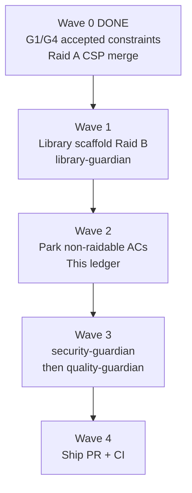

# Operation Automated LO Gauntlet Execution Ledger

## Raid contract

| Field | Value |
| --- | --- |
| Branch | `cursor/gauntlet-prd001-closeout-ac42` |
| Date | 2026-08-25 |
| Scope | PRD-001 only: 305 exact acceptance criteria across PRD-001j through PRD-001i |
| Authoritative AC source | [`PRODUCTION_EXECUTION_LEDGER.md`](./PRODUCTION_EXECUTION_LEDGER.md) |
| Product map cross-check | [`library/knowledge/private/product/project-map.md`](./library/knowledge/private/product/project-map.md) |
| Security follow-up (non-AC) | Raid A nonce CSP Medium: **CLOSED** (2026-08-25). See [`2026-08-25-raid-a-csp-security-audit.md`](./library/requirements/in-work/prd-001-operation-automated-lo/qa/2026-08-25-raid-a-csp-security-audit.md). |

### Honest completion bound

This Gauntlet run cannot reach 100% `VERIFIED` on all 305 PRD-001 acceptance criteria without external evidence. The repository has independently verified every criterion that can be proved locally (267 of 305). The remaining 38 criteria are parked with exact asks below:

- 28 criteria are `DEFERRED: LIVE HIGHLEVEL AUTH` (G2 product-owner direction; seams remain fail-closed).
- 7 criteria are `BLOCKED: EXTERNAL EVIDENCE` (real environment, operations, AI evaluation, or compliance evidence).
- 1 criterion is `BLOCKED: G5` (isolated no-spend live lead routing).
- 2 criteria are `ACCEPTED CONSTRAINT` for G4 Housing Special Ad Category (product-owner decision 2026-08-25).

Recent gate decisions recorded in this run:

- **G1 Distribution**: `ACCEPTED CONSTRAINT` (2026-08-25). External Marketplace distribution proof is not a launch prerequisite.
- **G4 Special Ad Category**: `ACCEPTED CONSTRAINT` (2026-08-25). Housing SAC is known and enforced in product; App Test discovery is not required.
- **Raid A nonce CSP**: Medium finding **CLOSED** (2026-08-25). This is a security follow-up, not a PRD-001 AC unless separately tracked in the production ledger.

PRD-001 is **not complete**. This ledger is the single source of truth for Gauntlet Phase 0 closeout scope, wave execution, external parks, and guardian placeholders.

---

## Status summary

Counts parsed from [`PRODUCTION_EXECUTION_LEDGER.md`](./PRODUCTION_EXECUTION_LEDGER.md) AC rows on 2026-08-25. Cross-checked against project-map v1.1.

| Status | Count | Notes |
| --- | ---: | --- |
| `VERIFIED` | 267 | Locally provable; independently verified in production ledger |
| `DEFERRED: LIVE HIGHLEVEL AUTH` | 28 | G2; fail-closed implementation retained |
| `BLOCKED: EXTERNAL EVIDENCE` | 7 | Real KMS, environment, ops, onboarding, AI, or compliance evidence |
| `BLOCKED: G5` | 1 | Live no-spend synthetic lead routing |
| `ACCEPTED CONSTRAINT` | 2 | G4 Housing SAC criteria (`001E-AC-005`, `001E-AC-006`) |
| **Total PRD-001 ACs** | **305** | |

**Project-map drift check:** counts match project-map exactly (267 / 28 / 7 / 1 / 2). No drift.

**Non-verified total:** 38 criteria (28 + 7 + 1 + 2).

**Gate-level dispositions** (from external gate register; not all map 1:1 to AC rows):

| Gate | Status |
| --- | --- |
| G1 Distribution | `ACCEPTED CONSTRAINT` |
| G2 OAuth and session | `DEFERRED FOR NOW` |
| G3 Meta publish | `BLOCKED` |
| G4 Special Ad Category | `ACCEPTED CONSTRAINT` |
| G5 Lead routing | `BLOCKED` |
| G6 Billing lifecycle | `BLOCKED` |
| G7 Legal operating model | `BLOCKED` |
| G8 Demand | `ACCEPTED CONSTRAINT` |

---

## Wave plan

### Wave 0: Constraint and security merges (DONE)

| Item | Guardian / owner | Model | Status | Exit criteria |
| --- | --- | --- | --- | --- |
| G1 Distribution accepted constraint | Product owner decision | N/A | DONE | Recorded 2026-08-25; no Marketplace proof required for launch |
| G4 Special Ad Category accepted constraint | Product owner decision | N/A | DONE | Recorded 2026-08-25; Housing SAC enforced; App Test discovery not required |
| Raid A nonce CSP Medium | `security-guardian` | `composer-2.5` | DONE | 0 Critical / 0 High / 0 Medium in scope per 2026-08-25 security audit |

### Wave 1: Library scaffold Raid B

| Guardian | Model | Rationale | Ownership | Exit criteria |
| --- | --- | --- | --- | --- |
| `library-guardian` | `composer-2.5-fast` | Mechanical scaffold and README gaps; bounded file creation with clear structural spec | `library/knowledge/private/standards/`, missing README files under `library/knowledge/private/` and `library/requirements/backlog/` per project-map drift check | All five scaffold gaps closed; read-only structural audit passes |

### Wave 2: Park and document non-raidable ACs (this ledger)

| Guardian | Model | Rationale | Ownership | Exit criteria |
| --- | --- | --- | --- | --- |
| Gauntlet orchestrator | `composer-2.5` | Documentation and honest status accounting; no invented VERIFIED claims | `GAUNTLET_EXECUTION_LEDGER.md`, external park list | Every non-verified AC has status, exact ask, and responsible owner; counts reconcile to production ledger |

### Wave 3: Guardian close-out

| Guardian | Model | Rationale | Ownership | Exit criteria |
| --- | --- | --- | --- | --- |
| `security-guardian` | `claude-4.6-sonnet-medium-thinking` | Security-sensitive release tree review; matrix choice for balanced audit depth | Release branch diff touching auth, CSP, or request boundaries | 0 Critical / 0 High / 0 Medium findings at or above policy threshold |
| `quality-guardian` | `claude-4.6-sonnet-medium-thinking` | Independent verification against plan and ledger | Full release gate and ledger alignment | QA report passes with no medium-or-higher open items |

### Wave 4: Ship

| Step | Model | Exit criteria |
| --- | --- | --- |
| Fetch `origin/main`, resolve conflicts, rebase if needed | `gpt-5.3-codex-high` | Merge tree clean; no conflicting files |
| Commit, push, open PR, monitor CI | `gpt-5.3-codex-high` | PR open with this ledger; required checks green |

---

## External park list

Adapted from [`PRODUCTION_EXECUTION_LEDGER.md` § Exact external evidence asks](./PRODUCTION_EXECUTION_LEDGER.md#exact-external-evidence-asks). Each row lists the exact ask for the user or named owner.

| Criteria or gate | Status | Responsible owner | Exact ask |
| --- | --- | --- | --- |
| `001J-AC-022` through `024`, `001J-AC-028`, `001A-AC-005` through `016`, `018` through `023`, `026`, `028`, `038`, `001H-AC-002`, `003`, `005` (G2) | `DEFERRED: LIVE HIGHLEVEL AUTH` | Product owner plus an authorized HighLevel App Test operator | Run the documented OAuth and session matrix in controlled locations. Preserve sanitized evidence for signed context, refresh, uninstall, iframe, and first-party fallback. Marketplace distribution proof is not required under the G1 accepted constraint. |
| `001J-AC-026` | `BLOCKED: EXTERNAL EVIDENCE` | Platform security and cloud owner | Rotate a current token envelope, restore it with the intended environment key, prove denied cross-environment decryption, and retain the key identifiers, timestamps, and sanitized recovery log. |
| `001J-AC-029` | `BLOCKED: EXTERNAL EVIDENCE` | Cloud and deployment owner | Record database, task, secret, storage, Stripe mode, and provider-app identifiers for preview, staging, and production, then prove pairwise isolation and denied cross-environment access. |
| `001J-AC-033` | `BLOCKED: EXTERNAL EVIDENCE` | Production operations owner | Execute the release runbook in production with named approver and correlation IDs. Retain smoke output, labeled synthetic records, rollback result, database restore evidence, and provider reconciliation evidence. |
| `001E-AC-005`, `001E-AC-006` (G4) | `ACCEPTED CONSTRAINT` | Product owner | Keep `ACCEPTED CONSTRAINT`. Housing Special Ad Category remains enforced in product preflight. Do not reopen G4 unless the founding campaign type changes or Meta policy requires a new category matrix. |
| `001F-AC-026` (G5) | `BLOCKED: G5` | Authorized location administrator or publisher plus compliance owner | Send one clearly labeled isolated test lead, then prove contact creation, test tag, opportunity, owner assignment, workflow, notification, attribution, replay safety, and exclusion from production reporting. |
| `001H-AC-001` | `BLOCKED: EXTERNAL EVIDENCE` | Product and UX owner | Enroll a prepared direct-install location administrator, start the timer before install, prohibit Cuantico configuration changes, and retain evidence that Launch Ready was reached within 30 minutes or the exact blocker and elapsed time. |
| `001I-AC-007` | `BLOCKED: EXTERNAL EVIDENCE` | AI platform owner | Run the identical versioned golden corpus through the configured primary and fallback providers, preserve model and prompt versions plus redacted outputs and scores, and prove fallback activation without changing the corpus. |
| `001I-AC-013` (G7) | `BLOCKED: EXTERNAL EVIDENCE` | Security and legal owners | Complete the production AI data-flow review, record provider contract and retention decisions, approve subprocessors and prompt-content boundaries, and sign the review with named owners and date. |
| `001I-AC-014` | `BLOCKED: EXTERNAL EVIDENCE` | Finance and product owners | Collect actual request, token, fallback, and cost totals by active location at 30, 60, and 90-day checkpoints. Confirm the monthly normal-usage cost remains below USD 5 or open a documented pricing and routing review. |
| G3 | `BLOCKED` | Engineering and authorized Meta App Test operator | Exercise no-spend Meta publish controls through HighLevel with Housing Special Ad Category. Preserve sanitized request and response evidence. |
| G6 | `BLOCKED` | Billing and product owners | Exercise the complete billing lifecycle in the authorized environment with signed webhook evidence and reconciled entitlement state. No live billing claim is permitted before this run. |
| G1 | `ACCEPTED CONSTRAINT` | Product owner | Keep `ACCEPTED CONSTRAINT`. Do not claim Marketplace listing or post-five-agency distribution without a separate authorization. |
| G8 | `ACCEPTED CONSTRAINT` | Product owner | Keep `ACCEPTED CONSTRAINT`. Reopen the demand gate only after paid-customer evidence exists; this repository raid cannot convert it to `PASS`. |

---

## Raidable vs not raidable

| Category | In scope for repository raid | Count / items |
| --- | --- | --- |
| **Raidable now** | Library scaffold gaps (Raid B), guardian close-out on release tree, PR and CI ship | 5 README/standards gaps; security and quality re-run; merge and CI |
| **Not raidable without external evidence** | All 38 non-verified PRD-001 ACs | 28 deferred live auth, 7 blocked external, 1 blocked G5, 2 accepted constraint (G4) |
| **Not raidable without separate authorization** | G3 live Meta publish, G6 live billing, G7 counsel approval, G8 paid-founder proof | Gate-level; exact asks in external park list |
| **Closed outside PRD AC ledger** | Raid A nonce CSP Medium | Security follow-up closed 2026-08-25 |

---

## Watchdog and stall log

| Timestamp (UTC) | Sub-agent / wave | Event | Action taken |
| --- | --- | --- | --- |
| | | | |

No stalls recorded at ledger creation.

---

## Guardian results

| Guardian | Run date | Status | Report link | Findings summary |
| --- | --- | --- | --- | --- |
| `security-guardian` (Wave 3 close-out) | Pending | Pending | | |
| `quality-guardian` (Wave 3 close-out) | Pending | Pending | | |
| `security-guardian` (Raid A CSP) | 2026-08-25 | CLOSED | [`2026-08-25-raid-a-csp-security-audit.md`](./library/requirements/in-work/prd-001-operation-automated-lo/qa/2026-08-25-raid-a-csp-security-audit.md) | 0 Critical, 0 High, 0 Medium in scope |

---

## Changelog

| Date | Event |
| --- | --- |
| 2026-08-25 | Gauntlet Phase 0 master ledger created on `cursor/gauntlet-prd001-closeout-ac42`. Status counts derived from production ledger; G1/G4 accepted constraints and Raid A CSP close-out recorded. Waves 1 through 4 pending. |
