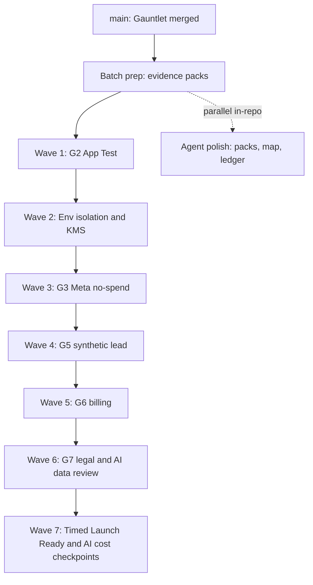

# Next Batch Ledger: External Evidence Sprint

## Contract

| Field        | Value                                                                                                                                                                   |
| ------------ | ----------------------------------------------------------------------------------------------------------------------------------------------------------------------- |
| Branch       | Prep and G2 harness landed on `main` (PRs #26, #27). Live Wave 1 awaits HighLevel app approval.                                                                         |
| Date         | 2026-08-26                                                                                                                                                              |
| Prerequisite | Gauntlet closeout (`25c0bdc`), evidence packs (`6965bf7`), G2 harness (`a530947`) on `main`                                                                             |
| Scope        | Unblock production-path evidence for G2, environment/KMS, G3, G5, G6, G7, and remaining timed/AI cost criteria                                                          |
| Honest bound | Agents cannot invent live HighLevel, Meta, Stripe, KMS, or counsel evidence. This batch is operator-led with agent-supported harnesses, checklists, and ledger updates. |
| Current park | Waiting on HighLevel to approve the app, then App Test operator access for Wave 1.                                                                                      |

Upstream closeout: [`GAUNTLET_EXECUTION_LEDGER.md`](./GAUNTLET_EXECUTION_LEDGER.md) (267 `VERIFIED`, 38 non-verified parked). Authoritative AC source remains [`PRODUCTION_EXECUTION_LEDGER.md`](./PRODUCTION_EXECUTION_LEDGER.md).

---

## Why this batch

In-repo PRD-001 work that can be proved locally is done. The project-map next steps and the Gauntlet external park list now dominate critical path. The next batch optimizes for **shortest path to production authorization**: clear the largest deferred block (G2 live HighLevel auth), then environment isolation, then Meta/lead/billing/legal.

---

## Status of parked criteria (starting point)

| Status                               |               Count | Batch treatment       |
| ------------------------------------ | ------------------: | --------------------- |
| `DEFERRED: LIVE HIGHLEVEL AUTH` (G2) |                  28 | Wave 1 primary target |
| `BLOCKED: EXTERNAL EVIDENCE`         |                   7 | Waves 2, 6, 7         |
| `BLOCKED: G5`                        |                   1 | Wave 4                |
| `ACCEPTED CONSTRAINT` (G4 ACs)       |                   2 | Do not reopen         |
| Gate G3 / G6                         |             BLOCKED | Waves 3 and 5         |
| Gate G1 / G8                         | ACCEPTED CONSTRAINT | Do not reopen         |

---

## Wave plan

### Batch prep (in-repo, agent-owned) — START HERE

| Owner                             | Model               | Deliverable                                                                                 | Exit criteria                                                                                                                 |
| --------------------------------- | ------------------- | ------------------------------------------------------------------------------------------- | ----------------------------------------------------------------------------------------------------------------------------- |
| `library-guardian` / orchestrator | `composer-2.5-fast` | Evidence pack stubs under `docs/operations/evidence-packs/` for G2, env/KMS, G3, G5, G6, G7 | Each pack lists exact criteria IDs, required sanitized artifacts, prohibited data (secrets/PII/spend), and pass/fail checkbox |
| orchestrator                      | `composer-2.5-fast` | Update `project-map.md`, agent `the-map.mdc`, and this ledger after harness merge           | DONE 2026-08-26: HighLevel app-approval park recorded                                                                         |

### Wave 1: G2 HighLevel App Test (operator + `gohighlevel-guardian`)

**Unblocks:** `001J-AC-022`–`024`, `001J-AC-028`, `001A-AC-005`–`016`, `018`–`023`, `026`, `028`, `038`, `001H-AC-002`, `003`, `005` (28 criteria).

| Need from user                            | Exact ask                                                                                                |
| ----------------------------------------- | -------------------------------------------------------------------------------------------------------- |
| Authorized HighLevel App Test location(s) | Credentials or invite for App Test operator; one controlled location for install matrix                  |
| Product owner                             | Confirm private App Test / founding beta boundary (G1 remains accepted constraint; no Marketplace claim) |

| Owner                  | Model                           | Work                                                                                                                                                             |
| ---------------------- | ------------------------------- | ---------------------------------------------------------------------------------------------------------------------------------------------------------------- |
| Operator               | N/A                             | Run OAuth and session matrix: signed Custom Page context, callback, token exchange, refresh, uninstall, reinstall, role resolution, iframe, first-party fallback |
| `gohighlevel-guardian` | `claude-sonnet-5-thinking-high` | Ingest sanitized fixtures into existing GHL harness; flip criteria only when evidence hashes and schemas pass                                                    |

**Exit:** All 28 G2-deferred criteria move to `VERIFIED` with sanitized evidence, or remain deferred with a precise residual ask.

**Status (2026-08-26):** Harness READY on `main` (PR #27, `a530947`: env-gated capture, matrix CLI, contract + unit tests). Operator run BLOCKED: waiting on **HighLevel app approval**, then App Test operator access for one controlled location. All nine matrix cases carry residual asks in [`docs/operations/evidence-packs/g2-highlevel-app-test.md`](./docs/operations/evidence-packs/g2-highlevel-app-test.md). Criteria remain `DEFERRED: LIVE HIGHLEVEL AUTH`.

**Server-only PIT seam (cross-ref M6):** production task composition requires `OALO_GHL_LOCATION_PIT_JSON` (`{ "locationId", "accessToken" }`) matching `OALO_GHL_READINESS_LOCATION_REF`. That secret is for deployed task workers after auth is live; it is **not** a substitute for Wave 1 App Test evidence and must never be committed or pasted into ledgers. See README production task composition notes and [`docs/operations/evidence-packs/g2-highlevel-app-test.md`](./docs/operations/evidence-packs/g2-highlevel-app-test.md).

### Wave 2: Environment isolation and KMS

**Unblocks:** `001J-AC-026`, `001J-AC-029` (and supports later `001J-AC-033`).

| Need from user         | Exact ask                                                                          |
| ---------------------- | ---------------------------------------------------------------------------------- |
| Cloud / platform owner | Preview, staging, and dark production resource inventory; per-environment KMS keys |

| Owner                                          | Model                           | Work                                                                                                   |
| ---------------------------------------------- | ------------------------------- | ------------------------------------------------------------------------------------------------------ |
| Operator + `devops-guardian` / `auth-guardian` | `claude-sonnet-5-thinking-high` | Prove pairwise isolation; rotate and restore token envelope; prove denied cross-environment decryption |

**Exit:** Both criteria `VERIFIED` with retained key IDs, timestamps, and sanitized recovery logs. Production traffic stays disabled.

### Wave 3: G3 Meta publish (no-spend)

**Unblocks:** Gate G3 (supports Meta-facing `001E` live acceptance).

| Need from user         | Exact ask                                                                                                |
| ---------------------- | -------------------------------------------------------------------------------------------------------- |
| Meta App Test operator | Controlled draft, read-back, explicit publish, pause/resume, reconciliation, reporting; Housing SAC only |

**Exit:** G3 `PASS` with sanitized request/response evidence. No paid spend.

**Server-only PIT seam (cross-ref M6):** Meta publish workers in production composition resolve location tokens from `OALO_GHL_LOCATION_PIT_JSON` (must match `OALO_GHL_READINESS_LOCATION_REF`). Wave 3 evidence remains sanitized Meta request/response capture; the PIT JSON itself is never retained in evidence packs. See [`docs/operations/evidence-packs/g3-meta-no-spend.md`](./docs/operations/evidence-packs/g3-meta-no-spend.md).

### Wave 4: G5 synthetic lead

**Unblocks:** `001F-AC-026`.

| Need from user              | Exact ask                                                                                                       |
| --------------------------- | --------------------------------------------------------------------------------------------------------------- |
| Location admin + compliance | One labeled isolated no-spend test lead; full routing and attribution proof; excluded from production reporting |

**Exit:** `001F-AC-026` `VERIFIED`.

### Wave 5: G6 billing lifecycle

**Unblocks:** Gate G6.

| Need from user | Exact ask                                                                                                |
| -------------- | -------------------------------------------------------------------------------------------------------- |
| Billing owner  | Stripe test (or authorized) checkout, charge, entitlement, webhook, cancel, refund with reconciled state |

**Exit:** G6 `PASS`. No silent live billing claims before this run.

### Wave 6: G7 legal and AI data review

**Unblocks:** Gate G7 and `001I-AC-013`.

| Need from user              | Exact ask                                                                                                               |
| --------------------------- | ----------------------------------------------------------------------------------------------------------------------- |
| Counsel + lender + security | Founding blueprint, disclosures, retention, provider terms, subprocessors, prompt-boundary approval with named sign-off |

**Exit:** G7 `PASS`; `001I-AC-013` `VERIFIED`.

### Wave 7: Timed Launch Ready and AI cost

**Unblocks:** `001H-AC-001`, `001I-AC-007`, `001I-AC-014`, and supports `001J-AC-033` production exercises.

| Need from user  | Exact ask                                                           |
| --------------- | ------------------------------------------------------------------- |
| Product/UX      | Timed 30-minute Launch Ready on prepared direct-install location    |
| AI platform     | Primary and fallback golden corpus evaluation                       |
| Finance/product | 30/60/90-day cost checkpoints once cohort exists                    |
| Ops             | Production smoke, rollback, restore, reconciliation (`001J-AC-033`) |

**Exit:** Named criteria `VERIFIED` or residual ask recorded; still no fake PASS on G8.

---

## Close-out rules (every wave)

1. Sanitized evidence only: no tokens, secrets, customer PII, card data, or live spend in git.
2. Update `PRODUCTION_EXECUTION_LEDGER.md` criterion rows and the external park table.
3. Run `security-guardian` then `quality-guardian` after any code or harness change (never reverse).
4. Do not move PRD-001 to `completed/` until core-completion definition in the project map is satisfied.
5. G1, G4, and G8 stay `ACCEPTED CONSTRAINT` unless product owner reopens them with new evidence.

---

## Immediate asks (user)

**Current wait:** HighLevel app approval (Marketplace / App Test eligibility). Do not invent live evidence while parked.

Once HighLevel approves the app, provide:

1. **HighLevel App Test access** (operator account or invite) for one controlled location.
2. **Named App Test operator** (person who will run the OAuth/session matrix).
3. Confirmation that **founding distribution remains private App Test / one-agency beta** (G1 accepted constraint unchanged: listing proof is still not a launch gate).

Optional parallel (Wave 2 prep): cloud owner for preview/staging/production inventory and KMS key custody.

---

## Watchdog

| Timestamp (UTC) | Event                                                    | Action                                              |
| --------------- | -------------------------------------------------------- | --------------------------------------------------- |
| 2026-08-25      | Batch ledger created after PR #25 squash-merge to `main` | Awaiting user credentials for Wave 1                |
| 2026-08-25      | G2 harness shipped on `cursor/g2-app-test-harness-ac42`  | Wave 1 operator run parked: need App Test access    |
| 2026-08-25      | Prep PR #26 squash-merged to `main` (`6965bf7`)          | Evidence packs on trunk                             |
| 2026-08-25      | G2 harness PR #27 squash-merged to `main` (`a530947`)    | Harness on trunk; live matrix still parked          |
| 2026-08-26      | Product owner: waiting on HighLevel app approval         | Wave 1 stays parked; maps updated for agent handoff |
| 2026-08-26      | Reverse-review PR #29 + remediation PR #30 on `main`     | H1-H3 closed; Wave 1 still parked on HL approval    |
| 2026-09-03      | Repo hygiene raid (M3/M4/M5/M20 in-repo)                 | Templates, Dependabot, ledger path, proxy rename    |
| 2026-09-03      | Dependabot first-run flood (7 PRs, mostly majors)        | Ignore majors; group weekly minor/patch only        |
| 2026-09-03      | Actions major raid (checkout 7 / cache 6 / setup-node 7) | SHA-pinned planned bump; npm majors stay deferred   |

---

## Changelog

| Date       | Event                                                                                        |
| ---------- | -------------------------------------------------------------------------------------------- |
| 2026-08-25 | Next batch defined: External Evidence Sprint, Waves 1-7, agent prep + operator-led gates.    |
| 2026-08-25 | Prep PR #26 merged. G2 live-capture harness ready; Wave 1 parked on App Test credentials.    |
| 2026-08-25 | G2 harness PR #27 merged to `main` (`a530947`).                                              |
| 2026-08-26 | Critical path restated: park on HighLevel app approval; project-map + agent the-map updated. |
| 2026-08-26 | Reverse-review Highs remediations merged (`56d90f6`).                                        |
| 2026-09-03 | Repo hygiene: PR/issue templates, Dependabot, ledger generator path, middleware->proxy.      |
| 2026-09-03 | Dependabot majors ignored (PR #39). Planned Actions major raid authored.                     |

## Process follow-ups (from reverse review / security audits)

| ID    | Item                                            | Status                                                                               |
| ----- | ----------------------------------------------- | ------------------------------------------------------------------------------------ |
| M3    | `generate-production-execution-ledger.mjs` path | Fixed to `in-work`; default write is `tmp/` (needs `--write-canonical` to overwrite) |
| M4    | Next.js `middleware` -> `proxy`                 | Migrated `apps/web/src/proxy.ts`                                                     |
| M5    | Security follow-ups in watchdog                 | This table + watchdog rows                                                           |
| M20   | Templates + Dependabot                          | Added under `.github/`                                                               |
| Human | Disable rebase merge; ruleset squash-only       | Settings API denied to agent; owner action                                           |
| Human | HighLevel app approval                          | Unchanged critical path                                                              |
| AM    | Actions majors (checkout 7 / cache 6 / setup-node 7) | This raid: SHA-pinned in `.github/workflows/ci.yml`                             |
