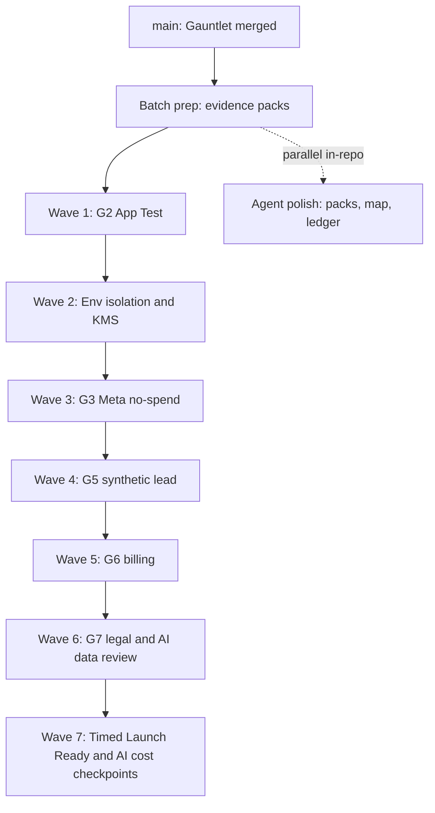

# Next Batch Ledger: External Evidence Sprint

## Contract

| Field | Value |
| --- | --- |
| Branch | `cursor/next-batch-external-evidence-ac42` |
| Date | 2026-08-25 |
| Prerequisite | Gauntlet closeout merged to `main` (PR #25, squash `25c0bdc`) |
| Scope | Unblock production-path evidence for G2, environment/KMS, G3, G5, G6, G7, and remaining timed/AI cost criteria |
| Honest bound | Agents cannot invent live HighLevel, Meta, Stripe, KMS, or counsel evidence. This batch is operator-led with agent-supported harnesses, checklists, and ledger updates. |

Upstream closeout: [`GAUNTLET_EXECUTION_LEDGER.md`](./GAUNTLET_EXECUTION_LEDGER.md) (267 `VERIFIED`, 38 non-verified parked). Authoritative AC source remains [`PRODUCTION_EXECUTION_LEDGER.md`](./PRODUCTION_EXECUTION_LEDGER.md).

---

## Why this batch

In-repo PRD-001 work that can be proved locally is done. The project-map next steps and the Gauntlet external park list now dominate critical path. The next batch optimizes for **shortest path to production authorization**: clear the largest deferred block (G2 live HighLevel auth), then environment isolation, then Meta/lead/billing/legal.

---

## Status of parked criteria (starting point)

| Status | Count | Batch treatment |
| --- | ---: | --- |
| `DEFERRED: LIVE HIGHLEVEL AUTH` (G2) | 28 | Wave 1 primary target |
| `BLOCKED: EXTERNAL EVIDENCE` | 7 | Waves 2, 6, 7 |
| `BLOCKED: G5` | 1 | Wave 4 |
| `ACCEPTED CONSTRAINT` (G4 ACs) | 2 | Do not reopen |
| Gate G3 / G6 | BLOCKED | Waves 3 and 5 |
| Gate G1 / G8 | ACCEPTED CONSTRAINT | Do not reopen |

---

## Wave plan

### Batch prep (in-repo, agent-owned) — START HERE

| Owner | Model | Deliverable | Exit criteria |
| --- | --- | --- | --- |
| `library-guardian` / orchestrator | `composer-2.5-fast` | Evidence pack stubs under `docs/operations/evidence-packs/` for G2, env/KMS, G3, G5, G6, G7 | Each pack lists exact criteria IDs, required sanitized artifacts, prohibited data (secrets/PII/spend), and pass/fail checkbox |
| orchestrator | `composer-2.5-fast` | Update `project-map.md` and this ledger after merge | `main` tip and next-batch pointer recorded |

### Wave 1: G2 HighLevel App Test (operator + `gohighlevel-guardian`)

**Unblocks:** `001J-AC-022`–`024`, `001J-AC-028`, `001A-AC-005`–`016`, `018`–`023`, `026`, `028`, `038`, `001H-AC-002`, `003`, `005` (28 criteria).

| Need from user | Exact ask |
| --- | --- |
| Authorized HighLevel App Test location(s) | Credentials or invite for App Test operator; one controlled location for install matrix |
| Product owner | Confirm private App Test / founding beta boundary (G1 remains accepted constraint; no Marketplace claim) |

| Owner | Model | Work |
| --- | --- | --- |
| Operator | N/A | Run OAuth and session matrix: signed Custom Page context, callback, token exchange, refresh, uninstall, reinstall, role resolution, iframe, first-party fallback |
| `gohighlevel-guardian` | `claude-sonnet-5-thinking-high` | Ingest sanitized fixtures into existing GHL harness; flip criteria only when evidence hashes and schemas pass |

**Exit:** All 28 G2-deferred criteria move to `VERIFIED` with sanitized evidence, or remain deferred with a precise residual ask.

### Wave 2: Environment isolation and KMS

**Unblocks:** `001J-AC-026`, `001J-AC-029` (and supports later `001J-AC-033`).

| Need from user | Exact ask |
| --- | --- |
| Cloud / platform owner | Preview, staging, and dark production resource inventory; per-environment KMS keys |

| Owner | Model | Work |
| --- | --- | --- |
| Operator + `devops-guardian` / `auth-guardian` | `claude-sonnet-5-thinking-high` | Prove pairwise isolation; rotate and restore token envelope; prove denied cross-environment decryption |

**Exit:** Both criteria `VERIFIED` with retained key IDs, timestamps, and sanitized recovery logs. Production traffic stays disabled.

### Wave 3: G3 Meta publish (no-spend)

**Unblocks:** Gate G3 (supports Meta-facing `001E` live acceptance).

| Need from user | Exact ask |
| --- | --- |
| Meta App Test operator | Controlled draft, read-back, explicit publish, pause/resume, reconciliation, reporting; Housing SAC only |

**Exit:** G3 `PASS` with sanitized request/response evidence. No paid spend.

### Wave 4: G5 synthetic lead

**Unblocks:** `001F-AC-026`.

| Need from user | Exact ask |
| --- | --- |
| Location admin + compliance | One labeled isolated no-spend test lead; full routing and attribution proof; excluded from production reporting |

**Exit:** `001F-AC-026` `VERIFIED`.

### Wave 5: G6 billing lifecycle

**Unblocks:** Gate G6.

| Need from user | Exact ask |
| --- | --- |
| Billing owner | Stripe test (or authorized) checkout, charge, entitlement, webhook, cancel, refund with reconciled state |

**Exit:** G6 `PASS`. No silent live billing claims before this run.

### Wave 6: G7 legal and AI data review

**Unblocks:** Gate G7 and `001I-AC-013`.

| Need from user | Exact ask |
| --- | --- |
| Counsel + lender + security | Founding blueprint, disclosures, retention, provider terms, subprocessors, prompt-boundary approval with named sign-off |

**Exit:** G7 `PASS`; `001I-AC-013` `VERIFIED`.

### Wave 7: Timed Launch Ready and AI cost

**Unblocks:** `001H-AC-001`, `001I-AC-007`, `001I-AC-014`, and supports `001J-AC-033` production exercises.

| Need from user | Exact ask |
| --- | --- |
| Product/UX | Timed 30-minute Launch Ready on prepared direct-install location |
| AI platform | Primary and fallback golden corpus evaluation |
| Finance/product | 30/60/90-day cost checkpoints once cohort exists |
| Ops | Production smoke, rollback, restore, reconciliation (`001J-AC-033`) |

**Exit:** Named criteria `VERIFIED` or residual ask recorded; still no fake PASS on G8.

---

## Close-out rules (every wave)

1. Sanitized evidence only: no tokens, secrets, customer PII, card data, or live spend in git.
2. Update `PRODUCTION_EXECUTION_LEDGER.md` criterion rows and the external park table.
3. Run `security-guardian` then `quality-guardian` after any code or harness change (never reverse).
4. Do not move PRD-001 to `completed/` until core-completion definition in the project map is satisfied.
5. G1, G4, and G8 stay `ACCEPTED CONSTRAINT` unless product owner reopens them with new evidence.

---

## Immediate asks (user)

To start Wave 1 this week, provide:

1. **HighLevel App Test access** (operator account or invite) for one controlled location.
2. **Named App Test operator** (person who will run the OAuth/session matrix).
3. Confirmation that **founding distribution remains private App Test / one-agency beta** (G1 accepted constraint unchanged).

Optional parallel (Wave 2 prep): cloud owner for preview/staging/production inventory and KMS key custody.

---

## Watchdog

| Timestamp (UTC) | Event | Action |
| --- | --- | --- |
| 2026-08-25 | Batch ledger created after PR #25 squash-merge to `main` | Awaiting user credentials for Wave 1 |

---

## Changelog

| Date | Event |
| --- | --- |
| 2026-08-25 | Next batch defined: External Evidence Sprint, Waves 1-7, agent prep + operator-led gates. |
