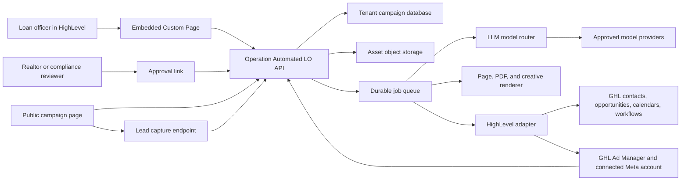
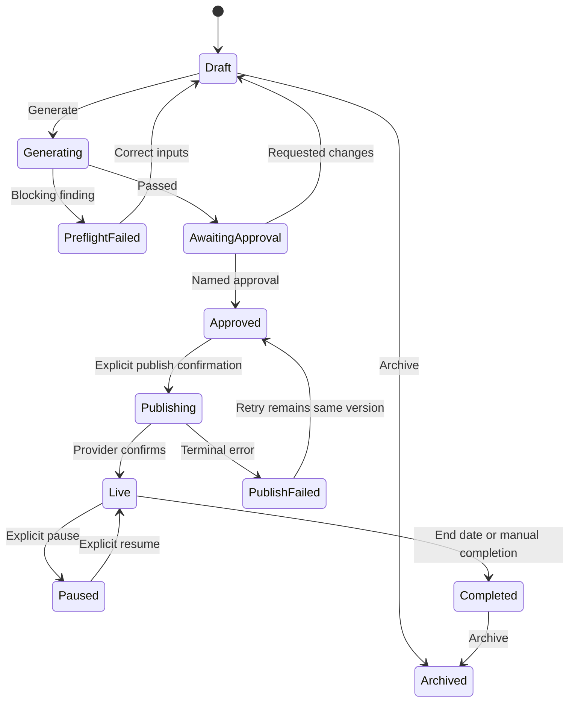

# System Architecture

## Architectural decision

Build one multi-tenant product with an embedded HighLevel surface and externally hosted public campaign assets. Do not create one Lovable project, Supabase project, or deployment per loan officer.

Lovable proved the workflows and page designs. The scalable system turns those proofs into shared components, tenant configuration, immutable campaign versions, and adapters around HighLevel.

## System context



## Runtime components

| Component | Responsibility |
| --- | --- |
| Web application | Embedded loan-officer workspace, standalone support view, approvals, campaign editor, and dashboards |
| API and session gateway | Signed HighLevel context verification, application sessions, authorization, validation, and command intake |
| Tenant database | Product-owned configuration, campaigns, versions, artifacts, approvals, attribution links, and audits |
| Encrypted token vault | Per-installation GHL access and refresh tokens with rotation metadata |
| Object storage and CDN | Original approved property photos, generated PDFs, creative, and public-page assets |
| Durable job system | Rendering, provider writes, reporting sync, retries, and reconciliation |
| Asset compiler | Blueprint plus brand plus partner plus property becomes deterministic page/PDF/ad/email/SMS inputs |
| Preflight engine | Brand, mortgage disclosure, consent, ad policy, and asset-permission checks |
| GHL adapter | OAuth, rate limiting, contacts, opportunities, calendars, forms, tags, workflows, ads, and reporting |
| Public campaign renderer | Fast server-rendered page using a deliberately limited published projection |
| Attribution service | Links public visits and captured leads to GHL contacts, opportunities, appointments, and outcomes |
| Onboarding orchestrator | Resumable permission, profile, routing, Meta, role, and synthetic-test setup with server-verified completion |
| LLM model router | Versioned primary, cheap, and fallback model policy for brand assistance and campaign copy |
| Prompt compiler | Confirmed brand and campaign versions become a compact tenant-isolated prompt snapshot and strict output schema |
| AI usage ledger | Per-location token, cache, latency, retry, estimated-cost, quota, and reconciliation events |

## Dashboard theme architecture

The authenticated dashboard supports three explicit preferences: `light`, `dark`, and `system`. The first visit uses the browser or operating-system preference. A user selection applies immediately without reloading and persists under a product-specific browser storage key. Choosing `system` removes the manual override and resumes following `prefers-color-scheme`.

The approved decorative animation pattern for authentication and onboarding is documented in [`../frontend/ambient-motion-background.md`](../frontend/ambient-motion-background.md). Dense campaign, reporting, approval, and compliance surfaces do not use ambient icon motion.

Theme behavior is an application-interface preference, not tenant campaign content:

- The preference affects the embedded dashboard and standalone authenticated workspace.
- Public property pages, PDFs, QR destinations, Meta creative, and approval artifacts keep their frozen campaign and brand styling.
- Changing dashboard theme does not create a campaign version, invalidate approval, or change an artifact hash.
- One tenant's brand tokens cannot leak into another location or support session.

The runtime contract uses two independent layers:

1. Semantic light and dark tokens control dashboard roles such as background, surface, border, text, primary action, destructive action, charts, and status.
2. Validated tenant brand overrides can replace a limited set of semantic tokens for both modes without injecting arbitrary CSS.

Components reference semantic tokens only. Primitive palette values and raw color literals never appear in component code. Both modes must cover default, hover, focus, active, selected, disabled, loading, empty, warning, error, and success states.

For a React or Next.js implementation, the theme provider must run at the application root, apply the resolved class before first paint, declare `color-scheme`, and prevent hydration mismatch. Theme-dependent JavaScript rendering waits until the client is mounted; CSS-driven differences do not require conditional rendering. A strict content security policy must allow the nonce-bearing pre-paint theme script without weakening the remaining script policy.

The theme selector must be keyboard operable, expose an accessible name and selected state, retain visible focus, and never communicate status through color alone. Text and interactive controls must meet WCAG AA contrast in both modes. Charts use labels, shapes, or patterns in addition to color.

## Self-onboarding architecture

Self-onboarding is a durable location-level workflow, not a front-end tour. It combines server-verified configuration tasks with optional contextual guidance. The user can leave and return on another device without losing progress.

The onboarding state machine is:

```text
not_started -> in_progress -> blocked | launch_ready
blocked -> in_progress
launch_ready -> attention_required -> launch_ready
```

Each step records status, evidence timestamp, safe provider identifiers, blocking code, remediation, and last verifier version. The application recomputes readiness when tokens, GHL mappings, Meta assets, compliance profiles, or role assignments change.

Two progressive checklists keep the experience short:

1. **Get Connected:** validate installer authority and scopes, complete brand and compliance profile, map GHL routing, select connected Meta assets, and assign application roles.
2. **Launch Readiness:** revalidate dependencies, run the synthetic lead path, show the resulting GHL objects and notifications, and issue the Launch Ready state.

Checklist completion is based on observed system state. Users cannot mark a technical step complete manually. Attestations remain explicit user actions and record their disclosure version.

The core value milestone is `launch_ready`, not checklist completion. A location is Launch Ready only when:

- The Marketplace installation and signed user context are valid.
- Required OAuth scopes are granted and the token is healthy.
- Required brand, license, disclosure, consent, and Realtor fields are complete.
- Pipeline, stage, owner or assignment rule, calendar, campaign tag, and optional workflow mappings resolve in the active GHL location.
- Required Meta integration and assets are connected and accessible through HighLevel.
- Creator, approver, and publisher responsibilities are assigned according to tenant policy.
- A synthetic lead proves the configured contact, tag, opportunity, owner, workflow, and notification path.

Onboarding actions are idempotent. Refreshing or retrying cannot duplicate tags, contacts, opportunities, tests, role bindings, or external commands. Blocking states expose a stable code, plain-language cause, exact owner, next action, and correlation ID without exposing secrets.

## Tenant boundary

The security boundary is a HighLevel location. Every tenant-owned table includes `location_id`, and every unique key is location-scoped. Agency ID is retained for install, billing, support, and portfolio grouping, but agency context never grants implicit access to a location without an active installation and an authorized role.

Recommended identity keys:

- `agency_id`
- `location_id`
- `ghl_user_id`
- application `user_id`
- `install_id`

Every command carries the authenticated location from the server session. The client cannot choose a different location by sending a request field.

## Data ownership

| Data | System of record | Local persistence rule |
| --- | --- | --- |
| Contact and consent status | HighLevel | Store only GHL ID and campaign attribution key unless a frozen consent receipt is required. |
| Opportunity and pipeline status | HighLevel | Store GHL opportunity ID and normalized attribution milestones. |
| Appointment | HighLevel | Store GHL appointment ID and milestone timestamp. |
| Meta account, page, form, pixel, campaign, ad set, and ad | HighLevel or Meta through HighLevel | Store selected IDs, safe display labels, normalized state, and last reconciliation time. |
| Loan officer brand and disclosures | Operation Automated LO | Append-only versions with one current version. |
| Realtor partner profile and approvals | Operation Automated LO | Store only fields needed to produce and approve co-branded assets. |
| Property campaign input | Operation Automated LO | Store the approved marketing projection, source attribution, and permission attestation. Do not store borrower or application data. |
| Campaign blueprint | Operation Automated LO | Versioned platform-owned definition. |
| Generated artifact | Operation Automated LO | Immutable object plus checksum and input-version references. |
| Approval and publish decision | Operation Automated LO | Append-only event with actor, timestamp, version, and summary. |

## Core domain model

### Tenant and installation

- `Agency`
- `Location`
- `MarketplaceInstall`
- `GhlTokenEnvelope`
- `AppUser`
- `RoleBinding`

### Configuration

- `BrandProfileVersion`
- `ComplianceProfileVersion`
- `PartnerProfile`
- `GhlRoutingProfile`
- `ChannelConnectionSnapshot`
- `BrandPromptSnapshot`
- `BrandRuleSet`

### Campaign

- `Campaign`
- `CampaignInputVersion`
- `CampaignBlueprintVersion`
- `CampaignArtifact`
- `PreflightRun`
- `ApprovalDecision`
- `ChannelLaunch`
- `ExecutionEvent`
- `AttributionLink`
- `OutcomeEvent`
- `LlmGenerationRun`
- `AiUsageEvent`

## AI generation pipeline

Claude and ChatGPT consumer subscriptions are operator tools, not application infrastructure. Production generation uses server-only product API credentials through a provider-neutral client. The initial model policy uses a quality model for brand synthesis and final campaign copy, a cheap model for extraction and repair, and an evaluated fallback for provider failure.

```text
Approved brand samples
+ structured profile fields
-> suggested voice fields
-> field-level user confirmation
-> BrandProfileVersion
-> BrandPromptSnapshot + BrandRuleSet

BrandPromptSnapshot
+ CampaignBlueprintVersion
+ CampaignInputVersion
+ ComplianceProfileVersion
+ PartnerProfile snapshot
-> structured model draft
-> schema validation
-> deterministic preflight
-> named human approval
```

Static prompt policy, brand snapshot, blueprint instructions, and output schema form the cacheable prefix. Per-piece campaign values are appended after that prefix. Cache keys include location, brand version, blueprint version, and model-policy version. The system records cache-write, cache-read, uncached-input, and output tokens separately.

The model never determines legal disclosures, targeting eligibility, approval, publish state, or budget changes. Model output is untrusted draft content. A successful generation creates an immutable draft version; regeneration creates a new version.

## Campaign state machine



Any material change to copy, creative, targeting, budget, dates, form mapping, landing page, partner identity, or disclosures creates a new campaign version and invalidates prior approval.

## Deterministic asset pipeline

The asset compiler receives only versioned inputs:

```text
CampaignBlueprintVersion
+ CampaignInputVersion
+ BrandProfileVersion
+ ComplianceProfileVersion
+ PartnerProfile snapshot
= RenderManifest
```

The render manifest is validated, hashed, and sent to isolated renderers. Each artifact records:

- Source version IDs
- Renderer version
- Template version
- Content hash
- Object key
- MIME type and dimensions
- Creation timestamp
- Preflight status

The browser can preview assets, but production PDFs and images are generated server-side. This prevents browser differences from changing approved output and makes exact regeneration possible.

## Public property and campaign pages

Public pages should use a frozen `PublishedCampaignProjection` containing only:

- Public property facts and approved description
- Approved property photos
- Open-house details
- Loan officer and Realtor public business contact fields
- Required license and disclosure blocks
- Approved calls to action
- Public tracking and campaign identifiers

The page must never expose:

- GHL OAuth data
- Internal IDs beyond opaque public identifiers
- Borrower or application data
- Private notes
- Provider error details
- Unapproved campaign drafts

The public lead endpoint validates the campaign state, consent evidence, rate limits, bot signals, and destination mapping before the durable GHL write job is accepted.

## Attribution model

Use first-party campaign parameters and server-issued opaque visitor and submission IDs. Store attribution as an event chain rather than overwriting one source field:

```text
page_view -> lead_submitted -> ghl_contact_linked -> opportunity_created
-> appointment_booked -> application_received -> funded_or_closed
```

Each event includes tenant, campaign, version, timestamp, source, external object ID when applicable, and idempotency key. Do not store full ad-platform payloads when normalized fields are enough.

## Build versus buy

### Build

- Campaign blueprint model
- Multi-tenant brand and compliance profile
- Co-branded page, PDF, and creative compiler
- Approval, audit, and campaign state machine
- HighLevel-native routing and attribution
- Mortgage-specific campaign dashboard

### Use HighLevel

- CRM contacts and opportunities
- Calendars and appointments
- Existing workflows and outbound messaging
- Connected Meta assets
- Ad publishing and reporting endpoints
- Marketplace installation and embedded navigation

### Buy or license later

- MLS or listing data
- Property valuation and equity data
- Rate and mortgage market data
- Address normalization and enrichment
- Image moderation if volume justifies it

Do not build a data product until a licensed source, unit economics, permitted use, retention, and deletion contract are documented.

## Deployment shape

Recommended first implementation:

- TypeScript monorepo
- React or Next.js web application with server rendering for public pages
- Root-level theme provider with semantic light and dark tokens, system fallback, and pre-paint theme resolution
- Node backend with strict schema validation at every external boundary
- PostgreSQL with row-level tenant assertions in application and database tests
- S3-compatible object storage and CDN
- Durable job engine for rendering, provider calls, and reconciliation
- Structured logs, traces, error monitoring, and product analytics

The exact vendors are implementation decisions. The invariants are multi-tenancy, durable execution, deterministic rendering, server-only secrets, and auditable external writes.

## Observability

Every consequential path receives a correlation ID spanning:

- User command
- Campaign version
- Preflight run
- Approval
- Job attempt
- GHL request
- Meta publish progress
- Webhook or reconciliation event

Operational dashboards should cover:

- Install and token health
- Rendering latency and failures
- Preflight failure reasons
- Approval age
- Provider rate limits and errors
- Publish progress and uncertain writes
- Lead-routing lag and failures
- Attribution reconciliation gaps
- Per-account support time
- Model cost per location, campaign, feature, and accepted generation
- Input, cached-input, output, cache-hit, retry, refusal, and structured-output failure metrics
- Plan allowance consumption and projected budget exceptions

## Migration from the proofs

1. Freeze existing Lovable products as reference implementations.
2. Capture golden examples of pages and PDFs from representative listings.
3. Define tenant-neutral schemas and render manifests.
4. Rebuild shared components in this repository with visual regression fixtures.
5. Validate output against the golden examples.
6. Migrate only newly created campaigns at first.
7. Import old public pages only if there is a business need and an explicit data-permission review.
