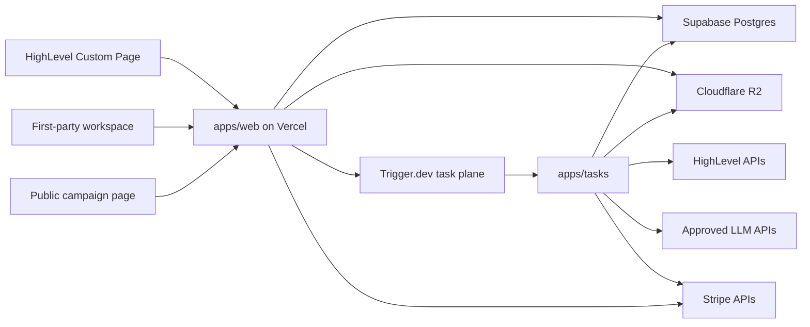

# System Build Blueprint

> Category: Architecture | Version: 1.0 | Date: July 2026 | Status: Active

The construction specification for Operation Automated LO, including the deployable units, repository shape, module boundaries, execution model, and technology decisions a build team must follow.

**Related:**

- [System architecture](system-architecture.md)
- [System data model](system-data-model.md)
- [System runtime contracts](system-runtime-contracts.md)
- [System delivery and operations](system-delivery-and-operations.md)
- [PRD-001j: Platform foundation, runtime, and delivery](../../../requirements/in-work/prd-001-operation-automated-lo/prd-001j-operation-automated-lo-platform-foundation-runtime-and-delivery.md)

---

## Construction decision

Build a modular monolith with two deployable units and one product database:

1. `apps/web` is the Next.js product surface deployed to Vercel. It serves the embedded HighLevel application, first-party fallback, approval views, public campaign pages, authenticated command endpoints, OAuth callbacks, and provider webhook receivers.
2. `apps/tasks` is the Trigger.dev task package. It runs durable generation, deterministic rendering, provider commands, publish polling, lead routing, token maintenance, reconciliation, exports, and deletion work.
3. Supabase Postgres is the product system of record. HighLevel remains the contact, opportunity, appointment, workflow, and connected-ad system of record.

This is not a microservice system. The two deployables import the same domain, application, database, provider, rendering, and observability packages. A module can become a service only after production evidence shows an independent scaling, security, availability, or deployment need.



## 2026 runtime baseline

The scaffold commit records exact versions in the lockfile. Production uses supported stable releases only.

| Layer | Build decision | Version rule |
| --- | --- | --- |
| Runtime | Node.js | Node 24 LTS, exact patch pinned in `.nvmrc`, `.node-version`, package engines, and CI |
| Package manager | pnpm workspaces | Exact pnpm major and patch pinned through Corepack |
| Monorepo runner | Turborepo | Exact version in the lockfile |
| Language | TypeScript | TypeScript 7.0.2 or later stable 7.0.x after the scaffold compatibility suite passes, strict mode, no implicit `any`; retain the TypeScript 6 compatibility package only for tools that still require the compiler API |
| Web | Next.js App Router | Next.js 16.2.10 or a later patched stable 16.2.x release when scaffolding begins, never a 16.3 preview build |
| UI | React | React 19.2.7 or the later patched version required and tested by the selected Next.js release |
| Boundary validation | Zod 4 | All browser, webhook, provider, environment, database JSON, and task payload boundaries |
| Database toolkit | Drizzle ORM plus SQL migrations | Typed queries for normal access, reviewed SQL for RLS, roles, indexes, triggers, and advanced queries |
| Durable work | Trigger.dev Cloud | Pinned SDK and build package, staging plus production environments |
| Rendering | Playwright Chromium | Exact Playwright and browser version, installed through the Trigger.dev Playwright build extension |
| Object storage | Cloudflare R2 | S3-compatible adapter, one private and one published bucket per environment |
| Unit and integration tests | Vitest with `@vitest/coverage-v8` | Coverage thresholds enforced in CI |
| Browser tests | Playwright Test | Embedded, standalone, onboarding, approval, public lead, and theme paths |
| Database tests | pgTAP plus integration tests | RLS, constraints, migrations, tenancy, and transaction behavior |

Node recommends Active LTS or Maintenance LTS for production and lists Node 24 as LTS in July 2026. Next.js 16 is Active LTS, 16.2 is the current stable line, and 16.3 remains preview as of this decision. The live npm registry returned Next.js 16.2.10, React 19.2.7, TypeScript 7.0.2, and Zod 4.4.3 on 2026-07-20. Exact versions still come from the scaffold lockfile and must pass the compatibility and vulnerability gates before adoption. Next.js 16.2.10 is newer than the 16.2.6 minimum that fixes the May 2026 middleware bypass follow-up, and newer than the 16.2.5 fixes for the associated nonce XSS, connection-exhaustion, SSRF, and proxy-bypass advisories. Sources: [Node releases](https://nodejs.org/en/about/previous-releases), [Next.js 16.2](https://nextjs.org/blog/next-16-2), [Next.js 16.2.10 release](https://github.com/vercel/next.js/releases/tag/v16.2.10), [Next.js support policy](https://nextjs.org/support-policy), [TypeScript 7.0](https://devblogs.microsoft.com/typescript/announcing-typescript-7-0/), and [Next.js security advisories](https://github.com/vercel/next.js/security/advisories).

## Repository topology

```text
operation-automated-lo/
  apps/
    web/
      src/app/
      src/features/
      src/server/
      src/instrumentation.ts
      next.config.ts
    tasks/
      src/tasks/
      src/queues/
      src/schedules/
      trigger.config.ts
  packages/
    application/
    auth/
    config/
    contracts/
    db/
    domain/
    ghl/
    ai/
    billing/
    rendering/
    storage/
    observability/
    test-support/
    ui/
  supabase/
    migrations/
    tests/
    seed.sql
    config.toml
  tests/
    e2e/
    fixtures/
    visual/
  tooling/
    eslint/
    typescript/
    scripts/
  library/
  package.json
  pnpm-workspace.yaml
  turbo.json
  tsconfig.base.json
```

### Deployable ownership

`apps/web` owns:

- React Server Components and Client Components.
- Embedded and first-party session bootstrapping.
- Thin command and query handlers.
- OAuth callbacks and verified webhook intake.
- Public page reads and public lead intake.
- Immediate validation and transaction commits that must complete before an HTTP response.

`apps/tasks` owns:

- Work that can exceed a normal request lifetime.
- Provider retries, waits, polling, and reconciliation.
- Chromium rendering, PDF generation, image generation, and artifact storage.
- LLM calls, structured-output repair, and usage reconciliation.
- Scheduled token health, reporting sync, retention, export, and deletion jobs.

Next.js route handlers are the product backend-for-frontend, not a dumping ground for long-running business logic. The official Next.js guide explicitly notes that its backend capabilities are not a full backend replacement. All durable work leaves the HTTP lifecycle after a committed command or inbox receipt. Source: [Next.js backend-for-frontend guide](https://nextjs.org/docs/app/guides/backend-for-frontend).

## Module boundaries

| Package | Allowed responsibility | Prohibited responsibility |
| --- | --- | --- |
| `domain` | Entities, value objects, state transitions, deterministic policies, domain errors | Framework imports, SQL, HTTP, provider SDKs, environment access |
| `contracts` | Zod schemas, public DTOs, command payloads, event payloads, version identifiers | Business decisions or provider clients |
| `application` | Use cases, ports, transaction orchestration, authorization calls, command outcomes | Direct Next.js, Trigger.dev, Drizzle, or provider SDK imports |
| `db` | Drizzle schema, repositories, transaction wrapper, RLS context, migrations | User-interface logic or provider calls |
| `auth` | HighLevel context validation, session creation, role evaluation, support grants | Campaign policy or direct provider writes |
| `ghl` | HighLevel OAuth and allowlisted API adapters, rate-limit parsing, response schemas | Campaign approval decisions or tenant selection from client input |
| `ai` | Provider-neutral generation interface, model policy, prompt compilation, usage capture | Compliance approval or publication authority |
| `billing` | Stripe adapter and entitlement projection | UI pricing copy or direct feature logic |
| `rendering` | Render manifests, templates, browser setup, checksums, artifact metadata | Mutable campaign reads during rendering |
| `storage` | R2 keys, signed transfer creation, integrity checks, retention adapters | Public authorization decisions |
| `observability` | Correlation context, structured logging, traces, metrics, redaction | Raw token, prompt, lead, or webhook-body logging |
| `ui` | Semantic tokens and reusable dashboard components | Database or provider imports |

Dependency direction is fixed:

```text
apps -> application -> domain
apps -> adapters -> application ports
adapters -> contracts
domain -> nothing outside domain
```

CI rejects package imports that reverse this direction. Business use cases are callable from both the web and task deployables without copying logic.

## Application request model

Every authenticated write follows the same sequence:

1. Validate the external request with a versioned Zod schema.
2. Resolve session, actor, installation, location, role, and entitlement on the server.
3. Open a database transaction using the runtime role.
4. Set transaction-local tenant and actor context.
5. Lock or compare the current aggregate version.
6. Execute one application command.
7. Write business state, an append-only audit event, a command-execution record, and any outbox event in the same transaction.
8. Commit.
9. Return the durable command identifier and current state.
10. Dispatch outbox work after commit. A scheduled sweeper recovers any missed dispatch.

The browser never chooses `location_id`, `agency_id`, `install_id`, publisher authority, or entitlement through a request body. Those values come from the verified server session.

## Data access model

Both deployables connect to Postgres with an `app_runtime` role that does not own tables and does not have `BYPASSRLS`. Vercel and Trigger.dev use Supavisor transaction pooling for transient runtime connections. Prepared statements are disabled for that connection. Migrations and database administration use a separate direct connection and a separate `migration_owner` credential that never enters application runtime.

Every repository call requires a transaction context. The wrapper calls parameterized `set_config` with the third argument set to `true`, which makes the values transaction-local:

```sql
select set_config('app.location_id', $1, true);
select set_config('app.user_id', $2, true);
select set_config('app.role', $3, true);
select set_config('app.correlation_id', $4, true);
```

RLS policies compare tenant columns to `current_setting('app.location_id', true)`. No product query is allowed outside the wrapper. PostgreSQL documents that `SET LOCAL` lasts only through the current transaction, which makes this safe with transaction pooling. Supabase recommends transaction mode for serverless workloads and notes that prepared statements are unsupported there. Sources: [PostgreSQL `SET`](https://www.postgresql.org/docs/current/sql-set.html), [Supabase connection modes](https://supabase.com/docs/guides/database/connecting-to-postgres), and [Supabase RLS](https://supabase.com/docs/guides/database/postgres/row-level-security).

## Durable execution decision

Trigger.dev replaces the earlier Inngest plus separate renderer recommendation for the first production build.

Reasons:

- It runs long-lived tasks outside the Vercel request lifecycle.
- It supports durable waits, retries, child-task coordination, idempotency keys, per-tenant concurrency keys, staging, preview branches, and OpenTelemetry traces.
- Its Playwright build extension installs Chromium and required dependencies into the same versioned task image.
- Rendering no longer requires a third independent container service in the founding architecture.

The workflow vendor is not the product source of truth. Trigger.dev idempotency supplements, but never replaces, the database `command_executions`, `outbox_events`, `provider_operations`, and `webhook_receipts` records. Task payloads contain opaque IDs only. They do not contain OAuth tokens, raw leads, full prompts, property packages, or unredacted provider bodies.

Primary evidence: [Trigger.dev execution model](https://trigger.dev/docs/how-it-works), [idempotency](https://trigger.dev/docs/idempotency), [per-tenant queues](https://trigger.dev/docs/queue-concurrency), [Playwright build extension](https://trigger.dev/docs/config/extensions/playwright), and [preview branches](https://trigger.dev/docs/deployment/preview-branches).

## Rendering construction

The rendering package compiles only immutable inputs:

```text
CampaignInputVersion
+ CampaignBlueprintVersion
+ BrandProfileVersion
+ ComplianceProfileVersion
+ PartnerSnapshot
= RenderManifest
```

The render task:

1. Loads the immutable manifest by ID under tenant context.
2. Validates it against the exact manifest schema version.
3. Downloads allowlisted private assets through short-lived signed URLs.
4. Starts the pinned Chromium build with network egress denied except for the exact signed asset host.
5. Loads local template, font, and CSS files included in the task image.
6. Produces PDF, PNG or JPEG, and page-preview outputs.
7. Computes SHA-256 checksums.
8. Stores immutable objects and artifact records.
9. Runs deterministic preflight against the exact output.
10. Marks the artifact version ready or failed without mutating a prior version.

All text is escaped by default. User HTML is never rendered. Uploaded SVG is rejected or rasterized by an isolated media-validation step. Remote fonts, analytics, WebSockets, and arbitrary URLs are unavailable in the renderer. The request interceptor rejects redirects, credentials in URLs, non-HTTPS schemes, IP literals, DNS results in private or link-local ranges, oversized responses, and any hostname outside the exact allowlist. Response bytes are checksummed and size-limited before use. These controls are tested against redirect and DNS-rebinding fixtures.

## OAuth token construction

HighLevel tokens use application-level envelope encryption:

- One random data-encryption key is created for each installation token version.
- Token bytes are encrypted with AES-256-GCM.
- The data key is encrypted by an environment-specific AWS KMS key.
- The KMS encryption context binds ciphertext to environment, provider, installation ID, and location ID. It contains identifiers only, never token or customer content.
- The database stores ciphertext, nonce, authentication tag, encrypted data key, key version, issued time, expiry time, refresh version, and safe scopes.
- Decryption occurs just in time in server or task memory and is never logged or cached across executions.
- Refresh writes a new immutable token envelope and retires the prior version after a bounded overlap.

Vercel obtains short-lived AWS credentials through OIDC federation. Trigger.dev uses a dedicated IAM principal stored as a secret until workload identity is supported, restricted to `Decrypt`, `Encrypt`, and `GenerateDataKey` for the one environment key and required encryption context. Rotate that credential every 90 days and immediately after any suspected exposure. CloudTrail alerts on denied, unusual, or cross-environment KMS use. The incident kill procedure disables the Trigger principal, revokes HighLevel tokens, rotates the application signing key, and suspends provider commands without deleting encrypted evidence. Sources: [Vercel OIDC](https://vercel.com/docs/oidc), [AWS KMS encryption context](https://docs.aws.amazon.com/kms/latest/developerguide/encrypt_context.html), and [Trigger.dev secret environment variables](https://trigger.dev/docs/deploy-environment-variables).

## Object storage construction

Each environment receives two R2 buckets:

```text
oalo-<env>-private
oalo-<env>-published
```

Private key form:

```text
locations/<location-id>/campaigns/<campaign-id>/versions/<version-id>/<artifact-id>/<sha256>.<ext>
```

Published key form:

```text
campaigns/<opaque-public-id>/<published-version>/<sha256>.<ext>
```

Rules:

- Private buckets have no public development URL.
- Upload URLs expire after 10 minutes and bind object key, content type, maximum size, and checksum expectations.
- The application validates actual file type, dimensions, decompression size, and malware or media policy before promoting an upload.
- Published objects are immutable and receive long cache lifetimes because their URL includes a version and checksum.
- Retention is prefix-based and enforced through lifecycle rules after the campaign and legal-retention policy permit deletion.
- Public pages read only a `PublishedCampaignProjection`, never product tables directly.

R2 encrypts objects at rest, supports strongly consistent storage, and supports prefix-based lifecycle rules. Sources: [R2 data security](https://developers.cloudflare.com/r2/reference/data-security/), [R2 architecture and consistency](https://developers.cloudflare.com/r2/how-r2-works/), and [R2 lifecycle rules](https://developers.cloudflare.com/r2/buckets/object-lifecycles/).

## Embedded and first-party identity

The embedded app does not depend solely on third-party cookies.

1. HighLevel provides the signed user context to the Custom Page.
2. The frame sends that context to `POST /api/v1/sessions/ghl/bootstrap` over HTTPS.
3. The server validates signature, timestamp, issuer, installation, user, location, and current role mapping.
4. The server returns a five-minute Ed25519-signed JWT with `alg=EdDSA` pinned by the verifier and claims for issuer, audience, subject, location, installation, session ID, token ID, issued time, not-before time, expiry, and role-binding version.
5. The frame holds that token in memory only. It is never written to local storage, session storage, a URL, or analytics.
6. Refresh requires a new valid HighLevel context exchange.
7. If embedding or context refresh fails, the user receives a one-time link to the first-party workspace. The opaque code is in the URL fragment, never the query string, and the landing page has no third-party content.
8. The first-party workspace posts the fragment code once, removes it from browser history immediately, and exchanges it for a `__Host-oalo_session` HttpOnly, Secure, SameSite=Lax cookie.

A `Partitioned; SameSite=None; Secure` embedded cookie can be used as a browser enhancement, but it is not the only session path because older or policy-restricted browsers may behave differently. CHIPS partitions embedded cookies by the top-level site and is now broadly available, but the memory-token and first-party fallback remain required. Source: [MDN CHIPS guidance](https://developer.mozilla.org/en-US/docs/Web/Privacy/Guides/Third-party_cookies/Partitioned_cookies).

The verifier never accepts an algorithm, issuer, audience, or key URL from the token itself. Signing keys use an allowlisted `kid`, rotate with a bounded overlap, and are held server-side only. A revoked session, install, user mapping, or role-binding version invalidates an otherwise unexpired token.

## Web request and browser security

Middleware can normalize requests and improve user experience, but it is never the authorization boundary. Every route handler and Server Action authenticates the session, derives the location server-side, checks the current role, entitlement, resource state, and campaign restriction, and performs the database operation under transaction-local RLS context. A middleware bypass must not expose data or authorize a command.

Mutation controls differ by access mode:

- Embedded bearer-token requests allow only the production application origin and the approved HighLevel parent-origin inventory. They reject wildcard credentialed CORS, `Origin: null`, missing origins on browser mutations, and tokens with a mismatched audience or session.
- First-party cookie mutations require an exact `Origin` and `Host` match plus a session-bound CSRF token. Server Actions call the same command authorization service and do not inherit trust from their framework transport.
- OAuth, session, publish, billing, export, support, and provider-command routes have explicit actor, session, location, and action rate limits in addition to global abuse controls.

Response security is route-specific:

- Embedded application routes send an enforced nonce-based CSP whose `frame-ancestors` contains only Marketplace-approved HighLevel origins and verified customer white-label origins. They do not send `X-Frame-Options: DENY`, which would break the intended iframe.
- First-party authenticated, handoff, approval, and administration routes use `frame-ancestors 'none'` and `X-Frame-Options: DENY`.
- Public campaign pages use `frame-ancestors 'none'` unless a separately reviewed embed feature is introduced.
- All routes send HSTS, `X-Content-Type-Options: nosniff`, a least-privilege `Permissions-Policy`, and an appropriate `Referrer-Policy`. The handoff route uses `no-referrer`.
- The edge strips untrusted inbound `Content-Security-Policy` request headers and rejects framework-internal headers covered by current Next.js advisories. CI tests the deployed behavior.

The CSP starts in report-only mode against preview and staging, then moves to enforced mode before production traffic. Nonces are generated server-side from cryptographic randomness and never copied from inbound request headers. The build must remain on the latest patched stable Next.js release because the May 2026 advisories included middleware or proxy bypass, CSP nonce XSS, connection exhaustion, SSRF, and cache issues. Sources: [Next.js security advisories](https://github.com/vercel/next.js/security/advisories), [middleware bypass follow-up](https://github.com/vercel/next.js/security/advisories/GHSA-26hh-7cqf-hhc6), and [CSP nonce XSS](https://github.com/vercel/next.js/security/advisories/GHSA-ffhc-5mcf-pf4q).

## Public lead protection

The public lead endpoint uses layered controls:

- Published and active campaign lookup by opaque identifier.
- Exact allowed fields and body-size limit.
- Normalized email and phone validation.
- Server-validated Cloudflare Turnstile token.
- IP and campaign rate limits with privacy-preserving keyed hashes and short retention.
- Submission idempotency key.
- Consent text version, timestamp, page version, and source metadata.
- Durable acceptance before HighLevel routing.
- Generic public response that does not reveal whether a contact already exists.

Turnstile tokens are validated on the server, expire after five minutes, and are single-use. Source: [Cloudflare Turnstile server validation](https://developers.cloudflare.com/turnstile/get-started/server-side-validation/).

## Billing and entitlement construction

Stripe-hosted Checkout and Customer Portal own payment-method collection. Product access is controlled by a local entitlement projection:

```text
Stripe event -> verified webhook receipt -> billing projection transaction
-> entitlement version -> outbox -> HighLevel billing authorization response
```

The redirect after Checkout never grants access. Stripe events can arrive more than once or out of order, so the projection stores event IDs, fetches current Stripe objects when needed, and recomputes entitlement from current state. Stripe recommends signature verification over the raw request body, asynchronous processing, duplicate-event handling, and order-independent consumers. Source: [Stripe webhook guidance](https://docs.stripe.com/webhooks).

## AI construction

The AI adapter is provider-neutral and server-only. It exposes tasks such as `extractBrandSignals`, `draftCampaignCopy`, and `repairStructuredOutput`, not a generic unrestricted chat interface.

Each generation stores:

- Location, actor, campaign, and input-version references.
- Prompt-template version and model-policy version.
- Provider, model, response identifier, latency, cache use, token counts, estimated cost, and retry count.
- Output schema version, validation outcome, refusal outcome, and content hash.
- Accepted, edited, rejected, or abandoned disposition when known.

Prompts minimize property, partner, and customer data. Consumer contact data, borrower data, opportunity notes, credentials, and unapproved uploads are never sent to a model. Model output creates a draft version only and has no approval, publication, legal, targeting, or budget authority.

## Architecture decision register

| Decision | Selected | Rejected for the founding build | Revisit trigger |
| --- | --- | --- | --- |
| System shape | Modular monolith, two deployables | Microservices, one deployment per customer | A measured independent scaling or isolation problem |
| Web runtime | Next.js 16.2 stable on Vercel | Preview Next.js, Lovable as production runtime | Platform or security constraint |
| Product database | One Supabase Postgres system with RLS | One Supabase project per customer | Regulatory isolation requirement or proven scale limit |
| ORM | Drizzle plus reviewed SQL migrations | ORM-only schema management | Tooling blocks a required Postgres capability |
| Durable work | Trigger.dev | In-request execution, Inngest plus a separate renderer | DPA, economics, reliability, or capability failure |
| Rendering | Playwright inside Trigger.dev task images | Browser rendering, separate founding render service | Renderer workload requires independent autoscaling or sandboxing |
| Asset storage | Cloudflare R2 | Database blobs, public source bucket | Data-residency or provider requirement |
| Provider token protection | Per-version envelope encryption with AWS KMS | Plain database encryption key, browser tokens | Selected cloud changes or workload identity improvement |
| Sessions | Signed HighLevel bootstrap plus first-party fallback | Third-party cookie-only session | HighLevel supplies a stronger native session contract |
| Billing | Stripe hosted surfaces plus local projection | Card handling in product, redirect-based entitlement | Marketplace contract requires a different commercial path |

## Source-level invariants

The following rules are build blockers, not suggestions:

- No `any` in product code. External unknown values remain `unknown` until schema validation.
- Every external boundary has a Zod schema and a version.
- Every relative ESM import includes its runtime `.js` extension where NodeNext requires it.
- No fire-and-forget promises. Work is awaited, durably dispatched, or explicitly recorded as best-effort telemetry.
- Provider concurrency is bounded and tenant-scoped.
- No direct provider SDK calls from React components, route handlers, or domain code.
- No database query without transaction-local authorization context.
- No service-role or table-owner credential in application runtime.
- No material campaign mutation without a new immutable version and approval invalidation.
- No provider side effect without command authorization, idempotency, audit, and reconciliation behavior.
- No secret, raw OAuth token, raw lead body, or consumer PII in logs, task payloads, traces, URLs, or analytics.
- No code release unless type checking, tests, duplication checks, builds, migration tests, RLS tests, security review, and PRD quality verification pass.

## Changelog

- v1.0 (2026-07): Replaced the product-level architecture recommendation with the construction-level blueprint and selected Trigger.dev as the durable task and rendering plane.
