# System Delivery and Operations

> Category: Architecture | Version: 1.0 | Date: July 2026 | Status: Active

The environment, deployment, verification, observability, reliability, recovery, capacity, and implementation-order specification for Operation Automated LO.

**Related:**

- [System build blueprint](system-build-blueprint.md)
- [System data model](system-data-model.md)
- [System runtime contracts](system-runtime-contracts.md)
- [2026 build readiness and research gate](../research/2026-build-readiness-and-research-gate.md)

---

## Environment model

| Environment | Web | Tasks | Database | Providers | Data rule |
| --- | --- | --- | --- | --- | --- |
| Local | Next.js local | Trigger.dev dev | Supabase local | Fixtures, Stripe CLI, HighLevel App Test when required | Synthetic only |
| Preview | Vercel preview | Trigger.dev preview branch | Supabase ephemeral preview branch | Stubs by default | Seeded synthetic only |
| Staging | Vercel staging project | Trigger.dev staging | Persistent isolated Supabase staging | HighLevel App Test, Stripe test, non-spend Meta assets | Synthetic and approved test records only |
| Production | Vercel production project | Trigger.dev production | Dedicated Supabase production | Approved live accounts | Minimum required customer data |

Supabase preview branches are separate data-less environments and Trigger.dev preview branches isolate task versions. Production data is never copied into preview. Sources: [Supabase branching](https://supabase.com/docs/guides/deployment/branching) and [Trigger.dev preview branches](https://trigger.dev/docs/deployment/preview-branches).

HighLevel Marketplace callback URLs and Meta App Test state may not support arbitrary preview URLs. Provider-contract tests therefore run in staging against a fixed registered origin. Preview uses contract fixtures and recorded sanitized responses.

## Region decision

Select one primary United States region after measuring latency to HighLevel and expected customers. Place Vercel server functions, Supabase Postgres, and the task database connection as close as supported. R2 uses a matching location hint or jurisdiction when configured.

The scaffold records:

- Vercel function region.
- Supabase project region.
- Trigger.dev environment and outbound IP behavior.
- R2 bucket jurisdiction.
- Provider endpoints that cannot be region-selected.

A staging latency test must prove that the database is not accidentally across the country from server functions. Region changes after customer data exist require an approved migration and recovery plan.

## Environment configuration

Every environment has independent values for:

- Application URL and approved origins.
- HighLevel app IDs, client secrets, OAuth state keys, webhook keys, and callback URLs.
- Stripe keys, webhook signing secret, products, prices, and portal configuration.
- Trigger.dev project key and environment.
- Supabase runtime, migration, and test credentials.
- AWS KMS key and restricted IAM principal.
- R2 endpoint, access keys, bucket names, and public asset domain.
- Turnstile site and secret keys.
- LLM provider keys, model-policy version, hard spend limit, and fallback status.
- OpenTelemetry exporter and error-monitoring credentials.

All values pass a Zod environment schema at process startup. Missing or malformed required values fail readiness. Public variables have an explicit allowlist. No server secret uses a `NEXT_PUBLIC_` prefix.

## Secret management

- Vercel secrets are scoped by project and environment.
- Vercel uses OIDC federation for AWS rather than persisted AWS keys.
- Trigger.dev secret variables are write-only in its dashboard. Its restricted AWS IAM key is rotated every 90 days until workload identity replaces it.
- GitHub Actions uses OIDC where provider support exists and environment-protected secrets only where it does not.
- Local secrets live in ignored files or a developer secret manager, never committed seed files.
- Secret rotation has a dual-key overlap where signatures or encryption require it.
- Break-glass credentials are hardware-MFA protected, separately logged, and tested quarterly.

Vercel documents short-lived OIDC federation for cloud access without persistent credentials. Source: [Vercel OIDC](https://vercel.com/docs/oidc).

## Branch and deployment flow

```mermaid
flowchart LR
    FEATURE["codex or feature branch"] --> PR["Pull request"]
    PR --> CHECKS["Static, unit, DB, contract, visual, build checks"]
    CHECKS --> PREVIEW["Vercel, Trigger, Supabase previews"]
    PREVIEW --> REVIEW["Human and security review"]
    REVIEW --> MAIN["Merge to main"]
    MAIN --> STAGING["Deploy staging and run smoke suite"]
    STAGING --> PRODAPPROVAL["Protected production approval"]
    PRODAPPROVAL --> MIGRATE["Backward-compatible migration"]
    MIGRATE --> PROD["Deploy tasks, then web"]
    PROD --> SMOKE["Production smoke and synthetic checks"]
    SMOKE --> OBSERVE["Canary observation window"]
```



Deployment rules:

1. Database expand migration runs first.
2. Task code deploys and supports the old and new contract when required.
3. Web code deploys.
4. Smoke and synthetic tests run.
5. Contract migration runs only after no old deploy or task run can use removed fields.
6. Rollback reverts application deployments first. Database rollback is used only when proven safe. Otherwise roll forward.

Trigger.dev uses atomic task deployments and separate staging and production versions. Long-running old task versions remain interpretable through recorded task and contract versions.

## Required pull-request checks

The monorepo exposes one `pnpm verify` command that CI and developers run. It includes:

```text
pnpm install --frozen-lockfile
pnpm format:check
pnpm lint
pnpm typecheck
pnpm test:unit --coverage
pnpm test:integration
pnpm test:db
pnpm test:contracts
pnpm test:visual
pnpm test:e2e:preview
pnpm jscpd
pnpm build
pnpm audit:boundaries
pnpm audit:secrets
pnpm audit:dependencies
```

CI also verifies:

- The lockfile changed when manifests changed.
- Production dependencies have allowed licenses and no unaccepted High or Critical vulnerability.
- Resolved Next.js and React versions meet the current official security floor, with 16.2.10 and 19.2.7 as the verified 2026-07-20 scaffold baselines.
- Renovate or Dependabot opens weekly dependency updates and immediate Next.js, React, database, auth, rendering, and provider-SDK security updates.
- GitHub Actions are pinned to immutable commit SHAs.
- Migrations apply from empty and current-main databases.
- Migrations do not remove a field still used by the prior production build.
- Every tenant table has RLS enabled, forced, and tested.
- No provider scope or endpoint is introduced without the HighLevel contract register update.
- Generated OpenAPI or contract artifacts match source schemas.
- Render fixtures match approved golden changes.
- Bundle, image, and task build sizes remain within budgets.

## Test pyramid

### Domain unit tests

Fast, deterministic tests cover:

- Campaign state transitions.
- Approval invalidation.
- Preflight rules.
- Entitlement decisions.
- Provider error classification.
- Idempotency-key construction.
- Canonical hashing.
- Retention calculations.
- Cost and allowance calculations.

### Application tests

Use in-memory ports or controlled adapters to verify command authorization, transactions, outbox writes, replay, failure states, and optimistic concurrency.

### Database tests

Run against real Postgres:

- Migration apply and rollback or roll-forward verification.
- Constraints and indexes.
- Tenant A cannot select, insert, update, or delete tenant B rows.
- Missing context fails closed.
- Worker, scheduler, support, reporting, and migration roles have exactly their intended access.
- Transaction-local settings do not leak through Supavisor-style connection reuse.
- Duplicate webhook, command, usage, provider, and outbox records are rejected.
- Security-invoker views preserve RLS.

### Provider contract tests

HighLevel App Test and Stripe test mode verify schemas and state transitions. Tests record provider API version, request hash, safe response fixture, account state, and timestamp. Tests that could spend money remain no-spend or require a named approval and hard cap.

### Browser tests

Playwright covers:

- HighLevel embedded bootstrap fixture.
- First-party fallback and session expiry.
- Algorithm confusion, invalid issuer or audience, stale role version, revoked session, and cross-location token rejection.
- Cookie CSRF, `Origin: null`, disallowed embedded origin, middleware-bypass fixture, clickjacking policy, and handoff referrer isolation.
- Light, dark, and system theme without first-paint flash.
- Self-onboarding resume and blocking remediation.
- Campaign create, generate, render, approve, publish-confirmation, and exception paths.
- Restricted Realtor campaign access.
- Public campaign page, consent, bot rejection, duplicate submit, and withdrawn state.
- Keyboard and focus flows for critical actions.

### Visual and rendering tests

Representative golden fixtures cover:

- Common property, long address, long disclosure, missing optional content, and maximum approved image count.
- Every page, PDF, QR, Meta creative dimension, and light or dark dashboard surface.
- Font availability, page breaks, image crop, disclosure position, QR readability, and checksum determinism.

A renderer dependency or template update must either produce identical hashes or include approved visual diffs and a template-version change.

### Failure and recovery tests

Regular fault tests inject:

- HighLevel `401`, `403`, `404`, `409`, `422`, `429`, `5xx`, network timeout, and timeout-after-write.
- Stripe duplicate and out-of-order events.
- Trigger.dev retry and replay.
- Renderer redirect, DNS-rebinding, private-IP, WebSocket, oversized response, and disallowed-host attempts.
- Database transaction rollback and connection loss.
- R2 upload interruption and checksum mismatch.
- Chromium crash and out-of-memory termination.
- LLM timeout, refusal, malformed JSON, cost-cap rejection, and provider fallback.
- Uninstall during an active task.

## Observability stack

Use standard OpenTelemetry for server and task traces, structured Pino logs for application events, Sentry for error aggregation, and privacy-configured product analytics with autocapture disabled.

The correlation chain is:

```text
HTTP request
-> command
-> database transaction
-> outbox event
-> Trigger.dev run
-> provider operation
-> webhook or reconciliation
-> normalized outcome
```

Required trace attributes are safe identifiers only:

- Environment and code version.
- Correlation, command, job, campaign, and provider-operation opaque IDs.
- Hashed or opaque location reference.
- Task and operation name.
- Result class, attempt, duration, and provider status class.

Never attach OAuth tokens, session tokens, raw request bodies, raw email or phone, property upload contents, complete prompts, model outputs, or provider response bodies.

Next.js and Vercel support OpenTelemetry through `instrumentation.ts` and `@vercel/otel`; Trigger.dev uses OpenTelemetry for task traces. Sources: [Next.js instrumentation](https://nextjs.org/docs/app/guides/instrumentation), [Vercel instrumentation](https://vercel.com/docs/tracing/instrumentation), and [Trigger.dev execution and telemetry](https://trigger.dev/docs/how-it-works).

## Operational dashboards

### Customer path

- Install success rate and scope failures.
- Onboarding step completion and time to Launch Ready.
- Time to first approved campaign and first publish.
- Lead-submission acceptance and HighLevel-routing lag.
- Campaign outcome funnel.

### System path

- Web availability, latency, and error rate.
- Database query latency, connection wait, CPU, disk, and replication health.
- Outbox age, dispatch failures, task queue age, retries, dead letters, and uncertain operations.
- Chromium duration, crash, memory, artifact integrity, and golden drift.
- HighLevel token health, rate limits, error class, and webhook lag.
- Stripe webhook lag and entitlement mismatch.
- R2 failure and asset-delivery status.
- LLM latency, validation, refusal, cache, fallback, tokens, and cost.

### Security path

- Invalid signed context and webhook signatures.
- Replay, cross-tenant, role, support-grant, and RLS denials.
- Unusual export, download, support, publication, and billing actions.
- Secret, dependency, and CSP alerts.
- Deletion and retention backlog.

## Service objectives

Founding-beta objectives:

| Path | Objective | Alert |
| --- | --- | --- |
| Authenticated web and public pages | 99.9 percent monthly availability | 5-minute burn alert |
| Public lead acceptance | 99.9 percent, p95 under 1 second excluding bot challenge | Availability or latency burn |
| Accepted lead to confirmed HighLevel route | p95 under 60 seconds | p95 over 90 seconds for 10 minutes |
| Campaign generation | p95 under 90 seconds excluding approval | Queue or provider delay |
| Full artifact rendering | p95 under 2 minutes | Queue age over 2 minutes |
| Accepted publish to provider-confirmed state | p95 under 3 minutes, policy review excluded | Uncertain state over 5 minutes |
| Webhook processing | p95 under 60 seconds | Oldest unprocessed over 2 minutes |
| Outbox dispatch | p95 under 30 seconds | Oldest undispatched over 1 minute |

Do not promise provider uptime as product uptime. User-facing status distinguishes product failure, provider degradation, policy review, and customer configuration blocks.

## Backup and recovery

Production requirements before the first customer:

- Supabase daily backups and point-in-time recovery enabled.
- R2 source artifacts are immutable, checksummed, and covered by documented provider durability. Critical published projections can be regenerated from immutable inputs.
- Infrastructure and configuration are reproducible from code and environment inventories.
- Monthly database restore into an isolated recovery environment.
- Quarterly full recovery exercise covering database, object references, KMS access, Trigger task restart, webhook replay, and DNS or Vercel restoration.
- Exported audit evidence verifies restore start, completion, row counts, RLS state, and application smoke tests.

Founding targets:

- Recovery point objective: 15 minutes for product database after PITR is enabled.
- Recovery time objective: 4 hours for core campaign reads, lead acceptance, and provider reconciliation.
- Artifact recovery: regenerate unpublished artifacts from immutable manifests; restore or withdraw published artifacts according to incident impact.

Supabase provides backups and optional point-in-time recovery. Source: [Supabase database backups](https://supabase.com/docs/guides/platform/backups).

## Incident response priorities

| Severity | Example | Immediate action |
| --- | --- | --- |
| SEV-1 | Cross-tenant exposure, token exposure, unauthorized spend, lead loss across tenants | Stop affected paths, revoke credentials, preserve evidence, notify owners |
| SEV-2 | Publication or routing failure for multiple locations, billing access error | Pause relevant commands, reconcile, communicate impact |
| SEV-3 | One-location configuration or provider issue | Block affected job, provide remediation and correlation ID |
| SEV-4 | Cosmetic or reporting defect without authority or data impact | Normal backlog and release path |

Kill switches exist for generation, rendering, public lead intake, provider writes, Meta publication, billing enforcement, and each external adapter. Kill switches are server-side, scoped where possible, auditable, and cannot silently change approved campaign content.

## Initial capacity assumptions

Design the founding system for:

- 100 active locations.
- 20 campaigns per active location per month.
- 5 generated campaign versions per campaign.
- 10 artifacts per version.
- 2,000 public visits per location per month.
- 200 lead submissions per location per month at the high end.
- Bursts after launch events rather than evenly distributed traffic.

These assumptions are capacity-test inputs, not pricing promises.

Initial bounds:

- One active provider mutation per location.
- Two concurrent Chromium renders per location and a measured global cap based on Trigger.dev machine size and plan.
- Two concurrent model generations per location.
- A bounded global dispatcher batch with short leases.
- Public lead rate limits per IP hash, campaign, and location.
- HighLevel concurrency and backoff adapt to observed rate-limit headers.

## Scale decision triggers

Scale vertically, tune, and project before splitting services.

| Evidence | First response | Split only if |
| --- | --- | --- |
| Slow Postgres reads | Explain, index, reduce projection, tune pool | Reporting still harms commands after replica or projection |
| Renderer queue growth | Raise worker machine or concurrency within cost and memory limits | Renderer deploy cadence or isolation conflicts with other tasks |
| Provider rate limiting | Per-tenant queue, adaptive delay, caching | Separate provider gateway materially improves isolation |
| Web function latency | Region check, query count, streaming, caching | Dedicated API runtime is required by sustained workload |
| Audit volume | Retention batches, BRIN index, partition append tables | Operational database remains impaired |
| Enterprise isolation | Stronger roles and encryption context | Contract requires separate database or region |

## Implementation order and exit gates

### Phase 0: Evidence harness and scaffold

Build:

- Monorepo, strict TypeScript, package boundaries, CI, local Supabase, preview environments.
- HighLevel App Test harness, signed-context fixture, provider schema capture, and golden render fixtures.
- Threat model and provider contract register.

Exit:

- `pnpm verify` passes.
- HighLevel research gates have executable test cases.
- Next.js 16.2.10 or a later patched stable 16.2.x version and its compatible React release are pinned after the official advisory sweep passes.
- TypeScript 7 and any TypeScript 6 compatibility sidecar pass lint, build, tests, editor, and package-tooling checks.
- No production feature traffic.

### Phase 1: Tenant and identity foundation

Build:

- Platform schemas, runtime roles, RLS wrapper, installation, OAuth envelope, sessions, roles, support grants, audit.
- Embedded and first-party fallback.

Exit:

- Cross-tenant and missing-context tests pass.
- Install, refresh, reconnect, uninstall, and iframe fallback pass App Test.
- Token rotation and KMS recovery drill pass.

### Phase 2: Self-onboarding and configuration

Build:

- Brand, compliance, partner, routing, channel snapshots.
- Resumable onboarding verifiers and Launch Ready projection.

Exit:

- A prepared location admin reaches Launch Ready without database or operator edits.
- Synthetic verification can be resumed and safely repeated.

### Phase 3: Campaign core and deterministic artifacts

Build:

- Campaign state machine, versions, preflight, approval, render manifests, R2 storage, Playwright artifacts, public projection.

Exit:

- Golden PDFs, pages, QR codes, and Meta creative pass visual and checksum tests.
- Approval invalidation and public isolation tests pass.

### Phase 4: Lead routing vertical slice

Build:

- Public lead endpoint, Turnstile, consent receipt, GHL contact, tag, opportunity, owner, optional workflow, outcome events.

Exit:

- A no-spend synthetic lead proves the complete HighLevel path idempotently.
- Duplicate and timeout-after-write tests do not duplicate CRM objects.

### Phase 5: Meta launch vertical slice

Build:

- HighLevel ad discovery, draft, read-back, approval match, explicit publish, progress, pause, resume, failure, reconciliation.

Exit:

- App Test matrix passes.
- Special Ad Category and targeting contract is approved by lender compliance.
- No uncontrolled spend path exists.

### Phase 6: Reporting, AI, and billing

Build:

- Outcome dashboard and exception health.
- Provider-neutral brand and campaign generation, usage ledger, cost caps.
- Stripe Checkout, Portal, subscription projection, entitlements, and HighLevel billing authorization.

Exit:

- Reporting reconciles to provider truth.
- AI cost and quality targets pass tenant-isolated tests.
- Billing duplicates, order changes, cancellation, reinstall, and delayed events pass.

### Phase 7: Beta hardening

Build:

- Export, uninstall, deletion, incident switches, alerts, runbooks, backup restore, support tools.

Exit:

- Security review has no open release blocker.
- Quality review verifies every PRD-001 acceptance criterion.
- Load, failure, restore, and founder beta readiness gates pass.

## Production release checklist

- Research gates G1 through G8 are closed or explicitly accepted by the named authority.
- Security and quality reports are current for the exact commit.
- The lockfile was checked against official Next.js and React advisories within the release window, and no unaccepted High or Critical dependency finding remains.
- Pull request is rebased on `origin/main`, clean, and mergeable.
- Production migration dry run and recovery point are verified.
- Provider scope and app-review declarations match implemented calls.
- Stripe, HighLevel, KMS, R2, Trigger.dev, Supabase, Turnstile, LLM, telemetry, and alert configuration are production-scoped.
- Synthetic install, session, render, lead, provider read, and billing checks pass.
- Meta write and spend kill switch is verified before enabling publication.
- On-call owner and rollback decision-maker are named.
- Canary cohort and observation window are documented.

## Changelog

- v1.1 (2026-07): Added current dependency floors, weekly and urgent update policy, browser-auth tests, and renderer SSRF test cases.
- v1.0 (2026-07): Defined environment isolation, CI, test pyramid, observability, SLOs, recovery, capacity, scale triggers, and build phases.
