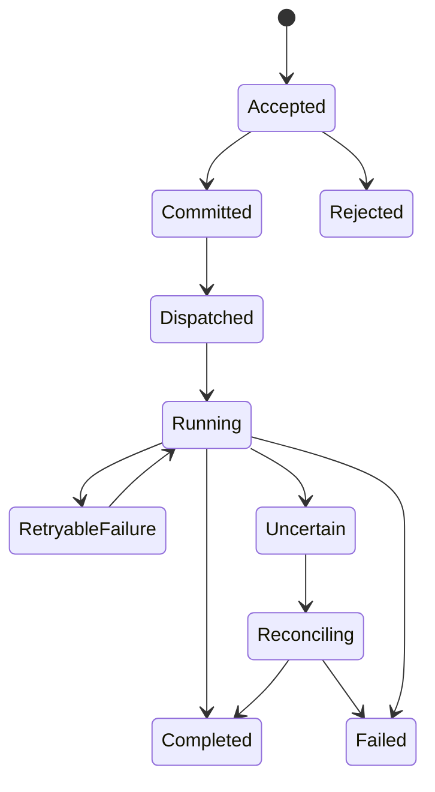
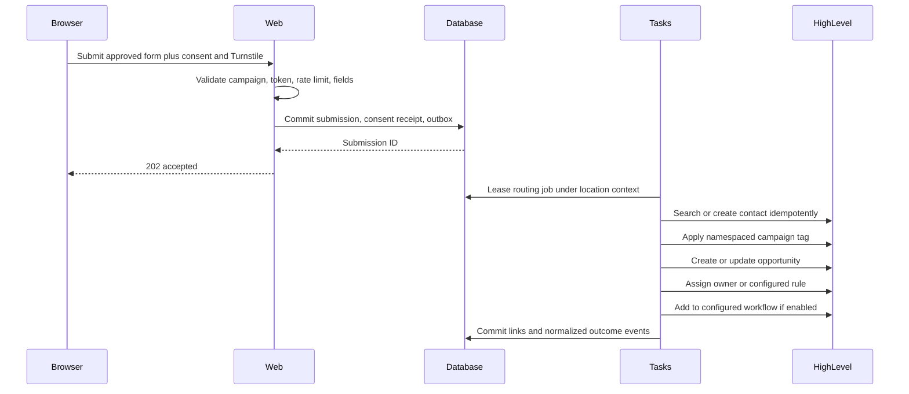

# System Runtime Contracts

> Category: Architecture | Version: 1.0 | Date: July 2026 | Status: Active

The exact HTTP, command, event, task, provider-operation, session, and failure contracts that connect the Operation Automated LO runtime.

**Related:**

- [System build blueprint](system-build-blueprint.md)
- [System data model](system-data-model.md)
- [HighLevel Marketplace and scopes](../integrations/ghl-marketplace-and-scopes.md)
- [Compliance and risk](../compliance/compliance-and-risk.md)

---

## Contract principles

- HTTP accepts work, returns current state, and does not hide durable work inside a request.
- Commands express user or system intent. Events record facts that already happened.
- Task payloads carry opaque identifiers, schema version, correlation ID, and no secret or unnecessary content.
- Every provider write is allowlisted, authorized, idempotent, audited, retry-classified, and reconcilable.
- At-least-once delivery is expected. Business outcomes are exactly-once only where product-owned uniqueness and state transitions enforce them.
- A timeout after an external write is `uncertain`, not automatically `failed`.
- All contracts are versioned and validated from `unknown` through Zod.

## Standard response envelope

Successful command responses use:

```json
{
  "data": {
    "commandId": "cmd_opaque",
    "resourceId": "resource_opaque",
    "status": "accepted",
    "resourceVersion": 7
  },
  "meta": {
    "correlationId": "corr_opaque",
    "contractVersion": "2026-07-01"
  }
}
```

Errors use an RFC 9457-style problem document:

```json
{
  "type": "https://operation-automated-lo.com/problems/approval-stale",
  "title": "Approval is no longer current",
  "status": 409,
  "code": "CAMPAIGN_APPROVAL_STALE",
  "detail": "The campaign changed after approval. Review and approve the current version.",
  "correlationId": "corr_opaque",
  "fieldErrors": []
}
```

Provider bodies, stack traces, SQL details, secret identifiers, and cross-tenant existence are never returned.

## HTTP surface

### Public infrastructure endpoints

| Method and route | Responsibility | Success |
| --- | --- | --- |
| `GET /api/health/live` | Process liveness, no dependency checks | `200` |
| `GET /api/health/ready` | Safe readiness summary for web dependencies | `200` or `503` |
| `GET /api/version` | Commit, schema compatibility, and build metadata without secrets | `200` |

Readiness is deployment and monitoring infrastructure, not a public database diagnostic.

### OAuth and installation endpoints

| Method and route | Responsibility | Key rules |
| --- | --- | --- |
| `GET /api/v1/oauth/ghl/callback` | Validate OAuth state and code, exchange server-side, create or rotate install | One-time state, PKCE where supported, no token in redirect URL |
| `POST /api/v1/sessions/ghl/bootstrap` | Verify signed HighLevel user context and create embedded session | Body limit, timestamp and nonce check, server-derived tenant, EdDSA token |
| `POST /api/v1/sessions/first-party/exchange` | Exchange a one-time fragment code for first-party cookie | POST body only, one use, short expiry, actor and location bound |
| `POST /api/v1/sessions/logout` | Revoke the product session | Idempotent |

### Provider webhooks

| Method and route | Responsibility | Response rule |
| --- | --- | --- |
| `POST /api/v1/webhooks/ghl` | Verify current HighLevel signature, record inbox receipt | Commit receipt then return `202` |
| `POST /api/v1/webhooks/stripe` | Verify Stripe signature over raw body, record inbox receipt | Commit receipt then return `202` |

Webhook receivers:

1. Enforce HTTPS and a strict body limit.
2. Read raw bytes once.
3. Verify signature and replay window before parsing into a trusted event.
4. Parse through a provider-versioned schema.
5. Insert a unique receipt and safe normalized metadata.
6. Return success for an already accepted duplicate.
7. Dispatch processing asynchronously.

Stripe states that events can be duplicated and delivered out of order and recommends asynchronous handling. Source: [Stripe webhooks](https://docs.stripe.com/webhooks).

### Request authentication and anti-replay

Every authenticated request is authorized in the route or command handler. Middleware is not sufficient. Embedded requests use a five-minute Ed25519-signed JWT and first-party requests use the `__Host-oalo_session` cookie. The JWT verifier pins `EdDSA`, an allowlisted `kid`, issuer, audience, clock skew, and required claims. It rejects a token-selected algorithm or key URL. The current session, installation, role-binding version, and location are rechecked for privileged commands.

Cookie-authenticated mutations require an exact `Origin` and `Host` match plus a session-bound CSRF token. Bearer-authenticated browser mutations reject `Origin: null`, missing browser origins, wildcard credentialed CORS, and origins outside the environment allowlist. All accepted commands require an idempotency key and a replay-safe expected resource version where applicable.

The first-party handoff code is carried in a URL fragment, posted once in the request body, removed with `history.replaceState`, stored only as a server-side hash, and expires within five minutes. The handoff document sends `Referrer-Policy: no-referrer`, has no third-party resources, and cannot be framed.

### Public campaign endpoints

| Method and route | Responsibility | Success |
| --- | --- | --- |
| `GET /c/:publicCampaignId` | Render current approved published projection | `200`, `404`, or `410` |
| `POST /api/v1/public/campaigns/:publicCampaignId/leads` | Validate consent, bot proof, campaign state, and submission, then accept routing | `202` |
| `GET /api/v1/public/campaigns/:publicCampaignId/assets/:artifactId` | Redirect to immutable published asset | `302` to allowlisted CDN or `404` |

A lead response never confirms whether a contact or opportunity exists. HighLevel routing happens after the submission and consent receipt commit.

### Authenticated command endpoints

| Method and route | Command |
| --- | --- |
| `POST /api/v1/commands/configuration/save-brand-profile` | `SaveBrandProfile` |
| `POST /api/v1/commands/configuration/save-compliance-profile` | `SaveComplianceProfile` |
| `POST /api/v1/commands/configuration/save-routing-profile` | `SaveRoutingProfile` |
| `POST /api/v1/commands/onboarding/verify-step` | `VerifyOnboardingStep` |
| `POST /api/v1/commands/onboarding/run-synthetic-lead` | `RunSyntheticLead` |
| `POST /api/v1/commands/campaigns/create` | `CreateCampaign` |
| `POST /api/v1/commands/campaigns/:id/save-input` | `SaveCampaignInputVersion` |
| `POST /api/v1/commands/campaigns/:id/generate` | `GenerateCampaignDraft` |
| `POST /api/v1/commands/campaigns/:id/render` | `RenderCampaignArtifacts` |
| `POST /api/v1/commands/campaigns/:id/submit` | `SubmitCampaignForApproval` |
| `POST /api/v1/commands/campaigns/:id/approve` | `RecordCampaignApproval` |
| `POST /api/v1/commands/campaigns/:id/reject` | `RecordCampaignRejection` |
| `POST /api/v1/commands/campaigns/:id/publish` | `PublishCampaign` |
| `POST /api/v1/commands/campaigns/:id/pause` | `PauseCampaign` |
| `POST /api/v1/commands/campaigns/:id/resume` | `ResumeCampaign` |
| `POST /api/v1/commands/campaigns/:id/duplicate` | `DuplicateCampaign` |
| `POST /api/v1/commands/billing/checkout` | `StartHostedCheckout` |

Every command request includes:

- `Idempotency-Key`, required for work with a side effect.
- `If-Match` or `expectedVersion` for mutable aggregate commands.
- Request schema version.
- Business input only. Tenant, actor, install, role, and entitlement are derived server-side.

### Authenticated queries

Server Components call application query services directly where possible. Browser-driven refresh and filters use read-only routes under `/api/v1/queries`. Queries return projections, not domain entities or database rows.

Initial query projections:

- `DashboardSummary`
- `CampaignListItem`
- `CampaignDetail`
- `CampaignException`
- `OnboardingReadiness`
- `IntegrationHealth`
- `UsageAndAllowance`
- `AuditTimelineItem`

## HTTP status contract

| Status | Meaning |
| --- | --- |
| `200` | Synchronous query or idempotent command completed |
| `201` | Resource created and committed |
| `202` | Durable work accepted after commit |
| `204` | Idempotent command completed with no body |
| `400` | Malformed syntax or unsupported contract version |
| `401` | No valid application session |
| `403` | Valid session lacks role, grant, installation, or entitlement |
| `404` | Resource absent or intentionally hidden across tenant boundary |
| `409` | Aggregate version, state, approval, or idempotency conflict |
| `410` | Public projection was deliberately withdrawn |
| `413` | Body or upload exceeds limit |
| `422` | Structurally valid input violates business or preflight rules |
| `429` | Product or provider capacity limit, includes `Retry-After` when known |
| `503` | Required dependency unavailable before work was durably accepted |

Never return `200` with an error body.

## Command lifecycle



`Accepted` means validation and authorization started. `Committed` means product truth and outbox were saved. `Dispatched` means the task platform acknowledged the run. Only `Completed` means the intended product outcome is confirmed.

## Event envelope

Internal outbox events use this minimal envelope:

```json
{
  "eventId": "evt_opaque",
  "eventName": "campaign.render.requested.v1",
  "schemaVersion": 1,
  "occurredAt": "2026-07-20T12:00:00Z",
  "locationRef": "loc_opaque",
  "aggregateType": "campaign",
  "aggregateRef": "cmp_opaque",
  "aggregateVersion": 7,
  "commandRef": "cmd_opaque",
  "correlationId": "corr_opaque"
}
```

The actual campaign, token, property, lead, and prompt data remain in authorized product storage. A worker loads it under database tenant context after validating the event and active installation.

Initial events:

- `installation.activated.v1`
- `installation.token-refresh-requested.v1`
- `installation.uninstalled.v1`
- `onboarding.step-verification-requested.v1`
- `onboarding.synthetic-lead-requested.v1`
- `campaign.generation-requested.v1`
- `campaign.render-requested.v1`
- `campaign.submitted-for-approval.v1`
- `campaign.approved.v1`
- `campaign.publish-requested.v1`
- `campaign.pause-requested.v1`
- `campaign.resume-requested.v1`
- `lead.routing-requested.v1`
- `provider.reconciliation-requested.v1`
- `billing.entitlement-changed.v1`
- `location.export-requested.v1`
- `location.deletion-requested.v1`

## Task catalog

| Task | Input reference | Concurrency | Terminal output |
| --- | --- | --- | --- |
| `dispatch-outbox` | Outbox lease batch | Global bounded dispatcher | Dispatch acknowledgements |
| `refresh-ghl-token` | Token-envelope ID | One per install | New envelope or health failure |
| `verify-onboarding-step` | Onboarding-step ID | One per location and step | Verified evidence or block code |
| `run-synthetic-lead` | Onboarding-run ID | One per location | Verified GHL object chain |
| `generate-campaign-copy` | Campaign-version ID | Per-location AI queue | Immutable draft and usage records |
| `render-campaign-artifacts` | Render-manifest ID | Per-location render queue, global browser cap | Artifact records and hashes |
| `publish-meta-campaign` | Channel-launch ID | One publish mutation per location | Confirmed provider IDs or uncertain state |
| `poll-meta-publish-progress` | Channel-launch ID | One per launch | Normalized provider state |
| `pause-meta-campaign` | Channel-launch ID | One mutation per launch | Confirmed paused state |
| `resume-meta-campaign` | Channel-launch ID | One mutation per launch | Confirmed live state |
| `route-public-lead` | Lead-submission ID | Per-location provider queue | GHL contact, opportunity, workflow links |
| `process-ghl-webhook` | Webhook-receipt ID | Per-location provider queue | Normalized state or outcome events |
| `process-stripe-webhook` | Webhook-receipt ID | Per-customer billing queue | Subscription and entitlement projection |
| `sync-campaign-reporting` | Location and cursor IDs | Per-location read queue | Normalized reporting observations |
| `reconcile-provider-operation` | Provider-operation ID | One per operation | Confirmed success, confirmed failure, or escalation |
| `export-location-data` | Export-request ID | One per location | Encrypted export artifact |
| `delete-location-data` | Deletion-request ID | One per location | Provider and product deletion ledger |

Task retry policy is error-class based, not one global attempt count.

## Provider error taxonomy

| Class | Examples | Behavior |
| --- | --- | --- |
| `AUTH_REFRESHABLE` | Expired HighLevel access token | Lock install, refresh once, retry original operation |
| `AUTH_RECONNECT_REQUIRED` | Revoked refresh token, missing install | Block location, stop jobs, show reconnect remediation |
| `RATE_LIMITED` | `429`, provider reset header | Respect reset, tenant queue delay, no busy loop |
| `TRANSIENT_PROVIDER` | Network reset, provider `5xx` | Exponential backoff with jitter and attempt cap |
| `VALIDATION_TERMINAL` | Provider rejects field or state | No retry until inputs or mapping change |
| `POLICY_TERMINAL` | Meta or lender policy rejection | Freeze version, surface safe provider reason, require remediation |
| `UNCERTAIN_WRITE` | Timeout after request may have reached provider | No blind retry, run read-back reconciliation |
| `PRODUCT_CONFLICT` | Stale approval, version mismatch | Return `409`, require user refresh |
| `DEPENDENCY_BLOCKED` | Missing connection, mapping, entitlement | Resumable blocked state with owner and next action |

No catch block can convert one of these classes into silent success.

## Provider operation contract

Before an external write, the worker:

1. Loads `provider_operations` by command and idempotency key.
2. Returns the prior confirmed result if already complete.
3. Confirms active location, install, role or system authority, entitlement, campaign state, approval, and preflight.
4. Confirms the exact allowlisted provider operation.
5. Marks the operation in progress with an attempt and trace.
6. Sends the provider request with native idempotency when available.
7. Stores safe request hash, provider request ID, rate-limit headers, response class, and normalized result.
8. Reads the provider object back before declaring publication or destructive state confirmed.

If the connection drops after send, mark `uncertain` and reconcile by known provider object IDs, correlation metadata, campaign naming fingerprint, or safe list filters. Never create a second ad campaign, contact, opportunity, workflow enrollment, or charge until reconciliation proves the first did not succeed.

Authenticated command endpoints are rate-limited by session, actor, location, action, and risk class. Publication, export, billing, support, and destructive operations use tighter limits, step-up confirmation where defined, and alerts on unusual denial or success patterns. Rate limiting supplements authorization and idempotency; it does not replace either.

## Lead routing contract



Contact matching order and merge behavior are explicit configuration and App Test evidence. The founding implementation must not infer a destructive merge rule.

## Approval and publication contract

A `PublishCampaign` command is authorized only when all conditions are true in one transaction:

- Requested version is the campaign's current version.
- `approved_version_id` equals the requested version.
- Latest preflight for that exact version, artifacts, rule set, and provider contract passed.
- Required artifacts are ready and hashes match.
- Actor has publisher role.
- Location installation, token, Meta connection, mappings, and entitlement are healthy.
- Budget, dates, category, geography, page, form, and destination equal the approved snapshot.
- No prior live or uncertain launch conflicts with the command.

The transaction creates the channel launch, provider operation, audit event, and outbox event. The actual HighLevel ad write happens in the task plane. Any material edit invalidates prior approval before a publish command can be accepted.

## Billing contract

Stripe events are inboxed and processed without trusting event order. The processor retrieves current Stripe state when an older or partial event cannot determine the projection. It then:

1. Locks the local billing customer and subscription projection.
2. Applies the event if it is not already processed.
3. Computes a new entitlement version from current Stripe state and product plan mapping.
4. Records a billing audit event and any HighLevel billing authorization outbox event.
5. Commits before acknowledging internal completion.

Cancellation or unpaid state blocks new generation and publication according to the grace policy, but never deletes existing approved artifacts automatically.

## Session and authorization contract

Application authorization evaluates all of these inputs:

```text
valid session
+ active marketplace installation
+ current location binding
+ current role binding
+ optional campaign restriction
+ active entitlement
+ resource state
+ support grant when support actor
= allowed action
```

Role permission highlights:

| Role | Create and edit | Approve | Publish | Reporting | Administration |
| --- | --- | --- | --- | --- | --- |
| `location_admin` | Yes | Policy-dependent | Policy-dependent | Yes | Yes |
| `creator` | Yes | No | No | Assigned campaigns | No |
| `approver` | Read | Yes | No | Assigned campaigns | No |
| `publisher` | Read | No | Yes after approval | Assigned campaigns | No |
| `analyst` | No | No | No | Yes | No |
| `realtor_collaborator` | Assigned campaigns only | Assigned approval only | No | Assigned summary only | No |

No role can approve and publish the same campaign if the location's separation-of-duties policy requires two people.

Every database read returns an explicit response DTO, not an unrestricted ORM record. Server-only data modules are marked `server-only`, and no token, encrypted envelope, internal role grant, Stripe identifier, or unnecessary lead field may cross the React Server Component serialization boundary.

## Version compatibility

- Producers include event and payload schema versions.
- Consumers support the current and one prior compatible version during rolling deployment.
- Breaking event changes receive a new event name suffix.
- Database migrations remain compatible with the currently deployed web and task versions through expand and contract.
- A task records its code version and contract version so old runs can be interpreted after deployment.
- Replaying a run never bypasses current authorization, installation, entitlement, or campaign-state checks.

## Changelog

- v1.1 (2026-07): Added pinned embedded-token verification, per-handler authorization, CSRF, origin, handoff, rate-limit, and server-to-client DTO contracts.
- v1.0 (2026-07): Defined HTTP surfaces, command and event envelopes, task catalog, provider error taxonomy, sessions, approvals, lead routing, and billing contracts.
