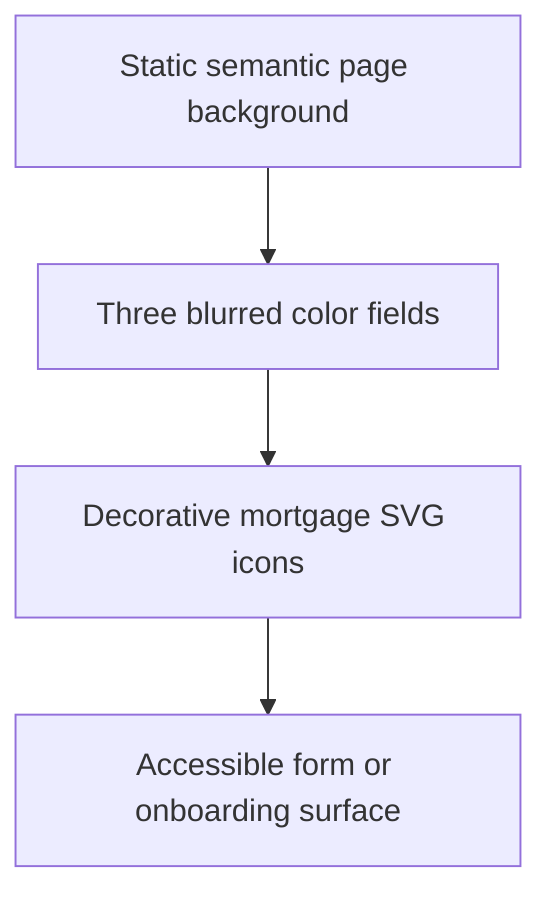

# Ambient Motion Background

> Category: Frontend | Version: 1.0 | Date: July 2026 | Status: Active

This document gives product designers and frontend engineers the approved reference pattern for subtle animated backgrounds in Operation Automated LO.

**Related:**
- [`../architecture/system-architecture.md`](../architecture/system-architecture.md)
- [`../product/product-definition.md`](../product/product-definition.md)
- [`../../../requirements/in-work/prd-001-operation-automated-lo/prd-001h-self-onboarding-and-launch-readiness.md`](../../../requirements/in-work/prd-001-operation-automated-lo/prd-001h-self-onboarding-and-launch-readiness.md)
- [`../../../requirements/in-work/prd-001-operation-automated-lo/prd-001-operation-automated-lo-index.md`](../../../requirements/in-work/prd-001-operation-automated-lo/prd-001-operation-automated-lo-index.md)

---

## Why this exists

Operation Automated LO can use restrained ambient motion to make authentication and onboarding feel polished without turning the product into a decorative marketing site. The pattern belongs behind the interface and must never compete with setup instructions, compliance warnings, form labels, or launch-readiness status.

The reference came from a read-only inspection of the Broker Marketplace sign-in screen on July 20, 2026. The implementation described here records the general interaction technique, not Broker Marketplace source code, proprietary assets, or brand styling.

---

## Observed mechanism

The reference screen does not use a background video or canvas animation. It combines a static pale background with two independently animated CSS layers.

The first layer contains 20 fixed-position mortgage-themed SVG icons. Each icon is purple, uses approximately 15 percent opacity, ignores pointer input, and runs its own 20-second `ease-in-out` loop. The keyframes translate each icon through four positions while rotating it from 0 to 270 degrees before returning to its starting state.

The second layer contains three large circular color fields. Their observed dimensions range from 400 to 600 pixels, opacity ranges from 15 to 30 percent, and static blur filters range from 80 to 120 pixels. Their transform animations run for 15, 20, and 25 seconds with staggered delays. The blur itself remains static, which avoids an unnecessarily expensive animated filter.



The content surface sits above both decorative layers. Decorative elements use `pointer-events: none` and remain absent from the accessibility tree.

---

## Operation Automated LO application

Use this pattern on authentication, first-run setup, and selected onboarding milestone screens. Do not run it behind dense campaign tables, reporting dashboards, approval queues, compliance findings, or editing canvases. Those surfaces need visual stability and maximum information clarity.

The Operation Automated LO version should use its own icon set and semantic theme tokens. Suitable motifs include property, open house, campaign, QR code, PDF, analytics, calendar, Realtor partner, and lead-routing symbols. The interface must not reuse Broker Marketplace artwork, paths, exact placement, or branded palette.

Recommended starting limits are:

| Surface | Icons | Color fields | Motion |
| --- | ---: | ---: | --- |
| Desktop authentication | 10 to 14 | 3 | Full ambient pattern |
| Desktop onboarding milestone | 6 to 10 | 2 or 3 | Reduced travel distance |
| Mobile authentication | 5 to 8 | 2 | Half travel distance |
| Dense authenticated workspace | 0 | 0 or 1 static field | No ambient icon motion |

Both light and dark modes derive colors from semantic tokens. Tenant brand colors can influence approved accent tokens, but the component does not accept arbitrary CSS or raw user-supplied SVG markup.

---

## Reference implementation shape

The implementation should be one reusable, decorative component mounted below the page content. Positions and animation variants come from a fixed configuration so server and client rendering remain stable.

```tsx
type AmbientIcon = {
  id: string;
  icon: ApprovedDecorativeIcon;
  size: number;
  top: string;
  left: string;
  animationName: AmbientAnimationName;
  durationSeconds: number;
  delaySeconds: number;
};

export function AmbientMotionBackground(): JSX.Element {
  return (
    <div className="ambient-motion" aria-hidden="true">
      <div className="ambient-motion__glows" />
      {ambientIcons.map((item) => (
        <DecorativeIcon key={item.id} config={item} />
      ))}
    </div>
  );
}
```

```css
.ambient-motion {
  position: fixed;
  inset: 0;
  overflow: hidden;
  pointer-events: none;
  z-index: 0;
}

.ambient-motion__icon {
  position: absolute;
  color: var(--ambient-icon);
  opacity: var(--ambient-icon-opacity);
  animation: ambient-drift 20s ease-in-out infinite;
}

.ambient-motion__glow {
  position: absolute;
  border-radius: 9999px;
  background: var(--ambient-glow);
  filter: blur(100px);
  opacity: var(--ambient-glow-opacity);
  animation: ambient-glow-float 20s ease-in-out infinite;
}

@keyframes ambient-drift {
  0%, 100% { transform: translate3d(0, 0, 0) rotate(0deg); }
  25% { transform: translate3d(48px, -28px, 0) rotate(90deg); }
  50% { transform: translate3d(-36px, -42px, 0) rotate(180deg); }
  75% { transform: translate3d(-44px, 18px, 0) rotate(270deg); }
}

@keyframes ambient-glow-float {
  0%, 100% { transform: translate3d(0, 0, 0) rotate(0deg); }
  25% { transform: translate3d(0, -18px, 0) rotate(2deg); }
  75% { transform: translate3d(0, 18px, 0) rotate(-2deg); }
}

@media (prefers-reduced-motion: reduce) {
  .ambient-motion__icon,
  .ambient-motion__glow {
    animation: none;
  }
}
```

The production component should generate distinct animation paths from a small approved variant set instead of assigning the same path to every icon. Staggered durations and delays prevent synchronized movement while keeping behavior deterministic.

---

## Accessibility and performance contract

Ambient motion is optional decoration. The application remains complete and understandable when the entire component is removed.

- Honor `prefers-reduced-motion: reduce` by stopping all animation, not merely slowing it down.
- Mark the containing layer `aria-hidden="true"` and keep decorative SVGs unfocusable.
- Use `pointer-events: none` across the layer.
- Maintain WCAG AA contrast for the foreground surface without relying on background movement.
- Animate only `transform` and, when necessary, opacity. Never animate blur, layout dimensions, or positional properties.
- Keep color fields behind an overflow boundary so blur does not expand the document or create scrollbars.
- Reduce icon count and travel distance on narrow screens.
- Pause or omit the layer on resource-sensitive surfaces if profiling shows sustained rendering cost.
- Test in Light, Dark, and System modes before release.

Use `will-change: transform` only on elements that continuously animate and remove the hint when the component is not active. Excessive promoted layers can consume more memory than the animation saves.

---

## Review checklist

The pattern is ready for a product surface only when the foreground remains legible, keyboard and screen-reader behavior is unchanged, reduced-motion users receive a static experience, and mobile profiling shows no meaningful interaction delay. The final visual treatment must feel like Operation Automated LO rather than an imitation of the reference product.
