# Operation Automated LO Project Map

> Category: Product Operations | Version: 1.3 | Date: August 2026 | Status: Active

The canonical internal map of the product boundary, system flow, implementation status, external gates, and next work for Operation Automated LO.

**Related:**

- [Product definition](product-definition.md)
- [PRD-001: Operation Automated LO](../../../requirements/in-work/prd-001-operation-automated-lo/prd-001-operation-automated-lo-index.md)
- [Production execution ledger](../../../../PRODUCTION_EXECUTION_LEDGER.md)
- [External Evidence Sprint (next batch)](../../../../NEXT_BATCH_LEDGER.md)
- [Agent terrain map](../../../../.cursor/rules/core/the-map.mdc) (Codex / Claude / Cursor handoff)

---

## How to use this map

This is the single internal starting point for answering four questions: what the founding product is, how the system works, what the repository has proved, and what still blocks production. It summarizes current state but does not replace the acceptance-criterion ledger, PRDs, security reports, or quality reports linked below.

Agents (Cursor, Claude Code, Codex) should also read [`.cursor/rules/core/the-map.mdc`](../../../../.cursor/rules/core/the-map.mdc) for the short resume brief before picking up parked work.

Before this document, no canonical single project map existed. The information was distributed across the product definition, architecture documents, PRD indexes, readiness gate, and execution ledger.

## Status snapshot

Status date: August 26, 2026.

| Area | Current state |
| --- | --- |
| Delivery | Gauntlet closeout on `main` (PR #25, `25c0bdc`). External Evidence Sprint prep on `main` (PR #26, `6965bf7`). G2 App Test **harness** on `main` (PR #27, `a530947`). Live Wave 1 is parked. |
| Critical path park | Waiting on **HighLevel to approve the app** so App Test operator access can start. In-repo G2 capture seam is ready and fail-closed. |
| PRD-001 lifecycle | `IN WORK`. The repository implementation is complete for every criterion that can be proved locally, but production acceptance is not complete. |
| Acceptance criteria | 305 total: 267 `VERIFIED`, 28 `DEFERRED: LIVE HIGHLEVEL AUTH`, 7 `BLOCKED: EXTERNAL EVIDENCE`, 1 `BLOCKED: G5`, and 2 `ACCEPTED CONSTRAINT` (G4 housing Special Ad Category criteria). |
| Final quality result | `SHIP` for the audited repository implementation. The verdict does not authorize production traffic or convert remaining external gates to pass. |
| Final security result | No unresolved Critical or High finding. The application-wide nonce CSP Medium from 2026-08-12 is closed by Raid A. G2 harness security audit PASS (2026-08-25). |
| Production traffic | Disabled until the required HighLevel App Test (G2/G3/G5), billing (G6), environment, operations, and compliance (G7) evidence is recorded. |
| Distribution gate | G1 is `ACCEPTED CONSTRAINT`. External Marketplace **listing** proof is not a launch prerequisite. Waiting on HighLevel **app approval** is still required for App Test eligibility; that is not a reopen of G1. |
| Special Ad Category gate | G4 is `ACCEPTED CONSTRAINT`. Housing Special Ad Category requirements are known and enforced in product; App Test discovery is not a launch prerequisite. |
| Demand gate | G8 is `ACCEPTED CONSTRAINT`, never `PASS`. Commercial validation is unproven, and 15 paid founders is a post-start target. |
| PRD-002 | Backlog only. It is a future-options register and is not authorized for implementation. |

## Done vs pending (librarian summary)

### Done (repository-proved)

1. Locally provable PRD-001 criteria: **267 `VERIFIED`**.
2. Product-owner accepted constraints: G1 (Marketplace listing not a launch gate), G4 (Housing SAC known/enforced), G8 (demand unproven).
3. Raid A application-wide nonce CSP Medium closed; Trigger.dev 4.5.12 dependency follow-up closed.
4. Library Schema v2 scaffold gaps closed (Gauntlet Raid B).
5. External Evidence Sprint prep: [`NEXT_BATCH_LEDGER.md`](../../../../NEXT_BATCH_LEDGER.md) and [`docs/operations/evidence-packs/`](../../../../docs/operations/evidence-packs/README.md) on `main`.
6. G2 harness on `main`: env-gated adapter (`OALO_GHL_LIVE_CAPTURE=authorized` only), nine-case matrix, `pnpm ghl:g2-matrix`, sanitization hardening, contract + unit coverage. Security then quality PASS for the harness PR.

### Pending (external / operator)

1. **HighLevel app approval** (current wait). Blocks starting the live App Test matrix.
2. Named App Test operator + controlled location credentials/invite.
3. Wave 1 live capture of sanitized fixtures; then flip or residual-ask the 28 `DEFERRED: LIVE HIGHLEVEL AUTH` rows (none flipped yet).
4. Waves 2-7: env/KMS, G3 Meta no-spend, G5 synthetic lead, G6 billing, G7 counsel, timed Launch Ready / AI cost (see next-batch ledger).
5. Production traffic remains disabled. PRD-001 stays in `in-work/` until core completion.

## Library and Librarian status

The July Schema v2 migration decisions are implemented: PRD-001 is in `requirements/in-work/`, PRD-002 remains in `requirements/backlog/`, discovery lives under private knowledge, QA reports remain in their authorized locations, and `notes/` contains only its human-owned README. The [Library Schema v2 raid ledger](../../../../LIBRARY_SCHEMA_V2_RAID_LEDGER.md) retains the migration evidence.

The August 12 read-only drift check found no legacy v1 directory, invalid PRD or IRD folder name, duplicate PRD number, missing PRD index, missing PRD `qa/` directory, or unauthorized notes content. Five scaffold gaps identified in that audit were closed on 2026-08-25 by Gauntlet Raid B: `library/knowledge/private/README.md`, `library/knowledge/private/architecture/README.md`, `library/knowledge/private/standards/` (with README and `documentation-framework.md`), and `library/requirements/backlog/README.md`. No further Schema v2 scaffold gaps remain open as of that date.

## Founding product and system flow

```mermaid
flowchart LR
    LO["Loan officer"] --> GHL["HighLevel Custom Page"]
    GHL --> SESSION["Signed context and server session"]
    SESSION --> SETUP["Location, brand, compliance, routing, and Meta setup"]
    SETUP --> INPUT["Open House Boost campaign inputs"]
    INPUT --> VERSION["Immutable campaign version"]
    VERSION --> COLLATERAL["Collateral projection: Realtor co-branding allowed"]
    VERSION --> PAIDAD["Paid-ad projection: lender or loan officer only"]
    COLLATERAL --> RENDER["Trigger.dev and Playwright rendering"]
    RENDER --> ASSETS["Page, PDF, QR, and approved collateral in R2"]
    PAIDAD --> PREFLIGHT["Deterministic preflight"]
    ASSETS --> PREFLIGHT
    PREFLIGHT --> APPROVAL["Named human approval of exact version"]
    APPROVAL --> DRAFT["HighLevel Meta draft"]
    DRAFT --> READBACK["Read-back and approved-field comparison"]
    READBACK --> CONFIRM["Separate explicit publish confirmation"]
    CONFIRM --> META["Meta through HighLevel"]
    META --> REPORTING["Status, spend, and campaign reporting"]
    ASSETS --> PUBLIC["Published campaign page"]
    PUBLIC --> LEAD["Consent-bound lead intake"]
    LEAD --> ROUTE["Durable HighLevel contact, tag, opportunity, owner, and workflow routing"]
    ROUTE --> ATTRIBUTION["Appointments, applications, and funded or closed outcomes"]
    REPORTING --> DASHBOARD["Loan officer and portfolio dashboard"]
    ATTRIBUTION --> DASHBOARD
    VERSION --> DB["Supabase Postgres with location RLS"]
    APPROVAL --> DB
    ROUTE --> DB
```

HighLevel remains the authority for installation, location context, CRM records, connected Meta assets, workflows, appointments, and provider reporting. Operation Automated LO owns tenant configuration, immutable versions, preflight, approvals, durable commands, generated artifacts, audit history, and attribution links. Meta remains the delivery and policy authority through HighLevel. Stripe owns hosted payment collection and subscription lifecycle.

## PRD and module status

| PRD or module | Scope | Total | Verified | Deferred live auth | Blocked external | Accepted constraint | Blocked G5 | Lifecycle |
| --- | --- | ---: | ---: | ---: | ---: | ---: | ---: | --- |
| 001J | Platform foundation, runtime, delivery, tenancy, durable work, rendering, and operations | 34 | 27 | 4 | 3 | 0 | 0 | In Work |
| 001A | Tenant installation, HighLevel identity, OAuth, token lifecycle, and roles | 41 | 20 | 21 | 0 | 0 | 0 | In Work |
| 001B | Brand, Realtor partner, compliance, and routing profiles | 20 | 20 | 0 | 0 | 0 | 0 | In Work |
| 001C | Open House Boost blueprint, versions, preflight, and approval | 30 | 30 | 0 | 0 | 0 | 0 | In Work |
| 001D | Public page, PDF, QR, collateral, and paid-ad creative rendering | 35 | 35 | 0 | 0 | 0 | 0 | In Work |
| 001E | HighLevel Meta discovery, draft, publish, control, and reporting | 35 | 33 | 0 | 0 | 2 | 0 | In Work |
| 001F | Lead capture, HighLevel routing, workflow handoff, and attribution | 29 | 28 | 0 | 0 | 0 | 1 | In Work |
| 001G | Campaign, outcome, exception, and portfolio reporting | 43 | 43 | 0 | 0 | 0 | 0 | In Work |
| 001H | Self-onboarding, verification, synthetic test, and Launch Ready state | 24 | 20 | 3 | 1 | 0 | 0 | In Work |
| 001I | AI-assisted brand and campaign generation, metering, and economics | 14 | 11 | 0 | 3 | 0 | 0 | In Work |
| **PRD-001 total** | **Founding core** | **305** | **267** | **28** | **7** | **2** | **1** | **In Work** |
| [PRD-002](../../../requirements/backlog/prd-002-operation-automated-lo-add-ons/prd-002-operation-automated-lo-add-ons-index.md) | Future add-on portfolio | Not in the PRD-001 ledger | Not started | Not applicable | Independently gated | Not applicable | Not applicable | Backlog, not authorized |

Repository verification is complete for the 267 locally provable criteria. Two Special Ad Category criteria are product-owner accepted constraints. The remaining 36 criteria require authorized external systems, real environment evidence, named approvals, or measured operating data.

## Hard boundaries

1. The founding release is one Open House Boost workflow for one installed HighLevel location. It is not a generic campaign builder, CRM, LOS, or AI employee platform.
2. Realtor and brokerage identity may appear only in approved collateral, including the public page, PDF, flyer, and QR materials. Paid-ad copy, creative, lead forms, advertiser identity, and calls to action use loan-officer or lender identity only.
3. Collateral and paid ads are separate immutable projections with separate hashes, preflight evidence, and approval summaries.
4. Generation never authorizes publication. A current deterministic preflight, named human approval, provider draft read-back, and separate explicit publish confirmation are required.
5. Meta execution goes through HighLevel. The product does not store direct Meta OAuth credentials.
6. Broad HighLevel OAuth scope is technical permission, not product authorization. Provider routes and methods remain server-side, allowlisted, idempotent, reconciled, and audited.
7. The HighLevel location is the tenant security boundary. The server derives location and role from verified session context, and the browser cannot select another location.
8. HighLevel remains the CRM and connected-ad system of record. The product stores provider IDs, immutable campaign evidence, and normalized attribution, not a duplicate borrower database.
9. Consumer subscriptions to Claude or ChatGPT are not application infrastructure. Model output is an untrusted draft and cannot decide facts, compliance, approval, targeting, budget, or publication.
10. Production traffic stays disabled until the applicable external gates are resolved and recorded. Synthetic repository completeness is not live acceptance.
11. PRD-002 is a future-options register. No add-on enters implementation before the founding core proves its live, compliance, demand, activation, support, and retention gates.

## External gate register

| Gate | Current status | Responsible owner | Required proof |
| --- | --- | --- | --- |
| G1 Distribution | `ACCEPTED CONSTRAINT` | Product owner | External Marketplace distribution proof removed as a launch prerequisite on 2026-08-25. Do not claim a public Marketplace listing or post-five-agency path unless separately authorized. |
| G2 OAuth and session | `DEFERRED FOR NOW` (harness READY; live run PARKED on HighLevel app approval + App Test access) | Engineering, security, product owner, and an authorized HighLevel App Test operator | Signed context, callback, token exchange, refresh, uninstall, reconnect, replay, embedded operation, and first-party fallback in controlled locations. Capture via [`g2-highlevel-app-test.md`](../../../../docs/operations/evidence-packs/g2-highlevel-app-test.md). |
| G3 Meta publish | `BLOCKED` | Engineering and an authorized HighLevel and Meta App Test operator | Draft, read-back, explicit publish, progress, pause, resume, rejection, uncertain-write reconciliation, and reporting with no uncontrolled spend. |
| G4 Special Ad Category | `ACCEPTED CONSTRAINT` | Product owner | Housing Special Ad Category requirements are known and enforced in product. App Test discovery of category combinations is not a launch prerequisite. |
| G5 Lead routing | `BLOCKED` | Engineering, operations, an authorized location administrator or publisher, and compliance | One isolated no-spend test lead proving contact, tag, opportunity, owner, workflow, notification, attribution, replay safety, and reporting exclusion. |
| G6 Billing lifecycle | `BLOCKED` | Product, finance, billing, and engineering | Authorized checkout, charge, entitlement, signed webhook, failure, cancellation, refund, bulk-install, uninstall, and reinstall evidence. |
| G7 Legal operating model | `BLOCKED` | Counsel, lender compliance, security, and legal owners | Approved terms, privacy, DPA, retention, consent, RESPA, Regulation Z, fair-lending, communications, provider terms, subprocessors, and prompt boundaries. |
| G8 Demand | `ACCEPTED CONSTRAINT` | Product owner | Keep commercial validation labeled unproven. Record 15 paid founders only when actual paid-customer evidence exists. |

## Exact non-verified criterion groups

| Status group | Exact criteria | Count | Evidence owner |
| --- | --- | ---: | --- |
| `DEFERRED: LIVE HIGHLEVEL AUTH` | `001J-AC-022` through `024`; `001J-AC-028`; `001A-AC-005` through `016`; `001A-AC-018` through `023`; `001A-AC-026`; `001A-AC-028`; `001A-AC-038`; `001H-AC-002`; `001H-AC-003`; `001H-AC-005` | 28 | Product owner plus an authorized HighLevel App Test operator, with engineering and security review |
| `BLOCKED: EXTERNAL EVIDENCE` | `001J-AC-026` | 1 | Platform security and cloud owner |
| `BLOCKED: EXTERNAL EVIDENCE` | `001J-AC-029` | 1 | Cloud and deployment owner |
| `BLOCKED: EXTERNAL EVIDENCE` | `001J-AC-033` | 1 | Production operations owner |
| `BLOCKED: EXTERNAL EVIDENCE` | `001H-AC-001` | 1 | Product and UX owner |
| `BLOCKED: EXTERNAL EVIDENCE` | `001I-AC-007` | 1 | AI platform owner |
| `BLOCKED: EXTERNAL EVIDENCE` | `001I-AC-013` | 1 | Security and legal owners |
| `BLOCKED: EXTERNAL EVIDENCE` | `001I-AC-014` | 1 | Finance and product owners |
| `ACCEPTED CONSTRAINT` | `001E-AC-005`, `001E-AC-006` | 2 | Product owner: Housing Special Ad Category known and enforced; G4 App Test discovery removed |
| `BLOCKED: G5` | `001F-AC-026` | 1 | Authorized location administrator or publisher plus compliance owner |
| **Total** | **All non-verified criteria** | **36** | **Named external and operating owners above** |

The detailed capture requirements and unblock procedures remain authoritative in the [production execution ledger](../../../../PRODUCTION_EXECUTION_LEDGER.md#exact-external-evidence-asks).

## Prioritized next steps (librarian)

Authoritative batch plan: [External Evidence Sprint](../../../../NEXT_BATCH_LEDGER.md). Packs: [`docs/operations/evidence-packs/`](../../../../docs/operations/evidence-packs/README.md). Agent brief: [the-map.mdc](../../../../.cursor/rules/core/the-map.mdc).

### Now (parked on HighLevel)

1. **Wait for HighLevel app approval.** Do not invent App Test evidence. Keep the G2 harness fail-closed. When approval lands, obtain App Test operator access for one controlled location and name the operator.
2. Confirm founding distribution stays private App Test / one-agency beta (G1 unchanged: Marketplace **listing** is still not a launch prerequisite).

### Immediately after approval (Wave 1)

3. Run the G2 matrix in [`g2-highlevel-app-test.md`](../../../../docs/operations/evidence-packs/g2-highlevel-app-test.md) (`pnpm --filter @oalo/ghl build`, then `OALO_GHL_LIVE_CAPTURE=authorized` only in the operator shell).
4. Ingest sanitized fixtures only. Flip each of the 28 deferred auth ACs to `VERIFIED` only with evidence pointers, or leave deferred with a precise residual ask. Update this map, the next-batch watchdog, and the production ledger.
5. Close the Wave 1 PR (if any) with `security-guardian` then `quality-guardian`, CI green, squash-merge.

### Parallel when a cloud owner is available (Wave 2)

6. Inventory preview, staging, and dark production resources. Prove environment isolation and KMS rotation/recovery for `001J-AC-026` and `001J-AC-029`. Production traffic stays disabled.

### Later waves (do not start without the named external unlock)

7. G3 Meta no-spend App Test (Housing SAC only under G4).
8. G5 isolated no-spend synthetic lead (`001F-AC-026`).
9. G6 billing lifecycle; G7 counsel / lender / AI data boundaries.
10. Timed Launch Ready, AI cost checkpoints, and production smoke/rollback/restore (`001H-AC-001`, `001I-AC-007`, `001I-AC-014`, `001J-AC-033`).
11. Keep CI green. Re-run security then quality on auth, request, or browser-security changes.
12. Private beta inside the permitted distribution boundary; measure activation and the post-start 15-paid-founder target without mislabeling G8 as validated demand.
13. Move PRD-001 to `completed/` only after core completion below. Keep PRD-002 in backlog.

## Definition of core completion

PRD-001 core is complete only when all of the following are true:

- All 305 criteria are `VERIFIED`, or an external criterion has an explicitly approved final disposition allowed by the PRD and readiness gate. No criterion is open, silently waived, or represented as live evidence when only synthetic evidence exists.
- G1 through G7 are each `PASS`, `ACCEPTED CONSTRAINT`, or `DEFERRED OUT OF CORE` with named-owner evidence. G1 and G4 are already accepted constraints as of 2026-08-25. G8 remains accurately labeled as an accepted constraint until paid-customer evidence exists.
- One authorized HighLevel location completes installation, launch readiness, the Open House Boost campaign flow, lender-only paid-ad publication, and the isolated lead-routing path under the approved operating model.
- The exact approved campaign version produces the co-branded collateral and separate lender or loan-officer paid-ad projection, with read-back parity, explicit publication, audit history, and outcome attribution.
- Preview, staging, and production resources are isolated; KMS recovery, smoke, rollback, database restore, and provider reconciliation exercises pass.
- Counsel and lender compliance approve the founding blueprint, disclosures, consent, targeting, retention, privacy, Realtor relationship rules, and provider data boundaries.
- The application-wide CSP Medium from 2026-08-12 is closed (Raid A, 2026-08-25); dependency and CI gates are green, and security review runs before final quality verification on the release tree.
- The folder moves from `library/requirements/in-work/` to `library/requirements/completed/` only after the implementation and external acceptance evidence are complete. G8's post-start commercial target can remain an accepted constraint, but it must not be mislabeled as validated demand.

## Sources of truth

| Question | Authoritative source |
| --- | --- |
| What is the product and what is excluded? | [Product definition](product-definition.md) |
| What is the system boundary and end-to-end flow? | [System architecture](../architecture/system-architecture.md) |
| What must the build team construct? | [System build blueprint](../architecture/system-build-blueprint.md) |
| What external research and gates authorize production? | [2026 build-readiness and research gate](../research/2026-build-readiness-and-research-gate.md) |
| What is PRD-001's full founding scope? | [PRD-001 index](../../../requirements/in-work/prd-001-operation-automated-lo/prd-001-operation-automated-lo-index.md) |
| What future work is preserved but unauthorized? | [PRD-002 index](../../../requirements/backlog/prd-002-operation-automated-lo-add-ons/prd-002-operation-automated-lo-add-ons-index.md) |
| What is the exact criterion status and external evidence ask? | [Production execution ledger](../../../../PRODUCTION_EXECUTION_LEDGER.md) |
| What is the short agent resume brief (Codex / Claude / Cursor)? | [Agent terrain map](../../../../.cursor/rules/core/the-map.mdc) |
| What is the External Evidence Sprint wave plan? | [Next batch ledger](../../../../NEXT_BATCH_LEDGER.md) |
| What is the final repository quality result? | [Final post-security QA report](../../../requirements/in-work/prd-001-operation-automated-lo/qa/2026-08-12-prd001-core-raid-qa-report-final-post-security.md) |
| What is the final security result and open follow-up? | [PRD-001 core security audit](../../../requirements/in-work/prd-001-operation-automated-lo/qa/2026-08-12-prd001-core-raid-security-audit.md) |
| What did the earlier backend readiness review find? | [Backend readiness assessment](../architecture/backend-readiness-assessment-2026-07-21.md) |
| How is the library organized? | [Library README](../../../README.md) |
| What migrated the library to Schema v2? | [Library Schema v2 raid ledger](../../../../LIBRARY_SCHEMA_V2_RAID_LEDGER.md) |

## Changelog

- v1.3 (2026-08-26): Recorded External Evidence Sprint prep (PR #26) and G2 harness (PR #27) on `main`. Critical path parked on HighLevel app approval. Added done/pending summary and librarian next steps. Linked agent terrain map.
- v1.2 (2026-08-25): Recorded Gauntlet squash-merge to `main` (PR #25). Pointed next steps at the External Evidence Sprint and evidence packs. G2 App Test is the primary unblock.
- v1.1 (2026-08-25): Recorded product-owner accepted constraints for G1 (external distribution removed) and G4 (Housing Special Ad Category requirements known). Updated criterion counts and next steps.
- v1.0 (2026-08-12): Established the first canonical project map from the final PRD-001 RAID ledger, security close-out, and post-security QA report.
