# Operation Automated LO Project Map

> Category: Product Operations | Version: 1.0 | Date: August 2026 | Status: Active

The canonical internal map of the product boundary, system flow, implementation status, external gates, and next work for Operation Automated LO.

**Related:**

- [Product definition](product-definition.md)
- [PRD-001: Operation Automated LO](../../../requirements/in-work/prd-001-operation-automated-lo/prd-001-operation-automated-lo-index.md)
- [Production execution ledger](../../../../PRODUCTION_EXECUTION_LEDGER.md)

---

## How to use this map

This is the single internal starting point for answering four questions: what the founding product is, how the system works, what the repository has proved, and what still blocks production. It summarizes current state but does not replace the acceptance-criterion ledger, PRDs, security reports, or quality reports linked below.

Before this document, no canonical single project map existed. The information was distributed across the product definition, architecture documents, PRD indexes, readiness gate, and execution ledger.

## Status snapshot

Status date: August 12, 2026.

| Area | Current state |
| --- | --- |
| Delivery | Core RAID PR #20 and canonical project-map PR #21 merged into `main` on August 12, 2026, after all required checks passed. |
| PRD-001 lifecycle | `IN WORK`. The repository implementation is complete for every criterion that can be proved locally, but production acceptance is not complete. |
| Acceptance criteria | 305 total: 267 `VERIFIED`, 28 `DEFERRED: LIVE HIGHLEVEL AUTH`, 8 `BLOCKED: EXTERNAL EVIDENCE`, 1 `BLOCKED: G3 / G4`, and 1 `BLOCKED: G5`. |
| Final quality result | `SHIP` for the audited repository implementation. The verdict does not authorize production traffic or convert external gates to pass. |
| Final security result | No unresolved Critical or High finding. The application-wide nonce CSP Medium from 2026-08-12 is closed by Raid A (`2026-08-25-raid-a-csp-security-audit.md`). |
| Production traffic | Disabled until the required HighLevel App Test, Meta, lead-path, billing, environment, operations, and compliance evidence is recorded. |
| Demand gate | G8 is `ACCEPTED CONSTRAINT`, never `PASS`. Commercial validation is unproven, and 15 paid founders is a post-start target. |
| PRD-002 | Backlog only. It is a future-options register and is not authorized for implementation. |

## Library and Librarian status

The July Schema v2 migration decisions are implemented: PRD-001 is in `requirements/in-work/`, PRD-002 remains in `requirements/backlog/`, discovery lives under private knowledge, QA reports remain in their authorized locations, and `notes/` contains only its human-owned README. The [Library Schema v2 raid ledger](../../../../LIBRARY_SCHEMA_V2_RAID_LEDGER.md) retains the migration evidence.

The August 12 read-only drift check found no legacy v1 directory, invalid PRD or IRD folder name, duplicate PRD number, missing PRD index, missing PRD `qa/` directory, or unauthorized notes content. It did find these remaining scaffold gaps:

- `library/knowledge/private/standards/` is missing.
- `library/knowledge/private/README.md` is missing.
- `library/knowledge/private/architecture/README.md` is missing.
- `library/knowledge/private/standards/README.md` is missing with its parent directory.
- `library/requirements/backlog/README.md` is missing.

No migration or scaffold move was performed during this documentation pass. The repository does not expose the standardize-library or guild-sync commands named in the maintenance guide, so the audit used read-only structural checks.

## Founding product and system flow

```mermaid
flowchart LR
    LO["Loan officer"] --> GHL["HighLevel Custom Page"]
    GHL --> SESSION["Signed context and server session"]
    SESSION --> SETUP["Location, brand, compliance, routing, and Meta setup"]
    SETUP --> INPUT["Open House Boost campaign inputs"]
    INPUT --> VERSION["Immutable campaign version"]
    VERSION --> COLLATERAL["Collateral projection: Realtor co-branding allowed"]
    VERSION --> PAIDAD["Paid-ad projection: lender or loan officer only"]
    COLLATERAL --> RENDER["Trigger.dev and Playwright rendering"]
    RENDER --> ASSETS["Page, PDF, QR, and approved collateral in R2"]
    PAIDAD --> PREFLIGHT["Deterministic preflight"]
    ASSETS --> PREFLIGHT
    PREFLIGHT --> APPROVAL["Named human approval of exact version"]
    APPROVAL --> DRAFT["HighLevel Meta draft"]
    DRAFT --> READBACK["Read-back and approved-field comparison"]
    READBACK --> CONFIRM["Separate explicit publish confirmation"]
    CONFIRM --> META["Meta through HighLevel"]
    META --> REPORTING["Status, spend, and campaign reporting"]
    ASSETS --> PUBLIC["Published campaign page"]
    PUBLIC --> LEAD["Consent-bound lead intake"]
    LEAD --> ROUTE["Durable HighLevel contact, tag, opportunity, owner, and workflow routing"]
    ROUTE --> ATTRIBUTION["Appointments, applications, and funded or closed outcomes"]
    REPORTING --> DASHBOARD["Loan officer and portfolio dashboard"]
    ATTRIBUTION --> DASHBOARD
    VERSION --> DB["Supabase Postgres with location RLS"]
    APPROVAL --> DB
    ROUTE --> DB
```

HighLevel remains the authority for installation, location context, CRM records, connected Meta assets, workflows, appointments, and provider reporting. Operation Automated LO owns tenant configuration, immutable versions, preflight, approvals, durable commands, generated artifacts, audit history, and attribution links. Meta remains the delivery and policy authority through HighLevel. Stripe owns hosted payment collection and subscription lifecycle.

## PRD and module status

| PRD or module | Scope | Total | Verified | Deferred live auth | Blocked external | Blocked G3/G4 | Blocked G5 | Lifecycle |
| --- | --- | ---: | ---: | ---: | ---: | ---: | ---: | --- |
| 001J | Platform foundation, runtime, delivery, tenancy, durable work, rendering, and operations | 34 | 27 | 4 | 3 | 0 | 0 | In Work |
| 001A | Tenant installation, HighLevel identity, OAuth, token lifecycle, and roles | 41 | 20 | 21 | 0 | 0 | 0 | In Work |
| 001B | Brand, Realtor partner, compliance, and routing profiles | 20 | 20 | 0 | 0 | 0 | 0 | In Work |
| 001C | Open House Boost blueprint, versions, preflight, and approval | 30 | 30 | 0 | 0 | 0 | 0 | In Work |
| 001D | Public page, PDF, QR, collateral, and paid-ad creative rendering | 35 | 35 | 0 | 0 | 0 | 0 | In Work |
| 001E | HighLevel Meta discovery, draft, publish, control, and reporting | 35 | 33 | 0 | 1 | 1 | 0 | In Work |
| 001F | Lead capture, HighLevel routing, workflow handoff, and attribution | 29 | 28 | 0 | 0 | 0 | 1 | In Work |
| 001G | Campaign, outcome, exception, and portfolio reporting | 43 | 43 | 0 | 0 | 0 | 0 | In Work |
| 001H | Self-onboarding, verification, synthetic test, and Launch Ready state | 24 | 20 | 3 | 1 | 0 | 0 | In Work |
| 001I | AI-assisted brand and campaign generation, metering, and economics | 14 | 11 | 0 | 3 | 0 | 0 | In Work |
| **PRD-001 total** | **Founding core** | **305** | **267** | **28** | **8** | **1** | **1** | **In Work** |
| [PRD-002](../../../requirements/backlog/prd-002-operation-automated-lo-add-ons/prd-002-operation-automated-lo-add-ons-index.md) | Future add-on portfolio | Not in the PRD-001 ledger | Not started | Not applicable | Independently gated | Not applicable | Not applicable | Backlog, not authorized |

Repository verification is complete for the 267 locally provable criteria. The remaining 38 criteria require authorized external systems, real environment evidence, named approvals, or measured operating data.

## Hard boundaries

1. The founding release is one Open House Boost workflow for one installed HighLevel location. It is not a generic campaign builder, CRM, LOS, or AI employee platform.
2. Realtor and brokerage identity may appear only in approved collateral, including the public page, PDF, flyer, and QR materials. Paid-ad copy, creative, lead forms, advertiser identity, and calls to action use loan-officer or lender identity only.
3. Collateral and paid ads are separate immutable projections with separate hashes, preflight evidence, and approval summaries.
4. Generation never authorizes publication. A current deterministic preflight, named human approval, provider draft read-back, and separate explicit publish confirmation are required.
5. Meta execution goes through HighLevel. The product does not store direct Meta OAuth credentials.
6. Broad HighLevel OAuth scope is technical permission, not product authorization. Provider routes and methods remain server-side, allowlisted, idempotent, reconciled, and audited.
7. The HighLevel location is the tenant security boundary. The server derives location and role from verified session context, and the browser cannot select another location.
8. HighLevel remains the CRM and connected-ad system of record. The product stores provider IDs, immutable campaign evidence, and normalized attribution, not a duplicate borrower database.
9. Consumer subscriptions to Claude or ChatGPT are not application infrastructure. Model output is an untrusted draft and cannot decide facts, compliance, approval, targeting, budget, or publication.
10. Production traffic stays disabled until the applicable external gates are resolved and recorded. Synthetic repository completeness is not live acceptance.
11. PRD-002 is a future-options register. No add-on enters implementation before the founding core proves its live, compliance, demand, activation, support, and retention gates.

## External gate register

| Gate | Current status | Responsible owner | Required proof |
| --- | --- | --- | --- |
| G1 Distribution | `BLOCKED` | Product and HighLevel Marketplace | Direct and agency installation, location authority, paired-app decision, requested scopes, and the post-five-agency distribution path. |
| G2 OAuth and session | `DEFERRED FOR NOW` | Engineering, security, product owner, and an authorized HighLevel App Test operator | Signed context, callback, token exchange, refresh, uninstall, reconnect, replay, embedded operation, and first-party fallback in controlled locations. |
| G3 Meta publish | `BLOCKED` | Engineering and an authorized HighLevel and Meta App Test operator | Draft, read-back, explicit publish, progress, pause, resume, rejection, uncertain-write reconciliation, and reporting with no uncontrolled spend. |
| G4 Special Ad Category | `BLOCKED` | Lender compliance, counsel, engineering, and the App Test operator | Recorded property-only, mortgage-only, and combined campaign responses plus written approval of the accepted category and targeting matrix. |
| G5 Lead routing | `BLOCKED` | Engineering, operations, an authorized location administrator or publisher, and compliance | One isolated no-spend test lead proving contact, tag, opportunity, owner, workflow, notification, attribution, replay safety, and reporting exclusion. |
| G6 Billing lifecycle | `BLOCKED` | Product, finance, billing, and engineering | Authorized checkout, charge, entitlement, signed webhook, failure, cancellation, refund, bulk-install, uninstall, and reinstall evidence. |
| G7 Legal operating model | `BLOCKED` | Counsel, lender compliance, security, and legal owners | Approved terms, privacy, DPA, retention, consent, RESPA, Regulation Z, fair-lending, communications, provider terms, subprocessors, and prompt boundaries. |
| G8 Demand | `ACCEPTED CONSTRAINT` | Product owner | Keep commercial validation labeled unproven. Record 15 paid founders only when actual paid-customer evidence exists. |

## Exact non-verified criterion groups

| Status group | Exact criteria | Count | Evidence owner |
| --- | --- | ---: | --- |
| `DEFERRED: LIVE HIGHLEVEL AUTH` | `001J-AC-022` through `024`; `001J-AC-028`; `001A-AC-005` through `016`; `001A-AC-018` through `023`; `001A-AC-026`; `001A-AC-028`; `001A-AC-038`; `001H-AC-002`; `001H-AC-003`; `001H-AC-005` | 28 | Product owner plus an authorized HighLevel App Test operator, with engineering and security review |
| `BLOCKED: EXTERNAL EVIDENCE` | `001J-AC-026` | 1 | Platform security and cloud owner |
| `BLOCKED: EXTERNAL EVIDENCE` | `001J-AC-029` | 1 | Cloud and deployment owner |
| `BLOCKED: EXTERNAL EVIDENCE` | `001J-AC-033` | 1 | Production operations owner |
| `BLOCKED: EXTERNAL EVIDENCE` | `001E-AC-005` | 1 | HighLevel and Meta App Test operator plus compliance or lender counsel |
| `BLOCKED: EXTERNAL EVIDENCE` | `001H-AC-001` | 1 | Product and UX owner |
| `BLOCKED: EXTERNAL EVIDENCE` | `001I-AC-007` | 1 | AI platform owner |
| `BLOCKED: EXTERNAL EVIDENCE` | `001I-AC-013` | 1 | Security and legal owners |
| `BLOCKED: EXTERNAL EVIDENCE` | `001I-AC-014` | 1 | Finance and product owners |
| `BLOCKED: G3 / G4` | `001E-AC-006` | 1 | HighLevel and Meta App Test operator plus compliance or lender counsel |
| `BLOCKED: G5` | `001F-AC-026` | 1 | Authorized location administrator or publisher plus compliance owner |
| **Total** | **All non-verified criteria** | **38** | **Named external and operating owners above** |

The detailed capture requirements and unblock procedures remain authoritative in the [production execution ledger](../../../../PRODUCTION_EXECUTION_LEDGER.md#exact-external-evidence-asks).

## Prioritized next steps

1. Provision and inventory isolated preview, staging, and dark production resources. Prove environment isolation and KMS rotation and recovery for `001J-AC-026` and `001J-AC-029`. Keep production traffic disabled.
2. Run the full G1 and G2 HighLevel App Test matrix for direct install, agency install, signed context, OAuth, token refresh, uninstall, reconnect, role resolution, iframe behavior, and first-party fallback. Capture sanitized evidence against all 28 deferred criteria.
3. Run controlled G3 and G4 Meta tests for property-only, mortgage-only, and combined campaigns. Prove draft and read-back parity, explicit publish behavior, pause and resume, reconciliation, reporting, category values, and targeting limits. Obtain written lender or counsel approval.
4. Run the G5 isolated no-spend synthetic lead test and retain proof of the complete HighLevel routing and attribution path.
5. Exercise the G6 billing lifecycle and complete G7 counsel, lender, provider-data, retention, and AI prompt-boundary approvals.
6. Complete the remaining operating evidence: the timed 30-minute onboarding test, real primary and fallback model evaluation, 30, 60, and 90-day model-cost checkpoints, and production smoke, rollback, restore, and reconciliation exercises.
7. Implement and browser-test the application-wide nonce-based Content Security Policy before production traffic. Any code change must be followed by security review and then quality verification.
8. Run the private beta inside HighLevel's permitted distribution boundary. Measure activation, campaign publication, lead-path success, support time, model cost, retention intent, and the post-start 15-paid-founder target.
9. Move PRD-001 to `completed/` only after the core-completion definition below is satisfied. Keep PRD-002 in backlog until its independent entry gates pass.

## Definition of core completion

PRD-001 core is complete only when all of the following are true:

- All 305 criteria are `VERIFIED`, or an external criterion has an explicitly approved final disposition allowed by the PRD and readiness gate. No criterion is open, silently waived, or represented as live evidence when only synthetic evidence exists.
- G1 through G7 are each `PASS`, `ACCEPTED CONSTRAINT`, or `DEFERRED OUT OF CORE` with named-owner evidence. G8 remains accurately labeled as an accepted constraint until paid-customer evidence exists.
- One authorized HighLevel location completes installation, launch readiness, the Open House Boost campaign flow, lender-only paid-ad publication, and the isolated lead-routing path under the approved operating model.
- The exact approved campaign version produces the co-branded collateral and separate lender or loan-officer paid-ad projection, with read-back parity, explicit publication, audit history, and outcome attribution.
- Preview, staging, and production resources are isolated; KMS recovery, smoke, rollback, database restore, and provider reconciliation exercises pass.
- Counsel and lender compliance approve the founding blueprint, disclosures, consent, targeting, retention, privacy, Realtor relationship rules, and provider data boundaries.
- The application-wide CSP follow-up is resolved, dependency and CI gates are green, and security review runs before final quality verification on the release tree.
- The folder moves from `library/requirements/in-work/` to `library/requirements/completed/` only after the implementation and external acceptance evidence are complete. G8's post-start commercial target can remain an accepted constraint, but it must not be mislabeled as validated demand.

## Sources of truth

| Question | Authoritative source |
| --- | --- |
| What is the product and what is excluded? | [Product definition](product-definition.md) |
| What is the system boundary and end-to-end flow? | [System architecture](../architecture/system-architecture.md) |
| What must the build team construct? | [System build blueprint](../architecture/system-build-blueprint.md) |
| What external research and gates authorize production? | [2026 build-readiness and research gate](../research/2026-build-readiness-and-research-gate.md) |
| What is PRD-001's full founding scope? | [PRD-001 index](../../../requirements/in-work/prd-001-operation-automated-lo/prd-001-operation-automated-lo-index.md) |
| What future work is preserved but unauthorized? | [PRD-002 index](../../../requirements/backlog/prd-002-operation-automated-lo-add-ons/prd-002-operation-automated-lo-add-ons-index.md) |
| What is the exact criterion status and external evidence ask? | [Production execution ledger](../../../../PRODUCTION_EXECUTION_LEDGER.md) |
| What is the final repository quality result? | [Final post-security QA report](../../../requirements/in-work/prd-001-operation-automated-lo/qa/2026-08-12-prd001-core-raid-qa-report-final-post-security.md) |
| What is the final security result and open follow-up? | [PRD-001 core security audit](../../../requirements/in-work/prd-001-operation-automated-lo/qa/2026-08-12-prd001-core-raid-security-audit.md) |
| What did the earlier backend readiness review find? | [Backend readiness assessment](../architecture/backend-readiness-assessment-2026-07-21.md) |
| How is the library organized? | [Library README](../../../README.md) |
| What migrated the library to Schema v2? | [Library Schema v2 raid ledger](../../../../LIBRARY_SCHEMA_V2_RAID_LEDGER.md) |

## Changelog

- v1.0 (2026-08-12): Established the first canonical project map from the final PRD-001 RAID ledger, security close-out, and post-security QA report.
