# PRD-009: Marketing Toolkit

> **Status:** Backlog. Authored 2026-10-01 on branch `claude/prd-009-marketing-toolkit`, cut from `main` at `e89058e` (PRD-008 merged), on top of the approved design proposal (`780b2ab`, `d7b0f72`). Not started.
> **Priority:** P0. The product owner's verdict on the live app: "UI looks like crap right now."
> **Effort:** XL (seven sub-PRDs, several days of agent time across four waves, no operator time inside the run)
> **Schema changes:** Additive. 009c adds two migrations (two append-only tenant tables, three rate-limit scopes, one private Storage bucket and its policy) and one pgTAP suite. 009d widens the campaign manifest contract additively.
> **Close-out:** `security-guardian` then `quality-guardian` on the final tree, never reversed

---

## Problem

On 2026-10-01 the owner signed up on the live app (`operation-automated-lo-web.vercel.app`, PRD-008 merged as `e89058e`) and said, in his words: "UI looks like crap right now."

What he saw, as a brand-new self-serve account ([owner direction](research/2026-10-01-owner-direction.md), [recon section 5](research/2026-10-01-oalo-toolkit-recon.md)):

- He landed on `/overview`, which repeats "HighLevel, Meta, and Stripe aren't connected" 16 times and shows 9 "Not connected" metric cards.
- The guided-setup panel floated over the page and covered the numbers.
- A dark navy sidebar dominated the screen.
- The menu offered Leads and Pipeline, Automations, Reports, and Workspace tools.

Two causes sit under that:

1. **The product drifted into a CRM.** The owner: "this should not have pipelines and automations, this is not a CRM. It is supposed to be the marketing Tool kit." And: "If we make it too much like a CRM then we are going up against Highlevel which we are supposed to be a connector to highlevel."
2. **No check ever looked at an empty account.** Every design review and screenshot baseline so far photographed seeded or demo data. The page a real sign-up lands on was never captured.

What he wants instead: "it should be like click click launch facebook ads." And: "I like the lighter look of automatedre better than the darker version of this."

---

## Goals

- A marketing toolkit, not a CRM: six sections (Home, Campaigns, Brand, Realtor partners, Homeowner reports, Settings) in a light top bar. HighLevel stays the system of record for contacts, pipelines, and automations.
- The light AutomatedRE look: a very light page, white bordered cards, navy for text only, one action blue, Inter, one obvious primary button per screen. Light is the default and the design target; Dark stays available.
- A first-run Home that asks one question ("Start an Open House Boost"), states once what is and is not connected, and shows honest empty lists.
- Open House Boost in three steps: the property and the open house; the loan officer's brand and the Realtor partner; the actual ad, the approval, and "Launch on Facebook", honest about Meta.
- Photos for the ad, from an upload or from a Zillow or Redfin link with every Listing Studio guard.
- Each campaign's results (spend, leads sent to HighLevel, cost per lead) on its own page, with no fake numbers.
- Records that match: every superseded criterion, ledger row, and spec gets a dated note, and the README, maps, ledger, and operator checklist describe the toolkit.
- Proof from a brand-new account: empty-account screenshots, the click and field targets, the five-minute ceiling, and the "state it once" rule, all tested.

## Non-Goals

- **Live Meta publishing.** It stays gated by research gate G3, Meta app review, and the owner's Meta connection. "Launch on Facebook" is built, and in PRD-009 it is always disabled with one honest sentence. No launch route, no inline launch confirmation, no publishing progress, no raster ad image: those belong to the future Meta publish PRD.
- **CRM features of any kind:** no lead lists, pipelines, contact views, automations, appointments, applications, or funded outcomes.
- **Copying Broker Marketplace.** Only its calm, one-question start is borrowed (OD-F). No tool catalog, rate tickers, AutoPilot, Agent Monitor, or branding.
- Making HighLevel or Meta connections work. Their states are read and stated honestly; connecting them is outside this PRD.
- A logo or headshot upload, and a Realtor collaborator view.
- The Firecrawl fallback for link import (AD-3).
- Moving PRD-001, 003, 004, 005, 006, or 007 between lifecycle folders, or changing the status of any operator-blocked, deferred, or accepted-constraint row.
- PRD-002 add-ons beyond what already exists.

---

## Owner decisions

The owner gave these in chat on 2026-10-01 ([verbatim record](research/2026-10-01-owner-direction.md)). They are binding. Where one conflicts with an older brief, spec, or criterion, the decision wins and the older text gets a dated supersession ([009f register](./prd-009f-marketing-toolkit-removals-and-records.md)).

| ID | Decision, in the owner's words where he gave them | Where it lands |
|---|---|---|
| OD-A | "this should not have pipelines and automations, this is not a CRM. It is supposed to be the marketing Tool kit." HighLevel stays the system of record for contacts, pipelines, and automations. | 009a menu, 009f removals |
| OD-B | "it should be like click click launch facebook ads." Open House Boost in three steps: bring in the property, make it yours (the loan officer's brand plus a Realtor partner), review the actual ad, then approve and launch. | 009c, 009d |
| OD-C | The sections that stay: Home, Campaigns, Brand, Realtor Partners ("he chose to keep this explicitly"), Homeowner reports, and Settings (account, the HighLevel connection, the Meta connection, and where new leads go in HighLevel). | 009a, 009f |
| OD-D | The sections that go: Leads and Pipeline, Automations, the separate Reports page, Workspace tools. Campaign results live on each campaign's own page with an honest "not connected" state. | 009e, 009f |
| OD-E | "I like the lighter look of automatedre better than the darker version of this." Light background and navigation, navy only for text or a small anchor, one action blue, bordered cards, one primary button per screen; the Light/Dark/System toggle stays, Light is the default. Supersedes the 2026-07-20 brief's "deep navy anchor". | 009a |
| OD-F | Borrow Broker Marketplace's calm, one-question-to-start feel, not its features: "We are not copying all their stuff." | 009b |
| OD-G | Listing Studio is the model and a reuse source: visual tokens, the review-the-real-output and confirm patterns, the loan officer plus Realtor co-branding and consent model. Link import is an owner decision; manual entry is the default path. | 009a, 009c, 009d |

**His answers on the design proposal** (2026-10-01, after seeing the six mockups):

| Design item | Answer | Where it lands |
|---|---|---|
| Look and layout, D-2 | "Yes, as shown." The light look with a top menu. | 009a |
| D-1, Zillow or Redfin link import | "Yes, include it." Against the recommendation; he accepts the legal risk (no Terms of Use review; Zillow photos in paid ads carry copyright risk). Keep Listing Studio's permission checkbox, exact-URL allowlist, hardened fetch, photo CDN allowlist, rate limit, and provenance. Manual entry stays. | 009c; counsel item in 009F-AC-014 |
| D-9, approve and launch | Two buttons. Approve first (a compliance sign-off on one exact version, nothing published), then Launch on Facebook (spends money). Each has its own confirmation. | 009d |
| D-4, Homeowner reports | "Always show it." Visible for every account; the page keeps its honest states. | 009a |
| Every other open decision | Follow the designer's recommendation in `design/01-open-decisions.md`. | below |

**The designer's recommendations, applied:** D-3 Realtor partners in the menu; D-5 Light on first visit; D-6 the five Marketing Suite sub-pages leave the menu and redirect, saved drafts kept; D-7 the Realtor's agreement to co-branded ads is recorded once per partner, with a compliance sign-off (routed to the counsel item); D-8 billing under Settings, Account, "Plan and usage", and ad-related sentences name only HighLevel and Meta; D-10 the tall 4:5 ad by default with square as the option; D-11 remove the shell-wide banner; D-12 keep today's addresses; D-13 the property description is optional (no check depends on it, verified in 009d Background 3); D-14 the "Automated LO" wordmark; D-15 retire the floating walkthrough for the inline checklist and the step indicator, keeping the saved setup profile.

### Decisions this PRD had to make (defaults applied, owner confirmation requested)

Writing the criteria surfaced three choices the owner's answers did not settle. Each has a default so the run can reach 100% without a scoping decision, and each is easy to reverse.

| ID | The question | Default applied | Alternative | Criteria affected |
|---|---|---|---|---|
| AD-1 | **The Realtor partner in the paid ad.** The approved mockups put the partner's name and brokerage in the ad, and OD-B and OD-G ask for co-branding. But `compliance-and-risk.md:19` (control 9, "Paid advertising is never co-branded with a Realtor or brokerage") and `:31`, PRD-001 principle 13 (`:29`) and `:129`, PRD-001c `:48`, and PRD-001e `:7` forbid it, and the domain's paid-ad brand boundary enforces that for the future publish path (`packages/domain/src/campaign-foundation.ts:400-470`). The owner's rule is that his decision wins, so the default follows him, but this touches RESPA Section 8 and he has not seen the conflict stated. | **Co-branded only with the partner's recorded consent** (`REALTOR_ON_PAID_AD_POLICY = with_recorded_consent`). Nothing goes live in PRD-009, and counsel reviews co-branded paid ads before any live launch (009F-AC-014). The supersessions are register rows S-01, S-03, S-05, S-06, S-40, S-41. | **`never`:** the paid ad shows only the loan officer; the partner is still recorded on the campaign. One constant and its pictures change. | 009D-AC-009, 009F-AC-009, 009F-AC-014 |
| AD-2 | **Where property photos are stored.** The blueprint plans Cloudflare R2 (`system-build-blueprint.md:256-286`); no R2 account exists; the hosted database is a Supabase project, and this PRD's orchestrator directed a Supabase Storage bucket. | **A private Supabase Storage bucket**, reached only from the server. R2 stays the plan for published artifacts (register row S-69). | R2 through the existing client in `packages/storage`, which needs an R2 account and six `OALO_R2_*` variables (`packages/config/src/production-services.ts:26-35`). | 009C-AC-001 to 007 |
| AD-3 | **Listing Studio's Firecrawl fallback.** The owner's list of guards does not include it, and it would send property links to a scraping service this product has never reviewed. | **Not ported.** A refused page gets a plain message and manual entry. | Port it after a processor review. | 009C-AC-008, 009C-AC-009 |

---

## Sub-features

The suggested split had six sub-PRDs. Property intake is its own sub-PRD (009c) because it carries the only migrations, the only outbound fetch, and the largest security surface, has different owners, and can be proven at the route and database level before the flow is built on it ([009c, "Why this is its own sub-PRD"](./prd-009c-marketing-toolkit-property-intake.md)). The letters after it shift by one.

| Sub-PRD | Scope | Criteria | Status |
|---|---|---|---|
| [`prd-009a-marketing-toolkit-light-look-and-top-menu`](./prd-009a-marketing-toolkit-light-look-and-top-menu.md) | Token values, the tenant accent, Inter with its licence, Light by default, the six-item top bar at four frames, the banner removed, the `ux-ui/` amendment | 15 | Backlog |
| [`prd-009b-marketing-toolkit-home-for-a-new-account`](./prd-009b-marketing-toolkit-home-for-a-new-account.md) | The start card, the "Get set up" checklist from saved records, connection status stated once, the two honest lists, the walkthrough retired with the profile kept | 15 | Backlog |
| [`prd-009c-marketing-toolkit-property-intake`](./prd-009c-marketing-toolkit-property-intake.md) | Photo upload into a private bucket, two tenant tables, the pgTAP suite, link import ported with every guard and its tests, durable rate limits | 17 | Backlog |
| [`prd-009d-marketing-toolkit-three-step-launch`](./prd-009d-marketing-toolkit-three-step-launch.md) | The three steps, partner consent, the ad preview at 4:5 and 1:1, the checks summary, Approve, the disabled "Launch on Facebook", the PRD-008b states, new versions | 24 | Backlog |
| [`prd-009e-marketing-toolkit-campaign-page-and-list`](./prd-009e-marketing-toolkit-campaign-page-and-list.md) | Results with honest not-live states, the ad, who approved, versions, the list with status and one action | 11 | Backlog |
| [`prd-009f-marketing-toolkit-removals-and-records`](./prd-009f-marketing-toolkit-removals-and-records.md) | Removals with each old address's fate, copy under the contract, the 71-row supersession register, ledger, README, maps, operator checklist | 15 | Backlog |
| [`prd-009g-marketing-toolkit-verification`](./prd-009g-marketing-toolkit-verification.md) | Baselines redrawn once with new empty-account states, the scored design review, click and field counts, the timed run, the "state it once" test | 13 | Backlog |

Sub-PRD criteria: 110. Module criteria below: 11. **Total: 121.**

### PRD-008 follow-ups this PRD closes

From the [PRD-008 index, "Follow-ups after PRD-008"](../../completed/prd-008-finish-line-hardening/prd-008-finish-line-hardening-index.md): Quality L-1 (`--space-7`, 009A-AC-002), L-2 (the needs-changes sentence for people who cannot edit, 009F-AC-008), L-14 for brand and partner (009D-AC-014), and L-15 (a route that saves a new version, 009D-AC-024). L-3, L-4, and L-18 concern walkthrough steps that 009b removes.

---

## Dependency order

1. **Phase 0.** Move this folder to `library/requirements/in-work/` and repair links (009F-AC-015); write the `MKR-` ledger rows; check the prerequisites in the scope contract; record whether the owner has changed AD-1, AD-2, or AD-3.
2. **Wave 1, in parallel, on disjoint files:**
   - **009a (look and menu)** owns `packages/ui/src/tokens.*`, `apps/web/src/theme/**`, `apps/web/public/fonts/**`, `apps/web/src/app/globals.css`, `apps/web/src/features/shell/**`, `apps/web/src/app/(authenticated)/layout.tsx`, `apps/web/src/fixtures/ui-foundation/synthetic-ui.ts`, `apps/web/src/features/workspace/navigation.ts`, `apps/web/src/features/dashboard-preview/product-shell.tsx`, and `library/knowledge/private/ux-ui/**`.
   - **009c (intake)** owns `supabase/**`, `apps/web/src/server/property-intake/**`, `apps/web/src/app/api/campaigns/photos/**` and `import/**`, `apps/web/src/features/http/user-messages.ts`, `apps/web/package.json`, and the three docs it names. Its `security-guardian` lane review (009C-AC-017) closes before Wave 2 starts.
   - **009f code (removals)** owns the catch-all route, `apps/web/src/features/workspace/model.ts` and `workspace-screen.tsx`, the rest of `apps/web/src/features/dashboard-preview/**`, the Reports route and only-serving files, the gone page and redirects, `apps/web/src/copy/user-language.ts`, and the tests recon section 1 lists.

   **Wave lanes never edit `EXECUTION_LEDGER.md`.** Each lane puts its ledger content in its lane report; the orchestrator alone writes the ledger. No baseline is redrawn before Wave 4.
3. **Wave 2, in parallel:** **009b (Home)** owns the overview route and feature, the checklist read, `apps/web/src/copy/home-messages.ts`, and the removal of `apps/web/src/features/guided-setup/**` except `model/profile.ts`. **009d (launch)** owns `apps/web/src/features/campaigns/**`, the create route, `apps/web/src/server/open-house-draft.ts` and the preflight handler, `packages/contracts` and `packages/domain` campaign foundations, the partner and brand preference model and editors, and `apps/web/src/copy/launch-messages.ts`.
4. **Wave 3:** **009e (campaign page and list)**, which reuses 009d's preview and launch button; **009f records** (the register outside `ux-ui/`, README, maps, operator checklist, public doc, lifecycle READMEs); then the writing review of every new or changed string (MTK-008), with fixes, before any picture is drawn.
5. **Wave 4: 009g.** The new specs, then one `screen-baselines.yml` dispatch for the whole change set, the scored review, and the re-signed sign-off.
6. **Close-out:** `security-guardian`, then `quality-guardian`, on the final tree. A fix that changes rendered output re-opens 009G-AC-004 and 007 for the affected pictures only (009G-AC-012).

---

## Acceptance criteria

Module-level criteria. Sub-PRD criteria use the `009X-AC-NNN` scheme inside each file. Every criterion names its test type.

| ID | Criterion | Test |
|---|---|---|
| MTK-001 | Every `009A-AC-*` to `009G-AC-*` criterion is VERIFIED by a pass other than the one that implemented it. | Record check |
| MTK-002 | On the final tree, `pnpm verify` and `pnpm test:db` are green. The pull request's four required checks are green on its final head: `Application verification`, `Real PostgreSQL migrations and pgTAP`, `Release and recovery contract`, and `Preview smoke contract`. `gh pr view --json mergeable,mergeStateStatus` reports `MERGEABLE` against current `origin/main`. | CI |
| MTK-003 | `security-guardian` runs on the final tree before `quality-guardian` and reports zero unresolved Critical, High, or Medium findings, in code and in `pnpm audit`. Its report is in this PRD's `qa/` folder. | Review |
| MTK-004 | `quality-guardian` then audits the final tree against this PRD and reports every criterion passing. Its report is in this PRD's `qa/` folder. | Review |
| MTK-005 | No HighLevel, Meta, Stripe, RentCast, Resend, or lead-routing side effect is newly enabled by default, and no code path in the product or its tests sends a request to Zillow, Redfin, or their photo hosts outside the guarded import route. `tests/security/provider-side-effect-default-off.test.ts` passes, unchanged or strengthened. | Security test |
| MTK-006 | No row with any of these statuses changes status: `DEFERRED: LIVE HIGHLEVEL AUTH`, `BLOCKED: EXTERNAL EVIDENCE`, `BLOCKED: G5`, `ACCEPTED CONSTRAINT`, or an operator-blocked `CRR` or `GGL-B` row. A superseded row keeps its status cell and gains a marker sentence (009F-AC-010). G1, G4, and G8 stay `ACCEPTED CONSTRAINT`. | Record check |
| MTK-007 | Searching the files this PRD adds or changes for U+2014 and U+2013 finds none, except inside code, regex, JSON, or quoted literal data. | Source scan |
| MTK-008 | Every new or changed user-visible string passes the user-language source guard (`tooling/tests/unit/user-language/forbidden-vocabulary.test.ts`) and the review-surface sweep, and `technical-writing-craft-guardian` reviews all of them, across every lane, with no blocking finding. Its report is in this PRD's `qa/` folder. | Unit, Integration, Review |
| MTK-009 | No signed-in screen in review mode renders a spend, lead, cost, or count figure that is not read from a live source or from the stored check result. A figure with no live source shows words, never 0. | Integration |
| MTK-010 | `pnpm-lock.yaml` gains no new package. The only dependency change is `apps/web` depending on the `sharp` 0.35.4 the lockfile already resolves (009c). The Inter font is a vendored file, not a package. | CI, Source scan |
| MTK-011 | Light is the design target: every new baseline is drawn in Light and Dark, the scored review leads with Light, and the first visit shows Light (009A-AC-008). | Review, Browser |

---

## Risks

| ID | Risk | Mitigation |
|---|---|---|
| R-1 | **AD-1 is a compliance conflict.** A co-branded paid ad departs from the repository's own RESPA-driven control 9. | One constant switches it off. Nothing launches in PRD-009. Counsel reviews co-branded paid ads before any live launch (009F-AC-014). The domain's paid-ad brand boundary is not loosened. |
| R-2 | **Link import has legal exposure** (no Terms of Use review; listing photos in paid ads). The owner accepted this. | Every Listing Studio guard, two permission boxes on the import path, private provenance, manual entry always available, and a counsel item on the checklist. |
| R-3 | **Link import breaks** when the sites change or refuse requests (live Redfin already answers 403). | A plain refusal message and manual entry; no fallback service (AD-3). |
| R-4 | **The bucket migration may need a role the hosted migration login lacks** (UNVERIFIED). | It is a separate file whose header names the role; the operator step marks it UNVERIFIED. |
| R-5 | **The Storage key type is UNVERIFIED** (legacy service role or new secret key). | `supabase-platform-guardian` settles it before the client is written; the client fails closed. |
| R-6 | **The hosted app has no photo storage until the operator sets two variables.** | Upload says so in one sentence; the flow saves and approves without a photo; the ad shows "No photo yet". |
| R-7 | **Sign-up rate limits starve the review specs** (10 per hour). | The empty-account spec creates one account and reuses it (009g D1). |
| R-8 | **Baseline churn:** about 256 rail pictures change, 8 are deleted, and many are new. | One dispatch for the whole change set and a scored review of every picture (009G-AC-004, 006). |
| R-9 | **HighLevel's frame around the Custom Page at 1180 is UNVERIFIED.** | The top bar takes no width from the side, so it fits whichever way HighLevel draws its own navigation. |
| R-10 | **Partner consent lives in a per-person, mutable preference row with a 16 KiB cap.** | Each change is mirrored to append-only `audit.events`; each version freezes the consent state; a test proves 25 consented partners fit. |
| R-11 | **Meta's feed frame, labels, and image rules are UNVERIFIED** (G3). | The preview says it is a preview; the Meta publish PRD owns exactness and the raster image. |
| R-12 | **The PRD-008 hosted migrations may still be unapplied** (checklist step 0 is Open). | The PRD-009 operator step comes after it and says so. |
| R-13 | **Scope.** Seven sub-PRDs touch most screens. | Four waves with disjoint file ownership, independent verification per wave, and one redraw at the end. |

---

## Gauntlet scope contract

This section is the Phase 0 input for `/the-gauntlet-glove` or `/the-raid`. A run that follows it should not need to make a scoping decision.

| Field | Value |
|---|---|
| In-scope PRDs | PRD-009 only (this folder). Move it to `library/requirements/in-work/` as the run's first commit, and repair every inbound link and lifecycle label in the same commit (009F-AC-015). |
| Honest completion bound | 100% of PRD-009's criteria can be closed in the repository. The operator items (applying the migrations, setting the two storage variables, the counsel review, the owner's visual sign-off on the live app) are not PRD-009 criteria; 009F-AC-014 only adds them to the checklist. A run that ends with an open PRD-009 criterion has failed. It may park a criterion as externally blocked only by naming a new fact this PRD did not know. |
| Base | `origin/main` after the authoring branch `claude/prd-009-marketing-toolkit` (documentation only) merges. Fetch first; if `main` has moved, rebase and re-check the Background sections' line citations. If the authoring branch is still open when the run starts, continue on it and ship the documents and the code as one pull request. |
| Local prerequisites | Node `24.18.0` (pinned in `.nvmrc`), pnpm `11.15.1` through Corepack, and Docker Desktop with the engine running; the README forbids continuing on a mismatched toolchain, and Phase 0 runs `node --version` inside the repository. If Docker is unavailable, the `Real PostgreSQL migrations and pgTAP` CI check is the authoritative `pnpm test:db` proof, and the ledger says so. `gh` must be authenticated with `repo` and `workflow` scope and push rights to `jzferrell26/operation-automated-lo`. |
| Ledger | Append a section to `EXECUTION_LEDGER.md` titled "Gauntlet raid: marketing toolkit (PRD-009)", one row per criterion with the prefix `MKR-`, plus the "Rows superseded by PRD-009" table (009F-AC-010). Do not create a new root ledger file. |
| Actions authorized during the run | Commit and push the run branch after each wave, keeping one draft pull request open from Wave 1 onward (MTK-002, 009G-AC-005, and `Preview smoke contract` need it). Dispatch `screen-baselines.yml` on the run branch and download its artifacts. Download the Inter release archive once from the upstream release at `github.com/rsms/inter` to vendor the font and its licence (009A-AC-006). Mark the pull request ready for review at ship. A Vercel Preview build that a push triggers automatically is not a deployment this PRD performs. |
| Actions not authorized | Merging the pull request. Any write to Vercel, hosted Supabase, Resend, RentCast, HighLevel, Meta, or Stripe. Changing any deployment environment variable, including the two new storage variables. Running `supabase link`, any linked command, or `supabase config push`. Applying a migration to the hosted database: new hosted migrations go to the operator checklist as a step 0 item, as PRD-008's did (009F-AC-014). Any request to Zillow, Redfin, or their photo hosts. Dismissing a Dependabot alert by hand. |
| Verification commands | `pnpm verify` (the full offline gate, including `pnpm audit --audit-level=high`); `pnpm test:db` (Docker, real PostgreSQL 17 under the local Supabase stack, every migration, every pgTAP suite, the Postgres route suites, the review browser run); then the pull request's four required checks. |
| Lifecycle at exit | If every criterion is VERIFIED and the close-out is clean, move this folder to `library/requirements/completed/` in the final commit, repairing inbound links and labels again (009F-AC-015). Otherwise leave it in `in-work/`. |

### Wave plan and model routing

Model tiers follow `~/.claude/model-comparison-matrix.md` ("Claude Code mapping"). `opus`, `sonnet`, and `haiku` resolve to the newest model of each tier in the harness.

```mermaid
flowchart TD
  P0["Phase 0: move PRD-009 to in-work, write MKR rows, check prerequisites"] --> W1
  subgraph W1["Wave 1 (parallel)"]
    A["009a look and top menu<br/>ux-ui-guardian + react-guardian, opus"]
    C["009c property intake<br/>supabase-platform-guardian + security-guardian, opus"]
    F1["009f removals (code)<br/>react-guardian, sonnet"]
  end
  W1 --> SR["009c lane review: security-guardian, opus"]
  SR --> V1["Wave 1 verify (fresh agents, sonnet), reads CI"]
  V1 --> W2
  subgraph W2["Wave 2 (parallel)"]
    B["009b Home<br/>react-guardian + product-tour-onboarding-ui-guardian, sonnet"]
    D["009d three-step launch<br/>react-guardian + typescript-node-guardian, opus"]
  end
  W2 --> V2["Wave 2 verify (fresh agents, sonnet)"]
  V2 --> W3
  subgraph W3["Wave 3"]
    E["009e campaign page and list<br/>react-guardian, sonnet"]
    F2["009f records<br/>library-guardian, sonnet (haiku for ledger markers)"]
  end
  W3 --> WR["Writing review of every string: technical-writing-craft-guardian, sonnet"]
  WR --> V3["Wave 3 verify (fresh agents, sonnet)"]
  V3 --> W4["Wave 4: 009g specs, one baseline dispatch, scored review, sign-off<br/>browser-automation-guardian sonnet, ux-ui-guardian opus"]
  W4 --> V4["Wave 4 verify (fresh agent, sonnet)"]
  V4 --> CO["Close-out: security-guardian then quality-guardian, opus"]
  CO --> REDRAW{"Did a fix change rendered output?"}
  REDRAW -- yes --> W4
  REDRAW -- no --> SHIP["Ship: rebase, push, ready for review, CI green, MERGEABLE"]
```

| Lane | Guardian | Model | Why this tier |
|---|---|---|---|
| 009a look and top menu | `ux-ui-guardian`, `react-guardian`, with `typography-font-guardian` and `dark-mode-theming-guardian` | opus | Every screen sits inside the shell; the four-frame bar and the theme start-up are where a wrong call reaches every picture. |
| 009c property intake | `supabase-platform-guardian`, `security-guardian`, `typescript-node-guardian` | opus | The only migrations, the only outbound fetch, and two UNVERIFIED platform questions; a mistake here is a security finding. |
| 009c lane review | `security-guardian` | opus | It gates Wave 2 on the riskiest surface. |
| 009f removals (code) | `react-guardian` | sonnet | Wide but well specified: the recon lists every file and line. |
| 009b Home | `react-guardian`, `product-tour-onboarding-ui-guardian` | sonnet | One page and one server read against a precise composition. |
| 009d three-step launch | `react-guardian`, `typescript-node-guardian`, `meta-ads-guardian` consulted on wording | opus | The product's core; contract and domain widenings and the PRD-008b states cascade if wrong. |
| 009e campaign page and list | `react-guardian` | sonnet | Two pages reusing 009d's components. |
| 009f records | `library-guardian` | sonnet for prose; haiku for the ledger marker sentences | Reconciliation against a fixed register; the markers are mechanical. |
| Writing review | `technical-writing-craft-guardian` | sonnet | A copy review against an existing contract. |
| 009g specs | `browser-automation-guardian` | sonnet | Bounded spec authoring against stated targets. |
| 009g redraw, review, sign-off | `ux-ui-guardian` | opus | Judging every changed picture against the rubric is where a wrong call ships. |
| Verify passes | fresh agents | sonnet | Independent checks of stated criteria. |
| Close-out | `security-guardian` then `quality-guardian` | opus | The final gate on the whole tree. |

---

## Data model changes

009c adds, in two migrations:

- `campaign.property_imports` and `campaign.property_photos`: append-only, tenant-isolated, RLS forced, the three standard policies, `select, insert` for `app_runtime`, `select` for `support_runtime`, the immutability trigger.
- Three rate-limit scopes on `platform.consume_auth_rate_limit`: `property_import_preview_user`, `property_import_photo_user`, `property_photo_upload_user`.
- A private Storage bucket `property-photos` and a restrictive `storage.objects` policy denying `anon` and `authenticated`.
- `supabase/tests/property_intake.pgtap.sql`.

009d widens the campaign manifest contract additively: an empty `property.description` is allowed, `partner` is optional and gains an optional `brokerage`, and a new optional `advertiser` block freezes the loan officer's name, company, NMLS number, and ad color. Preflight gains `NMLS_NUMBER_REQUIRED`. Partner records in `platform.user_preferences` gain `coBrandedAdsConsent`, and the brand gains an ad color stored beside it; neither needs a migration.

## API changes

- **New:** `POST /api/campaigns/photos` (upload), `GET /api/campaigns/photos/[photoRef]` (read through the application origin), `POST /api/campaigns/import` (`preview` and `photo`).
- **Changed:** `POST /api/campaigns/preflight` accepts photo references, a partner, an optional import receipt, and an existing campaign reference for a new version, and no longer takes the Realtor permission box or a typed State.
- **Removed:** `POST /api/setup/progress`.
- **Unchanged:** `POST /api/campaigns/approve`. No launch or publish route is added.
- Old page addresses redirect or answer the gone page as 009f D1 lists.

---

## Open questions

- [ ] **AD-1, the Realtor partner in the paid ad.** Default applied; owner confirmation requested; counsel before any live launch. Not blocking for the run.
- [ ] **AD-2, Supabase Storage for photos.** Default applied; owner confirmation requested. Not blocking.
- [ ] **AD-3, no Firecrawl fallback.** Default applied. Not blocking.
- [ ] Which role creates the bucket on the hosted project (009c D3). UNVERIFIED; routed to the operator step.
- [ ] Which Supabase key type the Storage client sends (009c D4). UNVERIFIED; settled by the lane before the client is written.
- [ ] How HighLevel frames the Custom Page at 1180. UNVERIFIED; the design does not depend on it.
- [ ] Meta's feed frame, button labels, and image rules. UNVERIFIED; research gate G3.
- [ ] Whether a mortgage ad must carry the NMLS number by law. Not asserted (009d D6); G7 counsel.

---

## Related

- [Design direction](design/00-direction.md), [open decisions](design/01-open-decisions.md), and [mockups](design/mockups/) with [previews](design/mockups/previews/)
- [Research inputs](research/README.md)
- [Finish-line operator checklist](../../../knowledge/private/operations/finish-line-operator-checklist.md)
- [PRD-008: Finish-Line Hardening](../../completed/prd-008-finish-line-hardening/prd-008-finish-line-hardening-index.md), the house style this PRD follows
- [User-language contract](../../../knowledge/private/standards/user-language-contract.md)
- [Compliance and risk](../../../knowledge/private/compliance/compliance-and-risk.md)
- [Project map](../../../knowledge/private/product/project-map.md) and the [agent terrain map](../../../../.cursor/rules/core/the-map.mdc)

## Amendments

None yet.
