# PRD-009: Marketing Toolkit

> **Status:** Backlog. Authored 2026-10-01 on branch `claude/prd-009-marketing-toolkit`, cut from `main` at `e89058e` (PRD-008 merged), and revised the same day for the owner's OD-H (a curated ads library replaces the open house ad builder) on top of design revision 2 (`976312a`, `872a4f1`). Not started.
> **Priority:** P0. The product owner's verdict on the live app: "UI looks like crap right now."
> **Effort:** XL (seven sub-PRDs, several days of agent time across four waves, no operator time inside the run)
> **Schema changes:** None in the database: no migration and no new pgTAP suite. The campaign manifest contract gains a second blueprint variant, additively (009c).
> **Close-out:** `security-guardian` then `quality-guardian` on the final tree, never reversed

---

## Problem

On 2026-10-01 the owner signed up on the live app (`operation-automated-lo-web.vercel.app`, PRD-008 merged as `e89058e`) and said, in his words: "UI looks like crap right now."

What he saw, as a brand-new self-serve account ([owner direction](research/2026-10-01-owner-direction.md), [recon section 5](research/2026-10-01-oalo-toolkit-recon.md)):

- He landed on `/overview`, which repeats "HighLevel, Meta, and Stripe aren't connected" 16 times and shows 9 "Not connected" metric cards.
- The guided-setup panel floated over the page and covered the numbers.
- A dark navy sidebar dominated the screen.
- The menu offered Leads and Pipeline, Automations, Reports, and Workspace tools.

Two causes sit under that:

1. **The product drifted into a CRM.** The owner: "this should not have pipelines and automations, this is not a CRM. It is supposed to be the marketing Tool kit." And: "If we make it too much like a CRM then we are going up against Highlevel which we are supposed to be a connector to highlevel."
2. **No check ever looked at an empty account.** Every design review and screenshot baseline so far photographed seeded or demo data. The page a real sign-up lands on was never captured.

What he wants instead: "it should be like click click launch facebook ads." "I like the lighter look of automatedre better than the darker version of this." And, after the first draft of this PRD ([OD-H](research/2026-10-01-owner-direction-od-h.md)): "We are just going to create a curated ads library. They select the one they want and launch. Nothing crazy."

---

## Goals

- A marketing toolkit, not a CRM: six sections (Home, Campaigns, Brand, Realtor partners, Homeowner reports, Settings) in a light top bar. HighLevel stays the system of record for contacts, pipelines, and automations.
- The light AutomatedRE look: a very light page, white bordered cards, navy for text only, one action blue, Inter, one obvious primary button per screen. Light is the default and the design target; Dark stays available.
- A first-run Home that asks one question ("What do you want to promote?"), leads to "Launch an ad", states once what is and is not connected, and shows honest empty lists.
- One curated, platform-wide **Ads library** of everyday loan officer ads, kept in the repository as a versioned catalog of data plus image files, with a strict format, versions, and retirement.
- **"Launch an ad"** in three steps: choose an ad; set it up (the brand goes on automatically, only the words change, budget, dates, and places within Meta's Special Ad Category rules); review, approve, and "Launch on Facebook", honest about Meta. Approval binds the exact library ad version plus the edited words.
- Each campaign's results (spend, leads sent to HighLevel, cost per lead) on its own page, with no fake numbers.
- Records that match: every superseded criterion, ledger row, and spec gets a dated note, "Open House Boost" retires from the product, and the README, maps, ledger, public docs, and operator checklist describe the toolkit.
- Proof from a brand-new account: empty-account screenshots, the click and field targets, the five-minute ceiling, and the "state it once" rule, all tested.

## Non-Goals

- **Live Meta publishing.** It stays gated by research gate G3, Meta app review, and the owner's Meta connection. "Launch on Facebook" is built, and in PRD-009 it is always disabled with one honest sentence. No launch route, no inline launch confirmation, no publishing progress, no raster ad image: those belong to the future Meta publish PRD.
- **CRM features of any kind:** no lead lists, pipelines, contact views, automations, appointments, applications, or funded outcomes.
- **Copying Broker Marketplace.** Only its calm, one-question start is borrowed (OD-F).
- **Anything OD-H dropped:** the property and event step, photo upload and file storage, Zillow and Redfin link import, and any Realtor in a paid ad. Compliance control 9 stays in force.
- An admin upload screen or per-company libraries (OD-H). Adding an ad is a reviewed pull request.
- Real ads. PRD-009 ships the format, an empty real catalog, and labelled sample ads for tests and the demo; the owner supplies the first real ads afterwards (operator checklist).
- A logo upload, Instagram, radius targeting, and any new feature for Realtor partners.
- Making HighLevel or Meta connections work; moving PRD-001, 003, 004, 005, 006, or 007 between lifecycle folders; changing the status of any operator-blocked, deferred, or accepted-constraint row; PRD-002 add-ons.

---

## Owner decisions

The owner gave these in chat on 2026-10-01 ([first record](research/2026-10-01-owner-direction.md), [OD-H](research/2026-10-01-owner-direction-od-h.md)). They are binding. Where one conflicts with an older brief, spec, or criterion, the decision wins and the older text gets a dated supersession ([009f register](./prd-009f-marketing-toolkit-removals-and-records.md)).

| ID | Decision, in the owner's words where he gave them | Where it lands |
|---|---|---|
| OD-A | "this should not have pipelines and automations, this is not a CRM. It is supposed to be the marketing Tool kit." HighLevel stays the system of record for contacts, pipelines, and automations. | 009a menu, 009f removals |
| OD-B | "it should be like click click launch facebook ads." Three steps, then approve and launch. OD-H revises the steps. | 009d |
| OD-C | The sections that stay: Home, Campaigns, Brand, Realtor Partners ("he chose to keep this explicitly"), Homeowner reports, and Settings (account, the HighLevel connection, the Meta connection, and where new leads go in HighLevel). | 009a, 009f |
| OD-D | The sections that go: Leads and Pipeline, Automations, the separate Reports page, Workspace tools. Campaign results live on each campaign's own page with an honest "not connected" state. | 009e, 009f |
| OD-E | "I like the lighter look of automatedre better than the darker version of this." Light background and navigation, navy only for text or a small anchor, one action blue, bordered cards, one primary button per screen; the Light/Dark/System toggle stays, Light is the default. Supersedes the 2026-07-20 brief's "deep navy anchor". | 009a |
| OD-F | Borrow Broker Marketplace's calm, one-question-to-start feel, not its features: "We are not copying all their stuff." | 009b |
| OD-G | Listing Studio is the model and a reuse source: visual tokens, the review-the-real-output and confirm patterns. | 009a, 009d |
| OD-H | "We are just going to create a curated ads library. They select the one they want and launch. Nothing crazy." The library holds "Everyday loan officer ads"; the owner supplies them ("You supply them"); a loan officer edits "Just the copy"; one platform-wide library curated "Only you (platform-wide)"; no admin upload screen. Dropped: link import, photo upload and storage, the property step, the Realtor-in-the-ad question, Firecrawl. Realtor partners stays in the menu; its purpose is open. | 009b, 009c, 009d, 009e, 009f |

**His answers on the design proposal** (2026-10-01): the look and the top menu, "Yes, as shown" (D-2); D-9, two buttons, Approve then "Launch on Facebook", each with its own confirmation; D-4, Homeowner reports, "Always show it". His D-1 answer ("Yes, include it", link import) is moot under OD-H.

**The designer's recommendations, applied** (the owner gets the designer's recommendation on every open decision unless he says otherwise): D-3 Realtor partners in the menu; D-5 Light on first visit; D-6 the five Marketing Suite sub-pages leave the menu and redirect, saved drafts kept; D-8 billing under Settings, Account, "Plan and usage", and ad-related sentences name only HighLevel and Meta; D-10 the tall 4:5 ad by default with square as the option; D-11 remove the shell-wide banner; D-12 keep today's addresses; D-14 the "Automated LO" wordmark; D-15 retire the floating walkthrough; D-16 the names "Ads library", "Launch an ad", "Choose an ad", "Set it up", "Review and launch", a set-up ad is a "campaign", the menu keeps "Campaigns", and "Open House Boost" retires; D-17 topic chips with counts, no search or sort; D-18 places only (cities and states), Facebook feed only; D-19 every ad Housing until Meta's classification is confirmed; D-20 Realtor partners stays a plain list with one honest line; D-21 retiring an ad never changes an approval and blocks new approvals and launches; D-22 $25 a day for 14 days ($350); D-23 Facebook feed only; D-24 the band stays white, the brand colour only on a thin rule and the initials tile; D-25 an ad may go out without a logo, with an initials tile.

**Made moot by OD-H:** D-1 (link import), D-7 (partner consent), D-13 (the property description), and the first draft's AD-1 (a Realtor in the paid ad: never, control 9 stands), AD-2 (photo storage: none), and AD-3 (Firecrawl: none).

---

## Sub-features

The first draft had a property-intake 009c and an open house 009d; OD-H replaced both. The ads library keeps its own sub-PRD because it carries the catalog format, its validation, the sample-ad guard, and the manifest binding, can be proven at the data and route level before the flow is built on it, and runs partly in Wave 1.

| Sub-PRD | Scope | Criteria | Status |
|---|---|---|---|
| [`prd-009a-marketing-toolkit-light-look-and-top-menu`](./prd-009a-marketing-toolkit-light-look-and-top-menu.md) | Token values, the tenant accent, Inter with its licence, Light by default, the six-item top bar at four frames, the banner removed, the `ux-ui/` amendment | 15 | Backlog |
| [`prd-009b-marketing-toolkit-home-for-a-new-account`](./prd-009b-marketing-toolkit-home-for-a-new-account.md) | "Launch an ad" with the topic question, the three-item checklist from saved records, connection status stated once, the two honest lists, the walkthrough retired with the profile kept | 15 | Backlog |
| [`prd-009c-marketing-toolkit-ads-library`](./prd-009c-marketing-toolkit-ads-library.md) | The catalog format and its schema test, 4:5 and 1:1 art, versions and retirement, art digests and contained paths, the binding into the campaign version and the approval snapshot, the library tab with topic filters, labelled sample ads behind a fail-closed guard | 16 | Backlog |
| [`prd-009d-marketing-toolkit-launch-an-ad`](./prd-009d-marketing-toolkit-launch-an-ad.md) | Choose an ad, set it up, review and launch: the brand band, the editable words with limits, the locked disclosure, budget, dates, and places, the Meta rules check, the word checks, Approve, the disabled "Launch on Facebook", the PRD-008b states, new versions, click and field counts, Brand text read and checked on the server, structured places, control 9 by structure | 24 | Backlog |
| [`prd-009e-marketing-toolkit-campaign-page-and-list`](./prd-009e-marketing-toolkit-campaign-page-and-list.md) | Results with honest not-live states, the approved ad and words, who approved, versions, library notices, older open house campaigns, the list with status and one action | 12 | Backlog |
| [`prd-009f-marketing-toolkit-removals-and-records`](./prd-009f-marketing-toolkit-removals-and-records.md) | Removals with each old address's fate, "Open House Boost" retired from copy, Realtor partners' honest line, the 81-row supersession register, ledger, maps, public docs, operator checklist | 15 | Backlog |
| [`prd-009g-marketing-toolkit-verification`](./prd-009g-marketing-toolkit-verification.md) | Baselines redrawn once with new empty-account states, the scored design review, the timed run, the "state it once" test | 12 | Backlog |

Sub-PRD criteria: 109. Module criteria below: 11. **Total: 120.**

### PRD-008 follow-ups this PRD closes

From the [PRD-008 index, "Follow-ups after PRD-008"](../../completed/prd-008-finish-line-hardening/prd-008-finish-line-hardening-index.md): Quality L-1 (`--space-7`, 009A-AC-002), L-2 (the needs-changes sentence for people who cannot edit, 009F-AC-008), L-14 for the brand (009D-AC-021), and L-15 (a route that saves a new version, 009D-AC-020). L-3, L-4, and L-18 concern walkthrough steps that 009b removes.

---

## Dependency order

1. **Phase 0.** Move this folder to `library/requirements/in-work/` and repair links (009F-AC-015); write the `MKR-` ledger rows; check the prerequisites in the scope contract; record whether the owner has answered any open question differently from the default.
2. **Wave 1, in parallel, on disjoint files:**
   - **009a (look and menu)** owns `packages/ui/src/tokens.*`, `apps/web/src/theme/**`, `apps/web/public/fonts/**`, `apps/web/src/app/globals.css`, `apps/web/src/features/shell/**`, `apps/web/src/app/(authenticated)/layout.tsx`, `apps/web/src/fixtures/ui-foundation/synthetic-ui.ts`, `apps/web/src/features/workspace/navigation.ts`, `apps/web/src/features/dashboard-preview/product-shell.tsx`, and `library/knowledge/private/ux-ui/**`.
   - **009c part 1 (the catalog)** owns `packages/contracts/src/ads-library.ts` and the manifest union in `packages/contracts/src/campaign-foundation.ts`, the catalog, loader, and builder under `apps/web/src/features/ads-library/`, `apps/web/src/fixtures/ads-library/**`, the sample art route, `tooling/scripts/ads-library/**`, the approval snapshot union and the catalog-port refusal in `packages/application/src/campaign-foundation.ts` and `packages/application/src/campaign-approval-command.ts`, `tooling/scripts/database/review-browser-run.mjs`, and `docs/production-environments.md` (009C-AC-001 to 009, 014 to 016).
   - **009f code (removals)** owns the catch-all route, `apps/web/src/features/workspace/model.ts` and `workspace-screen.tsx`, the rest of `apps/web/src/features/dashboard-preview/**`, the Reports route and only-serving files, the gone page and redirects, `apps/web/src/copy/user-language.ts`, `apps/web/src/copy/auth-messages.ts`, `apps/web/src/app/layout.tsx`, and the tests recon section 1 lists.

   **Wave lanes never edit `EXECUTION_LEDGER.md`.** Each lane puts its ledger content in its lane report; the orchestrator alone writes the ledger. No baseline is redrawn before Wave 4.
3. **Wave 2, in parallel:** **009d (Launch an ad)** owns `apps/web/src/features/campaigns/**` (including the shared ad card, brand band, and preview), the create route, the library-ad save and the preflight handler, `packages/domain/src/campaign-foundation.ts`, the Brand page and editor, `apps/web/src/features/workspace/model.ts` brand fields and `apps/web/src/server/workspace-preferences.ts`, and `apps/web/src/copy/launch-messages.ts`. **009b (Home)** owns the overview route and feature, the checklist read, `apps/web/src/copy/home-messages.ts`, and the removal of `apps/web/src/features/guided-setup/**` except `model/profile.ts`.
4. **Wave 3:** **009c part 2 (the library tab, 009C-AC-010 to 013)**, reusing 009d's card and band; **009e (campaign page and list)**; **009f records** (the register outside `ux-ui/`, the public docs, README, maps, operator checklist, lifecycle READMEs); then the writing review of every new or changed string (MTK-008), with fixes, before any picture is drawn.
5. **Wave 4: 009g.** The new specs, then one `screen-baselines.yml` dispatch for the whole change set, the scored review, and the re-signed sign-off.
6. **Close-out:** `security-guardian`, then `quality-guardian`, on the final tree. A fix that changes rendered output re-opens 009G-AC-004 and 007 for the affected pictures only (009G-AC-011).

---

## Acceptance criteria

Module-level criteria. Sub-PRD criteria use the `009X-AC-NNN` scheme inside each file. Every criterion names its test type.

| ID | Criterion | Test |
|---|---|---|
| MTK-001 | Every `009A-AC-*` to `009G-AC-*` criterion is VERIFIED by a pass other than the one that implemented it. | Record check |
| MTK-002 | On the final tree, `pnpm verify` and `pnpm test:db` are green. The pull request's four required checks are green on its final head: `Application verification`, `Real PostgreSQL migrations and pgTAP`, `Release and recovery contract`, and `Preview smoke contract`. `gh pr view --json mergeable,mergeStateStatus` reports `MERGEABLE` against current `origin/main`. | CI |
| MTK-003 | `security-guardian` runs on the final tree before `quality-guardian` and reports zero unresolved Critical, High, or Medium findings, in code and in `pnpm audit`. Its report is in this PRD's `qa/` folder. | Review |
| MTK-004 | `quality-guardian` then audits the final tree against this PRD and reports every criterion passing. Its report is in this PRD's `qa/` folder. | Review |
| MTK-005 | No HighLevel, Meta, Stripe, RentCast, Resend, or lead-routing side effect is newly enabled by default. `tests/security/provider-side-effect-default-off.test.ts` passes, unchanged or strengthened. | Security test |
| MTK-006 | No row with any of these statuses changes status: `DEFERRED: LIVE HIGHLEVEL AUTH`, `BLOCKED: EXTERNAL EVIDENCE`, `BLOCKED: G5`, `ACCEPTED CONSTRAINT`, or an operator-blocked `CRR` or `GGL-B` row. A superseded row keeps its status cell and gains a marker sentence (009F-AC-012). G1, G4, and G8 stay `ACCEPTED CONSTRAINT`. | Record check |
| MTK-007 | Searching the files this PRD adds or changes for U+2014 and U+2013 finds none, except inside code, regex, JSON, or quoted literal data. | Source scan |
| MTK-008 | Every new or changed user-visible string passes the user-language source guard (`tooling/tests/unit/user-language/forbidden-vocabulary.test.ts`) and the review-surface sweep, and `technical-writing-craft-guardian` reviews all of them, across every lane, with no blocking finding. Its report is in this PRD's `qa/` folder. | Unit, Integration, Review |
| MTK-009 | No signed-in screen in review mode renders a spend, lead, cost, or count figure that is not read from a live source, the catalog, or the stored check result. A figure with no live source shows words, never 0. | Integration |
| MTK-010 | `pnpm-lock.yaml` gains no new package. The sample art generator uses the `sharp` the root `package.json` already declares. The Inter font is a vendored file, not a package. | CI, Source scan |
| MTK-011 | No deployment can show a sample ad: the fail-closed guard of 009c D3 holds (009C-AC-004, 016), and Light is the design target for every new baseline (both themes drawn, the scored review led by Light, the first visit Light). | Unit, Review, Browser |

---

## Risks

| ID | Risk | Mitigation |
|---|---|---|
| R-1 | **The real library ships empty.** On the hosted app nobody can launch an ad until the owner supplies the first approved ads. | Every surface says so honestly (009C-AC-012); the operator checklist names the exact files, format, and where to send them (009F-AC-014). |
| R-2 | **A sample ad reaches a real user.** An unset `OALO_ENVIRONMENT` defaults to `local` in the existing schemas. | The guard fails closed: the raw flag must be `enabled`, the raw environment exactly `local`, and no deployment-shaped signal set; samples are not in a deployment's bundle; a post-deploy check is on the operator checklist (009c D3, 009F-AC-014). |
| R-3 | **Meta's Special Ad Category rules are UNVERIFIED:** whether everyday mortgage ads are Housing or Financial products, allowed locations, minimum areas, placements, labels, limits. | `meta-ads-guardian` checks the current documentation during the run (009D-AC-012); conservative defaults (Housing, places only, feed only) hold where a rule stays unverified; launch is disabled anyway. |
| R-4 | **The word checks miss a claim or block a clean sentence.** | A deterministic detector over normalised text, with at least 30 plain and 10 evasion cases, run on the words and every Brand text the ad prints; every digit refused in the words by default; the curator reviews every ad's defaults; a named human approves every version. |
| R-5 | **Library ads still need lender and counsel review** (`compliance-and-risk.md:74`, `:154`). | The owner's own merge of each catalog pull request is the approval record (the ruleset requires 0 reviews); the catalog README states the review rule; a counsel and lender item sits on the operator checklist before any live launch. In a one-person workspace the `location_admin` approves their own campaign, so per-version approval is a self-attestation there and the curator's lender review is the real compliance gate. |
| R-6 | **Campaigns saved before PRD-009 exist on the hosted app.** | They stay parseable and open read-only with one honest line (009E-AC-012). |
| R-7 | **No logo on the ad.** The design's band has a logo tile, and PRD-009 has no file storage. | An initials tile (D-25), and three design strings corrected so the product never promises a logo (009d D3); a logo upload is an owner question for later. |
| R-8 | **Sign-up rate limits starve the review specs** (10 per hour). | The empty-account spec creates one account and reuses it (009g D1). |
| R-9 | **Baseline churn:** about 256 rail pictures change, 8 Reports pictures and the open house create pictures are deleted, and many are new. | One dispatch for the whole change set and a scored review of every picture (009G-AC-004, 006). |
| R-10 | **HighLevel's frame around the Custom Page at 1180 is UNVERIFIED.** | The top bar takes no width from the side. |
| R-11 | **The PRD-008 hosted migrations may still be unapplied** (checklist step 0 is Open). | PRD-009 adds no migration, and the checklist says its merge has no further database precondition. |
| R-12 | **Scope.** Seven sub-PRDs touch most screens. | Four waves with disjoint file ownership, independent verification per wave, and one redraw at the end. |

---

## Gauntlet scope contract

This section is the Phase 0 input for `/the-gauntlet-glove` or `/the-raid`. A run that follows it should not need to make a scoping decision.

| Field | Value |
|---|---|
| In-scope PRDs | PRD-009 only (this folder). Move it to `library/requirements/in-work/` as the run's first commit, and repair every inbound link and lifecycle label in the same commit (009F-AC-015). |
| Honest completion bound | 100% of PRD-009's criteria can be closed in the repository. The operator items (supplying the first approved ads, the counsel and lender review, the owner's visual sign-off on the live app) are not PRD-009 criteria; 009F-AC-014 only adds them to the checklist. A run that ends with an open PRD-009 criterion has failed. It may park a criterion as externally blocked only by naming a new fact this PRD did not know. |
| Base | `origin/main` after the authoring branch `claude/prd-009-marketing-toolkit` (documentation only) merges. Fetch first; if `main` has moved, rebase and re-check the Background sections' line citations. If the authoring branch is still open when the run starts, continue on it and ship the documents and the code as one pull request. |
| Local prerequisites | Node `24.18.0` (pinned in `.nvmrc`), pnpm `11.15.1` through Corepack, and Docker Desktop with the engine running; the README forbids continuing on a mismatched toolchain, and Phase 0 runs `node --version` inside the repository. If Docker is unavailable, the `Real PostgreSQL migrations and pgTAP` CI check is the authoritative `pnpm test:db` proof, and the ledger says so. `gh` must be authenticated with `repo` and `workflow` scope and push rights to `jzferrell26/operation-automated-lo`. |
| Ledger | Append a section to `EXECUTION_LEDGER.md` titled "Gauntlet raid: marketing toolkit (PRD-009)", one row per criterion with the prefix `MKR-`, plus the "Rows superseded by PRD-009" table (009F-AC-012). Do not create a new root ledger file. |
| Actions authorized during the run | Commit and push the run branch after each wave, keeping one draft pull request open from Wave 1 onward (MTK-002, 009G-AC-005, and `Preview smoke contract` need it). Dispatch `screen-baselines.yml` on the run branch and download its artifacts. Download the Inter release archive once from the upstream release at `github.com/rsms/inter` to vendor the font and its licence (009A-AC-006). Read Meta's public documentation for 009D-AC-012. Mark the pull request ready for review at ship. A Vercel Preview build that a push triggers automatically is not a deployment this PRD performs. |
| Actions not authorized | Merging the pull request. Any write to Vercel, hosted Supabase, Resend, RentCast, HighLevel, Meta, or Stripe. Changing any deployment environment variable, and setting `OALO_ADS_LIBRARY_SAMPLES` anywhere but a local run. Running `supabase link`, any linked command, or `supabase config push`. Applying a migration to the hosted database: PRD-009 needs none, and if the run finds it does after all, the migration goes to the operator checklist as a step 0 item, as PRD-008's did. Adding a real ad to the catalog (only the owner supplies them). Dismissing a Dependabot alert by hand. |
| Verification commands | `pnpm verify` (the full offline gate, including `pnpm audit --audit-level=high`); `pnpm test:db` (Docker, real PostgreSQL 17 under the local Supabase stack, every migration, every pgTAP suite, the Postgres route suites, the review browser run); then the pull request's four required checks. |
| Lifecycle at exit | If every criterion is VERIFIED and the close-out is clean, move this folder to `library/requirements/completed/` in the final commit, repairing inbound links and labels again (009F-AC-015). Otherwise leave it in `in-work/`. |

### Wave plan and model routing

Model tiers follow `~/.claude/model-comparison-matrix.md` ("Claude Code mapping"). `opus`, `sonnet`, and `haiku` resolve to the newest model of each tier in the harness.

```mermaid
flowchart TD
  P0["Phase 0: move PRD-009 to in-work, write MKR rows, check prerequisites"] --> W1
  subgraph W1["Wave 1 (parallel)"]
    A["009a look and top menu<br/>ux-ui-guardian + react-guardian, opus"]
    C1["009c part 1: catalog, schema, samples, binding<br/>typescript-node-guardian + security-guardian, opus"]
    F1["009f removals (code)<br/>react-guardian, sonnet"]
  end
  W1 --> V1["Wave 1 verify (fresh agents, sonnet), reads CI"]
  V1 --> W2
  subgraph W2["Wave 2 (parallel)"]
    D["009d Launch an ad<br/>react-guardian + typescript-node-guardian, opus<br/>meta-ads-guardian rules check, sonnet"]
    B["009b Home<br/>react-guardian + product-tour-onboarding-ui-guardian, sonnet"]
  end
  W2 --> V2["Wave 2 verify (fresh agents, sonnet)"]
  V2 --> W3
  subgraph W3["Wave 3"]
    C2["009c part 2: the library tab<br/>react-guardian, sonnet"]
    E["009e campaign page and list<br/>react-guardian, sonnet"]
    F2["009f records<br/>library-guardian, sonnet (haiku for ledger markers)"]
  end
  W3 --> WR["Writing review of every string: technical-writing-craft-guardian, sonnet"]
  WR --> V3["Wave 3 verify (fresh agents, sonnet)"]
  V3 --> W4["Wave 4: 009g specs, one baseline dispatch, scored review, sign-off<br/>browser-automation-guardian sonnet, ux-ui-guardian opus"]
  W4 --> V4["Wave 4 verify (fresh agent, sonnet)"]
  V4 --> CO["Close-out: security-guardian then quality-guardian, opus"]
  CO --> REDRAW{"Did a fix change rendered output?"}
  REDRAW -- yes --> W4
  REDRAW -- no --> SHIP["Ship: rebase, push, ready for review, CI green, MERGEABLE"]
```

| Lane | Guardian | Model | Why this tier |
|---|---|---|---|
| 009a look and top menu | `ux-ui-guardian`, `react-guardian`, with `typography-font-guardian` and `dark-mode-theming-guardian` | opus | Every screen sits inside the shell; the four-frame bar and the theme start-up are where a wrong call reaches every picture. |
| 009c part 1, the catalog | `typescript-node-guardian`, `security-guardian` for the sample guard | opus | The manifest union and the binding decide what an approval covers; the sample guard is what keeps a fake ad off a deployment. |
| 009f removals (code) | `react-guardian` | sonnet | Wide but well specified: the recon lists every file and line. |
| 009d Launch an ad | `react-guardian`, `typescript-node-guardian` | opus | The product's core; the word checks, the band, and the PRD-008b states cascade if wrong. |
| 009d Meta rules check | `meta-ads-guardian` | sonnet | A bounded documentation check with a fixed list of questions (009D-AC-012). |
| 009b Home | `react-guardian`, `product-tour-onboarding-ui-guardian` | sonnet | One page and one server read against a precise composition. |
| 009c part 2, the library tab | `react-guardian` | sonnet | One page reusing 009d's components. |
| 009e campaign page and list | `react-guardian` | sonnet | Two pages reusing 009d's components. |
| 009f records | `library-guardian` | sonnet for prose; haiku for the ledger marker sentences | Reconciliation against a fixed register; the markers are mechanical. |
| Writing review | `technical-writing-craft-guardian` | sonnet | A copy review against an existing contract. |
| 009g specs | `browser-automation-guardian` | sonnet | Bounded spec authoring against stated targets. |
| 009g redraw, review, sign-off | `ux-ui-guardian` | opus | Judging every changed picture against the rubric is where a wrong call ships. |
| Verify passes | fresh agents | sonnet | Independent checks of stated criteria. |
| Close-out | `security-guardian` then `quality-guardian` | opus | The final gate on the whole tree. |

---

## Data model changes

None in the database: PRD-009 adds no migration and no pgTAP suite, and the existing suites still run in `pnpm test:db`. Specifically:

- The campaign manifest contract becomes a union on `blueprintId`: `open-house-boost` unchanged, plus `library-ad` with art digests and no partner field (009c D5). The `manifest` column already accepts any JSON object.
- The approval snapshot becomes a union too, and decisions record the decider's own session display name in their evidence (009C-AC-015, 009e D2); the `snapshot` column already accepts any JSON object, and no grant on `platform.app_users` is added.
- The domain's checks gain the library-ad ruleset and its rules (009d D5).
- Brand gains four fields (title, a brand colour preset id, disclosure line, lead form wording) stored per person in `platform.user_preferences` beside the report brand (009d D3); the homeowner report brand contract is unchanged.
- The ads catalog and its art are files in the repository (009c).

## API changes

- **Changed:** `POST /api/campaigns/preflight` saves a library-ad version (the ad and its version, the edited words, schedule, structured places, budgets) and accepts an existing campaign reference for a new version; its body is bounded and `.strict()`, and it carries no Brand, disclosure, or lead form field, which the server reads from saved Brand. `POST /api/campaigns/approve` refuses, through the approval command, an undecided version whose library ad is retired, replaced, missing, or whose art digests differ, and records the decider's own display name.
- **New:** a route that serves sample art by `(adId, version, shape)` only when the fail-closed sample guard passes (404 otherwise).
- **Removed:** `POST /api/setup/progress`.
- No launch, publish, upload, or import route is added.
- Old page addresses redirect or answer the gone page as 009f D1 lists; `/marketing/campaigns/library` is new.

---

## Open questions

Each has a default, so none blocks the run.

- [ ] **What Realtor partners is for** (D-20). Owner question. Default: a plain list with one honest line; no new features.
- [ ] **A logo on the ad.** Owner question for a later PRD; it needs file storage. Default: the initials tile (D-25).
- [ ] **Meta's current Special Ad Category rules** (D-18, D-19, D-23): category, locations, minimum area, placements, labels, limits. UNVERIFIED until 009D-AC-012 records them; conservative defaults apply.
- [ ] **Every other open decision D-16 to D-25** takes the designer's recommendation unless the owner says otherwise.
- [ ] The hosted app's actual `OALO_ENVIRONMENT` value. UNVERIFIED; the sample guard does not depend on it, and the operator's post-deploy check records it (009F-AC-014).
- [ ] How HighLevel frames the Custom Page at 1180. UNVERIFIED; the design does not depend on it.
- [ ] Whether a mortgage ad must carry the NMLS number by law. Not asserted (009d D5); G7 counsel.

---

## Related

- [Design direction](design/00-direction.md), [open decisions](design/01-open-decisions.md), and [mockups](design/mockups/) with [previews](design/mockups/previews/)
- [Research inputs](research/README.md)
- [Finish-line operator checklist](../../../knowledge/private/operations/finish-line-operator-checklist.md)
- [PRD-008: Finish-Line Hardening](../../completed/prd-008-finish-line-hardening/prd-008-finish-line-hardening-index.md), the house style this PRD follows
- [User-language contract](../../../knowledge/private/standards/user-language-contract.md)
- [Compliance and risk](../../../knowledge/private/compliance/compliance-and-risk.md)
- [Project map](../../../knowledge/private/product/project-map.md) and the [agent terrain map](../../../../.cursor/rules/core/the-map.mdc)

## Amendments

- **2026-10-01, OD-H (a curated ads library replaces the ad builder).** The owner simplified the core flow after the first draft (`69b60ea`). The property-intake 009c and the open house 009d of commit `22e6b87` are superseded whole by `prd-009c-marketing-toolkit-ads-library.md` and `prd-009d-marketing-toolkit-launch-an-ad.md`; git history keeps the originals. Link import, photo upload and storage, the two migrations and their pgTAP suite, the Firecrawl question, and partner consent and co-branding are removed everywhere; AD-1 to AD-3 are moot and compliance control 9 stays in force. Home, the campaign page and list, the register, verification, the operator checklist items, the counts (121 to 117), the wave plan, and the risks follow.
- **2026-10-01, the authoring security review** ([`qa/2026-10-01-authoring-security-review.md`](qa/2026-10-01-authoring-security-review.md), FIX FIRST, nine Medium). All nine are fixed in the criteria: Brand text, the disclosure, and the lead form wording are read on the server and checked (M-1, 009D-AC-024); places are structured and validated (M-2, 009D-AC-008); the claim checks normalise text and test evasions (M-3, 009D-AC-010); the sample guard fails closed (M-4, 009C-AC-004); approval binds the art bytes and has its own snapshot (M-5, 009C-AC-002, 015); the approver's name is recorded from their own session with no new read of `platform.app_users` and no migration (M-6, 009E-AC-004); art paths are derived and contained and the sample route has a fixed lookup (M-7, 009C-AC-002, 016); ads arrive through a session or private channel and the owner's merge is the approval record (M-8, 009c D7, 009F-AC-014); control 9 holds by structure (M-9, 009D-AC-023). Lows L-1 to L-11 are applied as criterion clauses, except that the design mockups' sample identifiers (L-6) belong to `design-system-guardian`. Counts move from 117 to 120.
