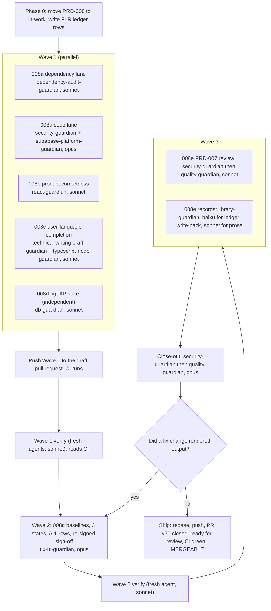

# PRD-008: Finish-Line Hardening

> **Status:** Complete. Delivered in draft pull request #74 (branch `claude/gauntlet-prd-008`); the merge is pending the owner. Authored 2026-09-30; moved from `backlog/` to `in-work/` at Gauntlet start and from `in-work/` to `completed/` at its end, both on 2026-10-01. In `EXECUTION_LEDGER.md` 62 of the 74 `FLR` rows read VERIFIED at `211b519`. The other 12 close at ship and are listed under "Ledger status at the exit move" below. The full `pnpm verify`, including `pnpm test:db`, is green on `5585ee9`. Before the merge, the owner applies the three PRD-008 migrations to the hosted database ([operator checklist](../../../knowledge/private/operations/finish-line-operator-checklist.md) step 0).
> **Priority:** P0. Every item here is open on `main` at `131c7f4`. One of them, the dependency audit, currently fails the canonical gate for every new pull request. All of them can be closed inside the repository.
> **Effort:** L (1-3d of agent time across five sub-PRDs, no operator time)
> **Schema changes:** Additive (008a widens one rate-limit scope list; 008d adds a pgTAP suite and no schema)
> **Close-out:** `security-guardian` then `quality-guardian` on the final tree, never reversed

---

## Overview

The authorized product is merged and the hosted app works:

- first-party sign-in (PR #67, `58d77fd`);
- the tenant-backed Open House Boost flow (PRD-003, PRs #54, #55, #57, and #58);
- the dashboard and homeowner reports (PRD-007, PRs #69, #71, #72).

The canonical gate was green on `main` at `131c7f4` on 2026-09-24 (run `35972386828`). What remains splits cleanly in two.

The first half needs a person, an account, or a credential: Vercel and Developer Portal access, the HighLevel App Test, the isolated review database for PRD-005e, RentCast and Resend keys, KMS, Meta, billing, and counsel. None of it can be closed by an agent, and none of it is in this PRD. It is consolidated, in dependency order, in the [finish-line operator checklist](../../../knowledge/private/operations/finish-line-operator-checklist.md).

The second half is in this PRD. A review of the repository on 2026-09-30 found:

- **The dependency gate fails.** Against the advisory database on 2026-09-30, `pnpm audit` reports 21 advisories on the `131c7f4` lockfile: 1 Critical, 6 High, 11 Moderate, and 3 Low. `pnpm verify` runs `pnpm audit --audit-level=high` and CI has no path filter, so every new pull request, even a documentation-only one, now fails `Application verification`.
  - The Critical is GHSA-vcvr-r3jv-pc5j, remote code execution in `next/og` `ImageResponse`, affecting `next` `>=16.2.0 <16.3.6`; `apps/web` pins `16.3.3`. The application does not import `next/og` or `ImageResponse` and has no `opengraph-image` route, so by the advisory's own statement the deployed app is not affected. It still blocks the gate.
  - The Highs and Moderates sit in `trigger.dev`'s tree (`brace-expansion`, `fast-uri`, `ip-address`) and in `jsdom`'s tree (`undici`).
  - Two of them (`fast-uri` GHSA-58mr-gqgx-xq4g High and `ip-address` GHSA-2vr4-cq9g-pvrc Moderate) are open Dependabot alerts #40 and #42, which Dependabot cannot fix because both are transitive.
- **PR #70 cannot merge.** The open Dependabot group PR (17 updates, including `next` 16.3.6) fails four screenshot test cases from two test definitions in `tests/browser/design-quality.spec.ts` (`:98` and `:323`, each in Light and Dark).
- **Security findings are still in code.** Two Medium and six Low findings from the PRD-005/006 batch security audit remain. The Mediums keep `FSG-008` (`CRR-096`) open.
- **An approved version records an image nobody supplied.** Every saved Open House Boost version records an approved property image the loan officer never supplied (`apps/web/src/server/open-house-draft.ts:120-126`).
- **The approve control stays live after approval.** It keeps offering approval after the approval is recorded, until a reload. This is the PRD-006 QA warning "After a successful approval the campaign detail screen still says 'Ready for approval' and re-offers the approve button".
- **The user-language guard misses strings.** It does not reach the homeowner report server messages, and one temporary exclusion (`packages/application/src/reporting.ts`) is still open.
- **The newest migration has no pgTAP suite** (`20260924010000_homeowner_reports`).
- **Three named design states (24 cells) and two A-1 rows (8 cells) were never photographed.** This leaves `FSG-006`, `006C-AC-020`, `006D-AC-012`, and `006D-AC-015` partial.
- **Records no longer match what merged.** Sub-PRD status lines still read Draft after merging, ledger cells were never written back, PRD-007 has no independent review, and the README still describes a Phase 0 scaffold.

PRD-008 closes all of it, so that the only open items left anywhere in the repository are operator and external rows, each with an exact ask.

This PRD does not authorize production traffic, a deployment, an environment-variable change, a provider call, or any change to the 28 `DEFERRED: LIVE HIGHLEVEL AUTH` rows. G1, G4, and G8 remain `ACCEPTED CONSTRAINT`.

---

## Goals

- `pnpm audit --audit-level=moderate` reports nothing at Moderate or above on the final head (008A-AC-003), so the canonical gate is green again for every pull request, and the lockfile resolves Dependabot alerts #40 and #42.
- Zero open Critical, High, or Medium security findings on the final tree, so `FSG-008` (`CRR-096`) can close on its own wording.
- Every statement the product makes about a campaign is true: no fabricated approved asset in an approved version, and no approve control offered for a version that is already decided.
- The user-language guard reaches every module whose strings reach a signed-in screen, with no temporary exclusion left.
- Every migration has a pgTAP suite, and every named design state has a photographed baseline and a signed pass.
- Every status line, ledger cell, and map entry matches what actually merged. PRD-007 has an independent security and quality review. The agent terrain map points at this PRD and the operator checklist.

## Non-Goals

- Anything in the [finish-line operator checklist](../../../knowledge/private/operations/finish-line-operator-checklist.md): deployed qualification (PRD-005e, `CRR-006`, `CRR-076` to `CRR-084`, `CRR-088`), `GGL-B01` to `GGL-B14`, PRD-007 live activation, Wave 1 G2, and Waves 2 to 7.
- Moving PRD-001, PRD-003, PRD-004, PRD-005, PRD-006, or PRD-007 to `completed/`. Each still has operator-blocked rows. This PRD corrects their status lines; it does not change their lifecycle.
- A property-photo upload feature. 008b stops recording a fabricated image; real image intake needs storage configuration and is a future PRD.
- Credential-stuffing detection (WAF or audit-row alerting, security audit Ruling 4). It is a deployment control required before real customer accounts and is listed in the operator checklist.
- PRD-002 add-ons beyond the PRD-007 slice already authorized.
- Refreshing the Guild `security-weapon` CVE intelligence (audit follow-up 7). That lives in the Neeson repository, not here.

---

## Sub-features

| Sub-PRD | Scope | Status |
|---|---|---|
| [`prd-008a-finish-line-hardening-security-and-dependency-closure`](./prd-008a-finish-line-hardening-security-and-dependency-closure.md) | Dependency audit to zero, the PR #70 group, two Medium and six Low audit findings, the missing-header log severity | Complete. 21 of 23 criteria VERIFIED; `008A-AC-003` and `008A-AC-007` close at ship |
| [`prd-008b-finish-line-hardening-product-correctness`](./prd-008b-finish-line-hardening-product-correctness.md) | No fabricated approved image, the approve control after a decision, `/brand` independent of the reports flag, leftover demo slug | Complete. All 11 criteria VERIFIED |
| [`prd-008c-finish-line-hardening-user-language-completion`](./prd-008c-finish-line-hardening-user-language-completion.md) | Guard reaches `server/homeowners`, rewrite flagged strings, remove the `reporting.ts` exclusion | Complete. All 7 criteria VERIFIED |
| [`prd-008d-finish-line-hardening-verification-depth`](./prd-008d-finish-line-hardening-verification-depth.md) | Homeowner pgTAP suite, one baseline redraw after all UI and dependency changes, the three unphotographed states and A-1 rows, re-signed sign-off | Complete. All 11 criteria VERIFIED |
| [`prd-008e-finish-line-hardening-records-and-independent-review`](./prd-008e-finish-line-hardening-records-and-independent-review.md) | Status-line and ledger reconciliation, README boundary rewrite, maps, 004E re-audit, PRD-007 independent review, PR #72 release record | Complete. 10 of 15 criteria VERIFIED; `008E-AC-004`, `008E-AC-006`, `008E-AC-007`, `008E-AC-010`, and `008E-AC-014` close at ship |

### Ledger status at the exit move

Counted from `EXECUTION_LEDGER.md` at `211b519`: 62 of the 74 `FLR` rows are VERIFIED. The other 12 are below, with what closes each. None needs a product change, an operator, or a credential. The scope contract's "Lifecycle at exit" row moves the folder once every criterion is VERIFIED. The move was made with these 12 still open at the orchestrator's direction, because each closes at ship in the same pull request.

| Row | Criterion | Ledger status | What closes it |
|---|---|---|---|
| `FLR-001` | `FLH-001` | OPEN | Every criterion VERIFIED by a pass other than its implementer. It closes after the rows below. |
| `FLR-002` | `FLH-002` | DONE | `pnpm verify` and `pnpm test:db` are green on `5585ee9`. The push, the four required checks, and `MERGEABLE` on the final head come at ship. |
| `FLR-004` | `FLH-004` | OPEN | The [close-out quality report](./qa/2026-10-01-closeout-quality-report.md) said FIX FIRST on one records Medium (M-1, `008E-AC-004`). The write-back it asked for is done. The row closes after a pass other than the orchestrator re-checks it. |
| `FLR-006` | `FLH-006` | OPEN | The close-out quality report records PASS (a row-by-row diff of the ledger statuses). The orchestrator writes the row. |
| `FLR-007` | `FLH-007` | OPEN | The close-out quality report records PASS (no U+2014 or U+2013 in any added line). The orchestrator writes the row. |
| `FLR-010` | `008A-AC-003` | DONE | `pnpm audit` is re-run on the final head at ship. It was clean at moderate and low on `6f24a14`. |
| `FLR-014` | `008A-AC-007` | DONE | Comment on PR #70 and close it as superseded, at ship. The lockfile half is verified. |
| `FLR-060` | `008E-AC-004` | DONE | The write-back of the held `CRR` rows is done. The row closes after the same independent re-check as `FLR-004`. |
| `FLR-062` | `008E-AC-006` | DONE | The close-out quality report records PASS and says the row can move to VERIFIED. The orchestrator writes the row. |
| `FLR-063` | `008E-AC-007` | DONE | The same. |
| `FLR-066` | `008E-AC-010` | DONE | The same. |
| `FLR-070` | `008E-AC-014` | OPEN | This move to `completed/`, with every inbound link and lifecycle label repaired in the same commit. |

## Dependency order

1. **Wave 1, in parallel:**
   - **008a dependency lane.** The gate cannot go green without it, so it lands first and alone owns `pnpm-lock.yaml` and every `package.json`.
   - **008a code lane.**
   - **008b.**
   - **008c.**

   The four lanes own disjoint files:
   - **008a dependency:** `pnpm-lock.yaml`, `pnpm-workspace.yaml`, every `package.json`.
   - **008a code:** the auth handler, the rate-limit migration, the approval command, the email preview, the support modules, the version route, and the PRD-005e Amendments section.
   - **008b:** the draft-builder server, the approval controls, the brand page, the demo slug route, and a new `apps/web/src/copy/campaign-image-messages.ts` for its sentences.
   - **008c:** the homeowner server messages, `apps/web/src/copy/user-language.ts`, `apps/web/src/copy/forbidden-vocabulary.ts`, the reporting copy, and the guard test.

   **Wave 1 lanes never edit `EXECUTION_LEDGER.md`.** Each lane puts its ledger content in its lane report:
   - the dependency lane: advisory dispositions, and any screenshot mismatch by picture name;
   - the code lane: the `CRR-075` text change.

   The orchestrator alone writes the ledger. Screenshot comparisons may fail during Wave 1 because of the dependency lane. The orchestrator records those failures as attributed to the lane, and no baseline is redrawn in Wave 1.
2. **Wave 2: 008d after every Wave 1 criterion is VERIFIED.** The pgTAP suite can start as soon as Wave 1 begins, because it touches only `supabase/tests/`. The screenshot baselines are redrawn exactly once for the Wave 1 change set. A later fix that changes rendered output is redrawn again only under `008D-AC-011`.
3. **Wave 3: 008e last.** Its reconciliation cites the commits, CI runs, and reports that Waves 1 and 2 actually produced. Its PRD-007 independent review runs on the tree after 008c changes the homeowner strings.
4. **Close-out:** `security-guardian`, then `quality-guardian`, on the final tree. Security fixes to auth, session, CSRF, rate-limit, or dependency code invalidate a prior quality result.

---

## Acceptance criteria

Module-level criteria. Sub-PRD criteria use the `008X-AC-NNN` scheme inside each file.

| ID | Criterion |
|---|---|
| FLH-001 | Every `008A-AC-*`, `008B-AC-*`, `008C-AC-*`, `008D-AC-*`, and `008E-AC-*` criterion is VERIFIED by a pass other than the one that implemented it. |
| FLH-002 | On the final tree, `pnpm verify` and `pnpm test:db` are green. The pull request's four required checks are green on its final head: `Application verification`, `Real PostgreSQL migrations and pgTAP`, `Release and recovery contract`, and `Preview smoke contract`. `gh pr view --json mergeable,mergeStateStatus` reports `MERGEABLE` against current `origin/main`. |
| FLH-003 | `security-guardian` runs on the final tree before `quality-guardian` and reports zero unresolved Critical, High, or Medium findings, in code and in `pnpm audit`. Its report is in this PRD's `qa/` folder. |
| FLH-004 | `quality-guardian` then audits the final tree against this PRD and reports every criterion passing. Its report is in this PRD's `qa/` folder. |
| FLH-005 | No HighLevel, Meta, Stripe, RentCast, Resend, or lead-routing side effect is newly enabled by default. `tests/security/provider-side-effect-default-off.test.ts` passes, unchanged or strengthened. |
| FLH-006 | No row with any of these statuses changes status in this PRD: `DEFERRED: LIVE HIGHLEVEL AUTH`, `BLOCKED: EXTERNAL EVIDENCE`, `BLOCKED: G5`, `ACCEPTED CONSTRAINT`, or an operator-blocked `CRR` or `GGL-B` row. The only exception is a citation-backed DONE to VERIFIED write-back recorded by 008e. |
| FLH-007 | Searching the files this PRD adds or changes for U+2014 and U+2013 finds none, except inside code, regex, JSON, or quoted literal data. |

---

## Owner decisions (defaults applied)

The repository records two choices as the product owner's. This PRD applies the conservative default for each so the run can reach 100%. **The product owner confirmed both defaults on 2026-09-30.** Treat them as decided, not as open overrides.

| Decision | Default applied | Alternative | Criteria affected |
|---|---|---|---|
| OD-1. `FSG-008` (`CRR-096`) requires no unresolved Medium finding, and the batch audit left two. | **Fix both Mediums** (008a). `FSG-008` then closes on its own wording. Confirmed by the product owner, 2026-09-30. | Amend `FSG-008` to `ARR-008`'s Critical/High wording and track the Mediums as follow-ups. | `008A-AC-010` to `008A-AC-015`, `008E-AC-004` |
| OD-2. The password denylist is generated, not observed (Low). | **Record the Low as an accepted residual** with the rationale already in the audit. Nothing is downloaded. Confirmed by the product owner, 2026-09-30. | Approve fetching SecLists `10-million-password-list-top-10000.txt` (MIT) and replacing the generated list. | `008A-AC-022` |

---

## Gauntlet scope contract

This section is the Phase 0 input for `/the-gauntlet-glove` or `/the-raid`. A run that follows it should not need to make a scoping decision.

| Field | Value |
|---|---|
| In-scope PRDs | PRD-008 only (this folder). Move it to `library/requirements/in-work/` as the run's first commit, and repair every inbound link and lifecycle label in the same commit (`008E-AC-014`). |
| Honest completion bound | 100% of PRD-008's criteria can be closed in the repository. No criterion depends on an operator, a credential, or a live provider. A run that ends with an open PRD-008 criterion has failed. It may park a criterion as externally blocked only by naming a new fact this PRD did not know. |
| Base | `origin/main`. On 2026-09-30 the product owner chose operator checklist item 0.4: the authoring pull request (#73, documentation only) merges to `main` with the ruleset bypass. Its `Application verification` check fails at `audit:dependencies` for exactly the reason 008a fixes. Branch the run from `origin/main` after #73 merges. Fetch first, and if `main` has moved beyond #73, rebase and re-check the open-item list in the Overview. If #73 is somehow still open when the run starts, continue on its branch instead and ship the documents and the fixes as one pull request. |
| Local prerequisites | Node `24.18.0` (pinned in `.nvmrc`), pnpm `11.15.1` through Corepack, and Docker Desktop with the engine running. The README forbids continuing on a mismatched toolchain.  **Status on the authoring machine (2026-09-30):** - Docker Desktop is running. - Node `24.18.0` is installed through `fnm`, with Corepack enabled for it. - `~/.bashrc` and the PowerShell profile select it automatically inside this repository; every other folder keeps the system Node `22.19.0`. - A shell or agent session started before that setup does not see it. Phase 0 runs `node --version` inside the repository, and if it is not `v24.18.0`, starts a fresh session or runs `source ~/.bashrc` before every command.  If Docker is unavailable, the `Real PostgreSQL migrations and pgTAP` CI check is the authoritative `pnpm test:db` proof, and the run says so in the ledger. `gh` must be authenticated with `repo` and `workflow` scope and push rights to `jzferrell26/operation-automated-lo`, because the run pushes, dispatches `screen-baselines.yml`, and comments on and closes PR #70. Phase 0 checks this before Wave 1. |
| Ledger | Append a section to `EXECUTION_LEDGER.md` titled "Gauntlet raid: finish-line hardening (PRD-008)", with one row per criterion using the row prefix `FLR-`. Do not create a new root ledger file. |
| Actions authorized during the run | Commit and push the run branch after each wave, keeping one draft pull request open from Wave 1 onward. `FLH-002`, `008A-AC-007`, and `008D-AC-009` need that pull request, and `Preview smoke contract` runs only on pull requests. Dispatch `screen-baselines.yml` on the branch and download its artifacts. Comment on PR #70 and close it as superseded at ship, once the run's pull request number exists. Mark the pull request ready for review at ship. A Vercel Preview build that a push triggers automatically is not a deployment this PRD performs. |
| Actions not authorized | Merging the pull request. Any write to Vercel, Supabase, Resend, RentCast, HighLevel, Meta, or Stripe. Changing any deployment environment variable. Running `supabase link`, a linked command, or `supabase config push`. Dismissing a Dependabot alert by hand. |
| Verification commands | `pnpm verify` (the full offline gate, including `pnpm audit --audit-level=high`); `pnpm test:db` (Docker, real PostgreSQL 17, every migration, every pgTAP suite, the Postgres route suites); then the pull request's four required checks. |
| Lifecycle at exit | If every criterion is VERIFIED and the close-out is clean, move this folder to `library/requirements/completed/` in the final commit, repairing inbound links and labels again (`008E-AC-014`). Otherwise leave it in `in-work/`. |

### Wave plan and model routing

Model tiers follow `~/.claude/model-comparison-matrix.md` ("Claude Code mapping"). `opus`, `sonnet`, and `haiku` resolve to the newest model of each tier in the harness.

| Lane | Guardian | Model | Why this tier |
|---|---|---|---|
| 008a dependency | `dependency-audit-guardian` | sonnet | A well-specified lockfile change with an exact pass condition (`pnpm audit` clean). |
| 008a code | `security-guardian`, with `supabase-platform-guardian` for the migration | opus | Auth and rate-limit changes cascade if wrong, and the timing-oracle fix needs judgment about what the recovery suite proves. |
| 008b | `react-guardian` | sonnet | Well-specified UI and server changes in a few files. |
| 008c | `technical-writing-craft-guardian`, `typescript-node-guardian` | sonnet | A copy rewrite plus a guard extension against an existing contract. |
| 008d pgTAP | `db-guardian` | sonnet | Bounded test authoring against one migration. |
| 008d baselines | `ux-ui-guardian` | opus | Judging every changed picture against the rubric is the step where a wrong call ships. |
| 008e ledger write-back | `library-guardian` | haiku | Mechanical cell updates from an existing QA table. |
| 008e prose and PRD-007 review | `library-guardian`, `security-guardian`, `quality-guardian` | sonnet | Reconciliation and a scoped audit. |
| Close-out | `security-guardian` then `quality-guardian` | opus | The final gate on the whole tree. |

---

## Data model changes

008a widens the `platform.auth_rate_limits` scope check constraint, and the inline scope guard in `platform.consume_auth_rate_limit`, to admit `change_password_user`. It follows the shape of `supabase/migrations/20260919190000_verification_resend.sql:60-71`. This is one new additive migration; no table, column, or existing scope changes. 008d adds `supabase/tests/homeowner_reports.pgtap.sql` and no schema.

## API changes

- `POST /api/auth/change-password` can answer `429` with the existing rate-limit response shape (008a).
- `POST /api/auth/forgot-password` keeps its byte-identical body; only its timing behaviour changes (008a).
- `GET /api/version` returns only `environment`, `buildId`, and `commit` to every caller. The route takes no request and resolves no principal, and no authenticated variant is added. `005E-AC-003` is amended to match, and `005E-AC-004` still holds (008a).
- No new route.

---

## Open questions

- [x] None blocking. The product owner confirmed OD-1 and OD-2 on 2026-09-30.

---

## Related

- [Finish-line operator checklist](../../../knowledge/private/operations/finish-line-operator-checklist.md): everything outside this PRD, in dependency order.
- [PRD-005/006 batch security audit](../../in-work/prd-006-first-party-sign-in-and-guided-experience/qa/2026-09-19-batch-security-audit.md): the source of the 008a code findings.
- [PRD-006 QA report](../../in-work/prd-006-first-party-sign-in-and-guided-experience/qa/2026-09-19-prd-006-qa-report.md): the source of the warnings "Three named D3 states have no capture and therefore no recorded pass" and "After a successful approval the campaign detail screen still says 'Ready for approval' and re-offers the approve button".
- [Design quality sign-off](../../../../docs/operations/evidence-packs/design-quality-signoff.md): S-1, S-2, S-3, and A-1.
- [PRD-007 final completion audit](../../in-work/prd-007-homeowner-reports/reports/2026-09-24-final-completion-audit.md).
- [Project map](../../../knowledge/private/product/project-map.md) and the [agent terrain map](../../../../.cursor/rules/core/the-map.mdc).
