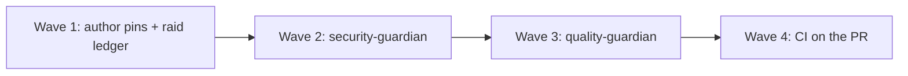

# Actions Major Raid

**Date:** 2026-09-03
**Owner:** `devops-guardian` (SHA pins) + `dependency-audit-guardian` (major-bump triage)
**Closeout:** `security-guardian` then `quality-guardian` (never reverse)
**Base:** `main` @ `0eff5f5` (PR #39)
**Branch:** `cursor/actions-major-ac42`

## Why this raid exists

Dependabot correctly opened majors for GitHub-owned Actions after hygiene PR #31. Those PRs (#32 cache 4→6, #33 checkout 4→7, #34 setup-node 5→7) were closed as an unreviewed first-run flood, not because the upgrades were fake. This raid is the planned, SHA-pinned follow-up.

`@types/node` 26, jsdom 30, and jest-dom 7 stay out of scope. Types must track Node `24.18.0`. Test-harness majors are a later dedicated bump.

## Wave plan

| Wave | Work | Model | Exit |
| --- | --- | --- | --- |
| 1 | Pin checkout / cache / setup-node; author this ledger | Orchestrator (mechanical SHA rewrite) | All AM-* rows implemented in `.github/workflows/ci.yml` |
| 2 | `security-guardian` delta on the branch | `security-guardian` | Report with zero medium+ open |
| 3 | `quality-guardian` against this plan | `quality-guardian` | Report with zero medium+ open |
| 4 | Phase 0 CI | GitHub-hosted | All four required checks SUCCESS |

## Breaking-change notes (reviewed)

| Action | From | To | Why it is safe here |
| --- | --- | --- | --- |
| `actions/checkout` | v4.2.2 | v7.0.1 | v7 refuses fork code on `pull_request_target` / `workflow_run`. This workflow uses `pull_request`, `push`, and `workflow_dispatch` only. `persist-credentials: false` stays. |
| `actions/cache` | v4.3.0 | v6.1.0 | v5 is Node 24 action runtime; v6 is ESM internals. `with:` path / key / restore-keys stay the same. |
| `actions/setup-node` | v5.0.0 | v7.0.0 | v5 default package-manager cache is already disabled here. v7 dummy `NODE_AUTH_TOKEN` removal does not apply: we do not set `registry-url`. `node-version: 24.18.0` stays. |

Pins (resolved 2026-09-03 from latest GitHub releases, peeled tag → commit):

- `actions/checkout@3d3c42e5aac5ba805825da76410c181273ba90b1` # v7.0.1
- `actions/cache@55cc8345863c7cc4c66a329aec7e433d2d1c52a9` # v6.1.0
- `actions/setup-node@820762786026740c76f36085b0efc47a31fe5020` # v7.0.0

## Acceptance criteria

| ID | Criterion | Status |
| --- | --- | --- |
| AM-001 | Every `actions/checkout` use in `.github/workflows/ci.yml` is SHA-pinned to v7.0.1 `3d3c42e5aac5ba805825da76410c181273ba90b1` with a version comment | DONE |
| AM-002 | Every checkout step keeps `persist-credentials: false` | DONE |
| AM-003 | Every `actions/setup-node` use is SHA-pinned to v7.0.0 `820762786026740c76f36085b0efc47a31fe5020` with a version comment | DONE |
| AM-004 | Every setup-node step keeps `node-version: 24.18.0` and `package-manager-cache: false` | DONE |
| AM-005 | Every `actions/cache` use is SHA-pinned to v6.1.0 `55cc8345863c7cc4c66a329aec7e433d2d1c52a9` with a version comment | DONE |
| AM-006 | Cache `path`, `key`, and `restore-keys` are unchanged | DONE |
| AM-007 | Workflow `on:` stays `pull_request` / `push` / `workflow_dispatch`. No `pull_request_target` or `workflow_run` | DONE |
| AM-008 | Workflow-level and job-level `permissions: contents: read` stay | DONE |
| AM-009 | Diff does not bump npm majors (`@types/node`, jsdom, `@testing-library/jest-dom`) or application code | DONE |
| AM-010 | `security-guardian` report exists for this branch and has no open Medium or higher | OPEN |
| AM-011 | `quality-guardian` report exists for this branch, run after security, and has no open Medium or higher | OPEN |

## Non-goals

| ID | Item |
| --- | --- |
| NG-001 | Do not take `@types/node` 26 while `engines.node` is `24.18.0` |
| NG-002 | Do not bump jsdom 30 or jest-dom 7 in this raid |
| NG-003 | Do not replay Dependabot #35 npm minors |
| NG-004 | Do not reopen G1 / G4 / G8 or flip deferred HighLevel ACs |
| NG-005 | Do not claim production traffic authorized |
| NG-006 | Do not change CI job commands, concurrency, or required check names |

## Honesty bounds

No deferred ACs flipped. No production traffic. No invented live HighLevel / Meta / Stripe / KMS / counsel evidence.
